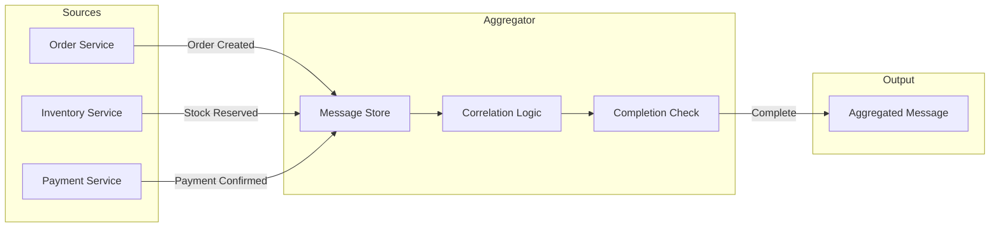
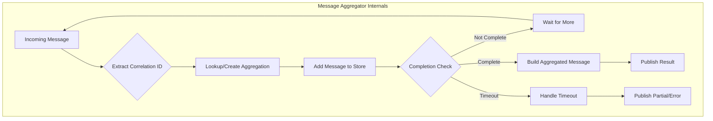
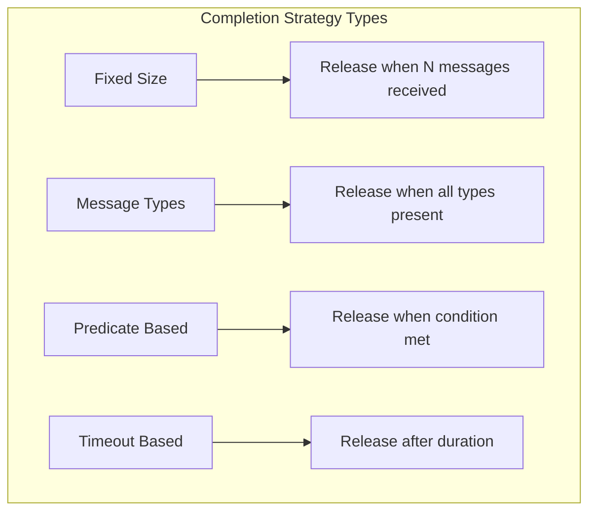
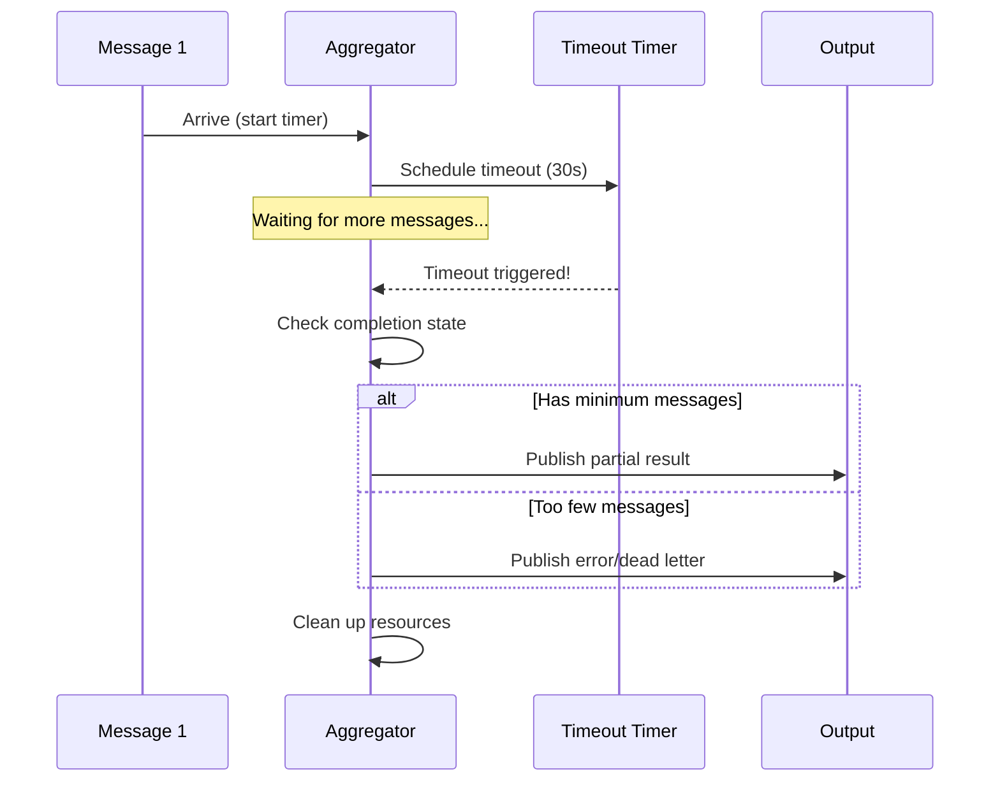
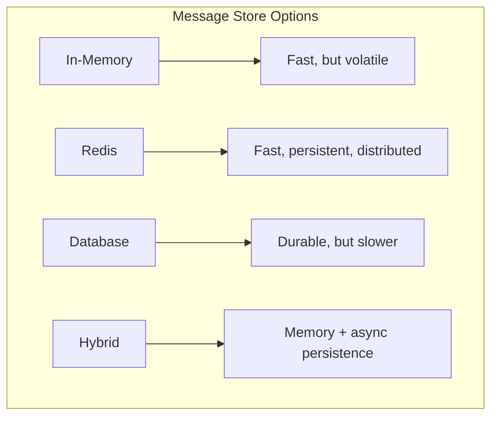
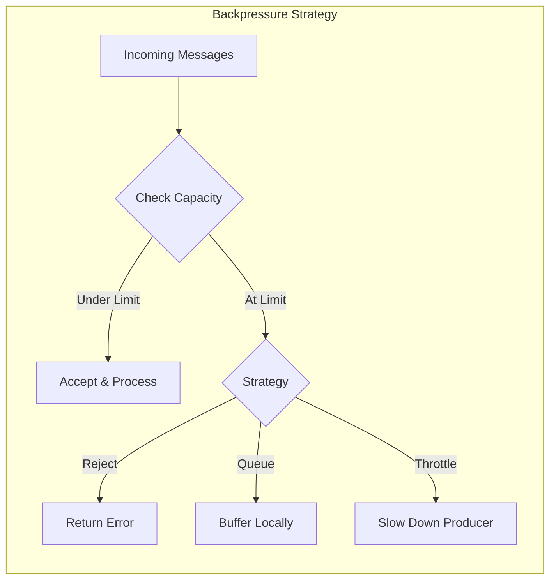

# How to Create Message Aggregator

Author: [nawazdhandala](https://github.com/nawazdhandala)

Tags: Message Queues, Integration Patterns, Design Patterns, Backend

Description: Learn how to implement the message aggregator pattern for combining related messages.

---

In distributed systems, you often need to collect multiple related messages and combine them into a single, cohesive message for downstream processing. This is the essence of the **Message Aggregator** pattern, one of the most powerful enterprise integration patterns.

This guide walks through the core concepts, implementation strategies, and practical code examples you can use in production.

---

## Table of Contents

1. What is the Message Aggregator Pattern?
2. Core Components
3. Correlation ID Strategy
4. Completion Strategies
5. Timeout Handling
6. Implementation in TypeScript
7. Message Store Design
8. Handling Edge Cases
9. Production Considerations
10. Complete Working Example

---

## 1. What is the Message Aggregator Pattern?

The Message Aggregator is a stateful pattern that collects and stores individual messages until a complete set of related messages has been received. Once complete, it combines them into a single aggregated message and publishes it downstream.



**When to use it:**
- Combining responses from multiple microservices
- Collecting data from parallel processing pipelines
- Assembling complete documents from partial updates
- Building composite responses from scatter-gather operations

---

## 2. Core Components

Every message aggregator consists of these essential components:

| Component | Purpose | Key Consideration |
|-----------|---------|-------------------|
| **Correlation ID** | Groups related messages together | Must be present in all messages |
| **Message Store** | Holds partial aggregations | Needs persistence for reliability |
| **Completion Strategy** | Determines when aggregation is done | Business logic dependent |
| **Timeout Handler** | Handles incomplete aggregations | Prevents memory leaks |
| **Aggregation Logic** | Combines messages into result | Domain specific transformation |



---

## 3. Correlation ID Strategy

The correlation ID is the foundation of message aggregation. It ties related messages together across distributed systems.

### Choosing a Correlation Strategy

```typescript
// correlation-strategies.ts

/**
 * Different strategies for correlating messages in an aggregator.
 * Choose based on your business requirements.
 */

// Strategy 1: Single field correlation
// Use when one identifier uniquely groups messages
interface SingleFieldCorrelation {
  orderId: string;
}

// Strategy 2: Composite correlation
// Use when multiple fields together identify a group
interface CompositeCorrelation {
  customerId: string;
  sessionId: string;
  batchId: string;
}

// Strategy 3: Hierarchical correlation
// Use for nested aggregations (e.g., order -> line items -> variants)
interface HierarchicalCorrelation {
  parentId: string;
  childId: string;
  level: number;
}

/**
 * Extracts correlation ID from incoming messages.
 * Handles multiple message formats gracefully.
 */
function extractCorrelationId(message: unknown): string {
  // Type guard for safety
  if (!message || typeof message !== 'object') {
    throw new Error('Invalid message format: expected object');
  }

  const msg = message as Record<string, unknown>;

  // Check common correlation ID field names
  const correlationFields = [
    'correlationId',
    'correlation_id',
    'orderId',
    'order_id',
    'transactionId',
    'transaction_id',
    'batchId',
    'batch_id'
  ];

  for (const field of correlationFields) {
    if (msg[field] && typeof msg[field] === 'string') {
      return msg[field] as string;
    }
  }

  // Check nested headers (common in message queue systems)
  if (msg.headers && typeof msg.headers === 'object') {
    const headers = msg.headers as Record<string, unknown>;
    if (headers.correlationId) {
      return headers.correlationId as string;
    }
  }

  throw new Error('No correlation ID found in message');
}

/**
 * Generates a composite correlation key from multiple fields.
 * Useful when no single field uniquely identifies a message group.
 */
function buildCompositeCorrelationKey(
  fields: Record<string, string | number>
): string {
  // Sort keys for consistent ordering
  const sortedKeys = Object.keys(fields).sort();

  // Build deterministic key
  const keyParts = sortedKeys.map(key => `${key}:${fields[key]}`);

  return keyParts.join('|');
}

export {
  extractCorrelationId,
  buildCompositeCorrelationKey,
  SingleFieldCorrelation,
  CompositeCorrelation,
  HierarchicalCorrelation
};
```

### Best Practices for Correlation IDs

1. **Use UUIDs or ULIDs** for generated IDs (sortable, unique, no collisions)
2. **Propagate consistently** across all services in the flow
3. **Include in logs** for debugging aggregation issues
4. **Validate early** to reject messages without valid correlation

---

## 4. Completion Strategies

The completion strategy determines when an aggregation is "done" and ready for output. This is often the most complex part of the aggregator.



### Implementation of Common Strategies

```typescript
// completion-strategies.ts

/**
 * Represents a partially aggregated message group.
 */
interface AggregationState<T> {
  correlationId: string;
  messages: T[];
  messageTypes: Set<string>;
  createdAt: Date;
  lastUpdatedAt: Date;
  metadata: Record<string, unknown>;
}

/**
 * Result of a completion check.
 */
interface CompletionResult {
  isComplete: boolean;
  reason?: string;
}

/**
 * Base interface for completion strategies.
 */
interface CompletionStrategy<T> {
  check(state: AggregationState<T>): CompletionResult;
}

/**
 * Strategy 1: Fixed Size Completion
 * Completes when exactly N messages have been collected.
 *
 * Use case: Collecting responses from a known number of parallel workers.
 */
class FixedSizeStrategy<T> implements CompletionStrategy<T> {
  constructor(private readonly expectedCount: number) {
    if (expectedCount < 1) {
      throw new Error('Expected count must be at least 1');
    }
  }

  check(state: AggregationState<T>): CompletionResult {
    const currentCount = state.messages.length;

    if (currentCount >= this.expectedCount) {
      return {
        isComplete: true,
        reason: `Reached expected count of ${this.expectedCount} messages`
      };
    }

    return {
      isComplete: false,
      reason: `Have ${currentCount}/${this.expectedCount} messages`
    };
  }
}

/**
 * Strategy 2: Message Type Completion
 * Completes when all required message types are present.
 *
 * Use case: Combining order, payment, and shipping confirmations.
 */
class MessageTypeStrategy<T> implements CompletionStrategy<T> {
  private readonly requiredTypes: Set<string>;

  constructor(requiredTypes: string[]) {
    if (requiredTypes.length === 0) {
      throw new Error('At least one required type must be specified');
    }
    this.requiredTypes = new Set(requiredTypes);
  }

  check(state: AggregationState<T>): CompletionResult {
    const missingTypes: string[] = [];

    for (const requiredType of this.requiredTypes) {
      if (!state.messageTypes.has(requiredType)) {
        missingTypes.push(requiredType);
      }
    }

    if (missingTypes.length === 0) {
      return {
        isComplete: true,
        reason: 'All required message types received'
      };
    }

    return {
      isComplete: false,
      reason: `Missing message types: ${missingTypes.join(', ')}`
    };
  }
}

/**
 * Strategy 3: Predicate Based Completion
 * Completes when a custom predicate returns true.
 *
 * Use case: Complex business rules (e.g., total amount exceeds threshold).
 */
class PredicateStrategy<T> implements CompletionStrategy<T> {
  constructor(
    private readonly predicate: (state: AggregationState<T>) => boolean,
    private readonly description: string
  ) {}

  check(state: AggregationState<T>): CompletionResult {
    const isComplete = this.predicate(state);

    return {
      isComplete,
      reason: isComplete
        ? `Predicate satisfied: ${this.description}`
        : `Predicate not satisfied: ${this.description}`
    };
  }
}

/**
 * Strategy 4: Composite Completion
 * Combines multiple strategies with AND/OR logic.
 *
 * Use case: Need all message types AND minimum count.
 */
class CompositeStrategy<T> implements CompletionStrategy<T> {
  constructor(
    private readonly strategies: CompletionStrategy<T>[],
    private readonly operator: 'AND' | 'OR'
  ) {
    if (strategies.length === 0) {
      throw new Error('At least one strategy must be provided');
    }
  }

  check(state: AggregationState<T>): CompletionResult {
    const results = this.strategies.map(s => s.check(state));
    const reasons = results.map(r => r.reason).filter(Boolean);

    if (this.operator === 'AND') {
      const allComplete = results.every(r => r.isComplete);
      return {
        isComplete: allComplete,
        reason: reasons.join(' AND ')
      };
    } else {
      const anyComplete = results.some(r => r.isComplete);
      return {
        isComplete: anyComplete,
        reason: reasons.join(' OR ')
      };
    }
  }
}

export {
  AggregationState,
  CompletionResult,
  CompletionStrategy,
  FixedSizeStrategy,
  MessageTypeStrategy,
  PredicateStrategy,
  CompositeStrategy
};
```

---

## 5. Timeout Handling

Timeouts are critical for preventing memory leaks and handling failure scenarios. Without proper timeout handling, incomplete aggregations will consume resources indefinitely.



### Timeout Handler Implementation

```typescript
// timeout-handler.ts

import { EventEmitter } from 'events';

/**
 * Configuration for timeout behavior.
 */
interface TimeoutConfig {
  // Maximum time to wait for aggregation completion
  aggregationTimeoutMs: number;

  // Minimum messages required to publish partial result
  minMessagesForPartial: number;

  // Whether to publish partial results on timeout
  publishPartialOnTimeout: boolean;

  // Interval for checking stale aggregations
  cleanupIntervalMs: number;
}

/**
 * Default timeout configuration.
 */
const DEFAULT_TIMEOUT_CONFIG: TimeoutConfig = {
  aggregationTimeoutMs: 30000,      // 30 seconds
  minMessagesForPartial: 1,         // At least 1 message
  publishPartialOnTimeout: true,    // Publish what we have
  cleanupIntervalMs: 5000           // Check every 5 seconds
};

/**
 * Events emitted by the timeout handler.
 */
interface TimeoutEvents {
  'timeout': (correlationId: string, state: unknown) => void;
  'partial-release': (correlationId: string, state: unknown) => void;
  'expired': (correlationId: string, reason: string) => void;
}

/**
 * Manages timeouts for message aggregations.
 * Uses a combination of per-aggregation timers and periodic cleanup.
 */
class TimeoutHandler extends EventEmitter {
  private readonly config: TimeoutConfig;
  private readonly timers: Map<string, NodeJS.Timeout>;
  private readonly startTimes: Map<string, number>;
  private cleanupInterval: NodeJS.Timeout | null = null;

  constructor(config: Partial<TimeoutConfig> = {}) {
    super();
    this.config = { ...DEFAULT_TIMEOUT_CONFIG, ...config };
    this.timers = new Map();
    this.startTimes = new Map();
  }

  /**
   * Starts tracking timeout for a new aggregation.
   */
  startTimer(correlationId: string, onTimeout: () => void): void {
    // Clear existing timer if present (idempotent)
    this.clearTimer(correlationId);

    // Record start time for age calculations
    this.startTimes.set(correlationId, Date.now());

    // Set individual timer
    const timer = setTimeout(() => {
      this.handleTimeout(correlationId, onTimeout);
    }, this.config.aggregationTimeoutMs);

    // Prevent timer from keeping Node.js process alive
    timer.unref();

    this.timers.set(correlationId, timer);
  }

  /**
   * Clears timeout for a completed aggregation.
   */
  clearTimer(correlationId: string): void {
    const timer = this.timers.get(correlationId);
    if (timer) {
      clearTimeout(timer);
      this.timers.delete(correlationId);
    }
    this.startTimes.delete(correlationId);
  }

  /**
   * Resets timer when new message arrives (sliding window).
   * Use this for "inactivity" based timeouts.
   */
  resetTimer(correlationId: string, onTimeout: () => void): void {
    // Only reset if already tracking this correlation
    if (this.timers.has(correlationId)) {
      this.startTimer(correlationId, onTimeout);
    }
  }

  /**
   * Gets the age of an aggregation in milliseconds.
   */
  getAgeMs(correlationId: string): number {
    const startTime = this.startTimes.get(correlationId);
    if (!startTime) {
      return 0;
    }
    return Date.now() - startTime;
  }

  /**
   * Checks if an aggregation has exceeded its timeout.
   */
  isExpired(correlationId: string): boolean {
    return this.getAgeMs(correlationId) > this.config.aggregationTimeoutMs;
  }

  /**
   * Starts the periodic cleanup process.
   * Call this when the aggregator starts.
   */
  startCleanupProcess(
    getActiveCorrelationIds: () => string[],
    onStaleFound: (correlationId: string) => void
  ): void {
    if (this.cleanupInterval) {
      return; // Already running
    }

    this.cleanupInterval = setInterval(() => {
      const activeIds = getActiveCorrelationIds();

      for (const correlationId of activeIds) {
        if (this.isExpired(correlationId)) {
          onStaleFound(correlationId);
        }
      }
    }, this.config.cleanupIntervalMs);

    // Prevent cleanup from keeping process alive
    this.cleanupInterval.unref();
  }

  /**
   * Stops the cleanup process.
   * Call this when the aggregator shuts down.
   */
  stopCleanupProcess(): void {
    if (this.cleanupInterval) {
      clearInterval(this.cleanupInterval);
      this.cleanupInterval = null;
    }

    // Clear all active timers
    for (const [correlationId] of this.timers) {
      this.clearTimer(correlationId);
    }
  }

  /**
   * Internal handler for timeout events.
   */
  private handleTimeout(correlationId: string, onTimeout: () => void): void {
    this.timers.delete(correlationId);

    // Emit event for monitoring/logging
    this.emit('timeout', correlationId);

    // Execute the callback
    onTimeout();
  }

  /**
   * Returns current stats for monitoring.
   */
  getStats(): { activeTimers: number; oldestAgeMs: number } {
    let oldestAgeMs = 0;

    for (const [correlationId] of this.startTimes) {
      const age = this.getAgeMs(correlationId);
      if (age > oldestAgeMs) {
        oldestAgeMs = age;
      }
    }

    return {
      activeTimers: this.timers.size,
      oldestAgeMs
    };
  }
}

export {
  TimeoutConfig,
  DEFAULT_TIMEOUT_CONFIG,
  TimeoutHandler
};
```

---

## 6. Implementation in TypeScript

Now let us put all the components together into a complete, production-ready message aggregator.

```typescript
// message-aggregator.ts

import { EventEmitter } from 'events';
import {
  AggregationState,
  CompletionStrategy,
  CompletionResult
} from './completion-strategies';
import { TimeoutHandler, TimeoutConfig } from './timeout-handler';
import { extractCorrelationId } from './correlation-strategies';

/**
 * Configuration for the message aggregator.
 */
interface AggregatorConfig<T, R> {
  // Strategy to determine when aggregation is complete
  completionStrategy: CompletionStrategy<T>;

  // Function to extract message type for type-based completion
  getMessageType: (message: T) => string;

  // Function to combine messages into final result
  aggregateMessages: (messages: T[]) => R;

  // Timeout configuration
  timeout: Partial<TimeoutConfig>;

  // Maximum number of concurrent aggregations (memory protection)
  maxConcurrentAggregations: number;
}

/**
 * Default aggregator configuration.
 */
const DEFAULT_AGGREGATOR_CONFIG = {
  maxConcurrentAggregations: 10000
};

/**
 * Result of adding a message to the aggregator.
 */
interface AddMessageResult<R> {
  status: 'pending' | 'complete' | 'rejected';
  correlationId: string;
  result?: R;
  error?: string;
}

/**
 * A stateful message aggregator that collects related messages
 * and combines them when completion criteria are met.
 *
 * @example
 * ```typescript
 * const aggregator = new MessageAggregator({
 *   completionStrategy: new MessageTypeStrategy(['order', 'payment', 'shipping']),
 *   getMessageType: (msg) => msg.type,
 *   aggregateMessages: (messages) => ({
 *     combined: true,
 *     data: messages
 *   }),
 *   timeout: { aggregationTimeoutMs: 30000 }
 * });
 *
 * aggregator.on('complete', (result) => {
 *   console.log('Aggregation complete:', result);
 * });
 *
 * await aggregator.addMessage({ correlationId: '123', type: 'order', data: {} });
 * ```
 */
class MessageAggregator<T extends { correlationId: string }, R> extends EventEmitter {
  private readonly config: AggregatorConfig<T, R> & typeof DEFAULT_AGGREGATOR_CONFIG;
  private readonly store: Map<string, AggregationState<T>>;
  private readonly timeoutHandler: TimeoutHandler;

  constructor(config: AggregatorConfig<T, R>) {
    super();
    this.config = { ...DEFAULT_AGGREGATOR_CONFIG, ...config };
    this.store = new Map();
    this.timeoutHandler = new TimeoutHandler(config.timeout);

    // Start background cleanup
    this.timeoutHandler.startCleanupProcess(
      () => Array.from(this.store.keys()),
      (correlationId) => this.handleTimeout(correlationId)
    );
  }

  /**
   * Adds a message to the aggregator.
   * Returns immediately with status; emits 'complete' event when done.
   */
  async addMessage(message: T): Promise<AddMessageResult<R>> {
    const correlationId = extractCorrelationId(message);

    // Check capacity
    if (!this.store.has(correlationId) &&
        this.store.size >= this.config.maxConcurrentAggregations) {
      return {
        status: 'rejected',
        correlationId,
        error: 'Maximum concurrent aggregations reached'
      };
    }

    // Get or create aggregation state
    let state = this.store.get(correlationId);

    if (!state) {
      state = this.createNewState(correlationId);
      this.store.set(correlationId, state);

      // Start timeout timer for new aggregation
      this.timeoutHandler.startTimer(correlationId, () => {
        this.handleTimeout(correlationId);
      });
    }

    // Add message to state
    state.messages.push(message);
    state.messageTypes.add(this.config.getMessageType(message));
    state.lastUpdatedAt = new Date();

    // Check completion
    const completionResult = this.config.completionStrategy.check(state);

    if (completionResult.isComplete) {
      return this.completeAggregation(correlationId, state);
    }

    // Still waiting for more messages
    return {
      status: 'pending',
      correlationId
    };
  }

  /**
   * Gets the current state of an aggregation (for debugging/monitoring).
   */
  getState(correlationId: string): AggregationState<T> | undefined {
    return this.store.get(correlationId);
  }

  /**
   * Gets statistics about the aggregator.
   */
  getStats(): {
    activeAggregations: number;
    timeoutStats: { activeTimers: number; oldestAgeMs: number };
  } {
    return {
      activeAggregations: this.store.size,
      timeoutStats: this.timeoutHandler.getStats()
    };
  }

  /**
   * Gracefully shuts down the aggregator.
   * Completes or expires all pending aggregations.
   */
  async shutdown(): Promise<void> {
    this.timeoutHandler.stopCleanupProcess();

    // Handle all pending aggregations
    for (const [correlationId] of this.store) {
      this.handleTimeout(correlationId);
    }

    this.emit('shutdown');
  }

  /**
   * Creates initial state for a new aggregation.
   */
  private createNewState(correlationId: string): AggregationState<T> {
    return {
      correlationId,
      messages: [],
      messageTypes: new Set(),
      createdAt: new Date(),
      lastUpdatedAt: new Date(),
      metadata: {}
    };
  }

  /**
   * Completes an aggregation and cleans up resources.
   */
  private completeAggregation(
    correlationId: string,
    state: AggregationState<T>
  ): AddMessageResult<R> {
    // Clear timeout
    this.timeoutHandler.clearTimer(correlationId);

    // Aggregate messages
    const result = this.config.aggregateMessages(state.messages);

    // Clean up state
    this.store.delete(correlationId);

    // Emit completion event
    this.emit('complete', {
      correlationId,
      result,
      messageCount: state.messages.length,
      durationMs: Date.now() - state.createdAt.getTime()
    });

    return {
      status: 'complete',
      correlationId,
      result
    };
  }

  /**
   * Handles timeout for an incomplete aggregation.
   */
  private handleTimeout(correlationId: string): void {
    const state = this.store.get(correlationId);

    if (!state) {
      return; // Already completed or expired
    }

    // Clear timeout (may have been triggered by cleanup)
    this.timeoutHandler.clearTimer(correlationId);

    // Clean up state
    this.store.delete(correlationId);

    // Emit timeout event with partial data
    this.emit('timeout', {
      correlationId,
      messages: state.messages,
      messageCount: state.messages.length,
      missingTypes: this.getMissingTypes(state),
      durationMs: Date.now() - state.createdAt.getTime()
    });
  }

  /**
   * Determines which message types are missing (if using type-based completion).
   */
  private getMissingTypes(state: AggregationState<T>): string[] {
    // This is a simplified check; real implementation would
    // query the completion strategy for expected types
    return [];
  }
}

export {
  MessageAggregator,
  AggregatorConfig,
  AddMessageResult
};
```

---

## 7. Message Store Design

For production systems, you need persistent storage to survive restarts and scale horizontally.



### Redis-Backed Message Store

```typescript
// redis-message-store.ts

import { Redis } from 'ioredis';
import { AggregationState } from './completion-strategies';

/**
 * Configuration for the Redis message store.
 */
interface RedisStoreConfig {
  // Redis key prefix for namespacing
  keyPrefix: string;

  // TTL for aggregation keys (cleanup safety net)
  keyTtlSeconds: number;

  // Redis connection
  redis: Redis;
}

/**
 * A Redis-backed message store for distributed aggregation.
 *
 * Key structure:
 * - {prefix}:state:{correlationId} - Hash with aggregation metadata
 * - {prefix}:messages:{correlationId} - List of serialized messages
 * - {prefix}:types:{correlationId} - Set of message types seen
 */
class RedisMessageStore<T> {
  private readonly config: RedisStoreConfig;
  private readonly redis: Redis;

  constructor(config: RedisStoreConfig) {
    this.config = config;
    this.redis = config.redis;
  }

  /**
   * Creates or updates an aggregation state.
   */
  async upsertState(correlationId: string, message: T, messageType: string): Promise<void> {
    const stateKey = this.getStateKey(correlationId);
    const messagesKey = this.getMessagesKey(correlationId);
    const typesKey = this.getTypesKey(correlationId);
    const now = Date.now();

    // Use transaction for atomicity
    const pipeline = this.redis.pipeline();

    // Update state metadata
    pipeline.hsetnx(stateKey, 'createdAt', now.toString());
    pipeline.hset(stateKey, 'lastUpdatedAt', now.toString());
    pipeline.hincrby(stateKey, 'messageCount', 1);

    // Add message to list
    pipeline.rpush(messagesKey, JSON.stringify(message));

    // Add message type to set
    pipeline.sadd(typesKey, messageType);

    // Set TTL on all keys (safety net for cleanup)
    pipeline.expire(stateKey, this.config.keyTtlSeconds);
    pipeline.expire(messagesKey, this.config.keyTtlSeconds);
    pipeline.expire(typesKey, this.config.keyTtlSeconds);

    await pipeline.exec();
  }

  /**
   * Retrieves the current aggregation state.
   */
  async getState(correlationId: string): Promise<AggregationState<T> | null> {
    const stateKey = this.getStateKey(correlationId);
    const messagesKey = this.getMessagesKey(correlationId);
    const typesKey = this.getTypesKey(correlationId);

    // Fetch all data in parallel
    const [stateData, messagesData, typesData] = await Promise.all([
      this.redis.hgetall(stateKey),
      this.redis.lrange(messagesKey, 0, -1),
      this.redis.smembers(typesKey)
    ]);

    // Check if state exists
    if (!stateData || Object.keys(stateData).length === 0) {
      return null;
    }

    // Deserialize messages
    const messages: T[] = messagesData.map(m => JSON.parse(m));

    return {
      correlationId,
      messages,
      messageTypes: new Set(typesData),
      createdAt: new Date(parseInt(stateData.createdAt, 10)),
      lastUpdatedAt: new Date(parseInt(stateData.lastUpdatedAt, 10)),
      metadata: {}
    };
  }

  /**
   * Deletes an aggregation state (after completion or timeout).
   */
  async deleteState(correlationId: string): Promise<void> {
    const keys = [
      this.getStateKey(correlationId),
      this.getMessagesKey(correlationId),
      this.getTypesKey(correlationId)
    ];

    await this.redis.del(...keys);
  }

  /**
   * Gets all active correlation IDs (for cleanup process).
   */
  async getActiveCorrelationIds(): Promise<string[]> {
    const pattern = `${this.config.keyPrefix}:state:*`;
    const keys = await this.redis.keys(pattern);

    return keys.map(key => {
      const parts = key.split(':');
      return parts[parts.length - 1];
    });
  }

  /**
   * Acquires a distributed lock for processing an aggregation.
   * Prevents duplicate completion in multi-instance deployments.
   */
  async acquireLock(
    correlationId: string,
    ttlMs: number
  ): Promise<boolean> {
    const lockKey = `${this.config.keyPrefix}:lock:${correlationId}`;
    const result = await this.redis.set(
      lockKey,
      '1',
      'PX',
      ttlMs,
      'NX'
    );
    return result === 'OK';
  }

  /**
   * Releases a distributed lock.
   */
  async releaseLock(correlationId: string): Promise<void> {
    const lockKey = `${this.config.keyPrefix}:lock:${correlationId}`;
    await this.redis.del(lockKey);
  }

  private getStateKey(correlationId: string): string {
    return `${this.config.keyPrefix}:state:${correlationId}`;
  }

  private getMessagesKey(correlationId: string): string {
    return `${this.config.keyPrefix}:messages:${correlationId}`;
  }

  private getTypesKey(correlationId: string): string {
    return `${this.config.keyPrefix}:types:${correlationId}`;
  }
}

export { RedisMessageStore, RedisStoreConfig };
```

---

## 8. Handling Edge Cases

Real-world aggregators must handle many edge cases gracefully.

### Duplicate Message Handling

```typescript
// duplicate-handling.ts

/**
 * Strategies for handling duplicate messages in aggregation.
 */
enum DuplicateStrategy {
  // Reject duplicates silently
  IGNORE = 'IGNORE',

  // Replace old message with new one
  REPLACE = 'REPLACE',

  // Keep both (may cause over-aggregation)
  ALLOW = 'ALLOW',

  // Throw error on duplicate
  REJECT = 'REJECT'
}

/**
 * Checks if a message is a duplicate based on message ID.
 */
interface DuplicateChecker<T> {
  isDuplicate(state: { messages: T[] }, newMessage: T): boolean;
  getMessageId(message: T): string;
}

/**
 * Default duplicate checker using a messageId field.
 */
class DefaultDuplicateChecker<T extends { messageId: string }>
  implements DuplicateChecker<T> {

  isDuplicate(state: { messages: T[] }, newMessage: T): boolean {
    const newId = this.getMessageId(newMessage);
    return state.messages.some(m => this.getMessageId(m) === newId);
  }

  getMessageId(message: T): string {
    return message.messageId;
  }
}

/**
 * Handles duplicate messages according to configured strategy.
 */
function handleDuplicate<T>(
  state: { messages: T[] },
  newMessage: T,
  strategy: DuplicateStrategy,
  checker: DuplicateChecker<T>
): { shouldAdd: boolean; updatedMessages?: T[] } {

  if (!checker.isDuplicate(state, newMessage)) {
    return { shouldAdd: true };
  }

  switch (strategy) {
    case DuplicateStrategy.IGNORE:
      return { shouldAdd: false };

    case DuplicateStrategy.REPLACE:
      const newId = checker.getMessageId(newMessage);
      const filtered = state.messages.filter(
        m => checker.getMessageId(m) !== newId
      );
      return {
        shouldAdd: true,
        updatedMessages: [...filtered, newMessage]
      };

    case DuplicateStrategy.ALLOW:
      return { shouldAdd: true };

    case DuplicateStrategy.REJECT:
      throw new Error(
        `Duplicate message rejected: ${checker.getMessageId(newMessage)}`
      );

    default:
      return { shouldAdd: false };
  }
}

export {
  DuplicateStrategy,
  DuplicateChecker,
  DefaultDuplicateChecker,
  handleDuplicate
};
```

### Out-of-Order Message Handling

```typescript
// ordering.ts

/**
 * Reorders messages based on sequence number or timestamp.
 * Call this before aggregation to ensure consistent ordering.
 */
function reorderMessages<T>(
  messages: T[],
  getSequence: (message: T) => number
): T[] {
  return [...messages].sort((a, b) => getSequence(a) - getSequence(b));
}

/**
 * Detects gaps in message sequences.
 * Returns missing sequence numbers.
 */
function detectGaps<T>(
  messages: T[],
  getSequence: (message: T) => number,
  expectedStart: number,
  expectedEnd: number
): number[] {
  const received = new Set(messages.map(getSequence));
  const missing: number[] = [];

  for (let i = expectedStart; i <= expectedEnd; i++) {
    if (!received.has(i)) {
      missing.push(i);
    }
  }

  return missing;
}

export { reorderMessages, detectGaps };
```

---

## 9. Production Considerations

### Monitoring and Observability

```typescript
// monitoring.ts

/**
 * Metrics to track for message aggregator health.
 */
interface AggregatorMetrics {
  // Counter: Total messages received
  messagesReceived: number;

  // Counter: Successful aggregations completed
  aggregationsCompleted: number;

  // Counter: Aggregations that timed out
  aggregationsTimedOut: number;

  // Gauge: Current number of pending aggregations
  pendingAggregations: number;

  // Histogram: Aggregation duration in milliseconds
  aggregationDurationMs: number[];

  // Histogram: Messages per aggregation
  messagesPerAggregation: number[];
}

/**
 * Creates OpenTelemetry-compatible metrics instrumentation.
 */
function createMetricsInstrumentation(aggregator: any): void {
  // Example using OpenTelemetry metrics API
  // In practice, wire this up to your metrics backend

  aggregator.on('complete', (event: any) => {
    // Record successful completion
    // meter.createCounter('aggregator.completed').add(1);
    // meter.createHistogram('aggregator.duration').record(event.durationMs);
    // meter.createHistogram('aggregator.message_count').record(event.messageCount);

    console.log(`[METRIC] aggregation.complete`, {
      correlationId: event.correlationId,
      durationMs: event.durationMs,
      messageCount: event.messageCount
    });
  });

  aggregator.on('timeout', (event: any) => {
    // Record timeout
    // meter.createCounter('aggregator.timeout').add(1);

    console.log(`[METRIC] aggregation.timeout`, {
      correlationId: event.correlationId,
      durationMs: event.durationMs,
      messageCount: event.messageCount
    });
  });
}

export { AggregatorMetrics, createMetricsInstrumentation };
```

### Backpressure and Rate Limiting



```typescript
// backpressure.ts

/**
 * Simple token bucket rate limiter for incoming messages.
 */
class TokenBucket {
  private tokens: number;
  private lastRefill: number;

  constructor(
    private readonly capacity: number,
    private readonly refillRate: number // tokens per second
  ) {
    this.tokens = capacity;
    this.lastRefill = Date.now();
  }

  /**
   * Attempts to consume a token.
   * Returns true if successful, false if rate limited.
   */
  tryConsume(): boolean {
    this.refill();

    if (this.tokens >= 1) {
      this.tokens -= 1;
      return true;
    }

    return false;
  }

  private refill(): void {
    const now = Date.now();
    const elapsed = (now - this.lastRefill) / 1000;
    const newTokens = elapsed * this.refillRate;

    this.tokens = Math.min(this.capacity, this.tokens + newTokens);
    this.lastRefill = now;
  }
}

export { TokenBucket };
```

---

## 10. Complete Working Example

Here is a complete example that ties everything together. This example aggregates order events from multiple services.

```typescript
// example-order-aggregator.ts

import { EventEmitter } from 'events';

// ============================================
// Type Definitions
// ============================================

interface OrderEvent {
  correlationId: string;
  messageId: string;
  type: 'order_created' | 'payment_processed' | 'inventory_reserved' | 'shipping_scheduled';
  timestamp: number;
  data: Record<string, unknown>;
}

interface AggregatedOrder {
  orderId: string;
  events: OrderEvent[];
  summary: {
    orderCreatedAt: number;
    paymentAmount?: number;
    inventoryItems?: string[];
    shippingMethod?: string;
    totalProcessingTimeMs: number;
  };
}

// ============================================
// Aggregation State
// ============================================

interface OrderAggregationState {
  correlationId: string;
  events: OrderEvent[];
  eventTypes: Set<string>;
  createdAt: number;
  lastUpdatedAt: number;
}

// ============================================
// Order Aggregator Implementation
// ============================================

class OrderAggregator extends EventEmitter {
  // Configuration
  private readonly requiredEventTypes = new Set([
    'order_created',
    'payment_processed',
    'inventory_reserved',
    'shipping_scheduled'
  ]);

  private readonly timeoutMs = 30000; // 30 seconds
  private readonly maxConcurrent = 1000;

  // State storage
  private readonly states = new Map<string, OrderAggregationState>();
  private readonly timers = new Map<string, NodeJS.Timeout>();
  private readonly seenMessageIds = new Map<string, Set<string>>();

  constructor() {
    super();
  }

  /**
   * Processes an incoming order event.
   */
  async processEvent(event: OrderEvent): Promise<void> {
    const { correlationId, messageId, type } = event;

    // Check for duplicate message
    if (this.isDuplicate(correlationId, messageId)) {
      console.log(`[SKIP] Duplicate message: ${messageId}`);
      return;
    }

    // Check capacity
    if (!this.states.has(correlationId) && this.states.size >= this.maxConcurrent) {
      throw new Error('Aggregator at capacity, try again later');
    }

    // Get or create state
    let state = this.states.get(correlationId);

    if (!state) {
      state = this.createState(correlationId);
      this.states.set(correlationId, state);
      this.startTimeout(correlationId);

      console.log(`[NEW] Started aggregation for: ${correlationId}`);
    }

    // Add event to state
    state.events.push(event);
    state.eventTypes.add(type);
    state.lastUpdatedAt = Date.now();

    // Track message ID for deduplication
    this.trackMessageId(correlationId, messageId);

    console.log(`[ADD] Event ${type} added to ${correlationId} (${state.events.length} total)`);

    // Check for completion
    if (this.isComplete(state)) {
      await this.completeAggregation(correlationId);
    }
  }

  /**
   * Gets current statistics.
   */
  getStats(): { pending: number; completed: number; timedOut: number } {
    return {
      pending: this.states.size,
      completed: 0, // Track via metrics in production
      timedOut: 0   // Track via metrics in production
    };
  }

  /**
   * Gracefully shuts down the aggregator.
   */
  async shutdown(): Promise<void> {
    console.log('[SHUTDOWN] Stopping aggregator...');

    // Clear all timers
    for (const [correlationId, timer] of this.timers) {
      clearTimeout(timer);
      this.timers.delete(correlationId);
    }

    // Handle remaining aggregations
    for (const [correlationId] of this.states) {
      await this.handleTimeout(correlationId);
    }

    console.log('[SHUTDOWN] Complete');
  }

  // ============================================
  // Private Methods
  // ============================================

  private createState(correlationId: string): OrderAggregationState {
    return {
      correlationId,
      events: [],
      eventTypes: new Set(),
      createdAt: Date.now(),
      lastUpdatedAt: Date.now()
    };
  }

  private isDuplicate(correlationId: string, messageId: string): boolean {
    const seen = this.seenMessageIds.get(correlationId);
    return seen ? seen.has(messageId) : false;
  }

  private trackMessageId(correlationId: string, messageId: string): void {
    let seen = this.seenMessageIds.get(correlationId);
    if (!seen) {
      seen = new Set();
      this.seenMessageIds.set(correlationId, seen);
    }
    seen.add(messageId);
  }

  private isComplete(state: OrderAggregationState): boolean {
    // Check if all required event types are present
    for (const required of this.requiredEventTypes) {
      if (!state.eventTypes.has(required)) {
        return false;
      }
    }
    return true;
  }

  private startTimeout(correlationId: string): void {
    const timer = setTimeout(() => {
      this.handleTimeout(correlationId);
    }, this.timeoutMs);

    timer.unref(); // Do not keep process alive
    this.timers.set(correlationId, timer);
  }

  private clearTimeout(correlationId: string): void {
    const timer = this.timers.get(correlationId);
    if (timer) {
      clearTimeout(timer);
      this.timers.delete(correlationId);
    }
  }

  private async completeAggregation(correlationId: string): Promise<void> {
    const state = this.states.get(correlationId);
    if (!state) return;

    // Clear timeout
    this.clearTimeout(correlationId);

    // Build aggregated result
    const result = this.buildAggregatedOrder(state);

    // Clean up
    this.states.delete(correlationId);
    this.seenMessageIds.delete(correlationId);

    console.log(`[COMPLETE] Aggregation finished for: ${correlationId}`);

    // Emit result
    this.emit('complete', result);
  }

  private async handleTimeout(correlationId: string): Promise<void> {
    const state = this.states.get(correlationId);
    if (!state) return;

    // Clear timeout
    this.clearTimeout(correlationId);

    // Determine what is missing
    const missing: string[] = [];
    for (const required of this.requiredEventTypes) {
      if (!state.eventTypes.has(required)) {
        missing.push(required);
      }
    }

    // Clean up
    this.states.delete(correlationId);
    this.seenMessageIds.delete(correlationId);

    console.log(`[TIMEOUT] Aggregation expired for: ${correlationId}, missing: ${missing.join(', ')}`);

    // Emit timeout event with partial data
    this.emit('timeout', {
      correlationId,
      partialEvents: state.events,
      missingTypes: missing,
      durationMs: Date.now() - state.createdAt
    });
  }

  private buildAggregatedOrder(state: OrderAggregationState): AggregatedOrder {
    // Sort events by timestamp
    const sortedEvents = [...state.events].sort((a, b) => a.timestamp - b.timestamp);

    // Extract data from each event type
    const orderEvent = sortedEvents.find(e => e.type === 'order_created');
    const paymentEvent = sortedEvents.find(e => e.type === 'payment_processed');
    const inventoryEvent = sortedEvents.find(e => e.type === 'inventory_reserved');
    const shippingEvent = sortedEvents.find(e => e.type === 'shipping_scheduled');

    return {
      orderId: state.correlationId,
      events: sortedEvents,
      summary: {
        orderCreatedAt: orderEvent?.timestamp || state.createdAt,
        paymentAmount: paymentEvent?.data.amount as number | undefined,
        inventoryItems: inventoryEvent?.data.items as string[] | undefined,
        shippingMethod: shippingEvent?.data.method as string | undefined,
        totalProcessingTimeMs: Date.now() - state.createdAt
      }
    };
  }
}

// ============================================
// Usage Example
// ============================================

async function main(): Promise<void> {
  const aggregator = new OrderAggregator();

  // Listen for completed aggregations
  aggregator.on('complete', (order: AggregatedOrder) => {
    console.log('\n========== AGGREGATED ORDER ==========');
    console.log(JSON.stringify(order, null, 2));
    console.log('=======================================\n');
  });

  // Listen for timeouts
  aggregator.on('timeout', (data) => {
    console.log('\n========== TIMEOUT ==========');
    console.log(`Order ${data.correlationId} timed out`);
    console.log(`Missing events: ${data.missingTypes.join(', ')}`);
    console.log(`Partial events received: ${data.partialEvents.length}`);
    console.log('==============================\n');
  });

  // Simulate incoming events (in random order)
  const orderId = 'order-12345';

  console.log('\n--- Simulating event stream ---\n');

  // Payment arrives first (out of order)
  await aggregator.processEvent({
    correlationId: orderId,
    messageId: 'msg-002',
    type: 'payment_processed',
    timestamp: Date.now() + 100,
    data: { amount: 99.99, currency: 'USD' }
  });

  // Order created arrives
  await aggregator.processEvent({
    correlationId: orderId,
    messageId: 'msg-001',
    type: 'order_created',
    timestamp: Date.now(),
    data: { customerId: 'cust-789', items: ['item-a', 'item-b'] }
  });

  // Duplicate message (should be ignored)
  await aggregator.processEvent({
    correlationId: orderId,
    messageId: 'msg-001', // Same message ID
    type: 'order_created',
    timestamp: Date.now(),
    data: { customerId: 'cust-789', items: ['item-a', 'item-b'] }
  });

  // Inventory reserved
  await aggregator.processEvent({
    correlationId: orderId,
    messageId: 'msg-003',
    type: 'inventory_reserved',
    timestamp: Date.now() + 200,
    data: { items: ['item-a', 'item-b'], warehouse: 'WH-01' }
  });

  // Shipping scheduled (completes the aggregation)
  await aggregator.processEvent({
    correlationId: orderId,
    messageId: 'msg-004',
    type: 'shipping_scheduled',
    timestamp: Date.now() + 300,
    data: { method: 'express', estimatedDays: 2 }
  });

  // Clean shutdown
  await aggregator.shutdown();
}

// Run the example
main().catch(console.error);
```

### Running the Example

```bash
# Install dependencies
npm install typescript ts-node

# Run the example
npx ts-node example-order-aggregator.ts
```

Expected output:

```
--- Simulating event stream ---

[NEW] Started aggregation for: order-12345
[ADD] Event payment_processed added to order-12345 (1 total)
[ADD] Event order_created added to order-12345 (2 total)
[SKIP] Duplicate message: msg-001
[ADD] Event inventory_reserved added to order-12345 (3 total)
[ADD] Event shipping_scheduled added to order-12345 (4 total)
[COMPLETE] Aggregation finished for: order-12345

========== AGGREGATED ORDER ==========
{
  "orderId": "order-12345",
  "events": [...],
  "summary": {
    "orderCreatedAt": 1706000000000,
    "paymentAmount": 99.99,
    "inventoryItems": ["item-a", "item-b"],
    "shippingMethod": "express",
    "totalProcessingTimeMs": 5
  }
}
=======================================

[SHUTDOWN] Stopping aggregator...
[SHUTDOWN] Complete
```

---

## Summary

The Message Aggregator pattern is essential for building robust distributed systems. Key takeaways:

| Aspect | Recommendation |
|--------|----------------|
| **Correlation** | Use UUIDs, propagate consistently, validate early |
| **Completion** | Choose strategy based on business rules (size, types, predicate) |
| **Timeouts** | Always implement; prevents memory leaks and hung aggregations |
| **Storage** | Use Redis or database for production; in-memory for testing |
| **Duplicates** | Track message IDs; choose handling strategy (ignore, replace, reject) |
| **Monitoring** | Track pending count, completion rate, timeout rate, duration histogram |

The pattern adds complexity but provides crucial capabilities for collecting and combining distributed data. Start simple with in-memory storage and fixed-size completion, then evolve as requirements grow.

---

## See Also

- [Enterprise Integration Patterns](https://www.enterpriseintegrationpatterns.com/patterns/messaging/Aggregator.html) - The original pattern documentation
- [Message Queues and Async Processing](/blog/post/2025-08-20-three-pillars-of-observability-logs-metrics-traces) - Understanding distributed system observability
- [Traces and Spans in OpenTelemetry](/blog/post/2025-08-27-traces-and-spans-in-opentelemetry) - Tracing aggregator operations across services
