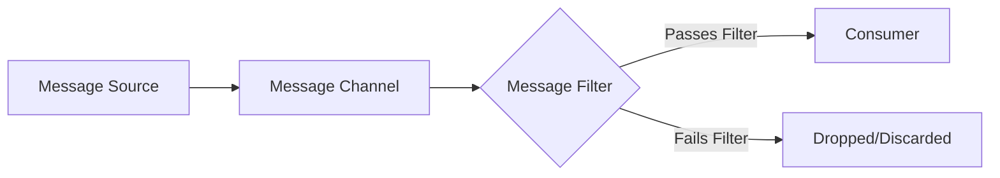
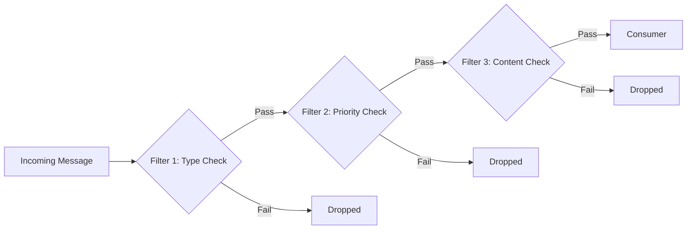
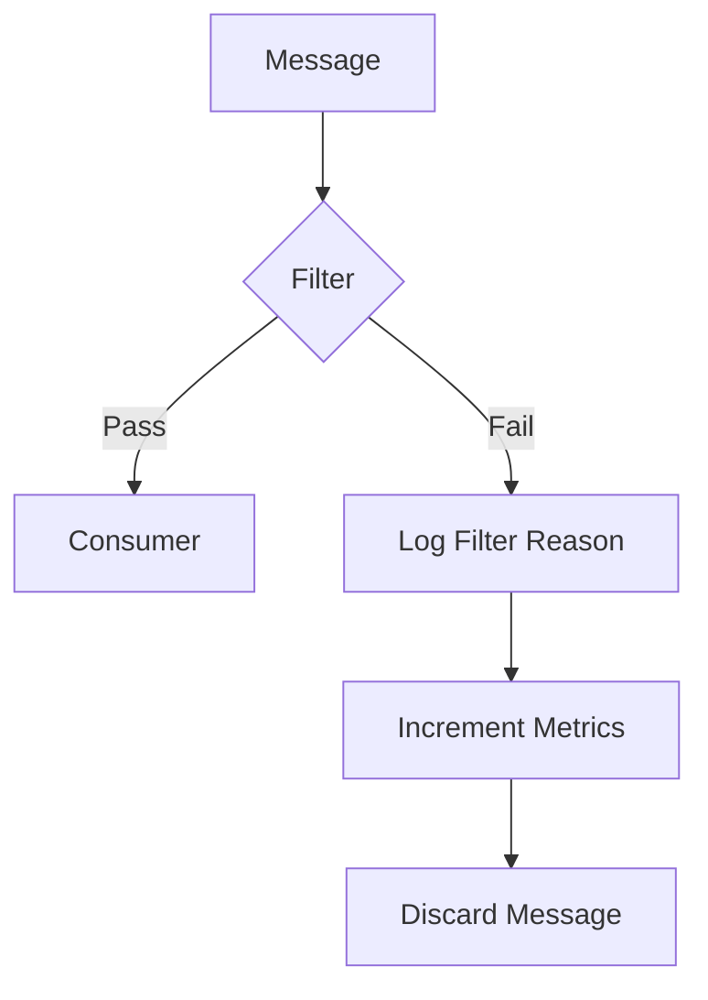
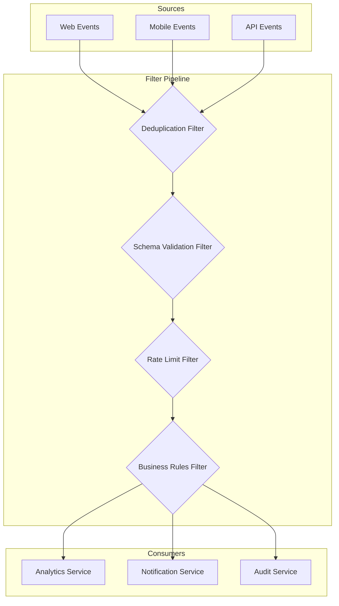
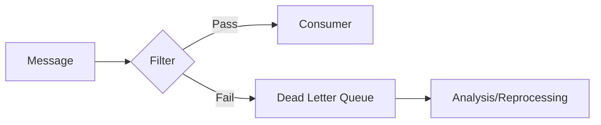

# How to Build Message Filter

Author: [nawazdhandala](https://github.com/nawazdhandala)

Tags: Message Queues, Integration Patterns, Design Patterns, Backend

Description: Learn how to implement message filters for selective message processing.

---

## Introduction

In distributed systems and message-driven architectures, not every message that arrives at a consumer needs to be processed. The **Message Filter** pattern allows you to selectively process messages based on specific criteria, discarding those that do not meet the requirements. This pattern is essential for building efficient, focused message consumers that only handle relevant data.

## What is a Message Filter?

A Message Filter is a component that sits between a message channel and a message consumer. It examines each incoming message against predefined criteria and only forwards messages that pass the filter. Messages that fail the criteria are dropped or routed elsewhere.



## Why Use Message Filters?

Message filters provide several benefits:

1. **Reduced Processing Load**: Consumers only process relevant messages
2. **Cleaner Business Logic**: Filtering logic is separated from processing logic
3. **Improved Performance**: Unwanted messages are discarded early in the pipeline
4. **Flexible Routing**: Different consumers can filter for different message types

## Basic Message Filter Implementation

Let us start with a simple message filter implementation in TypeScript.

```typescript
// Define the structure of a message
interface Message {
    id: string;
    type: string;
    priority: number;
    payload: Record<string, unknown>;
    timestamp: Date;
}

// Define the filter predicate type
type FilterPredicate<T> = (message: T) => boolean;

// Basic message filter class
class MessageFilter<T> {
    // Store the filter predicate function
    private predicate: FilterPredicate<T>;

    constructor(predicate: FilterPredicate<T>) {
        // Initialize with the provided predicate
        this.predicate = predicate;
    }

    // Filter a single message
    // Returns true if the message passes the filter
    public filter(message: T): boolean {
        return this.predicate(message);
    }

    // Filter an array of messages
    // Returns only messages that pass the filter
    public filterBatch(messages: T[]): T[] {
        return messages.filter(this.predicate);
    }
}

// Example usage: Create a filter for high-priority messages
const highPriorityFilter = new MessageFilter<Message>(
    (message) => message.priority >= 5
);

// Test message
const testMessage: Message = {
    id: "msg-001",
    type: "order",
    priority: 7,
    payload: { orderId: 12345 },
    timestamp: new Date()
};

// Check if the message passes the filter
if (highPriorityFilter.filter(testMessage)) {
    console.log("Message passed the filter, processing...");
} else {
    console.log("Message dropped by filter");
}
```

## Filter Criteria Types

Different scenarios require different types of filter criteria. Here are common filtering approaches:

### Content-Based Filtering

Filter messages based on their content or payload.

```typescript
// Interface for order messages
interface OrderMessage extends Message {
    payload: {
        orderId: number;
        amount: number;
        region: string;
        customerType: string;
    };
}

// Create a content-based filter for high-value orders
const highValueOrderFilter = new MessageFilter<OrderMessage>(
    (message) => {
        // Only process orders over $1000
        return message.payload.amount > 1000;
    }
);

// Create a region-specific filter
const usRegionFilter = new MessageFilter<OrderMessage>(
    (message) => {
        // Only process orders from US region
        return message.payload.region === "US";
    }
);

// Create a VIP customer filter
const vipCustomerFilter = new MessageFilter<OrderMessage>(
    (message) => {
        // Only process VIP customer orders
        return message.payload.customerType === "VIP";
    }
);
```

### Header-Based Filtering

Filter messages based on metadata or headers.

```typescript
// Extended message with headers
interface MessageWithHeaders extends Message {
    headers: {
        source: string;
        version: string;
        contentType: string;
        correlationId: string;
    };
}

// Filter based on message source
const trustedSourceFilter = new MessageFilter<MessageWithHeaders>(
    (message) => {
        // List of trusted sources
        const trustedSources = ["payment-service", "order-service", "inventory-service"];

        // Check if the message comes from a trusted source
        return trustedSources.includes(message.headers.source);
    }
);

// Filter based on API version
const versionFilter = new MessageFilter<MessageWithHeaders>(
    (message) => {
        // Only accept messages with version 2.x
        return message.headers.version.startsWith("2.");
    }
);
```

### Time-Based Filtering

Filter messages based on temporal criteria.

```typescript
// Filter for recent messages only
const recentMessageFilter = new MessageFilter<Message>(
    (message) => {
        // Calculate the age of the message
        const messageAge = Date.now() - message.timestamp.getTime();

        // Define maximum acceptable age (5 minutes in milliseconds)
        const maxAgeMs = 5 * 60 * 1000;

        // Only accept messages less than 5 minutes old
        return messageAge < maxAgeMs;
    }
);

// Filter for business hours only
const businessHoursFilter = new MessageFilter<Message>(
    (message) => {
        const hour = message.timestamp.getHours();

        // Only process messages during business hours (9 AM to 5 PM)
        return hour >= 9 && hour < 17;
    }
);
```

## Building Filter Chains

For complex filtering scenarios, you can chain multiple filters together. This allows for modular, reusable filter components.



```typescript
// Filter chain implementation
class FilterChain<T> {
    // Store an array of filters to apply in sequence
    private filters: MessageFilter<T>[] = [];

    // Add a filter to the chain
    public addFilter(filter: MessageFilter<T>): FilterChain<T> {
        this.filters.push(filter);
        // Return this for method chaining
        return this;
    }

    // Process a message through all filters
    // Returns true only if the message passes ALL filters
    public process(message: T): boolean {
        // Iterate through each filter in the chain
        for (const filter of this.filters) {
            // If any filter rejects the message, stop processing
            if (!filter.filter(message)) {
                return false;
            }
        }
        // Message passed all filters
        return true;
    }

    // Process a batch of messages
    // Returns only messages that pass all filters
    public processBatch(messages: T[]): T[] {
        return messages.filter((message) => this.process(message));
    }
}

// Example: Building a complex filter chain
const orderFilterChain = new FilterChain<OrderMessage>()
    // First filter: Check message type
    .addFilter(new MessageFilter((msg) => msg.type === "order"))
    // Second filter: Check priority level
    .addFilter(new MessageFilter((msg) => msg.priority >= 3))
    // Third filter: Check order amount
    .addFilter(new MessageFilter((msg) => msg.payload.amount > 100))
    // Fourth filter: Check region
    .addFilter(new MessageFilter((msg) => msg.payload.region !== "BLOCKED"));

// Process incoming order
const incomingOrder: OrderMessage = {
    id: "order-123",
    type: "order",
    priority: 5,
    payload: {
        orderId: 67890,
        amount: 250,
        region: "US",
        customerType: "Regular"
    },
    timestamp: new Date()
};

if (orderFilterChain.process(incomingOrder)) {
    console.log("Order accepted for processing");
} else {
    console.log("Order filtered out");
}
```

## Advanced Filter Patterns

### Composite Filters with OR Logic

Sometimes you need filters that pass if ANY condition is met, not ALL conditions.

```typescript
// Composite filter supporting AND/OR logic
class CompositeFilter<T> {
    private filters: MessageFilter<T>[] = [];
    private logic: "AND" | "OR";

    constructor(logic: "AND" | "OR" = "AND") {
        this.logic = logic;
    }

    // Add a filter to the composite
    public add(filter: MessageFilter<T>): CompositeFilter<T> {
        this.filters.push(filter);
        return this;
    }

    // Evaluate all filters based on the logic type
    public evaluate(message: T): boolean {
        if (this.logic === "AND") {
            // AND logic: all filters must pass
            return this.filters.every((f) => f.filter(message));
        } else {
            // OR logic: at least one filter must pass
            return this.filters.some((f) => f.filter(message));
        }
    }
}

// Example: Accept messages that are either high priority OR from VIP customers
const priorityOrVipFilter = new CompositeFilter<OrderMessage>("OR")
    .add(new MessageFilter((msg) => msg.priority >= 8))
    .add(new MessageFilter((msg) => msg.payload.customerType === "VIP"));

// Example: Accept messages that are high value AND recent
const highValueRecentFilter = new CompositeFilter<OrderMessage>("AND")
    .add(new MessageFilter((msg) => msg.payload.amount > 500))
    .add(new MessageFilter((msg) => {
        const age = Date.now() - msg.timestamp.getTime();
        return age < 60000; // Less than 1 minute old
    }));
```

### Filter with Logging and Metrics

In production systems, you often need to track why messages are being filtered.



```typescript
// Filter result with detailed information
interface FilterResult {
    passed: boolean;
    filterName: string;
    reason?: string;
    timestamp: Date;
}

// Filter with logging capabilities
class LoggingFilter<T> {
    private name: string;
    private predicate: FilterPredicate<T>;
    private failureReason: string;

    // Track filter statistics
    private stats = {
        processed: 0,
        passed: 0,
        failed: 0
    };

    constructor(
        name: string,
        predicate: FilterPredicate<T>,
        failureReason: string
    ) {
        this.name = name;
        this.predicate = predicate;
        this.failureReason = failureReason;
    }

    // Filter with detailed result
    public filter(message: T): FilterResult {
        // Increment processed count
        this.stats.processed++;

        // Evaluate the predicate
        const passed = this.predicate(message);

        // Update statistics
        if (passed) {
            this.stats.passed++;
        } else {
            this.stats.failed++;
        }

        // Return detailed result
        return {
            passed,
            filterName: this.name,
            reason: passed ? undefined : this.failureReason,
            timestamp: new Date()
        };
    }

    // Get current statistics
    public getStats(): typeof this.stats {
        return { ...this.stats };
    }

    // Get the filter name
    public getName(): string {
        return this.name;
    }
}

// Example usage with logging
const amountFilter = new LoggingFilter<OrderMessage>(
    "MinimumAmountFilter",
    (msg) => msg.payload.amount >= 50,
    "Order amount is below minimum threshold of $50"
);

// Process a message
const result = amountFilter.filter(incomingOrder);

if (!result.passed) {
    console.log(`Message filtered by ${result.filterName}: ${result.reason}`);
}

// Check statistics periodically
console.log(`Filter stats: ${JSON.stringify(amountFilter.getStats())}`);
```

## Practical Example: Event Processing Pipeline

Here is a complete example of a message filter in an event processing pipeline.



```typescript
// Event message interface
interface EventMessage {
    id: string;
    eventType: string;
    source: string;
    userId: string;
    sessionId: string;
    data: Record<string, unknown>;
    timestamp: Date;
}

// Deduplication filter using a cache
class DeduplicationFilter {
    // Store seen message IDs with their timestamps
    private seenMessages: Map<string, number> = new Map();

    // Time window for deduplication (5 minutes)
    private windowMs: number = 5 * 60 * 1000;

    public filter(message: EventMessage): boolean {
        const now = Date.now();

        // Clean up old entries periodically
        this.cleanup(now);

        // Check if we have seen this message ID
        if (this.seenMessages.has(message.id)) {
            // Duplicate message, reject it
            return false;
        }

        // Mark this message as seen
        this.seenMessages.set(message.id, now);

        // Accept the message
        return true;
    }

    // Remove entries older than the window
    private cleanup(now: number): void {
        for (const [id, timestamp] of this.seenMessages.entries()) {
            if (now - timestamp > this.windowMs) {
                this.seenMessages.delete(id);
            }
        }
    }
}

// Rate limit filter per user
class RateLimitFilter {
    // Track request counts per user
    private userCounts: Map<string, { count: number; windowStart: number }> = new Map();

    // Maximum requests per window
    private maxRequests: number;

    // Window duration in milliseconds
    private windowMs: number;

    constructor(maxRequests: number, windowMs: number) {
        this.maxRequests = maxRequests;
        this.windowMs = windowMs;
    }

    public filter(message: EventMessage): boolean {
        const now = Date.now();
        const userId = message.userId;

        // Get or create user tracking entry
        let userEntry = this.userCounts.get(userId);

        if (!userEntry || now - userEntry.windowStart > this.windowMs) {
            // Start a new window for this user
            userEntry = { count: 0, windowStart: now };
            this.userCounts.set(userId, userEntry);
        }

        // Increment the count
        userEntry.count++;

        // Check if user has exceeded the rate limit
        if (userEntry.count > this.maxRequests) {
            return false;
        }

        return true;
    }
}

// Schema validation filter
class SchemaValidationFilter {
    // Required fields for valid events
    private requiredFields: string[] = [
        "id", "eventType", "source", "userId", "timestamp"
    ];

    // Valid event types
    private validEventTypes: string[] = [
        "page_view", "click", "purchase", "signup", "login"
    ];

    public filter(message: EventMessage): boolean {
        // Check all required fields are present
        for (const field of this.requiredFields) {
            if (!(field in message) || message[field as keyof EventMessage] === undefined) {
                return false;
            }
        }

        // Validate event type
        if (!this.validEventTypes.includes(message.eventType)) {
            return false;
        }

        // Validate timestamp is not in the future
        if (message.timestamp.getTime() > Date.now()) {
            return false;
        }

        return true;
    }
}

// Business rules filter
class BusinessRulesFilter {
    // Blocked user IDs (e.g., known bots or fraudulent accounts)
    private blockedUsers: Set<string> = new Set(["bot-001", "spam-user"]);

    // Blocked sources
    private blockedSources: Set<string> = new Set(["unknown", "test"]);

    public filter(message: EventMessage): boolean {
        // Block known bad users
        if (this.blockedUsers.has(message.userId)) {
            return false;
        }

        // Block unknown or test sources
        if (this.blockedSources.has(message.source)) {
            return false;
        }

        return true;
    }
}

// Complete event processing pipeline
class EventProcessingPipeline {
    private deduplicationFilter: DeduplicationFilter;
    private schemaFilter: SchemaValidationFilter;
    private rateLimitFilter: RateLimitFilter;
    private businessRulesFilter: BusinessRulesFilter;

    // Track pipeline statistics
    private stats = {
        received: 0,
        dedupFiltered: 0,
        schemaFiltered: 0,
        rateLimitFiltered: 0,
        businessRulesFiltered: 0,
        processed: 0
    };

    constructor() {
        this.deduplicationFilter = new DeduplicationFilter();
        this.schemaFilter = new SchemaValidationFilter();
        // Allow 100 events per minute per user
        this.rateLimitFilter = new RateLimitFilter(100, 60000);
        this.businessRulesFilter = new BusinessRulesFilter();
    }

    public process(message: EventMessage): boolean {
        this.stats.received++;

        // Stage 1: Deduplication
        if (!this.deduplicationFilter.filter(message)) {
            this.stats.dedupFiltered++;
            return false;
        }

        // Stage 2: Schema validation
        if (!this.schemaFilter.filter(message)) {
            this.stats.schemaFiltered++;
            return false;
        }

        // Stage 3: Rate limiting
        if (!this.rateLimitFilter.filter(message)) {
            this.stats.rateLimitFiltered++;
            return false;
        }

        // Stage 4: Business rules
        if (!this.businessRulesFilter.filter(message)) {
            this.stats.businessRulesFiltered++;
            return false;
        }

        // Message passed all filters
        this.stats.processed++;
        return true;
    }

    public getStats(): typeof this.stats {
        return { ...this.stats };
    }
}

// Usage example
const pipeline = new EventProcessingPipeline();

const events: EventMessage[] = [
    {
        id: "evt-001",
        eventType: "page_view",
        source: "web",
        userId: "user-123",
        sessionId: "sess-abc",
        data: { page: "/home" },
        timestamp: new Date()
    },
    {
        id: "evt-002",
        eventType: "purchase",
        source: "mobile",
        userId: "user-456",
        sessionId: "sess-def",
        data: { amount: 99.99 },
        timestamp: new Date()
    }
];

// Process each event through the pipeline
for (const event of events) {
    const passed = pipeline.process(event);
    console.log(`Event ${event.id}: ${passed ? "Processed" : "Filtered"}`);
}

// Output pipeline statistics
console.log("Pipeline Stats:", pipeline.getStats());
```

## Best Practices

When implementing message filters, keep these best practices in mind:

1. **Keep Filters Simple**: Each filter should check one specific criterion. Complex logic should be split into multiple filters.

2. **Order Filters by Cost**: Place cheaper filters (like type checks) before expensive ones (like database lookups).

3. **Make Filters Stateless When Possible**: Stateless filters are easier to test and scale horizontally.

4. **Log Filter Decisions**: Always log why messages are dropped for debugging and auditing.

5. **Monitor Filter Performance**: Track filter hit rates to understand message flow patterns.

6. **Handle Filter Failures Gracefully**: If a filter cannot determine pass/fail, decide on a safe default behavior.

7. **Use Dead Letter Queues**: Instead of dropping messages silently, consider routing filtered messages to a dead letter queue for later analysis.



## Conclusion

The Message Filter pattern is a fundamental building block for message-driven architectures. By implementing filters correctly, you can build systems that efficiently process only the messages they need while maintaining visibility into filtered traffic. Whether you need simple content-based filtering or complex multi-stage filter chains, the patterns shown in this article provide a solid foundation for your implementation.

Start with simple filters and gradually add complexity as your requirements grow. Remember to instrument your filters with logging and metrics from the beginning, as this visibility becomes invaluable in production systems.
