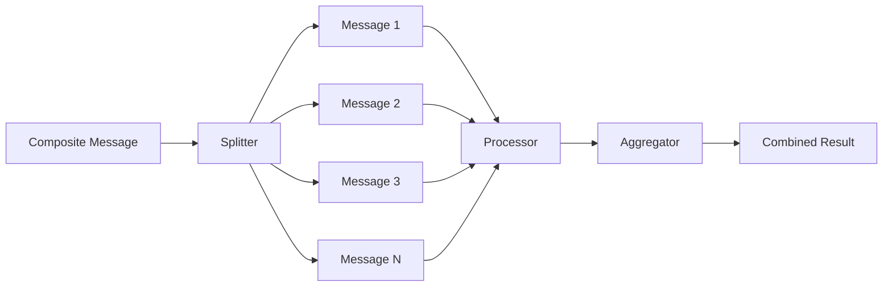
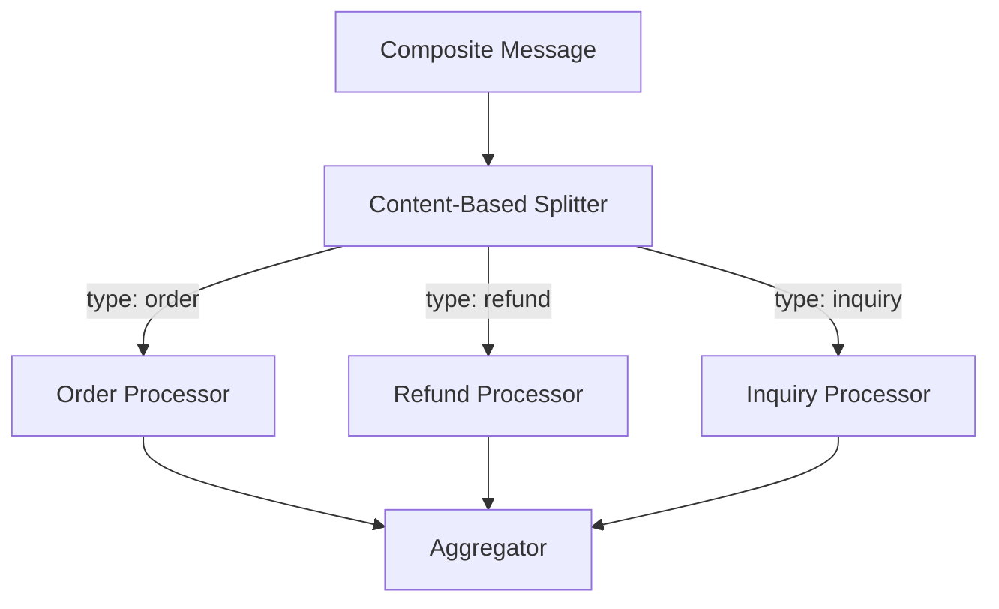
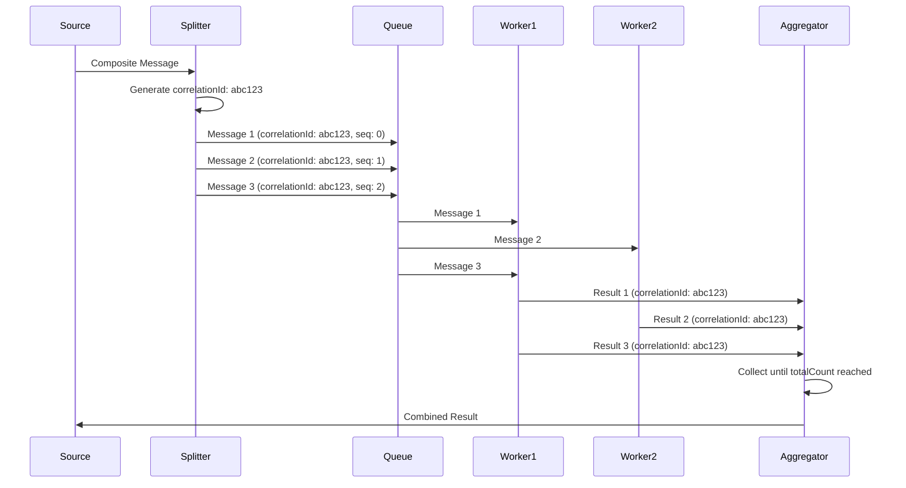
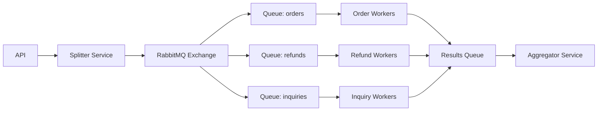

# How to Build a Message Splitter

Author: [nawazdhandala](https://github.com/nawazdhandala)

Tags: Messaging, Patterns, Integration, EIP

Description: A practical guide to implementing the Message Splitter pattern for breaking composite messages into individual parts for parallel processing.

---

When you receive a batch order containing 50 line items, or a file upload with thousands of records, or an API payload with nested arrays, you face a common challenge: how do you process each piece independently while maintaining order and correlation?

The **Message Splitter** pattern solves this by decomposing a single composite message into multiple individual messages, each processed independently. This guide covers implementation strategies, correlation techniques, and real-world patterns you can use today.

---

## Table of Contents

1. What is a Message Splitter?
2. When to Use a Splitter
3. Basic Splitting Workflow
4. Implementation in TypeScript
5. Batch Splitting Strategies
6. Content-Based Splitting
7. Maintaining Correlation
8. Aggregating Results
9. Error Handling
10. Production Patterns

---

## 1. What is a Message Splitter?

A Message Splitter is an Enterprise Integration Pattern (EIP) that takes a single message containing multiple elements and produces separate messages for each element. Each resulting message can then be routed, transformed, and processed independently.

| Term | Definition |
|------|------------|
| Composite Message | A single message containing multiple related items (batch order, file with records, array payload) |
| Split Message | Individual message created from one element of the composite |
| Correlation ID | Identifier linking split messages back to their original composite |
| Splitter | Component that breaks apart the composite message |
| Aggregator | Component that reassembles results from split messages |

The splitter pattern works hand-in-hand with the Aggregator pattern. After splitting and processing, you often need to combine results back into a single response.

---

## 2. When to Use a Splitter

Use a Message Splitter when:

- Processing batch files with multiple records
- Handling API payloads containing arrays of items
- Breaking up large orders into individual line items
- Distributing work across multiple workers
- Each element requires different processing paths
- You need parallel processing for performance
- Individual items may fail without blocking others

Skip the splitter when:

- The composite message must be processed atomically
- Splitting overhead exceeds processing time
- Order of processing is critical and cannot be managed
- Items have tight interdependencies

---

## 3. Basic Splitting Workflow

Here is the fundamental flow of a message splitter:



The splitter receives one message and produces N messages. Each split message flows through processing independently. The aggregator collects results and produces the final combined output.

---

## 4. Implementation in TypeScript

Let's build a basic message splitter step by step.

### Basic Splitter Interface

```typescript
interface Message<T> {
  id: string;
  correlationId: string;
  sequenceNumber: number;
  totalCount: number;
  payload: T;
  metadata: Record<string, unknown>;
}

interface SplitResult<T> {
  messages: Message<T>[];
  correlationId: string;
  totalCount: number;
}

interface Splitter<TInput, TOutput> {
  split(composite: TInput): SplitResult<TOutput>;
}
```

### Array Splitter Implementation

```typescript
import { randomUUID } from 'crypto';

class ArraySplitter<T> implements Splitter<T[], T> {
  split(items: T[]): SplitResult<T> {
    const correlationId = randomUUID();
    const totalCount = items.length;

    const messages: Message<T>[] = items.map((item, index) => ({
      id: randomUUID(),
      correlationId,
      sequenceNumber: index,
      totalCount,
      payload: item,
      metadata: {
        splitTimestamp: Date.now(),
      },
    }));

    return {
      messages,
      correlationId,
      totalCount,
    };
  }
}

// Usage
interface OrderItem {
  sku: string;
  quantity: number;
  price: number;
}

const splitter = new ArraySplitter<OrderItem>();

const batchOrder: OrderItem[] = [
  { sku: 'SKU-001', quantity: 2, price: 29.99 },
  { sku: 'SKU-002', quantity: 1, price: 49.99 },
  { sku: 'SKU-003', quantity: 5, price: 9.99 },
];

const result = splitter.split(batchOrder);
console.log(`Split into ${result.totalCount} messages`);
console.log(`Correlation ID: ${result.correlationId}`);
```

### Streaming Splitter for Large Files

When dealing with large files, you cannot load everything into memory. Use a streaming approach:

```typescript
import { createReadStream } from 'fs';
import { createInterface } from 'readline';
import { EventEmitter } from 'events';

class StreamingSplitter extends EventEmitter {
  private correlationId: string;
  private sequenceNumber: number = 0;

  constructor() {
    super();
    this.correlationId = randomUUID();
  }

  async splitFile(filePath: string, batchSize: number = 100): Promise<void> {
    const fileStream = createReadStream(filePath);
    const rl = createInterface({
      input: fileStream,
      crlfDelay: Infinity,
    });

    let batch: string[] = [];

    for await (const line of rl) {
      batch.push(line);

      if (batch.length >= batchSize) {
        this.emitBatch(batch);
        batch = [];
      }
    }

    // Emit remaining items
    if (batch.length > 0) {
      this.emitBatch(batch);
    }

    this.emit('complete', { correlationId: this.correlationId });
  }

  private emitBatch(items: string[]): void {
    const message: Message<string[]> = {
      id: randomUUID(),
      correlationId: this.correlationId,
      sequenceNumber: this.sequenceNumber++,
      totalCount: -1, // Unknown until complete
      payload: items,
      metadata: { batchSize: items.length },
    };

    this.emit('message', message);
  }
}

// Usage
const streamSplitter = new StreamingSplitter();

streamSplitter.on('message', (msg) => {
  console.log(`Processing batch ${msg.sequenceNumber}`);
  // Process the batch
});

streamSplitter.on('complete', ({ correlationId }) => {
  console.log(`File processing complete: ${correlationId}`);
});

await streamSplitter.splitFile('/path/to/large-file.csv', 1000);
```

---

## 5. Batch Splitting Strategies

Not all splitting is equal. Choose the right strategy for your use case.

### Fixed Size Batches

Split into chunks of predetermined size:

```typescript
function splitBySize<T>(items: T[], batchSize: number): T[][] {
  const batches: T[][] = [];

  for (let i = 0; i < items.length; i += batchSize) {
    batches.push(items.slice(i, i + batchSize));
  }

  return batches;
}

const items = [1, 2, 3, 4, 5, 6, 7, 8, 9, 10];
const batches = splitBySize(items, 3);
// [[1,2,3], [4,5,6], [7,8,9], [10]]
```

### Weight-Based Batches

Split based on cumulative weight (processing time, memory, cost):

```typescript
interface WeightedItem<T> {
  item: T;
  weight: number;
}

function splitByWeight<T>(
  items: WeightedItem<T>[],
  maxWeight: number
): T[][] {
  const batches: T[][] = [];
  let currentBatch: T[] = [];
  let currentWeight = 0;

  for (const { item, weight } of items) {
    if (currentWeight + weight > maxWeight && currentBatch.length > 0) {
      batches.push(currentBatch);
      currentBatch = [];
      currentWeight = 0;
    }

    currentBatch.push(item);
    currentWeight += weight;
  }

  if (currentBatch.length > 0) {
    batches.push(currentBatch);
  }

  return batches;
}

// Usage: split orders where weight = number of items to ship
const orders = [
  { item: { orderId: 'A' }, weight: 5 },
  { item: { orderId: 'B' }, weight: 3 },
  { item: { orderId: 'C' }, weight: 8 },
  { item: { orderId: 'D' }, weight: 2 },
];

const weightedBatches = splitByWeight(orders, 10);
```

### Time-Based Batches

Useful for streaming scenarios where you want to flush periodically:

```typescript
class TimeBatchSplitter<T> {
  private buffer: T[] = [];
  private timer: NodeJS.Timeout | null = null;
  private onBatch: (items: T[]) => void;
  private flushInterval: number;
  private maxSize: number;

  constructor(
    onBatch: (items: T[]) => void,
    flushInterval: number = 5000,
    maxSize: number = 1000
  ) {
    this.onBatch = onBatch;
    this.flushInterval = flushInterval;
    this.maxSize = maxSize;
  }

  add(item: T): void {
    this.buffer.push(item);

    if (this.buffer.length >= this.maxSize) {
      this.flush();
    } else if (!this.timer) {
      this.timer = setTimeout(() => this.flush(), this.flushInterval);
    }
  }

  flush(): void {
    if (this.timer) {
      clearTimeout(this.timer);
      this.timer = null;
    }

    if (this.buffer.length > 0) {
      this.onBatch([...this.buffer]);
      this.buffer = [];
    }
  }
}
```

---

## 6. Content-Based Splitting

Sometimes you need to split based on message content, routing different items to different processors.



### Content Router Implementation

```typescript
type RouteKey = string;
type Router<T> = (item: T) => RouteKey;

interface ContentBasedSplitResult<T> {
  routes: Map<RouteKey, Message<T>[]>;
  correlationId: string;
}

class ContentBasedSplitter<T> {
  private router: Router<T>;

  constructor(router: Router<T>) {
    this.router = router;
  }

  split(items: T[]): ContentBasedSplitResult<T> {
    const correlationId = randomUUID();
    const routes = new Map<RouteKey, Message<T>[]>();
    const sequenceCounters = new Map<RouteKey, number>();

    for (const item of items) {
      const routeKey = this.router(item);

      if (!routes.has(routeKey)) {
        routes.set(routeKey, []);
        sequenceCounters.set(routeKey, 0);
      }

      const sequence = sequenceCounters.get(routeKey)!;

      const message: Message<T> = {
        id: randomUUID(),
        correlationId,
        sequenceNumber: sequence,
        totalCount: -1, // Set after processing
        payload: item,
        metadata: { routeKey },
      };

      routes.get(routeKey)!.push(message);
      sequenceCounters.set(routeKey, sequence + 1);
    }

    // Update total counts per route
    for (const [key, messages] of routes) {
      for (const msg of messages) {
        msg.totalCount = messages.length;
      }
    }

    return { routes, correlationId };
  }
}

// Usage
interface Transaction {
  type: 'order' | 'refund' | 'inquiry';
  amount: number;
  customerId: string;
}

const transactions: Transaction[] = [
  { type: 'order', amount: 100, customerId: 'C1' },
  { type: 'refund', amount: 25, customerId: 'C2' },
  { type: 'order', amount: 200, customerId: 'C1' },
  { type: 'inquiry', amount: 0, customerId: 'C3' },
];

const contentSplitter = new ContentBasedSplitter<Transaction>(
  (tx) => tx.type
);

const splitByType = contentSplitter.split(transactions);

// Process each route differently
for (const [routeKey, messages] of splitByType.routes) {
  console.log(`Route ${routeKey}: ${messages.length} messages`);
}
```

### XPath/JSONPath Splitting

For structured documents, split based on path expressions:

```typescript
import jp from 'jsonpath';

class JsonPathSplitter {
  split(document: object, path: string): SplitResult<unknown> {
    const correlationId = randomUUID();
    const items = jp.query(document, path);

    const messages: Message<unknown>[] = items.map((item, index) => ({
      id: randomUUID(),
      correlationId,
      sequenceNumber: index,
      totalCount: items.length,
      payload: item,
      metadata: { jsonPath: path },
    }));

    return { messages, correlationId, totalCount: items.length };
  }
}

// Usage
const apiResponse = {
  status: 'success',
  data: {
    orders: [
      { id: 1, items: ['A', 'B'] },
      { id: 2, items: ['C'] },
      { id: 3, items: ['D', 'E', 'F'] },
    ],
  },
};

const jsonSplitter = new JsonPathSplitter();
const orderMessages = jsonSplitter.split(apiResponse, '$.data.orders[*]');
```

---

## 7. Maintaining Correlation

Correlation is critical. Without it, you cannot track which split messages belong together or reassemble results correctly.



### Correlation Store

```typescript
interface CorrelationEntry<T> {
  correlationId: string;
  totalExpected: number;
  received: Map<number, T>;
  createdAt: number;
  timeout: number;
}

class CorrelationStore<T> {
  private entries = new Map<string, CorrelationEntry<T>>();
  private completionCallback: (correlationId: string, results: T[]) => void;
  private timeoutCallback: (correlationId: string, partial: T[]) => void;

  constructor(
    onComplete: (correlationId: string, results: T[]) => void,
    onTimeout: (correlationId: string, partial: T[]) => void
  ) {
    this.completionCallback = onComplete;
    this.timeoutCallback = onTimeout;
  }

  initCorrelation(
    correlationId: string,
    totalExpected: number,
    timeout: number = 30000
  ): void {
    this.entries.set(correlationId, {
      correlationId,
      totalExpected,
      received: new Map(),
      createdAt: Date.now(),
      timeout,
    });

    setTimeout(() => {
      this.checkTimeout(correlationId);
    }, timeout);
  }

  addResult(
    correlationId: string,
    sequenceNumber: number,
    result: T
  ): boolean {
    const entry = this.entries.get(correlationId);

    if (!entry) {
      console.warn(`Unknown correlation: ${correlationId}`);
      return false;
    }

    entry.received.set(sequenceNumber, result);

    if (entry.received.size === entry.totalExpected) {
      this.complete(correlationId);
      return true;
    }

    return false;
  }

  private complete(correlationId: string): void {
    const entry = this.entries.get(correlationId);
    if (!entry) return;

    // Sort by sequence number
    const results: T[] = [];
    for (let i = 0; i < entry.totalExpected; i++) {
      const result = entry.received.get(i);
      if (result !== undefined) {
        results.push(result);
      }
    }

    this.entries.delete(correlationId);
    this.completionCallback(correlationId, results);
  }

  private checkTimeout(correlationId: string): void {
    const entry = this.entries.get(correlationId);
    if (!entry) return; // Already completed

    const partial: T[] = [];
    for (let i = 0; i < entry.totalExpected; i++) {
      const result = entry.received.get(i);
      if (result !== undefined) {
        partial.push(result);
      }
    }

    this.entries.delete(correlationId);
    this.timeoutCallback(correlationId, partial);
  }
}
```

---

## 8. Aggregating Results

The Aggregator pattern collects split message results and combines them:

```typescript
interface AggregationStrategy<TInput, TOutput> {
  aggregate(results: TInput[]): TOutput;
}

class SumAggregator implements AggregationStrategy<number, number> {
  aggregate(results: number[]): number {
    return results.reduce((sum, val) => sum + val, 0);
  }
}

class ArrayAggregator<T> implements AggregationStrategy<T, T[]> {
  aggregate(results: T[]): T[] {
    return results;
  }
}

class ObjectMergeAggregator implements AggregationStrategy<object, object> {
  aggregate(results: object[]): object {
    return Object.assign({}, ...results);
  }
}

// Full aggregator with correlation
class MessageAggregator<TInput, TOutput> {
  private store: CorrelationStore<TInput>;
  private strategy: AggregationStrategy<TInput, TOutput>;
  private onAggregated: (correlationId: string, result: TOutput) => void;

  constructor(
    strategy: AggregationStrategy<TInput, TOutput>,
    onAggregated: (correlationId: string, result: TOutput) => void,
    onTimeout: (correlationId: string, partial: TInput[]) => void
  ) {
    this.strategy = strategy;
    this.onAggregated = onAggregated;
    this.store = new CorrelationStore(
      (id, results) => {
        const aggregated = this.strategy.aggregate(results);
        this.onAggregated(id, aggregated);
      },
      onTimeout
    );
  }

  startAggregation(correlationId: string, totalExpected: number): void {
    this.store.initCorrelation(correlationId, totalExpected);
  }

  addResult(message: Message<TInput>, result: TInput): void {
    this.store.addResult(
      message.correlationId,
      message.sequenceNumber,
      result
    );
  }
}
```

---

## 9. Error Handling

Splitting introduces failure modes you must handle.

### Partial Failure Strategy

```typescript
interface ProcessingResult<T> {
  success: boolean;
  sequenceNumber: number;
  result?: T;
  error?: Error;
}

class ResilientSplitProcessor<TInput, TOutput> {
  private processor: (item: TInput) => Promise<TOutput>;
  private maxRetries: number;

  constructor(
    processor: (item: TInput) => Promise<TOutput>,
    maxRetries: number = 3
  ) {
    this.processor = processor;
    this.maxRetries = maxRetries;
  }

  async processAll(
    messages: Message<TInput>[]
  ): Promise<ProcessingResult<TOutput>[]> {
    const results = await Promise.all(
      messages.map((msg) => this.processWithRetry(msg))
    );
    return results;
  }

  private async processWithRetry(
    message: Message<TInput>
  ): Promise<ProcessingResult<TOutput>> {
    let lastError: Error | undefined;

    for (let attempt = 0; attempt <= this.maxRetries; attempt++) {
      try {
        const result = await this.processor(message.payload);
        return {
          success: true,
          sequenceNumber: message.sequenceNumber,
          result,
        };
      } catch (err) {
        lastError = err as Error;

        if (attempt < this.maxRetries) {
          // Exponential backoff
          await this.delay(Math.pow(2, attempt) * 100);
        }
      }
    }

    return {
      success: false,
      sequenceNumber: message.sequenceNumber,
      error: lastError,
    };
  }

  private delay(ms: number): Promise<void> {
    return new Promise((resolve) => setTimeout(resolve, ms));
  }
}
```

### Dead Letter Queue for Failed Messages

```typescript
interface DeadLetterEntry<T> {
  originalMessage: Message<T>;
  error: Error;
  failedAt: number;
  retryCount: number;
}

class DeadLetterQueue<T> {
  private queue: DeadLetterEntry<T>[] = [];
  private maxSize: number;

  constructor(maxSize: number = 10000) {
    this.maxSize = maxSize;
  }

  add(message: Message<T>, error: Error, retryCount: number): void {
    if (this.queue.length >= this.maxSize) {
      // Remove oldest entry
      this.queue.shift();
    }

    this.queue.push({
      originalMessage: message,
      error,
      failedAt: Date.now(),
      retryCount,
    });
  }

  getFailedMessages(): DeadLetterEntry<T>[] {
    return [...this.queue];
  }

  retry(
    processor: (message: Message<T>) => Promise<void>
  ): Promise<void>[] {
    const entries = this.queue.splice(0, this.queue.length);
    return entries.map((entry) => processor(entry.originalMessage));
  }
}
```

---

## 10. Production Patterns

### Queue-Based Splitting with RabbitMQ



```typescript
import amqp from 'amqplib';

class QueueBasedSplitter {
  private connection: amqp.Connection | null = null;
  private channel: amqp.Channel | null = null;

  async connect(url: string): Promise<void> {
    this.connection = await amqp.connect(url);
    this.channel = await this.connection.createChannel();

    await this.channel.assertExchange('splitter', 'direct', { durable: true });
  }

  async splitAndPublish<T>(
    items: T[],
    router: (item: T) => string
  ): Promise<string> {
    if (!this.channel) throw new Error('Not connected');

    const correlationId = randomUUID();
    const totalCount = items.length;

    for (let i = 0; i < items.length; i++) {
      const routeKey = router(items[i]);
      const message: Message<T> = {
        id: randomUUID(),
        correlationId,
        sequenceNumber: i,
        totalCount,
        payload: items[i],
        metadata: {},
      };

      this.channel.publish(
        'splitter',
        routeKey,
        Buffer.from(JSON.stringify(message)),
        {
          persistent: true,
          correlationId,
        }
      );
    }

    return correlationId;
  }

  async close(): Promise<void> {
    await this.channel?.close();
    await this.connection?.close();
  }
}
```

### Kafka Splitting with Partition Awareness

```typescript
import { Kafka, Producer, Message as KafkaMessage } from 'kafkajs';

class KafkaSplitter {
  private producer: Producer;

  constructor(kafka: Kafka) {
    this.producer = kafka.producer();
  }

  async connect(): Promise<void> {
    await this.producer.connect();
  }

  async splitToPartitions<T>(
    topic: string,
    items: T[],
    partitionKey: (item: T) => string
  ): Promise<string> {
    const correlationId = randomUUID();

    const messages: KafkaMessage[] = items.map((item, index) => ({
      key: partitionKey(item),
      value: JSON.stringify({
        id: randomUUID(),
        correlationId,
        sequenceNumber: index,
        totalCount: items.length,
        payload: item,
      }),
      headers: {
        correlationId,
        sequenceNumber: String(index),
      },
    }));

    await this.producer.send({
      topic,
      messages,
    });

    return correlationId;
  }
}
```

---

## Summary

| Concept | Purpose |
|---------|---------|
| Message Splitter | Breaks composite messages into individual parts |
| Correlation ID | Links split messages to their source |
| Sequence Number | Maintains ordering for reassembly |
| Content-Based Splitting | Routes different items to different processors |
| Batch Splitting | Controls chunk sizes for performance |
| Aggregator | Reassembles results after processing |
| Dead Letter Queue | Captures failed messages for retry |

The Message Splitter pattern enables parallel processing, better error isolation, and more flexible routing. Start with simple array splitting, add correlation tracking, then layer in aggregation and error handling as your needs grow.

---

## Related Patterns

- **Aggregator**: Combines results from split messages
- **Content-Based Router**: Routes messages based on content
- **Scatter-Gather**: Broadcasts and collects from multiple recipients
- **Recipient List**: Dynamic routing to multiple destinations

---

*Building event-driven systems? OneUptime helps you monitor message queues, track processing latency, and alert on failed message patterns across your distributed architecture.*
