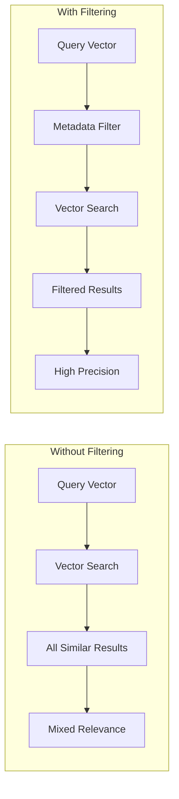
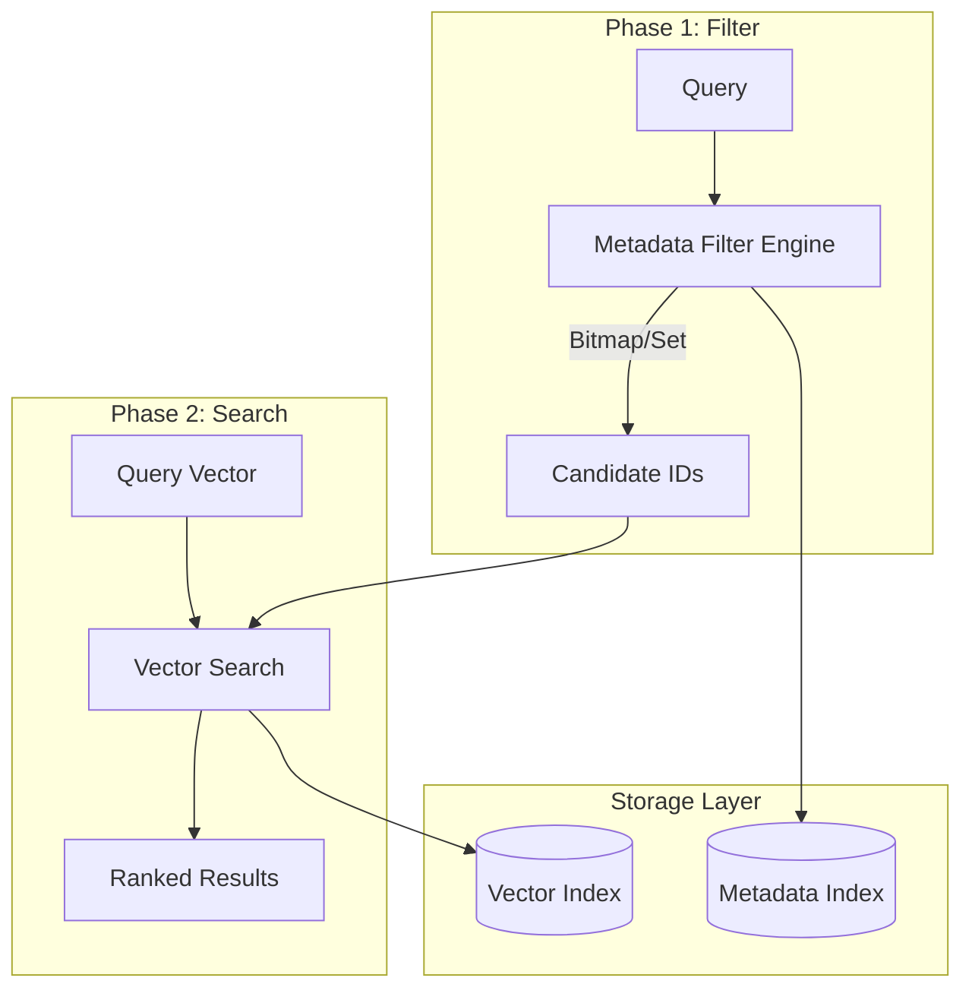
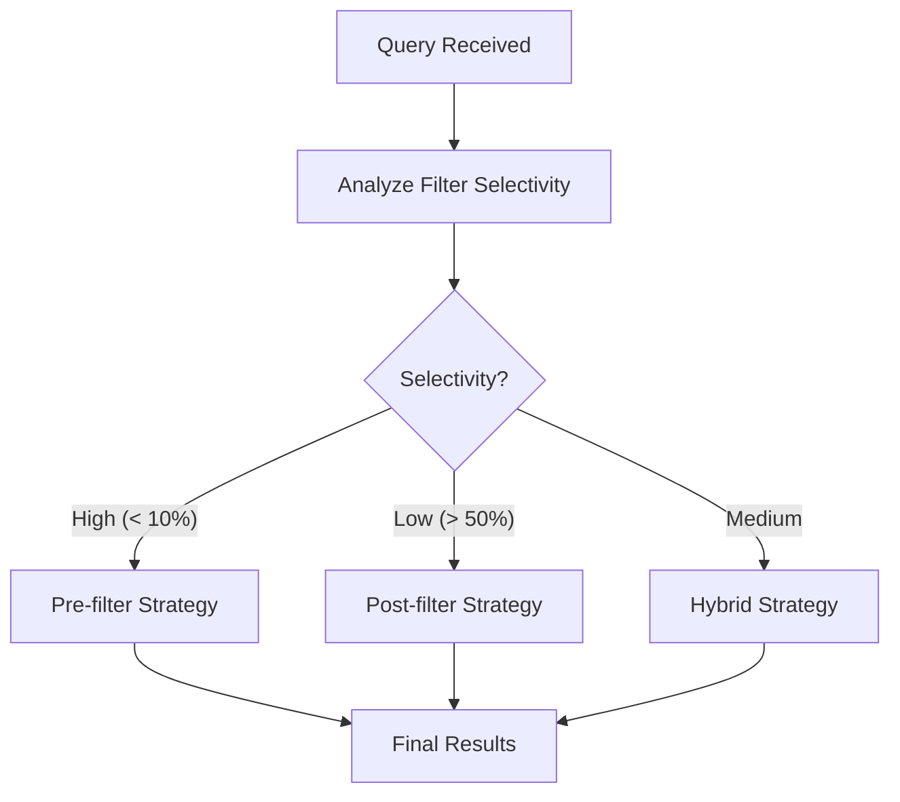
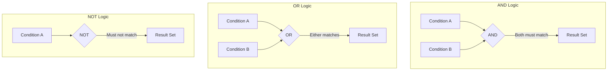
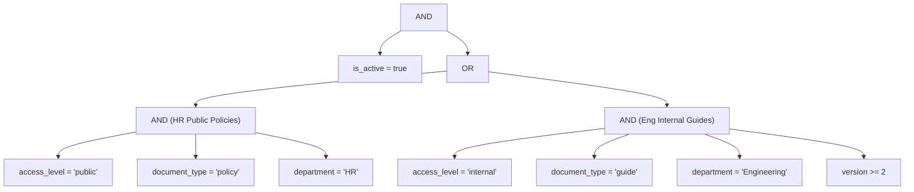
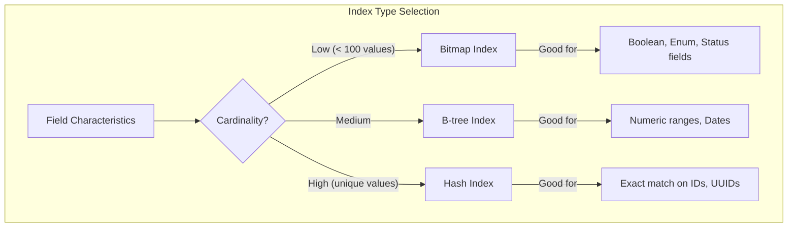

# How to Implement Metadata Filtering

Author: [nawazdhandala](https://github.com/nawazdhandala)

Tags: Vector Database, Metadata Filtering, Search Optimization, RAG

Description: Learn to implement metadata filtering in vector databases with attribute indexing, filter expressions, and hybrid search strategies for precise retrieval.

---

> Vector similarity alone finds **what's related**. Metadata filtering finds **what's relevant to your specific context**.

Metadata filtering is the mechanism that transforms a general-purpose vector search into a precise, context-aware retrieval system. Without it, you might get semantically similar results that are completely wrong for your use case - like returning archived documents when users need current ones, or surfacing content from the wrong department.

This guide covers everything you need to implement production-ready metadata filtering: filter syntax patterns, attribute types, compound filter logic, indexing strategies, and performance optimization techniques with practical code examples.

---

## Table of Contents

1. Why Metadata Filtering Matters
2. Core Concepts and Architecture
3. Attribute Types and Data Modeling
4. Filter Syntax and Expressions
5. Compound Filters and Boolean Logic
6. Indexing Strategies for Metadata
7. Performance Optimization
8. Implementation Examples
9. Common Patterns and Use Cases
10. Anti-Patterns to Avoid
11. Testing and Validation
12. Production Considerations

---

## 1. Why Metadata Filtering Matters

Consider a RAG (Retrieval-Augmented Generation) system for a company knowledge base. A user asks: "What is our vacation policy?"

Without metadata filtering, vector search might return:
- An outdated 2019 vacation policy document
- A competitor's vacation policy from a research folder
- A blog post mentioning vacation that's completely unrelated

With metadata filtering:
- Filter by `document_type = 'policy'`
- Filter by `status = 'active'`
- Filter by `department IN ['HR', 'Company-Wide']`

You get exactly what's relevant.



---

## 2. Core Concepts and Architecture

### The Two-Phase Search Model

Most vector databases implement metadata filtering using a two-phase approach:



| Component | Purpose | Implementation |
|-----------|---------|----------------|
| Metadata Index | Fast attribute lookups | B-tree, inverted index, or bitmap |
| Vector Index | Approximate nearest neighbor search | HNSW, IVF, or PQ |
| Filter Engine | Combines filter conditions | Boolean algebra on result sets |
| Query Planner | Optimizes execution order | Cost-based optimization |

### Pre-filtering vs Post-filtering

**Pre-filtering** (filter first, then vector search):
- Pros: Guaranteed result count, efficient for selective filters
- Cons: May miss globally optimal vectors if filter is too restrictive

**Post-filtering** (vector search first, then filter):
- Pros: Finds best vectors, simple implementation
- Cons: May return fewer results than requested, wasted computation

**Hybrid approach** (most production systems):
- Estimate filter selectivity
- Choose strategy based on expected candidate set size
- Fall back between strategies as needed



---

## 3. Attribute Types and Data Modeling

### Supported Data Types

| Type | Example | Operators | Index Type |
|------|---------|-----------|------------|
| String | `"category": "finance"` | `=`, `!=`, `IN`, `LIKE` | Hash, Trie |
| Integer | `"year": 2024` | `=`, `!=`, `<`, `>`, `<=`, `>=`, `BETWEEN` | B-tree |
| Float | `"score": 0.95` | `=`, `!=`, `<`, `>`, `<=`, `>=`, `BETWEEN` | B-tree |
| Boolean | `"is_active": true` | `=`, `!=` | Bitmap |
| Array | `"tags": ["ai", "ml"]` | `CONTAINS`, `CONTAINS_ANY`, `CONTAINS_ALL` | Inverted |
| Date/Time | `"created": "2024-01-15"` | `=`, `!=`, `<`, `>`, `BETWEEN` | B-tree |
| Null | `"optional": null` | `IS NULL`, `IS NOT NULL` | Bitmap |

### Schema Design Example

```python
# Document metadata schema
metadata_schema = {
    # Categorical - use for exact matching
    "document_type": {
        "type": "string",
        "indexed": True,
        "values": ["policy", "guide", "faq", "report"]
    },

    # Hierarchical - use for department filtering
    "department": {
        "type": "string",
        "indexed": True
    },

    # Temporal - use for recency filtering
    "created_at": {
        "type": "datetime",
        "indexed": True
    },

    # Numeric - use for range queries
    "version": {
        "type": "integer",
        "indexed": True
    },

    # Multi-value - use for tag matching
    "tags": {
        "type": "array",
        "items": "string",
        "indexed": True
    },

    # Access control - use for permission filtering
    "access_level": {
        "type": "string",
        "indexed": True,
        "values": ["public", "internal", "confidential"]
    },

    # Status - use for lifecycle filtering
    "is_active": {
        "type": "boolean",
        "indexed": True,
        "default": True
    }
}
```

### Denormalization for Performance

Store frequently filtered combinations as composite fields:

```python
# Instead of filtering on department AND team
metadata = {
    "department": "engineering",
    "team": "platform",
    # Pre-computed composite for faster filtering
    "department_team": "engineering:platform"
}
```

---

## 4. Filter Syntax and Expressions

### Common Filter Syntaxes Across Databases

**Pinecone Style (Dictionary)**:
```python
filter = {
    "category": {"$eq": "technical"},
    "year": {"$gte": 2023},
    "tags": {"$in": ["python", "ml"]}
}
```

**Qdrant Style (Structured)**:
```python
from qdrant_client.models import Filter, FieldCondition, MatchValue, Range

filter = Filter(
    must=[
        FieldCondition(key="category", match=MatchValue(value="technical")),
        FieldCondition(key="year", range=Range(gte=2023))
    ]
)
```

**Weaviate Style (GraphQL)**:
```graphql
{
  Get {
    Document(
      where: {
        operator: And
        operands: [
          { path: ["category"], operator: Equal, valueText: "technical" },
          { path: ["year"], operator: GreaterThanEqual, valueInt: 2023 }
        ]
      }
    ) {
      content
    }
  }
}
```

**Milvus Style (Expression String)**:
```python
filter_expr = "category == 'technical' and year >= 2023 and tags in ['python', 'ml']"
```

**ChromaDB Style (Where Clause)**:
```python
where = {
    "$and": [
        {"category": {"$eq": "technical"}},
        {"year": {"$gte": 2023}}
    ]
}
```

### Operator Reference Table

| Operation | Pinecone | Qdrant | Milvus | ChromaDB |
|-----------|----------|--------|--------|----------|
| Equals | `$eq` | `MatchValue` | `==` | `$eq` |
| Not Equals | `$ne` | `must_not` | `!=` | `$ne` |
| Greater Than | `$gt` | `Range(gt=)` | `>` | `$gt` |
| Greater/Equal | `$gte` | `Range(gte=)` | `>=` | `$gte` |
| Less Than | `$lt` | `Range(lt=)` | `<` | `$lt` |
| Less/Equal | `$lte` | `Range(lte=)` | `<=` | `$lte` |
| In List | `$in` | `MatchAny` | `in` | `$in` |
| Not In List | `$nin` | `must_not + MatchAny` | `not in` | `$nin` |
| Contains | - | `MatchText` | `like` | - |
| Array Contains | `$in` (on array field) | `MatchAny` | `array_contains` | `$contains` |

---

## 5. Compound Filters and Boolean Logic

### Boolean Operators



### Nested Filter Examples

**Complex business logic**:
```python
# Find active documents that are either:
# - Public policies from HR
# - Internal guides from Engineering with version >= 2

filter = {
    "$and": [
        {"is_active": {"$eq": True}},
        {
            "$or": [
                {
                    "$and": [
                        {"access_level": {"$eq": "public"}},
                        {"document_type": {"$eq": "policy"}},
                        {"department": {"$eq": "HR"}}
                    ]
                },
                {
                    "$and": [
                        {"access_level": {"$eq": "internal"}},
                        {"document_type": {"$eq": "guide"}},
                        {"department": {"$eq": "Engineering"}},
                        {"version": {"$gte": 2}}
                    ]
                }
            ]
        }
    ]
}
```

**Filter tree visualization**:



### Filter Builder Pattern

Create a reusable filter builder for complex queries:

```python
from typing import Any, Dict, List, Optional
from dataclasses import dataclass, field
from enum import Enum

class FilterOp(Enum):
    EQ = "$eq"
    NE = "$ne"
    GT = "$gt"
    GTE = "$gte"
    LT = "$lt"
    LTE = "$lte"
    IN = "$in"
    NIN = "$nin"

@dataclass
class FilterBuilder:
    conditions: List[Dict[str, Any]] = field(default_factory=list)

    def equals(self, field: str, value: Any) -> "FilterBuilder":
        self.conditions.append({field: {FilterOp.EQ.value: value}})
        return self

    def not_equals(self, field: str, value: Any) -> "FilterBuilder":
        self.conditions.append({field: {FilterOp.NE.value: value}})
        return self

    def greater_than(self, field: str, value: Any) -> "FilterBuilder":
        self.conditions.append({field: {FilterOp.GT.value: value}})
        return self

    def greater_than_or_equal(self, field: str, value: Any) -> "FilterBuilder":
        self.conditions.append({field: {FilterOp.GTE.value: value}})
        return self

    def less_than(self, field: str, value: Any) -> "FilterBuilder":
        self.conditions.append({field: {FilterOp.LT.value: value}})
        return self

    def less_than_or_equal(self, field: str, value: Any) -> "FilterBuilder":
        self.conditions.append({field: {FilterOp.LTE.value: value}})
        return self

    def in_list(self, field: str, values: List[Any]) -> "FilterBuilder":
        self.conditions.append({field: {FilterOp.IN.value: values}})
        return self

    def not_in_list(self, field: str, values: List[Any]) -> "FilterBuilder":
        self.conditions.append({field: {FilterOp.NIN.value: values}})
        return self

    def between(self, field: str, min_val: Any, max_val: Any) -> "FilterBuilder":
        self.conditions.append({
            "$and": [
                {field: {FilterOp.GTE.value: min_val}},
                {field: {FilterOp.LTE.value: max_val}}
            ]
        })
        return self

    def build_and(self) -> Dict[str, Any]:
        if len(self.conditions) == 1:
            return self.conditions[0]
        return {"$and": self.conditions}

    def build_or(self) -> Dict[str, Any]:
        if len(self.conditions) == 1:
            return self.conditions[0]
        return {"$or": self.conditions}

# Usage example
filter = (
    FilterBuilder()
    .equals("is_active", True)
    .equals("document_type", "policy")
    .in_list("department", ["HR", "Legal"])
    .greater_than_or_equal("version", 2)
    .build_and()
)

print(filter)
# Output:
# {
#     "$and": [
#         {"is_active": {"$eq": True}},
#         {"document_type": {"$eq": "policy"}},
#         {"department": {"$in": ["HR", "Legal"]}},
#         {"version": {"$gte": 2}}
#     ]
# }
```

---

## 6. Indexing Strategies for Metadata

### Index Types and When to Use Them



| Index Type | Best For | Operations | Space | Example Fields |
|------------|----------|------------|-------|----------------|
| Bitmap | Low cardinality (< 100 unique values) | AND, OR, COUNT | Low | status, is_active, category |
| B-tree | Range queries, ordered data | <, >, BETWEEN, ORDER BY | Medium | timestamp, version, price |
| Hash | Exact equality | = only | Low | user_id, document_id |
| Inverted | Text search, array contains | CONTAINS, IN | High | tags, keywords |
| GIN | Multi-value fields (arrays) | @>, &&, CONTAINS_ALL | High | permissions, labels |

### Composite Index Design

For frequently combined filters, create composite indexes:

```python
# Query pattern analysis
common_queries = [
    {"department": "X", "is_active": True},           # Pattern 1: 80% of queries
    {"department": "X", "document_type": "Y"},        # Pattern 2: 15% of queries
    {"created_at": {"$gte": "2024-01-01"}},           # Pattern 3: 5% of queries
]

# Create composite indexes for frequent patterns
composite_indexes = [
    ["department", "is_active"],      # Covers Pattern 1
    ["department", "document_type"],  # Covers Pattern 2
    ["created_at"],                   # Covers Pattern 3
]
```

### Index Configuration Example (Qdrant)

```python
from qdrant_client import QdrantClient
from qdrant_client.models import (
    PayloadSchemaType,
    PayloadIndexParams,
    TextIndexParams,
    IntegerIndexParams,
    KeywordIndexParams,
)

client = QdrantClient("localhost", port=6333)

# Create optimized indexes for each field type
client.create_payload_index(
    collection_name="documents",
    field_name="department",
    field_schema=KeywordIndexParams(
        type="keyword",
        is_tenant=True,  # Optimized for multi-tenant filtering
    )
)

client.create_payload_index(
    collection_name="documents",
    field_name="created_at",
    field_schema=IntegerIndexParams(
        type="integer",
        lookup=False,      # No exact match needed
        range=True,        # Optimize for range queries
    )
)

client.create_payload_index(
    collection_name="documents",
    field_name="content",
    field_schema=TextIndexParams(
        type="text",
        tokenizer="word",
        min_token_len=2,
        max_token_len=20,
        lowercase=True,
    )
)
```

---

## 7. Performance Optimization

### Filter Selectivity Analysis

Selectivity = (matching rows) / (total rows)

```python
import time
from typing import Dict, Any, Tuple

def analyze_filter_selectivity(
    collection,
    filter_conditions: Dict[str, Any],
    sample_size: int = 10000
) -> Tuple[float, float]:
    """
    Analyze filter selectivity and estimate query performance.

    Returns:
        Tuple of (selectivity_ratio, estimated_latency_ms)
    """
    # Count total documents
    total_count = collection.count()

    # Count matching documents
    start_time = time.time()
    matching_count = collection.count(filter=filter_conditions)
    filter_time = (time.time() - start_time) * 1000

    selectivity = matching_count / total_count if total_count > 0 else 0

    # Estimate strategy
    if selectivity < 0.01:  # Very selective
        strategy = "pre-filter"
        estimated_latency = filter_time + 10  # Fast ANN on small set
    elif selectivity > 0.5:  # Not selective
        strategy = "post-filter"
        estimated_latency = 50 + (filter_time * 0.1)  # Full ANN + light filter
    else:
        strategy = "hybrid"
        estimated_latency = filter_time + 30

    print(f"Selectivity: {selectivity:.2%}")
    print(f"Matching: {matching_count:,} / {total_count:,}")
    print(f"Recommended strategy: {strategy}")
    print(f"Estimated latency: {estimated_latency:.1f}ms")

    return selectivity, estimated_latency

# Usage
selectivity, latency = analyze_filter_selectivity(
    collection,
    {"department": {"$eq": "Engineering"}, "is_active": {"$eq": True}}
)
```

### Query Optimization Techniques

**1. Filter Order Optimization**

Put most selective filters first:

```python
# Suboptimal - least selective first
filter_bad = {
    "$and": [
        {"is_active": {"$eq": True}},      # 90% match
        {"year": {"$gte": 2020}},           # 50% match
        {"department": {"$eq": "Legal"}}    # 5% match
    ]
}

# Optimal - most selective first
filter_good = {
    "$and": [
        {"department": {"$eq": "Legal"}},   # 5% match - filters 95% immediately
        {"year": {"$gte": 2020}},            # 50% match of remaining
        {"is_active": {"$eq": True}}         # 90% match of remaining
    ]
}
```

**2. Avoid Negations When Possible**

```python
# Slower - scans for non-matches
filter_slow = {"status": {"$ne": "archived"}}

# Faster - use positive filter with allowed values
filter_fast = {"status": {"$in": ["active", "pending", "review"]}}
```

**3. Use Exact Match Over Pattern Match**

```python
# Slower - pattern matching
filter_slow = {"email": {"$like": "%@company.com"}}

# Faster - pre-compute and use exact match
# Store domain as separate field during ingestion
filter_fast = {"email_domain": {"$eq": "company.com"}}
```

### Batch Query Optimization

```python
from concurrent.futures import ThreadPoolExecutor
from typing import List, Dict, Any

def batch_filtered_search(
    client,
    collection_name: str,
    queries: List[Dict[str, Any]],  # List of {vector, filter, top_k}
    max_workers: int = 4
) -> List[Any]:
    """
    Execute multiple filtered searches in parallel.
    """
    def execute_single_search(query_params):
        return client.search(
            collection_name=collection_name,
            query_vector=query_params["vector"],
            query_filter=query_params["filter"],
            limit=query_params.get("top_k", 10)
        )

    with ThreadPoolExecutor(max_workers=max_workers) as executor:
        results = list(executor.map(execute_single_search, queries))

    return results

# Usage
queries = [
    {"vector": embed("query 1"), "filter": {"dept": {"$eq": "HR"}}, "top_k": 5},
    {"vector": embed("query 2"), "filter": {"dept": {"$eq": "Eng"}}, "top_k": 5},
    {"vector": embed("query 3"), "filter": {"dept": {"$eq": "Sales"}}, "top_k": 5},
]

results = batch_filtered_search(client, "documents", queries)
```

### Performance Monitoring

```python
import time
from dataclasses import dataclass
from typing import Optional
import logging

@dataclass
class QueryMetrics:
    query_id: str
    filter_complexity: int  # Number of conditions
    selectivity: float
    vector_search_ms: float
    filter_ms: float
    total_ms: float
    results_count: int

def monitored_search(
    client,
    collection_name: str,
    query_vector: List[float],
    filter_conditions: Optional[Dict[str, Any]] = None,
    limit: int = 10
) -> tuple:
    """
    Search with performance monitoring.
    """
    query_id = f"q_{int(time.time() * 1000)}"

    # Measure filter complexity
    filter_complexity = count_filter_conditions(filter_conditions) if filter_conditions else 0

    # Execute search with timing
    start_time = time.time()

    results = client.search(
        collection_name=collection_name,
        query_vector=query_vector,
        query_filter=filter_conditions,
        limit=limit
    )

    total_ms = (time.time() - start_time) * 1000

    # Log metrics
    metrics = QueryMetrics(
        query_id=query_id,
        filter_complexity=filter_complexity,
        selectivity=0.0,  # Would need separate count query
        vector_search_ms=total_ms * 0.7,  # Estimate
        filter_ms=total_ms * 0.3,  # Estimate
        total_ms=total_ms,
        results_count=len(results)
    )

    logging.info(f"Query {query_id}: {total_ms:.1f}ms, {len(results)} results, complexity={filter_complexity}")

    return results, metrics

def count_filter_conditions(filter_dict: Dict[str, Any], count: int = 0) -> int:
    """Recursively count filter conditions."""
    for key, value in filter_dict.items():
        if key in ("$and", "$or"):
            for sub_filter in value:
                count = count_filter_conditions(sub_filter, count)
        elif key == "$not":
            count = count_filter_conditions(value, count)
        elif isinstance(value, dict):
            count += 1  # This is a condition
        else:
            count += 1
    return count
```

---

## 8. Implementation Examples

### Complete RAG System with Filtering

```python
from typing import List, Dict, Any, Optional
from dataclasses import dataclass
from datetime import datetime
import hashlib

@dataclass
class Document:
    id: str
    content: str
    embedding: List[float]
    metadata: Dict[str, Any]

@dataclass
class SearchResult:
    document: Document
    score: float

class FilteredVectorStore:
    """
    Production-ready filtered vector store implementation.
    """

    def __init__(self, client, collection_name: str, embedding_model):
        self.client = client
        self.collection_name = collection_name
        self.embedding_model = embedding_model

    def upsert_document(
        self,
        content: str,
        metadata: Dict[str, Any],
        document_id: Optional[str] = None
    ) -> str:
        """
        Add or update a document with metadata.
        """
        # Generate ID if not provided
        if document_id is None:
            document_id = hashlib.sha256(content.encode()).hexdigest()[:16]

        # Generate embedding
        embedding = self.embedding_model.encode(content)

        # Enrich metadata with system fields
        enriched_metadata = {
            **metadata,
            "indexed_at": datetime.utcnow().isoformat(),
            "content_length": len(content),
            "content_hash": hashlib.md5(content.encode()).hexdigest(),
        }

        # Upsert to vector store
        self.client.upsert(
            collection_name=self.collection_name,
            points=[{
                "id": document_id,
                "vector": embedding.tolist(),
                "payload": enriched_metadata
            }]
        )

        return document_id

    def search(
        self,
        query: str,
        filter_conditions: Optional[Dict[str, Any]] = None,
        top_k: int = 10,
        score_threshold: float = 0.0
    ) -> List[SearchResult]:
        """
        Search with optional metadata filtering.
        """
        # Generate query embedding
        query_embedding = self.embedding_model.encode(query)

        # Execute filtered search
        results = self.client.search(
            collection_name=self.collection_name,
            query_vector=query_embedding.tolist(),
            query_filter=filter_conditions,
            limit=top_k,
            score_threshold=score_threshold
        )

        # Transform results
        return [
            SearchResult(
                document=Document(
                    id=r.id,
                    content=r.payload.get("content", ""),
                    embedding=r.vector,
                    metadata=r.payload
                ),
                score=r.score
            )
            for r in results
        ]

    def search_with_reranking(
        self,
        query: str,
        filter_conditions: Optional[Dict[str, Any]] = None,
        top_k: int = 10,
        rerank_top_n: int = 50
    ) -> List[SearchResult]:
        """
        Two-stage search: broad retrieval then reranking.
        """
        # Stage 1: Broad filtered retrieval
        candidates = self.search(
            query=query,
            filter_conditions=filter_conditions,
            top_k=rerank_top_n
        )

        # Stage 2: Rerank with cross-encoder (if available)
        if hasattr(self, 'reranker'):
            pairs = [(query, c.document.content) for c in candidates]
            rerank_scores = self.reranker.predict(pairs)

            for candidate, score in zip(candidates, rerank_scores):
                candidate.score = float(score)

            candidates.sort(key=lambda x: x.score, reverse=True)

        return candidates[:top_k]

# Usage example
from sentence_transformers import SentenceTransformer

# Initialize
embedding_model = SentenceTransformer('all-MiniLM-L6-v2')
store = FilteredVectorStore(client, "documents", embedding_model)

# Index documents
store.upsert_document(
    content="Our vacation policy allows 20 days PTO per year...",
    metadata={
        "document_type": "policy",
        "department": "HR",
        "status": "active",
        "version": 3,
        "tags": ["benefits", "time-off"]
    }
)

# Search with filters
results = store.search(
    query="How many vacation days do I get?",
    filter_conditions={
        "$and": [
            {"document_type": {"$eq": "policy"}},
            {"status": {"$eq": "active"}},
            {"department": {"$in": ["HR", "Company-Wide"]}}
        ]
    },
    top_k=5
)

for r in results:
    print(f"Score: {r.score:.3f} - {r.document.metadata.get('document_type')}")
```

### Multi-Tenant Implementation

```python
from functools import wraps
from typing import Callable

class MultiTenantVectorStore:
    """
    Vector store with tenant isolation via metadata filtering.
    """

    def __init__(self, base_store: FilteredVectorStore):
        self.base_store = base_store
        self._current_tenant: Optional[str] = None

    def set_tenant(self, tenant_id: str):
        """Set the current tenant context."""
        self._current_tenant = tenant_id

    def _get_tenant_filter(self) -> Dict[str, Any]:
        """Generate tenant isolation filter."""
        if self._current_tenant is None:
            raise ValueError("Tenant context not set")
        return {"tenant_id": {"$eq": self._current_tenant}}

    def _merge_filters(
        self,
        user_filter: Optional[Dict[str, Any]]
    ) -> Dict[str, Any]:
        """Merge user filter with tenant isolation filter."""
        tenant_filter = self._get_tenant_filter()

        if user_filter is None:
            return tenant_filter

        return {
            "$and": [tenant_filter, user_filter]
        }

    def upsert_document(
        self,
        content: str,
        metadata: Dict[str, Any],
        document_id: Optional[str] = None
    ) -> str:
        """Add document with automatic tenant tagging."""
        if self._current_tenant is None:
            raise ValueError("Tenant context not set")

        # Inject tenant ID into metadata
        metadata_with_tenant = {
            **metadata,
            "tenant_id": self._current_tenant
        }

        return self.base_store.upsert_document(
            content=content,
            metadata=metadata_with_tenant,
            document_id=document_id
        )

    def search(
        self,
        query: str,
        filter_conditions: Optional[Dict[str, Any]] = None,
        **kwargs
    ) -> List[SearchResult]:
        """Search with automatic tenant isolation."""
        merged_filter = self._merge_filters(filter_conditions)

        return self.base_store.search(
            query=query,
            filter_conditions=merged_filter,
            **kwargs
        )

# Usage
mt_store = MultiTenantVectorStore(store)

# Tenant A operations
mt_store.set_tenant("tenant_a")
mt_store.upsert_document("Tenant A document...", {"category": "internal"})
results_a = mt_store.search("query", {"category": {"$eq": "internal"}})

# Tenant B operations - completely isolated
mt_store.set_tenant("tenant_b")
results_b = mt_store.search("query")  # Won't see Tenant A docs
```

### Access Control with Filters

```python
from enum import Enum
from typing import Set

class AccessLevel(Enum):
    PUBLIC = "public"
    INTERNAL = "internal"
    CONFIDENTIAL = "confidential"
    RESTRICTED = "restricted"

@dataclass
class User:
    id: str
    roles: Set[str]
    department: str
    clearance_level: AccessLevel

class AccessControlledStore:
    """
    Vector store with role-based access control via filtering.
    """

    def __init__(self, base_store: FilteredVectorStore):
        self.base_store = base_store

    def _build_access_filter(self, user: User) -> Dict[str, Any]:
        """
        Build filter based on user's access permissions.
        """
        # Determine accessible access levels
        level_hierarchy = [
            AccessLevel.PUBLIC,
            AccessLevel.INTERNAL,
            AccessLevel.CONFIDENTIAL,
            AccessLevel.RESTRICTED
        ]

        user_level_index = level_hierarchy.index(user.clearance_level)
        accessible_levels = [l.value for l in level_hierarchy[:user_level_index + 1]]

        # Build access filter
        access_filter = {
            "$or": [
                # Public documents
                {"access_level": {"$eq": "public"}},
                # Documents accessible by user's clearance
                {"access_level": {"$in": accessible_levels}},
                # Documents owned by user
                {"owner_id": {"$eq": user.id}},
                # Documents shared with user's roles
                {"shared_with_roles": {"$in": list(user.roles)}},
                # Documents in user's department
                {
                    "$and": [
                        {"department": {"$eq": user.department}},
                        {"access_level": {"$ne": "restricted"}}
                    ]
                }
            ]
        }

        return access_filter

    def search(
        self,
        query: str,
        user: User,
        additional_filter: Optional[Dict[str, Any]] = None,
        **kwargs
    ) -> List[SearchResult]:
        """
        Search with automatic access control filtering.
        """
        access_filter = self._build_access_filter(user)

        if additional_filter:
            combined_filter = {
                "$and": [access_filter, additional_filter]
            }
        else:
            combined_filter = access_filter

        return self.base_store.search(
            query=query,
            filter_conditions=combined_filter,
            **kwargs
        )

# Usage
user = User(
    id="user_123",
    roles={"engineering", "tech-lead"},
    department="Engineering",
    clearance_level=AccessLevel.CONFIDENTIAL
)

ac_store = AccessControlledStore(store)
results = ac_store.search(
    query="deployment procedures",
    user=user,
    additional_filter={"document_type": {"$eq": "guide"}}
)
```

---

## 9. Common Patterns and Use Cases

### Pattern 1: Temporal Filtering

```python
from datetime import datetime, timedelta

def build_temporal_filter(
    days_back: Optional[int] = None,
    start_date: Optional[datetime] = None,
    end_date: Optional[datetime] = None
) -> Dict[str, Any]:
    """Build filter for time-based queries."""

    if days_back:
        cutoff = datetime.utcnow() - timedelta(days=days_back)
        return {"created_at": {"$gte": cutoff.isoformat()}}

    if start_date and end_date:
        return {
            "$and": [
                {"created_at": {"$gte": start_date.isoformat()}},
                {"created_at": {"$lte": end_date.isoformat()}}
            ]
        }

    if start_date:
        return {"created_at": {"$gte": start_date.isoformat()}}

    if end_date:
        return {"created_at": {"$lte": end_date.isoformat()}}

    return {}

# Recent documents only
recent_filter = build_temporal_filter(days_back=30)
```

### Pattern 2: Hierarchical Category Filtering

```python
def build_category_filter(
    category_path: str,
    include_subcategories: bool = True
) -> Dict[str, Any]:
    """
    Filter by hierarchical category.
    Categories stored as: "engineering/backend/api"
    """

    if include_subcategories:
        # Match exact or any subcategory
        return {
            "$or": [
                {"category": {"$eq": category_path}},
                {"category": {"$like": f"{category_path}/%"}}
            ]
        }
    else:
        return {"category": {"$eq": category_path}}

# All engineering docs including subcategories
eng_filter = build_category_filter("engineering", include_subcategories=True)
```

### Pattern 3: Faceted Search

```python
@dataclass
class FacetCount:
    value: str
    count: int

@dataclass
class FacetedSearchResult:
    results: List[SearchResult]
    facets: Dict[str, List[FacetCount]]

def faceted_search(
    store: FilteredVectorStore,
    query: str,
    base_filter: Optional[Dict[str, Any]] = None,
    facet_fields: List[str] = None,
    top_k: int = 10
) -> FacetedSearchResult:
    """
    Search with facet counts for filtering UI.
    """
    # Get main results
    results = store.search(query, base_filter, top_k=top_k)

    # Calculate facets
    facets = {}
    for field in facet_fields or []:
        facet_counts = store.client.aggregate(
            collection_name=store.collection_name,
            filter=base_filter,
            group_by=field
        )
        facets[field] = [
            FacetCount(value=fc["value"], count=fc["count"])
            for fc in facet_counts
        ]

    return FacetedSearchResult(results=results, facets=facets)

# Usage for a search UI
faceted_results = faceted_search(
    store,
    query="machine learning",
    base_filter={"is_active": {"$eq": True}},
    facet_fields=["department", "document_type", "year"]
)

# Display facets in UI
for field, counts in faceted_results.facets.items():
    print(f"\n{field}:")
    for fc in counts:
        print(f"  {fc.value}: {fc.count}")
```

### Pattern 4: Geo-Spatial Filtering

```python
def build_geo_filter(
    latitude: float,
    longitude: float,
    radius_km: float
) -> Dict[str, Any]:
    """
    Filter by geographic proximity.
    Requires documents to have 'location' field with lat/lon.
    """
    return {
        "location": {
            "$geoWithin": {
                "$centerSphere": [
                    [longitude, latitude],
                    radius_km / 6378.1  # Convert km to radians
                ]
            }
        }
    }

# Find documents within 50km of a location
geo_filter = build_geo_filter(
    latitude=37.7749,
    longitude=-122.4194,
    radius_km=50
)
```

---

## 10. Anti-Patterns to Avoid

### Anti-Pattern 1: Over-Filtering

```python
# BAD: Too many filters reduce result quality
filter_too_restrictive = {
    "$and": [
        {"department": {"$eq": "Engineering"}},
        {"team": {"$eq": "Backend"}},
        {"project": {"$eq": "API"}},
        {"status": {"$eq": "active"}},
        {"author": {"$eq": "john"}},
        {"year": {"$eq": 2024}},
        {"month": {"$eq": 6}},
        {"week": {"$eq": 24}},  # Probably too specific
    ]
}

# GOOD: Filter on essential dimensions only
filter_balanced = {
    "$and": [
        {"department": {"$eq": "Engineering"}},
        {"status": {"$eq": "active"}},
        {"created_at": {"$gte": "2024-06-01"}}
    ]
}
```

### Anti-Pattern 2: High-Cardinality Equality Filters

```python
# BAD: Filtering on high-cardinality field with equality
filter_bad = {"user_id": {"$eq": "user_12345"}}  # Millions of unique values

# GOOD: Use for ownership checks, not primary filtering
# Or create a separate index optimized for this pattern
filter_good = {
    "$and": [
        {"department": {"$eq": "Sales"}},  # Low cardinality first
        {"is_active": {"$eq": True}},
        {"user_id": {"$eq": "user_12345"}}  # High cardinality last
    ]
}
```

### Anti-Pattern 3: Unbounded Range Queries

```python
# BAD: Open-ended range with no upper bound
filter_bad = {"price": {"$gte": 0}}  # Matches almost everything

# GOOD: Use meaningful ranges
filter_good = {"price": {"$gte": 100, "$lte": 500}}
```

### Anti-Pattern 4: Nested OR with Many Conditions

```python
# BAD: Large OR list - expensive to evaluate
filter_bad = {
    "$or": [
        {"tag": {"$eq": "tag1"}},
        {"tag": {"$eq": "tag2"}},
        # ... 100 more tags
    ]
}

# GOOD: Use IN operator for list membership
filter_good = {"tag": {"$in": ["tag1", "tag2", "tag3"]}}
```

### Anti-Pattern 5: Filtering After Vector Search in Application Code

```python
# BAD: Fetching all results and filtering in Python
results = store.search(query, top_k=1000)  # Over-fetch
filtered = [r for r in results if r.metadata["status"] == "active"][:10]

# GOOD: Push filter to database
results = store.search(
    query,
    filter_conditions={"status": {"$eq": "active"}},
    top_k=10
)
```

---

## 11. Testing and Validation

### Unit Tests for Filter Logic

```python
import pytest

class TestFilterBuilder:
    def test_simple_equality(self):
        fb = FilterBuilder().equals("status", "active")
        assert fb.build_and() == {"status": {"$eq": "active"}}

    def test_compound_and(self):
        fb = (FilterBuilder()
              .equals("status", "active")
              .greater_than("version", 1))
        result = fb.build_and()
        assert "$and" in result
        assert len(result["$and"]) == 2

    def test_in_list(self):
        fb = FilterBuilder().in_list("tags", ["a", "b", "c"])
        assert fb.build_and() == {"tags": {"$in": ["a", "b", "c"]}}

    def test_between_range(self):
        fb = FilterBuilder().between("price", 10, 100)
        result = fb.build_and()
        assert "$and" in result
        assert {"price": {"$gte": 10}} in result["$and"]
        assert {"price": {"$lte": 100}} in result["$and"]

class TestFilterSelectivity:
    @pytest.fixture
    def mock_collection(self):
        # Create mock with known data distribution
        pass

    def test_high_selectivity_filter(self, mock_collection):
        """Filter matching < 1% should use pre-filter strategy."""
        filter_cond = {"rare_category": {"$eq": "unique_value"}}
        selectivity, _ = analyze_filter_selectivity(mock_collection, filter_cond)
        assert selectivity < 0.01

    def test_low_selectivity_filter(self, mock_collection):
        """Filter matching > 50% should use post-filter strategy."""
        filter_cond = {"common_flag": {"$eq": True}}
        selectivity, _ = analyze_filter_selectivity(mock_collection, filter_cond)
        assert selectivity > 0.5
```

### Integration Tests

```python
class TestFilteredSearch:
    @pytest.fixture
    def populated_store(self):
        """Create store with known test documents."""
        store = FilteredVectorStore(client, "test_collection", embedding_model)

        # Insert test documents
        test_docs = [
            {"content": "HR policy doc", "metadata": {"dept": "HR", "type": "policy", "active": True}},
            {"content": "Engineering guide", "metadata": {"dept": "Eng", "type": "guide", "active": True}},
            {"content": "Archived HR doc", "metadata": {"dept": "HR", "type": "policy", "active": False}},
        ]

        for doc in test_docs:
            store.upsert_document(doc["content"], doc["metadata"])

        yield store

        # Cleanup
        client.delete_collection("test_collection")

    def test_filter_excludes_inactive(self, populated_store):
        results = populated_store.search(
            "policy",
            filter_conditions={"active": {"$eq": True}}
        )

        for r in results:
            assert r.document.metadata["active"] == True

    def test_filter_by_department(self, populated_store):
        results = populated_store.search(
            "document",
            filter_conditions={"dept": {"$eq": "HR"}}
        )

        for r in results:
            assert r.document.metadata["dept"] == "HR"

    def test_compound_filter(self, populated_store):
        results = populated_store.search(
            "policy",
            filter_conditions={
                "$and": [
                    {"dept": {"$eq": "HR"}},
                    {"active": {"$eq": True}}
                ]
            }
        )

        assert len(results) == 1
        assert results[0].document.metadata["type"] == "policy"
```

### Performance Benchmarks

```python
import time
import statistics
from typing import List

def benchmark_filter_performance(
    store: FilteredVectorStore,
    query: str,
    filters: List[Dict[str, Any]],
    iterations: int = 100
) -> Dict[str, Dict[str, float]]:
    """
    Benchmark different filter configurations.
    """
    results = {}

    for i, filter_config in enumerate(filters):
        filter_name = filter_config.get("name", f"filter_{i}")
        filter_cond = filter_config.get("filter")

        latencies = []
        for _ in range(iterations):
            start = time.perf_counter()
            _ = store.search(query, filter_conditions=filter_cond, top_k=10)
            latencies.append((time.perf_counter() - start) * 1000)

        results[filter_name] = {
            "mean_ms": statistics.mean(latencies),
            "median_ms": statistics.median(latencies),
            "p95_ms": statistics.quantiles(latencies, n=20)[18],
            "p99_ms": statistics.quantiles(latencies, n=100)[98],
            "std_ms": statistics.stdev(latencies),
        }

    return results

# Run benchmark
filters_to_test = [
    {"name": "no_filter", "filter": None},
    {"name": "single_eq", "filter": {"status": {"$eq": "active"}}},
    {"name": "compound_2", "filter": {"$and": [{"status": {"$eq": "active"}}, {"dept": {"$eq": "HR"}}]}},
    {"name": "compound_5", "filter": {"$and": [
        {"status": {"$eq": "active"}},
        {"dept": {"$eq": "HR"}},
        {"type": {"$eq": "policy"}},
        {"year": {"$gte": 2023}},
        {"version": {"$gte": 2}}
    ]}},
]

benchmark_results = benchmark_filter_performance(store, "test query", filters_to_test)

for name, metrics in benchmark_results.items():
    print(f"{name}: mean={metrics['mean_ms']:.2f}ms, p95={metrics['p95_ms']:.2f}ms")
```

---

## 12. Production Considerations

### Monitoring and Alerting

```python
import logging
from prometheus_client import Counter, Histogram, Gauge

# Metrics
SEARCH_LATENCY = Histogram(
    'vector_search_latency_seconds',
    'Vector search latency',
    ['collection', 'has_filter', 'filter_complexity']
)

SEARCH_RESULTS = Histogram(
    'vector_search_results_count',
    'Number of results returned',
    ['collection'],
    buckets=[0, 1, 5, 10, 25, 50, 100]
)

FILTER_SELECTIVITY = Gauge(
    'vector_filter_selectivity',
    'Filter selectivity ratio',
    ['collection', 'filter_hash']
)

class MonitoredVectorStore:
    def __init__(self, store: FilteredVectorStore):
        self.store = store
        self.logger = logging.getLogger(__name__)

    def search(self, query: str, filter_conditions=None, **kwargs):
        filter_complexity = count_filter_conditions(filter_conditions) if filter_conditions else 0

        with SEARCH_LATENCY.labels(
            collection=self.store.collection_name,
            has_filter=str(filter_conditions is not None),
            filter_complexity=str(min(filter_complexity, 10))  # Bucket complexity
        ).time():
            results = self.store.search(query, filter_conditions, **kwargs)

        SEARCH_RESULTS.labels(
            collection=self.store.collection_name
        ).observe(len(results))

        # Log slow queries
        if len(results) == 0:
            self.logger.warning(
                f"Zero results for query with filter complexity {filter_complexity}",
                extra={"filter": filter_conditions}
            )

        return results
```

### Filter Caching

```python
from functools import lru_cache
import hashlib
import json

class CachedFilterStore:
    def __init__(self, store: FilteredVectorStore, cache_ttl: int = 300):
        self.store = store
        self.cache_ttl = cache_ttl
        self._filter_cache = {}

    def _hash_filter(self, filter_conditions: Dict[str, Any]) -> str:
        """Create stable hash of filter conditions."""
        serialized = json.dumps(filter_conditions, sort_keys=True)
        return hashlib.md5(serialized.encode()).hexdigest()

    def get_filter_stats(self, filter_conditions: Dict[str, Any]) -> Dict[str, Any]:
        """Get cached filter statistics (selectivity, count)."""
        filter_hash = self._hash_filter(filter_conditions)

        if filter_hash in self._filter_cache:
            cached = self._filter_cache[filter_hash]
            if time.time() - cached["timestamp"] < self.cache_ttl:
                return cached["stats"]

        # Calculate fresh stats
        stats = {
            "count": self.store.client.count(
                collection_name=self.store.collection_name,
                count_filter=filter_conditions
            ),
            "selectivity": None  # Calculate if needed
        }

        self._filter_cache[filter_hash] = {
            "stats": stats,
            "timestamp": time.time()
        }

        return stats
```

### Schema Validation

```python
from pydantic import BaseModel, validator
from typing import Union, List, Optional
from enum import Enum

class DocumentType(str, Enum):
    POLICY = "policy"
    GUIDE = "guide"
    FAQ = "faq"
    REPORT = "report"

class AccessLevel(str, Enum):
    PUBLIC = "public"
    INTERNAL = "internal"
    CONFIDENTIAL = "confidential"

class DocumentMetadata(BaseModel):
    document_type: DocumentType
    department: str
    status: str = "active"
    version: int = 1
    tags: List[str] = []
    access_level: AccessLevel = AccessLevel.INTERNAL

    @validator('department')
    def department_must_be_valid(cls, v):
        valid_departments = ["HR", "Engineering", "Sales", "Legal", "Finance"]
        if v not in valid_departments:
            raise ValueError(f"Invalid department. Must be one of: {valid_departments}")
        return v

    @validator('tags')
    def tags_must_be_lowercase(cls, v):
        return [tag.lower() for tag in v]

def validate_and_upsert(
    store: FilteredVectorStore,
    content: str,
    metadata: dict
) -> str:
    """Validate metadata before upserting."""
    validated = DocumentMetadata(**metadata)
    return store.upsert_document(content, validated.dict())
```

---

## Summary

| Challenge | Solution |
|-----------|----------|
| Finding relevant vs similar | Combine vector search with metadata filters |
| Complex access control | Build user-aware filters automatically |
| Multi-tenant isolation | Mandatory tenant_id filter on all queries |
| Performance degradation | Index frequently filtered fields, optimize filter order |
| Filter too restrictive | Monitor zero-result queries, implement fallback strategies |
| High cardinality fields | Use composite indexes, place high-cardinality filters last |

Metadata filtering transforms vector search from a "find similar things" tool into a precise retrieval system. The key is balancing filter precision with result quality - too many filters and you miss relevant content, too few and you get noise.

Start simple: add filters for the most critical dimensions (tenant, access control, status). Monitor query patterns to identify which filters are used most. Optimize indexes based on real usage. And always test that your filters actually improve relevance for your specific use case.

---

*Building a RAG system or semantic search application? Ensure your infrastructure can handle the load with [OneUptime](https://oneuptime.com) - monitor your vector database performance, track query latencies, and get alerted before issues impact users.*

---

### Related Reading

- [Vector Database Fundamentals](https://oneuptime.com/blog) - Understanding embeddings and similarity search
- [Building RAG Systems](https://oneuptime.com/blog) - End-to-end retrieval-augmented generation
- [Search Relevance Optimization](https://oneuptime.com/blog) - Improving search quality with hybrid approaches
