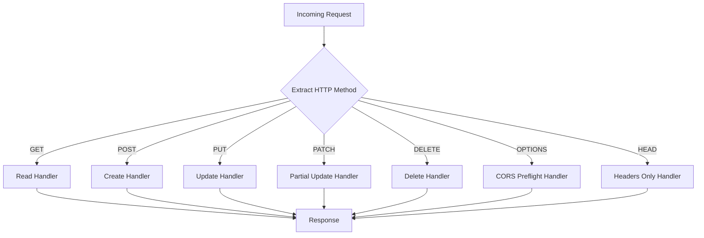
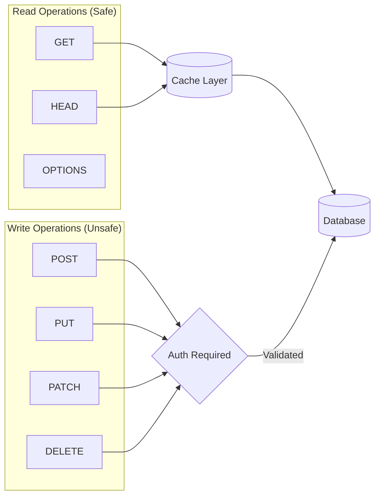
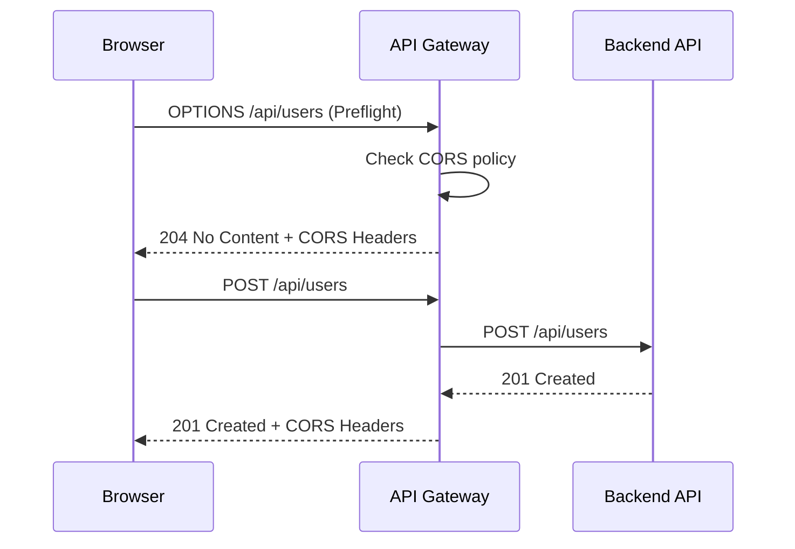

# How to Create Method-Based Routing

Author: [nawazdhandala](https://github.com/nawazdhandala)

Tags: API Gateway, Routing, HTTP Methods, REST

Description: Learn how to route requests based on HTTP methods.

---

Method-based routing is a fundamental pattern in API gateway design that enables you to direct incoming requests to different handlers based on their HTTP method (GET, POST, PUT, DELETE, etc.). This approach allows for cleaner architecture, better security controls, and more maintainable code.

## Why Method-Based Routing?

| Use Case | Benefit |
|----------|---------|
| CRUD operations | Map HTTP verbs to database operations |
| Security | Apply different auth rules per method |
| Rate limiting | Different limits for reads vs writes |
| Caching | Cache GET requests, bypass for mutations |
| Logging | Track write operations more closely |

## How Method-Based Routing Works



## Method-Specific Routing Rules

The foundation of method-based routing is matching the HTTP method to the appropriate handler:

```javascript
class MethodRouter {
  constructor() {
    this.routes = new Map();
  }

  // Register a handler for a specific method and path
  addRoute(method, path, handler) {
    const key = `${method.toUpperCase()}:${path}`;
    this.routes.set(key, handler);
  }

  // Convenience methods for common HTTP verbs
  get(path, handler) {
    this.addRoute('GET', path, handler);
  }

  post(path, handler) {
    this.addRoute('POST', path, handler);
  }

  put(path, handler) {
    this.addRoute('PUT', path, handler);
  }

  patch(path, handler) {
    this.addRoute('PATCH', path, handler);
  }

  delete(path, handler) {
    this.addRoute('DELETE', path, handler);
  }

  options(path, handler) {
    this.addRoute('OPTIONS', path, handler);
  }

  // Route an incoming request
  route(req, res) {
    const method = req.method.toUpperCase();
    const path = req.path;
    const key = `${method}:${path}`;

    const handler = this.routes.get(key);

    if (!handler) {
      // Check if path exists with different method
      const allowedMethods = this.getAllowedMethods(path);

      if (allowedMethods.length > 0) {
        res.setHeader('Allow', allowedMethods.join(', '));
        return res.status(405).json({
          error: 'Method Not Allowed',
          allowedMethods,
        });
      }

      return res.status(404).json({ error: 'Not Found' });
    }

    return handler(req, res);
  }

  // Get all methods registered for a path
  getAllowedMethods(path) {
    const methods = [];
    for (const key of this.routes.keys()) {
      const [method, routePath] = key.split(':');
      if (routePath === path) {
        methods.push(method);
      }
    }
    return methods;
  }
}

// Usage
const router = new MethodRouter();

router.get('/users', (req, res) => {
  res.json({ users: [] });
});

router.post('/users', (req, res) => {
  res.status(201).json({ id: 1, ...req.body });
});

router.put('/users/:id', (req, res) => {
  res.json({ id: req.params.id, ...req.body });
});

router.delete('/users/:id', (req, res) => {
  res.status(204).send();
});
```

## CRUD Operation Routing

A complete implementation mapping HTTP methods to CRUD operations:

```javascript
class CRUDRouter {
  constructor(resourceName, controller) {
    this.resourceName = resourceName;
    this.controller = controller;
    this.basePath = `/${resourceName}`;
    this.itemPath = `/${resourceName}/:id`;
  }

  // Map HTTP methods to CRUD operations
  getRoutes() {
    return {
      [`GET:${this.basePath}`]: {
        handler: this.controller.list.bind(this.controller),
        description: `List all ${this.resourceName}`,
        operation: 'READ',
      },
      [`GET:${this.itemPath}`]: {
        handler: this.controller.get.bind(this.controller),
        description: `Get a single ${this.resourceName}`,
        operation: 'READ',
      },
      [`POST:${this.basePath}`]: {
        handler: this.controller.create.bind(this.controller),
        description: `Create a new ${this.resourceName}`,
        operation: 'CREATE',
      },
      [`PUT:${this.itemPath}`]: {
        handler: this.controller.replace.bind(this.controller),
        description: `Replace a ${this.resourceName}`,
        operation: 'UPDATE',
      },
      [`PATCH:${this.itemPath}`]: {
        handler: this.controller.update.bind(this.controller),
        description: `Partially update a ${this.resourceName}`,
        operation: 'UPDATE',
      },
      [`DELETE:${this.itemPath}`]: {
        handler: this.controller.delete.bind(this.controller),
        description: `Delete a ${this.resourceName}`,
        operation: 'DELETE',
      },
    };
  }
}

// Example controller
class UsersController {
  async list(req, res) {
    const users = await db.users.findMany({
      skip: req.query.offset || 0,
      take: req.query.limit || 20,
    });
    res.json({ data: users, total: users.length });
  }

  async get(req, res) {
    const user = await db.users.findUnique({
      where: { id: req.params.id },
    });
    if (!user) {
      return res.status(404).json({ error: 'User not found' });
    }
    res.json({ data: user });
  }

  async create(req, res) {
    const user = await db.users.create({
      data: req.body,
    });
    res.status(201).json({ data: user });
  }

  async replace(req, res) {
    const user = await db.users.update({
      where: { id: req.params.id },
      data: req.body,
    });
    res.json({ data: user });
  }

  async update(req, res) {
    const user = await db.users.update({
      where: { id: req.params.id },
      data: req.body,
    });
    res.json({ data: user });
  }

  async delete(req, res) {
    await db.users.delete({
      where: { id: req.params.id },
    });
    res.status(204).send();
  }
}

// Usage
const usersRouter = new CRUDRouter('users', new UsersController());
const routes = usersRouter.getRoutes();
```

## READ vs WRITE Separation

Separating read and write operations allows for different handling strategies:



```javascript
class ReadWriteRouter {
  constructor() {
    this.readMethods = new Set(['GET', 'HEAD', 'OPTIONS']);
    this.writeMethods = new Set(['POST', 'PUT', 'PATCH', 'DELETE']);
    this.routes = new Map();
    this.middleware = {
      read: [],
      write: [],
    };
  }

  // Add middleware for read operations
  useForReads(middleware) {
    this.middleware.read.push(middleware);
  }

  // Add middleware for write operations
  useForWrites(middleware) {
    this.middleware.write.push(middleware);
  }

  isReadMethod(method) {
    return this.readMethods.has(method.toUpperCase());
  }

  isWriteMethod(method) {
    return this.writeMethods.has(method.toUpperCase());
  }

  async route(req, res, next) {
    const method = req.method.toUpperCase();
    const isRead = this.isReadMethod(method);

    // Apply appropriate middleware chain
    const middlewareChain = isRead
      ? this.middleware.read
      : this.middleware.write;

    try {
      for (const mw of middlewareChain) {
        await new Promise((resolve, reject) => {
          mw(req, res, (err) => {
            if (err) reject(err);
            else resolve();
          });
        });
      }

      // Route to handler
      const key = `${method}:${req.path}`;
      const handler = this.routes.get(key);

      if (handler) {
        return handler(req, res, next);
      }

      res.status(404).json({ error: 'Not Found' });
    } catch (error) {
      next(error);
    }
  }
}

// Configure read/write separation
const router = new ReadWriteRouter();

// Cache layer for reads
router.useForReads((req, res, next) => {
  const cacheKey = `${req.method}:${req.originalUrl}`;
  const cached = cache.get(cacheKey);

  if (cached) {
    res.setHeader('X-Cache', 'HIT');
    return res.json(cached);
  }

  res.setHeader('X-Cache', 'MISS');

  // Intercept response to cache it
  const originalJson = res.json.bind(res);
  res.json = (data) => {
    cache.set(cacheKey, data, { ttl: 60000 });
    return originalJson(data);
  };

  next();
});

// Strict auth for writes
router.useForWrites((req, res, next) => {
  const token = req.headers.authorization?.split(' ')[1];

  if (!token) {
    return res.status(401).json({ error: 'Authentication required' });
  }

  try {
    req.user = jwt.verify(token, process.env.JWT_SECRET);
    next();
  } catch {
    res.status(403).json({ error: 'Invalid token' });
  }
});

// CSRF protection for writes
router.useForWrites((req, res, next) => {
  const csrfToken = req.headers['x-csrf-token'];
  const sessionToken = req.session?.csrfToken;

  if (!csrfToken || csrfToken !== sessionToken) {
    return res.status(403).json({ error: 'Invalid CSRF token' });
  }

  next();
});

// Rate limiting - stricter for writes
router.useForWrites((req, res, next) => {
  const key = `write:${req.ip}`;
  const limit = rateLimiter.check(key, { maxRequests: 10, windowMs: 60000 });

  if (!limit.allowed) {
    return res.status(429).json({ error: 'Too many write operations' });
  }

  next();
});
```

## OPTIONS and CORS Handling

Proper handling of OPTIONS requests is crucial for CORS support:



```javascript
class CORSRouter {
  constructor(options = {}) {
    this.options = {
      allowedOrigins: options.allowedOrigins || ['*'],
      allowedMethods: options.allowedMethods || [
        'GET', 'POST', 'PUT', 'PATCH', 'DELETE', 'OPTIONS'
      ],
      allowedHeaders: options.allowedHeaders || [
        'Content-Type', 'Authorization', 'X-Requested-With'
      ],
      exposedHeaders: options.exposedHeaders || [
        'X-RateLimit-Limit', 'X-RateLimit-Remaining'
      ],
      credentials: options.credentials || false,
      maxAge: options.maxAge || 86400, // 24 hours
    };
    this.routes = new Map();
  }

  // Automatically handle OPTIONS for registered routes
  addRoute(method, path, handler) {
    const key = `${method.toUpperCase()}:${path}`;
    this.routes.set(key, handler);

    // Auto-register OPTIONS handler if not exists
    const optionsKey = `OPTIONS:${path}`;
    if (!this.routes.has(optionsKey)) {
      this.routes.set(optionsKey, (req, res) => {
        this.handlePreflight(req, res, path);
      });
    }
  }

  handlePreflight(req, res, path) {
    const origin = req.headers.origin;
    const requestedMethod = req.headers['access-control-request-method'];
    const requestedHeaders = req.headers['access-control-request-headers'];

    // Check if origin is allowed
    if (!this.isOriginAllowed(origin)) {
      return res.status(403).json({ error: 'Origin not allowed' });
    }

    // Check if method is allowed for this path
    const allowedMethods = this.getAllowedMethodsForPath(path);
    if (requestedMethod && !allowedMethods.includes(requestedMethod)) {
      return res.status(405).json({ error: 'Method not allowed' });
    }

    // Set CORS headers
    res.setHeader('Access-Control-Allow-Origin', origin || '*');
    res.setHeader('Access-Control-Allow-Methods', allowedMethods.join(', '));
    res.setHeader('Access-Control-Allow-Headers', this.options.allowedHeaders.join(', '));
    res.setHeader('Access-Control-Expose-Headers', this.options.exposedHeaders.join(', '));
    res.setHeader('Access-Control-Max-Age', this.options.maxAge);

    if (this.options.credentials) {
      res.setHeader('Access-Control-Allow-Credentials', 'true');
    }

    // Respond with 204 No Content
    res.status(204).send();
  }

  isOriginAllowed(origin) {
    if (this.options.allowedOrigins.includes('*')) {
      return true;
    }
    return this.options.allowedOrigins.includes(origin);
  }

  getAllowedMethodsForPath(path) {
    const methods = [];
    for (const key of this.routes.keys()) {
      const [method, routePath] = key.split(':');
      if (routePath === path && method !== 'OPTIONS') {
        methods.push(method);
      }
    }
    // Always include OPTIONS
    methods.push('OPTIONS');
    return methods;
  }

  // Middleware to add CORS headers to all responses
  corsMiddleware() {
    return (req, res, next) => {
      const origin = req.headers.origin;

      if (origin && this.isOriginAllowed(origin)) {
        res.setHeader('Access-Control-Allow-Origin', origin);

        if (this.options.credentials) {
          res.setHeader('Access-Control-Allow-Credentials', 'true');
        }

        res.setHeader('Access-Control-Expose-Headers',
          this.options.exposedHeaders.join(', '));
      }

      // Handle preflight
      if (req.method === 'OPTIONS') {
        return this.handlePreflight(req, res, req.path);
      }

      next();
    };
  }

  route(req, res, next) {
    const key = `${req.method.toUpperCase()}:${req.path}`;
    const handler = this.routes.get(key);

    if (handler) {
      return handler(req, res, next);
    }

    res.status(404).json({ error: 'Not Found' });
  }
}

// Usage
const corsRouter = new CORSRouter({
  allowedOrigins: ['https://app.example.com', 'https://admin.example.com'],
  credentials: true,
});

corsRouter.addRoute('GET', '/api/users', listUsers);
corsRouter.addRoute('POST', '/api/users', createUser);
corsRouter.addRoute('PUT', '/api/users/:id', updateUser);
corsRouter.addRoute('DELETE', '/api/users/:id', deleteUser);

// Express integration
app.use(corsRouter.corsMiddleware());
```

## Method Override Handling

Sometimes clients (especially legacy systems) cannot send certain HTTP methods. Method override allows using POST with a header or query parameter:

```javascript
class MethodOverrideRouter {
  constructor(options = {}) {
    this.overrideHeader = options.header || 'X-HTTP-Method-Override';
    this.overrideQuery = options.query || '_method';
    this.allowedOverrides = new Set(options.allowedMethods || [
      'PUT', 'PATCH', 'DELETE'
    ]);
    this.routes = new Map();
  }

  // Middleware to handle method override
  methodOverrideMiddleware() {
    return (req, res, next) => {
      // Only override POST requests
      if (req.method !== 'POST') {
        return next();
      }

      // Check header first
      let overrideMethod = req.headers[this.overrideHeader.toLowerCase()];

      // Then check query parameter
      if (!overrideMethod && req.query[this.overrideQuery]) {
        overrideMethod = req.query[this.overrideQuery];
      }

      // Check body for _method (form submissions)
      if (!overrideMethod && req.body?._method) {
        overrideMethod = req.body._method;
        delete req.body._method; // Remove from body
      }

      if (overrideMethod) {
        overrideMethod = overrideMethod.toUpperCase();

        // Validate the override method
        if (!this.allowedOverrides.has(overrideMethod)) {
          return res.status(400).json({
            error: 'Invalid method override',
            message: `Method ${overrideMethod} cannot be used as override`,
            allowedOverrides: Array.from(this.allowedOverrides),
          });
        }

        // Store original method and apply override
        req.originalMethod = req.method;
        req.method = overrideMethod;

        // Log the override for debugging
        console.log(`Method override: POST -> ${overrideMethod} for ${req.path}`);
      }

      next();
    };
  }

  addRoute(method, path, handler) {
    const key = `${method.toUpperCase()}:${path}`;
    this.routes.set(key, handler);
  }

  route(req, res, next) {
    const key = `${req.method}:${req.path}`;
    const handler = this.routes.get(key);

    if (handler) {
      return handler(req, res, next);
    }

    // Check if method was overridden and suggest correct usage
    if (req.originalMethod) {
      return res.status(404).json({
        error: 'Not Found',
        note: `Request was overridden from ${req.originalMethod} to ${req.method}`,
      });
    }

    res.status(404).json({ error: 'Not Found' });
  }
}

// Usage
const overrideRouter = new MethodOverrideRouter();

app.use(overrideRouter.methodOverrideMiddleware());

// Register routes
overrideRouter.addRoute('PUT', '/api/users/:id', updateUser);
overrideRouter.addRoute('DELETE', '/api/users/:id', deleteUser);

// Client can now use:
// POST /api/users/123?_method=DELETE
// POST /api/users/123 with header X-HTTP-Method-Override: PUT
// POST /api/users/123 with body { _method: 'PATCH', ...data }
```

## Multi-Method Endpoints

Some endpoints need to handle multiple methods with shared logic:

```mermaid
flowchart TD
    A[/api/resource] --> B{Method?}
    B --> |GET| C[List Resources]
    B --> |POST| D[Create Resource]
    B --> |DELETE| E[Bulk Delete]

    F[/api/resource/:id] --> G{Method?}
    G --> |GET| H[Get Single]
    G --> |PUT| I[Replace]
    G --> |PATCH| J[Update]
    G --> |DELETE| K[Delete Single]

    subgraph "Shared Middleware"
        L[Auth Check]
        M[Validation]
        N[Logging]
    end

    L --> M --> N --> A
    L --> M --> N --> F
```

```javascript
class MultiMethodEndpoint {
  constructor(path, options = {}) {
    this.path = path;
    this.handlers = new Map();
    this.beforeHandlers = [];
    this.afterHandlers = [];
    this.options = options;
  }

  // Register handlers for multiple methods
  handle(methods, handler) {
    const methodList = Array.isArray(methods) ? methods : [methods];
    for (const method of methodList) {
      this.handlers.set(method.toUpperCase(), handler);
    }
    return this;
  }

  // Shorthand methods
  get(handler) { return this.handle('GET', handler); }
  post(handler) { return this.handle('POST', handler); }
  put(handler) { return this.handle('PUT', handler); }
  patch(handler) { return this.handle('PATCH', handler); }
  delete(handler) { return this.handle('DELETE', handler); }

  // Handle multiple methods with same handler
  readMethods(handler) {
    return this.handle(['GET', 'HEAD'], handler);
  }

  writeMethods(handler) {
    return this.handle(['POST', 'PUT', 'PATCH'], handler);
  }

  allMethods(handler) {
    return this.handle(
      ['GET', 'POST', 'PUT', 'PATCH', 'DELETE', 'HEAD', 'OPTIONS'],
      handler
    );
  }

  // Add before/after middleware
  before(middleware) {
    this.beforeHandlers.push(middleware);
    return this;
  }

  after(middleware) {
    this.afterHandlers.push(middleware);
    return this;
  }

  // Get the Express-compatible router
  toRouter() {
    const express = require('express');
    const router = express.Router();

    // Build middleware chain
    const middlewareChain = [
      ...this.beforeHandlers,
      this.routeHandler.bind(this),
      ...this.afterHandlers,
    ];

    router.all(this.path, ...middlewareChain);

    return router;
  }

  routeHandler(req, res, next) {
    const method = req.method.toUpperCase();
    const handler = this.handlers.get(method);

    if (!handler) {
      const allowedMethods = Array.from(this.handlers.keys());
      res.setHeader('Allow', allowedMethods.join(', '));
      return res.status(405).json({
        error: 'Method Not Allowed',
        allowedMethods,
      });
    }

    return handler(req, res, next);
  }

  // Get info about this endpoint
  getInfo() {
    return {
      path: this.path,
      methods: Array.from(this.handlers.keys()),
      options: this.options,
    };
  }
}

// Usage example
const usersEndpoint = new MultiMethodEndpoint('/api/users/:id')
  .before(authMiddleware)
  .before(validateUserAccess)
  .get(async (req, res) => {
    const user = await db.users.findById(req.params.id);
    res.json({ data: user });
  })
  .put(async (req, res) => {
    const user = await db.users.update(req.params.id, req.body);
    res.json({ data: user });
  })
  .patch(async (req, res) => {
    const user = await db.users.patch(req.params.id, req.body);
    res.json({ data: user });
  })
  .delete(async (req, res) => {
    await db.users.delete(req.params.id);
    res.status(204).send();
  })
  .after(auditLogMiddleware);

app.use(usersEndpoint.toRouter());
```

## Production API Gateway Implementation

A complete method-based routing solution for production:

```javascript
class APIGateway {
  constructor(options = {}) {
    this.routes = new Map();
    this.globalMiddleware = [];
    this.methodMiddleware = {
      GET: [],
      POST: [],
      PUT: [],
      PATCH: [],
      DELETE: [],
      OPTIONS: [],
      HEAD: [],
    };
    this.options = {
      enableCORS: true,
      enableMethodOverride: true,
      defaultTimeout: 30000,
      ...options,
    };
  }

  // Register global middleware
  use(middleware) {
    this.globalMiddleware.push(middleware);
    return this;
  }

  // Register method-specific middleware
  useForMethod(method, middleware) {
    const methods = Array.isArray(method) ? method : [method];
    for (const m of methods) {
      if (this.methodMiddleware[m.toUpperCase()]) {
        this.methodMiddleware[m.toUpperCase()].push(middleware);
      }
    }
    return this;
  }

  // Register a route
  route(method, path, handler, options = {}) {
    const key = `${method.toUpperCase()}:${path}`;
    this.routes.set(key, {
      handler,
      method: method.toUpperCase(),
      path,
      options: {
        timeout: this.options.defaultTimeout,
        ...options,
      },
    });
    return this;
  }

  // Convenience methods
  get(path, handler, options) {
    return this.route('GET', path, handler, options);
  }

  post(path, handler, options) {
    return this.route('POST', path, handler, options);
  }

  put(path, handler, options) {
    return this.route('PUT', path, handler, options);
  }

  patch(path, handler, options) {
    return this.route('PATCH', path, handler, options);
  }

  delete(path, handler, options) {
    return this.route('DELETE', path, handler, options);
  }

  // Main request handler
  async handleRequest(req, res) {
    const startTime = Date.now();

    try {
      // Method override
      if (this.options.enableMethodOverride) {
        this.applyMethodOverride(req);
      }

      const method = req.method.toUpperCase();
      const path = this.normalizePath(req.path);

      // Find matching route
      const { route, params } = this.matchRoute(method, path);

      if (!route) {
        return this.handleNotFound(req, res, path);
      }

      // Attach params to request
      req.params = params;

      // Build middleware chain
      const chain = [
        ...this.globalMiddleware,
        ...this.methodMiddleware[method],
        ...(route.options.middleware || []),
      ];

      // Execute middleware chain
      await this.executeChain(chain, req, res);

      if (res.headersSent) {
        return;
      }

      // Execute handler with timeout
      const result = await this.executeWithTimeout(
        route.handler(req, res),
        route.options.timeout
      );

      // Log request
      this.logRequest(req, res, startTime);

      return result;
    } catch (error) {
      this.handleError(error, req, res, startTime);
    }
  }

  applyMethodOverride(req) {
    if (req.method !== 'POST') return;

    const override =
      req.headers['x-http-method-override'] ||
      req.query._method ||
      req.body?._method;

    if (override) {
      const method = override.toUpperCase();
      if (['PUT', 'PATCH', 'DELETE'].includes(method)) {
        req.originalMethod = req.method;
        req.method = method;
      }
    }
  }

  normalizePath(path) {
    return path.replace(/\/+$/, '') || '/';
  }

  matchRoute(method, path) {
    // First try exact match
    const exactKey = `${method}:${path}`;
    if (this.routes.has(exactKey)) {
      return { route: this.routes.get(exactKey), params: {} };
    }

    // Try pattern matching
    for (const [key, route] of this.routes) {
      if (!key.startsWith(`${method}:`)) continue;

      const routePath = key.split(':')[1];
      const params = this.matchPath(routePath, path);

      if (params !== null) {
        return { route, params };
      }
    }

    return { route: null, params: {} };
  }

  matchPath(pattern, path) {
    const patternParts = pattern.split('/');
    const pathParts = path.split('/');

    if (patternParts.length !== pathParts.length) {
      return null;
    }

    const params = {};

    for (let i = 0; i < patternParts.length; i++) {
      const patternPart = patternParts[i];
      const pathPart = pathParts[i];

      if (patternPart.startsWith(':')) {
        params[patternPart.slice(1)] = pathPart;
      } else if (patternPart !== pathPart) {
        return null;
      }
    }

    return params;
  }

  async executeChain(middlewares, req, res) {
    let index = 0;

    const next = async (error) => {
      if (error) throw error;
      if (index >= middlewares.length) return;

      const middleware = middlewares[index++];
      await middleware(req, res, next);
    };

    await next();
  }

  executeWithTimeout(promise, timeout) {
    return new Promise((resolve, reject) => {
      const timer = setTimeout(() => {
        reject(new Error('Request timeout'));
      }, timeout);

      Promise.resolve(promise)
        .then((result) => {
          clearTimeout(timer);
          resolve(result);
        })
        .catch((error) => {
          clearTimeout(timer);
          reject(error);
        });
    });
  }

  handleNotFound(req, res, path) {
    // Check if path exists with different method
    const methods = [];
    for (const key of this.routes.keys()) {
      const [method, routePath] = key.split(':');
      const params = this.matchPath(routePath, path);
      if (params !== null) {
        methods.push(method);
      }
    }

    if (methods.length > 0) {
      res.setHeader('Allow', methods.join(', '));
      return res.status(405).json({
        error: 'Method Not Allowed',
        message: `${req.method} is not supported for ${path}`,
        allowedMethods: methods,
      });
    }

    return res.status(404).json({
      error: 'Not Found',
      message: `No route found for ${req.method} ${path}`,
    });
  }

  handleError(error, req, res, startTime) {
    console.error('Request error:', {
      method: req.method,
      path: req.path,
      error: error.message,
      duration: Date.now() - startTime,
    });

    if (error.message === 'Request timeout') {
      return res.status(504).json({
        error: 'Gateway Timeout',
        message: 'Request took too long to process',
      });
    }

    res.status(500).json({
      error: 'Internal Server Error',
      message: process.env.NODE_ENV === 'development'
        ? error.message
        : 'An unexpected error occurred',
    });
  }

  logRequest(req, res, startTime) {
    const duration = Date.now() - startTime;
    console.log({
      method: req.method,
      path: req.path,
      status: res.statusCode,
      duration: `${duration}ms`,
      userAgent: req.headers['user-agent'],
    });
  }

  // Generate OpenAPI spec from routes
  generateOpenAPISpec() {
    const paths = {};

    for (const [key, route] of this.routes) {
      const [method, path] = key.split(':');
      const openAPIPath = path.replace(/:(\w+)/g, '{$1}');

      if (!paths[openAPIPath]) {
        paths[openAPIPath] = {};
      }

      paths[openAPIPath][method.toLowerCase()] = {
        summary: route.options.summary || `${method} ${path}`,
        description: route.options.description || '',
        parameters: this.extractParameters(path),
        responses: {
          200: { description: 'Success' },
          400: { description: 'Bad Request' },
          404: { description: 'Not Found' },
          405: { description: 'Method Not Allowed' },
          500: { description: 'Internal Server Error' },
        },
      };
    }

    return {
      openapi: '3.0.0',
      info: {
        title: 'API Gateway',
        version: '1.0.0',
      },
      paths,
    };
  }

  extractParameters(path) {
    const params = [];
    const matches = path.match(/:(\w+)/g) || [];

    for (const match of matches) {
      params.push({
        name: match.slice(1),
        in: 'path',
        required: true,
        schema: { type: 'string' },
      });
    }

    return params;
  }
}

// Usage
const gateway = new APIGateway({
  enableCORS: true,
  defaultTimeout: 30000,
});

// Global middleware
gateway.use(requestIdMiddleware);
gateway.use(loggingMiddleware);

// Method-specific middleware
gateway.useForMethod(['GET', 'HEAD'], cacheMiddleware);
gateway.useForMethod(['POST', 'PUT', 'PATCH', 'DELETE'], authMiddleware);
gateway.useForMethod(['POST', 'PUT', 'PATCH', 'DELETE'], csrfMiddleware);

// Register routes
gateway
  .get('/api/users', listUsers, { summary: 'List all users' })
  .get('/api/users/:id', getUser, { summary: 'Get user by ID' })
  .post('/api/users', createUser, { summary: 'Create new user' })
  .put('/api/users/:id', updateUser, { summary: 'Update user' })
  .delete('/api/users/:id', deleteUser, { summary: 'Delete user' });

// Express integration
app.use((req, res) => gateway.handleRequest(req, res));
```

## Summary

| Feature | Implementation | Use Case |
|---------|---------------|----------|
| **Method-Specific Rules** | Map method + path to handlers | Basic routing |
| **CRUD Mapping** | HTTP verbs to DB operations | RESTful APIs |
| **Read/Write Separation** | Different middleware chains | Security, caching |
| **OPTIONS/CORS** | Automatic preflight handling | Browser clients |
| **Method Override** | POST + header/query to PUT/DELETE | Legacy clients |
| **Multi-Method** | Single endpoint, multiple handlers | Complex resources |

Method-based routing is the foundation of any API gateway. By properly separating concerns based on HTTP methods, you can implement fine-grained security, optimize performance through selective caching, and maintain cleaner code organization. Start with simple method matching and progressively add features like CORS handling and method override as your API requirements grow.
