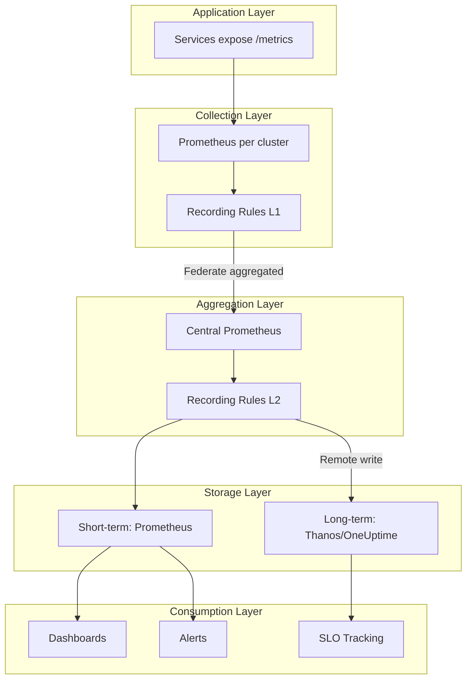

# How to Build Metric Aggregation Strategies

Author: [nawazdhandala](https://github.com/nawazdhandala)

Tags: Observability, Metrics, Prometheus, Monitoring

Description: Learn how to design and implement metric aggregation strategies for scalable monitoring systems.

You're running a microservices platform with 500 services, each exposing 200 metrics, scraped every 15 seconds. That's 40 million data points per minute. Your Prometheus instance is groaning under the load, queries timeout after 30 seconds, and your storage costs are climbing faster than your user base.

Sound familiar? The solution isn't more hardware. It's smarter aggregation.

Metric aggregation is the art of reducing data volume while preserving signal. Done right, it slashes storage costs, speeds up queries, and maintains the visibility you need. Done wrong, it creates blind spots that only surface during incidents.

This guide walks you through practical aggregation strategies that scale.

---

## Understanding the Two Dimensions of Aggregation

Before diving into techniques, let's establish a mental model. Metrics can be aggregated across two dimensions:


**Temporal aggregation** reduces resolution over time. Instead of per-second data, you keep per-minute or per-hour summaries.

**Spatial aggregation** reduces cardinality across labels. Instead of per-pod metrics, you keep per-service or per-cluster summaries.

Most effective strategies combine both.

---

## Temporal Aggregation: Rates, Averages, and Windows

Temporal aggregation transforms raw samples into time-windowed summaries. The key functions in PromQL:

### Rate and Increase

`rate()` calculates per-second average rate of increase over a time window. It's the workhorse for counters:

```promql
# Raw counter (cumulative, resets on restart)
http_requests_total{service="api", status="200"}

# Per-second request rate over 5 minutes
rate(http_requests_total{service="api", status="200"}[5m])

# Total requests in the last hour
increase(http_requests_total{service="api", status="200"}[1h])
```

**When to use what:**
- `rate()` for dashboards and alerting (normalized, comparable)
- `increase()` for reports and SLO calculations (actual counts)
- `irate()` for volatile, short-lived spikes (uses last two samples only)

### Aggregation Over Time

For gauges (values that go up and down), use the `*_over_time` family:

```promql
# Average CPU usage over 5 minutes
avg_over_time(node_cpu_usage_percent[5m])

# Maximum memory usage in the last hour
max_over_time(container_memory_usage_bytes[1h])

# 95th percentile latency over 10 minutes
quantile_over_time(0.95, http_request_duration_seconds[10m])

# Count of samples (useful for detecting gaps)
count_over_time(up[1h])
```

### Choosing Window Sizes

Window size is a tradeoff between smoothing and responsiveness:


**Guidelines:**
- Alerting: 2-5 minute windows (balance noise vs. detection speed)
- Dashboards: 5-15 minute windows (readable trends)
- Capacity planning: 1-24 hour windows (long-term patterns)

---

## Spatial Aggregation: Reducing Cardinality

Spatial aggregation reduces the number of unique time series by combining metrics across label values.

### Basic Aggregation Operators

```promql
# Total requests across all pods in a service
sum(rate(http_requests_total[5m])) by (service)

# Average latency per region
avg(http_request_duration_seconds) by (region)

# Max memory usage per node
max(container_memory_usage_bytes) by (node)

# Count of healthy instances per service
count(up == 1) by (service)
```

### The Cardinality Problem

Consider this metric with high cardinality:

```promql
# Original: 500 services x 50 pods x 10 endpoints x 5 status codes
# = 1.25 million time series
http_requests_total{service, pod, endpoint, status}
```

Strategic aggregation reduces this dramatically:

```promql
# Aggregate away pod (ephemeral anyway): 25,000 series
sum(rate(http_requests_total[5m])) by (service, endpoint, status)

# Further aggregate endpoint for alerting: 2,500 series
sum(rate(http_requests_total[5m])) by (service, status)

# Service-level error rate for SLOs: 500 series
sum(rate(http_requests_total{status=~"5.."}[5m])) by (service)
/
sum(rate(http_requests_total[5m])) by (service)
```

### Preserving Important Dimensions

Not all labels should be aggregated away. Keep labels that are:

1. **Actionable**: Can you route an alert based on this label?
2. **Stable**: Does this label have bounded cardinality?
3. **Meaningful**: Does this label affect interpretation?

```promql
# Good: Keep service, environment, region (bounded, actionable)
sum(rate(http_requests_total[5m])) by (service, env, region)

# Bad: Keep user_id, request_id, session_id (unbounded, not actionable)
sum(rate(http_requests_total[5m])) by (user_id)  # Don't do this
```

---

## Recording Rules: Pre-Aggregation at Scale

Recording rules compute aggregations at scrape time, storing the results as new time series. They're essential for:

- Speeding up dashboards and alerts
- Reducing query-time computation
- Enabling longer retention of aggregated data

### Recording Rule Syntax

```yaml
# prometheus.yml or rules file
groups:
  - name: aggregation_rules
    interval: 1m  # Evaluation frequency
    rules:
      # Service-level request rate
      - record: service:http_requests:rate5m
        expr: sum(rate(http_requests_total[5m])) by (service, status)

      # Service error ratio
      - record: service:http_errors:ratio5m
        expr: |
          sum(rate(http_requests_total{status=~"5.."}[5m])) by (service)
          /
          sum(rate(http_requests_total[5m])) by (service)

      # P99 latency per service (from histogram)
      - record: service:http_latency:p99_5m
        expr: |
          histogram_quantile(0.99,
            sum(rate(http_request_duration_seconds_bucket[5m])) by (service, le)
          )
```

### Recording Rule Naming Convention

Follow a consistent naming pattern for discoverability:

```
level:metric:operations
```

- **level**: Aggregation level (e.g., `service`, `cluster`, `node`)
- **metric**: Base metric name
- **operations**: Applied transformations (e.g., `rate5m`, `p99`, `ratio`)

Examples:
```yaml
# Service-level request rate over 5m
service:http_requests:rate5m

# Cluster-level CPU usage average
cluster:node_cpu:avg

# Job-level error ratio
job:errors:ratio5m
```

### Hierarchical Recording Rules

Build aggregation hierarchies for flexibility:

```yaml
groups:
  - name: level_1_pod_aggregation
    rules:
      # First: aggregate to service level
      - record: service:http_requests:rate5m
        expr: sum(rate(http_requests_total[5m])) by (service, env, status)

  - name: level_2_env_aggregation
    rules:
      # Then: aggregate services to environment level (uses level 1)
      - record: env:http_requests:rate5m
        expr: sum(service:http_requests:rate5m) by (env, status)

  - name: level_3_global_aggregation
    rules:
      # Finally: global aggregation (uses level 2)
      - record: global:http_requests:rate5m
        expr: sum(env:http_requests:rate5m) by (status)
```


---

## Federation and Remote Write Patterns

For multi-cluster or large-scale deployments, aggregation happens at the architecture level.

### Hierarchical Federation

Edge Prometheus instances collect raw metrics. A central Prometheus federates only the aggregated data:

```yaml
# Central Prometheus scrape config
scrape_configs:
  - job_name: 'federate-clusters'
    honor_labels: true
    metrics_path: '/federate'
    params:
      'match[]':
        # Only federate recording rules (pre-aggregated)
        - '{__name__=~"service:.*"}'
        - '{__name__=~"cluster:.*"}'
    static_configs:
      - targets:
        - 'prometheus-cluster-a:9090'
        - 'prometheus-cluster-b:9090'
        - 'prometheus-cluster-c:9090'
```


### Remote Write with Aggregation

For long-term storage or external systems, use remote write with filtering:

```yaml
# prometheus.yml
remote_write:
  - url: "https://metrics.oneuptime.com/api/v1/write"
    write_relabel_configs:
      # Only send aggregated metrics to long-term storage
      - source_labels: [__name__]
        regex: '(service|cluster|global):.*'
        action: keep

      # Drop high-cardinality labels before sending
      - regex: 'pod|container_id|instance'
        action: labeldrop
```

### Aggregation at the Collector Level

OpenTelemetry Collector can aggregate before data leaves the node:

```yaml
# otel-collector-config.yaml
processors:
  # Aggregate metrics before export
  metricstransform:
    transforms:
      - include: http_requests_total
        action: update
        operations:
          # Remove pod label, aggregate by service
          - action: aggregate_labels
            aggregation_type: sum
            label_set: [service, status, env]

  # Batch and compress
  batch:
    timeout: 60s
    send_batch_size: 10000

exporters:
  prometheusremotewrite:
    endpoint: "https://metrics.oneuptime.com/api/v1/write"

service:
  pipelines:
    metrics:
      receivers: [prometheus]
      processors: [metricstransform, batch]
      exporters: [prometheusremotewrite]
```

---

## Downsampling Strategies

Downsampling reduces temporal resolution for historical data. Keep high-resolution data for recent queries, lower resolution for historical analysis.

### Time-Based Retention Tiers


### Implementing with Recording Rules

Create downsampled versions at different resolutions:

```yaml
groups:
  - name: downsampling_5m
    interval: 5m
    rules:
      - record: downsampled:cpu_usage:avg5m
        expr: avg_over_time(node_cpu_usage_percent[5m])

      - record: downsampled:memory_usage:avg5m
        expr: avg_over_time(node_memory_usage_bytes[5m])

      - record: downsampled:http_requests:rate5m
        expr: sum(rate(http_requests_total[5m])) by (service)

  - name: downsampling_1h
    interval: 1h
    rules:
      - record: downsampled:cpu_usage:avg1h
        expr: avg_over_time(downsampled:cpu_usage:avg5m[1h])

      - record: downsampled:memory_usage:avg1h
        expr: avg_over_time(downsampled:memory_usage:avg5m[1h])
```

### Thanos/Cortex Compaction

For production systems, use purpose-built tools:

```yaml
# Thanos compactor config
compactor:
  retention:
    # Keep raw resolution for 2 days
    resolution_raw: 2d
    # Keep 5m downsampled for 30 days
    resolution_5m: 30d
    # Keep 1h downsampled for 1 year
    resolution_1h: 365d
```

---

## Query Optimization Through Aggregation

Even with recording rules, query patterns matter for performance.

### Anti-Patterns to Avoid

```promql
# BAD: Aggregates 1M series at query time
sum(rate(http_requests_total[5m]))

# GOOD: Uses pre-aggregated recording rule
sum(service:http_requests:rate5m)

# BAD: Regex on high-cardinality label
http_requests_total{endpoint=~".*api.*"}

# GOOD: Explicit label match
http_requests_total{endpoint="/api/v1/users"}

# BAD: Long range on raw data
avg_over_time(cpu_usage[30d])

# GOOD: Use downsampled data for long ranges
avg_over_time(downsampled:cpu_usage:avg1h[30d])
```

### Query Optimization Checklist

1. **Use recording rules** for any query that runs repeatedly (dashboards, alerts)
2. **Limit time ranges** proportional to data resolution
3. **Filter early** with label matchers before aggregation
4. **Avoid regex** on high-cardinality labels
5. **Use subqueries sparingly** - they're expensive

### Grafana Variable Optimization

```promql
# BAD: Fetches all label values, then filters in Grafana
label_values(http_requests_total, service)

# GOOD: Pre-filter to active services
label_values(service:http_requests:rate5m > 0, service)
```

---

## Putting It All Together: A Complete Strategy

Here's a reference architecture for a medium-scale deployment:



### Implementation Checklist

**Phase 1: Foundation**
- [ ] Audit current metrics and identify high-cardinality offenders
- [ ] Define cardinality budget (e.g., max 100k active series per service)
- [ ] Establish naming conventions for recording rules

**Phase 2: Recording Rules**
- [ ] Create L1 rules: pod -> service aggregation
- [ ] Create L2 rules: service -> environment aggregation
- [ ] Create SLO-specific rules (error ratios, latency percentiles)

**Phase 3: Architecture**
- [ ] Deploy per-cluster Prometheus with local recording rules
- [ ] Configure federation or remote write for aggregated data only
- [ ] Set up tiered retention (raw -> 5m -> 1h -> 1d)

**Phase 4: Optimization**
- [ ] Convert dashboard queries to use recording rules
- [ ] Convert alert expressions to use recording rules
- [ ] Monitor query performance and iterate

---

## Common Mistakes and How to Avoid Them

| Mistake | Symptom | Fix |
|---------|---------|-----|
| Aggregating too early | Can't drill down during incidents | Keep raw data for 24-48h; aggregate for long-term |
| Aggregating too late | Slow queries, high storage costs | Add recording rules for common query patterns |
| Wrong aggregation function | Misleading metrics (e.g., avg of rates) | Use sum for rates, avg for gauges, histogram_quantile for latencies |
| Ignoring histogram aggregation | Incorrect percentiles | Always aggregate by `le` label, then apply histogram_quantile |
| No cardinality limits | Unbounded growth, OOM | Enforce limits at instrumentation and relabeling |

---

## Histogram Aggregation: A Special Case

Histograms require careful handling. The `le` (less than or equal) label must be preserved during aggregation:

```promql
# CORRECT: Aggregate buckets, then calculate percentile
histogram_quantile(0.99,
  sum(rate(http_request_duration_seconds_bucket[5m])) by (service, le)
)

# WRONG: Calculate percentile per instance, then average
avg(
  histogram_quantile(0.99, rate(http_request_duration_seconds_bucket[5m]))
) by (service)
# This gives mathematically incorrect results!
```

Recording rule for histogram aggregation:

```yaml
rules:
  # Pre-aggregate histogram buckets
  - record: service:http_latency_bucket:rate5m
    expr: sum(rate(http_request_duration_seconds_bucket[5m])) by (service, le)

  # Then calculate percentiles from aggregated buckets
  - record: service:http_latency:p50_5m
    expr: histogram_quantile(0.50, service:http_latency_bucket:rate5m)

  - record: service:http_latency:p99_5m
    expr: histogram_quantile(0.99, service:http_latency_bucket:rate5m)
```

---

## Final Thoughts

Metric aggregation isn't about throwing away data - it's about intentionally designing what questions you can answer and at what cost. The best strategies:

1. **Preserve drill-down capability** for recent data (incidents happen now)
2. **Pre-compute common queries** with recording rules (dashboards shouldn't compute)
3. **Federate and remote-write aggregated data** (raw data doesn't need to travel)
4. **Downsample progressively** for historical analysis (last year doesn't need per-second resolution)

Start with your highest-volume metrics. Identify the queries that run most often. Add recording rules for those first. Measure query latency before and after. Iterate.

Your future self - debugging an incident at 2 AM - will thank you for the fast queries.

---

**Related Reading:**

- [Three Pillars of Observability: Logs, Metrics, and Traces](https://oneuptime.com/blog/post/2025-08-20-three-pillars-of-observability-logs-metrics-traces/view)
- [SRE Metrics to Track](https://oneuptime.com/blog/post/2025-11-28-sre-metrics-to-track/view)
- [What is OpenTelemetry Collector and Why Use One](https://oneuptime.com/blog/post/2025-09-18-what-is-opentelemetry-collector-and-why-use-one/view)
