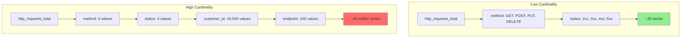
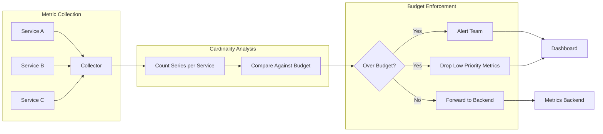
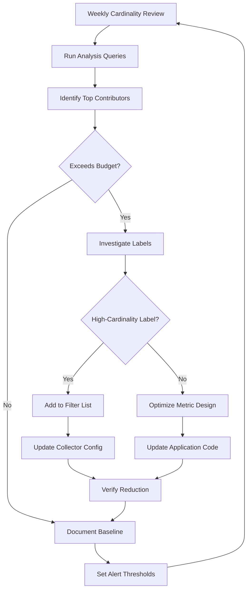

# How to Create Metric Cardinality Management

Author: [nawazdhandala](https://github.com/nawazdhandala)

Tags: Metrics, Cardinality, Prometheus, Cost

Description: Learn to create metric cardinality management for controlling metric explosion.

---

Metric cardinality is the number of unique time series your monitoring system stores. Every combination of metric name and label values creates a distinct time series. A single metric with a user ID label can explode into millions of series, crushing your monitoring infrastructure and budget.

This guide shows you how to build cardinality management into your observability pipeline, with practical configurations and code patterns you can deploy today.

---

## Understanding Cardinality Explosion

A metric like `http_requests_total` seems harmless. Add labels for method, status, and endpoint, and you might have 50 series. Add a customer ID label, and you now have 50 times your customer count. Add a request ID, and you have created unbounded cardinality that will eventually take down your metrics backend.



The cost of high cardinality compounds over time. Each series requires memory allocation, storage writes, and query processing. When cardinality grows unbounded, performance degrades, queries time out, and costs spiral upward.

---

## Setting Up Cardinality Limits

The first defense is establishing hard limits at the collection layer. Prometheus provides built-in sample limits, and the OpenTelemetry Collector offers filtering processors.

### Prometheus Scrape Configuration

Configure sample limits per scrape target to prevent any single service from overwhelming your metrics backend.

```yaml
# prometheus.yml
scrape_configs:
  - job_name: 'application'
    scrape_interval: 15s
    # Limit samples per scrape to prevent cardinality explosion
    sample_limit: 10000
    # Limit label values to catch runaway labels
    label_limit: 50
    label_name_length_limit: 128
    label_value_length_limit: 512
    static_configs:
      - targets: ['app:8080']
```

When a target exceeds the sample limit, Prometheus drops the entire scrape and logs a warning. This fail-safe prevents silent cardinality growth.

### OpenTelemetry Collector Filter Processor

The filter processor drops metrics matching specific criteria before they reach your backend.

```yaml
# otel-collector-config.yaml
processors:
  filter/cardinality:
    metrics:
      # Drop metrics with known high-cardinality labels
      exclude:
        match_type: regexp
        metric_names:
          - ".*"
        resource_attributes:
          - key: user.id
            value: ".*"
          - key: request.id
            value: ".*"
          - key: session.id
            value: ".*"

  # Transform to aggregate or remove problematic labels
  transform:
    metric_statements:
      - context: datapoint
        statements:
          # Remove high-cardinality attributes from all metrics
          - delete_key(attributes, "user_id")
          - delete_key(attributes, "trace_id")
```

---

## Building a Cardinality Budget System

Rather than reacting to cardinality problems, build a proactive budget system. Assign each team or service a cardinality allocation, track usage, and alert before limits are hit.



### Cardinality Tracking with Prometheus

Create a recording rule that tracks cardinality per job and label. This gives visibility into which services contribute most to your total series count.

```yaml
# recording-rules.yml
groups:
  - name: cardinality_tracking
    interval: 1m
    rules:
      # Count unique series per job
      - record: cardinality:series_count:by_job
        expr: count by (job) ({__name__=~".+"})

      # Count series per metric name
      - record: cardinality:series_count:by_metric
        expr: count by (__name__) ({__name__=~".+"})

      # Track top cardinality contributors
      - record: cardinality:top_labels:by_metric
        expr: |
          topk(10,
            count by (__name__, job) ({__name__=~".+"})
          )
```

### Alerting on Cardinality Growth

Set up alerts that fire before cardinality hits dangerous levels.

```yaml
# alerting-rules.yml
groups:
  - name: cardinality_alerts
    rules:
      # Alert when any job exceeds its budget
      - alert: CardinalityBudgetExceeded
        expr: cardinality:series_count:by_job > 50000
        for: 5m
        labels:
          severity: warning
        annotations:
          summary: "{{ $labels.job }} has exceeded cardinality budget"
          description: "Current series count: {{ $value }}"

      # Alert on rapid cardinality growth
      - alert: CardinalityGrowthSpike
        expr: |
          (
            cardinality:series_count:by_job
            - cardinality:series_count:by_job offset 1h
          ) / cardinality:series_count:by_job offset 1h > 0.5
        for: 10m
        labels:
          severity: critical
        annotations:
          summary: "{{ $labels.job }} cardinality grew 50% in 1 hour"
```

---

## Implementing Label Policies in Code

The best cardinality management happens at the source. Implement label policies in your instrumentation code to prevent high-cardinality labels from ever being emitted.

### Node.js Metric Helper with Label Validation

```typescript
// metrics.ts
import { Counter, Histogram, Registry } from 'prom-client';

// Define allowed label values for bounded cardinality
const ALLOWED_METHODS = ['GET', 'POST', 'PUT', 'DELETE', 'PATCH'];
const ALLOWED_STATUS_CLASSES = ['2xx', '3xx', '4xx', '5xx'];

// Normalize status codes to classes to reduce cardinality
function normalizeStatus(status: number): string {
  if (status >= 200 && status < 300) return '2xx';
  if (status >= 300 && status < 400) return '3xx';
  if (status >= 400 && status < 500) return '4xx';
  return '5xx';
}

// Normalize endpoints to reduce cardinality from path parameters
function normalizeEndpoint(path: string): string {
  // Replace UUIDs with placeholder
  let normalized = path.replace(
    /[0-9a-f]{8}-[0-9a-f]{4}-[0-9a-f]{4}-[0-9a-f]{4}-[0-9a-f]{12}/gi,
    ':id'
  );
  // Replace numeric IDs with placeholder
  normalized = normalized.replace(/\/\d+/g, '/:id');
  return normalized;
}

// Validate method to prevent unbounded values
function validateMethod(method: string): string {
  const upper = method.toUpperCase();
  return ALLOWED_METHODS.includes(upper) ? upper : 'OTHER';
}

export class MetricsManager {
  private registry: Registry;
  private httpRequestsTotal: Counter;
  private httpRequestDuration: Histogram;

  constructor() {
    this.registry = new Registry();

    this.httpRequestsTotal = new Counter({
      name: 'http_requests_total',
      help: 'Total HTTP requests',
      // Only include low-cardinality labels
      labelNames: ['method', 'status_class', 'endpoint'],
      registers: [this.registry],
    });

    this.httpRequestDuration = new Histogram({
      name: 'http_request_duration_seconds',
      help: 'HTTP request duration in seconds',
      labelNames: ['method', 'status_class', 'endpoint'],
      // Use fixed buckets instead of dynamic
      buckets: [0.01, 0.05, 0.1, 0.25, 0.5, 1, 2.5, 5, 10],
      registers: [this.registry],
    });
  }

  recordRequest(method: string, path: string, status: number, duration: number) {
    const labels = {
      method: validateMethod(method),
      status_class: normalizeStatus(status),
      endpoint: normalizeEndpoint(path),
    };

    this.httpRequestsTotal.inc(labels);
    this.httpRequestDuration.observe(labels, duration);
  }

  getRegistry(): Registry {
    return this.registry;
  }
}
```

### Python Label Policy Implementation

```python
# metrics.py
import re
from prometheus_client import Counter, Histogram, REGISTRY

# Patterns for normalizing high-cardinality path segments
UUID_PATTERN = re.compile(
    r'[0-9a-f]{8}-[0-9a-f]{4}-[0-9a-f]{4}-[0-9a-f]{4}-[0-9a-f]{12}',
    re.IGNORECASE
)
NUMERIC_ID_PATTERN = re.compile(r'/\d+')

ALLOWED_METHODS = frozenset(['GET', 'POST', 'PUT', 'DELETE', 'PATCH'])


def normalize_endpoint(path: str) -> str:
    """Normalize path to reduce cardinality from dynamic segments."""
    normalized = UUID_PATTERN.sub(':id', path)
    normalized = NUMERIC_ID_PATTERN.sub('/:id', normalized)
    return normalized


def normalize_status(status: int) -> str:
    """Group status codes into classes."""
    if 200 <= status < 300:
        return '2xx'
    elif 300 <= status < 400:
        return '3xx'
    elif 400 <= status < 500:
        return '4xx'
    return '5xx'


def validate_method(method: str) -> str:
    """Ensure method is from allowed set."""
    upper = method.upper()
    return upper if upper in ALLOWED_METHODS else 'OTHER'


# Create metrics with bounded label cardinality
http_requests_total = Counter(
    'http_requests_total',
    'Total HTTP requests',
    ['method', 'status_class', 'endpoint']
)

http_request_duration = Histogram(
    'http_request_duration_seconds',
    'HTTP request duration',
    ['method', 'status_class', 'endpoint'],
    buckets=[0.01, 0.05, 0.1, 0.25, 0.5, 1, 2.5, 5, 10]
)


def record_request(method: str, path: str, status: int, duration: float):
    """Record request with normalized labels."""
    labels = {
        'method': validate_method(method),
        'status_class': normalize_status(status),
        'endpoint': normalize_endpoint(path),
    }
    http_requests_total.labels(**labels).inc()
    http_request_duration.labels(**labels).observe(duration)
```

---

## Cardinality Analysis Queries

Use these PromQL queries to identify cardinality problems before they become critical.

```promql
# Find metrics with highest cardinality
topk(10, count by (__name__) ({__name__=~".+"}))

# Find labels contributing most to cardinality for a specific metric
count by (customer_id) (http_requests_total)

# Calculate cardinality per service
count by (job) ({__name__=~".+"})

# Identify metrics with unbounded label growth
count by (__name__) ({__name__=~".+"}) > 10000

# Find label values that appear only once (likely high cardinality)
count by (__name__, endpoint) (http_requests_total) == 1
```

---

## The Cardinality Management Workflow

Implement a continuous process for managing cardinality, not a one-time fix.



---

## Summary

Metric cardinality management requires action at multiple layers:

1. Set hard limits at the collection layer with sample limits and filter processors
2. Track cardinality per service with recording rules and dashboards
3. Alert on budget violations and growth spikes before they cause outages
4. Implement label validation in application code to prevent high-cardinality labels at the source
5. Run regular analysis to identify and address cardinality creep

The goal is not to minimize cardinality at all costs. The goal is to ensure every series provides value proportional to its storage and query cost. A metric with 10,000 series that drives incident response is worth keeping. A metric with 10,000 series that nobody queries should be dropped.

Build cardinality awareness into your observability culture. Make it part of code review, part of service onboarding, and part of your regular operational reviews. Your monitoring infrastructure and budget will thank you.

---

**Related Reading:**

- [How to Reduce Noise in OpenTelemetry](https://oneuptime.com/blog/post/2025-08-25-how-to-reduce-noise-in-opentelemetry/view)
- [Three Pillars of Observability: Logs, Metrics, Traces](https://oneuptime.com/blog/post/2025-08-20-three-pillars-of-observability-logs-metrics-traces/view)
- [SRE Metrics to Track](https://oneuptime.com/blog/post/2025-11-28-sre-metrics-to-track/view)
