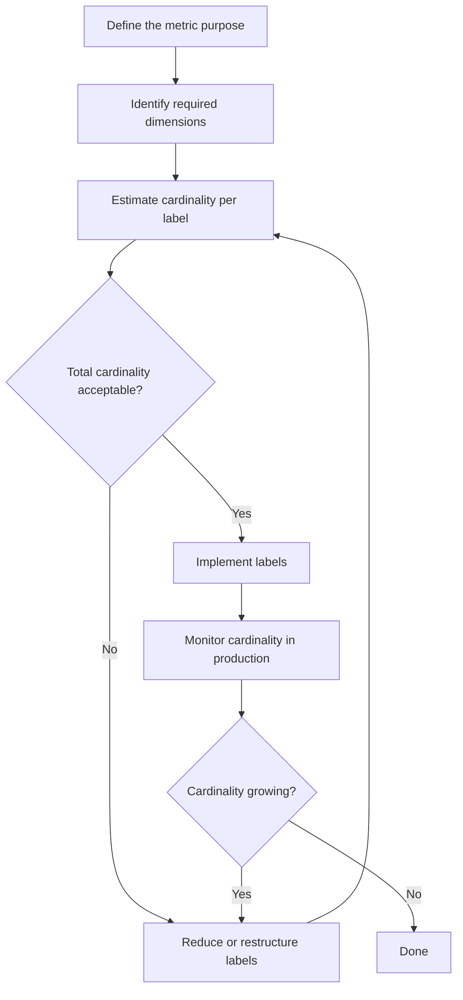
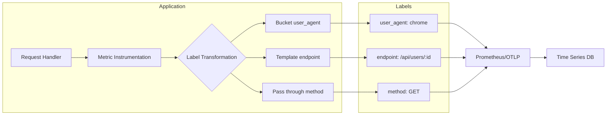
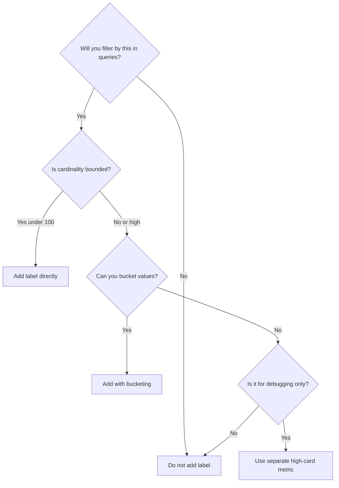

# How to Implement Metric Label Design

Author: [nawazdhandala](https://github.com/nawazdhandala)

Tags: Metrics, Labels, Prometheus, Cardinality

Description: Learn to implement metric label design for effective metric dimensionality.

---

Metric labels (sometimes called tags or dimensions) transform a single metric into a multi-dimensional data set. A counter named `http_requests_total` becomes far more useful when you can slice it by `method`, `status`, `endpoint`, and `service`. But poor label design leads to cardinality explosions, slow queries, and ballooning storage costs. This guide walks through practical patterns for designing labels that scale.

---

## Why Label Design Matters

Labels answer the question: "How will engineers slice and filter this data when debugging at 3 AM?" Get it right, and you have instant drill-down capability. Get it wrong, and you face:

1. **Cardinality explosion**: Each unique combination of label values creates a time series. A single high-cardinality label like `user_id` can generate millions of series.
2. **Query timeouts**: Aggregating across too many series bogs down your backend.
3. **Storage bloat**: Every time series has overhead. Unnecessary series multiply costs.
4. **Alert noise**: Poorly scoped labels make writing useful alerts difficult.

The goal: design labels that provide maximum analytical value with minimum cardinality overhead.

---

## The Label Design Workflow



Start with your use case. If the metric tracks HTTP latency, you probably need `method`, `status_code`, and `endpoint`. But do you need `user_agent`? That label alone could have thousands of unique values.

---

## Core Principles

### 1. Bounded Cardinality

Every label should have a predictable upper bound on unique values. Safe labels:

| Label | Example Values | Cardinality |
|-------|----------------|-------------|
| `method` | GET, POST, PUT, DELETE | ~10 |
| `status_code` | 200, 201, 400, 404, 500 | ~50 |
| `region` | us-east-1, eu-west-1 | ~20 |
| `service` | api, worker, scheduler | ~30 |

Dangerous labels (avoid or bucket):

| Label | Risk |
|-------|------|
| `user_id` | Millions of values |
| `request_id` | Infinite |
| `email` | Unbounded, plus PII |
| `full_url` | Path params create explosion |

### 2. Actionable Filtering

Only add labels you will actually filter or group by in dashboards, alerts, or queries. Ask: "Will anyone ever write `{label="value"}` in a query?" If the answer is no, drop it.

### 3. Consistent Naming

Standardize label names across services. If one team uses `http_method` and another uses `method`, dashboards break and queries become painful.

```yaml
# Recommended naming conventions
metric_name: http_request_duration_seconds
labels:
  method: GET           # not http_method or request_method
  status: "200"         # string, not status_code or code
  endpoint: /api/users  # not path or route
  service: checkout     # not svc or service_name
```

---

## Cardinality Calculation

Before deploying a metric, estimate total series count:

```
Total Series = product of (unique values per label)
```

Example for `http_request_duration_seconds`:

| Label | Unique Values |
|-------|---------------|
| method | 5 |
| status | 10 |
| endpoint | 50 |
| service | 8 |

Total: 5 x 10 x 50 x 8 = **20,000 series**

That is manageable. But add `user_agent` with 2,000 unique values:

5 x 10 x 50 x 8 x 2,000 = **40,000,000 series**

That will break most backends.

---

## Label Design Patterns

### Pattern 1: Bucketing High-Cardinality Values

Instead of raw values, map them to buckets:

```python
# Python example: bucket user agents into categories
def normalize_user_agent(ua: str) -> str:
    ua_lower = ua.lower()
    if "chrome" in ua_lower:
        return "chrome"
    elif "firefox" in ua_lower:
        return "firefox"
    elif "safari" in ua_lower:
        return "safari"
    elif "bot" in ua_lower or "crawler" in ua_lower:
        return "bot"
    else:
        return "other"

# Use normalized value as label
user_agent_bucket = normalize_user_agent(request.headers.get("User-Agent", ""))
REQUEST_COUNT.labels(
    method=request.method,
    status=response.status_code,
    user_agent=user_agent_bucket  # bounded to 5 values
).inc()
```

### Pattern 2: Parameterized Endpoint Labels

Raw URLs with path parameters explode cardinality:

```
/api/users/123
/api/users/456
/api/users/789
```

Replace with route templates:

```python
# Express/Flask style route patterns
from flask import request

# Instead of request.path ("/api/users/123")
# Use the matched route ("/api/users/<id>")
endpoint = request.url_rule.rule if request.url_rule else "unknown"

REQUEST_LATENCY.labels(
    method=request.method,
    endpoint=endpoint  # "/api/users/<id>" - bounded
).observe(duration)
```

### Pattern 3: Separate Metrics for Different Cardinalities

If you need both low-cardinality aggregation and high-cardinality debugging, use two metrics:

```python
from prometheus_client import Counter, Histogram

# Low cardinality: for dashboards and alerts
http_requests_total = Counter(
    "http_requests_total",
    "Total HTTP requests",
    ["method", "status", "service"]
)

# Higher cardinality: for debugging (consider sampling)
http_requests_by_endpoint = Counter(
    "http_requests_by_endpoint_total",
    "HTTP requests by endpoint",
    ["method", "status", "service", "endpoint"]
)
```

---

## Metric and Label Flow Architecture



---

## Implementation Example: Node.js with OpenTelemetry

```typescript
// metrics.ts
import { metrics } from '@opentelemetry/api';

const meter = metrics.getMeter('http-server');

// Define the metric with bounded labels
const requestCounter = meter.createCounter('http_requests_total', {
    description: 'Total number of HTTP requests',
});

const requestDuration = meter.createHistogram('http_request_duration_seconds', {
    description: 'HTTP request duration in seconds',
    unit: 's',
});

// Helper to normalize endpoint paths
function normalizeEndpoint(path: string, routePattern?: string): string {
    // Prefer route pattern if available
    if (routePattern) {
        return routePattern;
    }
    // Fallback: strip numeric IDs from path
    return path.replace(/\/\d+/g, '/:id');
}

// Helper to bucket status codes
function statusBucket(code: number): string {
    if (code >= 200 && code < 300) return '2xx';
    if (code >= 300 && code < 400) return '3xx';
    if (code >= 400 && code < 500) return '4xx';
    if (code >= 500) return '5xx';
    return 'unknown';
}

// Usage in middleware
export function recordRequest(
    method: string,
    path: string,
    routePattern: string | undefined,
    statusCode: number,
    durationMs: number
): void {
    const labels = {
        method: method.toUpperCase(),
        endpoint: normalizeEndpoint(path, routePattern),
        status: statusBucket(statusCode),
        service: process.env.SERVICE_NAME || 'unknown',
    };

    requestCounter.add(1, labels);
    requestDuration.record(durationMs / 1000, labels);
}
```

```typescript
// middleware.ts - Express example
import { Request, Response, NextFunction } from 'express';
import { recordRequest } from './metrics';

export function metricsMiddleware(
    req: Request,
    res: Response,
    next: NextFunction
): void {
    const start = Date.now();

    res.on('finish', () => {
        const duration = Date.now() - start;
        // req.route?.path gives the Express route pattern
        recordRequest(
            req.method,
            req.path,
            req.route?.path,
            res.statusCode,
            duration
        );
    });

    next();
}
```

---

## Label Decision Matrix

Use this matrix when deciding whether to add a label:



---

## Common Mistakes

### Mistake 1: Using IDs as Labels

```python
# BAD: user_id has unbounded cardinality
request_count.labels(user_id=user.id).inc()

# GOOD: use for logs/traces, not metrics
logger.info("request completed", extra={"user_id": user.id})
```

### Mistake 2: Timestamp Labels

```python
# BAD: every minute creates new series
metric.labels(timestamp=datetime.now().isoformat()).set(value)

# GOOD: timestamps are implicit in time series
metric.set(value)  # timestamp added automatically
```

### Mistake 3: Error Message Labels

```python
# BAD: unique error messages explode cardinality
errors.labels(message=str(exception)).inc()

# GOOD: use error type/category
errors.labels(error_type=type(exception).__name__).inc()
```

---

## Monitoring Label Cardinality

Track cardinality in production to catch issues early:

```promql
# Count unique series per metric
count by (__name__) ({__name__=~".+"})

# Find metrics with highest cardinality
topk(10, count by (__name__) ({__name__=~".+"}))

# Cardinality contribution by label
count by (endpoint) (http_requests_total)
```

Set alerts when cardinality exceeds thresholds:

```yaml
groups:
  - name: cardinality
    rules:
      - alert: HighCardinalityMetric
        expr: count by (__name__) ({__name__=~".+"}) > 100000
        for: 5m
        labels:
          severity: warning
        annotations:
          summary: "Metric {{ $labels.__name__ }} has high cardinality"
```

---

## Summary

Good metric label design follows a few rules:

1. **Bound cardinality**: Every label should have a known upper limit
2. **Bucket high-cardinality values**: Map user agents, endpoints, and errors to categories
3. **Use route patterns**: Template paths instead of raw URLs
4. **Separate concerns**: Low-cardinality metrics for alerts, higher-cardinality for debugging
5. **Monitor in production**: Track series counts and alert on growth

Start with the minimum labels needed to answer your operational questions. Add more only when you have a concrete use case. The best metric design is one that scales predictably and remains queryable as your system grows.

---

**Related Reading:**

- [18 SRE Metrics Worth Tracking (And Why)](https://oneuptime.com/blog/post/2025-11-28-sre-metrics-to-track/view)
- [What are Metrics in OpenTelemetry](https://oneuptime.com/blog/post/2025-08-26-what-are-metrics-in-opentelemetry/view)
- [How to Reduce Noise in OpenTelemetry](https://oneuptime.com/blog/post/2025-08-25-how-to-reduce-noise-in-opentelemetry/view)
