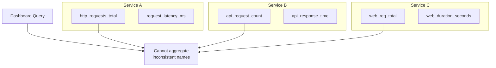
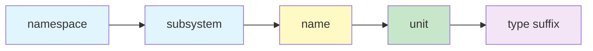
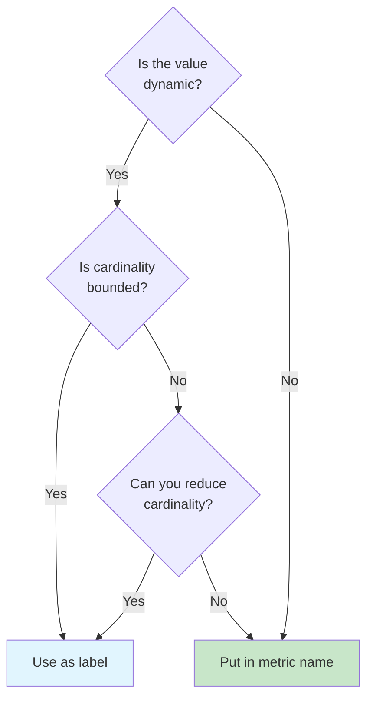

# How to Build Metric Naming Conventions

Author: [nawazdhandala](https://github.com/nawazdhandala)

Tags: Metrics, Naming, Standards, Prometheus

Description: Learn to build metric naming conventions for consistent and discoverable metrics.

---

Metrics without naming conventions become a graveyard of confusion. You inherit a codebase, open the monitoring dashboard, and find `req_count`, `requestsTotal`, `http_requests`, and `api_request_counter` all measuring the same thing. Each was added by a different developer at a different time, and now nobody knows which one is correct or how they relate.

Good metric names solve this problem before it starts. They make metrics self-documenting, searchable, and aggregatable. This guide walks through building a naming convention from scratch, covering the patterns that work across Prometheus, OpenTelemetry, and custom metrics systems.

---

## Why Naming Conventions Matter

Metrics accumulate over time. A small project might start with a handful, but production systems often grow to thousands. Without consistent naming, you face several problems.

First, discoverability suffers. Engineers cannot find metrics when names are inconsistent. A search for "latency" misses `response_time`, `duration`, and `elapsed_ms`.

Second, aggregation breaks. If one service uses `requests_total` and another uses `request_count`, you cannot sum them across the fleet.

Third, alerting becomes fragile. Alert rules written against inconsistent metric names require constant maintenance as naming drifts.

The following diagram shows how inconsistent naming creates confusion when querying across services.



---

## Core Naming Structure

The most effective metric names follow a structured format. Each component serves a purpose and enables filtering, grouping, and understanding at a glance.

A well-formed metric name follows this pattern.



The full format looks like this: `namespace_subsystem_name_unit_suffix`

Here is a breakdown of each component.

```python
# Metric naming structure breakdown
# Format: namespace_subsystem_name_unit_suffix

# namespace: Top-level identifier for your organization or application
# Examples: myapp, oneuptime, acme

# subsystem: The component or module generating the metric
# Examples: http, database, cache, queue

# name: What is being measured
# Examples: requests, connections, items, bytes

# unit: The measurement unit (always use base units)
# Examples: seconds, bytes, total (for counts)

# suffix: Metric type indicator
# Examples: total (counter), bucket (histogram)

# Good examples following the convention
metric_names = [
    "myapp_http_requests_total",           # Counter of HTTP requests
    "myapp_http_request_duration_seconds", # Histogram of request duration
    "myapp_db_connections_current",        # Gauge of active connections
    "myapp_cache_hits_total",              # Counter of cache hits
    "myapp_queue_messages_bytes",          # Size of messages in bytes
]
```

---

## Naming Rules

Consistent rules prevent drift and make automation possible. These rules apply across most metrics systems.

### Rule 1: Use Snake Case

All metric names should use lowercase letters with underscores separating words. This ensures compatibility across systems and avoids case sensitivity issues.

```python
# snake_case metric naming examples

# Correct: lowercase with underscores
good_names = [
    "http_request_duration_seconds",
    "database_query_count_total",
    "memory_usage_bytes",
]

# Incorrect: mixed case or other separators
bad_names = [
    "httpRequestDuration",      # camelCase breaks grep patterns
    "HTTP_Request_Duration",    # mixed case causes confusion
    "http-request-duration",    # hyphens invalid in some systems
    "http.request.duration",    # dots conflict with label separators
]
```

### Rule 2: Include Units

Always include the unit in the metric name. This eliminates ambiguity and prevents unit conversion errors.

```python
# Always include units in metric names

# Base units to use (avoid prefixes like milli, kilo)
# Time: seconds (not milliseconds)
# Data: bytes (not kilobytes)
# Temperature: celsius or fahrenheit (not kelvin)

# Good: units are explicit
"request_duration_seconds"
"response_size_bytes"
"disk_available_bytes"
"cpu_temperature_celsius"

# Bad: units are ambiguous or missing
"request_duration"      # seconds? milliseconds? minutes?
"response_size"         # bytes? kilobytes? megabytes?
"disk_available"        # bytes? percentage? blocks?
```

### Rule 3: Use Type Suffixes

Prometheus metrics have specific types. Include suffixes that indicate the type.

```python
# Type suffixes for Prometheus metrics

# Counter: always ends with _total
# Counts things that only go up (requests, errors, bytes sent)
"http_requests_total"
"errors_total"
"bytes_sent_total"

# Gauge: no special suffix, describes current state
# Measures values that go up and down
"temperature_celsius"
"connections_current"
"queue_depth"

# Histogram: automatically creates _bucket, _sum, _count
# Base name should describe what is being measured
"request_duration_seconds"  # Creates request_duration_seconds_bucket, etc.

# Summary: automatically creates quantile labels
# Similar to histogram but calculates quantiles client-side
"response_time_seconds"     # Creates response_time_seconds{quantile="0.99"}
```

---

## Labels vs Name Components

Deciding what goes in the metric name versus labels is a critical design choice. The wrong decision leads to cardinality explosions or lost query flexibility.

The following diagram illustrates the decision process.



Here are concrete examples of this decision in practice.

```python
# Labels vs name components: practical examples

# GOOD: Static values go in the name
# These values are known at compile time and rarely change
"http_server_requests_total"     # vs http_client_requests_total
"postgres_query_duration_seconds" # vs mysql_query_duration_seconds
"cache_memory_hits_total"        # vs cache_disk_hits_total

# GOOD: Dynamic but bounded values go in labels
# These values change at runtime but have a limited set of possibilities
# Example: http_requests_total{method="GET", status="200", endpoint="/api/users"}
labels = {
    "method": ["GET", "POST", "PUT", "DELETE"],  # ~10 values
    "status": ["200", "400", "404", "500"],       # ~50 values
    "endpoint": ["/api/users", "/api/orders"],   # bounded by routes
}

# BAD: Unbounded values should never be labels
# These create cardinality explosion and crash your metrics backend
dangerous_labels = {
    "user_id": "...",        # millions of values
    "request_id": "...",     # infinite values
    "email": "...",          # unbounded PII
    "session_token": "...",  # security risk + unbounded
}

# If you need user-level metrics, aggregate by cohort
# user_requests_total{plan="free"} instead of user_requests_total{user_id="123"}
```

---

## OpenTelemetry Conventions

OpenTelemetry defines semantic conventions for common metrics. Following these conventions ensures compatibility with observability tools and enables correlation across services.

```python
# OpenTelemetry semantic conventions for common metrics

# HTTP Server metrics (following OTel conventions)
otel_http_metrics = {
    # Request duration histogram
    "http.server.request.duration": {
        "unit": "s",  # seconds
        "type": "histogram",
        "attributes": ["http.request.method", "http.response.status_code", "url.scheme"],
    },

    # Active requests gauge
    "http.server.active_requests": {
        "unit": "{request}",  # dimensionless count
        "type": "updowncounter",
        "attributes": ["http.request.method", "url.scheme"],
    },

    # Request body size
    "http.server.request.body.size": {
        "unit": "By",  # bytes
        "type": "histogram",
        "attributes": ["http.request.method", "url.scheme"],
    },
}

# Database metrics (following OTel conventions)
otel_db_metrics = {
    "db.client.operation.duration": {
        "unit": "s",
        "type": "histogram",
        "attributes": ["db.system", "db.operation.name", "db.namespace"],
    },

    "db.client.connection.count": {
        "unit": "{connection}",
        "type": "updowncounter",
        "attributes": ["db.system", "db.client.connection.state"],
    },
}
```

---

## Implementation Checklist

Building naming conventions requires documentation, tooling, and enforcement. Here is a practical checklist for implementation.

```python
# Metric naming convention checklist

checklist = {
    "Documentation": [
        "Write a naming convention guide",
        "Include examples for each metric type",
        "Document approved namespaces and subsystems",
        "List forbidden label keys (user_id, request_id, etc.)",
    ],

    "Tooling": [
        "Create a metric name validator",
        "Add linting to CI/CD pipeline",
        "Build a metric registry for deduplication",
        "Generate documentation from metric definitions",
    ],

    "Enforcement": [
        "Review metric names in code review",
        "Block PRs with non-compliant names",
        "Audit existing metrics quarterly",
        "Track cardinality growth over time",
    ],

    "Migration": [
        "Inventory all existing metrics",
        "Map old names to new convention",
        "Add aliases during transition period",
        "Set deprecation timeline for old names",
    ],
}
```

---

## Common Mistakes to Avoid

Even with good intentions, teams make predictable mistakes. Here are the most common ones and how to fix them.

```python
# Common metric naming mistakes

mistakes = {
    "Encoding values in names": {
        "bad": "http_requests_get_total, http_requests_post_total",
        "good": "http_requests_total{method='GET'}",
        "why": "Labels enable flexible querying and aggregation",
    },

    "Missing units": {
        "bad": "request_duration, memory_used",
        "good": "request_duration_seconds, memory_used_bytes",
        "why": "Units prevent confusion and calculation errors",
    },

    "Inconsistent prefixes": {
        "bad": "http_latency, api_request_time, web_duration",
        "good": "http_request_duration_seconds (consistent namespace)",
        "why": "Consistent prefixes enable discovery and aggregation",
    },

    "High cardinality labels": {
        "bad": "requests_total{user_id='...', session='...'}",
        "good": "requests_total{user_tier='free', region='us-east'}",
        "why": "Unbounded labels crash metrics backends",
    },
}
```

---

## Summary

Metric naming conventions transform chaotic telemetry into a queryable, maintainable system. The key principles are straightforward: use snake_case, include units, add type suffixes, and keep labels bounded.

Start by documenting your convention, then add tooling to enforce it. Migrate existing metrics gradually, using aliases to maintain backward compatibility. Review cardinality regularly and prune metrics that no longer serve a purpose.

The time invested in naming conventions pays dividends every time someone debugs an incident, builds a dashboard, or writes an alert. Make your metrics self-documenting, and your future self will thank you.

---

*Need a place to send your well-named metrics? [OneUptime](https://oneuptime.com) provides unified observability with native support for OpenTelemetry and Prometheus metrics.*

---

### See Also

- [18 SRE Metrics Worth Tracking](/blog/post/2025-11-28-sre-metrics-to-track/) - Understand which metrics matter most for reliability.
- [Three Pillars of Observability](/blog/post/2025-08-20-three-pillars-of-observability-logs-metrics-traces/) - Learn how metrics fit into logs and traces.
