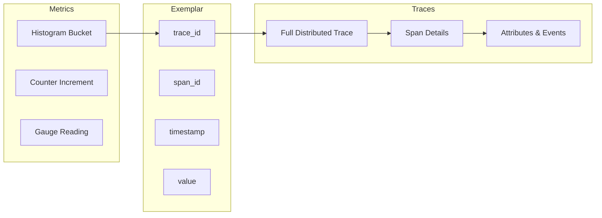
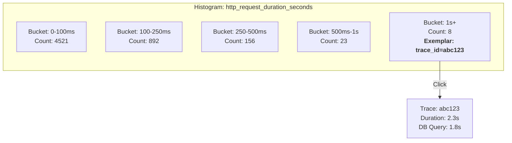
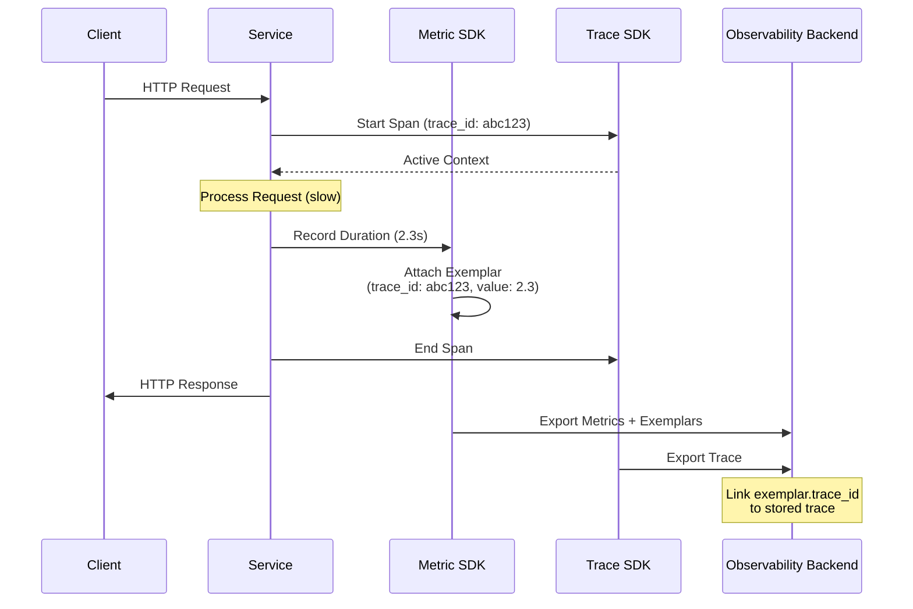
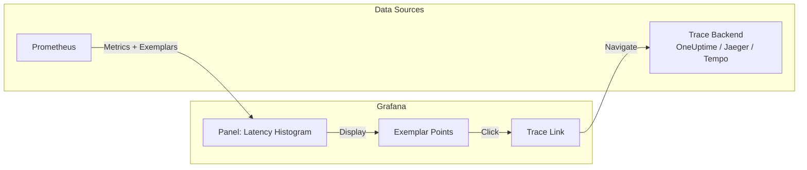
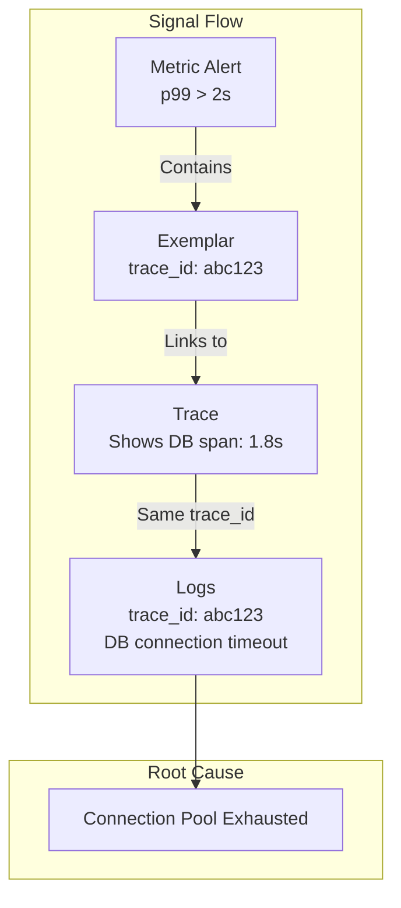

# How to Create Metric-Trace Correlation

Author: [nawazdhandala](https://github.com/nawazdhandala)

Tags: Observability, Metrics, Tracing, OpenTelemetry

Description: Learn how to correlate metrics with traces using exemplars for root cause analysis.

---

Your dashboard shows a latency spike. P99 jumped from 200ms to 2 seconds. You know *something* is wrong, but which request? Which user? Which code path? Metrics tell you the "what" but leave you guessing the "where" and "why."

This is where **metric-trace correlation** transforms your debugging workflow. Instead of hunting through logs and guessing, you click directly from an anomalous metric data point to the exact trace that caused it.

This guide walks you through implementing metric-trace correlation using **exemplars** in OpenTelemetry, with practical code examples and Prometheus integration.

---

## Table of Contents

1. What is Metric-Trace Correlation?
2. Understanding Exemplars
3. How Exemplars Work (Visual)
4. Setting Up Exemplars in OpenTelemetry
5. Prometheus Exemplar Support
6. Grafana Visualization
7. Best Practices
8. Common Pitfalls
9. Production Checklist

---

## 1. What is Metric-Trace Correlation?

Metric-trace correlation links aggregated metric data points to specific distributed traces. When you see a spike in your histogram, you can jump directly to a representative trace from that spike.



Without correlation:
- Metric shows p99 latency = 2.5s
- You guess which service caused it
- You search logs manually
- You lose 30 minutes (or more)

With correlation:
- Metric shows p99 latency = 2.5s
- Click the exemplar attached to that data point
- Jump directly to the slow trace
- Root cause identified in 2 minutes

---

## 2. Understanding Exemplars

An **exemplar** is a sample data point attached to a metric observation. It contains:

| Field | Description | Example |
|-------|-------------|---------|
| trace_id | The distributed trace identifier | `4bf92f3577b34da6a3ce929d0e0e4736` |
| span_id | The specific span within the trace | `00f067aa0ba902b7` |
| timestamp | When the observation occurred | `1706620800.123` |
| value | The actual measured value | `2.547` (seconds) |
| labels | Optional additional context | `{status_code: 500}` |

Exemplars are most useful with **histograms** and **counters** because they let you attach trace context to specific observations within aggregated buckets.



---

## 3. How Exemplars Work (Visual)

When a request comes in, OpenTelemetry can automatically attach the current trace context to metric observations:



---

## 4. Setting Up Exemplars in OpenTelemetry

### Install Dependencies

```bash
npm install @opentelemetry/api \
            @opentelemetry/sdk-node \
            @opentelemetry/sdk-metrics \
            @opentelemetry/exporter-prometheus \
            @opentelemetry/auto-instrumentations-node \
            @opentelemetry/exporter-otlp-http
```

### Configure the SDK with Exemplar Support

```typescript
// telemetry.ts
// Complete OpenTelemetry setup with exemplar support for metric-trace correlation

import { NodeSDK } from '@opentelemetry/sdk-node';
import { getNodeAutoInstrumentations } from '@opentelemetry/auto-instrumentations-node';
import { OTLPTraceExporter } from '@opentelemetry/exporter-trace-otlp-http';
import { OTLPMetricExporter } from '@opentelemetry/exporter-metrics-otlp-http';
import {
  PeriodicExportingMetricReader,
  ExplicitBucketHistogramAggregation,
  View,
  InstrumentType
} from '@opentelemetry/sdk-metrics';
import { Resource } from '@opentelemetry/resources';
import { SemanticResourceAttributes } from '@opentelemetry/semantic-conventions';

// Configure the OTLP exporters to send data to your observability backend
const traceExporter = new OTLPTraceExporter({
  url: process.env.OTEL_EXPORTER_OTLP_TRACES_ENDPOINT || 'https://oneuptime.com/otlp/v1/traces',
  headers: {
    'x-oneuptime-token': process.env.ONEUPTIME_TOKEN || ''
  }
});

const metricExporter = new OTLPMetricExporter({
  url: process.env.OTEL_EXPORTER_OTLP_METRICS_ENDPOINT || 'https://oneuptime.com/otlp/v1/metrics',
  headers: {
    'x-oneuptime-token': process.env.ONEUPTIME_TOKEN || ''
  }
});

// Define custom histogram buckets for latency metrics
// These buckets align with common SLO thresholds
const latencyHistogramView = new View({
  instrumentName: 'http.server.duration',
  instrumentType: InstrumentType.HISTOGRAM,
  aggregation: new ExplicitBucketHistogramAggregation([
    0.005,  // 5ms
    0.01,   // 10ms
    0.025,  // 25ms
    0.05,   // 50ms
    0.1,    // 100ms
    0.25,   // 250ms
    0.5,    // 500ms
    1,      // 1s
    2.5,    // 2.5s
    5,      // 5s
    10      // 10s
  ])
});

// Create the metric reader with periodic export
const metricReader = new PeriodicExportingMetricReader({
  exporter: metricExporter,
  exportIntervalMillis: 15000  // Export every 15 seconds
});

// Initialize the SDK with both tracing and metrics
export const sdk = new NodeSDK({
  resource: new Resource({
    [SemanticResourceAttributes.SERVICE_NAME]: 'order-service',
    [SemanticResourceAttributes.SERVICE_VERSION]: '1.0.0',
    [SemanticResourceAttributes.DEPLOYMENT_ENVIRONMENT]: process.env.NODE_ENV || 'development'
  }),
  traceExporter,
  metricReader,
  views: [latencyHistogramView],
  instrumentations: [getNodeAutoInstrumentations()]
});

// Start telemetry before your application code
export async function startTelemetry(): Promise<void> {
  await sdk.start();
  console.log('OpenTelemetry initialized with exemplar support');
}

// Graceful shutdown
export async function shutdownTelemetry(): Promise<void> {
  await sdk.shutdown();
  console.log('OpenTelemetry shut down');
}
```

### Recording Metrics with Exemplars

OpenTelemetry automatically attaches trace context as exemplars when you record metrics within an active span:

```typescript
// metrics.ts
// Custom metrics with automatic exemplar attachment

import { metrics, trace, context } from '@opentelemetry/api';

// Get the meter for creating instruments
const meter = metrics.getMeter('order-service', '1.0.0');

// Create a histogram for tracking operation durations
// Exemplars are automatically attached when recording within a traced context
const operationDuration = meter.createHistogram('operation.duration', {
  description: 'Duration of business operations in seconds',
  unit: 's'
});

// Create a counter for tracking errors
// Useful for correlating error spikes with specific traces
const errorCounter = meter.createCounter('operation.errors', {
  description: 'Count of operation errors'
});

// Helper function to record duration with automatic exemplar
export function recordOperationDuration(
  operationName: string,
  durationSeconds: number,
  attributes: Record<string, string> = {}
): void {
  // When called within an active span, the trace_id and span_id
  // are automatically attached as an exemplar
  operationDuration.record(durationSeconds, {
    'operation.name': operationName,
    ...attributes
  });
}

// Helper function to record errors with trace correlation
export function recordOperationError(
  operationName: string,
  errorType: string
): void {
  // The exemplar links this error count to the specific failing trace
  errorCounter.add(1, {
    'operation.name': operationName,
    'error.type': errorType
  });
}
```

### Using Metrics in Application Code

```typescript
// order-service.ts
// Example service demonstrating metric-trace correlation

import { trace, SpanStatusCode } from '@opentelemetry/api';
import { recordOperationDuration, recordOperationError } from './metrics';

const tracer = trace.getTracer('order-service');

interface OrderRequest {
  userId: string;
  items: Array<{ sku: string; quantity: number }>;
  paymentMethod: string;
}

export async function processOrder(order: OrderRequest): Promise<{ orderId: string }> {
  // Start a span for the entire order processing
  return tracer.startActiveSpan('order.process', async (span) => {
    const startTime = performance.now();

    try {
      // Add relevant attributes to the span
      span.setAttribute('order.user_id', order.userId);
      span.setAttribute('order.item_count', order.items.length);

      // Process payment (this might be slow)
      await processPayment(order);

      // Reserve inventory
      await reserveInventory(order.items);

      // Calculate total duration
      const durationSeconds = (performance.now() - startTime) / 1000;

      // Record the metric - exemplar automatically attached
      // If this order was slow, clicking the exemplar in Grafana
      // will take you directly to this trace
      recordOperationDuration('order.process', durationSeconds, {
        'payment.method': order.paymentMethod
      });

      span.setStatus({ code: SpanStatusCode.OK });
      return { orderId: `ord_${Date.now()}` };

    } catch (error: any) {
      // Record the error metric with trace correlation
      // When you see an error spike, click to see the exact failing request
      recordOperationError('order.process', error.name || 'UnknownError');

      span.recordException(error);
      span.setStatus({
        code: SpanStatusCode.ERROR,
        message: error.message
      });
      throw error;

    } finally {
      span.end();
    }
  });
}

async function processPayment(order: OrderRequest): Promise<void> {
  return tracer.startActiveSpan('payment.process', async (span) => {
    const startTime = performance.now();

    try {
      // Simulate payment processing
      await simulateExternalCall(50, 500);

      const durationSeconds = (performance.now() - startTime) / 1000;
      recordOperationDuration('payment.process', durationSeconds);

    } finally {
      span.end();
    }
  });
}

async function reserveInventory(
  items: Array<{ sku: string; quantity: number }>
): Promise<void> {
  return tracer.startActiveSpan('inventory.reserve', async (span) => {
    span.setAttribute('inventory.item_count', items.length);

    // Simulate inventory check
    await simulateExternalCall(20, 100);

    span.end();
  });
}

// Helper to simulate variable latency
function simulateExternalCall(minMs: number, maxMs: number): Promise<void> {
  const delay = minMs + Math.random() * (maxMs - minMs);
  return new Promise(resolve => setTimeout(resolve, delay));
}
```

---

## 5. Prometheus Exemplar Support

Prometheus 2.26+ supports exemplars in its native format. Here is how to configure the OpenTelemetry Prometheus exporter:

### Prometheus Exporter Configuration

```typescript
// prometheus-exporter.ts
// Configure Prometheus exporter with exemplar support

import { PrometheusExporter } from '@opentelemetry/exporter-prometheus';
import { MeterProvider } from '@opentelemetry/sdk-metrics';
import { Resource } from '@opentelemetry/resources';
import { SemanticResourceAttributes } from '@opentelemetry/semantic-conventions';

// Create Prometheus exporter
// Exemplars are included automatically when trace context is present
const prometheusExporter = new PrometheusExporter({
  port: 9464,           // Metrics endpoint port
  endpoint: '/metrics', // Metrics path
  preventServerStart: false
});

// Configure the meter provider
const meterProvider = new MeterProvider({
  resource: new Resource({
    [SemanticResourceAttributes.SERVICE_NAME]: 'order-service'
  }),
  readers: [prometheusExporter]
});

// The exporter automatically formats exemplars in Prometheus exposition format
// Example output:
// http_request_duration_seconds_bucket{le="0.5",method="POST",route="/orders"} 1027 # {trace_id="abc123"} 0.482 1706620800.123
```

### Prometheus Scrape Configuration

```yaml
# prometheus.yml
# Enable exemplar storage in Prometheus

global:
  scrape_interval: 15s
  evaluation_interval: 15s

# Enable exemplar storage (required for Prometheus 2.26+)
storage:
  exemplars:
    max_exemplars: 100000  # Adjust based on your trace volume

scrape_configs:
  - job_name: 'order-service'
    scrape_interval: 10s
    # Enable exemplar scraping
    enable_features:
      - exemplar-storage
    static_configs:
      - targets: ['order-service:9464']
    # Scrape exemplars from OpenMetrics format
    metrics_path: /metrics
    scheme: http
```

### Query Exemplars via PromQL

```promql
# Get histogram with exemplars
histogram_quantile(0.99,
  sum(rate(http_request_duration_seconds_bucket[5m])) by (le)
)

# In Grafana, enable "Exemplars" toggle on the panel
# to see clickable trace links on the graph
```

---

## 6. Grafana Visualization

Configure Grafana to display exemplars and link them to your trace backend:



### Grafana Data Source Configuration

```yaml
# grafana-datasources.yaml
# Configure Prometheus with exemplar support linked to trace backend

apiVersion: 1

datasources:
  # Prometheus data source with exemplar configuration
  - name: Prometheus
    type: prometheus
    access: proxy
    url: http://prometheus:9090
    jsonData:
      # Enable exemplar support
      exemplarTraceIdDestinations:
        - name: trace_id
          datasourceUid: oneuptime-traces
          urlDisplayLabel: View Trace
      httpMethod: POST

  # Trace backend for viewing linked traces
  - name: OneUptime Traces
    uid: oneuptime-traces
    type: jaeger  # Or tempo, zipkin depending on your backend
    access: proxy
    url: https://oneuptime.com/api/traces
    jsonData:
      tracesToLogs:
        datasourceUid: loki
        tags: ['trace_id']
```

### Grafana Panel JSON

```json
{
  "title": "Request Latency with Exemplars",
  "type": "timeseries",
  "datasource": {
    "type": "prometheus",
    "uid": "prometheus"
  },
  "targets": [
    {
      "expr": "histogram_quantile(0.99, sum(rate(http_request_duration_seconds_bucket[5m])) by (le))",
      "legendFormat": "p99 latency",
      "exemplar": true
    },
    {
      "expr": "histogram_quantile(0.95, sum(rate(http_request_duration_seconds_bucket[5m])) by (le))",
      "legendFormat": "p95 latency",
      "exemplar": true
    }
  ],
  "options": {
    "tooltip": {
      "mode": "single"
    }
  },
  "fieldConfig": {
    "defaults": {
      "unit": "s",
      "custom": {
        "drawStyle": "line",
        "lineWidth": 2,
        "pointSize": 5,
        "showPoints": "auto"
      }
    }
  }
}
```

---

## 7. Best Practices

### Exemplar Selection Strategy

Not every metric observation should have an exemplar. Here is how to be selective:

```typescript
// exemplar-strategy.ts
// Intelligent exemplar selection to avoid overwhelming storage

import { metrics, trace, context } from '@opentelemetry/api';

const meter = metrics.getMeter('order-service');

// Track when we last recorded an exemplar for each bucket
const lastExemplarTime = new Map<string, number>();
const EXEMPLAR_INTERVAL_MS = 60000; // One exemplar per minute per bucket

const histogram = meter.createHistogram('http.server.duration', {
  description: 'HTTP request duration with selective exemplars'
});

export function recordDurationWithSelectiveExemplar(
  durationSeconds: number,
  attributes: Record<string, string>
): void {
  // Determine which bucket this falls into
  const bucket = getBucket(durationSeconds);
  const bucketKey = `${bucket}_${JSON.stringify(attributes)}`;

  const now = Date.now();
  const lastTime = lastExemplarTime.get(bucketKey) || 0;

  // Only record with exemplar if enough time has passed
  // or if this is an outlier (slow request)
  const isOutlier = durationSeconds > 1.0; // > 1 second is unusual
  const shouldIncludeExemplar = isOutlier || (now - lastTime) > EXEMPLAR_INTERVAL_MS;

  if (shouldIncludeExemplar) {
    lastExemplarTime.set(bucketKey, now);
    // Record within active span context for exemplar attachment
    histogram.record(durationSeconds, attributes);
  } else {
    // Record without active span context (no exemplar)
    context.with(trace.deleteSpan(context.active()), () => {
      histogram.record(durationSeconds, attributes);
    });
  }
}

function getBucket(value: number): string {
  const buckets = [0.01, 0.05, 0.1, 0.25, 0.5, 1, 2.5, 5, 10];
  for (const b of buckets) {
    if (value <= b) return `le_${b}`;
  }
  return 'le_inf';
}
```

### Attribute Cardinality Management

```typescript
// cardinality.ts
// Prevent cardinality explosion in metrics with exemplars

// BAD: High cardinality attributes
// This creates millions of time series
const badHistogram = meter.createHistogram('http.duration');
badHistogram.record(0.5, {
  'user.id': 'user_12345',        // Millions of unique values
  'request.id': 'req_abc123',     // Unique per request
  'session.id': 'sess_xyz789'     // Thousands of unique values
});

// GOOD: Low cardinality attributes with trace correlation
// Details are in the trace, not the metric labels
const goodHistogram = meter.createHistogram('http.duration');
goodHistogram.record(0.5, {
  'http.method': 'POST',          // ~10 unique values
  'http.route': '/api/orders',    // Bounded by API design
  'http.status_code': '200'       // ~50 unique values
});
// The exemplar contains trace_id which links to full request details
```

### Correlating Across All Three Signals



```typescript
// correlation-example.ts
// Demonstrate full correlation: metrics, traces, and logs

import { trace, context } from '@opentelemetry/api';
import { recordOperationDuration } from './metrics';
import pino from 'pino';

// Configure logger to include trace context
const logger = pino({
  mixin() {
    const span = trace.getSpan(context.active());
    if (span) {
      const spanContext = span.spanContext();
      return {
        trace_id: spanContext.traceId,
        span_id: spanContext.spanId
      };
    }
    return {};
  }
});

const tracer = trace.getTracer('correlation-demo');

export async function handleRequest(req: any): Promise<void> {
  return tracer.startActiveSpan('handle.request', async (span) => {
    const startTime = performance.now();

    try {
      // Log with automatic trace context injection
      logger.info({
        path: req.path,
        method: req.method
      }, 'Request started');

      // Simulate processing
      await processRequest(req);

      const durationSeconds = (performance.now() - startTime) / 1000;

      // Metric with exemplar linking to this trace
      recordOperationDuration('http.request', durationSeconds, {
        'http.method': req.method,
        'http.route': req.path
      });

      logger.info({ durationMs: durationSeconds * 1000 }, 'Request completed');

    } catch (error: any) {
      // All three signals now correlate:
      // 1. Error metric increment with exemplar
      // 2. Trace shows the error span
      // 3. Log contains the error details with trace_id
      logger.error({
        error: error.message,
        stack: error.stack
      }, 'Request failed');

      throw error;
    } finally {
      span.end();
    }
  });
}

async function processRequest(req: any): Promise<void> {
  // Processing logic here
  await new Promise(r => setTimeout(r, 100));
}
```

---

## 8. Common Pitfalls

### Pitfall 1: Missing Trace Context

```typescript
// WRONG: Recording metrics outside of traced context
// No exemplar will be attached
async function processInBackground(data: any): Promise<void> {
  // This runs in a detached context (e.g., setTimeout callback)
  // No active span means no exemplar
  histogram.record(0.5, { operation: 'background' });
}

// RIGHT: Preserve context for background operations
async function processInBackgroundCorrectly(data: any): Promise<void> {
  const currentContext = context.active();

  setTimeout(() => {
    // Restore the context in the callback
    context.with(currentContext, () => {
      histogram.record(0.5, { operation: 'background' });
    });
  }, 1000);
}
```

### Pitfall 2: Exemplar Storage Overflow

```typescript
// Problem: Recording exemplars for every request at high volume
// Solution: Sample exemplars intelligently

import { metrics } from '@opentelemetry/api';

const histogram = meter.createHistogram('http.duration');

// Reservoir sampling for exemplars
class ExemplarReservoir {
  private count = 0;
  private readonly sampleRate: number;

  constructor(sampleRate: number = 0.01) {
    this.sampleRate = sampleRate;
  }

  shouldSample(): boolean {
    this.count++;
    // Always sample slow requests
    // Probabilistically sample normal requests
    return Math.random() < this.sampleRate;
  }
}

const reservoir = new ExemplarReservoir(0.01); // 1% sample rate

export function recordWithSampling(duration: number): void {
  const isSlowRequest = duration > 1.0;

  if (isSlowRequest || reservoir.shouldSample()) {
    // Record with exemplar (within active span context)
    histogram.record(duration, { sampled: 'true' });
  } else {
    // Record without exemplar to save storage
    histogram.record(duration, { sampled: 'false' });
  }
}
```

### Pitfall 3: Broken Links in Grafana

```yaml
# Problem: Exemplar trace_id does not match trace backend format

# Solution: Ensure consistent trace ID format across systems
# OpenTelemetry uses lowercase hex, some systems use different formats

# In Grafana datasource configuration:
datasources:
  - name: Prometheus
    jsonData:
      exemplarTraceIdDestinations:
        - name: trace_id
          datasourceUid: traces
          # Use URL template if trace IDs need transformation
          url: 'https://oneuptime.com/traces/${__value.raw}'
```

---

## 9. Production Checklist

Before deploying metric-trace correlation to production:

- [ ] **Verify trace context propagation** - Ensure W3C traceparent headers flow through all services
- [ ] **Configure exemplar storage limits** - Set appropriate max_exemplars in Prometheus
- [ ] **Set up Grafana data source links** - Connect Prometheus exemplars to your trace backend
- [ ] **Implement exemplar sampling** - Avoid storage explosion with selective sampling
- [ ] **Test the full flow** - Click an exemplar and verify it opens the correct trace
- [ ] **Add dashboards with exemplars enabled** - Toggle exemplar display on latency panels
- [ ] **Document the correlation workflow** - Train your team on using exemplars for debugging
- [ ] **Monitor exemplar storage usage** - Alert if exemplar storage approaches limits
- [ ] **Validate trace retention alignment** - Ensure traces exist as long as their exemplars

---

## Summary

| Challenge | Solution with Exemplars |
|-----------|------------------------|
| Metric spike but unknown cause | Click exemplar to see exact slow trace |
| Error rate increase | Exemplar links to failing request trace |
| Debugging without context | Trace provides full request journey |
| Siloed observability data | Unified correlation across metrics, traces, logs |

Metric-trace correlation through exemplars transforms observability from reactive dashboard hunting to proactive root cause analysis. When your p99 spikes, you no longer guess. You click, you see, you fix.

---

## Next Steps

1. **Start with histograms** - Add exemplars to your latency metrics first
2. **Configure your visualization** - Set up Grafana with trace linking
3. **Expand to counters** - Add exemplars to error counters for failure correlation
4. **Add log correlation** - Include trace_id in structured logs for complete signal correlation

---

*Ready to implement metric-trace correlation? [OneUptime](https://oneuptime.com) supports OTLP-native ingestion with built-in exemplar support. Connect your OpenTelemetry instrumentation and start correlating signals today.*

---

**Related Reading:**

- [What are Traces and Spans in OpenTelemetry](/blog/post/2025-08-27-traces-and-spans-in-opentelemetry/view)
- [The Three Pillars of Observability](/blog/post/2025-08-20-three-pillars-of-observability-logs-metrics-traces/view)
- [How to Structure Logs Properly in OpenTelemetry](/blog/post/2025-08-28-how-to-structure-logs-properly-in-opentelemetry/view)
