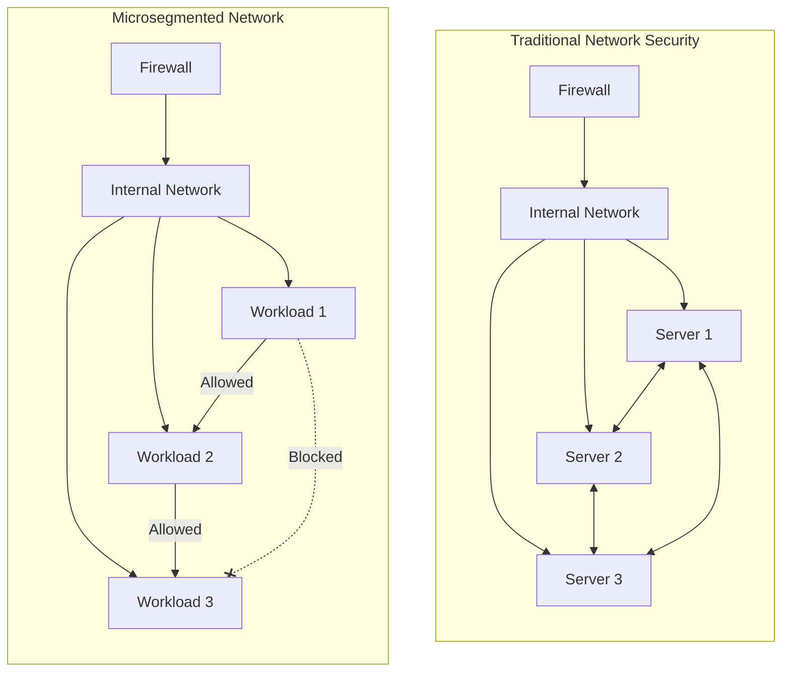
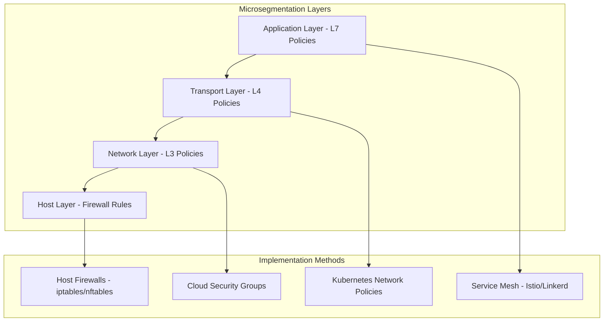
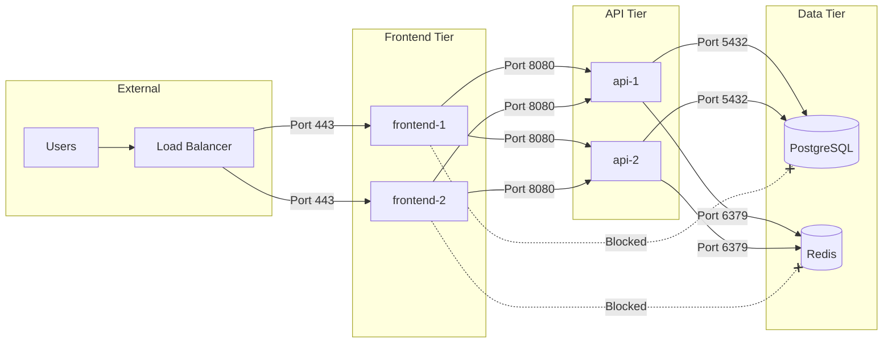
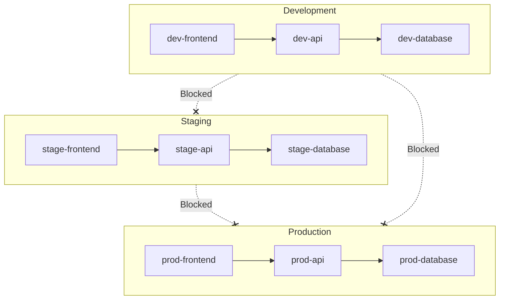

# How to Create Microsegmentation Policies

Author: [nawazdhandala](https://github.com/nawazdhandala)

Tags: Networking, Security, Microsegmentation, ZeroTrust

Description: A comprehensive guide to implementing microsegmentation policies for workload isolation using Kubernetes network policies and host-based firewalls.

---

Traditional network security relies on perimeter defenses. Once an attacker breaches the perimeter, they can move laterally across your infrastructure. Microsegmentation changes this by creating granular security boundaries around individual workloads, limiting blast radius and preventing lateral movement.

## What is Microsegmentation?

Microsegmentation divides your network into isolated segments at the workload level. Instead of trusting everything inside your network perimeter, each workload gets its own security policy defining exactly what it can communicate with.



### Key Benefits

- **Reduced Blast Radius**: Compromised workloads cannot spread to unrelated systems
- **Compliance**: Meet PCI-DSS, HIPAA, and SOC 2 segmentation requirements
- **Visibility**: Understand exactly what communicates with what
- **Zero Trust**: Verify every connection, even inside your network

## Microsegmentation Architecture

A complete microsegmentation strategy operates at multiple layers.



## Kubernetes Network Policies for Workload Isolation

Kubernetes Network Policies are the foundation of microsegmentation in containerized environments.

### Default Deny All Traffic

Start with a deny-all policy. This ensures no pod can communicate unless explicitly allowed.

```yaml
# default-deny-all.yaml
# This policy blocks all ingress and egress traffic for pods in the namespace.
# Apply this first, then add specific allow rules for required communication paths.
apiVersion: networking.k8s.io/v1
kind: NetworkPolicy
metadata:
  name: default-deny-all
  namespace: production
spec:
  # Empty selector matches all pods in the namespace
  podSelector: {}
  policyTypes:
    - Ingress
    - Egress
```

### Allow DNS Resolution

After denying all traffic, pods cannot resolve DNS. Add this policy to restore DNS functionality.

```yaml
# allow-dns.yaml
# Allows all pods to query the kube-dns service for name resolution.
# Without this policy, pods cannot resolve service names or external domains.
apiVersion: networking.k8s.io/v1
kind: NetworkPolicy
metadata:
  name: allow-dns
  namespace: production
spec:
  podSelector: {}
  policyTypes:
    - Egress
  egress:
    # Allow UDP and TCP DNS queries to kube-dns
    - to:
        - namespaceSelector:
            matchLabels:
              kubernetes.io/metadata.name: kube-system
          podSelector:
            matchLabels:
              k8s-app: kube-dns
      ports:
        - protocol: UDP
          port: 53
        - protocol: TCP
          port: 53
```

### Workload-Specific Isolation Policy

Create policies that define exactly what each workload can access.

```yaml
# api-server-policy.yaml
# Microsegmentation policy for the API server workload.
# Allows inbound traffic only from the frontend and outbound only to the database.
apiVersion: networking.k8s.io/v1
kind: NetworkPolicy
metadata:
  name: api-server-microsegmentation
  namespace: production
spec:
  # This policy applies to pods with the label app=api-server
  podSelector:
    matchLabels:
      app: api-server
  policyTypes:
    - Ingress
    - Egress
  ingress:
    # Allow incoming connections from frontend pods on port 8080
    - from:
        - podSelector:
            matchLabels:
              app: frontend
      ports:
        - protocol: TCP
          port: 8080
  egress:
    # Allow outgoing connections to database pods on port 5432
    - to:
        - podSelector:
            matchLabels:
              app: database
      ports:
        - protocol: TCP
          port: 5432
```

### Multi-Tier Application Isolation

Here is a complete microsegmentation setup for a three-tier application.



```yaml
# three-tier-microsegmentation.yaml
# Complete microsegmentation policies for a three-tier application.
# Each tier can only communicate with its adjacent tiers.
---
# Frontend policy: accepts traffic from ingress, sends to API tier
apiVersion: networking.k8s.io/v1
kind: NetworkPolicy
metadata:
  name: frontend-policy
  namespace: production
spec:
  podSelector:
    matchLabels:
      tier: frontend
  policyTypes:
    - Ingress
    - Egress
  ingress:
    # Allow traffic from ingress controller namespace
    - from:
        - namespaceSelector:
            matchLabels:
              name: ingress-nginx
      ports:
        - protocol: TCP
          port: 443
  egress:
    # Allow connections to API tier
    - to:
        - podSelector:
            matchLabels:
              tier: api
      ports:
        - protocol: TCP
          port: 8080
---
# API policy: accepts traffic from frontend, sends to data tier
apiVersion: networking.k8s.io/v1
kind: NetworkPolicy
metadata:
  name: api-policy
  namespace: production
spec:
  podSelector:
    matchLabels:
      tier: api
  policyTypes:
    - Ingress
    - Egress
  ingress:
    # Accept connections from frontend tier
    - from:
        - podSelector:
            matchLabels:
              tier: frontend
      ports:
        - protocol: TCP
          port: 8080
  egress:
    # Allow connections to database
    - to:
        - podSelector:
            matchLabels:
              app: postgresql
      ports:
        - protocol: TCP
          port: 5432
    # Allow connections to cache
    - to:
        - podSelector:
            matchLabels:
              app: redis
      ports:
        - protocol: TCP
          port: 6379
---
# Database policy: accepts traffic only from API tier, no egress
apiVersion: networking.k8s.io/v1
kind: NetworkPolicy
metadata:
  name: database-policy
  namespace: production
spec:
  podSelector:
    matchLabels:
      app: postgresql
  policyTypes:
    - Ingress
    - Egress
  ingress:
    # Only API tier can connect
    - from:
        - podSelector:
            matchLabels:
              tier: api
      ports:
        - protocol: TCP
          port: 5432
  # No egress rules - database should not initiate connections
  egress: []
---
# Redis cache policy
apiVersion: networking.k8s.io/v1
kind: NetworkPolicy
metadata:
  name: redis-policy
  namespace: production
spec:
  podSelector:
    matchLabels:
      app: redis
  policyTypes:
    - Ingress
    - Egress
  ingress:
    - from:
        - podSelector:
            matchLabels:
              tier: api
      ports:
        - protocol: TCP
          port: 6379
  egress: []
```

### Cross-Namespace Microsegmentation

Isolate workloads across namespaces while allowing specific cross-namespace communication.

```yaml
# cross-namespace-policy.yaml
# Allow the monitoring namespace to scrape metrics from production pods.
# All other cross-namespace traffic remains blocked.
apiVersion: networking.k8s.io/v1
kind: NetworkPolicy
metadata:
  name: allow-monitoring-scrape
  namespace: production
spec:
  podSelector: {}
  policyTypes:
    - Ingress
  ingress:
    # Allow Prometheus from monitoring namespace to scrape metrics
    - from:
        - namespaceSelector:
            matchLabels:
              kubernetes.io/metadata.name: monitoring
          podSelector:
            matchLabels:
              app: prometheus
      ports:
        # Standard metrics port
        - protocol: TCP
          port: 9090
        # Application metrics endpoint
        - protocol: TCP
          port: 8080
```

## Application-Level Network Policies with Service Mesh

For Layer 7 (HTTP/gRPC) microsegmentation, use a service mesh like Istio.

### Istio Authorization Policy

```yaml
# istio-authz-policy.yaml
# Layer 7 microsegmentation using Istio AuthorizationPolicy.
# Controls access based on HTTP methods, paths, and service accounts.
apiVersion: security.istio.io/v1
kind: AuthorizationPolicy
metadata:
  name: api-server-authz
  namespace: production
spec:
  selector:
    matchLabels:
      app: api-server
  action: ALLOW
  rules:
    # Allow frontend to call specific API endpoints
    - from:
        - source:
            principals:
              - cluster.local/ns/production/sa/frontend
      to:
        - operation:
            methods: ["GET", "POST"]
            paths: ["/api/v1/*"]
    # Allow health checks from any source
    - to:
        - operation:
            methods: ["GET"]
            paths: ["/health", "/ready"]
```

### Istio PeerAuthentication for mTLS

```yaml
# peer-authentication.yaml
# Enforce mutual TLS between all workloads in the namespace.
# This ensures all traffic is encrypted and authenticated.
apiVersion: security.istio.io/v1
kind: PeerAuthentication
metadata:
  name: strict-mtls
  namespace: production
spec:
  # Apply to all workloads in the namespace
  selector: {}
  mtls:
    mode: STRICT
```

## Host-Based Firewall Rules

For non-containerized workloads or additional defense in depth, use host-based firewalls.

### iptables Rules for Workload Isolation

```bash
#!/bin/bash
# host-firewall.sh
# Host-based microsegmentation using iptables.
# This script configures firewall rules for a database server.

# Flush existing rules to start fresh
iptables -F INPUT
iptables -F OUTPUT

# Set default policies to DROP (deny all by default)
iptables -P INPUT DROP
iptables -P OUTPUT DROP
iptables -P FORWARD DROP

# Allow loopback traffic (required for local services)
iptables -A INPUT -i lo -j ACCEPT
iptables -A OUTPUT -o lo -j ACCEPT

# Allow established connections (for return traffic)
iptables -A INPUT -m state --state ESTABLISHED,RELATED -j ACCEPT
iptables -A OUTPUT -m state --state ESTABLISHED,RELATED -j ACCEPT

# Allow SSH from management network only (10.0.100.0/24)
iptables -A INPUT -p tcp --dport 22 -s 10.0.100.0/24 -j ACCEPT

# Allow PostgreSQL from API servers only (10.0.10.0/24)
iptables -A INPUT -p tcp --dport 5432 -s 10.0.10.0/24 -j ACCEPT

# Allow monitoring (Prometheus scrape from 10.0.50.0/24)
iptables -A INPUT -p tcp --dport 9187 -s 10.0.50.0/24 -j ACCEPT

# Allow DNS queries (required for name resolution)
iptables -A OUTPUT -p udp --dport 53 -d 10.0.0.2 -j ACCEPT
iptables -A OUTPUT -p tcp --dport 53 -d 10.0.0.2 -j ACCEPT

# Allow NTP for time synchronization
iptables -A OUTPUT -p udp --dport 123 -j ACCEPT

# Log dropped packets for debugging (optional)
iptables -A INPUT -j LOG --log-prefix "IPT-INPUT-DROP: " --log-level 4
iptables -A OUTPUT -j LOG --log-prefix "IPT-OUTPUT-DROP: " --log-level 4

# Save rules to persist across reboots
iptables-save > /etc/iptables/rules.v4

echo "Microsegmentation firewall rules applied successfully"
```

### nftables Rules (Modern Alternative)

```bash
#!/usr/sbin/nft -f
# nftables-microseg.nft
# Modern host-based microsegmentation using nftables.
# nftables replaces iptables with better performance and syntax.

flush ruleset

table inet microseg {
    # Define allowed network segments as variables
    define mgmt_net = 10.0.100.0/24
    define api_net = 10.0.10.0/24
    define monitoring_net = 10.0.50.0/24
    define dns_server = 10.0.0.2

    chain input {
        type filter hook input priority 0; policy drop;

        # Allow established connections
        ct state established,related accept

        # Allow loopback
        iif lo accept

        # SSH from management network only
        ip saddr $mgmt_net tcp dport 22 accept

        # PostgreSQL from API servers only
        ip saddr $api_net tcp dport 5432 accept

        # Metrics endpoint from monitoring
        ip saddr $monitoring_net tcp dport 9187 accept

        # Log and drop everything else
        log prefix "nft-input-drop: " counter drop
    }

    chain output {
        type filter hook output priority 0; policy drop;

        # Allow established connections
        ct state established,related accept

        # Allow loopback
        oif lo accept

        # DNS queries to internal DNS
        ip daddr $dns_server udp dport 53 accept
        ip daddr $dns_server tcp dport 53 accept

        # NTP for time sync
        udp dport 123 accept

        # Log and drop everything else
        log prefix "nft-output-drop: " counter drop
    }
}
```

### Systemd Service for Persistent Rules

```ini
# /etc/systemd/system/nftables-microseg.service
# Systemd service to load microsegmentation rules at boot.
[Unit]
Description=Microsegmentation nftables rules
After=network.target

[Service]
Type=oneshot
ExecStart=/usr/sbin/nft -f /etc/nftables/microseg.nft
ExecReload=/usr/sbin/nft -f /etc/nftables/microseg.nft
RemainAfterExit=yes

[Install]
WantedBy=multi-user.target
```

## Workload Isolation Patterns

### Pattern 1: Environment Isolation

Completely isolate development, staging, and production environments.



```yaml
# environment-isolation.yaml
# Namespace-based environment isolation.
# Each environment runs in its own namespace with no cross-environment traffic.
---
apiVersion: networking.k8s.io/v1
kind: NetworkPolicy
metadata:
  name: isolate-development
  namespace: development
spec:
  podSelector: {}
  policyTypes:
    - Ingress
    - Egress
  ingress:
    # Only allow traffic from within development namespace
    - from:
        - podSelector: {}
  egress:
    # Only allow traffic to pods within development namespace
    - to:
        - podSelector: {}
    # Allow DNS
    - to:
        - namespaceSelector:
            matchLabels:
              kubernetes.io/metadata.name: kube-system
      ports:
        - protocol: UDP
          port: 53
---
apiVersion: networking.k8s.io/v1
kind: NetworkPolicy
metadata:
  name: isolate-staging
  namespace: staging
spec:
  podSelector: {}
  policyTypes:
    - Ingress
    - Egress
  ingress:
    - from:
        - podSelector: {}
  egress:
    - to:
        - podSelector: {}
    - to:
        - namespaceSelector:
            matchLabels:
              kubernetes.io/metadata.name: kube-system
      ports:
        - protocol: UDP
          port: 53
---
apiVersion: networking.k8s.io/v1
kind: NetworkPolicy
metadata:
  name: isolate-production
  namespace: production
spec:
  podSelector: {}
  policyTypes:
    - Ingress
    - Egress
  ingress:
    - from:
        - podSelector: {}
  egress:
    - to:
        - podSelector: {}
    - to:
        - namespaceSelector:
            matchLabels:
              kubernetes.io/metadata.name: kube-system
      ports:
        - protocol: UDP
          port: 53
```

### Pattern 2: Compliance Zone Isolation

Isolate PCI-DSS compliant workloads from the rest of the infrastructure.

```yaml
# pci-zone-isolation.yaml
# Microsegmentation for PCI-DSS compliance.
# PCI workloads can only communicate with other PCI workloads.
apiVersion: networking.k8s.io/v1
kind: NetworkPolicy
metadata:
  name: pci-zone-isolation
  namespace: production
spec:
  # Apply to all pods in the PCI compliance zone
  podSelector:
    matchLabels:
      compliance-zone: pci
  policyTypes:
    - Ingress
    - Egress
  ingress:
    # Only accept traffic from other PCI zone workloads
    - from:
        - podSelector:
            matchLabels:
              compliance-zone: pci
  egress:
    # Only send traffic to other PCI zone workloads
    - to:
        - podSelector:
            matchLabels:
              compliance-zone: pci
    # Allow DNS
    - to:
        - namespaceSelector:
            matchLabels:
              kubernetes.io/metadata.name: kube-system
          podSelector:
            matchLabels:
              k8s-app: kube-dns
      ports:
        - protocol: UDP
          port: 53
```

### Pattern 3: Service-Based Microsegmentation

Define policies based on service identity rather than network location.

```yaml
# service-identity-policy.yaml
# Service-based microsegmentation using Kubernetes service accounts.
# Policies are defined by what service the workload represents.
apiVersion: networking.k8s.io/v1
kind: NetworkPolicy
metadata:
  name: payment-service-isolation
  namespace: production
spec:
  podSelector:
    matchLabels:
      service: payment
  policyTypes:
    - Ingress
    - Egress
  ingress:
    # Only order service can call payment service
    - from:
        - podSelector:
            matchLabels:
              service: order
      ports:
        - protocol: TCP
          port: 8080
  egress:
    # Payment service can only call payment gateway (external)
    - to:
        - ipBlock:
            cidr: 0.0.0.0/0
            except:
              # Block all internal ranges
              - 10.0.0.0/8
              - 172.16.0.0/12
              - 192.168.0.0/16
      ports:
        - protocol: TCP
          port: 443
    # Allow DNS
    - to:
        - namespaceSelector:
            matchLabels:
              kubernetes.io/metadata.name: kube-system
      ports:
        - protocol: UDP
          port: 53
```

## Testing and Validating Microsegmentation

### Connectivity Test Script

```bash
#!/bin/bash
# test-microsegmentation.sh
# Script to validate microsegmentation policies are working correctly.
# Run from a pod within the cluster to test connectivity.

set -e

NAMESPACE=${1:-production}
TARGET_POD=${2:-api-server}
TARGET_PORT=${3:-8080}

echo "=== Microsegmentation Validation Test ==="
echo "Testing from: $(hostname)"
echo "Target: $TARGET_POD.$NAMESPACE on port $TARGET_PORT"
echo ""

# Test 1: Check if connection is allowed
echo "[Test 1] Testing TCP connectivity..."
if timeout 5 nc -zv "$TARGET_POD.$NAMESPACE.svc.cluster.local" "$TARGET_PORT" 2>&1; then
    echo "RESULT: Connection ALLOWED"
else
    echo "RESULT: Connection BLOCKED (expected if policy is working)"
fi
echo ""

# Test 2: Check DNS resolution
echo "[Test 2] Testing DNS resolution..."
if nslookup "$TARGET_POD.$NAMESPACE.svc.cluster.local" > /dev/null 2>&1; then
    echo "RESULT: DNS resolution WORKING"
else
    echo "RESULT: DNS resolution BLOCKED"
fi
echo ""

# Test 3: Check egress to external
echo "[Test 3] Testing external egress..."
if timeout 5 curl -s -o /dev/null -w "%{http_code}" https://api.github.com 2>/dev/null | grep -q "200\|403"; then
    echo "RESULT: External egress ALLOWED"
else
    echo "RESULT: External egress BLOCKED"
fi
echo ""

echo "=== Test Complete ==="
```

### Network Policy Visualization

```bash
#!/bin/bash
# visualize-policies.sh
# Generate a report of all network policies and their effects.

NAMESPACE=${1:-production}

echo "=== Network Policies in $NAMESPACE ==="
kubectl get networkpolicies -n "$NAMESPACE" -o wide

echo ""
echo "=== Policy Details ==="
for policy in $(kubectl get networkpolicies -n "$NAMESPACE" -o jsonpath='{.items[*].metadata.name}'); do
    echo "--- Policy: $policy ---"
    kubectl get networkpolicy "$policy" -n "$NAMESPACE" -o yaml | grep -A 50 "spec:"
    echo ""
done

echo "=== Pod Labels (for selector matching) ==="
kubectl get pods -n "$NAMESPACE" --show-labels

echo ""
echo "=== Services ==="
kubectl get services -n "$NAMESPACE"
```

## Best Practices

### 1. Start with Default Deny

Always begin with a default deny policy before adding specific allows. This ensures you explicitly define all allowed communication paths.

### 2. Use Labels Consistently

Define a consistent labeling strategy for your workloads. Labels like `app`, `tier`, `environment`, and `compliance-zone` make policies easier to write and maintain.

### 3. Document Every Allow Rule

Comment your policies explaining why each rule exists. When auditing later, you need to know the business reason for each allowed path.

### 4. Test in Staging First

Always validate policies in a non-production environment. A misconfigured policy can cause outages.

### 5. Monitor Policy Violations

Use tools like Cilium Hubble or Calico Enterprise to monitor for blocked traffic. This helps identify missing rules and potential security incidents.

### 6. Version Control Policies

Store all network policies in Git. Review changes through pull requests before applying to production.

### 7. Automate Policy Generation

For large deployments, generate policies programmatically based on service dependencies discovered through traffic analysis.

---

Microsegmentation transforms your security posture from castle-and-moat to zero trust. By defining explicit communication paths for each workload, you limit the blast radius of any compromise and gain visibility into your application's actual network behavior. Start with default deny, add specific allows, and continuously monitor for violations.
