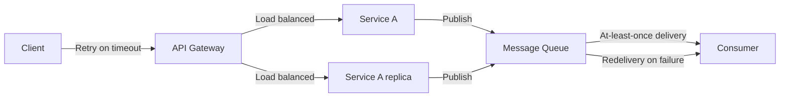
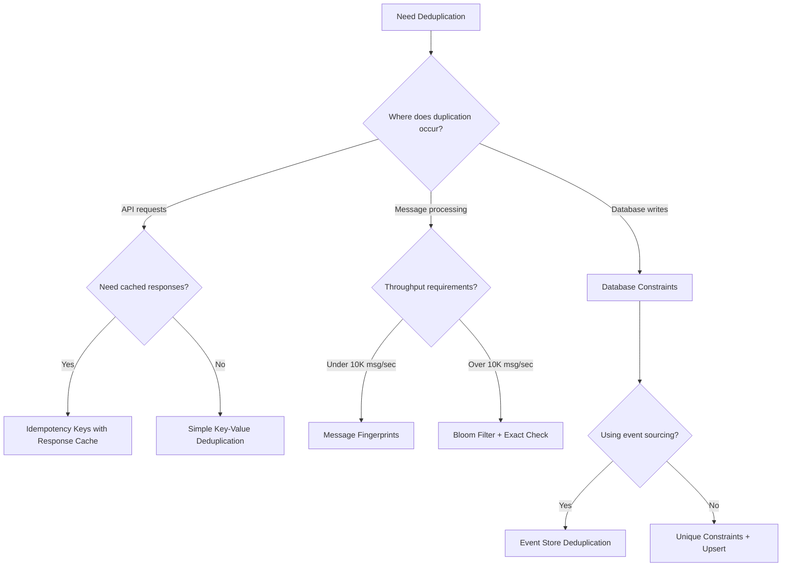

# How to Implement Deduplication Strategies in Microservices

Author: [nawazdhandala](https://github.com/nawazdhandala)

Tags: Microservices, Deduplication, Distributed Systems, Idempotency, Event-Driven Architecture, Redis, Kafka, PostgreSQL

Description: A practical guide to implementing deduplication strategies in microservices architectures, covering idempotency keys, message deduplication, database-level techniques, and distributed coordination patterns with production-ready code examples.

---

Duplicate processing is one of the most common problems in microservices. Network retries, message redelivery, and failover scenarios all create situations where the same operation might execute multiple times. Without proper deduplication, you end up with double charges, duplicate orders, or inconsistent data across services.

This guide covers practical deduplication strategies you can implement today, with real code examples that work in production environments.

## Why Deduplication Matters in Microservices

In a monolithic application, deduplication is simpler because you control the entire transaction. In microservices, requests flow through multiple services, message queues, and databases. Each hop introduces potential for duplication:



Without deduplication at each layer, a single user action can trigger multiple side effects. Consider an order placement: the client retries after a timeout, both service replicas receive the request, each publishes a message, and the consumer processes both messages. One order becomes four charges.

## Strategy 1: Idempotency Keys at the API Layer

The most effective first line of defense is requiring idempotency keys for mutating operations. Clients generate a unique key for each logical operation and include it in requests.

This implementation stores idempotency records with request fingerprints to detect both exact retries and conflicting requests with the same key.

```typescript
import { Redis } from 'ioredis';
import crypto from 'crypto';

interface IdempotencyRecord {
  key: string;
  requestHash: string;
  status: 'processing' | 'completed' | 'failed';
  response?: unknown;
  createdAt: number;
  completedAt?: number;
}

interface IdempotencyResult {
  isDuplicate: boolean;
  record?: IdempotencyRecord;
  isConflict?: boolean;
}

class IdempotencyService {
  private redis: Redis;
  private ttlSeconds: number;
  private prefix = 'idempotency';

  constructor(redis: Redis, ttlSeconds = 86400) {
    this.redis = redis;
    this.ttlSeconds = ttlSeconds;
  }

  // Create a hash of the request body to detect mismatched retries
  private hashRequest(body: unknown): string {
    const serialized = JSON.stringify(body, Object.keys(body as object).sort());
    return crypto.createHash('sha256').update(serialized).digest('hex').slice(0, 32);
  }

  // Check if this request is a duplicate and acquire processing lock if not
  async checkAndLock(
    idempotencyKey: string,
    requestBody: unknown
  ): Promise<IdempotencyResult> {
    const key = `${this.prefix}:${idempotencyKey}`;
    const requestHash = this.hashRequest(requestBody);

    // Lua script ensures atomicity: check existence and set if not exists
    const script = `
      local existing = redis.call('GET', KEYS[1])
      if existing then
        return existing
      end
      local record = ARGV[1]
      redis.call('SETEX', KEYS[1], ARGV[2], record)
      return nil
    `;

    const newRecord: IdempotencyRecord = {
      key: idempotencyKey,
      requestHash,
      status: 'processing',
      createdAt: Date.now(),
    };

    const result = await this.redis.eval(
      script,
      1,
      key,
      JSON.stringify(newRecord),
      this.ttlSeconds
    );

    // No existing record means we acquired the lock
    if (result === null) {
      return { isDuplicate: false };
    }

    // Found existing record, check if it matches our request
    const existingRecord: IdempotencyRecord = JSON.parse(result as string);

    // Different request body with same idempotency key is a conflict
    if (existingRecord.requestHash !== requestHash) {
      return {
        isDuplicate: true,
        record: existingRecord,
        isConflict: true,
      };
    }

    return {
      isDuplicate: true,
      record: existingRecord,
    };
  }

  // Mark request as completed and store the response
  async complete(idempotencyKey: string, response: unknown): Promise<void> {
    const key = `${this.prefix}:${idempotencyKey}`;
    const existing = await this.redis.get(key);

    if (!existing) {
      throw new Error('No pending idempotency record found');
    }

    const record: IdempotencyRecord = JSON.parse(existing);
    record.status = 'completed';
    record.response = response;
    record.completedAt = Date.now();

    await this.redis.setex(key, this.ttlSeconds, JSON.stringify(record));
  }

  // Mark request as failed to allow retry with same key
  async fail(idempotencyKey: string): Promise<void> {
    const key = `${this.prefix}:${idempotencyKey}`;
    await this.redis.del(key);
  }
}
```

The Express middleware wraps this service to intercept requests before they reach handlers.

```typescript
import { Request, Response, NextFunction } from 'express';

const IDEMPOTENCY_HEADER = 'Idempotency-Key';

function createIdempotencyMiddleware(service: IdempotencyService) {
  return async (req: Request, res: Response, next: NextFunction) => {
    // Only apply to mutating methods
    if (!['POST', 'PUT', 'PATCH', 'DELETE'].includes(req.method)) {
      return next();
    }

    const idempotencyKey = req.headers[IDEMPOTENCY_HEADER.toLowerCase()] as string;

    // Require idempotency key for mutating operations
    if (!idempotencyKey) {
      return res.status(400).json({
        error: 'Missing Idempotency-Key header',
        message: 'Mutating operations require an idempotency key',
      });
    }

    const result = await service.checkAndLock(idempotencyKey, req.body);

    if (result.isDuplicate) {
      if (result.isConflict) {
        return res.status(422).json({
          error: 'Idempotency key conflict',
          message: 'This idempotency key was used with different request parameters',
        });
      }

      if (result.record?.status === 'completed') {
        // Return cached response for completed requests
        return res.status(200).json(result.record.response);
      }

      if (result.record?.status === 'processing') {
        // Request is still being processed
        return res.status(409).json({
          error: 'Request in progress',
          message: 'This request is currently being processed',
        });
      }
    }

    // Store service on request for use in route handler
    (req as any).idempotencyKey = idempotencyKey;
    (req as any).idempotencyService = service;

    // Intercept response to capture result
    const originalJson = res.json.bind(res);
    res.json = (body: unknown) => {
      if (res.statusCode >= 200 && res.statusCode < 300) {
        service.complete(idempotencyKey, body).catch(console.error);
      } else {
        service.fail(idempotencyKey).catch(console.error);
      }
      return originalJson(body);
    };

    next();
  };
}
```

## Strategy 2: Message Deduplication with Fingerprints

When services communicate through message queues, at-least-once delivery guarantees mean consumers must handle duplicates. Store message fingerprints to detect and skip duplicates.

This pattern uses a sliding window approach where each consumer tracks processed messages within a time window.

```typescript
import { Redis } from 'ioredis';
import crypto from 'crypto';

interface Message {
  id: string;
  type: string;
  payload: unknown;
  timestamp: number;
  source: string;
}

interface DeduplicationResult {
  isNew: boolean;
  messageId: string;
}

class MessageDeduplicator {
  private redis: Redis;
  private windowSeconds: number;
  private consumerGroup: string;

  constructor(redis: Redis, consumerGroup: string, windowSeconds = 3600) {
    this.redis = redis;
    this.consumerGroup = consumerGroup;
    this.windowSeconds = windowSeconds;
  }

  // Generate fingerprint from message content for content-based deduplication
  private fingerprint(message: Message): string {
    const content = JSON.stringify({
      type: message.type,
      payload: message.payload,
      source: message.source,
    });
    return crypto.createHash('sha256').update(content).digest('hex').slice(0, 16);
  }

  // Check and mark message as processed atomically
  async checkAndMark(message: Message): Promise<DeduplicationResult> {
    const messageId = message.id;
    const fingerprint = this.fingerprint(message);

    // Use both message ID and content fingerprint for deduplication
    // This catches both exact retries and duplicate content with different IDs
    const idKey = `dedup:${this.consumerGroup}:id:${messageId}`;
    const fpKey = `dedup:${this.consumerGroup}:fp:${fingerprint}`;

    // Lua script checks both keys and sets them atomically
    const script = `
      local idExists = redis.call('EXISTS', KEYS[1])
      local fpExists = redis.call('EXISTS', KEYS[2])

      if idExists == 1 or fpExists == 1 then
        return 0
      end

      redis.call('SETEX', KEYS[1], ARGV[1], '1')
      redis.call('SETEX', KEYS[2], ARGV[1], ARGV[2])
      return 1
    `;

    const result = await this.redis.eval(
      script,
      2,
      idKey,
      fpKey,
      this.windowSeconds,
      messageId
    );

    return {
      isNew: result === 1,
      messageId,
    };
  }

  // Remove deduplication record if processing fails
  async unmark(message: Message): Promise<void> {
    const fingerprint = this.fingerprint(message);
    const idKey = `dedup:${this.consumerGroup}:id:${message.id}`;
    const fpKey = `dedup:${this.consumerGroup}:fp:${fingerprint}`;

    await this.redis.del(idKey, fpKey);
  }
}
```

The consumer wrapper integrates deduplication into your message processing pipeline.

```typescript
type MessageHandler = (message: Message) => Promise<void>;

class DeduplicatedConsumer {
  private deduplicator: MessageDeduplicator;
  private handlers: Map<string, MessageHandler> = new Map();

  constructor(deduplicator: MessageDeduplicator) {
    this.deduplicator = deduplicator;
  }

  // Register handler for message type
  on(messageType: string, handler: MessageHandler): void {
    this.handlers.set(messageType, handler);
  }

  // Process message with automatic deduplication
  async process(message: Message): Promise<void> {
    const handler = this.handlers.get(message.type);

    if (!handler) {
      console.warn(`No handler registered for message type: ${message.type}`);
      return;
    }

    const result = await this.deduplicator.checkAndMark(message);

    if (!result.isNew) {
      console.log(`Skipping duplicate message: ${message.id}`);
      return;
    }

    try {
      await handler(message);
    } catch (error) {
      // Unmark on failure to allow reprocessing
      await this.deduplicator.unmark(message);
      throw error;
    }
  }
}
```

## Strategy 3: Database-Level Deduplication

For critical operations, database constraints provide the strongest guarantees. Use unique constraints and upsert operations to ensure exactly-once writes.

This approach uses PostgreSQL's ON CONFLICT clause to handle duplicates at the database level.

```typescript
import { Pool, PoolClient } from 'pg';

interface Order {
  orderId: string;
  customerId: string;
  items: OrderItem[];
  totalAmount: number;
  idempotencyKey: string;
}

interface OrderItem {
  productId: string;
  quantity: number;
  price: number;
}

interface OrderResult {
  order: Order;
  isNew: boolean;
}

class OrderRepository {
  private pool: Pool;

  constructor(pool: Pool) {
    this.pool = pool;
  }

  // Create order with idempotency key constraint
  // Returns existing order if idempotency key matches
  async createOrder(order: Order): Promise<OrderResult> {
    const client = await this.pool.connect();

    try {
      await client.query('BEGIN');

      // Insert with ON CONFLICT to handle duplicates
      // The idempotency_key column has a unique constraint
      const result = await client.query(
        `
        INSERT INTO orders (
          order_id, customer_id, total_amount, idempotency_key, created_at
        )
        VALUES ($1, $2, $3, $4, NOW())
        ON CONFLICT (idempotency_key) DO UPDATE
        SET order_id = orders.order_id
        RETURNING order_id, customer_id, total_amount, idempotency_key,
                  (xmax = 0) as is_new
        `,
        [order.orderId, order.customerId, order.totalAmount, order.idempotencyKey]
      );

      const isNew = result.rows[0].is_new;
      const returnedOrderId = result.rows[0].order_id;

      // Only insert items for new orders
      if (isNew) {
        for (const item of order.items) {
          await client.query(
            `
            INSERT INTO order_items (order_id, product_id, quantity, price)
            VALUES ($1, $2, $3, $4)
            `,
            [returnedOrderId, item.productId, item.quantity, item.price]
          );
        }
      }

      await client.query('COMMIT');

      // Fetch complete order data
      const fullOrder = await this.getOrder(returnedOrderId);

      return {
        order: fullOrder!,
        isNew,
      };
    } catch (error) {
      await client.query('ROLLBACK');
      throw error;
    } finally {
      client.release();
    }
  }

  async getOrder(orderId: string): Promise<Order | null> {
    const orderResult = await this.pool.query(
      'SELECT * FROM orders WHERE order_id = $1',
      [orderId]
    );

    if (orderResult.rows.length === 0) {
      return null;
    }

    const itemsResult = await this.pool.query(
      'SELECT product_id, quantity, price FROM order_items WHERE order_id = $1',
      [orderId]
    );

    return {
      orderId: orderResult.rows[0].order_id,
      customerId: orderResult.rows[0].customer_id,
      totalAmount: orderResult.rows[0].total_amount,
      idempotencyKey: orderResult.rows[0].idempotency_key,
      items: itemsResult.rows.map(row => ({
        productId: row.product_id,
        quantity: row.quantity,
        price: row.price,
      })),
    };
  }
}
```

The PostgreSQL schema requires a unique constraint on the idempotency key column.

```sql
-- Schema for orders table with idempotency support
CREATE TABLE orders (
    order_id UUID PRIMARY KEY DEFAULT gen_random_uuid(),
    customer_id UUID NOT NULL,
    total_amount DECIMAL(10, 2) NOT NULL,
    idempotency_key VARCHAR(64) NOT NULL,
    status VARCHAR(20) DEFAULT 'pending',
    created_at TIMESTAMP WITH TIME ZONE DEFAULT NOW(),
    updated_at TIMESTAMP WITH TIME ZONE DEFAULT NOW(),

    -- Unique constraint enables ON CONFLICT handling
    CONSTRAINT orders_idempotency_key_unique UNIQUE (idempotency_key)
);

CREATE TABLE order_items (
    id UUID PRIMARY KEY DEFAULT gen_random_uuid(),
    order_id UUID NOT NULL REFERENCES orders(order_id) ON DELETE CASCADE,
    product_id UUID NOT NULL,
    quantity INTEGER NOT NULL,
    price DECIMAL(10, 2) NOT NULL
);

-- Index for fast lookups by idempotency key
CREATE INDEX idx_orders_idempotency_key ON orders(idempotency_key);

-- Index for customer queries
CREATE INDEX idx_orders_customer_id ON orders(customer_id);
```

## Strategy 4: Event Sourcing with Deduplication

Event sourcing naturally supports deduplication by storing events with unique identifiers. If an event with the same ID already exists, the append operation fails or is ignored.

```typescript
import { Pool } from 'pg';

interface Event {
  eventId: string;
  aggregateId: string;
  aggregateType: string;
  eventType: string;
  payload: unknown;
  metadata: EventMetadata;
  version: number;
}

interface EventMetadata {
  correlationId: string;
  causationId?: string;
  userId?: string;
  timestamp: number;
}

interface AppendResult {
  success: boolean;
  isDuplicate: boolean;
  version: number;
}

class EventStore {
  private pool: Pool;

  constructor(pool: Pool) {
    this.pool = pool;
  }

  // Append events with optimistic concurrency and deduplication
  async append(
    aggregateId: string,
    aggregateType: string,
    events: Omit<Event, 'version'>[],
    expectedVersion: number
  ): Promise<AppendResult> {
    const client = await this.pool.connect();

    try {
      await client.query('BEGIN');

      // Lock the aggregate row to prevent concurrent modifications
      const currentVersion = await this.getCurrentVersion(
        client,
        aggregateId,
        aggregateType
      );

      // Optimistic concurrency check
      if (currentVersion !== expectedVersion) {
        await client.query('ROLLBACK');
        return {
          success: false,
          isDuplicate: false,
          version: currentVersion,
        };
      }

      let newVersion = currentVersion;

      for (const event of events) {
        newVersion++;

        // Insert with ON CONFLICT to handle duplicate event IDs
        const result = await client.query(
          `
          INSERT INTO events (
            event_id, aggregate_id, aggregate_type, event_type,
            payload, metadata, version, created_at
          )
          VALUES ($1, $2, $3, $4, $5, $6, $7, NOW())
          ON CONFLICT (event_id) DO NOTHING
          RETURNING event_id
          `,
          [
            event.eventId,
            aggregateId,
            aggregateType,
            event.eventType,
            JSON.stringify(event.payload),
            JSON.stringify(event.metadata),
            newVersion,
          ]
        );

        // If no row returned, this event ID already exists
        if (result.rowCount === 0) {
          await client.query('ROLLBACK');
          return {
            success: false,
            isDuplicate: true,
            version: currentVersion,
          };
        }
      }

      await client.query('COMMIT');

      return {
        success: true,
        isDuplicate: false,
        version: newVersion,
      };
    } catch (error) {
      await client.query('ROLLBACK');
      throw error;
    } finally {
      client.release();
    }
  }

  private async getCurrentVersion(
    client: PoolClient,
    aggregateId: string,
    aggregateType: string
  ): Promise<number> {
    const result = await client.query(
      `
      SELECT COALESCE(MAX(version), 0) as version
      FROM events
      WHERE aggregate_id = $1 AND aggregate_type = $2
      FOR UPDATE
      `,
      [aggregateId, aggregateType]
    );

    return result.rows[0].version;
  }

  // Load events for rebuilding aggregate state
  async load(
    aggregateId: string,
    aggregateType: string,
    fromVersion = 0
  ): Promise<Event[]> {
    const result = await this.pool.query(
      `
      SELECT event_id, aggregate_id, aggregate_type, event_type,
             payload, metadata, version
      FROM events
      WHERE aggregate_id = $1 AND aggregate_type = $2 AND version > $3
      ORDER BY version ASC
      `,
      [aggregateId, aggregateType, fromVersion]
    );

    return result.rows.map(row => ({
      eventId: row.event_id,
      aggregateId: row.aggregate_id,
      aggregateType: row.aggregate_type,
      eventType: row.event_type,
      payload: JSON.parse(row.payload),
      metadata: JSON.parse(row.metadata),
      version: row.version,
    }));
  }
}
```

## Strategy 5: Distributed Deduplication with Bloom Filters

For high-throughput systems where Redis lookups become a bottleneck, Bloom filters provide probabilistic deduplication with very low memory usage. The tradeoff is a small chance of false positives (treating new items as duplicates).

```typescript
import { Redis } from 'ioredis';

class DistributedBloomFilter {
  private redis: Redis;
  private key: string;
  private size: number;
  private hashCount: number;

  // Size and hash count determine false positive rate
  // With size=1000000 and hashCount=7, false positive rate is about 0.8%
  constructor(redis: Redis, key: string, size = 1000000, hashCount = 7) {
    this.redis = redis;
    this.key = key;
    this.size = size;
    this.hashCount = hashCount;
  }

  // Generate multiple hash values for an item
  private hashes(item: string): number[] {
    const results: number[] = [];

    // Use two hash functions to generate k hashes (Kirsch-Mitzenmacher optimization)
    let h1 = 0;
    let h2 = 0;

    for (let i = 0; i < item.length; i++) {
      h1 = (h1 * 31 + item.charCodeAt(i)) >>> 0;
      h2 = (h2 * 37 + item.charCodeAt(i)) >>> 0;
    }

    for (let i = 0; i < this.hashCount; i++) {
      results.push((h1 + i * h2) % this.size);
    }

    return results;
  }

  // Add item to filter and check if it might have been seen before
  async addAndCheck(item: string): Promise<boolean> {
    const positions = this.hashes(item);

    // Lua script atomically checks and sets all bits
    const script = `
      local key = KEYS[1]
      local positions = cjson.decode(ARGV[1])
      local allSet = true

      for _, pos in ipairs(positions) do
        if redis.call('GETBIT', key, pos) == 0 then
          allSet = false
        end
      end

      for _, pos in ipairs(positions) do
        redis.call('SETBIT', key, pos, 1)
      end

      return allSet and 1 or 0
    `;

    const result = await this.redis.eval(script, 1, this.key, JSON.stringify(positions));

    return result === 1;
  }

  // Check if item might exist (false positives possible)
  async mightContain(item: string): Promise<boolean> {
    const positions = this.hashes(item);

    const script = `
      local key = KEYS[1]
      local positions = cjson.decode(ARGV[1])

      for _, pos in ipairs(positions) do
        if redis.call('GETBIT', key, pos) == 0 then
          return 0
        end
      end

      return 1
    `;

    const result = await this.redis.eval(script, 1, this.key, JSON.stringify(positions));

    return result === 1;
  }

  // Clear the filter (use for rotation)
  async clear(): Promise<void> {
    await this.redis.del(this.key);
  }
}
```

Combine Bloom filters with exact checking for a two-tier deduplication system.

```typescript
class TieredDeduplicator {
  private bloomFilter: DistributedBloomFilter;
  private redis: Redis;
  private exactCheckTTL: number;

  constructor(redis: Redis, namespace: string, exactCheckTTL = 3600) {
    this.redis = redis;
    this.bloomFilter = new DistributedBloomFilter(redis, `bloom:${namespace}`);
    this.exactCheckTTL = exactCheckTTL;
  }

  // Fast path: Bloom filter says definitely new, process immediately
  // Slow path: Bloom filter says maybe duplicate, check exact store
  async isDuplicate(itemId: string): Promise<boolean> {
    const mightExist = await this.bloomFilter.mightContain(itemId);

    if (!mightExist) {
      return false;
    }

    // Bloom filter indicates possible duplicate, verify with exact check
    const exactKey = `exact:${itemId}`;
    const exists = await this.redis.exists(exactKey);

    return exists === 1;
  }

  // Mark item as processed in both tiers
  async markProcessed(itemId: string): Promise<void> {
    const exactKey = `exact:${itemId}`;

    await Promise.all([
      this.bloomFilter.addAndCheck(itemId),
      this.redis.setex(exactKey, this.exactCheckTTL, '1'),
    ]);
  }
}
```

## Choosing the Right Strategy

Different scenarios call for different deduplication approaches. Here is a decision flow to help you choose:



Here is a comparison of the strategies:

| Strategy | Consistency | Throughput | Memory | Best For |
|----------|-------------|------------|--------|----------|
| Idempotency Keys | Strong | Medium | Medium | API endpoints with response caching |
| Message Fingerprints | Strong | Medium | Low | Queue consumers, event handlers |
| Database Constraints | Strong | Low | N/A | Critical financial operations |
| Event Sourcing | Strong | Medium | High | Audit-heavy domains |
| Bloom Filters | Probabilistic | Very High | Very Low | High-volume deduplication |

## Production Considerations

### TTL Management

Deduplication records need appropriate time-to-live values. Too short and you miss late duplicates. Too long and you waste storage.

```typescript
// TTL recommendations by use case
const TTL_CONFIGS = {
  // API idempotency: 24 hours covers most retry scenarios
  apiIdempotency: 86400,

  // Message deduplication: Match your message retention policy
  messageDedup: 3600,

  // Payment operations: Keep longer for dispute resolution
  payments: 604800, // 7 days

  // High-frequency events: Short TTL, rely on message ordering
  metrics: 300, // 5 minutes
};
```

### Monitoring Deduplication

Track deduplication metrics to understand your duplicate patterns and tune configurations.

```typescript
import { Counter, Histogram } from 'prom-client';

const deduplicationCounter = new Counter({
  name: 'deduplication_total',
  help: 'Total deduplication checks',
  labelNames: ['result', 'source'],
});

const deduplicationLatency = new Histogram({
  name: 'deduplication_duration_seconds',
  help: 'Deduplication check duration',
  labelNames: ['source'],
  buckets: [0.001, 0.005, 0.01, 0.05, 0.1],
});

// Wrap deduplication calls with metrics
async function withDeduplicationMetrics<T>(
  source: string,
  operation: () => Promise<{ isDuplicate: boolean; result: T }>
): Promise<T> {
  const end = deduplicationLatency.startTimer({ source });

  try {
    const { isDuplicate, result } = await operation();

    deduplicationCounter.inc({
      result: isDuplicate ? 'duplicate' : 'new',
      source,
    });

    return result;
  } finally {
    end();
  }
}
```

### Handling Deduplication Failures

When your deduplication store is unavailable, you need a fallback strategy.

```typescript
class ResilientDeduplicator {
  private primary: IdempotencyService;
  private fallbackEnabled: boolean;

  constructor(primary: IdempotencyService) {
    this.primary = primary;
    this.fallbackEnabled = false;
  }

  async checkAndLock(
    key: string,
    body: unknown
  ): Promise<IdempotencyResult | null> {
    try {
      const result = await this.primary.checkAndLock(key, body);
      this.fallbackEnabled = false;
      return result;
    } catch (error) {
      console.error('Deduplication store unavailable:', error);

      // Circuit breaker pattern: enable fallback mode
      this.fallbackEnabled = true;

      // Return null to indicate deduplication unavailable
      // Caller decides whether to proceed or reject
      return null;
    }
  }

  isFallbackMode(): boolean {
    return this.fallbackEnabled;
  }
}

// Usage in request handler
async function handleRequest(req: Request, res: Response) {
  const deduplicator = new ResilientDeduplicator(idempotencyService);
  const result = await deduplicator.checkAndLock(req.idempotencyKey, req.body);

  if (result === null) {
    // Deduplication unavailable - decide based on operation criticality
    if (isCriticalOperation(req)) {
      return res.status(503).json({
        error: 'Service temporarily unavailable',
        message: 'Please retry in a few moments',
      });
    }
    // For non-critical operations, proceed without deduplication
    console.warn('Proceeding without deduplication for:', req.path);
  }

  // Continue with normal processing
}
```

## Summary

Deduplication in microservices requires a layered approach. Start with idempotency keys at your API boundary to catch client-side retries. Add message deduplication in your consumers to handle queue redeliveries. Use database constraints as your final safety net for critical operations.

The key principles to remember:

1. Every mutating operation needs an idempotency mechanism
2. Store enough context to return cached responses, not just detect duplicates
3. Choose TTLs based on your retry windows and storage constraints
4. Monitor duplicate rates to understand your system's behavior
5. Plan for deduplication store failures with graceful degradation

With these strategies in place, your microservices can handle the realities of distributed systems while maintaining data consistency.
