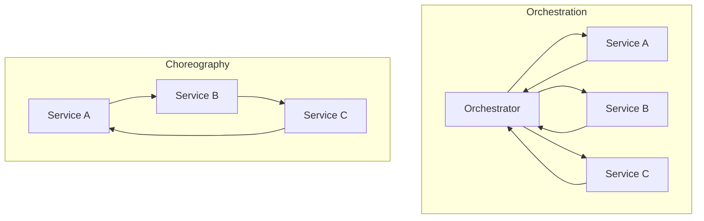
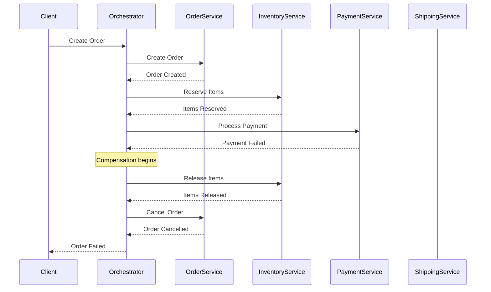
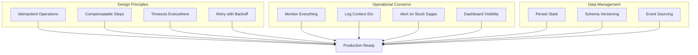

# How to Create Orchestration Pattern in Microservices

Author: [nawazdhandala](https://github.com/nawazdhandala)

Tags: Microservices, Orchestration, Saga Pattern, Distributed Systems, Node.js, TypeScript, Event-Driven Architecture

Description: Learn how to implement the orchestration pattern in microservices to coordinate complex business transactions. This guide covers practical implementations with Node.js, including saga orchestrators, compensation handling, and production-ready patterns.

---

Managing transactions across multiple microservices is one of the toughest challenges in distributed systems. When an order needs to reserve inventory, charge a payment, and schedule shipping, you need a way to coordinate these steps and handle failures gracefully. The orchestration pattern solves this by using a central coordinator to manage the entire workflow.

## Understanding Orchestration vs Choreography

Before diving into implementation, let's clarify the two main approaches to coordinate microservices.



| Aspect | Orchestration | Choreography |
|--------|--------------|--------------|
| Control Flow | Centralized coordinator | Distributed, event-driven |
| Coupling | Services depend on orchestrator | Services loosely coupled |
| Visibility | Easy to trace and monitor | Harder to follow flow |
| Complexity | Logic in one place | Logic spread across services |
| Single Point of Failure | Orchestrator can be a bottleneck | No single point of failure |

Orchestration works best when you need clear visibility into complex workflows, want to centralize business logic, or need to coordinate many services in a specific order.

## The Saga Orchestration Pattern

A saga is a sequence of local transactions where each step either succeeds or triggers compensating transactions to undo previous steps. The orchestrator manages this entire flow.



## Building the Orchestrator

Let's build a production-ready saga orchestrator in Node.js with TypeScript. We'll use Redis for state persistence and message queuing.

### Project Structure

```
src/
  orchestrator/
    SagaOrchestrator.ts
    SagaDefinition.ts
    SagaStep.ts
    SagaState.ts
  sagas/
    OrderSaga.ts
  services/
    OrderService.ts
    InventoryService.ts
    PaymentService.ts
  index.ts
```

### Core Types and Interfaces

Define the fundamental types that represent saga steps, states, and definitions.

```typescript
// src/orchestrator/SagaStep.ts
export interface SagaStep<TContext> {
  // Unique identifier for this step
  name: string;

  // The main action to execute
  execute: (context: TContext) => Promise<TContext>;

  // Compensation action to undo the step if a later step fails
  compensate: (context: TContext) => Promise<TContext>;

  // Optional retry configuration
  retryConfig?: {
    maxAttempts: number;
    delayMs: number;
    backoffMultiplier: number;
  };
}
```

The saga state tracks the progress of each saga instance as it moves through the workflow.

```typescript
// src/orchestrator/SagaState.ts
export enum SagaStatus {
  PENDING = 'PENDING',
  RUNNING = 'RUNNING',
  COMPLETED = 'COMPLETED',
  COMPENSATING = 'COMPENSATING',
  FAILED = 'FAILED',
  COMPENSATED = 'COMPENSATED'
}

export interface SagaState<TContext> {
  // Unique identifier for this saga instance
  sagaId: string;

  // Name of the saga definition
  sagaName: string;

  // Current status of the saga
  status: SagaStatus;

  // Index of the current step being executed
  currentStepIndex: number;

  // Steps that have been completed successfully
  completedSteps: string[];

  // Steps that have been compensated
  compensatedSteps: string[];

  // The context object passed between steps
  context: TContext;

  // Error information if the saga failed
  error?: {
    stepName: string;
    message: string;
    timestamp: Date;
  };

  // Timestamps for tracking
  createdAt: Date;
  updatedAt: Date;
}
```

### The Saga Definition

A saga definition describes the sequence of steps and how they relate to each other.

```typescript
// src/orchestrator/SagaDefinition.ts
import { SagaStep } from './SagaStep';

export interface SagaDefinition<TContext> {
  // Unique name for this saga type
  name: string;

  // Ordered list of steps to execute
  steps: SagaStep<TContext>[];

  // Called when the saga completes successfully
  onComplete?: (context: TContext) => Promise<void>;

  // Called when the saga fails and compensation completes
  onCompensated?: (context: TContext, error: Error) => Promise<void>;
}
```

### The Orchestrator Implementation

The orchestrator manages saga execution, persistence, and compensation. This implementation uses Redis for durability.

```typescript
// src/orchestrator/SagaOrchestrator.ts
import { createClient, RedisClientType } from 'redis';
import { v4 as uuidv4 } from 'uuid';
import { SagaDefinition } from './SagaDefinition';
import { SagaState, SagaStatus } from './SagaState';
import { SagaStep } from './SagaStep';

export class SagaOrchestrator {
  private redis: RedisClientType;
  private definitions: Map<string, SagaDefinition<any>> = new Map();

  constructor(redisUrl: string) {
    this.redis = createClient({ url: redisUrl });
  }

  async connect(): Promise<void> {
    await this.redis.connect();
    console.log('Saga orchestrator connected to Redis');
  }

  // Register a saga definition that can be executed
  registerSaga<TContext>(definition: SagaDefinition<TContext>): void {
    this.definitions.set(definition.name, definition);
    console.log(`Registered saga: ${definition.name}`);
  }

  // Start a new saga instance
  async startSaga<TContext>(
    sagaName: string,
    initialContext: TContext
  ): Promise<string> {
    const definition = this.definitions.get(sagaName);
    if (!definition) {
      throw new Error(`Saga definition not found: ${sagaName}`);
    }

    const sagaId = uuidv4();
    const state: SagaState<TContext> = {
      sagaId,
      sagaName,
      status: SagaStatus.PENDING,
      currentStepIndex: 0,
      completedSteps: [],
      compensatedSteps: [],
      context: initialContext,
      createdAt: new Date(),
      updatedAt: new Date()
    };

    // Persist the initial state
    await this.saveState(state);

    // Execute the saga asynchronously
    this.executeSaga(state, definition).catch(err => {
      console.error(`Saga ${sagaId} failed:`, err);
    });

    return sagaId;
  }

  // Execute all steps of the saga
  private async executeSaga<TContext>(
    state: SagaState<TContext>,
    definition: SagaDefinition<TContext>
  ): Promise<void> {
    state.status = SagaStatus.RUNNING;
    await this.saveState(state);

    try {
      // Execute each step in order
      for (let i = state.currentStepIndex; i < definition.steps.length; i++) {
        const step = definition.steps[i];
        state.currentStepIndex = i;

        console.log(`Saga ${state.sagaId}: Executing step ${step.name}`);

        // Execute with retry logic
        state.context = await this.executeWithRetry(step, state.context);
        state.completedSteps.push(step.name);
        state.updatedAt = new Date();

        await this.saveState(state);
      }

      // All steps completed successfully
      state.status = SagaStatus.COMPLETED;
      await this.saveState(state);

      console.log(`Saga ${state.sagaId}: Completed successfully`);

      if (definition.onComplete) {
        await definition.onComplete(state.context);
      }
    } catch (error) {
      console.error(`Saga ${state.sagaId}: Step failed, starting compensation`);

      state.error = {
        stepName: definition.steps[state.currentStepIndex].name,
        message: error instanceof Error ? error.message : String(error),
        timestamp: new Date()
      };

      // Start compensation
      await this.compensateSaga(state, definition, error as Error);
    }
  }

  // Execute a single step with retry logic
  private async executeWithRetry<TContext>(
    step: SagaStep<TContext>,
    context: TContext
  ): Promise<TContext> {
    const config = step.retryConfig || {
      maxAttempts: 3,
      delayMs: 1000,
      backoffMultiplier: 2
    };

    let lastError: Error | null = null;
    let delay = config.delayMs;

    for (let attempt = 1; attempt <= config.maxAttempts; attempt++) {
      try {
        return await step.execute(context);
      } catch (error) {
        lastError = error as Error;
        console.warn(
          `Step ${step.name} failed (attempt ${attempt}/${config.maxAttempts}):`,
          lastError.message
        );

        if (attempt < config.maxAttempts) {
          await this.sleep(delay);
          delay *= config.backoffMultiplier;
        }
      }
    }

    throw lastError;
  }

  // Compensate completed steps in reverse order
  private async compensateSaga<TContext>(
    state: SagaState<TContext>,
    definition: SagaDefinition<TContext>,
    originalError: Error
  ): Promise<void> {
    state.status = SagaStatus.COMPENSATING;
    await this.saveState(state);

    // Compensate in reverse order
    const stepsToCompensate = [...state.completedSteps].reverse();

    for (const stepName of stepsToCompensate) {
      const step = definition.steps.find(s => s.name === stepName);
      if (!step) continue;

      try {
        console.log(`Saga ${state.sagaId}: Compensating step ${stepName}`);
        state.context = await step.compensate(state.context);
        state.compensatedSteps.push(stepName);
        state.updatedAt = new Date();
        await this.saveState(state);
      } catch (compensateError) {
        // Log but continue compensating other steps
        console.error(
          `Saga ${state.sagaId}: Compensation failed for ${stepName}:`,
          compensateError
        );
      }
    }

    state.status = SagaStatus.COMPENSATED;
    await this.saveState(state);

    console.log(`Saga ${state.sagaId}: Compensation completed`);

    if (definition.onCompensated) {
      await definition.onCompensated(state.context, originalError);
    }
  }

  // Get the current state of a saga
  async getSagaState<TContext>(sagaId: string): Promise<SagaState<TContext> | null> {
    const data = await this.redis.get(`saga:${sagaId}`);
    if (!data) return null;
    return JSON.parse(data);
  }

  // Persist saga state to Redis
  private async saveState<TContext>(state: SagaState<TContext>): Promise<void> {
    await this.redis.set(
      `saga:${state.sagaId}`,
      JSON.stringify(state),
      { EX: 86400 * 7 } // Expire after 7 days
    );
  }

  private sleep(ms: number): Promise<void> {
    return new Promise(resolve => setTimeout(resolve, ms));
  }

  async disconnect(): Promise<void> {
    await this.redis.disconnect();
  }
}
```

## Implementing an Order Saga

Let's implement a real-world order processing saga that coordinates multiple services.

### Define the Order Context

The context carries all data needed throughout the saga execution.

```typescript
// src/sagas/OrderSaga.ts
export interface OrderContext {
  // Input data
  orderId: string;
  customerId: string;
  items: Array<{
    productId: string;
    quantity: number;
    price: number;
  }>;
  totalAmount: number;
  paymentMethod: {
    type: 'card' | 'wallet';
    token: string;
  };
  shippingAddress: {
    street: string;
    city: string;
    zipCode: string;
    country: string;
  };

  // State populated during execution
  inventoryReservationId?: string;
  paymentTransactionId?: string;
  shipmentId?: string;
}
```

### Service Clients

These service clients make HTTP calls to the respective microservices.

```typescript
// src/services/OrderService.ts
import axios from 'axios';

export class OrderService {
  private baseUrl: string;

  constructor(baseUrl: string) {
    this.baseUrl = baseUrl;
  }

  async createOrder(data: {
    orderId: string;
    customerId: string;
    items: any[];
    totalAmount: number;
  }): Promise<{ orderId: string; status: string }> {
    const response = await axios.post(`${this.baseUrl}/orders`, data);
    return response.data;
  }

  async updateOrderStatus(
    orderId: string,
    status: 'confirmed' | 'cancelled' | 'shipped'
  ): Promise<void> {
    await axios.patch(`${this.baseUrl}/orders/${orderId}`, { status });
  }

  async cancelOrder(orderId: string, reason: string): Promise<void> {
    await axios.post(`${this.baseUrl}/orders/${orderId}/cancel`, { reason });
  }
}
```

```typescript
// src/services/InventoryService.ts
import axios from 'axios';

export class InventoryService {
  private baseUrl: string;

  constructor(baseUrl: string) {
    this.baseUrl = baseUrl;
  }

  async reserveItems(
    orderId: string,
    items: Array<{ productId: string; quantity: number }>
  ): Promise<{ reservationId: string }> {
    const response = await axios.post(`${this.baseUrl}/reservations`, {
      orderId,
      items
    });
    return response.data;
  }

  async releaseReservation(reservationId: string): Promise<void> {
    await axios.delete(`${this.baseUrl}/reservations/${reservationId}`);
  }

  async confirmReservation(reservationId: string): Promise<void> {
    await axios.post(
      `${this.baseUrl}/reservations/${reservationId}/confirm`
    );
  }
}
```

```typescript
// src/services/PaymentService.ts
import axios from 'axios';

export class PaymentService {
  private baseUrl: string;

  constructor(baseUrl: string) {
    this.baseUrl = baseUrl;
  }

  async processPayment(data: {
    orderId: string;
    customerId: string;
    amount: number;
    paymentMethod: { type: string; token: string };
  }): Promise<{ transactionId: string; status: string }> {
    const response = await axios.post(`${this.baseUrl}/payments`, data);
    return response.data;
  }

  async refundPayment(transactionId: string): Promise<void> {
    await axios.post(`${this.baseUrl}/payments/${transactionId}/refund`);
  }
}
```

```typescript
// src/services/ShippingService.ts
import axios from 'axios';

export class ShippingService {
  private baseUrl: string;

  constructor(baseUrl: string) {
    this.baseUrl = baseUrl;
  }

  async createShipment(data: {
    orderId: string;
    items: any[];
    address: any;
  }): Promise<{ shipmentId: string; estimatedDelivery: string }> {
    const response = await axios.post(`${this.baseUrl}/shipments`, data);
    return response.data;
  }

  async cancelShipment(shipmentId: string): Promise<void> {
    await axios.post(`${this.baseUrl}/shipments/${shipmentId}/cancel`);
  }
}
```

### The Order Saga Definition

Wire everything together into a complete saga definition with all steps and their compensations.

```typescript
// src/sagas/OrderSaga.ts
import { SagaDefinition } from '../orchestrator/SagaDefinition';
import { SagaStep } from '../orchestrator/SagaStep';
import { OrderService } from '../services/OrderService';
import { InventoryService } from '../services/InventoryService';
import { PaymentService } from '../services/PaymentService';
import { ShippingService } from '../services/ShippingService';

export function createOrderSaga(config: {
  orderServiceUrl: string;
  inventoryServiceUrl: string;
  paymentServiceUrl: string;
  shippingServiceUrl: string;
}): SagaDefinition<OrderContext> {
  const orderService = new OrderService(config.orderServiceUrl);
  const inventoryService = new InventoryService(config.inventoryServiceUrl);
  const paymentService = new PaymentService(config.paymentServiceUrl);
  const shippingService = new ShippingService(config.shippingServiceUrl);

  const steps: SagaStep<OrderContext>[] = [
    // Step 1: Create the order in pending state
    {
      name: 'createOrder',
      execute: async (ctx) => {
        console.log(`Creating order ${ctx.orderId}`);
        await orderService.createOrder({
          orderId: ctx.orderId,
          customerId: ctx.customerId,
          items: ctx.items,
          totalAmount: ctx.totalAmount
        });
        return ctx;
      },
      compensate: async (ctx) => {
        console.log(`Cancelling order ${ctx.orderId}`);
        await orderService.cancelOrder(ctx.orderId, 'Saga compensation');
        return ctx;
      }
    },

    // Step 2: Reserve inventory
    {
      name: 'reserveInventory',
      execute: async (ctx) => {
        console.log(`Reserving inventory for order ${ctx.orderId}`);
        const result = await inventoryService.reserveItems(
          ctx.orderId,
          ctx.items.map(i => ({ productId: i.productId, quantity: i.quantity }))
        );
        ctx.inventoryReservationId = result.reservationId;
        return ctx;
      },
      compensate: async (ctx) => {
        if (ctx.inventoryReservationId) {
          console.log(`Releasing reservation ${ctx.inventoryReservationId}`);
          await inventoryService.releaseReservation(ctx.inventoryReservationId);
        }
        return ctx;
      },
      retryConfig: {
        maxAttempts: 5,
        delayMs: 500,
        backoffMultiplier: 2
      }
    },

    // Step 3: Process payment
    {
      name: 'processPayment',
      execute: async (ctx) => {
        console.log(`Processing payment for order ${ctx.orderId}`);
        const result = await paymentService.processPayment({
          orderId: ctx.orderId,
          customerId: ctx.customerId,
          amount: ctx.totalAmount,
          paymentMethod: ctx.paymentMethod
        });
        ctx.paymentTransactionId = result.transactionId;
        return ctx;
      },
      compensate: async (ctx) => {
        if (ctx.paymentTransactionId) {
          console.log(`Refunding payment ${ctx.paymentTransactionId}`);
          await paymentService.refundPayment(ctx.paymentTransactionId);
        }
        return ctx;
      }
    },

    // Step 4: Create shipment
    {
      name: 'createShipment',
      execute: async (ctx) => {
        console.log(`Creating shipment for order ${ctx.orderId}`);
        const result = await shippingService.createShipment({
          orderId: ctx.orderId,
          items: ctx.items,
          address: ctx.shippingAddress
        });
        ctx.shipmentId = result.shipmentId;
        return ctx;
      },
      compensate: async (ctx) => {
        if (ctx.shipmentId) {
          console.log(`Cancelling shipment ${ctx.shipmentId}`);
          await shippingService.cancelShipment(ctx.shipmentId);
        }
        return ctx;
      }
    },

    // Step 5: Confirm order
    {
      name: 'confirmOrder',
      execute: async (ctx) => {
        console.log(`Confirming order ${ctx.orderId}`);
        await orderService.updateOrderStatus(ctx.orderId, 'confirmed');

        // Confirm the inventory reservation so it becomes a real deduction
        if (ctx.inventoryReservationId) {
          await inventoryService.confirmReservation(ctx.inventoryReservationId);
        }
        return ctx;
      },
      compensate: async (ctx) => {
        // No compensation needed as previous steps handle their own rollback
        return ctx;
      }
    }
  ];

  return {
    name: 'order-saga',
    steps,
    onComplete: async (ctx) => {
      console.log(`Order ${ctx.orderId} processed successfully`);
      // Send confirmation email, emit events, etc.
    },
    onCompensated: async (ctx, error) => {
      console.log(`Order ${ctx.orderId} failed: ${error.message}`);
      // Send failure notification, log metrics, etc.
    }
  };
}
```

### Running the Orchestrator

Set up the orchestrator and start processing orders.

```typescript
// src/index.ts
import { SagaOrchestrator } from './orchestrator/SagaOrchestrator';
import { createOrderSaga, OrderContext } from './sagas/OrderSaga';
import { v4 as uuidv4 } from 'uuid';

async function main() {
  // Initialize the orchestrator
  const orchestrator = new SagaOrchestrator(
    process.env.REDIS_URL || 'redis://localhost:6379'
  );

  await orchestrator.connect();

  // Register the order saga
  const orderSaga = createOrderSaga({
    orderServiceUrl: process.env.ORDER_SERVICE_URL || 'http://localhost:3001',
    inventoryServiceUrl: process.env.INVENTORY_SERVICE_URL || 'http://localhost:3002',
    paymentServiceUrl: process.env.PAYMENT_SERVICE_URL || 'http://localhost:3003',
    shippingServiceUrl: process.env.SHIPPING_SERVICE_URL || 'http://localhost:3004'
  });

  orchestrator.registerSaga(orderSaga);

  // Example: Start a new order saga
  const orderContext: OrderContext = {
    orderId: uuidv4(),
    customerId: 'cust-123',
    items: [
      { productId: 'prod-001', quantity: 2, price: 29.99 },
      { productId: 'prod-002', quantity: 1, price: 49.99 }
    ],
    totalAmount: 109.97,
    paymentMethod: {
      type: 'card',
      token: 'tok_visa_4242'
    },
    shippingAddress: {
      street: '123 Main St',
      city: 'San Francisco',
      zipCode: '94102',
      country: 'US'
    }
  };

  const sagaId = await orchestrator.startSaga('order-saga', orderContext);
  console.log(`Started saga: ${sagaId}`);

  // Check status after some time
  setTimeout(async () => {
    const state = await orchestrator.getSagaState(sagaId);
    console.log('Saga state:', JSON.stringify(state, null, 2));
  }, 5000);
}

main().catch(console.error);
```

## Handling Complex Scenarios

### Parallel Step Execution

Sometimes steps can run in parallel. Here's how to extend the orchestrator for parallel execution.

```typescript
// src/orchestrator/ParallelStep.ts
import { SagaStep } from './SagaStep';

export interface ParallelStepGroup<TContext> {
  name: string;
  // Steps in this array run concurrently
  steps: SagaStep<TContext>[];
}

// Execute multiple steps in parallel
async function executeParallelSteps<TContext>(
  steps: SagaStep<TContext>[],
  context: TContext
): Promise<TContext> {
  const results = await Promise.allSettled(
    steps.map(step => step.execute(context))
  );

  // Check for failures
  const failures = results.filter(r => r.status === 'rejected');
  if (failures.length > 0) {
    // Compensate successful steps
    const successfulSteps = steps.filter(
      (_, i) => results[i].status === 'fulfilled'
    );

    await Promise.all(
      successfulSteps.map(step => step.compensate(context))
    );

    throw new Error(`Parallel steps failed: ${failures.length} failures`);
  }

  // Merge results into context
  let mergedContext = context;
  for (const result of results) {
    if (result.status === 'fulfilled') {
      mergedContext = { ...mergedContext, ...result.value };
    }
  }

  return mergedContext;
}
```

### Timeout Handling

Add timeouts to prevent sagas from hanging indefinitely.

```typescript
// src/orchestrator/TimeoutWrapper.ts
export async function withTimeout<T>(
  promise: Promise<T>,
  timeoutMs: number,
  operationName: string
): Promise<T> {
  let timeoutHandle: NodeJS.Timeout;

  const timeoutPromise = new Promise<never>((_, reject) => {
    timeoutHandle = setTimeout(() => {
      reject(new Error(`Operation '${operationName}' timed out after ${timeoutMs}ms`));
    }, timeoutMs);
  });

  try {
    return await Promise.race([promise, timeoutPromise]);
  } finally {
    clearTimeout(timeoutHandle!);
  }
}

// Usage in step execution
const result = await withTimeout(
  step.execute(context),
  step.timeoutMs || 30000,
  step.name
);
```

### Idempotent Operations

Ensure operations can be safely retried by implementing idempotency.

```typescript
// src/services/IdempotentPaymentService.ts
import axios from 'axios';

export class IdempotentPaymentService {
  private baseUrl: string;

  constructor(baseUrl: string) {
    this.baseUrl = baseUrl;
  }

  async processPayment(data: {
    idempotencyKey: string;  // Usually the saga ID + step name
    orderId: string;
    amount: number;
    paymentMethod: { type: string; token: string };
  }): Promise<{ transactionId: string; status: string }> {
    const response = await axios.post(
      `${this.baseUrl}/payments`,
      {
        orderId: data.orderId,
        amount: data.amount,
        paymentMethod: data.paymentMethod
      },
      {
        headers: {
          // The service should check this key and return the same result
          // if this exact request was already processed
          'Idempotency-Key': data.idempotencyKey
        }
      }
    );
    return response.data;
  }
}
```

## Monitoring and Observability

### Saga Metrics

Track saga execution with Prometheus metrics.

```typescript
// src/orchestrator/SagaMetrics.ts
import { Counter, Histogram, Gauge, Registry } from 'prom-client';

export class SagaMetrics {
  private registry: Registry;

  public sagasStarted: Counter;
  public sagasCompleted: Counter;
  public sagasFailed: Counter;
  public sagasCompensated: Counter;
  public sagaDuration: Histogram;
  public activeGagas: Gauge;
  public stepDuration: Histogram;

  constructor() {
    this.registry = new Registry();

    this.sagasStarted = new Counter({
      name: 'sagas_started_total',
      help: 'Total number of sagas started',
      labelNames: ['saga_name'],
      registers: [this.registry]
    });

    this.sagasCompleted = new Counter({
      name: 'sagas_completed_total',
      help: 'Total number of sagas completed successfully',
      labelNames: ['saga_name'],
      registers: [this.registry]
    });

    this.sagasFailed = new Counter({
      name: 'sagas_failed_total',
      help: 'Total number of sagas that failed',
      labelNames: ['saga_name', 'failed_step'],
      registers: [this.registry]
    });

    this.sagasCompensated = new Counter({
      name: 'sagas_compensated_total',
      help: 'Total number of sagas that were compensated',
      labelNames: ['saga_name'],
      registers: [this.registry]
    });

    this.sagaDuration = new Histogram({
      name: 'saga_duration_seconds',
      help: 'Duration of saga execution',
      labelNames: ['saga_name', 'status'],
      buckets: [0.1, 0.5, 1, 2, 5, 10, 30, 60],
      registers: [this.registry]
    });

    this.activeGagas = new Gauge({
      name: 'sagas_active',
      help: 'Number of currently active sagas',
      labelNames: ['saga_name'],
      registers: [this.registry]
    });

    this.stepDuration = new Histogram({
      name: 'saga_step_duration_seconds',
      help: 'Duration of individual saga steps',
      labelNames: ['saga_name', 'step_name'],
      buckets: [0.01, 0.05, 0.1, 0.5, 1, 2, 5],
      registers: [this.registry]
    });
  }

  getRegistry(): Registry {
    return this.registry;
  }
}
```

### Distributed Tracing

Integrate OpenTelemetry for tracing across services.

```typescript
// src/orchestrator/SagaTracing.ts
import { trace, Span, SpanStatusCode, context } from '@opentelemetry/api';

const tracer = trace.getTracer('saga-orchestrator');

export async function traceStep<T>(
  sagaName: string,
  stepName: string,
  sagaId: string,
  operation: () => Promise<T>
): Promise<T> {
  return tracer.startActiveSpan(
    `saga.${sagaName}.${stepName}`,
    {
      attributes: {
        'saga.id': sagaId,
        'saga.name': sagaName,
        'saga.step': stepName
      }
    },
    async (span: Span) => {
      try {
        const result = await operation();
        span.setStatus({ code: SpanStatusCode.OK });
        return result;
      } catch (error) {
        span.setStatus({
          code: SpanStatusCode.ERROR,
          message: error instanceof Error ? error.message : String(error)
        });
        span.recordException(error as Error);
        throw error;
      } finally {
        span.end();
      }
    }
  );
}
```

## Best Practices



1. **Make operations idempotent** - Every step should produce the same result if executed multiple times with the same input. Use idempotency keys.

2. **Design compensatable steps** - Think about compensation from the start. Not every operation can be undone, so design accordingly.

3. **Set timeouts on everything** - Network calls, database operations, and external API calls should all have timeouts.

4. **Use exponential backoff for retries** - Avoid hammering failing services. Back off exponentially with jitter.

5. **Persist saga state durably** - Use Redis, PostgreSQL, or another durable store. Sagas must survive orchestrator restarts.

6. **Monitor stuck sagas** - Set up alerts for sagas that stay in RUNNING or COMPENSATING state too long.

7. **Include correlation IDs** - Pass a correlation ID through all service calls for end-to-end tracing.

8. **Version your saga definitions** - When you change a saga, ensure in-flight sagas can complete with their original definition.

9. **Test compensation thoroughly** - The happy path is easy. Test failure scenarios at every step.

10. **Keep steps small and focused** - Each step should do one thing. This makes compensation simpler and failures easier to diagnose.

---

The orchestration pattern gives you centralized control over complex distributed workflows. While it introduces a coordinator that must be highly available, it provides clear visibility into transaction state and straightforward compensation logic. Start with simple sagas and add complexity only when needed. The patterns shown here scale from small systems to high-throughput production environments.
