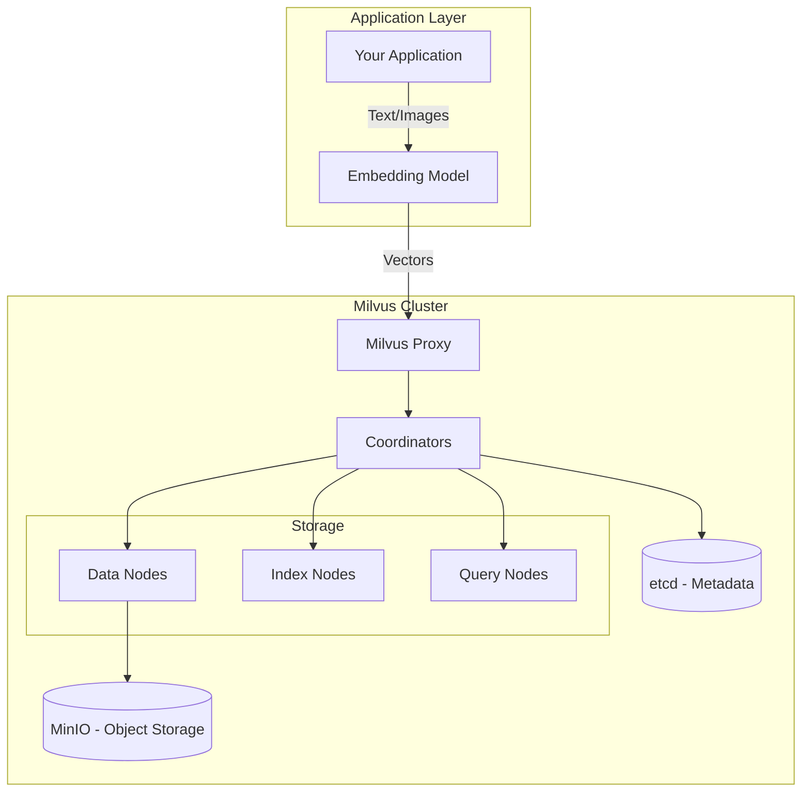
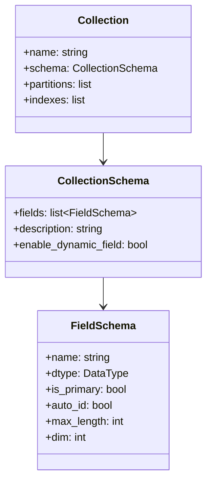
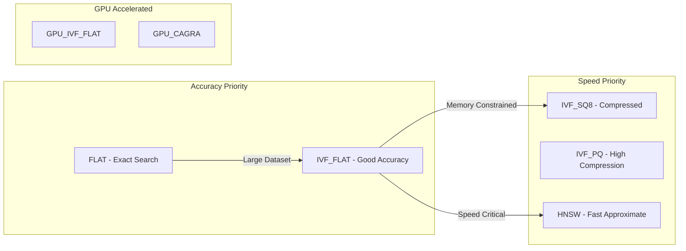
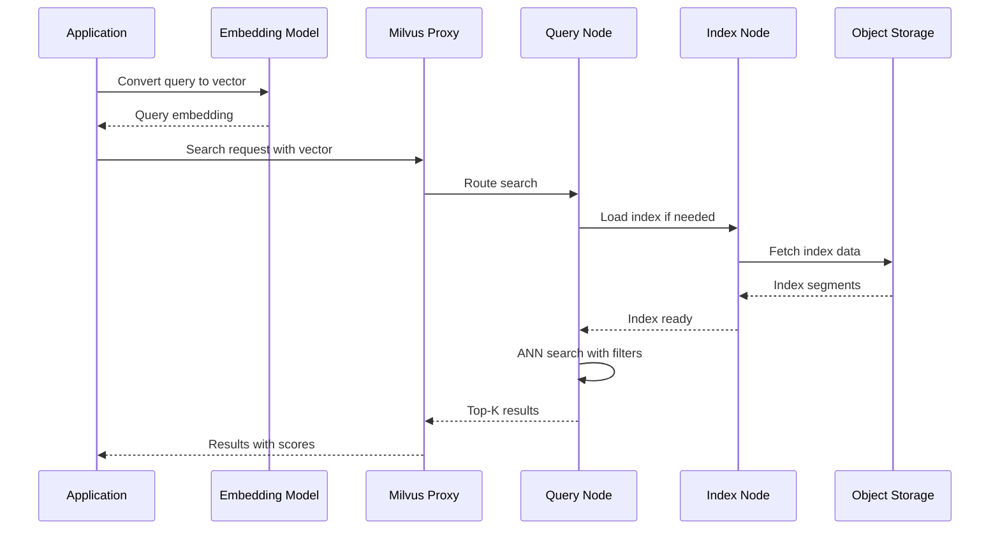

# How to Build Milvus Integration

Author: [nawazdhandala](https://github.com/nawazdhandala)

Tags: Milvus, Vector Database, Integration, Similarity Search

Description: Learn to integrate Milvus vector database with collection management, index configuration, and hybrid search capabilities for production AI applications.

---

## Introduction

Milvus is an open-source vector database designed for scalable similarity search and AI applications. Whether you are building a recommendation system, semantic search engine, or RAG (Retrieval-Augmented Generation) pipeline, Milvus provides the infrastructure to store, index, and query high-dimensional vectors efficiently.

This guide walks you through building a complete Milvus integration - from initial setup to production-ready search capabilities.

## Architecture Overview

Before diving into code, let us understand how Milvus fits into a typical AI application architecture.



## Setting Up the Development Environment

### Prerequisites

Install the Milvus Python SDK and supporting libraries:

```bash
pip install pymilvus==2.4.0
pip install numpy
```

### Connecting to Milvus

Start by establishing a connection to your Milvus instance:

```python
from pymilvus import connections, utility

def connect_to_milvus(
    host: str = "localhost",
    port: str = "19530",
    alias: str = "default"
) -> None:
    """
    Establish connection to Milvus server.

    Args:
        host: Milvus server hostname
        port: Milvus server port
        alias: Connection alias for managing multiple connections
    """
    connections.connect(
        alias=alias,
        host=host,
        port=port,
        # For production with authentication:
        # user="username",
        # password="password",
        # secure=True
    )

    # Verify connection
    if utility.get_server_version():
        print(f"Connected to Milvus server at {host}:{port}")
    else:
        raise ConnectionError("Failed to connect to Milvus")

# Usage
connect_to_milvus()
```

## Schema Design and Collection Creation

A well-designed schema is critical for efficient vector search. Milvus collections consist of fields that define the structure of your data.

### Understanding Field Types



### Creating a Collection

Here is a complete example for creating a document embedding collection:

```python
from pymilvus import (
    Collection,
    CollectionSchema,
    FieldSchema,
    DataType,
    utility
)

def create_document_collection(
    collection_name: str,
    vector_dim: int = 1536,  # OpenAI ada-002 dimension
    max_text_length: int = 65535
) -> Collection:
    """
    Create a collection for storing document embeddings.

    Args:
        collection_name: Name of the collection to create
        vector_dim: Dimension of embedding vectors
        max_text_length: Maximum length for text fields

    Returns:
        Collection object ready for data insertion
    """
    # Check if collection already exists
    if utility.has_collection(collection_name):
        print(f"Collection {collection_name} already exists")
        return Collection(collection_name)

    # Define schema fields
    fields = [
        FieldSchema(
            name="id",
            dtype=DataType.INT64,
            is_primary=True,
            auto_id=True,
            description="Primary key"
        ),
        FieldSchema(
            name="document_id",
            dtype=DataType.VARCHAR,
            max_length=256,
            description="External document identifier"
        ),
        FieldSchema(
            name="content",
            dtype=DataType.VARCHAR,
            max_length=max_text_length,
            description="Document text content"
        ),
        FieldSchema(
            name="embedding",
            dtype=DataType.FLOAT_VECTOR,
            dim=vector_dim,
            description="Document embedding vector"
        ),
        FieldSchema(
            name="metadata",
            dtype=DataType.JSON,
            description="Additional metadata as JSON"
        ),
        FieldSchema(
            name="created_at",
            dtype=DataType.INT64,
            description="Creation timestamp"
        )
    ]

    # Create schema
    schema = CollectionSchema(
        fields=fields,
        description="Document embeddings for semantic search",
        enable_dynamic_field=True  # Allow additional fields
    )

    # Create collection
    collection = Collection(
        name=collection_name,
        schema=schema,
        using="default",  # Connection alias
        consistency_level="Strong"  # Options: Strong, Bounded, Session, Eventually
    )

    print(f"Created collection: {collection_name}")
    return collection

# Usage
collection = create_document_collection("documents")
```

## Index Configuration

Indexes are essential for efficient similarity search. Milvus supports multiple index types optimized for different use cases.

### Index Type Comparison



### Creating Indexes

```python
from pymilvus import Collection

def create_vector_index(
    collection: Collection,
    field_name: str = "embedding",
    index_type: str = "HNSW",
    metric_type: str = "COSINE"
) -> None:
    """
    Create an index on a vector field for efficient similarity search.

    Args:
        collection: Milvus collection object
        field_name: Name of the vector field to index
        index_type: Type of index (FLAT, IVF_FLAT, IVF_SQ8, HNSW, etc.)
        metric_type: Distance metric (L2, IP, COSINE)
    """
    # Index parameters based on type
    index_params = {
        "FLAT": {
            "index_type": "FLAT",
            "metric_type": metric_type,
            "params": {}
        },
        "IVF_FLAT": {
            "index_type": "IVF_FLAT",
            "metric_type": metric_type,
            "params": {
                "nlist": 1024  # Number of cluster units
            }
        },
        "IVF_SQ8": {
            "index_type": "IVF_SQ8",
            "metric_type": metric_type,
            "params": {
                "nlist": 1024
            }
        },
        "HNSW": {
            "index_type": "HNSW",
            "metric_type": metric_type,
            "params": {
                "M": 16,              # Max connections per layer
                "efConstruction": 256  # Search width during construction
            }
        }
    }

    if index_type not in index_params:
        raise ValueError(f"Unsupported index type: {index_type}")

    # Create the index
    collection.create_index(
        field_name=field_name,
        index_params=index_params[index_type]
    )

    print(f"Created {index_type} index on {field_name}")

    # Also create scalar indexes for filtering
    collection.create_index(
        field_name="document_id",
        index_params={"index_type": "Trie"}
    )

    print("Created scalar index on document_id")

# Usage
create_vector_index(collection, index_type="HNSW", metric_type="COSINE")
```

### Index Selection Guide

| Index Type | Best For | Memory Usage | Search Speed | Accuracy |
|------------|----------|--------------|--------------|----------|
| FLAT | Small datasets (less than 1M vectors) | High | Slow | 100% |
| IVF_FLAT | Medium datasets with good accuracy needs | Medium | Medium | High |
| IVF_SQ8 | Large datasets with memory constraints | Low | Fast | Good |
| HNSW | Production workloads needing speed | High | Very Fast | High |
| IVF_PQ | Very large datasets | Very Low | Fast | Moderate |

## Data Insertion

### Inserting Vectors

```python
import numpy as np
from typing import List, Dict, Any
from pymilvus import Collection
import time

def insert_documents(
    collection: Collection,
    documents: List[Dict[str, Any]],
    embedding_function: callable,
    batch_size: int = 1000
) -> List[int]:
    """
    Insert documents with their embeddings into Milvus.

    Args:
        collection: Target Milvus collection
        documents: List of document dictionaries with 'id', 'content', 'metadata'
        embedding_function: Function that converts text to embeddings
        batch_size: Number of documents to insert per batch

    Returns:
        List of inserted primary keys
    """
    all_pks = []

    for i in range(0, len(documents), batch_size):
        batch = documents[i:i + batch_size]

        # Prepare data for insertion
        data = {
            "document_id": [],
            "content": [],
            "embedding": [],
            "metadata": [],
            "created_at": []
        }

        # Generate embeddings for the batch
        contents = [doc["content"] for doc in batch]
        embeddings = embedding_function(contents)

        for j, doc in enumerate(batch):
            data["document_id"].append(doc["id"])
            data["content"].append(doc["content"])
            data["embedding"].append(embeddings[j])
            data["metadata"].append(doc.get("metadata", {}))
            data["created_at"].append(int(time.time()))

        # Insert batch
        insert_result = collection.insert(data)
        all_pks.extend(insert_result.primary_keys)

        print(f"Inserted batch {i // batch_size + 1}, total: {len(all_pks)}")

    # Flush to ensure data is persisted
    collection.flush()
    print(f"Flushed {len(all_pks)} entities to storage")

    return all_pks

# Example embedding function (replace with your model)
def mock_embedding_function(texts: List[str]) -> List[List[float]]:
    """Generate mock embeddings for demonstration."""
    return [np.random.rand(1536).tolist() for _ in texts]

# Usage example
documents = [
    {
        "id": "doc-001",
        "content": "Introduction to vector databases and their applications.",
        "metadata": {"category": "tutorial", "author": "team"}
    },
    {
        "id": "doc-002",
        "content": "Building scalable search systems with Milvus.",
        "metadata": {"category": "guide", "author": "team"}
    }
]

# Load collection before insertion
collection.load()
pks = insert_documents(collection, documents, mock_embedding_function)
```

## Search Queries

### Basic Vector Search

```python
from pymilvus import Collection
from typing import List, Dict, Any

def vector_search(
    collection: Collection,
    query_vectors: List[List[float]],
    top_k: int = 10,
    output_fields: List[str] = None
) -> List[List[Dict[str, Any]]]:
    """
    Perform basic vector similarity search.

    Args:
        collection: Milvus collection to search
        query_vectors: List of query embedding vectors
        top_k: Number of results to return per query
        output_fields: Fields to include in results

    Returns:
        Search results with distances and requested fields
    """
    if output_fields is None:
        output_fields = ["document_id", "content", "metadata"]

    # Search parameters depend on index type
    search_params = {
        "metric_type": "COSINE",
        "params": {
            "ef": 64  # HNSW search width - higher means more accurate but slower
        }
    }

    results = collection.search(
        data=query_vectors,
        anns_field="embedding",
        param=search_params,
        limit=top_k,
        output_fields=output_fields
    )

    # Format results
    formatted_results = []
    for hits in results:
        query_results = []
        for hit in hits:
            query_results.append({
                "id": hit.id,
                "distance": hit.distance,
                "score": 1 - hit.distance,  # Convert distance to similarity score
                **{field: hit.entity.get(field) for field in output_fields}
            })
        formatted_results.append(query_results)

    return formatted_results

# Usage
query_embedding = mock_embedding_function(["How do vector databases work?"])[0]
results = vector_search(collection, [query_embedding], top_k=5)

for result in results[0]:
    print(f"Score: {result['score']:.4f} - {result['document_id']}")
```

### Filtered Search with Boolean Expressions

```python
def filtered_search(
    collection: Collection,
    query_vector: List[float],
    filter_expression: str,
    top_k: int = 10
) -> List[Dict[str, Any]]:
    """
    Perform vector search with scalar filtering.

    Args:
        collection: Milvus collection to search
        query_vector: Query embedding vector
        filter_expression: Boolean filter expression
        top_k: Number of results to return

    Returns:
        Filtered search results
    """
    search_params = {
        "metric_type": "COSINE",
        "params": {"ef": 64}
    }

    results = collection.search(
        data=[query_vector],
        anns_field="embedding",
        param=search_params,
        limit=top_k,
        expr=filter_expression,  # Apply filter
        output_fields=["document_id", "content", "metadata", "created_at"]
    )

    return [
        {
            "id": hit.id,
            "score": 1 - hit.distance,
            "document_id": hit.entity.get("document_id"),
            "content": hit.entity.get("content"),
            "metadata": hit.entity.get("metadata")
        }
        for hit in results[0]
    ]

# Filter expression examples
# By document ID prefix
results = filtered_search(
    collection,
    query_embedding,
    filter_expression='document_id like "doc-%"'
)

# By timestamp range
one_day_ago = int(time.time()) - 86400
results = filtered_search(
    collection,
    query_embedding,
    filter_expression=f'created_at > {one_day_ago}'
)

# By JSON metadata field
results = filtered_search(
    collection,
    query_embedding,
    filter_expression='metadata["category"] == "tutorial"'
)

# Combined filters
results = filtered_search(
    collection,
    query_embedding,
    filter_expression='metadata["category"] == "tutorial" and created_at > 1704067200'
)
```

### Hybrid Search with Multiple Vectors

Milvus 2.4+ supports hybrid search combining multiple vector fields or search strategies:

```python
from pymilvus import AnnSearchRequest, RRFRanker, WeightedRanker

def hybrid_search(
    collection: Collection,
    dense_vector: List[float],
    sparse_vector: Dict[int, float],  # For sparse embeddings like BM25
    top_k: int = 10,
    dense_weight: float = 0.7,
    sparse_weight: float = 0.3
) -> List[Dict[str, Any]]:
    """
    Perform hybrid search combining dense and sparse vectors.

    Args:
        collection: Milvus collection with both dense and sparse vector fields
        dense_vector: Dense embedding vector
        sparse_vector: Sparse vector as dict of index to value
        top_k: Number of results to return
        dense_weight: Weight for dense vector results
        sparse_weight: Weight for sparse vector results

    Returns:
        Hybrid search results
    """
    # Dense vector search request
    dense_req = AnnSearchRequest(
        data=[dense_vector],
        anns_field="embedding",
        param={"metric_type": "COSINE", "params": {"ef": 64}},
        limit=top_k
    )

    # Sparse vector search request
    sparse_req = AnnSearchRequest(
        data=[sparse_vector],
        anns_field="sparse_embedding",
        param={"metric_type": "IP"},
        limit=top_k
    )

    # Use weighted ranker to combine results
    ranker = WeightedRanker(dense_weight, sparse_weight)
    # Alternative: Use RRF (Reciprocal Rank Fusion)
    # ranker = RRFRanker(k=60)

    results = collection.hybrid_search(
        reqs=[dense_req, sparse_req],
        ranker=ranker,
        limit=top_k,
        output_fields=["document_id", "content"]
    )

    return [
        {
            "id": hit.id,
            "score": hit.score,
            "document_id": hit.entity.get("document_id"),
            "content": hit.entity.get("content")
        }
        for hit in results[0]
    ]
```

## Search Flow Visualization



## Performance Tuning

### Collection and Index Optimization

```python
def optimize_collection(collection: Collection) -> None:
    """
    Apply performance optimizations to a collection.
    """
    # Compact segments to improve query performance
    collection.compact()

    # Wait for compaction to complete
    collection.wait_for_compaction_completed()

    print("Collection compacted successfully")

def configure_search_params(index_type: str, accuracy_priority: bool = False) -> dict:
    """
    Get optimized search parameters based on requirements.

    Args:
        index_type: The index type used in the collection
        accuracy_priority: If True, optimize for accuracy over speed

    Returns:
        Search parameters dictionary
    """
    params = {
        "FLAT": {
            "metric_type": "COSINE",
            "params": {}
        },
        "IVF_FLAT": {
            "metric_type": "COSINE",
            "params": {
                "nprobe": 64 if accuracy_priority else 16  # Clusters to search
            }
        },
        "IVF_SQ8": {
            "metric_type": "COSINE",
            "params": {
                "nprobe": 64 if accuracy_priority else 16
            }
        },
        "HNSW": {
            "metric_type": "COSINE",
            "params": {
                "ef": 256 if accuracy_priority else 64  # Search width
            }
        }
    }

    return params.get(index_type, params["HNSW"])
```

### Resource Management

```python
from pymilvus import Collection, utility
from contextlib import contextmanager

@contextmanager
def managed_collection(collection_name: str):
    """
    Context manager for proper collection resource management.

    Usage:
        with managed_collection("my_collection") as collection:
            # Perform operations
            results = collection.search(...)
    """
    collection = Collection(collection_name)

    try:
        # Load collection into memory for searching
        collection.load()
        yield collection
    finally:
        # Release resources when done
        collection.release()
        print(f"Released collection: {collection_name}")

# Usage
with managed_collection("documents") as collection:
    results = collection.search(
        data=[query_embedding],
        anns_field="embedding",
        param={"metric_type": "COSINE", "params": {"ef": 64}},
        limit=10
    )
```

### Performance Tuning Parameters

| Parameter | Description | Trade-off |
|-----------|-------------|-----------|
| nlist (IVF indexes) | Number of clusters | Higher = better accuracy, slower indexing |
| nprobe (IVF search) | Clusters to search | Higher = better accuracy, slower search |
| M (HNSW) | Max connections per node | Higher = better accuracy, more memory |
| efConstruction (HNSW) | Build-time search width | Higher = better accuracy, slower indexing |
| ef (HNSW search) | Query-time search width | Higher = better accuracy, slower search |

## Production Best Practices

### 1. Connection Pooling

```python
from pymilvus import connections
import threading

class MilvusConnectionPool:
    """Thread-safe connection pool for Milvus."""

    _lock = threading.Lock()
    _connections = {}

    @classmethod
    def get_connection(cls, alias: str = "default", **kwargs) -> str:
        """Get or create a connection with the given alias."""
        with cls._lock:
            if alias not in cls._connections:
                connections.connect(alias=alias, **kwargs)
                cls._connections[alias] = True
            return alias

    @classmethod
    def close_all(cls):
        """Close all connections."""
        with cls._lock:
            for alias in list(cls._connections.keys()):
                connections.disconnect(alias)
                del cls._connections[alias]
```

### 2. Error Handling

```python
from pymilvus.exceptions import (
    MilvusException,
    CollectionNotExistException,
    IndexNotExistException
)
import time

def robust_search(
    collection: Collection,
    query_vector: List[float],
    max_retries: int = 3,
    retry_delay: float = 1.0
) -> List[Dict[str, Any]]:
    """
    Perform search with automatic retry on transient failures.
    """
    last_exception = None

    for attempt in range(max_retries):
        try:
            results = collection.search(
                data=[query_vector],
                anns_field="embedding",
                param={"metric_type": "COSINE", "params": {"ef": 64}},
                limit=10,
                output_fields=["document_id", "content"]
            )
            return [{"id": hit.id, "score": 1 - hit.distance} for hit in results[0]]

        except CollectionNotExistException:
            raise  # Do not retry - collection does not exist

        except IndexNotExistException:
            raise  # Do not retry - index needs to be created

        except MilvusException as e:
            last_exception = e
            if attempt < max_retries - 1:
                time.sleep(retry_delay * (attempt + 1))
                continue

    raise last_exception
```

### 3. Monitoring Collection Health

```python
def get_collection_stats(collection_name: str) -> Dict[str, Any]:
    """
    Get comprehensive statistics about a collection.
    """
    collection = Collection(collection_name)

    stats = {
        "name": collection_name,
        "num_entities": collection.num_entities,
        "schema": {
            "fields": [
                {
                    "name": field.name,
                    "type": str(field.dtype),
                    "is_primary": field.is_primary
                }
                for field in collection.schema.fields
            ]
        },
        "indexes": [],
        "loaded": utility.load_state(collection_name).name
    }

    # Get index information
    for field in collection.schema.fields:
        if field.dtype in [DataType.FLOAT_VECTOR, DataType.BINARY_VECTOR]:
            index = collection.index(field.name)
            if index:
                stats["indexes"].append({
                    "field": field.name,
                    "type": index.params.get("index_type"),
                    "metric": index.params.get("metric_type")
                })

    return stats

# Usage
stats = get_collection_stats("documents")
print(f"Collection has {stats['num_entities']} entities")
print(f"Load state: {stats['loaded']}")
```

## Complete Integration Example

Here is a complete class that wraps all the functionality:

```python
from pymilvus import (
    connections, utility, Collection,
    CollectionSchema, FieldSchema, DataType
)
from typing import List, Dict, Any, Optional
import numpy as np
import time

class MilvusVectorStore:
    """
    Complete Milvus vector store integration for production use.
    """

    def __init__(
        self,
        collection_name: str,
        embedding_dim: int = 1536,
        host: str = "localhost",
        port: str = "19530"
    ):
        self.collection_name = collection_name
        self.embedding_dim = embedding_dim

        # Connect to Milvus
        connections.connect(host=host, port=port)

        # Initialize or load collection
        self.collection = self._init_collection()

    def _init_collection(self) -> Collection:
        """Initialize collection with schema and indexes."""
        if utility.has_collection(self.collection_name):
            return Collection(self.collection_name)

        # Create schema
        schema = CollectionSchema(
            fields=[
                FieldSchema("id", DataType.INT64, is_primary=True, auto_id=True),
                FieldSchema("doc_id", DataType.VARCHAR, max_length=256),
                FieldSchema("content", DataType.VARCHAR, max_length=65535),
                FieldSchema("embedding", DataType.FLOAT_VECTOR, dim=self.embedding_dim),
                FieldSchema("metadata", DataType.JSON)
            ],
            enable_dynamic_field=True
        )

        collection = Collection(self.collection_name, schema)

        # Create indexes
        collection.create_index(
            "embedding",
            {
                "index_type": "HNSW",
                "metric_type": "COSINE",
                "params": {"M": 16, "efConstruction": 256}
            }
        )

        return collection

    def add_documents(
        self,
        documents: List[Dict[str, Any]],
        embeddings: List[List[float]]
    ) -> List[int]:
        """Add documents with pre-computed embeddings."""
        data = {
            "doc_id": [d["id"] for d in documents],
            "content": [d["content"] for d in documents],
            "embedding": embeddings,
            "metadata": [d.get("metadata", {}) for d in documents]
        }

        result = self.collection.insert(data)
        self.collection.flush()
        return result.primary_keys

    def search(
        self,
        query_embedding: List[float],
        top_k: int = 10,
        filter_expr: Optional[str] = None
    ) -> List[Dict[str, Any]]:
        """Search for similar documents."""
        self.collection.load()

        results = self.collection.search(
            data=[query_embedding],
            anns_field="embedding",
            param={"metric_type": "COSINE", "params": {"ef": 64}},
            limit=top_k,
            expr=filter_expr,
            output_fields=["doc_id", "content", "metadata"]
        )

        return [
            {
                "id": hit.entity.get("doc_id"),
                "content": hit.entity.get("content"),
                "metadata": hit.entity.get("metadata"),
                "score": 1 - hit.distance
            }
            for hit in results[0]
        ]

    def delete_by_ids(self, doc_ids: List[str]) -> None:
        """Delete documents by their external IDs."""
        expr = f'doc_id in {doc_ids}'
        self.collection.delete(expr)
        self.collection.flush()

    def close(self) -> None:
        """Release resources and disconnect."""
        self.collection.release()
        connections.disconnect("default")

# Usage example
store = MilvusVectorStore("my_documents")

# Add documents
docs = [
    {"id": "doc1", "content": "Hello world", "metadata": {"source": "test"}},
    {"id": "doc2", "content": "Vector databases", "metadata": {"source": "test"}}
]
embeddings = [np.random.rand(1536).tolist() for _ in docs]
store.add_documents(docs, embeddings)

# Search
query_emb = np.random.rand(1536).tolist()
results = store.search(query_emb, top_k=5)

# Cleanup
store.close()
```

## Conclusion

Building a robust Milvus integration involves understanding schema design, index selection, and search optimization. Key takeaways:

1. **Schema Design** - Plan your fields carefully, including metadata for filtering
2. **Index Selection** - Choose HNSW for most production workloads, IVF variants for memory constraints
3. **Search Tuning** - Adjust ef/nprobe based on accuracy vs speed requirements
4. **Resource Management** - Always release collections when not in use
5. **Error Handling** - Implement retries for transient failures

With these building blocks, you can create powerful vector search applications that scale from prototypes to production workloads handling millions of vectors.

## Further Reading

- [Milvus Official Documentation](https://milvus.io/docs)
- [PyMilvus API Reference](https://milvus.io/api-reference/pymilvus/v2.4.x/About.md)
- [Milvus Performance Tuning Guide](https://milvus.io/docs/performance_faq.md)
- [Vector Index Algorithm Comparison](https://milvus.io/docs/index.md)
