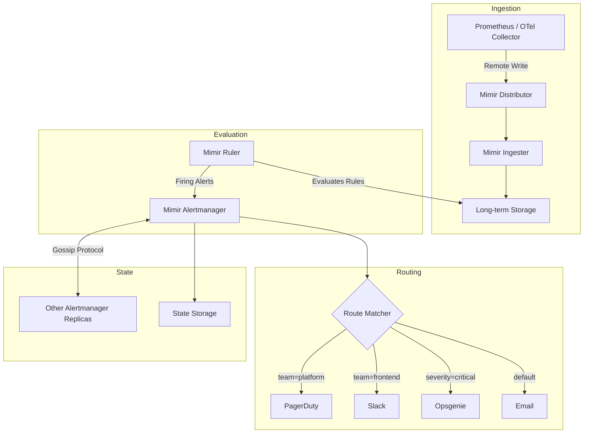
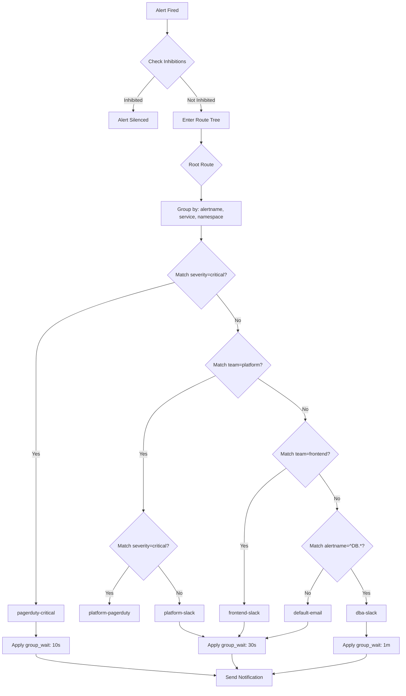
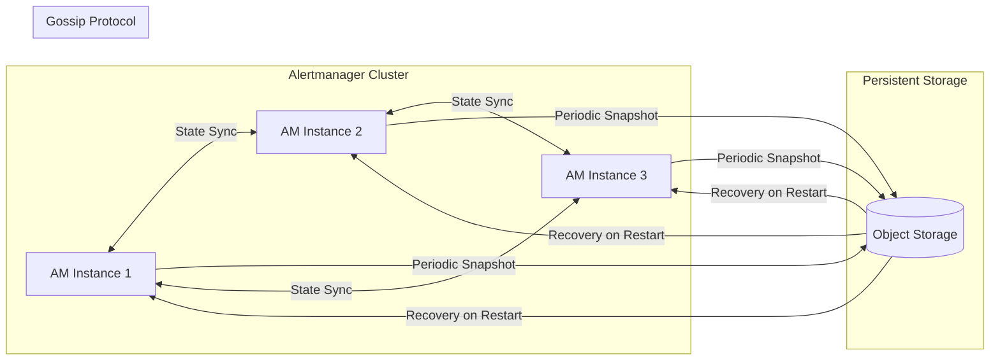

# How to Create Mimir Alertmanager Configuration

Author: [nawazdhandala](https://github.com/nawazdhandala)

Tags: Mimir, Prometheus, Observability, Alerting

Description: A comprehensive guide to configuring Mimir Alertmanager for scalable, multi-tenant alert routing with practical examples and best practices.

---

Grafana Mimir brings horizontally scalable, multi-tenant metrics storage to the Prometheus ecosystem. One of its most powerful components is the built-in Alertmanager, which handles alert routing, grouping, inhibition, and notification delivery at scale. Unlike standalone Alertmanager, Mimir's implementation supports multi-tenancy out of the box, allowing you to run a single alerting infrastructure for hundreds of teams.

This guide walks you through configuring Mimir Alertmanager from the ground up, covering component settings, multi-tenant configuration, notification templates, state persistence, and practical code examples you can adapt to your environment.

## Understanding Mimir Alertmanager Architecture

Before diving into configuration, let's understand how alerts flow through Mimir:



The Ruler component evaluates alerting rules against stored metrics. When conditions are met, it fires alerts to the Alertmanager. The Alertmanager then deduplicates, groups, and routes alerts to the appropriate receivers based on your configuration.

## Alertmanager Component Settings

The Alertmanager in Mimir is configured through two layers: runtime configuration (for the component itself) and per-tenant configuration (for alert routing).

### Runtime Configuration

Configure the Alertmanager component in your Mimir configuration file:

```yaml
# mimir-config.yaml
# Alertmanager component configuration

alertmanager:
  # Enable the alertmanager component
  enabled: true

  # Data directory for local state
  data_dir: /data/alertmanager

  # How often to poll for updated alertmanager configs
  poll_interval: 15s

  # Maximum size of an alertmanager config file
  max_config_size_bytes: 1048576  # 1MB

  # Enable API to accept configuration via HTTP
  enable_api: true

  # External URL for links in notifications
  external_url: https://alertmanager.example.com

  # Sharding configuration for HA
  sharding_ring:
    # Key-value store for ring
    kvstore:
      store: consul
      consul:
        host: consul.example.com:8500
    # Replication factor for alert state
    replication_factor: 3
    # Heartbeat interval
    heartbeat_period: 15s
    # Timeout for ring heartbeats
    heartbeat_timeout: 1m

  # Cluster configuration for gossip
  cluster:
    # Peers to join (for gossip)
    peers: alertmanager-0:9094,alertmanager-1:9094,alertmanager-2:9094
    # Port for cluster communication
    listen_address: 0.0.0.0:9094

  # Persist notification state to object storage
  persist_interval: 15m

  # Retention for alert state
  retention: 120h
```

### Storage Backend Configuration

Mimir Alertmanager stores tenant configurations and state in object storage:

```yaml
# Object storage for alertmanager state and configs
alertmanager_storage:
  backend: s3
  s3:
    bucket_name: mimir-alertmanager
    endpoint: s3.amazonaws.com
    region: us-east-1
    access_key_id: ${AWS_ACCESS_KEY_ID}
    secret_access_key: ${AWS_SECRET_ACCESS_KEY}

  # Alternative: Use filesystem for development
  # backend: filesystem
  # filesystem:
  #   dir: /data/alertmanager-configs
```

## Multi-Tenant Alertmanager Configuration

Mimir's multi-tenancy allows each tenant to have their own alerting configuration. Tenants are identified by the `X-Scope-OrgID` header in requests.

### Per-Tenant Configuration Structure

Each tenant uploads their own Alertmanager configuration:

```yaml
# tenant-config.yaml
# This configuration is uploaded per-tenant via the API

# Global settings applied to all routes
global:
  # SMTP configuration for email notifications
  smtp_smarthost: smtp.example.com:587
  smtp_from: alertmanager@example.com
  smtp_auth_username: alertmanager
  smtp_auth_password: ${SMTP_PASSWORD}
  smtp_require_tls: true

  # Default Slack API URL (can be overridden per receiver)
  slack_api_url: https://hooks.slack.com/services/XXX/YYY/ZZZ

  # Resolve timeout: how long to wait before marking alert resolved
  resolve_timeout: 5m

# Inhibition rules: suppress alerts based on other firing alerts
inhibit_rules:
  # If a critical alert fires, suppress warning alerts for same service
  - source_match:
      severity: critical
    target_match:
      severity: warning
    # Only inhibit if these labels match
    equal:
      - alertname
      - service
      - namespace

  # Suppress all alerts if cluster is in maintenance
  - source_match:
      alertname: ClusterMaintenance
    target_match_re:
      severity: .*
    equal:
      - cluster

# Route tree: determines how alerts are routed to receivers
route:
  # Default receiver if no child routes match
  receiver: default-email

  # How long to wait before sending initial notification
  group_wait: 30s

  # How long to wait before sending notifications about new alerts in a group
  group_interval: 5m

  # How long to wait before resending a notification
  repeat_interval: 4h

  # Labels used to group alerts together
  group_by:
    - alertname
    - service
    - namespace

  # Child routes (evaluated in order, first match wins)
  routes:
    # Critical alerts go to PagerDuty immediately
    - match:
        severity: critical
      receiver: pagerduty-critical
      group_wait: 10s
      repeat_interval: 1h
      continue: false  # Stop processing after match

    # Platform team alerts
    - match:
        team: platform
      receiver: platform-slack
      routes:
        # Platform critical also pages
        - match:
            severity: critical
          receiver: platform-pagerduty

    # Frontend team alerts
    - match:
        team: frontend
      receiver: frontend-slack

    # Database alerts with special grouping
    - match_re:
        alertname: ^(Postgres|MySQL|Redis).*
      receiver: dba-slack
      group_by:
        - alertname
        - db_instance
      group_wait: 1m

# Receiver definitions
receivers:
  - name: default-email
    email_configs:
      - to: oncall@example.com
        send_resolved: true

  - name: pagerduty-critical
    pagerduty_configs:
      - routing_key: ${PAGERDUTY_ROUTING_KEY}
        severity: critical
        description: '{{ template "pagerduty.description" . }}'
        details:
          firing: '{{ template "pagerduty.firing" . }}'
          num_firing: '{{ .Alerts.Firing | len }}'
          num_resolved: '{{ .Alerts.Resolved | len }}'

  - name: platform-slack
    slack_configs:
      - channel: '#platform-alerts'
        send_resolved: true
        title: '{{ template "slack.title" . }}'
        text: '{{ template "slack.text" . }}'
        color: '{{ template "slack.color" . }}'

  - name: platform-pagerduty
    pagerduty_configs:
      - routing_key: ${PLATFORM_PAGERDUTY_KEY}
        severity: '{{ if eq .CommonLabels.severity "critical" }}critical{{ else }}warning{{ end }}'

  - name: frontend-slack
    slack_configs:
      - channel: '#frontend-alerts'
        send_resolved: true
        username: AlertBot
        icon_emoji: ':warning:'

  - name: dba-slack
    slack_configs:
      - channel: '#dba-oncall'
        send_resolved: true
    webhook_configs:
      - url: https://db-incident-tracker.example.com/webhook
        send_resolved: true
```

### Uploading Tenant Configuration

Use the Mimir Alertmanager API to upload configurations:

```bash
#!/bin/bash
# upload-alertmanager-config.sh
# Upload Alertmanager configuration for a specific tenant

MIMIR_URL="https://mimir.example.com"
TENANT_ID="my-tenant"
CONFIG_FILE="tenant-config.yaml"

# Upload the configuration
curl -X POST "${MIMIR_URL}/api/v1/alerts" \
  -H "X-Scope-OrgID: ${TENANT_ID}" \
  -H "Content-Type: application/yaml" \
  --data-binary @"${CONFIG_FILE}"

# Verify the configuration was accepted
curl -X GET "${MIMIR_URL}/api/v1/alerts" \
  -H "X-Scope-OrgID: ${TENANT_ID}"
```

## Alert Routing Flow Diagram

Here's a detailed view of how a single alert flows through the routing tree:



## Notification Templates

Custom templates let you control exactly what appears in notifications. Store templates alongside your configuration:

```yaml
# templates.yaml
# Custom notification templates for Alertmanager

templates:
  - '/etc/alertmanager/templates/*.tmpl'
```

Create template files:

```go
{{/* slack.tmpl - Slack notification templates */}}

{{/* Title template for Slack messages */}}
{{ define "slack.title" -}}
[{{ .Status | toUpper }}{{ if eq .Status "firing" }}:{{ .Alerts.Firing | len }}{{ end }}] {{ .CommonLabels.alertname }}
{{- end }}

{{/* Color based on severity */}}
{{ define "slack.color" -}}
{{ if eq .Status "firing" -}}
  {{ if eq .CommonLabels.severity "critical" -}}
    danger
  {{- else if eq .CommonLabels.severity "warning" -}}
    warning
  {{- else -}}
    #439FE0
  {{- end -}}
{{- else -}}
  good
{{- end }}
{{- end }}

{{/* Main text body for Slack */}}
{{ define "slack.text" -}}
{{ range .Alerts }}
*Alert:* {{ .Labels.alertname }}
*Severity:* {{ .Labels.severity }}
*Service:* {{ .Labels.service | default "unknown" }}
*Namespace:* {{ .Labels.namespace | default "unknown" }}
{{ if .Annotations.summary }}*Summary:* {{ .Annotations.summary }}{{ end }}
{{ if .Annotations.description }}*Description:* {{ .Annotations.description }}{{ end }}
{{ if .Annotations.runbook_url }}*Runbook:* {{ .Annotations.runbook_url }}{{ end }}
*Started:* {{ .StartsAt.Format "2006-01-02 15:04:05 MST" }}
{{ if .EndsAt }}*Ended:* {{ .EndsAt.Format "2006-01-02 15:04:05 MST" }}{{ end }}
---
{{ end }}
{{- end }}
```

```go
{{/* pagerduty.tmpl - PagerDuty notification templates */}}

{{/* Description for PagerDuty incidents */}}
{{ define "pagerduty.description" -}}
{{ if gt (len .Alerts.Firing) 0 -}}
{{ range .Alerts.Firing -}}
{{ .Labels.alertname }}: {{ .Annotations.summary }}
{{ end -}}
{{- else -}}
All alerts resolved
{{- end }}
{{- end }}

{{/* Firing alerts details */}}
{{ define "pagerduty.firing" -}}
{{ range .Alerts.Firing -}}
Alert: {{ .Labels.alertname }}
Severity: {{ .Labels.severity }}
Service: {{ .Labels.service }}
Summary: {{ .Annotations.summary }}
Started: {{ .StartsAt.Format "2006-01-02 15:04:05 MST" }}
{{ end -}}
{{- end }}
```

```go
{{/* email.tmpl - Email notification templates */}}

{{ define "email.subject" -}}
[{{ .Status | toUpper }}] {{ .GroupLabels.alertname }} - {{ .CommonLabels.service }}
{{- end }}

{{ define "email.body" -}}
<!DOCTYPE html>
<html>
<head>
  <style>
    body { font-family: Arial, sans-serif; }
    .alert { padding: 10px; margin: 10px 0; border-left: 4px solid; }
    .critical { border-color: #d32f2f; background: #ffebee; }
    .warning { border-color: #ffa000; background: #fff8e1; }
    .resolved { border-color: #388e3c; background: #e8f5e9; }
    table { border-collapse: collapse; width: 100%; }
    th, td { text-align: left; padding: 8px; border-bottom: 1px solid #ddd; }
  </style>
</head>
<body>
  <h2>Alert Notification</h2>
  <p>Status: <strong>{{ .Status | toUpper }}</strong></p>

  {{ if gt (len .Alerts.Firing) 0 }}
  <h3>Firing Alerts ({{ .Alerts.Firing | len }})</h3>
  {{ range .Alerts.Firing }}
  <div class="alert {{ .Labels.severity }}">
    <strong>{{ .Labels.alertname }}</strong><br/>
    <table>
      <tr><td>Severity</td><td>{{ .Labels.severity }}</td></tr>
      <tr><td>Service</td><td>{{ .Labels.service }}</td></tr>
      <tr><td>Summary</td><td>{{ .Annotations.summary }}</td></tr>
      <tr><td>Started</td><td>{{ .StartsAt.Format "2006-01-02 15:04:05 MST" }}</td></tr>
    </table>
  </div>
  {{ end }}
  {{ end }}

  {{ if gt (len .Alerts.Resolved) 0 }}
  <h3>Resolved Alerts ({{ .Alerts.Resolved | len }})</h3>
  {{ range .Alerts.Resolved }}
  <div class="alert resolved">
    <strong>{{ .Labels.alertname }}</strong> - Resolved at {{ .EndsAt.Format "2006-01-02 15:04:05 MST" }}
  </div>
  {{ end }}
  {{ end }}
</body>
</html>
{{- end }}
```

## State Persistence and Replication

Mimir Alertmanager maintains state for:
- Notification history (to avoid duplicate sends)
- Silence definitions
- Alert group state

### Configuring State Replication

For high availability, configure state replication across Alertmanager instances:

```yaml
# High availability configuration
alertmanager:
  sharding_ring:
    kvstore:
      store: memberlist  # Use memberlist for simpler deployments
    replication_factor: 3
    heartbeat_period: 15s
    heartbeat_timeout: 1m

  # Cluster peers for gossip protocol
  cluster:
    # Automatically discover peers via DNS
    peers_pattern: alertmanager-*.alertmanager-headless.mimir.svc.cluster.local:9094

  # Fallback configuration if sharding is disabled
  fallback_config_file: /etc/alertmanager/fallback.yaml

  # State persistence to object storage
  persist_interval: 15m
```

### State Storage Flow



### Managing Silences

Create and manage silences programmatically:

```bash
#!/bin/bash
# create-silence.sh
# Create a silence for planned maintenance

MIMIR_URL="https://mimir.example.com"
TENANT_ID="my-tenant"

# Silence all alerts for a specific service during maintenance
curl -X POST "${MIMIR_URL}/alertmanager/api/v2/silences" \
  -H "X-Scope-OrgID: ${TENANT_ID}" \
  -H "Content-Type: application/json" \
  -d '{
    "matchers": [
      {
        "name": "service",
        "value": "payment-gateway",
        "isRegex": false
      }
    ],
    "startsAt": "2026-01-30T22:00:00Z",
    "endsAt": "2026-01-31T02:00:00Z",
    "createdBy": "platform-team",
    "comment": "Scheduled maintenance window for payment gateway upgrade"
  }'
```

## Practical Examples

### Example 1: Complete Multi-Team Setup

Here's a full configuration for an organization with multiple teams:

```yaml
# production-alertmanager.yaml
# Complete multi-team Alertmanager configuration

global:
  smtp_smarthost: smtp.sendgrid.net:587
  smtp_from: alerts@example.com
  smtp_auth_username: apikey
  smtp_auth_password: ${SENDGRID_API_KEY}
  slack_api_url: ${SLACK_WEBHOOK_URL}
  pagerduty_url: https://events.pagerduty.com/v2/enqueue
  resolve_timeout: 5m

# Templates for notifications
templates:
  - /etc/alertmanager/templates/*.tmpl

# Inhibition rules
inhibit_rules:
  # Critical inhibits warning for same alert
  - source_match:
      severity: critical
    target_match:
      severity: warning
    equal: [alertname, service]

  # Cluster down inhibits individual node alerts
  - source_match:
      alertname: KubernetesClusterDown
    target_match_re:
      alertname: ^Kubernetes.*
    equal: [cluster]

  # During maintenance, suppress non-critical alerts
  - source_match:
      alertname: PlannedMaintenance
    target_match_re:
      severity: (info|warning)
    equal: [environment]

# Routing configuration
route:
  receiver: default-notifications
  group_by: [alertname, cluster, service]
  group_wait: 30s
  group_interval: 5m
  repeat_interval: 4h

  routes:
    # Infrastructure alerts - highest priority
    - match:
        category: infrastructure
      receiver: infrastructure-team
      group_wait: 10s
      routes:
        - match:
            severity: critical
          receiver: infrastructure-pagerduty
          repeat_interval: 30m

    # Application alerts by team
    - match:
        team: payments
      receiver: payments-slack
      routes:
        - match:
            severity: critical
          receiver: payments-pagerduty
        - match:
            severity: warning
          receiver: payments-slack

    - match:
        team: checkout
      receiver: checkout-slack
      routes:
        - match:
            severity: critical
          receiver: checkout-pagerduty

    - match:
        team: data-platform
      receiver: data-platform-slack
      group_by: [alertname, pipeline, dataset]
      routes:
        - match:
            severity: critical
          receiver: data-platform-pagerduty

    # Security alerts - always escalate
    - match:
        category: security
      receiver: security-pagerduty
      group_wait: 0s
      repeat_interval: 15m

    # Cost alerts - daily digest
    - match:
        category: cost
      receiver: finops-email
      group_interval: 24h
      repeat_interval: 24h

# Receiver definitions
receivers:
  - name: default-notifications
    email_configs:
      - to: oncall@example.com
        send_resolved: true
        html: '{{ template "email.body" . }}'
        headers:
          Subject: '{{ template "email.subject" . }}'

  - name: infrastructure-team
    slack_configs:
      - channel: '#infra-alerts'
        send_resolved: true
        title: '{{ template "slack.title" . }}'
        text: '{{ template "slack.text" . }}'
        color: '{{ template "slack.color" . }}'
        actions:
          - type: button
            text: 'View Runbook'
            url: '{{ (index .Alerts 0).Annotations.runbook_url }}'
          - type: button
            text: 'Silence 1h'
            url: '{{ .ExternalURL }}/#/silences/new'

  - name: infrastructure-pagerduty
    pagerduty_configs:
      - routing_key: ${INFRA_PAGERDUTY_KEY}
        severity: '{{ .CommonLabels.severity }}'
        class: '{{ .CommonLabels.alertname }}'
        component: '{{ .CommonLabels.service }}'
        group: '{{ .CommonLabels.cluster }}'

  - name: payments-slack
    slack_configs:
      - channel: '#payments-alerts'
        send_resolved: true
        username: PaymentBot
        icon_emoji: ':credit_card:'

  - name: payments-pagerduty
    pagerduty_configs:
      - routing_key: ${PAYMENTS_PAGERDUTY_KEY}
        severity: critical

  - name: checkout-slack
    slack_configs:
      - channel: '#checkout-alerts'
        send_resolved: true

  - name: checkout-pagerduty
    pagerduty_configs:
      - routing_key: ${CHECKOUT_PAGERDUTY_KEY}
        severity: critical

  - name: data-platform-slack
    slack_configs:
      - channel: '#data-platform-alerts'
        send_resolved: true

  - name: data-platform-pagerduty
    pagerduty_configs:
      - routing_key: ${DATA_PAGERDUTY_KEY}
        severity: '{{ .CommonLabels.severity }}'

  - name: security-pagerduty
    pagerduty_configs:
      - routing_key: ${SECURITY_PAGERDUTY_KEY}
        severity: critical
    webhook_configs:
      - url: https://siem.example.com/alertmanager/webhook
        send_resolved: false

  - name: finops-email
    email_configs:
      - to: finops@example.com
        send_resolved: false
        html: '{{ template "email.cost-report" . }}'
```

### Example 2: Webhook Integration for Custom Actions

Configure webhooks to trigger automated remediation:

```yaml
# webhook-receiver.yaml
# Receiver with webhook for automated remediation

receivers:
  - name: auto-remediation
    webhook_configs:
      # Primary webhook for remediation system
      - url: https://remediation.example.com/api/v1/alerts
        send_resolved: true
        http_config:
          bearer_token: ${REMEDIATION_API_TOKEN}
          tls_config:
            insecure_skip_verify: false
        # Retry configuration
        max_alerts: 100

      # Backup webhook to incident management
      - url: https://incident.example.com/api/webhooks/alertmanager
        send_resolved: true
```

### Example 3: Testing Configuration Locally

Use `amtool` to validate your configuration before deploying:

```bash
#!/bin/bash
# validate-config.sh
# Validate Alertmanager configuration locally

CONFIG_FILE="tenant-config.yaml"

# Check configuration syntax
amtool check-config ${CONFIG_FILE}

# Test routing for a specific alert
amtool config routes test \
  --config.file=${CONFIG_FILE} \
  service=payment-gateway \
  severity=critical \
  team=payments

# Expected output:
# payments-pagerduty

# Test with different labels
amtool config routes test \
  --config.file=${CONFIG_FILE} \
  alertname=HighMemoryUsage \
  service=api-gateway \
  severity=warning \
  team=platform

# Expected output:
# platform-slack
```

## Best Practices

### 1. Design Your Routing Tree Thoughtfully

- Start with broad categories (team, severity, category)
- Use `continue: true` sparingly to avoid duplicate notifications
- Keep the tree depth manageable (3-4 levels maximum)
- Test every route path before deploying

### 2. Set Appropriate Timing Parameters

```yaml
# Timing recommendations by alert type
route:
  routes:
    # Critical: fast notification, frequent repeat
    - match:
        severity: critical
      group_wait: 10s      # Notify quickly
      group_interval: 1m   # Aggregate new alerts fast
      repeat_interval: 1h  # Re-page if unresolved

    # Warning: moderate timing
    - match:
        severity: warning
      group_wait: 30s
      group_interval: 5m
      repeat_interval: 4h

    # Info: relaxed timing
    - match:
        severity: info
      group_wait: 5m
      group_interval: 30m
      repeat_interval: 24h
```

### 3. Use Labels Consistently

Define standard labels across your alerting rules:

```yaml
# Standard labels to include in all alerts
# - severity: critical | warning | info
# - team: owning team name
# - service: service identifier
# - category: infrastructure | application | security | cost
# - environment: production | staging | development
```

### 4. Implement Escalation Paths

```yaml
# Multi-stage escalation example
route:
  routes:
    - match:
        severity: critical
      receiver: team-slack
      routes:
        # If not acknowledged in 15 minutes, page
        - match:
            escalation: page
          receiver: team-pagerduty
          repeat_interval: 15m
```

## Troubleshooting

Common issues and solutions:

| Problem | Symptom | Solution |
|---------|---------|----------|
| Alerts not routing | Wrong receiver notified | Use `amtool config routes test` to verify |
| Duplicate notifications | Same alert sent multiple times | Check `repeat_interval` and `group_interval` |
| Missing notifications | Alerts fire but no notification | Verify receiver configuration and credentials |
| State not persisting | Silences lost after restart | Check object storage configuration |
| High memory usage | Alertmanager OOM | Reduce `max_alerts` per notification batch |

## Conclusion

Mimir Alertmanager provides enterprise-grade alert routing for multi-tenant environments. The key to success is designing a clear routing hierarchy, using consistent labels, and testing your configuration thoroughly before deployment.

Start with a simple configuration and iterate. Use the `amtool` CLI to validate changes locally. Monitor your Alertmanager's own metrics to ensure it's performing well under load.

For production deployments, always run multiple Alertmanager replicas with state replication enabled. This ensures your alerting infrastructure remains available even during component failures.

---

**Related Reading:**

- [What is Site Reliability Engineering](https://oneuptime.com/blog/post/2025-11-28-what-is-site-reliability-engineering/view)
- [SRE On-Call Rotation Design](https://oneuptime.com/blog/post/2025-11-28-sre-on-call-rotation-design/view)
- [The Five Stages of SRE Maturity](https://oneuptime.com/blog/post/2025-09-01-the-five-stages-of-sre-maturity/view)
