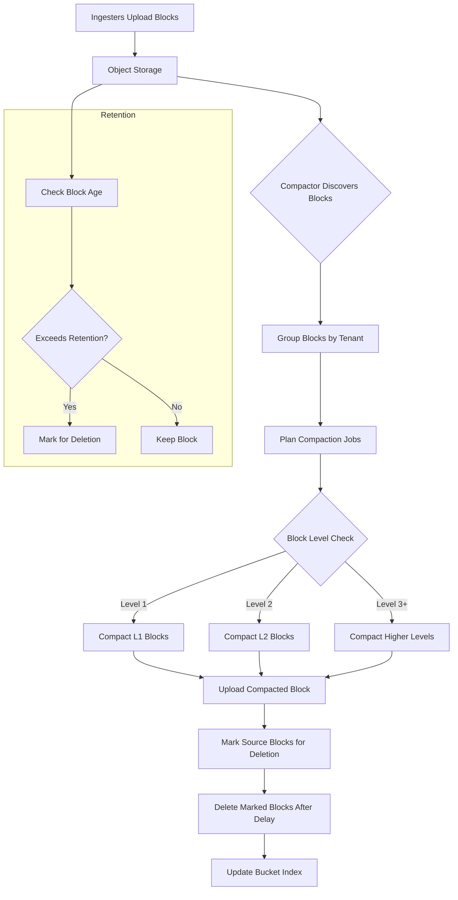
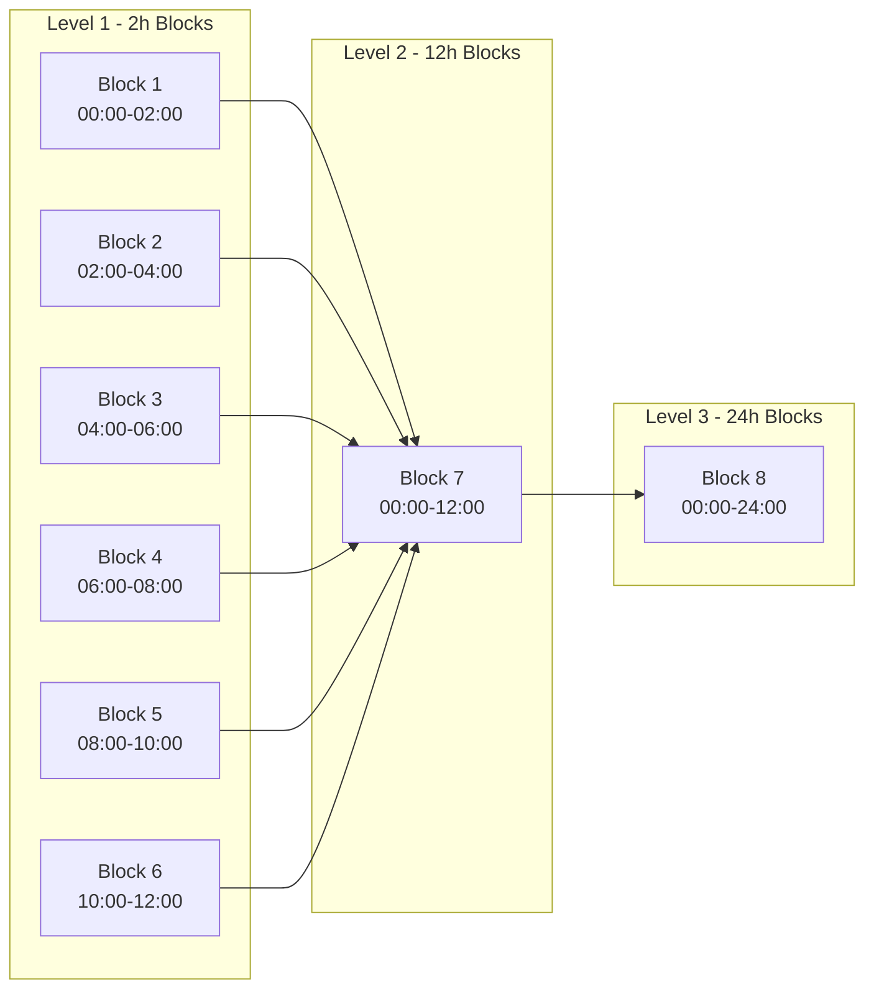
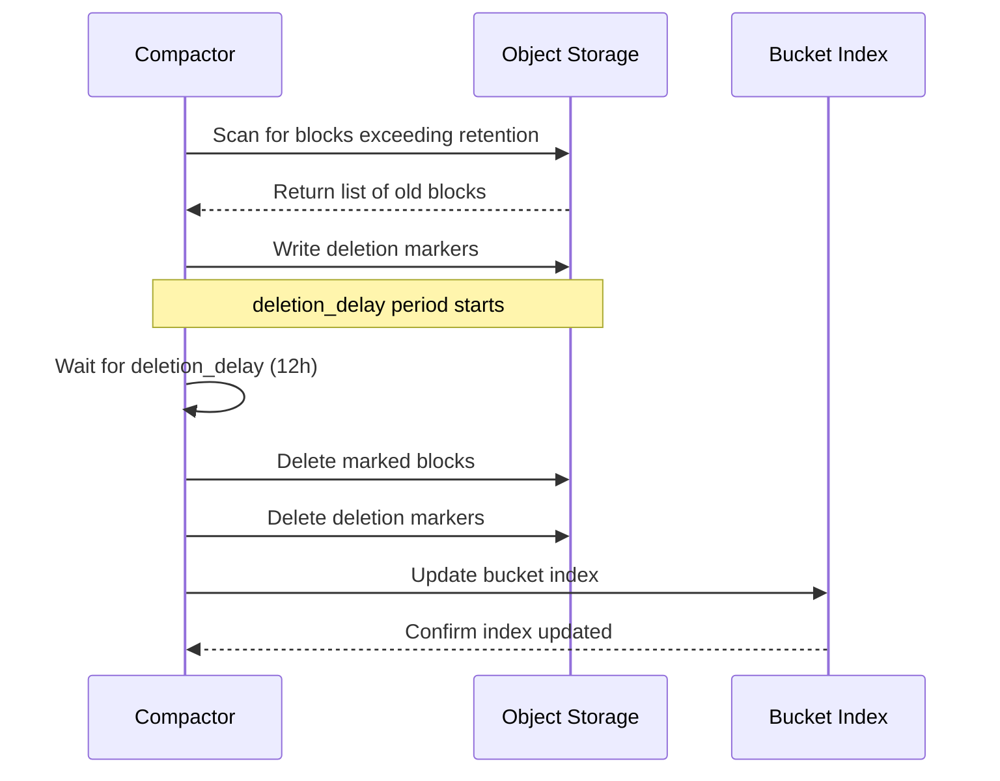

# How to Build Mimir Compactor Configuration

Author: [nawazdhandala](https://github.com/nawazdhandala)

Tags: Mimir, Prometheus, Observability, Storage

Description: A comprehensive guide to configuring the Mimir Compactor for efficient block management, compaction strategies, and retention policies.

---

## Introduction

Grafana Mimir is a horizontally scalable, highly available, multi-tenant time series database designed for long-term storage of Prometheus metrics. The **Compactor** is a critical component responsible for compacting multiple smaller TSDB blocks into larger, more efficient ones. This process reduces storage costs, improves query performance, and manages data retention.

In this guide, we will explore how to configure the Mimir Compactor for optimal block management, including compaction strategies, retention policies, and scheduling options.

## Understanding the Compactor Component

The Compactor performs several essential functions:

1. **Block Compaction**: Merges smaller blocks into larger ones to reduce the total number of blocks
2. **Block Deduplication**: Removes duplicate samples that may exist across blocks
3. **Retention Enforcement**: Deletes blocks that exceed the configured retention period
4. **Block Cleanup**: Removes partial or corrupted blocks from object storage

### Compaction Flow

The following diagram illustrates how the Mimir Compactor processes blocks:



## Basic Compactor Configuration

Here is a foundational configuration for the Mimir Compactor:

```yaml
# Mimir Compactor basic configuration
compactor:
  # Directory for temporary data during compaction
  data_dir: /data/compactor

  # How often to run compaction cycles
  compaction_interval: 1h

  # Number of tenants to compact in parallel
  compaction_concurrency: 4

  # Maximum number of blocks to compact in a single job
  max_compaction_range: 0  # 0 means unlimited

  # Block ranges for compaction (time ranges in hours)
  # These define how blocks are grouped for compaction
  block_ranges:
    - 2h    # First level: 2 hour blocks
    - 12h   # Second level: 12 hour blocks
    - 24h   # Third level: 24 hour blocks
```

## Block Compaction Strategies

Mimir supports different compaction strategies to balance performance and resource usage.

### Split and Merge Compaction

The split and merge strategy is recommended for large-scale deployments:

```yaml
compactor:
  # Enable split and merge compaction for horizontal scaling
  compaction_mode: split-and-merge

  # Number of shards for split compaction
  # Higher values allow more parallelism but increase overhead
  split_and_merge_shards: 4

  # Number of split groups for organizing blocks
  split_groups: 4

  # Maximum opening blocks per tenant during compaction
  max_opening_blocks_concurrency: 4

  # Symbols flushers for parallel symbol table writing
  symbols_flushers_concurrency: 4
```

### Time-Based Grouping Strategy

Configure how blocks are grouped based on time ranges:

```yaml
compactor:
  # Block ranges define compaction levels
  # Each range should be a multiple of the previous
  block_ranges:
    - 2h    # Level 1: Raw ingester blocks (2 hours)
    - 12h   # Level 2: First compaction (12 hours)
    - 24h   # Level 3: Second compaction (24 hours)

  # Minimum age before a block is eligible for compaction
  # Prevents compacting blocks that are still being written
  consistency_delay: 30m

  # Skip blocks newer than this duration
  # Useful to avoid compacting recently uploaded blocks
  block_sync_concurrency: 20
```

### Compaction Level Diagram



## Retention and Deletion Configuration

Properly configuring retention ensures old data is cleaned up while maintaining compliance requirements.

```yaml
# Retention configuration for the compactor
compactor:
  # Enable retention enforcement
  retention_enabled: true

  # Default retention period for all tenants
  # Blocks older than this will be marked for deletion
  retention_period: 365d  # Keep data for 1 year

  # Delay before actually deleting marked blocks
  # Provides a safety window for recovery
  deletion_delay: 12h

  # How often to check for blocks to delete
  cleanup_interval: 15m

  # Maximum number of blocks to delete per cleanup cycle
  # Prevents overwhelming object storage
  cleanup_concurrency: 20

# Per-tenant retention overrides
limits:
  # Default limits for all tenants
  default_limits:
    compactor_blocks_retention_period: 365d

  # Tenant-specific overrides
  tenant_limits:
    tenant_premium:
      compactor_blocks_retention_period: 730d  # 2 years
    tenant_basic:
      compactor_blocks_retention_period: 90d   # 90 days
```

### Deletion Flow



## Compaction Scheduling and Concurrency

Fine-tune scheduling and concurrency settings for your workload:

```yaml
compactor:
  # Main compaction settings
  compaction_interval: 1h          # How often to check for compaction work
  compaction_concurrency: 4         # Parallel compaction jobs per compactor

  # Tenant sharding for multi-compactor deployments
  sharding_enabled: true
  sharding_ring:
    kvstore:
      store: memberlist            # Use memberlist for ring coordination
    heartbeat_period: 1m
    heartbeat_timeout: 4m
    wait_stability_min_duration: 1m
    wait_stability_max_duration: 5m

  # Resource limits for compaction
  compaction_jobs_concurrent: 1     # Jobs per tenant at a time

  # Block download and upload settings
  block_sync_concurrency: 20        # Concurrent block syncs from storage
  meta_sync_concurrency: 20         # Concurrent metadata syncs

  # Memory and disk usage controls
  max_compaction_bytes: 42949672960 # 40GB max compaction size
```

### Multi-Instance Compactor Setup

For high availability, run multiple compactor instances with sharding:

```yaml
# Compactor instance configuration for HA deployment
compactor:
  sharding_enabled: true
  sharding_ring:
    instance_id: "compactor-1"      # Unique ID per instance
    instance_addr: "10.0.0.1"       # Instance IP address
    instance_port: 9095

    kvstore:
      store: consul                  # Use Consul for ring storage
      consul:
        host: "consul.service:8500"

    # Ring replication settings
    replication_factor: 1           # Compactor does not replicate

    # Heartbeat settings
    heartbeat_period: 15s
    heartbeat_timeout: 1m

    # Wait for ring stability before claiming tenants
    wait_stability_min_duration: 1m
    wait_stability_max_duration: 5m
```

## Complete Production Configuration

Here is a comprehensive production-ready configuration:

```yaml
# Complete Mimir Compactor production configuration
target: compactor

# Server configuration
server:
  http_listen_port: 8080
  grpc_listen_port: 9095
  log_level: info

# Compactor configuration
compactor:
  # Data directory for temporary files
  data_dir: /data/compactor

  # Compaction strategy
  compaction_mode: split-and-merge
  split_and_merge_shards: 4
  split_groups: 4

  # Block ranges (compaction levels)
  block_ranges:
    - 2h
    - 12h
    - 24h

  # Timing and scheduling
  compaction_interval: 1h
  consistency_delay: 30m

  # Concurrency settings
  compaction_concurrency: 4
  compaction_jobs_concurrent: 1
  block_sync_concurrency: 20
  meta_sync_concurrency: 20
  symbols_flushers_concurrency: 4
  max_opening_blocks_concurrency: 4

  # Resource limits
  max_compaction_bytes: 42949672960  # 40GB

  # Retention settings
  retention_enabled: true
  retention_period: 365d
  deletion_delay: 12h
  cleanup_interval: 15m
  cleanup_concurrency: 20

  # Sharding for HA
  sharding_enabled: true
  sharding_ring:
    kvstore:
      store: memberlist
    heartbeat_period: 15s
    heartbeat_timeout: 1m
    wait_stability_min_duration: 1m
    wait_stability_max_duration: 5m

# Object storage backend
blocks_storage:
  backend: s3
  s3:
    endpoint: s3.amazonaws.com
    bucket_name: mimir-blocks
    region: us-east-1
    access_key_id: ${AWS_ACCESS_KEY_ID}
    secret_access_key: ${AWS_SECRET_ACCESS_KEY}

  # Bucket index configuration
  bucket_store:
    sync_dir: /data/bucket-sync
    sync_interval: 15m

    # Index cache for query performance
    index_cache:
      backend: memcached
      memcached:
        addresses: memcached.service:11211
        max_item_size: 5242880  # 5MB

    # Chunks cache
    chunks_cache:
      backend: memcached
      memcached:
        addresses: memcached.service:11211
        max_item_size: 1048576  # 1MB

# Tenant limits
limits:
  default_limits:
    compactor_blocks_retention_period: 365d
    compactor_split_and_merge_shards: 0      # Use global default
    compactor_split_groups: 0                 # Use global default

  tenant_limits:
    high_volume_tenant:
      compactor_blocks_retention_period: 730d
      compactor_split_and_merge_shards: 8    # More shards for large tenant
      compactor_split_groups: 8

# Memberlist configuration for ring
memberlist:
  join_members:
    - mimir-compactor-0.mimir-compactor.default.svc.cluster.local:7946
    - mimir-compactor-1.mimir-compactor.default.svc.cluster.local:7946
    - mimir-compactor-2.mimir-compactor.default.svc.cluster.local:7946
```

## Monitoring the Compactor

Use these Prometheus metrics to monitor compactor health:

```yaml
# Key metrics to monitor
# cortex_compactor_runs_started_total: Total compaction runs started
# cortex_compactor_runs_completed_total: Total compaction runs completed
# cortex_compactor_runs_failed_total: Total compaction runs failed
# cortex_compactor_blocks_cleaned_total: Blocks cleaned up
# cortex_compactor_blocks_marked_for_deletion_total: Blocks marked for deletion
# cortex_compactor_block_cleanup_failures_total: Block cleanup failures

# Example Prometheus alerting rules
groups:
  - name: mimir-compactor-alerts
    rules:
      # Alert if compaction is failing
      - alert: MimirCompactorHasNotSuccessfullyRun
        expr: |
          (time() - cortex_compactor_last_successful_run_timestamp_seconds > 3600)
          and
          (cortex_compactor_last_successful_run_timestamp_seconds > 0)
        for: 15m
        labels:
          severity: warning
        annotations:
          summary: "Mimir Compactor has not run successfully"
          description: "Compactor {{ $labels.instance }} has not completed a successful run in over 1 hour."

      # Alert on high failure rate
      - alert: MimirCompactorHighFailureRate
        expr: |
          rate(cortex_compactor_runs_failed_total[1h]) > 0.1
        for: 15m
        labels:
          severity: critical
        annotations:
          summary: "Mimir Compactor experiencing high failure rate"
          description: "Compactor {{ $labels.instance }} is failing compaction runs."
```

## Best Practices

1. **Start with conservative settings**: Begin with lower concurrency values and increase based on available resources
2. **Monitor disk usage**: The compactor needs local disk space for temporary files during compaction
3. **Use split-and-merge for scale**: Enable split-and-merge compaction for deployments with many tenants or high cardinality
4. **Set appropriate retention**: Balance storage costs with data retention requirements
5. **Configure deletion delay**: Keep a safety buffer (12-24 hours) before permanently deleting blocks
6. **Enable sharding for HA**: Run multiple compactor instances with sharding enabled for high availability
7. **Monitor compaction lag**: Track the age of uncompacted blocks to ensure compaction keeps up with ingestion

## Conclusion

The Mimir Compactor is essential for maintaining a healthy and efficient time series database. By properly configuring block compaction strategies, retention policies, and scheduling options, you can optimize storage costs and query performance while ensuring data durability.

Key takeaways:
- Configure block ranges to match your query patterns
- Enable retention and set appropriate periods per tenant
- Use split-and-merge compaction for large-scale deployments
- Monitor compactor health with Prometheus metrics
- Run multiple instances with sharding for high availability

For more information, refer to the official [Grafana Mimir documentation](https://grafana.com/docs/mimir/latest/).
