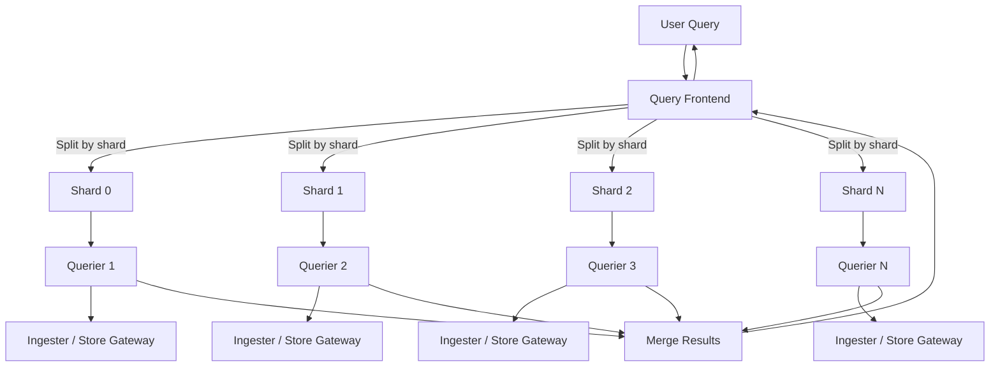
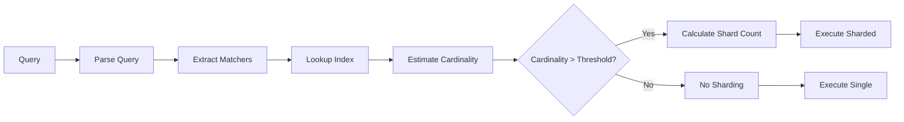
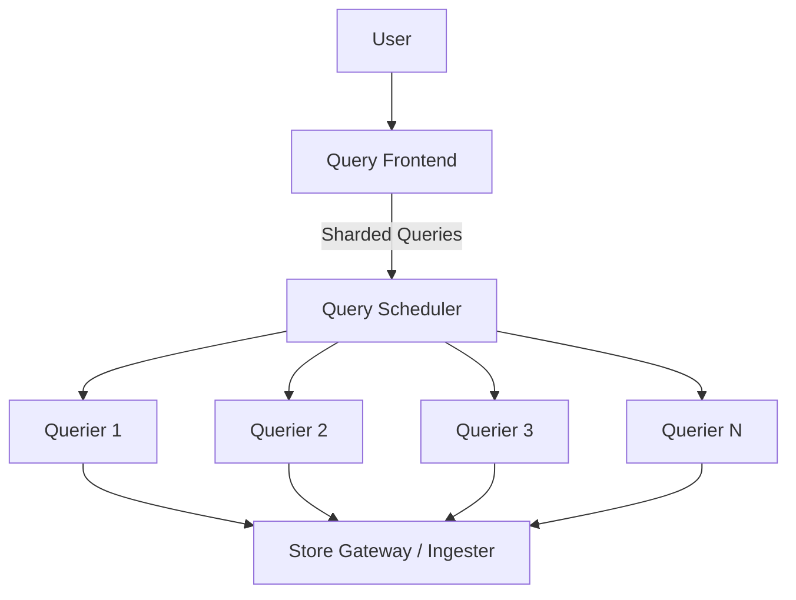

# How to Implement Mimir Query Sharding

Author: [nawazdhandala](https://github.com/nawazdhandala)

Tags: Mimir, Prometheus, Observability, Performance

Description: Learn how Mimir query sharding enables parallel query execution to dramatically reduce query latency for large-scale metrics.

---

You have 500 million active time series. A user runs a query that needs to scan three months of data. Without parallelization, that query takes 45 seconds. With query sharding enabled, it completes in under 5 seconds. That is the power of Mimir query sharding.

Grafana Mimir is a horizontally scalable, highly available, multi-tenant time series database designed for long-term storage. One of its most powerful performance features is query sharding, which splits large queries into smaller parallel sub-queries that execute concurrently across multiple queriers.

This post walks you through how query sharding works, how to configure it, and how to tune it for your workload.

## What is Query Sharding?

Query sharding is a technique where the query frontend breaks a single PromQL query into multiple independent sub-queries. Each sub-query processes a subset of the data, and the results are merged before being returned to the user.

The splitting happens based on label matchers. Mimir uses a configurable number of shards and distributes the work by hashing series across those shards.



The query frontend acts as the coordinator. It receives the original query, determines how to shard it, dispatches sub-queries to available queriers, waits for all responses, merges them, and returns the final result.

## Why Query Sharding Matters

Without sharding, a single querier must process the entire query. This creates bottlenecks:

- CPU bound: A single querier has limited cores
- Memory bound: Large result sets can exhaust memory
- I/O bound: Reading from storage is sequential

With sharding, you get:

- **Parallelism**: Multiple queriers work simultaneously
- **Reduced latency**: Wall clock time drops proportionally to shard count
- **Better resource utilization**: Distribute load across the cluster
- **Horizontal scaling**: Add more queriers to handle more shards

## Enabling Query Sharding

Query sharding is configured in the query frontend. Here is a minimal configuration:

```yaml
# mimir-config.yaml

# Enable query sharding in the query frontend
query_frontend:
  # Enable sharding for range queries
  parallelize_shardable_queries: true

  # Number of shards to split queries into
  # Higher values mean more parallelism but also more overhead
  query_sharding_total_shards: 16

  # Maximum number of shards that can be used per query
  # Useful for limiting resource consumption
  query_sharding_max_sharded_queries: 128
```

For a complete production configuration:

```yaml
# mimir-config.yaml - Production query frontend settings

query_frontend:
  # Core sharding settings
  parallelize_shardable_queries: true
  query_sharding_total_shards: 16
  query_sharding_max_sharded_queries: 128

  # Target number of shards to use per query
  # The frontend will try to hit this target based on cardinality estimates
  query_sharding_target_series_per_shard: 2500

  # Query splitting by time interval
  # Splits long range queries into smaller time windows
  split_queries_by_interval: 24h

  # Maximum retries for failed sub-queries
  max_retries: 5

  # Cache configuration for query results
  results_cache:
    backend: memcached
    memcached:
      addresses: dns+memcached.mimir.svc.cluster.local:11211
      timeout: 500ms
      max_idle_connections: 100
```

## Shard Count and Query Splitting

Choosing the right shard count involves tradeoffs:

| Shard Count | Pros | Cons |
|-------------|------|------|
| Low (4-8) | Lower overhead, simpler debugging | Limited parallelism |
| Medium (16-32) | Good balance of parallelism and overhead | Requires more queriers |
| High (64-128) | Maximum parallelism for huge queries | High coordination overhead |

The query frontend uses this formula to determine sharding:

```
effective_shards = min(
    query_sharding_total_shards,
    query_sharding_max_sharded_queries,
    estimated_series / query_sharding_target_series_per_shard
)
```

Here is how a query gets transformed:

```promql
# Original query
sum(rate(http_requests_total{job="api"}[5m])) by (status_code)

# Sharded into 4 sub-queries (simplified representation)
# Each shard processes a subset of series based on hash(series_labels) % 4

# Shard 0
sum(rate(http_requests_total{job="api", __query_shard__="0_of_4"}[5m])) by (status_code)

# Shard 1
sum(rate(http_requests_total{job="api", __query_shard__="1_of_4"}[5m])) by (status_code)

# Shard 2
sum(rate(http_requests_total{job="api", __query_shard__="2_of_4"}[5m])) by (status_code)

# Shard 3
sum(rate(http_requests_total{job="api", __query_shard__="3_of_4"}[5m])) by (status_code)
```

The results are then merged using the appropriate aggregation function.

## Cardinality Estimation for Sharding Decisions

Mimir uses cardinality estimation to make intelligent sharding decisions. The query frontend estimates how many series a query will touch before executing it.

```yaml
# Configure cardinality estimation
query_frontend:
  # Enable cardinality-based sharding decisions
  query_sharding_target_series_per_shard: 2500

  # Cache cardinality estimates
  cache_results: true

limits:
  # Maximum series a single query can return
  max_fetched_series_per_query: 1000000

  # Maximum samples a single query can process
  max_fetched_samples_per_query: 50000000
```

The cardinality estimator works by:

1. Analyzing the query label matchers
2. Looking up series counts in the index
3. Estimating the result set size
4. Choosing an appropriate shard count



## Query Frontend Configuration Deep Dive

Here is a comprehensive query frontend configuration with explanations:

```yaml
# Complete query frontend configuration
query_frontend:
  # Sharding configuration
  parallelize_shardable_queries: true
  query_sharding_total_shards: 16
  query_sharding_max_sharded_queries: 128
  query_sharding_target_series_per_shard: 2500

  # Time-based splitting
  # Long queries are split into chunks of this duration
  split_queries_by_interval: 24h

  # Align queries to this interval for better caching
  align_queries_with_step: true

  # Maximum time range for a single query
  max_total_query_length: 0  # 0 means unlimited

  # Retry configuration
  max_retries: 5

  # Timeout for downstream requests
  downstream_url: ""

  # GRPC client configuration for talking to queriers
  grpc_client_config:
    max_recv_msg_size: 104857600  # 100MB
    max_send_msg_size: 104857600
    grpc_compression: gzip
    rate_limit: 0
    rate_limit_burst: 0

  # Result caching
  results_cache:
    backend: memcached
    memcached:
      addresses: dns+memcached.mimir.svc.cluster.local:11211
      timeout: 500ms
      max_idle_connections: 100
      max_async_buffer_size: 25000
      max_async_concurrency: 50
      max_get_multi_batch_size: 100

  # Log queries that take longer than this
  log_queries_longer_than: 10s
```

## Practical Code Examples

### Kubernetes Deployment

Deploy the query frontend with sharding enabled:

```yaml
# query-frontend-deployment.yaml
apiVersion: apps/v1
kind: Deployment
metadata:
  name: mimir-query-frontend
  namespace: mimir
spec:
  replicas: 3  # Multiple replicas for HA
  selector:
    matchLabels:
      app: mimir-query-frontend
  template:
    metadata:
      labels:
        app: mimir-query-frontend
    spec:
      containers:
        - name: query-frontend
          image: grafana/mimir:2.11.0
          args:
            - -target=query-frontend
            - -config.file=/etc/mimir/mimir.yaml
          ports:
            - name: http
              containerPort: 8080
            - name: grpc
              containerPort: 9095
          resources:
            requests:
              cpu: "1"
              memory: 2Gi
            limits:
              cpu: "4"
              memory: 8Gi
          volumeMounts:
            - name: config
              mountPath: /etc/mimir
      volumes:
        - name: config
          configMap:
            name: mimir-config
---
# ConfigMap with sharding configuration
apiVersion: v1
kind: ConfigMap
metadata:
  name: mimir-config
  namespace: mimir
data:
  mimir.yaml: |
    # Multi-tenant configuration
    multitenancy_enabled: true

    # Query frontend with sharding
    query_frontend:
      parallelize_shardable_queries: true
      query_sharding_total_shards: 16
      query_sharding_max_sharded_queries: 128
      query_sharding_target_series_per_shard: 2500
      split_queries_by_interval: 24h
      max_retries: 5
      results_cache:
        backend: memcached
        memcached:
          addresses: dns+memcached.mimir.svc.cluster.local:11211
          timeout: 500ms

    # Querier configuration
    querier:
      max_concurrent: 20
      timeout: 2m

    # Limits
    limits:
      max_fetched_series_per_query: 1000000
      max_fetched_samples_per_query: 50000000
      max_query_parallelism: 32
```

### Query Scheduler for Better Distribution

For large deployments, use the query scheduler to distribute work:

```yaml
# Add query scheduler between frontend and queriers
query_scheduler:
  # Maximum number of outstanding requests per tenant
  max_outstanding_requests_per_tenant: 100

  # Enable query scheduler
  service_discovery_mode: ring

query_frontend:
  # Point frontend to scheduler instead of queriers
  scheduler_address: dns:///query-scheduler.mimir.svc.cluster.local:9095

  # Sharding still configured here
  parallelize_shardable_queries: true
  query_sharding_total_shards: 16
```

The architecture with query scheduler:



### Monitoring Query Sharding

Track sharding effectiveness with these metrics:

```yaml
# Prometheus recording rules for sharding metrics
groups:
  - name: mimir-query-sharding
    rules:
      # Track sharded vs non-sharded queries
      - record: mimir:query_frontend_sharded_queries_total
        expr: sum(rate(cortex_frontend_sharded_queries_total[5m])) by (cluster)

      # Average shards per query
      - record: mimir:query_frontend_shards_per_query_avg
        expr: |
          sum(rate(cortex_frontend_query_shards_total[5m])) by (cluster)
          /
          sum(rate(cortex_frontend_sharded_queries_total[5m])) by (cluster)

      # Query latency improvement from sharding
      - record: mimir:query_latency_seconds
        expr: |
          histogram_quantile(0.99,
            sum(rate(cortex_query_frontend_queue_duration_seconds_bucket[5m])) by (le, cluster)
          )
```

Create a Grafana dashboard panel:

```json
{
  "title": "Query Sharding Effectiveness",
  "type": "timeseries",
  "targets": [
    {
      "expr": "sum(rate(cortex_frontend_sharded_queries_total{cluster=\"$cluster\"}[5m]))",
      "legendFormat": "Sharded Queries/sec"
    },
    {
      "expr": "sum(rate(cortex_query_frontend_queries_total{cluster=\"$cluster\"}[5m])) - sum(rate(cortex_frontend_sharded_queries_total{cluster=\"$cluster\"}[5m]))",
      "legendFormat": "Non-Sharded Queries/sec"
    }
  ]
}
```

## Shardable vs Non-Shardable Queries

Not all queries can be sharded. Here is what works and what does not:

**Shardable (parallel safe):**
- `sum()`, `count()`, `min()`, `max()`
- `sum(rate(...))`, `sum(increase(...))`
- `avg()` with proper merging
- `count_values()`, `topk()`, `bottomk()` with caveats

**Not shardable (require full data):**
- `histogram_quantile()` without pre-aggregation
- `absent()`, `absent_over_time()`
- Subqueries in some contexts
- Some `label_*` functions

Example of a query that benefits from sharding:

```promql
# This query is highly shardable
# Each shard computes partial sums, then results merge
sum by (service, status_code) (
  rate(http_requests_total{namespace="production"}[5m])
)
```

Example of a query that cannot be sharded:

```promql
# histogram_quantile needs all buckets together
# Cannot be split across shards
histogram_quantile(0.99,
  sum by (le) (
    rate(http_request_duration_seconds_bucket{job="api"}[5m])
  )
)
```

## Tuning for Your Workload

Start with these baseline settings and adjust:

```yaml
# Conservative starting point
query_frontend:
  parallelize_shardable_queries: true
  query_sharding_total_shards: 8
  query_sharding_target_series_per_shard: 5000
  split_queries_by_interval: 24h
```

Monitor and adjust:

1. **If queries are still slow**: Increase `query_sharding_total_shards`
2. **If queriers are overloaded**: Decrease shards or add more queriers
3. **If you see high merge overhead**: Decrease shards
4. **For very high cardinality**: Increase `query_sharding_total_shards` to 32 or 64

Test with a specific query:

```bash
# Measure query performance before sharding
curl -w "@curl-format.txt" -s -o /dev/null \
  "http://mimir:8080/prometheus/api/v1/query" \
  --data-urlencode "query=sum(rate(http_requests_total[5m])) by (service)"

# Enable sharding and compare
# Look for the X-Query-Parallelism header in responses
```

## Common Issues and Solutions

**Issue**: Queries timing out after enabling sharding

```yaml
# Increase timeouts for sharded queries
query_frontend:
  max_retries: 5

querier:
  timeout: 5m  # Increase from default 2m
```

**Issue**: Memory pressure on queriers

```yaml
# Reduce concurrent queries per querier
querier:
  max_concurrent: 10  # Reduce from 20

limits:
  # Limit series per query
  max_fetched_series_per_query: 500000
```

**Issue**: Uneven shard distribution

```yaml
# Increase target series per shard for better distribution
query_frontend:
  query_sharding_target_series_per_shard: 10000
```

## Conclusion

Query sharding transforms Mimir from a capable time series database into a high performance analytics engine. By splitting queries across multiple queriers, you can achieve sub-second response times even for queries spanning billions of samples.

Key takeaways:

- Enable `parallelize_shardable_queries` in the query frontend
- Start with 8-16 shards and tune based on your workload
- Use cardinality estimation to make smart sharding decisions
- Monitor sharding effectiveness with built-in metrics
- Not all queries can be sharded - know the limitations

Query sharding, combined with time-based splitting and result caching, makes Mimir suitable for dashboards, alerting, and ad-hoc exploration at massive scale.

---

**Related Reading:**

- [Three Pillars of Observability: Logs, Metrics & Traces](https://oneuptime.com/blog/post/2025-08-20-three-pillars-of-observability-logs-metrics-traces/view)
- [What is OpenTelemetry Collector and Why Use One](https://oneuptime.com/blog/post/2025-09-18-what-is-opentelemetry-collector-and-why-use-one/view)
- [SRE Metrics to Track](https://oneuptime.com/blog/post/2025-11-28-sre-metrics-to-track/view)
