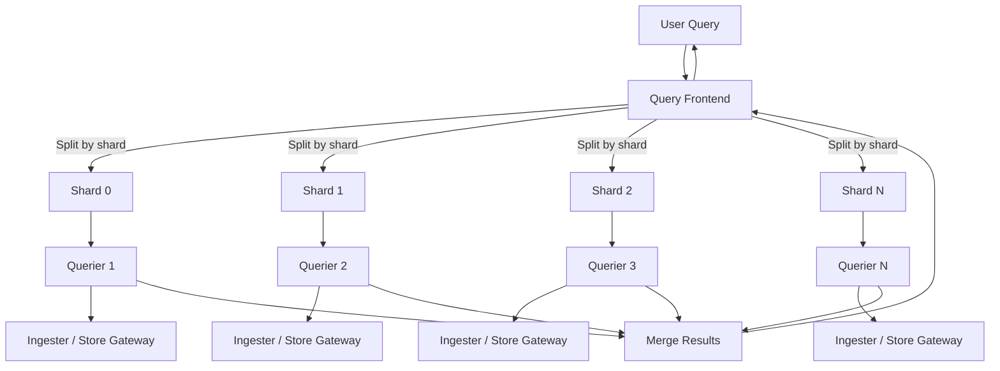
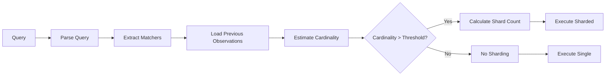
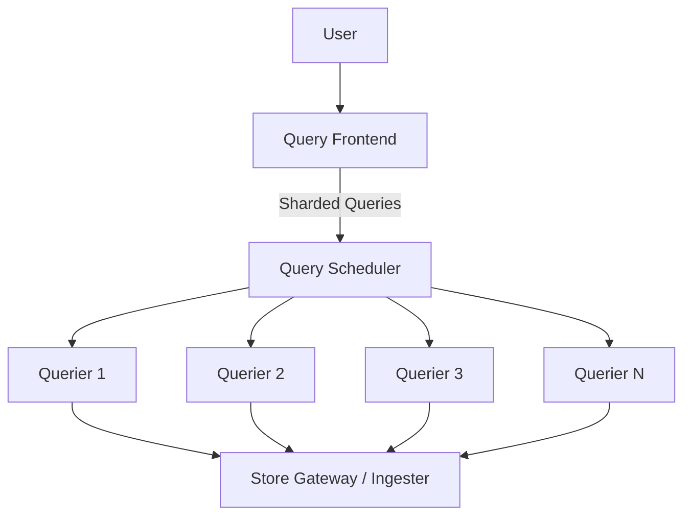

# How to Implement Mimir Query Sharding

Author: [nawazdhandala](https://github.com/nawazdhandala)

Tags: Mimir, Prometheus, Observability, Performance

Description: Learn how Mimir query sharding enables parallel query execution to dramatically reduce query latency for large-scale metrics.

---

You have 500 million active time series. A user runs a query that needs to scan three months of data. Without parallelization, that query takes 45 seconds. With query sharding enabled, it completes in under 5 seconds. That is the power of Mimir query sharding.

Grafana Mimir is a horizontally scalable, highly available, multi-tenant time series database designed for long-term storage. One of its most powerful performance features is query sharding, which splits large queries into smaller parallel sub-queries that execute concurrently across multiple queriers.

This post walks you through how query sharding works, how to configure it, and how to tune it for your workload.

## What is Query Sharding?

Query sharding is a technique where the query frontend breaks a single PromQL query into multiple independent sub-queries. Each sub-query processes a subset of the data, and the results are merged before being returned to the user.

The splitting happens by adding an internal `__query_shard__` label matcher to shardable selectors. Mimir uses a configurable number of shards and distributes the work by hashing series across those shards.


```mermaid
flowchart TB
    U[User Query] --> QF[Query Frontend]
    QF --> |Split by shard| S1[Shard 0]
    QF --> |Split by shard| S2[Shard 1]
    QF --> |Split by shard| S3[Shard 2]
    QF --> |Split by shard| S4[Shard N]
    S1 --> Q1[Querier 1]
    S2 --> Q2[Querier 2]
    S3 --> Q3[Querier 3]
    S4 --> Q4[Querier N]
    Q1 --> I1[Ingester / Store Gateway]
    Q2 --> I2[Ingester / Store Gateway]
    Q3 --> I3[Ingester / Store Gateway]
    Q4 --> I4[Ingester / Store Gateway]
    Q1 --> M[Merge Results]
    Q2 --> M
    Q3 --> M
    Q4 --> M
    M --> QF
    QF --> U
```

The query frontend acts as the coordinator. It receives the original query, determines how to shard it, dispatches sub-queries to available queriers, waits for all responses, merges them, and returns the final result.

## Why Query Sharding Matters

Without sharding, a single querier must process the entire query. This creates bottlenecks:

- CPU bound: A single querier has limited cores
- Memory bound: Large result sets can exhaust memory
- I/O bound: Reading from storage is sequential

With sharding, you get:

- **Parallelism**: Multiple queriers work simultaneously
- **Reduced latency**: Wall clock time can drop significantly for high-cardinality and CPU-intensive queries
- **Better resource utilization**: Distribute load across the cluster
- **Horizontal scaling**: Add more queriers to handle more shards

## Enabling Query Sharding

Query sharding is enabled in the query frontend, while shard-count limits are configured in the limits block. Here is a minimal configuration:

```yaml
# mimir-config.yaml

# Enable query sharding in the query frontend

frontend:
  # Enable sharding for range queries
  parallelize_shardable_queries: true

limits:
  # Number of shards to split queries into
  # Higher values mean more parallelism but also more overhead
  query_sharding_total_shards: 16

  # Maximum number of partial queries a single input query can generate
  # Useful for limiting resource consumption
  query_sharding_max_sharded_queries: 128
```

For a complete production configuration:

```yaml
# mimir-config.yaml - Production query frontend settings

frontend:
  # Core sharding settings
  parallelize_shardable_queries: true

  # Target number of series per shard when cardinality estimates are available
  # The frontend can reduce the shard count based on previous executions
  query_sharding_target_series_per_shard: 2500

  # Query splitting by time interval
  # Splits long range queries into smaller time windows
  split_queries_by_interval: 24h

  # Maximum retries for failed sub-queries
  max_retries: 5

  # Cache configuration for query results
  results_cache:
    backend: memcached
    memcached:
      addresses: dns+memcached.mimir.svc.cluster.local:11211
      timeout: 500ms
      max_idle_connections: 100

limits:
  query_sharding_total_shards: 16
  query_sharding_max_sharded_queries: 128
```

## Shard Count and Query Splitting

Choosing the right shard count involves tradeoffs:

| Shard Count | Pros | Cons |
|-------------|------|------|
| Low (4-8) | Lower overhead, simpler debugging | Limited parallelism |
| Medium (16-32) | Good balance of parallelism and overhead | Requires more queriers |
| High (64-128) | Maximum parallelism for huge queries | High coordination overhead |

The query frontend uses the configured shard count as an upper bound. If cardinality-based sharding is enabled, it can reduce the number of shards for queries that previously fetched fewer series:

```text
effective_shards <= query_sharding_total_shards
total_partial_queries <= query_sharding_max_sharded_queries
```

Here is how a query gets transformed:

```promql
# Original query
sum(rate(http_requests_total{job="api"}[5m])) by (status_code)

# Sharded into 4 sub-queries (simplified representation)
# Each shard processes a subset of series based on hash(series_labels) % 4

# Shard 1
sum(rate(http_requests_total{job="api", __query_shard__="1_of_4"}[5m])) by (status_code)

# Shard 2
sum(rate(http_requests_total{job="api", __query_shard__="2_of_4"}[5m])) by (status_code)

# Shard 3
sum(rate(http_requests_total{job="api", __query_shard__="3_of_4"}[5m])) by (status_code)

# Shard 4
sum(rate(http_requests_total{job="api", __query_shard__="4_of_4"}[5m])) by (status_code)
```

The results are then merged using the appropriate aggregation function.

## Cardinality Estimation for Sharding Decisions

Mimir can use cardinality estimation to make intelligent sharding decisions. The query frontend uses cardinality observed during previous executions of the same query for similar time ranges.

```yaml
# Configure cardinality estimation
frontend:
  # Enable cardinality-based sharding decisions
  query_sharding_target_series_per_shard: 2500

  # Configure the results cache used to store cardinality estimates
  results_cache:
    backend: memcached
    memcached:
      addresses: dns+memcached.mimir.svc.cluster.local:11211

limits:
  # Maximum series a single query can return
  max_fetched_series_per_query: 1000000

querier:
  # Maximum samples a single query can load into memory
  max_samples: 50000000
```

The cardinality estimator works by:

1. Recording the actual number of series fetched by previous executions
2. Storing those observations in the results cache
3. Reusing estimates for the same query over similar time ranges
4. Reducing the shard count when fewer shards are enough


```mermaid
flowchart LR
    Q[Query] --> P[Parse Query]
    P --> E[Extract Matchers]
    E --> L[Load Previous Observations]
    L --> C[Estimate Cardinality]
    C --> D{Cardinality > Threshold?}
    D --> |Yes| S[Calculate Shard Count]
    D --> |No| N[No Sharding]
    S --> X[Execute Sharded]
    N --> X2[Execute Single]
```

## Query Frontend Configuration Deep Dive

Here is a comprehensive query frontend configuration with explanations:

```yaml
# Complete query frontend configuration
frontend:
  # Sharding configuration
  parallelize_shardable_queries: true
  query_sharding_target_series_per_shard: 2500

  # Time-based splitting
  # Long queries are split into chunks of this duration
  split_queries_by_interval: 24h

  # Retry configuration
  max_retries: 5

  # Query scheduler address when DNS-based scheduler discovery is used
  scheduler_address: query-scheduler.mimir.svc.cluster.local:9095

  # GRPC client configuration for talking to queriers
  grpc_client_config:
    max_recv_msg_size: 104857600  # 100MB
    max_send_msg_size: 104857600
    grpc_compression: gzip
    rate_limit: 0
    rate_limit_burst: 0

  # Result caching
  results_cache:
    backend: memcached
    memcached:
      addresses: dns+memcached.mimir.svc.cluster.local:11211
      timeout: 500ms
      max_idle_connections: 100
      max_async_buffer_size: 25000
      max_async_concurrency: 50
      max_get_multi_batch_size: 100

  # Log queries that take longer than this
  log_queries_longer_than: 10s

limits:
  query_sharding_total_shards: 16
  query_sharding_max_sharded_queries: 128
  max_total_query_length: 0s  # 0s means unlimited
  align_queries_with_step: true
```

## Practical Code Examples

### Kubernetes Deployment

Deploy the query frontend with sharding enabled:

```yaml
# query-frontend-deployment.yaml
apiVersion: apps/v1
kind: Deployment
metadata:
  name: mimir-query-frontend
  namespace: mimir
spec:
  replicas: 3  # Multiple replicas for HA
  selector:
    matchLabels:
      app: mimir-query-frontend
  template:
    metadata:
      labels:
        app: mimir-query-frontend
    spec:
      containers:
        - name: query-frontend
          image: grafana/mimir:2.11.0
          args:
            - -target=query-frontend
            - -config.file=/etc/mimir/mimir.yaml
          ports:
            - name: http
              containerPort: 8080
            - name: grpc
              containerPort: 9095
          resources:
            requests:
              cpu: "1"
              memory: 2Gi
            limits:
              cpu: "4"
              memory: 8Gi
          volumeMounts:
            - name: config
              mountPath: /etc/mimir
      volumes:
        - name: config
          configMap:
            name: mimir-config
---
# ConfigMap with sharding configuration
apiVersion: v1
kind: ConfigMap
metadata:
  name: mimir-config
  namespace: mimir
data:
  mimir.yaml: |
    # Multi-tenant configuration
    multitenancy_enabled: true

    # Query frontend with sharding
    frontend:
      parallelize_shardable_queries: true
      query_sharding_target_series_per_shard: 2500
      split_queries_by_interval: 24h
      max_retries: 5
      results_cache:
        backend: memcached
        memcached:
          addresses: dns+memcached.mimir.svc.cluster.local:11211
          timeout: 500ms

    # Querier configuration
    querier:
      max_concurrent: 20
      timeout: 2m
      max_samples: 50000000

    # Limits
    limits:
      query_sharding_total_shards: 16
      query_sharding_max_sharded_queries: 128
      max_fetched_series_per_query: 1000000
      max_query_parallelism: 32
```

### Query Scheduler for Better Distribution

For large deployments, use the query scheduler to distribute work:

```yaml
# Add query scheduler between frontend and queriers
query_scheduler:
  # Maximum number of outstanding requests per tenant
  max_outstanding_requests_per_tenant: 100

frontend:
  # Point frontend to scheduler instead of queriers
  scheduler_address: query-scheduler.mimir.svc.cluster.local:9095

  # Sharding still enabled here
  parallelize_shardable_queries: true

querier:
  # Point queriers to the scheduler too
  scheduler_address: query-scheduler.mimir.svc.cluster.local:9095

limits:
  query_sharding_total_shards: 16
```

The architecture with query scheduler:


```mermaid
flowchart TB
    U[User] --> QF[Query Frontend]
    QF --> |Sharded Queries| QS[Query Scheduler]
    QS --> Q1[Querier 1]
    QS --> Q2[Querier 2]
    QS --> Q3[Querier 3]
    QS --> Q4[Querier N]
    Q1 --> S[Store Gateway / Ingester]
    Q2 --> S
    Q3 --> S
    Q4 --> S
```

### Monitoring Query Sharding

Track sharding effectiveness with these metrics:

```yaml
# Prometheus recording rules for sharding metrics
groups:
  - name: mimir-query-sharding
    rules:
      # Ratio of successful query-sharding rewrites
      - record: mimir:query_frontend_query_sharding_success_ratio
        expr: |
          sum(rate(cortex_frontend_query_sharding_rewrites_succeeded_total[5m])) by (cluster)
          /
          sum(rate(cortex_frontend_query_sharding_rewrites_attempted_total[5m])) by (cluster)

      # Average shards per query
      - record: mimir:query_frontend_shards_per_query_avg
        expr: |
          sum(rate(cortex_frontend_sharded_queries_per_query_sum[5m])) by (cluster)
          /
          sum(rate(cortex_frontend_sharded_queries_per_query_count[5m])) by (cluster)

      # Query frontend queue latency
      - record: mimir:query_frontend_queue_latency_seconds
        expr: |
          histogram_quantile(0.99,
            sum(rate(cortex_query_frontend_queue_duration_seconds_bucket[5m])) by (le, cluster)
          )
```

Create a Grafana dashboard panel:

```json
{
  "title": "Query Sharding Effectiveness",
  "type": "timeseries",
  "targets": [
    {
      "expr": "sum(rate(cortex_frontend_query_sharding_rewrites_succeeded_total{cluster=\"$cluster\"}[5m])) / sum(rate(cortex_frontend_query_sharding_rewrites_attempted_total{cluster=\"$cluster\"}[5m]))",
      "legendFormat": "Sharding success ratio"
    },
    {
      "expr": "histogram_quantile(0.95, sum(rate(cortex_frontend_sharded_queries_per_query_bucket{cluster=\"$cluster\"}[5m])) by (le))",
      "legendFormat": "p95 sharded subqueries per query"
    }
  ]
}
```

## Shardable vs Non-Shardable Queries

Not all queries can be sharded. Here is what works and what does not:

**Shardable (parallel safe):**
- `sum()`, `count()`, `min()`, `max()`
- `sum(rate(...))`, `sum(increase(...))`
- `avg()` with proper merging
- Inner aggregations inside larger queries may be shardable even when the full query is not

**Not shardable (require full data):**
- `histogram_quantile()` without pre-aggregation
- `absent()`, `absent_over_time()`
- Subqueries in some contexts
- Some `label_*` functions

Example of a query that benefits from sharding:

```promql
# This query is highly shardable
# Each shard computes partial sums, then results merge
sum by (service, status_code) (
  rate(http_requests_total{namespace="production"}[5m])
)
```

Example of a query where the full query is not shardable, but the inner aggregation can still be sharded:

```promql
# histogram_quantile needs all buckets together, but Mimir can shard
# the inner sum by (le) aggregation.
histogram_quantile(0.99,
  sum by (le) (
    rate(http_request_duration_seconds_bucket{job="api"}[5m])
  )
)
```

## Tuning for Your Workload

Start with these baseline settings and adjust:

```yaml
# Conservative starting point
frontend:
  parallelize_shardable_queries: true
  query_sharding_target_series_per_shard: 5000
  split_queries_by_interval: 24h

limits:
  query_sharding_total_shards: 8
```

Monitor and adjust:

1. **If queries are still slow**: Increase `query_sharding_total_shards`
2. **If queriers are overloaded**: Decrease shards or add more queriers
3. **If you see high merge overhead**: Decrease shards
4. **For very high cardinality**: Increase `query_sharding_total_shards` to 32 or 64

Test with a specific query:

```bash
# Measure query performance before sharding
curl -w "@curl-format.txt" -s -o /dev/null \
  -H "X-Scope-OrgID: tenant-a" \
  "http://mimir:8080/prometheus/api/v1/query" \
  --data-urlencode "query=sum(rate(http_requests_total[5m])) by (service)"

# Enable sharding and compare
# Look for the sharded_queries field in query-frontend query statistics logs
```

## Common Issues and Solutions

**Issue**: Queries timing out after enabling sharding

```yaml
# Increase timeouts for sharded queries
frontend:
  max_retries: 5

querier:
  timeout: 5m  # Increase from default 2m
```

**Issue**: Memory pressure on queriers

```yaml
# Reduce concurrent queries per querier
querier:
  max_concurrent: 10  # Reduce from 20

limits:
  # Limit series per query
  max_fetched_series_per_query: 500000
```

**Issue**: Uneven shard distribution

```yaml
# Increase target series per shard to reduce the number of shards chosen
frontend:
  query_sharding_target_series_per_shard: 10000
```

## Conclusion

Query sharding transforms Mimir from a capable time series database into a high performance analytics engine. By splitting queries across multiple queriers, you can achieve sub-second response times even for queries spanning billions of samples.

Key takeaways:

- Enable `parallelize_shardable_queries` in the `frontend` block
- Start with 8-16 shards and tune based on your workload
- Use cardinality estimation to make smart sharding decisions
- Monitor sharding effectiveness with built-in metrics
- Not all queries can be sharded - know the limitations

Query sharding, combined with time-based splitting and result caching, makes Mimir suitable for dashboards, alerting, and ad-hoc exploration at massive scale.

---

**Related Reading:**

- [Three Pillars of Observability: Logs, Metrics & Traces](https://oneuptime.com/blog/post/2025-08-20-three-pillars-of-observability-logs-metrics-traces/view)
- [What is OpenTelemetry Collector and Why Use One](https://oneuptime.com/blog/post/2025-09-18-what-is-opentelemetry-collector-and-why-use-one/view)
- [SRE Metrics to Track](https://oneuptime.com/blog/post/2025-11-28-sre-metrics-to-track/view)
