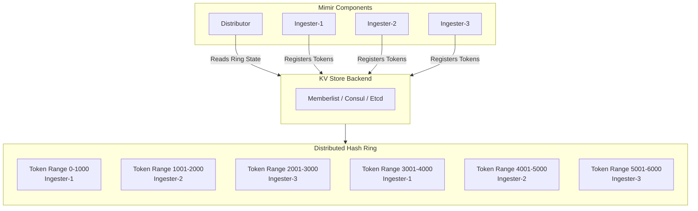
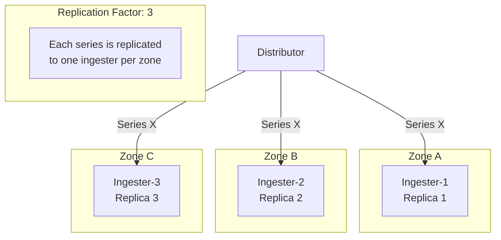

# How to Create Mimir Ring Configuration

Author: [nawazdhandala](https://github.com/nawazdhandala)

Tags: Mimir, Prometheus, Observability, HighAvailability

Description: A comprehensive guide to configuring Mimir's distributed hash ring for scalable and highly available metric storage.

---

## Introduction

Grafana Mimir uses a distributed hash ring to coordinate work among multiple instances of the same component. The ring allows Mimir components like ingesters, distributors, and compactors to discover each other and distribute data consistently across the cluster without requiring a central coordinator.

In this post, we will explore how to configure the Mimir ring for production deployments, covering KV store backends, replication factors, zone awareness, and heartbeat settings.

## Understanding the Hash Ring

The hash ring is a data structure that maps tokens to instances. Each instance in the ring owns a set of tokens, and incoming data is assigned to instances based on consistent hashing. This approach ensures:

- Even distribution of data across instances
- Minimal data movement when instances join or leave
- No single point of failure for coordination



## KV Store Backends

Mimir supports three KV store backends for ring coordination. Each has different trade-offs for complexity, performance, and operational overhead.

### Memberlist (Recommended for Most Deployments)

Memberlist uses a gossip protocol for peer-to-peer communication. It requires no external dependencies and scales well.

```yaml
# memberlist-ring-config.yaml
# Memberlist configuration for Mimir ring coordination
# This is the recommended approach for most deployments

# Common ring configuration shared by all components
common:
  ring:
    # Use memberlist as the KV store backend
    kvstore:
      store: memberlist

# Memberlist-specific configuration
memberlist:
  # Node name (defaults to hostname if not specified)
  node_name: "mimir-ingester-1"

  # Bind address for memberlist communication
  bind_addr: ["0.0.0.0"]
  bind_port: 7946

  # Advertise address (use this when behind NAT or in Kubernetes)
  advertise_addr: "10.0.0.1"
  advertise_port: 7946

  # Initial nodes to join (seed nodes for cluster discovery)
  join_members:
    - "mimir-ingester-0.mimir-ingester.mimir.svc.cluster.local:7946"
    - "mimir-ingester-1.mimir-ingester.mimir.svc.cluster.local:7946"
    - "mimir-ingester-2.mimir-ingester.mimir.svc.cluster.local:7946"

  # Maximum time to wait for joining the cluster
  max_join_backoff: 1m
  max_join_retries: 10

  # Cluster label to prevent cross-cluster communication
  cluster_label: "production-mimir"
  cluster_label_verification_disabled: false

  # Gossip settings for convergence speed vs network overhead
  gossip_interval: 200ms
  gossip_nodes: 3
  gossip_to_dead_nodes_time: 30s

  # Dead node detection settings
  dead_node_reclaim_time: 0s

  # Compression for gossip messages (reduces bandwidth)
  compression_enabled: true
```

### Consul Backend

Consul provides a centralized, strongly consistent KV store with built-in health checking.

```yaml
# consul-ring-config.yaml
# Consul configuration for Mimir ring coordination
# Use this when you already have Consul infrastructure

common:
  ring:
    kvstore:
      store: consul

      # Consul-specific configuration
      consul:
        # Consul server address
        host: "consul.service.consul:8500"

        # ACL token for authentication (if ACLs are enabled)
        acl_token: "${CONSUL_ACL_TOKEN}"

        # HTTP client timeout
        http_client_timeout: 20s

        # Consistency mode: default, consistent, or stale
        # "consistent" provides linearizable reads but higher latency
        # "stale" allows slightly stale reads but lower latency
        consistent_reads: false

        # Watch rate limit to prevent overwhelming Consul
        watch_rate_limit: 1.0
        watch_burst_size: 1

        # Key prefix for all ring keys
        # Useful for multi-tenant Consul clusters
        prefix: "mimir/rings/"
```

### Etcd Backend

Etcd offers strong consistency and is commonly used in Kubernetes environments.

```yaml
# etcd-ring-config.yaml
# Etcd configuration for Mimir ring coordination
# Ideal when running alongside Kubernetes which uses etcd

common:
  ring:
    kvstore:
      store: etcd

      # Etcd-specific configuration
      etcd:
        # Etcd endpoints (multiple for high availability)
        endpoints:
          - "https://etcd-0.etcd.mimir.svc.cluster.local:2379"
          - "https://etcd-1.etcd.mimir.svc.cluster.local:2379"
          - "https://etcd-2.etcd.mimir.svc.cluster.local:2379"

        # Dial timeout for initial connection
        dial_timeout: 10s

        # Maximum retries for failed operations
        max_retries: 10

        # TLS configuration for secure communication
        tls_enabled: true
        tls_cert_path: "/etc/mimir/certs/client.crt"
        tls_key_path: "/etc/mimir/certs/client.key"
        tls_ca_path: "/etc/mimir/certs/ca.crt"
        tls_server_name: "etcd.mimir.svc.cluster.local"

        # Authentication (if enabled)
        username: "mimir"
        password: "${ETCD_PASSWORD}"

        # Key prefix for ring data
        prefix: "/mimir/rings/"
```

## Replication Factor Configuration

The replication factor determines how many instances receive each piece of data. Higher replication provides better durability and read availability at the cost of increased storage and write latency.

```yaml
# replication-config.yaml
# Replication configuration for high availability

ingester:
  ring:
    # Number of ingesters that will receive each series
    # Recommended: 3 for production deployments
    replication_factor: 3

    # Number of tokens each ingester will own
    # More tokens = better distribution but slower ring operations
    # Recommended: 128 tokens per ingester
    num_tokens: 128

    # Minimum time an ingester must be in ACTIVE state
    # before it can receive write requests
    min_ready_duration: 15s

    # Wait this long for a LEAVING ingester to finish
    # flushing data before forcefully removing it
    final_sleep: 30s

distributor:
  ring:
    # Distributors also use a ring for rate limiting coordination
    kvstore:
      store: memberlist

ruler:
  ring:
    # Rulers use the ring to distribute rule groups
    kvstore:
      store: memberlist
    # Replication for ruler high availability
    replication_factor: 2
    num_tokens: 128

compactor:
  ring:
    # Compactors use the ring to coordinate compaction work
    kvstore:
      store: memberlist
    # Wait time before compactor becomes active
    wait_stability_min_duration: 1m
    wait_stability_max_duration: 5m
```

## Zone Awareness for Fault Tolerance

Zone awareness ensures replicas are distributed across different failure domains (availability zones, racks, or data centers).



```yaml
# zone-awareness-config.yaml
# Zone-aware configuration for multi-AZ deployments

# Common configuration that applies to all components
common:
  # Instance availability zone (set via environment variable or config)
  # This should be unique per failure domain
  instance_availability_zone: "${AVAILABILITY_ZONE}"

ingester:
  ring:
    # Enable zone awareness for replica placement
    zone_awareness_enabled: true

    # Replication factor must equal number of zones
    # for optimal distribution
    replication_factor: 3

    # Instance-specific configuration
    instance_id: "${POD_NAME}"
    instance_addr: "${POD_IP}"
    instance_port: 9095

    # Tokens configuration
    num_tokens: 128

    # Token generation strategy
    # "random" for new clusters
    # "spread-minimizing" for better distribution (requires planning)
    token_generation_strategy: random

    # Excluded zones (useful during maintenance)
    # excluded_zones:
    #   - "zone-c"

# Store-gateway zone awareness for queries
store_gateway:
  sharding_ring:
    zone_awareness_enabled: true
    replication_factor_for_each_tenant: 3

    # Unregistration on shutdown
    # Disable for faster restarts in stateful deployments
    unregister_on_shutdown: false
```

### Kubernetes Deployment with Zone Awareness

```yaml
# kubernetes-zone-aware-deployment.yaml
apiVersion: apps/v1
kind: StatefulSet
metadata:
  name: mimir-ingester
  namespace: mimir
spec:
  replicas: 9  # 3 replicas per zone x 3 zones
  selector:
    matchLabels:
      app: mimir-ingester
  template:
    metadata:
      labels:
        app: mimir-ingester
    spec:
      # Spread pods across zones
      topologySpreadConstraints:
        - maxSkew: 1
          topologyKey: topology.kubernetes.io/zone
          whenUnsatisfiable: DoNotSchedule
          labelSelector:
            matchLabels:
              app: mimir-ingester

      containers:
        - name: ingester
          image: grafana/mimir:2.14.0
          args:
            - "-target=ingester"
            - "-config.file=/etc/mimir/config.yaml"
          env:
            # Pass zone information to Mimir
            - name: AVAILABILITY_ZONE
              valueFrom:
                fieldRef:
                  fieldPath: metadata.labels['topology.kubernetes.io/zone']
            - name: POD_NAME
              valueFrom:
                fieldRef:
                  fieldPath: metadata.name
            - name: POD_IP
              valueFrom:
                fieldRef:
                  fieldPath: status.podIP
```

## Heartbeat and Timeout Configuration

Proper heartbeat and timeout settings are critical for cluster stability. Too aggressive settings cause unnecessary churn, while too relaxed settings delay failure detection.

```yaml
# heartbeat-timeout-config.yaml
# Heartbeat and timeout configuration for stable ring operations

ingester:
  ring:
    # How often the ingester sends heartbeats to the ring
    # Lower values = faster failure detection but more KV store load
    heartbeat_period: 15s

    # How long before an ingester is considered unhealthy
    # Should be at least 2-3x heartbeat_period
    heartbeat_timeout: 1m

    # Instance lifecycle states and timeouts
    # PENDING -> JOINING -> ACTIVE -> LEAVING -> (removed)

    # Time to wait in JOINING state before becoming ACTIVE
    join_after: 0s

    # Minimum time to remain in PENDING state
    min_ready_duration: 15s

    # Time to wait after receiving SIGTERM before leaving ring
    final_sleep: 30s

    # Observe the ring for this duration before considering it stable
    observe_period: 0s

# Global ring client configuration
ring:
  # How often to refresh the local ring state
  # from the KV store
  ring_check_period: 5s

# Memberlist-specific tuning for gossip protocol
memberlist:
  # Interval between gossip messages
  gossip_interval: 200ms

  # Number of random nodes to gossip to each interval
  gossip_nodes: 3

  # Time after which a dead node can be reclaimed
  dead_node_reclaim_time: 0s

  # Timeout for establishing TCP connections
  stream_timeout: 10s

  # Retransmit multiplier for reliable delivery
  # Higher values = more reliable but more bandwidth
  retransmit_factor: 4

  # Pull/push interval for full state sync
  pull_push_interval: 30s

  # Number of nodes to contact for indirect health checks
  indirect_checks: 3
```

## Complete Production Configuration Example

Here is a complete production-ready configuration combining all the concepts:

```yaml
# mimir-production-config.yaml
# Complete production configuration for Mimir ring

# Target can be: all, distributor, ingester, querier,
# query-frontend, query-scheduler, ruler, compactor, store-gateway
target: all

# Multi-tenancy configuration
multitenancy_enabled: true

# Common configuration shared across components
common:
  storage:
    backend: s3
    s3:
      endpoint: s3.amazonaws.com
      bucket_name: mimir-data
      region: us-east-1

  # Ring configuration used by multiple components
  ring:
    kvstore:
      store: memberlist

# Memberlist configuration for ring coordination
memberlist:
  node_name: "${POD_NAME}"
  bind_addr: ["0.0.0.0"]
  bind_port: 7946
  advertise_addr: "${POD_IP}"
  advertise_port: 7946

  # DNS-based discovery in Kubernetes
  join_members:
    - "dns+mimir-gossip-ring.mimir.svc.cluster.local:7946"

  # Cluster isolation
  cluster_label: "production"
  cluster_label_verification_disabled: false

  # Gossip tuning
  gossip_interval: 200ms
  gossip_nodes: 3
  pull_push_interval: 30s

  # Compression for reduced bandwidth
  compression_enabled: true

# Ingester configuration
ingester:
  ring:
    # Replication for durability
    replication_factor: 3

    # Zone awareness for fault tolerance
    zone_awareness_enabled: true

    # Token distribution
    num_tokens: 128

    # Instance identification
    instance_id: "${POD_NAME}"
    instance_addr: "${POD_IP}"
    instance_port: 9095
    instance_availability_zone: "${AVAILABILITY_ZONE}"

    # Heartbeat configuration
    heartbeat_period: 15s
    heartbeat_timeout: 1m

    # Lifecycle timing
    min_ready_duration: 15s
    final_sleep: 30s

    # KV store (inherits from common but can be overridden)
    kvstore:
      store: memberlist
      prefix: "collectors/"

# Distributor configuration
distributor:
  ring:
    instance_id: "${POD_NAME}"
    kvstore:
      store: memberlist
      prefix: "collectors/"

# Store-gateway configuration for queries
store_gateway:
  sharding_ring:
    replication_factor_for_each_tenant: 3
    zone_awareness_enabled: true
    instance_availability_zone: "${AVAILABILITY_ZONE}"
    kvstore:
      store: memberlist
      prefix: "collectors/"

    # Token count for store-gateway sharding
    tokens_file_path: "/data/tokens"

    # Heartbeat settings
    heartbeat_period: 15s
    heartbeat_timeout: 1m

# Compactor configuration
compactor:
  ring:
    kvstore:
      store: memberlist
      prefix: "collectors/"

    # Stability wait before starting compaction
    wait_stability_min_duration: 1m
    wait_stability_max_duration: 5m

    # Instance configuration
    instance_id: "${POD_NAME}"
    instance_addr: "${POD_IP}"
    heartbeat_period: 15s
    heartbeat_timeout: 1m

# Ruler configuration for alerting rules
ruler:
  ring:
    kvstore:
      store: memberlist
      prefix: "rulers/"

    # Ruler replication for HA alerting
    replication_factor: 2
    num_tokens: 128

    heartbeat_period: 15s
    heartbeat_timeout: 1m

    instance_id: "${POD_NAME}"
    instance_addr: "${POD_IP}"

# Limits configuration
limits:
  # Per-tenant limits
  ingestion_rate: 100000
  ingestion_burst_size: 200000
  max_series_per_user: 5000000
  max_series_per_metric: 50000

  # Replication factor for writes
  # Must match ingester.ring.replication_factor
  replication_factor: 3

# Server configuration
server:
  http_listen_port: 8080
  grpc_listen_port: 9095

  # Log configuration
  log_level: info
  log_format: json
```

## Monitoring Ring Health

Monitor these key metrics to ensure ring health:

```yaml
# Prometheus alerting rules for ring health monitoring

groups:
  - name: mimir-ring-alerts
    rules:
      # Alert when ingesters are unhealthy
      - alert: MimirIngesterUnhealthy
        expr: |
          cortex_ring_members{state="Unhealthy", name="ingester"} > 0
        for: 5m
        labels:
          severity: critical
        annotations:
          summary: "Mimir ingester is unhealthy"
          description: "{{ $value }} ingester(s) in unhealthy state"

      # Alert on uneven token distribution
      - alert: MimirIngesterTokensUnbalanced
        expr: |
          (
            max(cortex_ring_tokens{name="ingester"})
            /
            min(cortex_ring_tokens{name="ingester"})
          ) > 1.5
        for: 15m
        labels:
          severity: warning
        annotations:
          summary: "Mimir ingester tokens are unbalanced"

      # Alert when ring is not stable
      - alert: MimirRingMembersMismatch
        expr: |
          (
            cortex_ring_members{state="ACTIVE", name="ingester"}
            <
            cortex_ring_members{state="ACTIVE", name="ingester"} offset 5m
          )
        for: 10m
        labels:
          severity: warning
        annotations:
          summary: "Mimir ring membership is unstable"
```

## Troubleshooting Common Issues

### Ring Convergence Problems

If ring members are not converging, check:

1. Network connectivity between pods on the memberlist port
2. Cluster label mismatches preventing gossip
3. Firewall rules blocking gossip traffic

```bash
# Check memberlist connectivity
kubectl exec -it mimir-ingester-0 -- \
  wget -q -O- http://localhost:8080/memberlist

# View ring state
kubectl exec -it mimir-ingester-0 -- \
  wget -q -O- http://localhost:8080/ingester/ring
```

### Token Conflicts

Token conflicts occur when two instances claim the same token:

```yaml
# Prevent token conflicts with unique instance IDs
ingester:
  ring:
    # Ensure unique instance IDs
    instance_id: "${POD_NAME}"

    # Enable token file persistence for stateful deployments
    tokens_file_path: "/data/tokens"
```

### Slow Ring Updates

If ring updates are slow:

```yaml
# Tune for faster convergence (at cost of more bandwidth)
memberlist:
  gossip_interval: 100ms  # Faster gossip
  gossip_nodes: 5         # More nodes per gossip round
  pull_push_interval: 15s # More frequent full sync
```

## Summary

The Mimir ring is a critical component for distributed coordination. Key takeaways:

1. **Choose the right KV store**: Memberlist for simplicity, Consul or Etcd for existing infrastructure
2. **Set appropriate replication**: Use replication factor 3 for production durability
3. **Enable zone awareness**: Distribute replicas across failure domains
4. **Tune heartbeats carefully**: Balance failure detection speed against cluster stability
5. **Monitor ring health**: Track membership, token distribution, and convergence metrics

With proper ring configuration, Mimir can scale horizontally while maintaining high availability and consistent performance.

## References

- [Grafana Mimir Documentation](https://grafana.com/docs/mimir/latest/)
- [Mimir Ring Configuration Reference](https://grafana.com/docs/mimir/latest/configure/configuration-parameters/#ring)
- [Memberlist Library](https://github.com/hashicorp/memberlist)
- [Consistent Hashing Explained](https://en.wikipedia.org/wiki/Consistent_hashing)
