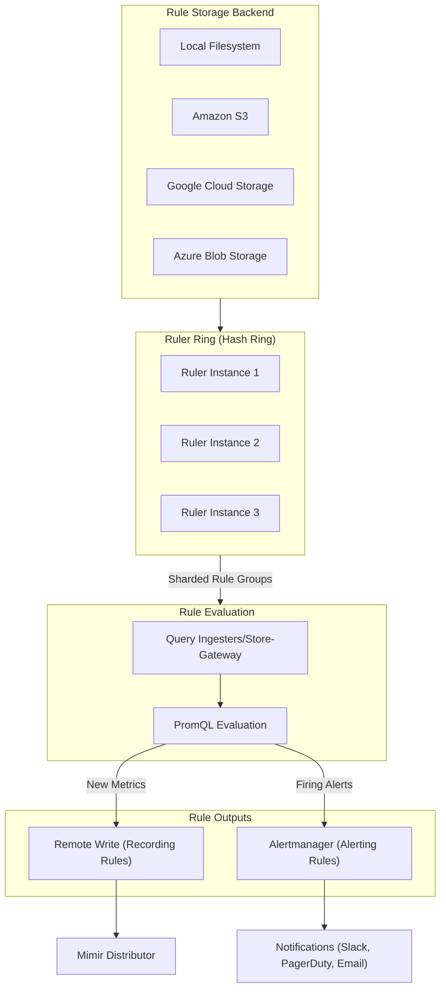

# How to Implement Mimir Ruler Configuration

Author: [nawazdhandala](https://github.com/nawazdhandala)

Tags: Mimir, Prometheus, Observability, Alerting

Description: Configure Grafana Mimir Ruler for scalable recording and alerting rules with rule sharding, storage backends, and Alertmanager integration.

---

## Introduction

Grafana Mimir is a highly scalable, long-term storage solution for Prometheus metrics. One of its most powerful components is the **Ruler**, which evaluates Prometheus-compatible recording and alerting rules at scale. This guide covers how to configure the Mimir Ruler for production deployments, including rule storage backends, Alertmanager integration, and rule group sharding across multiple ruler instances.

## What is the Mimir Ruler?

The Ruler is a Mimir component responsible for evaluating rules at configurable intervals. It supports two types of rules:

1. **Recording Rules** - Pre-compute expensive PromQL queries and store the results as new time series
2. **Alerting Rules** - Evaluate conditions and send alerts to Alertmanager when thresholds are breached

The Ruler is designed to scale horizontally, allowing you to distribute rule evaluation across multiple instances for high availability and performance.

## Rule Evaluation Flow

Here is how the Mimir Ruler processes and evaluates rules:



## Basic Ruler Configuration

The Ruler is configured in the main Mimir configuration file. Here is a minimal configuration to get started:

```yaml
# mimir-config.yaml
# Basic Ruler configuration for Grafana Mimir

ruler:
  # Enable the ruler component
  enabled: true

  # How often to evaluate rules
  evaluation_interval: 1m

  # How often to poll for rule changes
  poll_interval: 1m

  # Directory for temporary rule files
  rule_path: /data/mimir/rules

  # Alertmanager URL for sending alerts
  alertmanager_url: http://alertmanager:9093

  # Enable the ruler API for dynamic rule management
  enable_api: true

ruler_storage:
  # Storage backend for rules
  backend: filesystem
  filesystem:
    dir: /data/mimir/rules
```

## Configuring Rule Storage Backends

Mimir supports multiple storage backends for rule files. Choose based on your deployment environment and requirements.

### Local Filesystem Storage

Best for single-node deployments or development environments:

```yaml
# Local filesystem storage for ruler
ruler_storage:
  # Use filesystem backend
  backend: filesystem

  filesystem:
    # Directory containing rule files
    # Structure: <dir>/<tenant_id>/<rule_group>.yaml
    dir: /data/mimir/rules
```

### Amazon S3 Storage

Recommended for production deployments on AWS:

```yaml
# S3 storage configuration for ruler
ruler_storage:
  # Use S3 backend
  backend: s3

  s3:
    # S3 bucket name for storing rules
    bucket_name: my-mimir-rules-bucket

    # AWS region where the bucket is located
    region: us-east-1

    # Endpoint URL (leave empty for AWS, set for S3-compatible storage)
    # endpoint: http://minio:9000

    # Access credentials (prefer IAM roles in production)
    access_key_id: ${AWS_ACCESS_KEY_ID}
    secret_access_key: ${AWS_SECRET_ACCESS_KEY}

    # Use path-style URLs (required for MinIO)
    # s3_force_path_style: true

    # Server-side encryption
    sse:
      type: SSE-S3
```

### Google Cloud Storage

Recommended for GCP deployments:

```yaml
# GCS storage configuration for ruler
ruler_storage:
  # Use GCS backend
  backend: gcs

  gcs:
    # GCS bucket name
    bucket_name: my-mimir-rules-bucket

    # Path to service account JSON key file
    # Use GOOGLE_APPLICATION_CREDENTIALS env var alternatively
    service_account: /path/to/service-account.json
```

### Azure Blob Storage

Recommended for Azure deployments:

```yaml
# Azure Blob storage configuration for ruler
ruler_storage:
  # Use Azure backend
  backend: azure

  azure:
    # Storage account name
    account_name: mymimirrules

    # Storage account key
    account_key: ${AZURE_STORAGE_KEY}

    # Container name
    container_name: mimir-rules

    # Optional endpoint suffix for sovereign clouds
    # endpoint_suffix: blob.core.windows.net
```

## Writing Recording Rules

Recording rules pre-compute PromQL queries and store results as new time series. This improves query performance and reduces load.

### Recording Rule File Structure

```yaml
# rules/tenant-1/recording-rules.yaml
# Recording rules for pre-computing expensive queries

groups:
  # Group name for organizational purposes
  - name: aggregations
    # Evaluation interval for this group
    interval: 1m

    rules:
      # Record 5-minute request rate by service
      - record: service:http_requests:rate5m
        # PromQL expression to evaluate
        expr: |
          sum by (service) (
            rate(http_requests_total[5m])
          )

      # Record error rate percentage
      - record: service:http_error_rate:ratio5m
        expr: |
          sum by (service) (rate(http_requests_total{status=~"5.."}[5m]))
          /
          sum by (service) (rate(http_requests_total[5m]))

      # Record 99th percentile latency
      - record: service:http_latency_p99:5m
        expr: |
          histogram_quantile(0.99,
            sum by (service, le) (
              rate(http_request_duration_seconds_bucket[5m])
            )
          )

  - name: resource-usage
    interval: 1m
    rules:
      # Record CPU usage percentage by pod
      - record: pod:container_cpu_usage:rate5m
        expr: |
          sum by (pod, namespace) (
            rate(container_cpu_usage_seconds_total[5m])
          ) * 100

      # Record memory usage percentage
      - record: pod:container_memory_usage:percent
        expr: |
          sum by (pod, namespace) (container_memory_working_set_bytes)
          /
          sum by (pod, namespace) (container_spec_memory_limit_bytes)
          * 100
```

## Writing Alerting Rules

Alerting rules evaluate conditions and send alerts to Alertmanager when thresholds are breached.

### Alerting Rule File Structure

```yaml
# rules/tenant-1/alerting-rules.yaml
# Alerting rules for monitoring application health

groups:
  - name: availability-alerts
    # Evaluate every 30 seconds for faster detection
    interval: 30s

    rules:
      # Alert on high error rate
      - alert: HighErrorRate
        # PromQL expression that returns a value when condition is met
        expr: |
          sum by (service) (rate(http_requests_total{status=~"5.."}[5m]))
          /
          sum by (service) (rate(http_requests_total[5m]))
          > 0.05
        # Wait 5 minutes before firing to avoid flapping
        for: 5m
        # Labels added to the alert
        labels:
          severity: critical
          team: platform
        # Annotations provide additional context
        annotations:
          summary: "High error rate in {{ $labels.service }}"
          description: "Service {{ $labels.service }} has error rate of {{ $value | printf \"%.2f\" }}%"
          runbook_url: "https://wiki.example.com/runbooks/high-error-rate"
          dashboard_url: "https://grafana.example.com/d/service-overview?var-service={{ $labels.service }}"

      # Alert on service unavailability
      - alert: ServiceDown
        expr: up{job="my-service"} == 0
        for: 2m
        labels:
          severity: critical
          team: platform
        annotations:
          summary: "Service {{ $labels.instance }} is down"
          description: "The instance {{ $labels.instance }} has been unreachable for more than 2 minutes"

  - name: latency-alerts
    interval: 1m
    rules:
      # Alert on high latency
      - alert: HighLatency
        expr: |
          histogram_quantile(0.99,
            sum by (service, le) (
              rate(http_request_duration_seconds_bucket[5m])
            )
          ) > 2
        for: 10m
        labels:
          severity: warning
          team: backend
        annotations:
          summary: "High latency in {{ $labels.service }}"
          description: "99th percentile latency is {{ $value | printf \"%.2f\" }} seconds"

  - name: resource-alerts
    interval: 1m
    rules:
      # Alert on high memory usage
      - alert: HighMemoryUsage
        expr: |
          (
            container_memory_working_set_bytes
            /
            container_spec_memory_limit_bytes
          ) * 100 > 85
        for: 5m
        labels:
          severity: warning
          team: platform
        annotations:
          summary: "High memory usage in {{ $labels.pod }}"
          description: "Pod {{ $labels.pod }} is using {{ $value | printf \"%.1f\" }}% of its memory limit"

      # Alert on high CPU throttling
      - alert: HighCPUThrottling
        expr: |
          sum by (pod, namespace) (
            rate(container_cpu_cfs_throttled_periods_total[5m])
          )
          /
          sum by (pod, namespace) (
            rate(container_cpu_cfs_periods_total[5m])
          ) > 0.5
        for: 15m
        labels:
          severity: warning
          team: platform
        annotations:
          summary: "High CPU throttling in {{ $labels.pod }}"
          description: "Pod {{ $labels.pod }} is being throttled {{ $value | printf \"%.0f\" }}% of the time"
```

## Alertmanager Integration

Configure how the Ruler sends alerts to Alertmanager:

```yaml
# Ruler configuration with Alertmanager integration
ruler:
  # Alertmanager endpoints (comma-separated for HA)
  alertmanager_url: http://alertmanager-0:9093,http://alertmanager-1:9093

  # How often to refresh Alertmanager endpoints
  alertmanager_refresh_interval: 1m

  # Enable Alertmanager API v2 (recommended)
  enable_alertmanager_v2: true

  # External URL for links in alert notifications
  external_url: https://mimir.example.com

  # External labels added to all alerts
  external_labels:
    cluster: production
    environment: prod
    region: us-east-1

  # Notification queue settings
  notification_queue_capacity: 10000
  notification_timeout: 10s

  # For Mimir's built-in Alertmanager (if using)
  alertmanager_client:
    # Enable TLS for Alertmanager connections
    tls_enabled: false
    # Basic auth credentials
    # basic_auth_username: ruler
    # basic_auth_password: ${ALERTMANAGER_PASSWORD}
```

## Rule Group Sharding Across Rulers

When running multiple Ruler instances, Mimir uses a hash ring to distribute rule groups across instances. This provides horizontal scalability and high availability.

```yaml
# Ruler ring configuration for sharding
ruler:
  # Enable rule sharding across ruler instances
  enable_sharding: true

  # Sharding strategy: default or shuffle-sharding
  sharding_strategy: default

  ring:
    # Key-value store for the ring
    kvstore:
      # Options: consul, etcd, memberlist
      store: memberlist

      # For Consul backend
      # consul:
      #   host: consul:8500

      # For etcd backend
      # etcd:
      #   endpoints:
      #     - etcd-0:2379
      #     - etcd-1:2379
      #     - etcd-2:2379

    # How often to send heartbeats
    heartbeat_period: 5s

    # How long before considering an instance unhealthy
    heartbeat_timeout: 1m

    # Instance identification
    instance_id: ${HOSTNAME}
    instance_addr: ${POD_IP}:9095

    # Number of rulers that evaluate each rule group
    # Higher values provide redundancy but increase resource usage
    replication_factor: 1
```

### Memberlist Configuration for Ruler Ring

```yaml
# Memberlist configuration for ruler ring discovery
memberlist:
  # Node name (must be unique)
  node_name: ${HOSTNAME}

  # Bind address for gossip protocol
  bind_addr:
    - 0.0.0.0
  bind_port: 7946

  # Join existing cluster members
  join_members:
    - mimir-ruler-0.mimir-ruler-headless:7946
    - mimir-ruler-1.mimir-ruler-headless:7946
    - mimir-ruler-2.mimir-ruler-headless:7946

  # Leave timeout when shutting down
  leave_timeout: 5s

  # Message compression
  compression_enabled: true
```

## Complete Production Configuration

Here is a full production-ready Mimir Ruler configuration:

```yaml
# mimir-config.yaml
# Production Mimir configuration with Ruler enabled

# Enable multi-tenancy
multitenancy_enabled: true

# Server configuration
server:
  http_listen_port: 8080
  grpc_listen_port: 9095

# Ruler component configuration
ruler:
  # Enable the ruler
  enabled: true

  # Rule evaluation settings
  evaluation_interval: 1m
  poll_interval: 1m

  # Temporary directory for rule files
  rule_path: /data/mimir/rules-temp

  # Alertmanager configuration
  alertmanager_url: http://alertmanager:9093
  alertmanager_refresh_interval: 1m
  enable_alertmanager_v2: true
  alertmanager_client:
    tls_enabled: false

  # External URL for alert links
  external_url: https://mimir.example.com

  # External labels for all alerts
  external_labels:
    cluster: production
    env: prod

  # Enable ruler API
  enable_api: true

  # Ring configuration for HA
  ring:
    kvstore:
      store: memberlist
    heartbeat_period: 5s
    heartbeat_timeout: 1m
    instance_addr: ${POD_IP}:9095

  # Enable sharding for distributed evaluation
  enable_sharding: true
  sharding_strategy: default

  # Query configuration
  query_frontend:
    address: mimir-query-frontend:9095
  query_stats_enabled: true

  # Ruler storage configuration
  tenant_federation:
    enabled: false

# Rule storage backend configuration
ruler_storage:
  backend: s3

  s3:
    bucket_name: mimir-rules
    region: us-east-1
    access_key_id: ${AWS_ACCESS_KEY_ID}
    secret_access_key: ${AWS_SECRET_ACCESS_KEY}

  # Cache configuration for rules
  cache:
    backend: memcached
    memcached:
      addresses: memcached:11211
      timeout: 500ms

# Limits configuration
limits:
  # Maximum rules per tenant
  ruler_max_rules_per_rule_group: 20
  ruler_max_rule_groups_per_tenant: 70

  # Evaluation concurrency
  ruler_evaluation_delay_duration: 1m

  # Remote write limits for recording rules
  ruler_remote_write_headers: {}

# Memberlist configuration
memberlist:
  node_name: ${HOSTNAME}
  bind_port: 7946
  join_members:
    - mimir-ruler-headless:7946
  compression_enabled: true
```

## Managing Rules via API

The Ruler API allows dynamic rule management without restarting:

```bash
# List all rule groups for a tenant
curl -H "X-Scope-OrgID: tenant-1" \
  http://localhost:8080/prometheus/config/v1/rules

# Get rules for a specific namespace
curl -H "X-Scope-OrgID: tenant-1" \
  http://localhost:8080/prometheus/config/v1/rules/my-namespace

# Upload rules to a namespace
curl -X POST -H "X-Scope-OrgID: tenant-1" \
  -H "Content-Type: application/yaml" \
  --data-binary @my-rules.yaml \
  http://localhost:8080/prometheus/config/v1/rules/my-namespace

# Delete a rule group
curl -X DELETE -H "X-Scope-OrgID: tenant-1" \
  http://localhost:8080/prometheus/config/v1/rules/my-namespace/my-rule-group

# List all alerts (active and pending)
curl -H "X-Scope-OrgID: tenant-1" \
  http://localhost:8080/prometheus/api/v1/alerts

# List rule evaluation status
curl -H "X-Scope-OrgID: tenant-1" \
  http://localhost:8080/prometheus/api/v1/rules
```

## Kubernetes Deployment Example

Deploy the Ruler as part of a Mimir cluster in Kubernetes:

```yaml
# mimir-ruler-deployment.yaml
apiVersion: apps/v1
kind: StatefulSet
metadata:
  name: mimir-ruler
  namespace: mimir
spec:
  serviceName: mimir-ruler-headless
  replicas: 3
  selector:
    matchLabels:
      app: mimir-ruler
  template:
    metadata:
      labels:
        app: mimir-ruler
    spec:
      containers:
        - name: ruler
          image: grafana/mimir:2.11.0
          args:
            - -target=ruler
            - -config.file=/etc/mimir/mimir.yaml
          ports:
            - name: http
              containerPort: 8080
            - name: grpc
              containerPort: 9095
            - name: memberlist
              containerPort: 7946
          env:
            - name: POD_IP
              valueFrom:
                fieldRef:
                  fieldPath: status.podIP
            - name: HOSTNAME
              valueFrom:
                fieldRef:
                  fieldPath: metadata.name
          volumeMounts:
            - name: config
              mountPath: /etc/mimir
            - name: data
              mountPath: /data/mimir
          resources:
            requests:
              cpu: 500m
              memory: 512Mi
            limits:
              cpu: 2000m
              memory: 2Gi
          livenessProbe:
            httpGet:
              path: /ready
              port: http
            initialDelaySeconds: 30
          readinessProbe:
            httpGet:
              path: /ready
              port: http
      volumes:
        - name: config
          configMap:
            name: mimir-config
  volumeClaimTemplates:
    - metadata:
        name: data
      spec:
        accessModes: ["ReadWriteOnce"]
        resources:
          requests:
            storage: 10Gi
---
# Headless service for memberlist discovery
apiVersion: v1
kind: Service
metadata:
  name: mimir-ruler-headless
  namespace: mimir
spec:
  type: ClusterIP
  clusterIP: None
  selector:
    app: mimir-ruler
  ports:
    - name: http
      port: 8080
    - name: grpc
      port: 9095
    - name: memberlist
      port: 7946
```

## Troubleshooting

### Common Issues and Solutions

1. **Rules not being loaded**
   - Verify the storage backend configuration is correct
   - Check that rule files follow the correct directory structure: `<tenant_id>/<namespace>.yaml`
   - Review Mimir logs for parsing errors

2. **Alerts not firing**
   - Confirm Alertmanager URL is reachable from ruler pods
   - Verify the PromQL expression manually using the query API
   - Check the `for` duration is not too long for your use case

3. **Rule sharding not working**
   - Ensure all ruler instances can communicate via memberlist
   - Verify the ring configuration is consistent across instances
   - Check that `enable_sharding: true` is set

4. **High evaluation latency**
   - Reduce the number of rules per group
   - Increase ruler replicas and enable sharding
   - Optimize complex PromQL expressions

### Useful Metrics for Monitoring

```promql
# Rule evaluation duration (99th percentile)
histogram_quantile(0.99,
  sum by (le) (
    rate(cortex_ruler_rule_evaluation_duration_seconds_bucket[5m])
  )
)

# Failed rule evaluations
sum by (rule_group) (
  rate(cortex_ruler_rule_evaluation_failures_total[5m])
)

# Alerts sent to Alertmanager
sum by (status) (
  rate(cortex_ruler_notifications_sent_total[5m])
)

# Number of rule groups per ruler instance
sum by (instance) (cortex_ruler_managers_total)

# Rules loaded per tenant
sum by (user) (cortex_ruler_rule_group_rules)
```

## Conclusion

The Mimir Ruler is a powerful component that enables scalable alerting and recording rule evaluation for Prometheus-compatible metrics. By distributing rule evaluation across multiple instances using the hash ring, you can achieve both high availability and horizontal scalability.

Key takeaways:
- Choose the appropriate storage backend based on your deployment environment
- Use recording rules to pre-compute expensive queries and improve dashboard performance
- Configure rule sharding when running multiple ruler instances for high availability
- Integrate with Alertmanager for flexible notification routing
- Use the Ruler API for dynamic rule management in CI/CD pipelines

Start with simple alerting rules for critical metrics and gradually build your rule library as you identify patterns that require monitoring.
