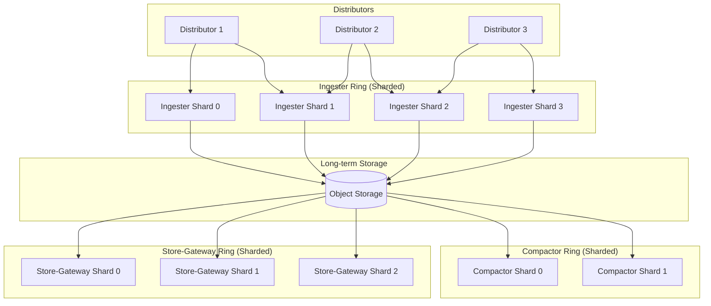
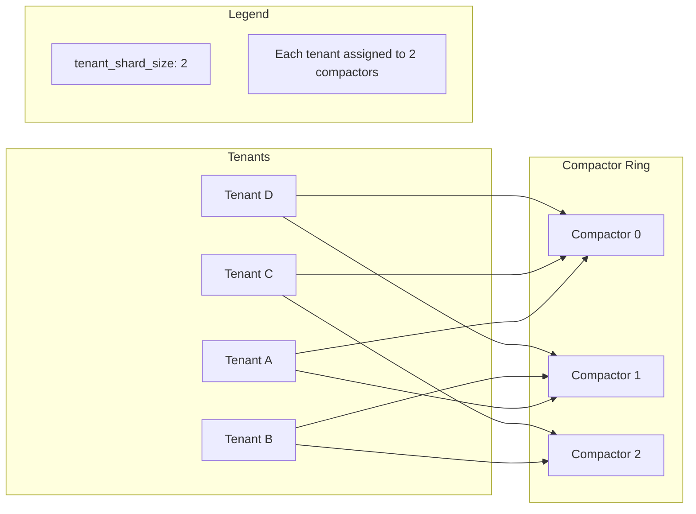
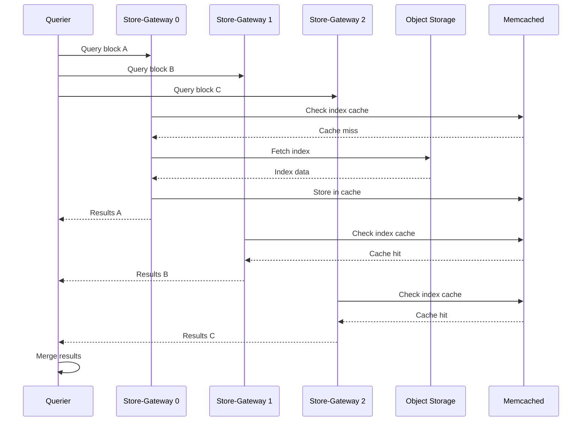
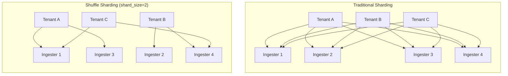

# How to Build Mimir Sharding

Author: [nawazdhandala](https://github.com/nawazdhandala)

Tags: Mimir, Prometheus, Observability, Scalability

Description: A practical guide to configuring Mimir sharding strategies for horizontal scalability and multi-tenant isolation.

---

Grafana Mimir stores billions of active time series by distributing load across shards. Without sharding, a single instance would buckle under ingestion pressure and query fan-out. With the right sharding configuration, you can scale horizontally, isolate tenants, and keep query latency predictable.

This guide walks through the sharding strategies for ingesters, compactors, store-gateways, and shuffle sharding for tenant isolation. Each section includes practical configuration examples you can adapt to your cluster.

## Why Sharding Matters in Mimir

Mimir breaks the monolithic Prometheus model by separating write, read, and storage paths. Each component can scale independently, but only if data is distributed evenly. Sharding ensures:

- **Even load distribution** across replicas
- **Parallel query execution** for faster results
- **Tenant isolation** so noisy neighbors do not degrade service
- **Fault tolerance** when nodes fail

The following diagram shows how series flow through sharded components:



## Ingester Sharding Strategies

Ingesters hold recent samples in memory before flushing to object storage. The hash ring distributes series across ingester shards using consistent hashing on series labels.

### Basic Ingester Ring Configuration

```yaml
# mimir-config.yaml
# Ingester ring configuration for sharded distribution

ingester:
  ring:
    # Number of virtual tokens per ingester
    # Higher values give better distribution but slower ring convergence
    num_tokens: 512

    # Replication factor determines how many ingesters receive each series
    # Set to 3 for production fault tolerance
    replication_factor: 3

    # Heartbeat interval for ring membership
    heartbeat_period: 15s
    heartbeat_timeout: 1m

    # Zone awareness spreads replicas across failure domains
    zone_awareness_enabled: true

    # Key-value store for ring state
    kvstore:
      store: memberlist
      memberlist:
        join_members:
          - mimir-gossip-ring.mimir.svc.cluster.local:7946

  # Instance-specific configuration
  instance_limits:
    # Maximum series per ingester shard
    max_series: 1500000
    # Maximum ingestion rate per shard (samples/sec)
    max_ingestion_rate: 100000
```

### Zone-Aware Sharding

Zone awareness ensures replicas land in different availability zones. This prevents a single zone failure from causing data loss.

```yaml
# Zone-aware ingester deployment
# Each ingester declares its zone via configuration

ingester:
  ring:
    zone_awareness_enabled: true
    # Require replicas in different zones before acknowledging writes
    excluded_zones: ""

  # Set via environment variable or command line per instance
  # -ingester.ring.instance-availability-zone=zone-a
```

Deploy ingesters with zone labels:

```yaml
# Kubernetes StatefulSet excerpt for zone-a ingesters
apiVersion: apps/v1
kind: StatefulSet
metadata:
  name: mimir-ingester-zone-a
spec:
  replicas: 4
  template:
    spec:
      # Pin to zone-a nodes
      nodeSelector:
        topology.kubernetes.io/zone: zone-a
      containers:
        - name: ingester
          args:
            - -target=ingester
            - -ingester.ring.instance-availability-zone=zone-a
            - -ingester.ring.zone-awareness-enabled=true
```

### Ingester Shard Sizing

Calculate the number of ingester shards based on total series and per-instance limits:

```
total_ingesters = (total_active_series * replication_factor) / max_series_per_ingester
```

For 10 million active series with replication factor 3 and 1.5 million series per ingester:

```
total_ingesters = (10,000,000 * 3) / 1,500,000 = 20 ingesters
```

## Compactor Sharding Configuration

Compactors merge small blocks into larger ones and handle retention. Without sharding, a single compactor becomes a bottleneck for tenants with high block counts.

### Enabling Compactor Sharding

```yaml
# mimir-config.yaml
# Compactor sharding distributes tenants across compactor instances

compactor:
  # Enable sharding to distribute compaction work
  sharding_enabled: true

  # Ring configuration for compactor coordination
  ring:
    kvstore:
      store: memberlist
      memberlist:
        join_members:
          - mimir-gossip-ring.mimir.svc.cluster.local:7946

    # Wait time before compactor claims ownership after startup
    wait_stability_min_duration: 1m
    wait_stability_max_duration: 5m

  # Compaction settings
  block_ranges: [2h, 12h, 24h]

  # Number of parallel compaction operations per compactor
  compaction_concurrency: 4

  # Tenant-level sharding assigns each tenant to specific compactors
  # This prevents multiple compactors from competing for the same tenant
  tenant_shard_size: 2
```

### Compactor Shard Distribution

The following diagram shows how tenants are distributed across compactor shards:



### Compactor Cleanup Configuration

```yaml
compactor:
  # Enable cleanup of deleted blocks
  deletion_delay: 12h

  # Retention enforcement
  retention_enabled: true

  # Cleanup interval for partial uploads and failed compactions
  cleanup_interval: 15m

  # Maximum number of blocks to compact in one operation
  max_compaction_time: 1h
```

## Store-Gateway Sharding

Store-gateways lazy-load block indexes and chunks from object storage. Sharding distributes blocks across gateways for parallel query execution.

### Store-Gateway Ring Configuration

```yaml
# mimir-config.yaml
# Store-gateway sharding for distributed block access

store_gateway:
  # Enable sharding across store-gateway instances
  sharding_enabled: true

  # Replication ensures blocks are available during node failures
  sharding_ring:
    replication_factor: 3

    # Tokens determine block ownership
    num_tokens: 512

    kvstore:
      store: memberlist
      memberlist:
        join_members:
          - mimir-gossip-ring.mimir.svc.cluster.local:7946

    # Zone awareness for store-gateways
    zone_awareness_enabled: true

    # Wait for ring stability before serving queries
    wait_stability_min_duration: 1m
```

### Block Caching Strategy

Store-gateways cache index headers and chunks. Configure caching for your workload:

```yaml
blocks_storage:
  # Object storage backend
  backend: s3
  s3:
    bucket_name: mimir-blocks
    endpoint: s3.amazonaws.com
    region: us-east-1

  bucket_store:
    # Index header caching reduces object storage reads
    index_header_lazy_loading_enabled: true
    index_header_lazy_loading_idle_timeout: 1h

    # Sync interval for discovering new blocks
    sync_interval: 15m

    # In-memory cache for index headers
    index_cache:
      backend: memcached
      memcached:
        addresses: dns+mimir-index-cache.mimir.svc.cluster.local:11211
        max_item_size: 5242880
        timeout: 500ms

    # Chunks cache for query acceleration
    chunks_cache:
      backend: memcached
      memcached:
        addresses: dns+mimir-chunks-cache.mimir.svc.cluster.local:11211
        max_item_size: 1048576
        timeout: 500ms
```

### Store-Gateway Query Path



## Shuffle Sharding for Tenant Isolation

Shuffle sharding assigns each tenant to a random subset of instances. This isolates tenants from each other's failures and prevents noisy neighbors from degrading the entire cluster.

### How Shuffle Sharding Works

Traditional sharding uses all available instances for every tenant. Shuffle sharding picks a consistent random subset per tenant:



With shuffle sharding, if Ingester 2 fails:
- Traditional: All tenants affected
- Shuffle: Only Tenant B affected

### Configuring Shuffle Sharding

```yaml
# mimir-config.yaml
# Shuffle sharding configuration for tenant isolation

# Global limits applied to all tenants
limits:
  # Number of ingesters each tenant uses
  # Set to 0 to use all available ingesters (disable shuffle sharding)
  ingestion_tenant_shard_size: 3

  # Number of store-gateways each tenant uses
  store_gateway_tenant_shard_size: 3

  # Number of compactors each tenant uses
  compactor_tenant_shard_size: 2

  # Number of rulers each tenant uses for rule evaluation
  ruler_tenant_shard_size: 2
```

### Per-Tenant Override Configuration

Different tenants may need different shard sizes based on their volume:

```yaml
# runtime-config.yaml
# Per-tenant overrides for shuffle sharding

overrides:
  # High-volume tenant gets more shards
  tenant-large-corp:
    ingestion_tenant_shard_size: 8
    store_gateway_tenant_shard_size: 6
    max_global_series_per_user: 5000000

  # Small tenant uses fewer resources
  tenant-startup:
    ingestion_tenant_shard_size: 2
    store_gateway_tenant_shard_size: 2
    max_global_series_per_user: 100000

  # Default for unlisted tenants inherits from global limits
```

Load the runtime configuration:

```yaml
# mimir-config.yaml
runtime_config:
  file: /etc/mimir/runtime-config.yaml
  period: 10s
```

### Calculating Shuffle Shard Size

The blast radius probability helps determine shard size. For a cluster with N instances and shard size S, the probability that two random tenants share at least one instance is:

```
P(overlap) = 1 - (C(N-S, S) / C(N, S))
```

Practical guidelines:
- **shard_size = 3**: Good isolation for most workloads
- **shard_size = replication_factor**: Minimum for fault tolerance
- **shard_size = N/10**: Reasonable for very large clusters

```yaml
# Example: 20 ingesters, replication factor 3
# Minimum shard size = 3 (matches replication)
# Recommended = 3-5 for good isolation with headroom

limits:
  ingestion_tenant_shard_size: 4
```

## Complete Sharding Example

Here is a complete configuration combining all sharding strategies:

```yaml
# mimir-config.yaml
# Complete sharding configuration for production deployment

# Target components to run (set per deployment)
target: all

# Memberlist for ring coordination
memberlist:
  join_members:
    - dns+mimir-gossip-ring.mimir.svc.cluster.local:7946
  bind_port: 7946

# Distributor configuration
distributor:
  ring:
    kvstore:
      store: memberlist

# Ingester sharding
ingester:
  ring:
    num_tokens: 512
    replication_factor: 3
    heartbeat_period: 15s
    heartbeat_timeout: 1m
    zone_awareness_enabled: true
    kvstore:
      store: memberlist

  instance_limits:
    max_series: 1500000
    max_ingestion_rate: 100000

# Compactor sharding
compactor:
  sharding_enabled: true
  ring:
    kvstore:
      store: memberlist
    wait_stability_min_duration: 1m
  compaction_concurrency: 4

# Store-gateway sharding
store_gateway:
  sharding_enabled: true
  sharding_ring:
    replication_factor: 3
    num_tokens: 512
    zone_awareness_enabled: true
    kvstore:
      store: memberlist

# Query-frontend for query parallelization
query_frontend:
  # Split queries by time interval for parallel execution
  split_queries_by_interval: 24h

  # Maximum parallelism per query
  max_outstanding_requests_per_tenant: 100

# Query-scheduler for query distribution
query_scheduler:
  # Maximum outstanding queries
  max_outstanding_requests_per_tenant: 100

# Blocks storage configuration
blocks_storage:
  backend: s3
  s3:
    bucket_name: mimir-blocks
    endpoint: s3.amazonaws.com
    region: us-east-1

  bucket_store:
    sync_interval: 15m
    index_cache:
      backend: memcached
      memcached:
        addresses: dns+mimir-index-cache.mimir.svc.cluster.local:11211
    chunks_cache:
      backend: memcached
      memcached:
        addresses: dns+mimir-chunks-cache.mimir.svc.cluster.local:11211

# Global limits with shuffle sharding
limits:
  # Shuffle sharding sizes
  ingestion_tenant_shard_size: 4
  store_gateway_tenant_shard_size: 4
  compactor_tenant_shard_size: 2
  ruler_tenant_shard_size: 2

  # Ingestion limits
  ingestion_rate: 100000
  ingestion_burst_size: 1000000
  max_global_series_per_user: 1500000
  max_global_series_per_metric: 50000

  # Query limits
  max_fetched_series_per_query: 100000
  max_fetched_chunks_per_query: 2000000

# Runtime configuration for per-tenant overrides
runtime_config:
  file: /etc/mimir/runtime-config.yaml
  period: 10s
```

## Monitoring Shard Health

Deploy these recording rules to monitor shard distribution:

```yaml
# mimir-shard-monitoring.yaml
groups:
  - name: mimir-sharding
    rules:
      # Track series distribution across ingesters
      - record: mimir:ingester_series_per_shard
        expr: |
          sum by (instance) (
            cortex_ingester_memory_series
          )

      # Alert on uneven distribution (>20% deviation from mean)
      - alert: MimirIngesterUnbalancedShards
        expr: |
          (
            max(cortex_ingester_memory_series)
            /
            avg(cortex_ingester_memory_series)
          ) > 1.2
        for: 30m
        labels:
          severity: warning
        annotations:
          summary: Ingester shards are unbalanced

      # Track compactor ownership
      - record: mimir:compactor_tenants_per_shard
        expr: |
          sum by (instance) (
            cortex_compactor_tenants_owned
          )

      # Track store-gateway block distribution
      - record: mimir:store_gateway_blocks_per_shard
        expr: |
          sum by (instance) (
            cortex_bucket_store_blocks_loaded
          )
```

## Scaling Decisions

Use these guidelines when scaling shards:

| Signal | Action |
|--------|--------|
| Ingester memory > 80% | Add ingester replicas |
| Ingester CPU > 70% | Add ingester replicas |
| Query latency p99 > 10s | Add store-gateway replicas or increase cache |
| Compaction backlog growing | Add compactor replicas |
| Ring rebalancing frequent | Increase num_tokens or stabilize infrastructure |

## Summary

Mimir sharding transforms a single-instance bottleneck into a horizontally scalable system. The key strategies are:

1. **Ingester sharding** with consistent hashing and zone awareness for fault-tolerant writes
2. **Compactor sharding** to parallelize block compaction across tenants
3. **Store-gateway sharding** with caching for fast parallel queries
4. **Shuffle sharding** for tenant isolation and blast radius reduction

Start with conservative shard sizes matching your replication factor, monitor distribution metrics, and scale based on resource utilization. The configuration examples in this guide provide a solid foundation for production Mimir deployments.
