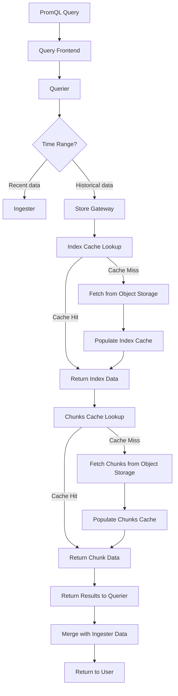
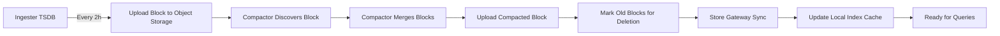

# How to Create Mimir Store Gateway

Author: [nawazdhandala](https://github.com/nawazdhandala)

Tags: Mimir, Prometheus, Observability, Storage

Description: Configure and operate Mimir Store Gateway for efficient long-term metrics storage queries from object storage backends.

---

Prometheus is excellent at recent metrics, but when you need to query weeks or months of historical data, you need a scalable long-term storage layer. Grafana Mimir solves this with its Store Gateway component, which serves queries directly from object storage without loading everything into memory. This guide walks through configuring the Store Gateway, optimizing caching, and understanding how queries flow through the system.

## What the Store Gateway Does

The Store Gateway is the component in Mimir that handles queries against historical data stored in object storage (S3, GCS, Azure Blob, or MinIO). When a query arrives that spans older time ranges, the querier routes the request to the store gateway, which:

1. Downloads and caches block index files from object storage
2. Finds the relevant series and chunks using the index
3. Fetches chunk data and returns it to the querier

This architecture means you can store petabytes of metrics affordably in object storage while still running PromQL queries against them.

## Query Flow Through Store Gateway



## Basic Store Gateway Configuration

Here is a minimal configuration to get the store gateway running with S3-compatible object storage:

```yaml
# store-gateway-config.yaml
# Basic Mimir Store Gateway configuration for production use

target: store-gateway

# Object storage configuration for blocks
blocks_storage:
  backend: s3
  s3:
    endpoint: s3.us-east-1.amazonaws.com
    bucket_name: mimir-blocks
    region: us-east-1
    # Use IAM roles in production instead of static credentials
    # access_key_id: ${AWS_ACCESS_KEY_ID}
    # secret_access_key: ${AWS_SECRET_ACCESS_KEY}

  # Block sync configuration
  bucket_store:
    # How often to scan object storage for new blocks
    sync_dir: /data/tsdb-sync
    sync_interval: 15m

    # Ignore blocks older than this (reduces sync overhead)
    ignore_blocks_within: 10h

# Server configuration
server:
  http_listen_port: 8080
  grpc_listen_port: 9095

# Ring configuration for store gateway sharding
store_gateway:
  sharding_ring:
    replication_factor: 3
    # Use memberlist for service discovery
    kvstore:
      store: memberlist
    # Tokens control how blocks are distributed
    tokens_file_path: /data/store-gateway-tokens
```

## Block Synchronization from Object Storage

The store gateway periodically syncs metadata from object storage to understand which blocks exist and where to find them. Proper tuning prevents both stale data and excessive API calls.

```yaml
# block-sync-config.yaml
# Detailed block synchronization settings

blocks_storage:
  bucket_store:
    # Directory for local block metadata cache
    sync_dir: /data/tsdb-sync

    # Sync interval balances freshness vs API costs
    # Shorter intervals mean faster visibility of new blocks
    # Longer intervals reduce S3/GCS API calls
    sync_interval: 15m

    # Skip recently created blocks (still being written by compactor)
    # Should be greater than compactor upload time
    ignore_blocks_within: 10h

    # Limit concurrent block syncs to avoid overwhelming storage
    max_concurrent_blocks_sync: 20

    # Meta sync configuration
    meta_sync_concurrency: 20

    # Block discovery handles finding new and deleted blocks
    block_sync_concurrency: 20

    # Tenant sync settings for multi-tenant deployments
    tenant_sync_concurrency: 10
```

### Understanding Block Lifecycle



## Index Caching Configuration

Index caching is critical for query performance. The index contains pointers to all series and their chunks. Without caching, every query would require fetching index data from object storage.

```yaml
# index-cache-config.yaml
# In-memory index cache configuration

blocks_storage:
  bucket_store:
    index_cache:
      backend: inmemory
      inmemory:
        # Maximum size of the in-memory index cache
        # Size this based on your unique series count
        max_size_bytes: 2147483648  # 2GB

    # Index header configuration
    # Index headers are memory-mapped for fast access
    index_header:
      # Lazy loading reduces startup time
      lazy_loading_enabled: true
      # Idle timeout for lazy loaded index headers
      lazy_loading_idle_timeout: 1h
```

### Using Memcached for Index Cache

For larger deployments, use Memcached to share the index cache across store gateway instances:

```yaml
# memcached-index-cache.yaml
# Memcached backend for index cache (recommended for production)

blocks_storage:
  bucket_store:
    index_cache:
      backend: memcached
      memcached:
        addresses: dns+memcached-index.mimir.svc.cluster.local:11211
        # Maximum connections per server
        max_idle_connections: 100
        # Request timeout
        timeout: 500ms
        # Maximum async concurrency
        max_async_concurrency: 50
        # Maximum async buffer size
        max_async_buffer_size: 100000
        # Maximum item size (index entries can be large)
        max_item_size: 5242880  # 5MB
```

## Bucket (Chunks) Caching

Chunks cache stores the actual time series data. This cache has a different access pattern than index cache, with more sequential reads.

```yaml
# chunks-cache-config.yaml
# Memcached backend for chunks cache

blocks_storage:
  bucket_store:
    chunks_cache:
      backend: memcached
      memcached:
        addresses: dns+memcached-chunks.mimir.svc.cluster.local:11211
        max_idle_connections: 100
        timeout: 500ms
        max_async_concurrency: 50
        max_async_buffer_size: 100000
        # Chunks are typically smaller than index entries
        max_item_size: 1048576  # 1MB

    # Control chunk fetching behavior
    max_chunk_pool_bytes: 2147483648  # 2GB pool for chunk data

    # Chunk selection strategy
    chunk_ranges_per_series: 1
```

### Metadata Cache

A third cache type handles bucket metadata (block.json files, tenant indices):

```yaml
# metadata-cache-config.yaml
# Metadata cache for block discovery information

blocks_storage:
  bucket_store:
    metadata_cache:
      backend: memcached
      memcached:
        addresses: dns+memcached-metadata.mimir.svc.cluster.local:11211
        max_idle_connections: 50
        timeout: 500ms
        max_item_size: 1048576  # 1MB
```

## Sharding and Replication Settings

Store gateways form a ring to distribute blocks across instances. Each block is assigned to multiple gateways based on the replication factor.

```yaml
# sharding-config.yaml
# Store gateway sharding configuration for high availability

store_gateway:
  sharding_ring:
    # Number of gateways that should load each block
    # Higher values improve query availability but increase memory usage
    replication_factor: 3

    # Heartbeat settings for ring membership
    heartbeat_period: 15s
    heartbeat_timeout: 1m

    # Wait for ring stability before serving requests
    wait_stability_min_duration: 1m
    wait_stability_max_duration: 5m

    # Token configuration
    # More tokens means finer-grained block distribution
    tokens_file_path: /data/store-gateway-tokens
    num_tokens: 512

    # Service discovery backend
    kvstore:
      store: memberlist
      prefix: store-gateway/

    # Instance identification
    instance_interface_names:
      - eth0
      - en0
```

### Zone-Aware Replication

For multi-zone deployments, configure zone awareness to ensure replicas are spread across failure domains:

```yaml
# zone-aware-config.yaml
# Zone-aware replication for high availability

store_gateway:
  sharding_ring:
    replication_factor: 3
    # Enable zone awareness
    zone_awareness_enabled: true
    kvstore:
      store: memberlist

  # Specify this instance's zone
  # Set via environment variable or config per instance
  sharding_ring:
    instance_availability_zone: zone-a
```

## Complete Production Configuration

Here is a complete configuration combining all the optimizations:

```yaml
# mimir-store-gateway-production.yaml
# Production-ready Mimir Store Gateway configuration

target: store-gateway

# Activity tracker for debugging
activity_tracker:
  filepath: /data/activity.log

# Server settings
server:
  http_listen_port: 8080
  grpc_listen_port: 9095
  log_level: info

# Object storage for blocks
blocks_storage:
  backend: s3
  s3:
    endpoint: s3.us-east-1.amazonaws.com
    bucket_name: mimir-blocks
    region: us-east-1

  bucket_store:
    # Block sync settings
    sync_dir: /data/tsdb-sync
    sync_interval: 15m
    ignore_blocks_within: 10h
    max_concurrent_blocks_sync: 20

    # Index cache (Memcached)
    index_cache:
      backend: memcached
      memcached:
        addresses: dns+memcached-index.mimir.svc.cluster.local:11211
        max_idle_connections: 100
        timeout: 500ms
        max_async_concurrency: 50
        max_item_size: 5242880

    # Chunks cache (Memcached)
    chunks_cache:
      backend: memcached
      memcached:
        addresses: dns+memcached-chunks.mimir.svc.cluster.local:11211
        max_idle_connections: 100
        timeout: 500ms
        max_async_concurrency: 50
        max_item_size: 1048576

    # Metadata cache (Memcached)
    metadata_cache:
      backend: memcached
      memcached:
        addresses: dns+memcached-metadata.mimir.svc.cluster.local:11211
        max_idle_connections: 50
        timeout: 500ms
        max_item_size: 1048576

    # Index header settings
    index_header:
      lazy_loading_enabled: true
      lazy_loading_idle_timeout: 1h

    # Memory pool for chunks
    max_chunk_pool_bytes: 2147483648

# Store gateway ring configuration
store_gateway:
  sharding_ring:
    replication_factor: 3
    heartbeat_period: 15s
    heartbeat_timeout: 1m
    wait_stability_min_duration: 1m
    wait_stability_max_duration: 5m
    tokens_file_path: /data/store-gateway-tokens
    num_tokens: 512
    kvstore:
      store: memberlist
      prefix: store-gateway/

# Memberlist configuration for service discovery
memberlist:
  join_members:
    - dns+mimir-gossip.mimir.svc.cluster.local:7946
  bind_port: 7946
```

## Kubernetes Deployment

Deploy the store gateway as a StatefulSet to maintain stable network identities and persistent storage for tokens:

```yaml
# store-gateway-statefulset.yaml
# Kubernetes StatefulSet for Mimir Store Gateway

apiVersion: apps/v1
kind: StatefulSet
metadata:
  name: mimir-store-gateway
  namespace: mimir
spec:
  serviceName: mimir-store-gateway
  replicas: 3
  podManagementPolicy: Parallel
  selector:
    matchLabels:
      app: mimir-store-gateway
  template:
    metadata:
      labels:
        app: mimir-store-gateway
        # Used by memberlist for peer discovery
        gossip_ring_member: "true"
    spec:
      affinity:
        # Spread across nodes for high availability
        podAntiAffinity:
          preferredDuringSchedulingIgnoredDuringExecution:
            - weight: 100
              podAffinityTerm:
                labelSelector:
                  matchLabels:
                    app: mimir-store-gateway
                topologyKey: kubernetes.io/hostname
      containers:
        - name: store-gateway
          image: grafana/mimir:2.11.0
          args:
            - -config.file=/etc/mimir/config.yaml
            - -config.expand-env=true
          ports:
            - name: http
              containerPort: 8080
            - name: grpc
              containerPort: 9095
            - name: memberlist
              containerPort: 7946
          env:
            - name: AWS_REGION
              value: us-east-1
            # Use IRSA or instance profiles in production
          resources:
            requests:
              cpu: "2"
              memory: 8Gi
            limits:
              cpu: "4"
              memory: 16Gi
          # Health probes
          readinessProbe:
            httpGet:
              path: /ready
              port: http
            initialDelaySeconds: 60
            periodSeconds: 10
          livenessProbe:
            httpGet:
              path: /ready
              port: http
            initialDelaySeconds: 120
            periodSeconds: 30
          volumeMounts:
            - name: config
              mountPath: /etc/mimir
            - name: data
              mountPath: /data
      volumes:
        - name: config
          configMap:
            name: mimir-store-gateway-config
  # Persistent storage for tokens and sync data
  volumeClaimTemplates:
    - metadata:
        name: data
      spec:
        accessModes: [ReadWriteOnce]
        storageClassName: fast-ssd
        resources:
          requests:
            storage: 50Gi
---
# Headless service for StatefulSet DNS
apiVersion: v1
kind: Service
metadata:
  name: mimir-store-gateway
  namespace: mimir
spec:
  clusterIP: None
  selector:
    app: mimir-store-gateway
  ports:
    - name: http
      port: 8080
    - name: grpc
      port: 9095
    - name: memberlist
      port: 7946
```

## Performance Tuning Checklist

1. **Size your caches appropriately.** Index cache should be large enough to hold index headers for your most queried time ranges. Monitor cache hit rates via `/metrics`.

2. **Use SSDs for sync directory.** The store gateway writes temporary index data during sync. Fast local storage reduces query latency.

3. **Set appropriate replication factor.** Three replicas provides good availability. Higher values increase memory usage across the cluster.

4. **Enable lazy loading for index headers.** This dramatically reduces startup time and memory usage for tenants with many blocks.

5. **Monitor block sync duration.** If syncs take too long, increase concurrency settings or check object storage latency.

6. **Use zone-aware replication in multi-zone clusters.** This ensures queries can be served even if an entire zone fails.

## Key Metrics to Monitor

Track these metrics in your observability platform:

```promql
# Cache hit rates (should be above 90%)
sum(rate(thanos_store_index_cache_hits_total[5m])) /
sum(rate(thanos_store_index_cache_requests_total[5m]))

# Block sync duration
histogram_quantile(0.99, sum(rate(cortex_bucket_store_block_sync_duration_seconds_bucket[5m])) by (le))

# Blocks loaded per store gateway
cortex_bucket_store_blocks_loaded

# Query latency from store gateway
histogram_quantile(0.99, sum(rate(cortex_bucket_store_series_get_all_duration_seconds_bucket[5m])) by (le))
```

## Troubleshooting Common Issues

**Slow queries on historical data:** Check cache hit rates. If below 80%, increase cache sizes or add more Memcached nodes.

**High memory usage:** Enable lazy loading for index headers. Reduce the replication factor if you have memory constraints.

**Blocks not appearing in queries:** Verify sync_interval is not too long. Check that ignore_blocks_within is not filtering out expected blocks.

**Store gateway pods crash on startup:** Reduce max_concurrent_blocks_sync. The gateway may be overwhelming the system loading too many blocks at once.

The Store Gateway transforms Mimir into a true long-term metrics solution. With proper caching and sharding, you can query years of metrics data with sub-second response times while keeping storage costs manageable through object storage backends.
