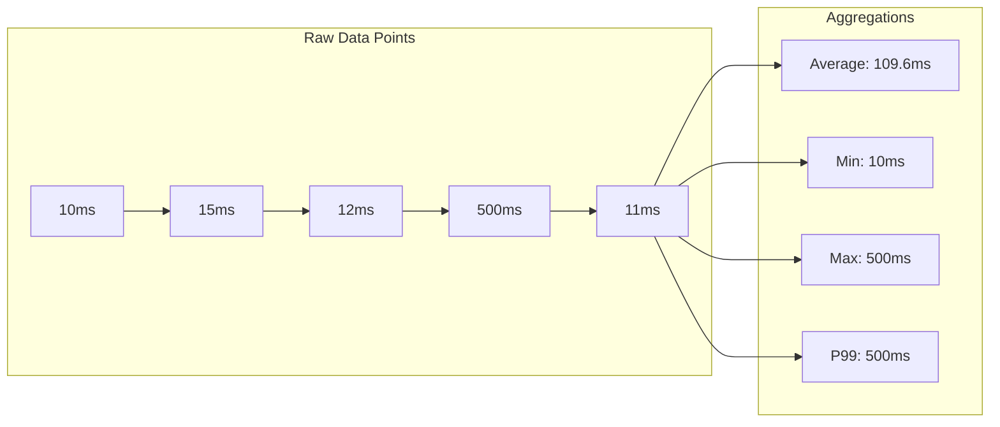
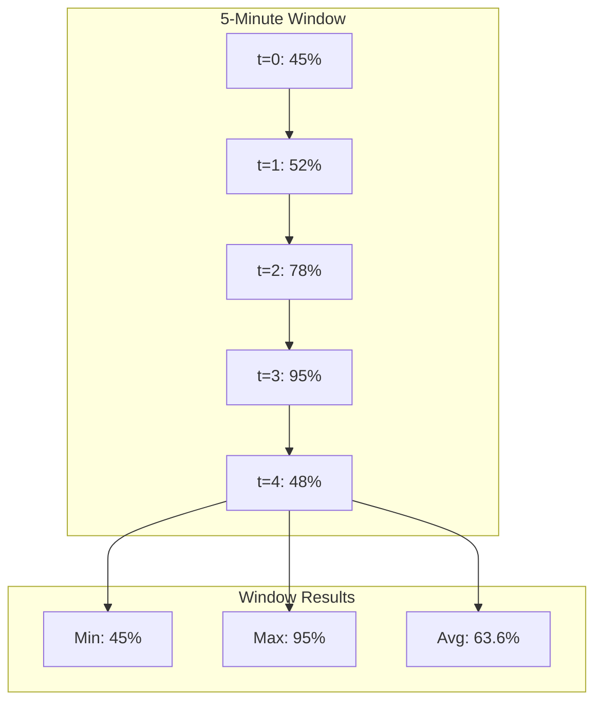
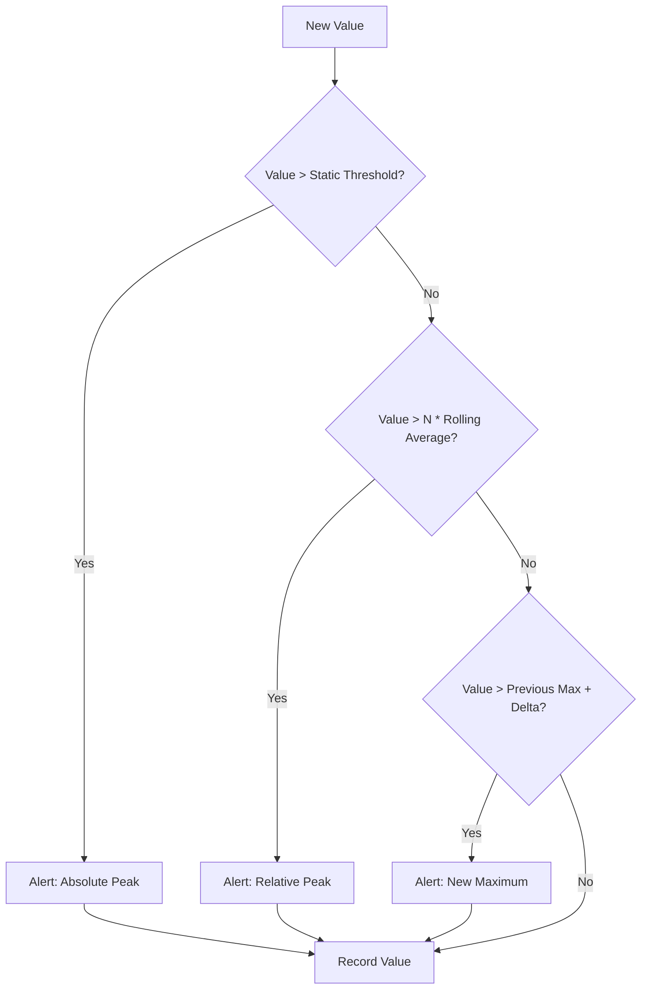
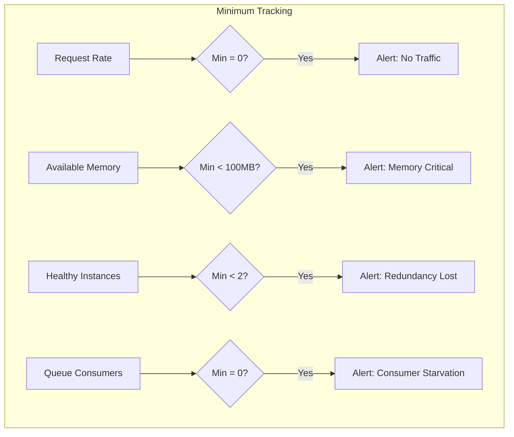
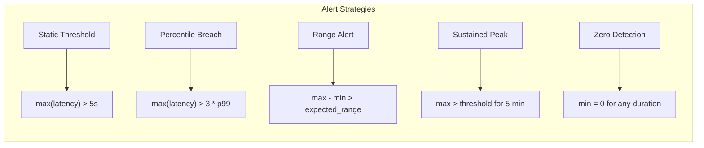
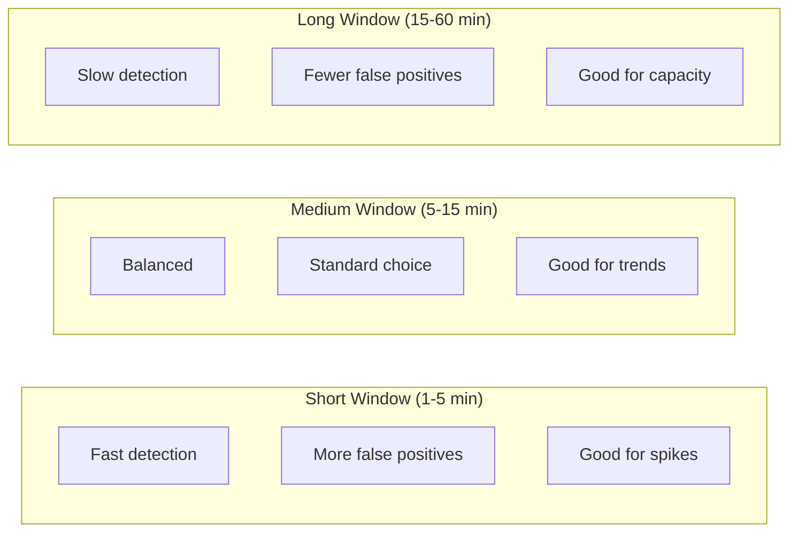
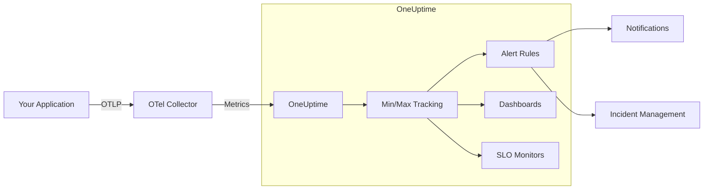

# How to Implement Min/Max Metrics

Author: [nawazdhandala](https://github.com/nawazdhandala)

Tags: Observability, Metrics, Monitoring, SRE

Description: Learn how to track minimum and maximum values for identifying peaks, outliers, and boundary conditions in your metrics.

---

Averages lie. When your dashboard shows 200ms average response time, it hides the fact that 1% of your users experienced 5-second delays. Min/max metrics expose these extremes, helping you catch peaks, outliers, and boundary violations that aggregated metrics obscure.

This guide covers practical implementations for tracking minimum and maximum values across different metric types, with alerting strategies that catch problems before they escalate.

## Why Min/Max Metrics Matter

Standard aggregations like mean, median, and even percentiles can miss critical patterns:

- **Peak detection**: A CPU that spikes to 100% for 3 seconds every minute shows 50% average utilization
- **Minimum tracking**: Memory that briefly drops to zero indicates a restart or crash
- **Boundary conditions**: Queue depths hitting zero (starvation) or hitting limits (backpressure)



The average looks acceptable, but the max reveals an outlier that could indicate a real problem.

## Types of Min/Max Metrics

### 1. Gauge Extremes

Gauges represent point-in-time values like CPU usage, memory, or queue depth. Tracking their extremes over time windows reveals patterns that snapshots miss.



### 2. Histogram Boundaries

Histograms track distributions of values like request latencies. The bucket boundaries define the observable range.

### 3. Counter Rate Extremes

Counters only increase, but their rates can vary. Tracking min/max rates reveals throughput volatility.

## Implementation Patterns

### Pattern 1: Sliding Window Min/Max

Track the minimum and maximum values within a sliding time window.

```python
# Python implementation using a deque for efficient sliding window
from collections import deque
from dataclasses import dataclass
from typing import Optional
import time

@dataclass
class TimestampedValue:
    """A value paired with its timestamp for window calculations."""
    timestamp: float
    value: float

class SlidingWindowMinMax:
    """
    Tracks min/max values over a sliding time window.

    Uses monotonic deques to maintain O(1) min/max queries
    while supporting O(1) amortized insertions.
    """

    def __init__(self, window_seconds: float):
        self.window_seconds = window_seconds
        # Deque for minimum: front always has the minimum
        self.min_deque: deque[TimestampedValue] = deque()
        # Deque for maximum: front always has the maximum
        self.max_deque: deque[TimestampedValue] = deque()
        # All values for cleanup
        self.values: deque[TimestampedValue] = deque()

    def add(self, value: float, timestamp: Optional[float] = None) -> None:
        """Add a new value to the window."""
        if timestamp is None:
            timestamp = time.time()

        entry = TimestampedValue(timestamp, value)
        self.values.append(entry)

        # Maintain min deque: remove larger values from back
        while self.min_deque and self.min_deque[-1].value >= value:
            self.min_deque.pop()
        self.min_deque.append(entry)

        # Maintain max deque: remove smaller values from back
        while self.max_deque and self.max_deque[-1].value <= value:
            self.max_deque.pop()
        self.max_deque.append(entry)

        # Clean up expired entries
        self._cleanup(timestamp)

    def _cleanup(self, current_time: float) -> None:
        """Remove entries outside the time window."""
        cutoff = current_time - self.window_seconds

        # Remove expired values
        while self.values and self.values[0].timestamp < cutoff:
            self.values.popleft()

        # Remove expired min entries
        while self.min_deque and self.min_deque[0].timestamp < cutoff:
            self.min_deque.popleft()

        # Remove expired max entries
        while self.max_deque and self.max_deque[0].timestamp < cutoff:
            self.max_deque.popleft()

    def get_min(self) -> Optional[float]:
        """Get the minimum value in the current window."""
        self._cleanup(time.time())
        return self.min_deque[0].value if self.min_deque else None

    def get_max(self) -> Optional[float]:
        """Get the maximum value in the current window."""
        self._cleanup(time.time())
        return self.max_deque[0].value if self.max_deque else None

    def get_range(self) -> Optional[float]:
        """Get the difference between max and min (volatility indicator)."""
        min_val = self.get_min()
        max_val = self.get_max()
        if min_val is not None and max_val is not None:
            return max_val - min_val
        return None


# Usage example
window = SlidingWindowMinMax(window_seconds=300)  # 5-minute window

# Simulate incoming metrics
window.add(45.0)
window.add(52.0)
window.add(78.0)
window.add(95.0)  # This becomes the max
window.add(48.0)

print(f"Min: {window.get_min()}")  # Output: Min: 45.0
print(f"Max: {window.get_max()}")  # Output: Max: 95.0
print(f"Range: {window.get_range()}")  # Output: Range: 50.0
```

### Pattern 2: OpenTelemetry Min/Max with Histograms

OpenTelemetry histograms automatically track min/max alongside bucket counts.

```python
# OpenTelemetry histogram with min/max tracking
from opentelemetry import metrics
from opentelemetry.sdk.metrics import MeterProvider
from opentelemetry.sdk.metrics.export import (
    ConsoleMetricExporter,
    PeriodicExportingMetricReader,
)

# Configure the meter provider with a console exporter
reader = PeriodicExportingMetricReader(
    ConsoleMetricExporter(),
    export_interval_millis=10000,  # Export every 10 seconds
)
provider = MeterProvider(metric_readers=[reader])
metrics.set_meter_provider(provider)

# Create a meter for your service
meter = metrics.get_meter("payment-service", version="1.0.0")

# Create a histogram for request latency
# Histograms in OpenTelemetry track min, max, sum, and count automatically
request_latency = meter.create_histogram(
    name="http.request.duration",
    description="HTTP request latency in milliseconds",
    unit="ms",
)

def process_request(endpoint: str) -> None:
    """
    Process a request and record its latency.

    The histogram automatically captures:
    - Minimum value in the export interval
    - Maximum value in the export interval
    - Sum of all values (for computing mean)
    - Count of observations
    - Bucket counts for distribution analysis
    """
    import random
    import time

    start = time.time()

    # Simulate request processing
    time.sleep(random.uniform(0.01, 0.5))

    duration_ms = (time.time() - start) * 1000

    # Record the observation with attributes
    request_latency.record(
        duration_ms,
        attributes={
            "http.method": "GET",
            "http.route": endpoint,
            "http.status_code": 200,
        },
    )

# The exported data will include min/max for each export interval
```

### Pattern 3: Prometheus Recording Rules for Min/Max

When using Prometheus, create recording rules to capture extremes efficiently.

```yaml
# prometheus-rules.yaml
# Recording rules for min/max metric tracking
groups:
  - name: min_max_metrics
    interval: 15s
    rules:
      # Track maximum CPU usage over 5-minute windows
      # This captures spikes that point-in-time queries might miss
      - record: cpu:usage:max5m
        expr: max_over_time(node_cpu_seconds_total{mode!="idle"}[5m])
        labels:
          aggregation: "max"

      # Track minimum available memory (detects near-OOM conditions)
      - record: memory:available:min5m
        expr: min_over_time(node_memory_MemAvailable_bytes[5m])
        labels:
          aggregation: "min"

      # Track maximum request latency per service
      - record: http:latency:max5m
        expr: |
          max_over_time(
            histogram_quantile(1.0, rate(http_request_duration_seconds_bucket[1m]))[5m:]
          )
        labels:
          aggregation: "max"

      # Track minimum throughput (detects traffic drops)
      - record: http:requests:min_rate5m
        expr: min_over_time(rate(http_requests_total[1m])[5m:])
        labels:
          aggregation: "min"

      # Track the range (max - min) for volatility detection
      - record: cpu:usage:range5m
        expr: |
          max_over_time(node_cpu_seconds_total{mode!="idle"}[5m])
          - min_over_time(node_cpu_seconds_total{mode!="idle"}[5m])
        labels:
          aggregation: "range"
```

### Pattern 4: Node.js Implementation with Intervals

```javascript
// min-max-tracker.js
// A min/max metric tracker for Node.js applications

/**
 * Tracks minimum and maximum values over configurable time windows.
 * Exports metrics compatible with Prometheus/OpenTelemetry collectors.
 */
class MinMaxTracker {
  /**
   * Create a new MinMaxTracker.
   * @param {string} name - Metric name for labeling
   * @param {number} windowMs - Time window in milliseconds
   * @param {number} bucketMs - Granularity of internal buckets
   */
  constructor(name, windowMs = 300000, bucketMs = 1000) {
    this.name = name;
    this.windowMs = windowMs;
    this.bucketMs = bucketMs;

    // Store values in time buckets for efficient window management
    this.buckets = new Map();

    // Track global min/max for the current window
    this.currentMin = Infinity;
    this.currentMax = -Infinity;
    this.sampleCount = 0;

    // Start cleanup interval
    this.cleanupInterval = setInterval(
      () => this.cleanup(),
      this.bucketMs
    );
  }

  /**
   * Record a new value.
   * @param {number} value - The value to record
   */
  record(value) {
    const now = Date.now();
    const bucketKey = Math.floor(now / this.bucketMs);

    // Get or create bucket
    if (!this.buckets.has(bucketKey)) {
      this.buckets.set(bucketKey, {
        min: Infinity,
        max: -Infinity,
        count: 0,
        timestamp: now,
      });
    }

    const bucket = this.buckets.get(bucketKey);

    // Update bucket min/max
    bucket.min = Math.min(bucket.min, value);
    bucket.max = Math.max(bucket.max, value);
    bucket.count++;

    // Update current window min/max
    this.currentMin = Math.min(this.currentMin, value);
    this.currentMax = Math.max(this.currentMax, value);
    this.sampleCount++;
  }

  /**
   * Remove buckets outside the time window.
   */
  cleanup() {
    const cutoff = Date.now() - this.windowMs;
    const cutoffBucket = Math.floor(cutoff / this.bucketMs);

    // Remove old buckets
    for (const [key, bucket] of this.buckets) {
      if (key < cutoffBucket) {
        this.buckets.delete(key);
      }
    }

    // Recalculate min/max from remaining buckets
    this.recalculate();
  }

  /**
   * Recalculate min/max from current buckets.
   */
  recalculate() {
    this.currentMin = Infinity;
    this.currentMax = -Infinity;
    this.sampleCount = 0;

    for (const bucket of this.buckets.values()) {
      this.currentMin = Math.min(this.currentMin, bucket.min);
      this.currentMax = Math.max(this.currentMax, bucket.max);
      this.sampleCount += bucket.count;
    }
  }

  /**
   * Get current minimum value.
   * @returns {number|null} Minimum value or null if no data
   */
  getMin() {
    return this.sampleCount > 0 ? this.currentMin : null;
  }

  /**
   * Get current maximum value.
   * @returns {number|null} Maximum value or null if no data
   */
  getMax() {
    return this.sampleCount > 0 ? this.currentMax : null;
  }

  /**
   * Get the range (volatility indicator).
   * @returns {number|null} Range or null if no data
   */
  getRange() {
    if (this.sampleCount === 0) return null;
    return this.currentMax - this.currentMin;
  }

  /**
   * Export metrics in Prometheus format.
   * @returns {string} Prometheus-formatted metrics
   */
  toPrometheus() {
    const lines = [];
    const labels = `name="${this.name}"`;

    if (this.sampleCount > 0) {
      lines.push(`# HELP ${this.name}_min Minimum value over window`);
      lines.push(`# TYPE ${this.name}_min gauge`);
      lines.push(`${this.name}_min{${labels}} ${this.currentMin}`);

      lines.push(`# HELP ${this.name}_max Maximum value over window`);
      lines.push(`# TYPE ${this.name}_max gauge`);
      lines.push(`${this.name}_max{${labels}} ${this.currentMax}`);

      lines.push(`# HELP ${this.name}_range Range over window`);
      lines.push(`# TYPE ${this.name}_range gauge`);
      lines.push(`${this.name}_range{${labels}} ${this.getRange()}`);
    }

    return lines.join('\n');
  }

  /**
   * Clean up resources.
   */
  destroy() {
    clearInterval(this.cleanupInterval);
    this.buckets.clear();
  }
}

// Usage example
const latencyTracker = new MinMaxTracker('http_latency_ms', 300000); // 5 min window

// Simulate recording latencies
function simulateRequests() {
  // Normal request
  latencyTracker.record(45);
  latencyTracker.record(52);
  latencyTracker.record(48);

  // Occasional slow request (spike)
  latencyTracker.record(1250);

  // Back to normal
  latencyTracker.record(51);

  console.log(`Min: ${latencyTracker.getMin()}ms`);
  console.log(`Max: ${latencyTracker.getMax()}ms`);
  console.log(`Range: ${latencyTracker.getRange()}ms`);
  console.log('\nPrometheus output:');
  console.log(latencyTracker.toPrometheus());
}

simulateRequests();

module.exports = { MinMaxTracker };
```

## Peak Detection Strategies

Peaks indicate sudden spikes that may signal problems. Here are strategies for detecting them.

### Strategy 1: Threshold-Based Peak Detection



```python
# peak_detector.py
# Detects peaks using multiple strategies

from dataclasses import dataclass
from typing import List, Optional, Callable
from enum import Enum
import statistics

class PeakType(Enum):
    """Types of peaks that can be detected."""
    ABSOLUTE = "absolute"      # Exceeds static threshold
    RELATIVE = "relative"      # Exceeds multiple of rolling average
    NEW_MAXIMUM = "new_max"    # Sets a new all-time or window maximum
    RATE_OF_CHANGE = "roc"     # Rapid increase between samples

@dataclass
class Peak:
    """Represents a detected peak."""
    value: float
    peak_type: PeakType
    threshold: float
    timestamp: float
    context: dict

class PeakDetector:
    """
    Detects peaks in metric streams using multiple strategies.

    Combines absolute thresholds, relative thresholds (vs rolling average),
    and rate-of-change detection for comprehensive peak identification.
    """

    def __init__(
        self,
        absolute_threshold: Optional[float] = None,
        relative_multiplier: float = 3.0,
        window_size: int = 100,
        roc_threshold: Optional[float] = None,
        on_peak: Optional[Callable[[Peak], None]] = None,
    ):
        """
        Initialize the peak detector.

        Args:
            absolute_threshold: Static threshold for absolute peaks
            relative_multiplier: Multiple of rolling average for relative peaks
            window_size: Number of samples for rolling calculations
            roc_threshold: Minimum change between samples for ROC peaks
            on_peak: Callback function when peak is detected
        """
        self.absolute_threshold = absolute_threshold
        self.relative_multiplier = relative_multiplier
        self.window_size = window_size
        self.roc_threshold = roc_threshold
        self.on_peak = on_peak

        self.values: List[float] = []
        self.window_max: float = float('-inf')
        self.all_time_max: float = float('-inf')
        self.last_value: Optional[float] = None

    def check(self, value: float, timestamp: float) -> List[Peak]:
        """
        Check if a value represents a peak.

        Args:
            value: The metric value to check
            timestamp: When the value was recorded

        Returns:
            List of detected peaks (can be multiple types)
        """
        peaks: List[Peak] = []

        # Check absolute threshold
        if self.absolute_threshold and value > self.absolute_threshold:
            peak = Peak(
                value=value,
                peak_type=PeakType.ABSOLUTE,
                threshold=self.absolute_threshold,
                timestamp=timestamp,
                context={"exceeded_by": value - self.absolute_threshold},
            )
            peaks.append(peak)

        # Check relative threshold (vs rolling average)
        if len(self.values) >= 10:  # Need enough samples
            rolling_avg = statistics.mean(self.values[-self.window_size:])
            relative_threshold = rolling_avg * self.relative_multiplier

            if value > relative_threshold:
                peak = Peak(
                    value=value,
                    peak_type=PeakType.RELATIVE,
                    threshold=relative_threshold,
                    timestamp=timestamp,
                    context={
                        "rolling_avg": rolling_avg,
                        "multiplier": self.relative_multiplier,
                    },
                )
                peaks.append(peak)

        # Check for new maximum
        if value > self.window_max:
            # Only alert if significantly higher (avoid noise)
            if self.window_max != float('-inf'):
                increase_pct = ((value - self.window_max) / self.window_max) * 100
                if increase_pct > 10:  # 10% increase threshold
                    peak = Peak(
                        value=value,
                        peak_type=PeakType.NEW_MAXIMUM,
                        threshold=self.window_max,
                        timestamp=timestamp,
                        context={
                            "previous_max": self.window_max,
                            "increase_percent": increase_pct,
                        },
                    )
                    peaks.append(peak)
            self.window_max = value

        # Check rate of change
        if self.roc_threshold and self.last_value is not None:
            change = value - self.last_value
            if change > self.roc_threshold:
                peak = Peak(
                    value=value,
                    peak_type=PeakType.RATE_OF_CHANGE,
                    threshold=self.roc_threshold,
                    timestamp=timestamp,
                    context={
                        "previous_value": self.last_value,
                        "change": change,
                    },
                )
                peaks.append(peak)

        # Update state
        self.values.append(value)
        if len(self.values) > self.window_size:
            self.values.pop(0)
            # Recalculate window max
            self.window_max = max(self.values)

        self.last_value = value
        self.all_time_max = max(self.all_time_max, value)

        # Trigger callbacks
        for peak in peaks:
            if self.on_peak:
                self.on_peak(peak)

        return peaks


# Usage example
def handle_peak(peak: Peak):
    """Handle detected peaks by logging or alerting."""
    print(f"PEAK DETECTED: {peak.peak_type.value}")
    print(f"  Value: {peak.value}")
    print(f"  Threshold: {peak.threshold}")
    print(f"  Context: {peak.context}")
    print()

detector = PeakDetector(
    absolute_threshold=1000,    # Alert if > 1000ms
    relative_multiplier=3.0,    # Alert if > 3x rolling average
    window_size=100,            # 100-sample window
    roc_threshold=500,          # Alert if increases by > 500ms
    on_peak=handle_peak,
)

# Simulate metric stream
import time
test_values = [50, 55, 48, 52, 1200, 51, 49, 53, 50, 52]
for val in test_values:
    detector.check(val, time.time())
```

## Minimum Tracking for Availability

Minimum values often indicate problems: zero requests means an outage, zero memory means a crash.



```python
# minimum_tracker.py
# Track minimums for availability and health monitoring

from dataclasses import dataclass
from typing import Optional, Dict, List
from datetime import datetime, timedelta
import threading

@dataclass
class MinimumAlert:
    """Alert generated when minimum drops below threshold."""
    metric_name: str
    current_min: float
    threshold: float
    window_start: datetime
    window_end: datetime
    sample_count: int

class MinimumTracker:
    """
    Tracks minimum values and alerts when they drop below thresholds.

    Useful for detecting:
    - Traffic drops (min requests = 0)
    - Resource exhaustion (min memory near zero)
    - Capacity issues (min available instances)
    """

    def __init__(self, metric_name: str, threshold: float, window_seconds: int = 60):
        """
        Initialize minimum tracker.

        Args:
            metric_name: Name for this metric
            threshold: Alert when minimum drops below this value
            window_seconds: Time window for minimum calculation
        """
        self.metric_name = metric_name
        self.threshold = threshold
        self.window_seconds = window_seconds

        self.values: List[tuple[datetime, float]] = []
        self.current_min: Optional[float] = None
        self.lock = threading.Lock()

        # Alert state
        self.in_alert_state = False
        self.alert_start: Optional[datetime] = None

    def record(self, value: float) -> Optional[MinimumAlert]:
        """
        Record a value and check for minimum threshold violations.

        Args:
            value: The metric value

        Returns:
            MinimumAlert if threshold violated, None otherwise
        """
        now = datetime.now()

        with self.lock:
            # Add new value
            self.values.append((now, value))

            # Remove values outside window
            cutoff = now - timedelta(seconds=self.window_seconds)
            self.values = [
                (ts, v) for ts, v in self.values
                if ts >= cutoff
            ]

            # Calculate current minimum
            if self.values:
                self.current_min = min(v for _, v in self.values)
            else:
                self.current_min = None

            # Check threshold
            if self.current_min is not None and self.current_min < self.threshold:
                if not self.in_alert_state:
                    self.in_alert_state = True
                    self.alert_start = now

                return MinimumAlert(
                    metric_name=self.metric_name,
                    current_min=self.current_min,
                    threshold=self.threshold,
                    window_start=self.values[0][0] if self.values else now,
                    window_end=now,
                    sample_count=len(self.values),
                )
            else:
                # Clear alert state when recovered
                if self.in_alert_state:
                    self.in_alert_state = False
                    self.alert_start = None
                return None

    def get_stats(self) -> Dict:
        """Get current statistics."""
        with self.lock:
            if not self.values:
                return {
                    "metric_name": self.metric_name,
                    "sample_count": 0,
                    "current_min": None,
                    "threshold": self.threshold,
                    "in_alert": self.in_alert_state,
                }

            values_only = [v for _, v in self.values]
            return {
                "metric_name": self.metric_name,
                "sample_count": len(values_only),
                "current_min": min(values_only),
                "current_max": max(values_only),
                "current_avg": sum(values_only) / len(values_only),
                "threshold": self.threshold,
                "in_alert": self.in_alert_state,
                "alert_duration_seconds": (
                    (datetime.now() - self.alert_start).total_seconds()
                    if self.alert_start else 0
                ),
            }


# Usage: Monitor healthy instance count
instance_tracker = MinimumTracker(
    metric_name="healthy_instances",
    threshold=2,  # Alert if fewer than 2 healthy instances
    window_seconds=60,
)

# Simulate instance health changes
test_sequence = [5, 5, 4, 3, 2, 1, 2, 3, 4, 5]  # Instance count over time

for count in test_sequence:
    alert = instance_tracker.record(count)
    if alert:
        print(f"ALERT: {alert.metric_name} dropped to {alert.current_min}")
        print(f"  Threshold: {alert.threshold}")
        print(f"  Samples in window: {alert.sample_count}")
        print()
```

## Alerting on Min/Max Thresholds

Effective alerting requires different strategies for different scenarios.



### Prometheus Alerting Rules

```yaml
# alerts.yaml
# Prometheus alerting rules for min/max metrics
groups:
  - name: min_max_alerts
    rules:
      # Alert on maximum latency exceeding SLO
      - alert: HighMaximumLatency
        expr: |
          max_over_time(
            histogram_quantile(0.99, rate(http_request_duration_seconds_bucket[5m]))[15m:]
          ) > 5
        for: 5m
        labels:
          severity: warning
        annotations:
          summary: "Maximum latency exceeded 5s"
          description: |
            The maximum p99 latency over the last 15 minutes exceeded 5 seconds.
            Current max: {{ $value | printf "%.2f" }}s
            Service: {{ $labels.service }}

      # Alert on minimum throughput (traffic drop)
      - alert: TrafficDrop
        expr: |
          min_over_time(rate(http_requests_total[5m])[15m:])
          < 0.1 * avg_over_time(rate(http_requests_total[5m])[1h:])
        for: 5m
        labels:
          severity: critical
        annotations:
          summary: "Traffic dropped to less than 10% of normal"
          description: |
            Minimum request rate in the last 15 minutes is less than 10%
            of the hourly average. Possible outage or routing issue.
            Min rate: {{ $value | printf "%.2f" }} req/s

      # Alert on high volatility (large range)
      - alert: HighLatencyVolatility
        expr: |
          (
            max_over_time(http_request_duration_seconds{quantile="0.99"}[5m])
            - min_over_time(http_request_duration_seconds{quantile="0.99"}[5m])
          ) > 2
        for: 10m
        labels:
          severity: warning
        annotations:
          summary: "High latency volatility detected"
          description: |
            The difference between max and min p99 latency exceeds 2 seconds,
            indicating unstable performance.
            Range: {{ $value | printf "%.2f" }}s

      # Alert on zero healthy instances
      - alert: NoHealthyInstances
        expr: |
          min_over_time(up{job="my-service"}[1m]) == 0
        for: 0m  # Immediate alert
        labels:
          severity: critical
        annotations:
          summary: "Service has zero healthy instances"
          description: |
            All instances of {{ $labels.job }} are down.
            Immediate investigation required.

      # Alert on memory minimum approaching zero
      - alert: MemoryNearExhaustion
        expr: |
          min_over_time(
            (node_memory_MemAvailable_bytes / node_memory_MemTotal_bytes)[5m:]
          ) < 0.05
        for: 2m
        labels:
          severity: critical
        annotations:
          summary: "Memory dropped below 5% available"
          description: |
            Minimum available memory in the last 5 minutes dropped below 5%.
            Node: {{ $labels.instance }}
            Min available: {{ $value | humanizePercentage }}

      # Alert on CPU sustained peak
      - alert: SustainedCPUPeak
        expr: |
          min_over_time(
            (1 - rate(node_cpu_seconds_total{mode="idle"}[1m]))[5m:]
          ) > 0.9
        for: 5m
        labels:
          severity: warning
        annotations:
          summary: "CPU sustained above 90% for 5 minutes"
          description: |
            Even the minimum CPU usage over the last 5 minutes exceeded 90%.
            This indicates sustained high load, not just spikes.
            Node: {{ $labels.instance }}
```

## Best Practices

### 1. Choose the Right Window Size



### 2. Combine with Percentiles

Do not rely solely on min/max. Use them alongside percentiles for context:

| Metric | Use Case |
|--------|----------|
| Min | Detect drops, outages, starvation |
| Max | Detect spikes, peaks, capacity limits |
| P50 | Typical user experience |
| P99 | Tail latency for SLOs |
| Range (max - min) | Volatility and stability |

### 3. Storage Considerations

Min/max metrics are efficient to store:

```yaml
# OpenTelemetry Collector configuration for min/max aggregation
processors:
  # Aggregate metrics before export to reduce cardinality
  metricstransform:
    transforms:
      - include: http.request.duration
        action: update
        operations:
          # Keep only min, max, sum, count from histograms
          - action: aggregate_labels
            aggregation_type: sum
            label_set: [service, endpoint, status_code]
```

### 4. Avoid Alert Fatigue

```python
# Implement alert dampening for min/max alerts
class DampenedAlert:
    """
    Prevents alert fatigue by requiring sustained violations.

    Only fires an alert if the condition persists for a minimum duration
    and limits how frequently alerts can fire.
    """

    def __init__(
        self,
        min_duration_seconds: int = 300,  # 5 minutes
        cooldown_seconds: int = 3600,      # 1 hour
    ):
        self.min_duration = min_duration_seconds
        self.cooldown = cooldown_seconds
        self.violation_start: Optional[float] = None
        self.last_alert: Optional[float] = None

    def check(self, is_violation: bool, current_time: float) -> bool:
        """
        Check if an alert should fire.

        Args:
            is_violation: Whether the current state violates the threshold
            current_time: Current timestamp

        Returns:
            True if alert should fire, False otherwise
        """
        if not is_violation:
            # Reset violation tracking
            self.violation_start = None
            return False

        # Start tracking violation
        if self.violation_start is None:
            self.violation_start = current_time

        # Check if violation has persisted long enough
        violation_duration = current_time - self.violation_start
        if violation_duration < self.min_duration:
            return False

        # Check cooldown
        if self.last_alert is not None:
            time_since_last = current_time - self.last_alert
            if time_since_last < self.cooldown:
                return False

        # Fire alert
        self.last_alert = current_time
        return True
```

## Integration with OneUptime

OneUptime provides built-in support for min/max metric tracking and alerting:

1. **Automatic extremes tracking**: Histograms sent via OTLP include min/max automatically
2. **Flexible alerting**: Create alerts on any metric aggregation including min, max, and range
3. **SLO integration**: Define SLOs based on maximum latency or minimum availability
4. **Incident correlation**: Link min/max alerts to traces and logs for faster debugging



## Summary

Min/max metrics fill the gap that averages and percentiles leave behind:

- **Use max** to catch spikes, peaks, and capacity limits
- **Use min** to detect drops, outages, and starvation conditions
- **Use range** (max minus min) to measure volatility and stability
- **Combine with percentiles** for complete visibility
- **Set appropriate windows** based on your detection speed vs. noise trade-off
- **Implement dampening** to avoid alert fatigue

The goal is not to track everything, but to track the boundaries that matter. When your maximum latency spikes or your minimum healthy instances drops, you want to know immediately.
