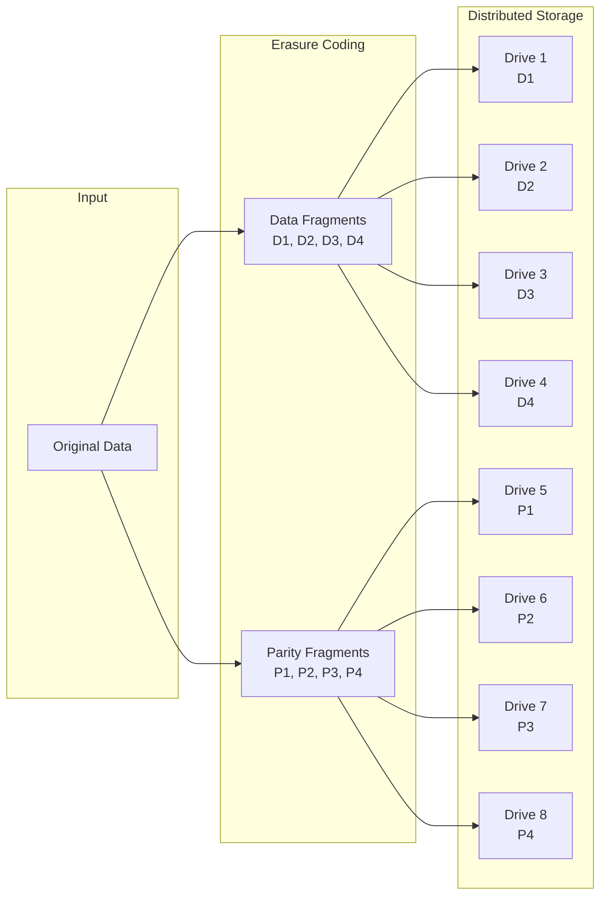
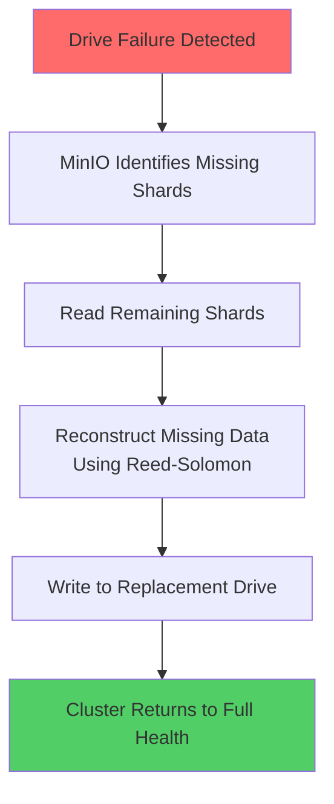

# How to Build MinIO Erasure Coding

Author: [nawazdhandala](https://www.github.com/nawazdhandala)

Tags: MinIO, Object Storage, Erasure Coding, Data Protection, S3

Description: Configure MinIO erasure coding for data protection with parity drives, storage efficiency, and self-healing capabilities.

---

> Erasure coding gives you RAID-like protection without the RAID controller - and MinIO makes it dead simple.

When you store critical data, losing a drive should not mean losing your files. Traditional RAID has served us well, but it ties you to specific hardware and rebuilds can take days. MinIO uses erasure coding - a mathematical approach that splits data across drives and automatically reconstructs missing pieces. You get fault tolerance, storage efficiency, and the freedom to use commodity hardware.

## What is Erasure Coding

Erasure coding divides data into fragments, expands them with redundant pieces, and stores them across different locations. If some fragments become unavailable, the original data can be reconstructed from the remaining pieces.

Think of it like this: instead of keeping three complete copies of a file (300% storage overhead), erasure coding might split the file into 8 pieces and add 4 parity pieces. You can lose any 4 pieces and still recover the original file, but you only use 150% storage.



MinIO uses Reed-Solomon erasure coding, the same algorithm used in CDs, DVDs, and QR codes. It is battle-tested and mathematically proven.

## MinIO Erasure Coding Modes

MinIO supports several erasure coding configurations based on your drive count:

| Drives | Data Shards | Parity Shards | Drives Tolerable | Storage Efficiency |
|--------|-------------|---------------|------------------|-------------------|
| 4      | 2           | 2             | 2                | 50%               |
| 8      | 4           | 4             | 4                | 50%               |
| 12     | 6           | 6             | 6                | 50%               |
| 16     | 8           | 8             | 8                | 50%               |

The default configuration uses half the drives for data and half for parity. You can adjust this ratio based on your durability requirements.

## Setting Up Erasure Coded MinIO

Let us build a MinIO cluster with erasure coding. For this example, we will use 4 drives on a single node - the minimum for erasure coding.

First, prepare your drives. Each drive should be a separate physical disk or partition for real fault tolerance.

```bash
# Create mount points for 4 drives
# In production, these would be actual disks mounted here
sudo mkdir -p /mnt/disk{1..4}

# Set proper ownership
sudo chown -R minio-user:minio-user /mnt/disk{1..4}
```

Create a systemd service file for MinIO with erasure coding enabled.

```bash
# /etc/systemd/system/minio.service
# This service file configures MinIO with erasure coding across 4 drives

[Unit]
Description=MinIO Object Storage with Erasure Coding
Documentation=https://min.io/docs
Wants=network-online.target
After=network-online.target

[Service]
User=minio-user
Group=minio-user
# The /mnt/disk{1...4} syntax tells MinIO to use erasure coding
# across all 4 drives. The ellipsis is not a typo - it is MinIO syntax
EnvironmentFile=/etc/default/minio
ExecStart=/usr/local/bin/minio server /mnt/disk{1...4}
Restart=always
RestartSec=10
LimitNOFILE=65536

[Install]
WantedBy=multi-user.target
```

Configure the environment file with your credentials.

```bash
# /etc/default/minio
# MinIO configuration - use strong passwords in production

# Root credentials (admin access)
MINIO_ROOT_USER=admin
MINIO_ROOT_PASSWORD=supersecretpassword123

# Console address for web UI
MINIO_OPTS="--console-address :9001"

# Optional: Set custom erasure coding parity
# MINIO_STORAGE_CLASS_STANDARD="EC:2"
# MINIO_STORAGE_CLASS_RRS="EC:1"
```

Start MinIO and verify erasure coding is active.

```bash
# Reload systemd and start MinIO
sudo systemctl daemon-reload
sudo systemctl enable minio
sudo systemctl start minio

# Check the status
sudo systemctl status minio
```

## Docker Compose for Erasure Coded MinIO

For development or testing, Docker Compose provides a quick way to spin up an erasure coded cluster.

```yaml
# docker-compose.yml
# MinIO cluster with 4 nodes for erasure coding
# Each node contributes one drive to the erasure set

version: '3.8'

services:
  minio1:
    image: quay.io/minio/minio:latest
    hostname: minio1
    volumes:
      - minio1-data:/data
    environment:
      MINIO_ROOT_USER: minioadmin
      MINIO_ROOT_PASSWORD: minioadmin123
    # The server command specifies all nodes in the cluster
    # MinIO automatically configures erasure coding
    command: server http://minio{1...4}/data --console-address ":9001"
    healthcheck:
      test: ["CMD", "curl", "-f", "http://localhost:9000/minio/health/live"]
      interval: 30s
      timeout: 20s
      retries: 3
    networks:
      - minio-net

  minio2:
    image: quay.io/minio/minio:latest
    hostname: minio2
    volumes:
      - minio2-data:/data
    environment:
      MINIO_ROOT_USER: minioadmin
      MINIO_ROOT_PASSWORD: minioadmin123
    command: server http://minio{1...4}/data --console-address ":9001"
    healthcheck:
      test: ["CMD", "curl", "-f", "http://localhost:9000/minio/health/live"]
      interval: 30s
      timeout: 20s
      retries: 3
    networks:
      - minio-net

  minio3:
    image: quay.io/minio/minio:latest
    hostname: minio3
    volumes:
      - minio3-data:/data
    environment:
      MINIO_ROOT_USER: minioadmin
      MINIO_ROOT_PASSWORD: minioadmin123
    command: server http://minio{1...4}/data --console-address ":9001"
    healthcheck:
      test: ["CMD", "curl", "-f", "http://localhost:9000/minio/health/live"]
      interval: 30s
      timeout: 20s
      retries: 3
    networks:
      - minio-net

  minio4:
    image: quay.io/minio/minio:latest
    hostname: minio4
    volumes:
      - minio4-data:/data
    environment:
      MINIO_ROOT_USER: minioadmin
      MINIO_ROOT_PASSWORD: minioadmin123
    command: server http://minio{1...4}/data --console-address ":9001"
    healthcheck:
      test: ["CMD", "curl", "-f", "http://localhost:9000/minio/health/live"]
      interval: 30s
      timeout: 20s
      retries: 3
    networks:
      - minio-net

  # Nginx load balancer for the MinIO cluster
  nginx:
    image: nginx:alpine
    ports:
      - "9000:9000"
      - "9001:9001"
    volumes:
      - ./nginx.conf:/etc/nginx/nginx.conf:ro
    depends_on:
      - minio1
      - minio2
      - minio3
      - minio4
    networks:
      - minio-net

volumes:
  minio1-data:
  minio2-data:
  minio3-data:
  minio4-data:

networks:
  minio-net:
    driver: bridge
```

## Configuring Storage Classes

MinIO supports two storage classes that let you choose different erasure coding levels per bucket or object.

```bash
# Install the MinIO client (mc)
wget https://dl.min.io/client/mc/release/linux-amd64/mc
chmod +x mc
sudo mv mc /usr/local/bin/

# Configure mc to connect to your MinIO server
mc alias set myminio http://localhost:9000 admin supersecretpassword123

# Check erasure coding status
mc admin info myminio
```

The output shows your erasure set configuration:

```
# Example output showing erasure coding details
Uptime: 2 hours
Version: 2026-01-15T00:00:00Z
Total drives: 4 Online, 0 Offline
Storage: 3.2 TiB Used, 12.8 TiB Available

Erasure Set: 1
  Standard: EC:2 (can lose 2 drives)
  Reduced Redundancy: EC:1 (can lose 1 drive)
```

Set custom storage classes based on your needs.

```bash
# Set environment variables before starting MinIO
# Standard class with 2 parity drives (high durability)
export MINIO_STORAGE_CLASS_STANDARD="EC:2"

# Reduced redundancy with 1 parity drive (saves space, less protection)
export MINIO_STORAGE_CLASS_RRS="EC:1"
```

## Self-Healing in Action

One of the best features of MinIO erasure coding is automatic healing. When a drive fails and is replaced, MinIO reconstructs the missing data without manual intervention.

```bash
# Check healing status
mc admin heal myminio --recursive

# Force a background heal (runs continuously)
mc admin heal myminio --recursive --background

# Monitor healing progress
mc admin trace myminio --call heal
```



## Monitoring Erasure Coding Health

Use the MinIO admin API to monitor your cluster health programmatically.

```bash
# Get detailed cluster health
mc admin info myminio --json | jq '.info.servers[].drives'

# Check for any degraded erasure sets
mc admin info myminio --json | jq '.info.servers[].state'

# Set up Prometheus metrics endpoint
# MinIO exposes metrics at /minio/v2/metrics/cluster
curl http://localhost:9000/minio/v2/metrics/cluster
```

Key metrics to watch:

- `minio_cluster_drive_offline_total` - Number of offline drives
- `minio_cluster_health` - Overall cluster health status
- `minio_heal_objects_total` - Objects healed since start
- `minio_cluster_capacity_usable_free_bytes` - Available storage

## Best Practices

**Use dedicated drives.** Erasure coding only protects against drive failures if data is actually on separate physical drives. Using directories on the same disk defeats the purpose.

**Plan for expansion.** MinIO requires adding drives in sets matching your original configuration. If you started with 4 drives, add 4 more at a time.

**Monitor proactively.** Set up alerts for offline drives and healing operations. Catching a failed drive early prevents cascading failures.

**Test recovery.** Periodically simulate drive failures in a staging environment to verify your recovery procedures work.

**Size drives equally.** MinIO uses the smallest drive in the set as the effective size for all drives. Mismatched drives waste capacity.

## Conclusion

MinIO erasure coding provides enterprise-grade data protection without enterprise complexity. You get the fault tolerance of distributed storage with the simplicity of a single binary. Whether you are building a home lab backup system or a production data lake, erasure coding ensures your data survives hardware failures.

Start with the minimum 4-drive configuration to learn the concepts, then scale up as your needs grow. The same erasure coding principles apply whether you have 4 drives or 400.
