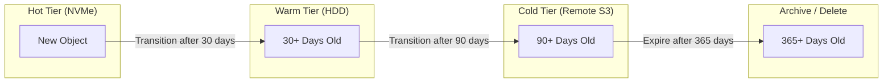
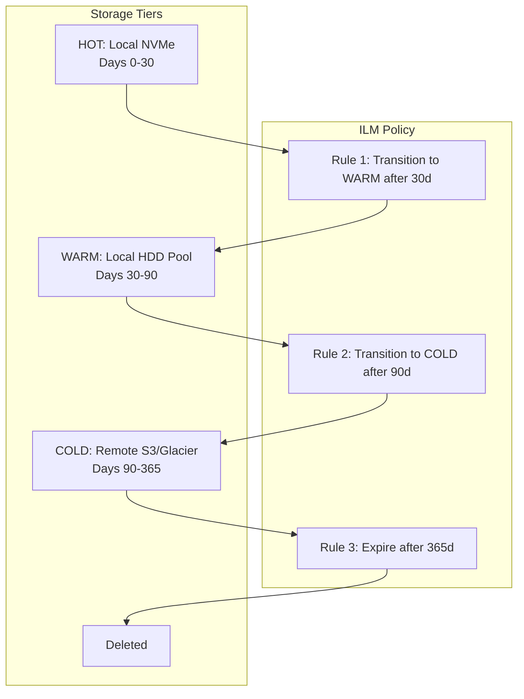
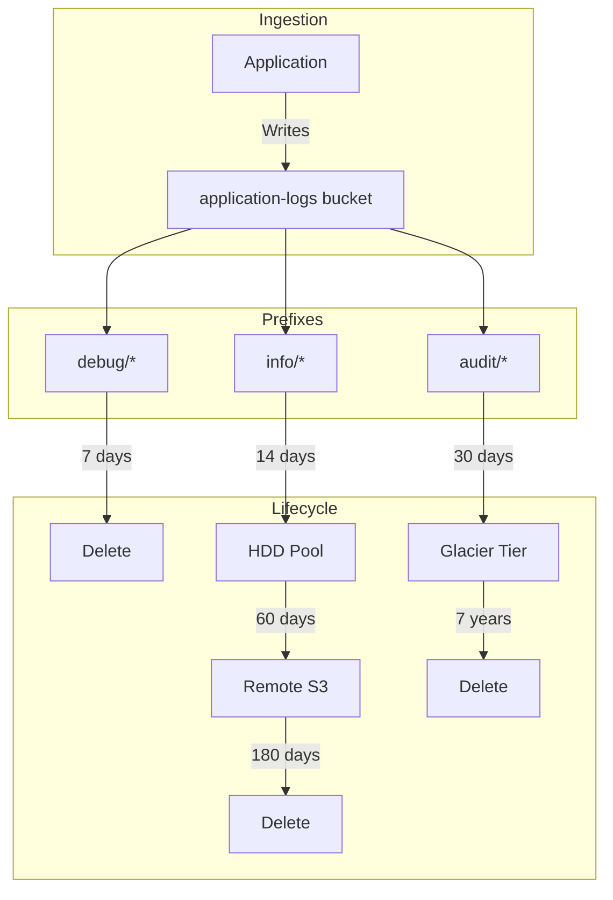

# How to Build MinIO ILM Policies

Author: [nawazdhandala](https://github.com/nawazdhandala)

Tags: MinIO, ObjectStorage, ILM, DataManagement

Description: A practical guide to configuring MinIO Information Lifecycle Management policies for automated data expiration, tiering, and cost optimization.

---

Object storage grows relentlessly. Logs pile up, backups age, and before long you are paying to store data nobody will ever read again. MinIO solves this with **Information Lifecycle Management (ILM)** policies that automatically expire, transition, or clean up objects based on age, tags, or versioning state. This guide walks through the mechanics of ILM rules, from basic expiration to multi-tier remote storage setups.

## What ILM Actually Does

ILM rules let you define automated actions on objects without manual intervention:

- **Expiration:** Delete objects after a specified number of days.
- **Transition:** Move objects to cheaper storage tiers (remote targets).
- **Noncurrent Version Expiration:** Clean up old versions in versioned buckets.
- **Delete Marker Cleanup:** Remove orphaned delete markers automatically.

These rules run as background scanner jobs, evaluating objects against your policy and taking action when conditions match.

## Lifecycle Flow Overview



## Setting Up ILM with mc (MinIO Client)

The `mc ilm` command manages lifecycle rules. First, ensure you have an alias configured:

```bash
# Configure your MinIO alias
mc alias set myminio https://minio.example.com ACCESS_KEY SECRET_KEY
```

### Basic Expiration Rule

Delete all objects in a bucket after 90 days:

```bash
# Add expiration rule: delete objects after 90 days
mc ilm rule add myminio/logs-bucket \
  --expire-days 90
```

### Expiration with Prefix Filter

Target only specific prefixes (folders):

```bash
# Expire only objects under the "debug/" prefix after 30 days
mc ilm rule add myminio/logs-bucket \
  --prefix "debug/" \
  --expire-days 30
```

### Viewing Current Rules

```bash
# List all ILM rules for a bucket
mc ilm rule ls myminio/logs-bucket

# Export rules as JSON for backup or review
mc ilm rule export myminio/logs-bucket
```

## Noncurrent Version Management

When versioning is enabled, deleted or overwritten objects become noncurrent versions. Without cleanup rules, these accumulate forever.

```bash
# Enable versioning on the bucket first
mc version enable myminio/documents-bucket

# Expire noncurrent versions after 7 days
mc ilm rule add myminio/documents-bucket \
  --noncurrent-expire-days 7
```

### Complete Versioning Lifecycle

```bash
# Combined rule: keep current objects 365 days, noncurrent 30 days
mc ilm rule add myminio/backups-bucket \
  --expire-days 365 \
  --noncurrent-expire-days 30 \
  --expire-delete-marker
```

The `--expire-delete-marker` flag removes delete markers when they have no remaining noncurrent versions, keeping your bucket metadata clean.

## Transition Rules for Tiered Storage

Tiering moves objects to cheaper storage without deleting them. You access them through the same bucket, but they physically live elsewhere.

### Step 1: Add a Remote Tier

```bash
# Add an S3-compatible remote tier (could be AWS S3, another MinIO, Wasabi, etc.)
mc admin tier add s3 myminio GLACIER_TIER \
  --endpoint https://s3.amazonaws.com \
  --access-key REMOTE_ACCESS_KEY \
  --secret-key REMOTE_SECRET_KEY \
  --bucket archive-bucket \
  --region us-east-1 \
  --storage-class GLACIER
```

For Azure Blob Storage:

```bash
# Add Azure Blob tier
mc admin tier add azure myminio AZURE_ARCHIVE \
  --account-name myaccount \
  --account-key AZURE_ACCOUNT_KEY \
  --bucket archive-container
```

For Google Cloud Storage:

```bash
# Add GCS tier
mc admin tier add gcs myminio GCS_COLDLINE \
  --credentials-file /path/to/service-account.json \
  --bucket gcs-archive-bucket
```

### Step 2: Create Transition Rules

```bash
# Transition objects to GLACIER_TIER after 90 days
mc ilm rule add myminio/data-bucket \
  --transition-days 90 \
  --transition-tier GLACIER_TIER

# Transition noncurrent versions after 30 days
mc ilm rule add myminio/data-bucket \
  --noncurrent-transition-days 30 \
  --noncurrent-transition-tier GLACIER_TIER
```

### Multi-Tier Lifecycle



## Tag-Based Lifecycle Rules

Tags let you apply different policies to objects in the same bucket based on metadata rather than path.

### Tagging Objects

```bash
# Upload with tags
mc cp report.pdf myminio/documents-bucket \
  --tags "retention=long&department=finance"

# Add tags to existing object
mc tag set myminio/documents-bucket/report.pdf "retention=long&department=finance"
```

### ILM Rules with Tag Filters

```bash
# Expire objects tagged with retention=short after 30 days
mc ilm rule add myminio/documents-bucket \
  --tags "retention=short" \
  --expire-days 30

# Expire objects tagged with retention=medium after 180 days
mc ilm rule add myminio/documents-bucket \
  --tags "retention=medium" \
  --expire-days 180

# Transition long-retention objects to cold storage after 365 days
mc ilm rule add myminio/documents-bucket \
  --tags "retention=long" \
  --transition-days 365 \
  --transition-tier GLACIER_TIER
```

### Combined Prefix and Tag Filters

```bash
# Apply rule only to logs/audit/* objects tagged as compliance=true
mc ilm rule add myminio/logs-bucket \
  --prefix "logs/audit/" \
  --tags "compliance=true" \
  --expire-days 2555  # 7 years for compliance
```

## ILM Rules via JSON Configuration

For complex policies, manage rules as JSON files:

```json
{
  "Rules": [
    {
      "ID": "expire-temp-files",
      "Status": "Enabled",
      "Filter": {
        "Prefix": "temp/"
      },
      "Expiration": {
        "Days": 7
      }
    },
    {
      "ID": "archive-old-data",
      "Status": "Enabled",
      "Filter": {
        "And": {
          "Prefix": "data/",
          "Tags": [
            {
              "Key": "archive",
              "Value": "true"
            }
          ]
        }
      },
      "Transition": {
        "Days": 90,
        "StorageClass": "GLACIER_TIER"
      }
    },
    {
      "ID": "cleanup-versions",
      "Status": "Enabled",
      "Filter": {
        "Prefix": ""
      },
      "NoncurrentVersionExpiration": {
        "NoncurrentDays": 30
      },
      "ExpiredObjectDeleteMarker": true
    }
  ]
}
```

Apply the JSON policy:

```bash
# Import rules from JSON file
mc ilm rule import myminio/my-bucket < lifecycle-policy.json

# Export current rules to JSON
mc ilm rule export myminio/my-bucket > current-policy.json
```

## Practical Example: Log Retention Pipeline

A typical observability setup with tiered log retention:

```bash
# Create the bucket
mc mb myminio/application-logs

# Enable versioning for accidental deletion protection
mc version enable myminio/application-logs

# Hot retention: keep debug logs only 7 days
mc ilm rule add myminio/application-logs \
  --prefix "debug/" \
  --expire-days 7

# Warm retention: transition info logs to HDD tier after 14 days
mc ilm rule add myminio/application-logs \
  --prefix "info/" \
  --transition-days 14 \
  --transition-tier HDD_POOL

# Cold retention: move info logs to remote after 60 days, expire at 180
mc ilm rule add myminio/application-logs \
  --prefix "info/" \
  --transition-days 60 \
  --transition-tier REMOTE_S3 \
  --expire-days 180

# Compliance: audit logs go to cold storage at 30 days, kept 7 years
mc ilm rule add myminio/application-logs \
  --prefix "audit/" \
  --tags "compliance=required" \
  --transition-days 30 \
  --transition-tier GLACIER_TIER \
  --expire-days 2555

# Cleanup old versions across all prefixes
mc ilm rule add myminio/application-logs \
  --noncurrent-expire-days 14 \
  --expire-delete-marker
```



## Monitoring ILM Activity

Track what ILM is doing:

```bash
# Check scanner status
mc admin scanner status myminio

# View tier statistics
mc admin tier info myminio GLACIER_TIER

# List all configured tiers
mc admin tier ls myminio
```

For observability integration, MinIO exposes Prometheus metrics:

- `minio_ilm_transition_count` - Objects transitioned
- `minio_ilm_expiry_count` - Objects expired
- `minio_ilm_transition_failed_count` - Failed transitions

Scrape these into your monitoring stack to alert on ILM failures or unexpected patterns.

## Common Pitfalls

**Rules do not apply immediately.** MinIO's scanner processes objects in the background. New rules may take hours to fully apply across large buckets.

**Filter specificity matters.** A rule with no prefix or tag filter applies to the entire bucket. Be explicit to avoid deleting data you meant to keep.

**Transition costs.** Moving data to remote tiers involves network transfer. Budget for egress if your cold tier is in a different region or cloud.

**Versioning interactions.** Expiration on versioned buckets creates delete markers rather than truly deleting objects. Add `--expire-delete-marker` and `--noncurrent-expire-days` rules to fully clean up.

**Tier availability.** If a remote tier becomes unreachable, transitions fail silently. Monitor `minio_ilm_transition_failed_count` and set up alerts.

## Key Takeaways

- **Start with expiration rules** on temporary data (logs, caches, uploads) to prevent unbounded growth.
- **Add transition tiers** when storage costs matter more than retrieval latency.
- **Use tags** for policy-based retention that does not depend on object paths.
- **Version your policies** by exporting JSON configs to git.
- **Monitor everything** through Prometheus metrics and alerting.

ILM is set-and-forget infrastructure that pays dividends the longer it runs. Define your retention requirements once, encode them in rules, and let MinIO handle the housekeeping while you focus on what the data actually means.
