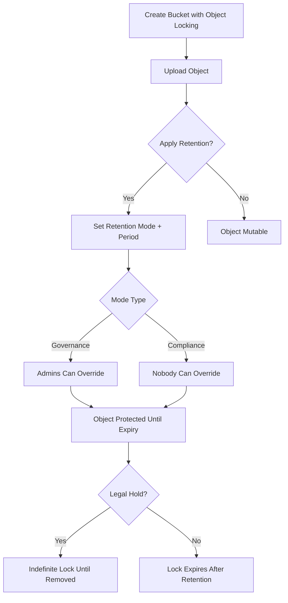
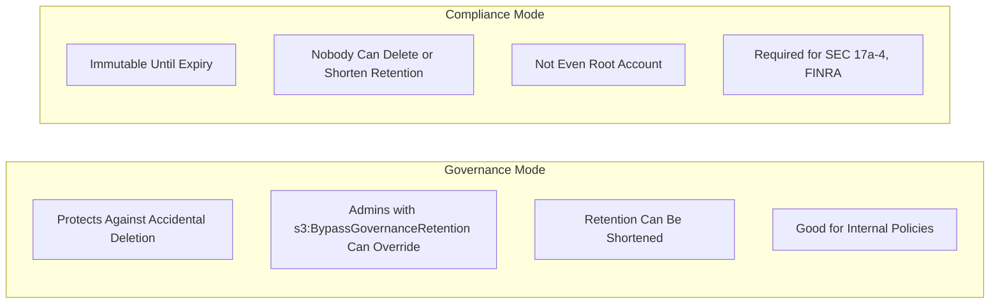
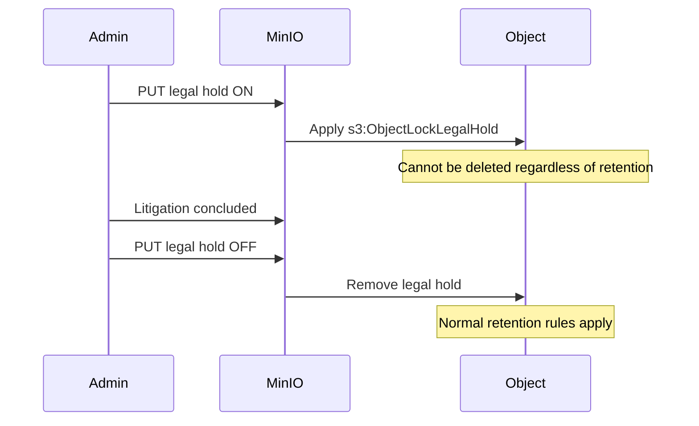

# How to Create MinIO Object Locking

Author: [nawazdhandala](https://github.com/nawazdhandala)

Tags: MinIO, Object Storage, WORM, Compliance

Description: A practical guide to configuring object locking in MinIO for immutable storage, compliance retention, and legal holds.

---

Object locking prevents data from being deleted or overwritten for a specified period. This feature is essential for compliance requirements like SEC 17a-4, HIPAA, and GDPR, where you need to prove that records have not been tampered with. MinIO implements S3-compatible object locking, giving you WORM (Write Once Read Many) storage on your own infrastructure.

This guide covers how to enable object locking, configure retention policies, apply legal holds, and automate the process using both the MinIO Client (`mc`) and the S3 API.

---

## How Object Locking Works

Object locking in MinIO operates at the bucket level with per-object retention settings. Once enabled on a bucket, you can apply retention rules that prevent deletion until the retention period expires.



---

## Prerequisites

- MinIO server running with versioning support (object locking requires versioning)
- MinIO Client (`mc`) installed and configured
- Administrative access to create buckets and set policies
- For S3 API examples: AWS SDK or any S3-compatible client

---

## Step 1: Create a Bucket with Object Locking Enabled

Object locking must be enabled at bucket creation time. You cannot enable it on existing buckets.

### Using mc

```bash
# Create a bucket with object locking enabled
mc mb myminio/compliance-bucket --with-lock

# Verify the bucket was created with locking
mc ls myminio/
```

### Using S3 API (Python boto3)

```python
import boto3

s3 = boto3.client(
    's3',
    endpoint_url='https://minio.example.com',
    aws_access_key_id='YOUR_ACCESS_KEY',
    aws_secret_access_key='YOUR_SECRET_KEY'
)

# Create bucket with object locking enabled
s3.create_bucket(
    Bucket='compliance-bucket',
    ObjectLockEnabledForBucket=True
)

print("Bucket created with object locking enabled")
```

---

## Step 2: Configure Default Retention Rules

Set a default retention configuration so every object uploaded to the bucket automatically inherits the retention policy.

### Using mc

```bash
# Set default retention: Governance mode, 365 days
mc retention set --default governance 365d myminio/compliance-bucket

# Verify the default retention setting
mc retention info myminio/compliance-bucket
```

### Using S3 API (Python boto3)

```python
s3.put_object_lock_configuration(
    Bucket='compliance-bucket',
    ObjectLockConfiguration={
        'ObjectLockEnabled': 'Enabled',
        'Rule': {
            'DefaultRetention': {
                'Mode': 'GOVERNANCE',
                'Days': 365
            }
        }
    }
)

print("Default retention policy configured")
```

---

## Governance Mode vs Compliance Mode

Choosing the right mode depends on your regulatory requirements and operational flexibility needs.



### When to Use Governance Mode

- Internal data retention policies that may need adjustment
- Development and testing of retention workflows
- Scenarios where admin override is acceptable for emergencies
- Data that needs protection from accidental deletion but not legal immutability

### When to Use Compliance Mode

- Financial records subject to SEC 17a-4 or FINRA regulations
- Healthcare data under HIPAA retention requirements
- Legal discovery holds where tampering must be provably impossible
- Any scenario where even administrators should not bypass the lock

**Warning:** Compliance mode locks are truly immutable. If you set a 10-year compliance retention by mistake, that object cannot be deleted for 10 years. Test thoroughly in governance mode first.

---

## Step 3: Apply Retention to Individual Objects

Override or supplement default retention settings on a per-object basis.

### Using mc

```bash
# Upload an object with specific retention
mc cp financial-report.pdf myminio/compliance-bucket/reports/2024/

# Set governance retention for 730 days on the object
mc retention set governance 730d myminio/compliance-bucket/reports/2024/financial-report.pdf

# Check retention status
mc retention info myminio/compliance-bucket/reports/2024/financial-report.pdf
```

### Using S3 API (Python boto3)

```python
from datetime import datetime, timedelta

# Calculate retention date
retain_until = datetime.utcnow() + timedelta(days=730)

# Upload object with retention
s3.put_object(
    Bucket='compliance-bucket',
    Key='reports/2024/financial-report.pdf',
    Body=open('financial-report.pdf', 'rb'),
    ObjectLockMode='GOVERNANCE',
    ObjectLockRetainUntilDate=retain_until
)

print(f"Object uploaded with retention until {retain_until}")
```

---

## Step 4: Apply Legal Holds

Legal holds provide indefinite protection independent of retention periods. Use them when litigation or investigation requires preserving evidence.



### Using mc

```bash
# Apply legal hold to an object
mc legalhold set myminio/compliance-bucket/contracts/vendor-agreement.pdf

# Verify legal hold status
mc legalhold info myminio/compliance-bucket/contracts/vendor-agreement.pdf

# Remove legal hold when permitted
mc legalhold clear myminio/compliance-bucket/contracts/vendor-agreement.pdf
```

### Using S3 API (Python boto3)

```python
# Apply legal hold
s3.put_object_legal_hold(
    Bucket='compliance-bucket',
    Key='contracts/vendor-agreement.pdf',
    LegalHold={
        'Status': 'ON'
    }
)

print("Legal hold applied")

# Check legal hold status
response = s3.get_object_legal_hold(
    Bucket='compliance-bucket',
    Key='contracts/vendor-agreement.pdf'
)
print(f"Legal hold status: {response['LegalHold']['Status']}")

# Remove legal hold
s3.put_object_legal_hold(
    Bucket='compliance-bucket',
    Key='contracts/vendor-agreement.pdf',
    LegalHold={
        'Status': 'OFF'
    }
)

print("Legal hold removed")
```

---

## Step 5: Bypass Governance Retention (When Permitted)

Governance mode allows administrators with the right permissions to override retention in exceptional circumstances.

### Using mc

```bash
# Bypass governance retention (requires s3:BypassGovernanceRetention permission)
mc rm --bypass myminio/compliance-bucket/reports/draft-report.pdf

# Shorten retention period
mc retention set governance 30d --bypass myminio/compliance-bucket/reports/draft-report.pdf
```

### Using S3 API (Python boto3)

```python
# Delete object with governance bypass
s3.delete_object(
    Bucket='compliance-bucket',
    Key='reports/draft-report.pdf',
    BypassGovernanceRetention=True
)

print("Object deleted with governance bypass")
```

### IAM Policy for Bypass Permission

```json
{
    "Version": "2012-10-17",
    "Statement": [
        {
            "Effect": "Allow",
            "Action": [
                "s3:BypassGovernanceRetention"
            ],
            "Resource": [
                "arn:aws:s3:::compliance-bucket/*"
            ]
        }
    ]
}
```

---

## Common Workflows

### Automated Compliance Archival

```bash
#!/bin/bash
# Archive financial records with compliance retention

BUCKET="myminio/compliance-bucket"
RETENTION_DAYS=2555  # 7 years for financial records

for file in /data/financial-records/*.pdf; do
    filename=$(basename "$file")
    year=$(date +%Y)

    # Upload with compliance mode retention
    mc cp "$file" "${BUCKET}/financial/${year}/${filename}"
    mc retention set compliance ${RETENTION_DAYS}d "${BUCKET}/financial/${year}/${filename}"

    echo "Archived ${filename} with 7-year compliance retention"
done
```

### Bulk Legal Hold Application

```python
import boto3

s3 = boto3.client('s3', endpoint_url='https://minio.example.com')
bucket = 'compliance-bucket'
prefix = 'case-12345/'

# List all objects in the case folder
paginator = s3.get_paginator('list_objects_v2')
for page in paginator.paginate(Bucket=bucket, Prefix=prefix):
    for obj in page.get('Contents', []):
        s3.put_object_legal_hold(
            Bucket=bucket,
            Key=obj['Key'],
            LegalHold={'Status': 'ON'}
        )
        print(f"Legal hold applied to {obj['Key']}")
```

---

## Retention Period Reference

| Regulation | Typical Retention | Recommended Mode |
|------------|-------------------|------------------|
| SEC 17a-4 | 6 years | Compliance |
| HIPAA | 6 years | Compliance |
| SOX | 7 years | Compliance |
| GDPR | Varies by purpose | Governance or Compliance |
| Internal Policy | Varies | Governance |
| Litigation Hold | Indefinite | Legal Hold |

---

## Troubleshooting

### "Bucket does not have object lock enabled"

Object locking must be enabled at bucket creation. Create a new bucket with `--with-lock` and migrate objects.

### "Access Denied" when applying retention

Verify your IAM policy includes `s3:PutObjectRetention` and `s3:PutObjectLegalHold` permissions.

### "Object is protected and cannot be deleted"

Check if the object has:
1. Active retention period (use `mc retention info`)
2. Legal hold (use `mc legalhold info`)
3. Compliance mode retention (cannot be bypassed)

### Retention period not applying to uploads

Ensure default retention is configured on the bucket with `mc retention set --default`.

---

## Monitoring Object Locks

Track locked objects and retention status across your MinIO deployment:

```bash
# List all objects with retention in a bucket
mc find myminio/compliance-bucket --json | \
  jq -r 'select(.retention) | "\(.key): \(.retention.mode) until \(.retention.retainUntilDate)"'

# Count objects with legal holds
mc find myminio/compliance-bucket --json | \
  jq -r 'select(.legalhold == "ON") | .key' | wc -l
```

For production environments, export these metrics to your observability platform. OneUptime can alert you when retention policies are about to expire or when legal holds are modified, ensuring compliance teams stay informed.

---

## Summary

Object locking in MinIO provides the immutability guarantees required for compliance and data protection:

- Enable object locking at bucket creation with `--with-lock`
- Use **Governance mode** for internal policies where admin override is acceptable
- Use **Compliance mode** for regulatory requirements where immutability is mandatory
- Apply **Legal holds** for litigation or investigation preservation
- Always test retention workflows in a non-production environment first

With these configurations in place, your MinIO deployment can meet the strictest data retention requirements while running on infrastructure you control.
