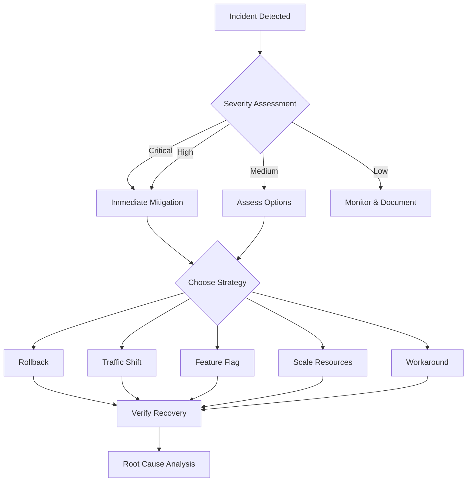
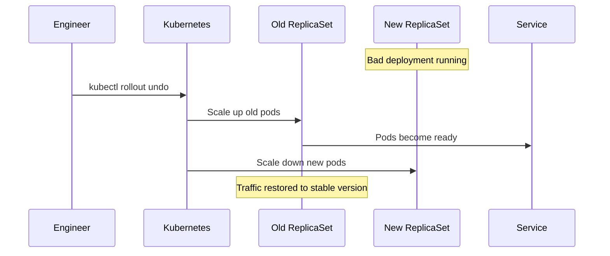
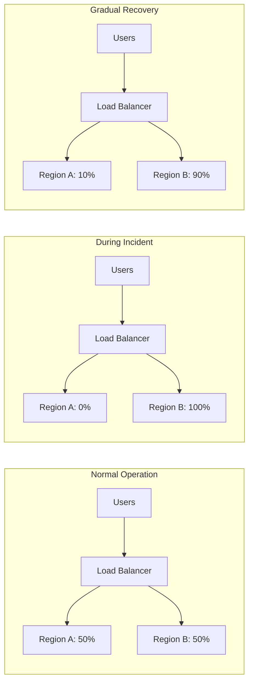
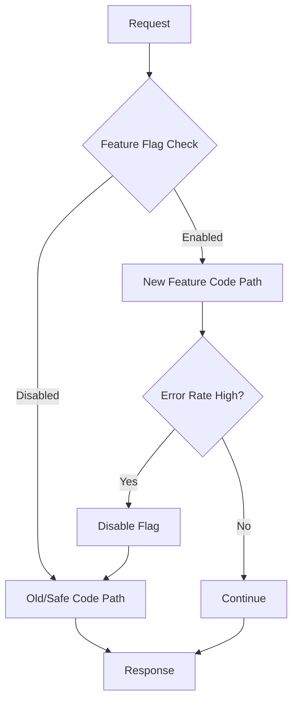
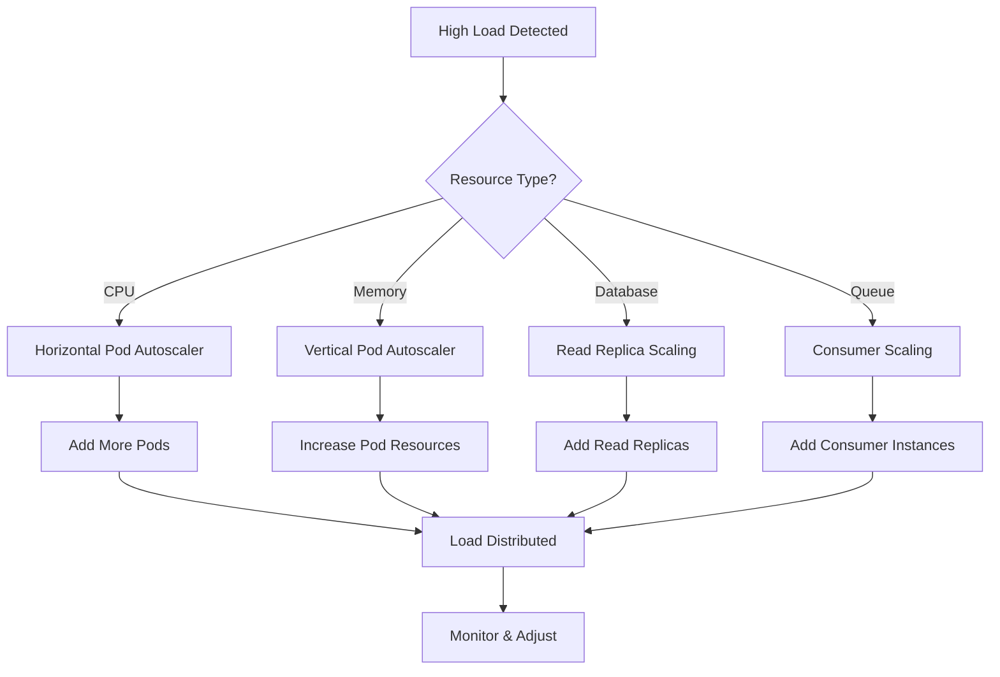
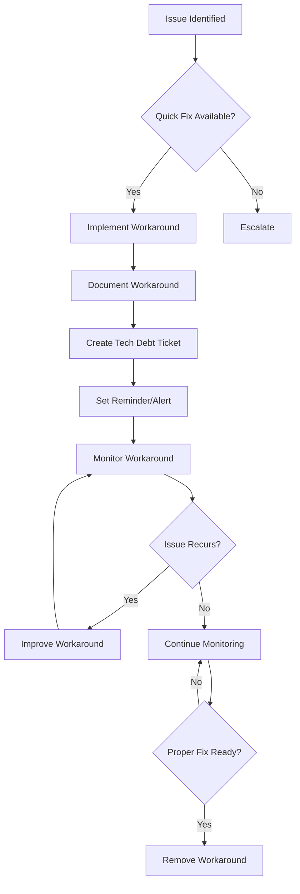

# How to Implement Mitigation Strategies

Author: [nawazdhandala](https://github.com/nawazdhandala)

Tags: Incident Management, Mitigation, SRE, Response

Description: Learn effective strategies for mitigating incidents quickly. This guide covers immediate actions, rollbacks, traffic shifting, feature flags, scaling responses, and temporary workarounds to minimize incident impact.

---

When an incident strikes, your primary goal is not to find the root cause immediately - it is to restore service as quickly as possible. Mitigation strategies are the tactical playbook that helps you stop the bleeding while you figure out what went wrong. In this guide, we will explore the essential techniques every SRE and engineering team should have in their toolkit.

## The Mitigation Mindset

Before diving into specific strategies, let us establish the right mindset. Mitigation is about reducing impact, not solving the underlying problem. Think of it like a doctor stabilizing a patient before surgery - you need to keep the system running while you diagnose and fix the root cause.



## 1. Immediate Mitigation Actions

When an incident is detected, the first few minutes are critical. Having a structured approach ensures you do not waste time deciding what to do.

### The First Response Checklist

Here is a practical checklist implemented as a runbook:

```yaml
# incident-response-runbook.yaml
name: Immediate Response Checklist
triggers:
  - alert_severity: critical
  - alert_severity: high

steps:
  - name: Acknowledge and Assess
    actions:
      - acknowledge_alert
      - check_recent_deployments
      - check_recent_config_changes
      - review_error_rates
    timeout: 2m

  - name: Determine Blast Radius
    questions:
      - How many users are affected?
      - Which services are impacted?
      - Is data integrity at risk?
      - Are there compliance implications?

  - name: Quick Wins Check
    evaluate:
      - can_rollback: "Was there a recent deployment?"
      - can_disable_feature: "Is a feature flag available?"
      - can_shift_traffic: "Are healthy replicas available?"
      - can_scale: "Is this a capacity issue?"

  - name: Execute Mitigation
    based_on: quick_wins_check
    document_everything: true
```

### Implementing an Incident Commander Pattern

```python
from dataclasses import dataclass, field
from datetime import datetime
from enum import Enum
from typing import List, Optional, Callable
import asyncio

class IncidentSeverity(Enum):
    CRITICAL = 1
    HIGH = 2
    MEDIUM = 3
    LOW = 4

class MitigationStatus(Enum):
    PENDING = "pending"
    IN_PROGRESS = "in_progress"
    COMPLETED = "completed"
    FAILED = "failed"
    ROLLED_BACK = "rolled_back"

@dataclass
class MitigationAction:
    """Represents a single mitigation action."""
    name: str
    description: str
    execute: Callable
    rollback: Optional[Callable] = None
    estimated_duration_minutes: int = 5
    status: MitigationStatus = MitigationStatus.PENDING
    started_at: Optional[datetime] = None
    completed_at: Optional[datetime] = None
    result: Optional[str] = None

@dataclass
class Incident:
    """Represents an active incident."""
    id: str
    title: str
    severity: IncidentSeverity
    detected_at: datetime
    affected_services: List[str]
    actions_taken: List[MitigationAction] = field(default_factory=list)
    timeline: List[dict] = field(default_factory=list)

    def log_event(self, event: str):
        """Add event to incident timeline."""
        self.timeline.append({
            'timestamp': datetime.utcnow().isoformat(),
            'event': event
        })
        print(f"[{self.id}] {event}")

class MitigationOrchestrator:
    """Orchestrates mitigation actions during an incident."""

    def __init__(self, incident: Incident):
        self.incident = incident
        self.available_strategies: List[MitigationAction] = []

    def register_strategy(self, action: MitigationAction):
        """Register an available mitigation strategy."""
        self.available_strategies.append(action)

    async def execute_action(self, action: MitigationAction) -> bool:
        """Execute a single mitigation action with logging."""
        action.status = MitigationStatus.IN_PROGRESS
        action.started_at = datetime.utcnow()

        self.incident.log_event(f"Starting mitigation: {action.name}")

        try:
            # Execute the mitigation
            result = await action.execute()

            action.status = MitigationStatus.COMPLETED
            action.completed_at = datetime.utcnow()
            action.result = result

            self.incident.log_event(
                f"Completed mitigation: {action.name} - {result}"
            )
            self.incident.actions_taken.append(action)
            return True

        except Exception as e:
            action.status = MitigationStatus.FAILED
            action.result = str(e)

            self.incident.log_event(
                f"Failed mitigation: {action.name} - {e}"
            )

            # Attempt rollback if available
            if action.rollback:
                self.incident.log_event(f"Attempting rollback for: {action.name}")
                try:
                    await action.rollback()
                    action.status = MitigationStatus.ROLLED_BACK
                except Exception as rollback_error:
                    self.incident.log_event(
                        f"Rollback also failed: {rollback_error}"
                    )

            return False

    async def execute_strategy_sequence(
        self,
        strategies: List[str],
        stop_on_success: bool = True
    ) -> bool:
        """Execute multiple strategies in sequence."""
        for strategy_name in strategies:
            action = next(
                (a for a in self.available_strategies if a.name == strategy_name),
                None
            )

            if not action:
                self.incident.log_event(f"Strategy not found: {strategy_name}")
                continue

            success = await self.execute_action(action)

            if success and stop_on_success:
                self.incident.log_event("Service restored, stopping mitigation sequence")
                return True

        return False
```

## 2. Rollback Strategies

Rollbacks are often the fastest way to restore service when a recent change caused the incident. The key is having reliable, tested rollback procedures ready before you need them.

### Kubernetes Deployment Rollback



Here is a comprehensive rollback implementation:

```python
import subprocess
import json
from dataclasses import dataclass
from typing import Optional, List
from datetime import datetime

@dataclass
class DeploymentRevision:
    revision: int
    image: str
    created_at: datetime
    change_cause: Optional[str]

class KubernetesRollback:
    """Handle Kubernetes deployment rollbacks."""

    def __init__(self, namespace: str = "default"):
        self.namespace = namespace

    def get_deployment_history(
        self,
        deployment: str
    ) -> List[DeploymentRevision]:
        """Get rollout history for a deployment."""
        cmd = [
            "kubectl", "rollout", "history",
            f"deployment/{deployment}",
            "-n", self.namespace,
            "-o", "json"
        ]

        result = subprocess.run(cmd, capture_output=True, text=True)

        if result.returncode != 0:
            raise Exception(f"Failed to get history: {result.stderr}")

        # Parse the output and return revisions
        # Simplified - actual implementation would parse kubectl output
        return []

    def get_current_revision(self, deployment: str) -> int:
        """Get current deployment revision number."""
        cmd = [
            "kubectl", "get", f"deployment/{deployment}",
            "-n", self.namespace,
            "-o", "jsonpath={.metadata.annotations.deployment\\.kubernetes\\.io/revision}"
        ]

        result = subprocess.run(cmd, capture_output=True, text=True)
        return int(result.stdout.strip())

    def rollback_to_previous(self, deployment: str) -> dict:
        """Roll back to the immediately previous version."""
        current = self.get_current_revision(deployment)

        cmd = [
            "kubectl", "rollout", "undo",
            f"deployment/{deployment}",
            "-n", self.namespace
        ]

        result = subprocess.run(cmd, capture_output=True, text=True)

        if result.returncode != 0:
            raise Exception(f"Rollback failed: {result.stderr}")

        return {
            "status": "success",
            "from_revision": current,
            "message": result.stdout.strip()
        }

    def rollback_to_revision(
        self,
        deployment: str,
        revision: int
    ) -> dict:
        """Roll back to a specific revision."""
        cmd = [
            "kubectl", "rollout", "undo",
            f"deployment/{deployment}",
            f"--to-revision={revision}",
            "-n", self.namespace
        ]

        result = subprocess.run(cmd, capture_output=True, text=True)

        if result.returncode != 0:
            raise Exception(f"Rollback failed: {result.stderr}")

        return {
            "status": "success",
            "to_revision": revision,
            "message": result.stdout.strip()
        }

    def wait_for_rollout(
        self,
        deployment: str,
        timeout_seconds: int = 300
    ) -> bool:
        """Wait for rollout to complete."""
        cmd = [
            "kubectl", "rollout", "status",
            f"deployment/{deployment}",
            "-n", self.namespace,
            f"--timeout={timeout_seconds}s"
        ]

        result = subprocess.run(cmd, capture_output=True, text=True)
        return result.returncode == 0

    def verify_rollback(self, deployment: str) -> dict:
        """Verify the rollback was successful."""
        # Check pod status
        pods_cmd = [
            "kubectl", "get", "pods",
            "-l", f"app={deployment}",
            "-n", self.namespace,
            "-o", "json"
        ]

        result = subprocess.run(pods_cmd, capture_output=True, text=True)
        pods = json.loads(result.stdout)

        total_pods = len(pods.get("items", []))
        ready_pods = sum(
            1 for pod in pods.get("items", [])
            if all(
                cs.get("ready", False)
                for cs in pod.get("status", {}).get("containerStatuses", [])
            )
        )

        return {
            "total_pods": total_pods,
            "ready_pods": ready_pods,
            "healthy": ready_pods == total_pods and total_pods > 0
        }


# Example usage in incident response
async def perform_emergency_rollback(
    deployment: str,
    namespace: str = "production"
) -> dict:
    """Emergency rollback procedure."""
    rollback = KubernetesRollback(namespace)

    print(f"Initiating emergency rollback for {deployment}")

    # Step 1: Perform rollback
    rollback_result = rollback.rollback_to_previous(deployment)
    print(f"Rollback initiated: {rollback_result}")

    # Step 2: Wait for completion
    print("Waiting for rollout to complete...")
    success = rollback.wait_for_rollout(deployment, timeout_seconds=180)

    if not success:
        return {"status": "failed", "message": "Rollout timed out"}

    # Step 3: Verify health
    health = rollback.verify_rollback(deployment)
    print(f"Health check: {health}")

    return {
        "status": "success" if health["healthy"] else "degraded",
        "rollback": rollback_result,
        "health": health
    }
```

### Database Migration Rollback

```sql
-- Example: Safe migration with rollback support
-- migrations/20260130_add_user_preferences.sql

-- Forward migration
BEGIN;

-- Create new table
CREATE TABLE user_preferences (
    id SERIAL PRIMARY KEY,
    user_id INTEGER NOT NULL REFERENCES users(id),
    preference_key VARCHAR(255) NOT NULL,
    preference_value JSONB,
    created_at TIMESTAMP DEFAULT NOW(),
    updated_at TIMESTAMP DEFAULT NOW(),
    UNIQUE(user_id, preference_key)
);

-- Create index for lookups
CREATE INDEX idx_user_preferences_user_id ON user_preferences(user_id);

-- Record migration version
INSERT INTO schema_migrations (version, applied_at)
VALUES ('20260130_add_user_preferences', NOW());

COMMIT;

-- Rollback migration (stored separately)
-- migrations/20260130_add_user_preferences_rollback.sql
BEGIN;

DROP TABLE IF EXISTS user_preferences;

DELETE FROM schema_migrations
WHERE version = '20260130_add_user_preferences';

COMMIT;
```

## 3. Traffic Shifting

Traffic shifting allows you to redirect user requests away from unhealthy instances or regions. This is particularly powerful when combined with gradual rollouts.



### Implementing Traffic Shifting with Kubernetes

```yaml
# Using Istio VirtualService for traffic shifting
# virtualservice-api.yaml
apiVersion: networking.istio.io/v1beta1
kind: VirtualService
metadata:
  name: api-service
  namespace: production
spec:
  hosts:
    - api.example.com
  http:
    - match:
        - headers:
            x-canary:
              exact: "true"
      route:
        - destination:
            host: api-service
            subset: canary
          weight: 100
    - route:
        - destination:
            host: api-service
            subset: stable
          weight: 90
        - destination:
            host: api-service
            subset: canary
          weight: 10

---
# DestinationRule for subsets
apiVersion: networking.istio.io/v1beta1
kind: DestinationRule
metadata:
  name: api-service
  namespace: production
spec:
  host: api-service
  subsets:
    - name: stable
      labels:
        version: stable
    - name: canary
      labels:
        version: canary
```

### Traffic Shifting Controller

```python
import subprocess
import json
from dataclasses import dataclass
from typing import Dict, List
import time

@dataclass
class TrafficWeight:
    subset: str
    weight: int

class TrafficShiftController:
    """Control traffic distribution during incidents."""

    def __init__(self, namespace: str = "production"):
        self.namespace = namespace

    def get_current_weights(
        self,
        virtual_service: str
    ) -> List[TrafficWeight]:
        """Get current traffic weights."""
        cmd = [
            "kubectl", "get", "virtualservice",
            virtual_service,
            "-n", self.namespace,
            "-o", "json"
        ]

        result = subprocess.run(cmd, capture_output=True, text=True)
        vs = json.loads(result.stdout)

        weights = []
        for route in vs.get("spec", {}).get("http", [{}])[0].get("route", []):
            weights.append(TrafficWeight(
                subset=route.get("destination", {}).get("subset", "unknown"),
                weight=route.get("weight", 0)
            ))

        return weights

    def shift_traffic(
        self,
        virtual_service: str,
        weights: Dict[str, int]
    ) -> dict:
        """
        Shift traffic to new weights.

        Args:
            virtual_service: Name of the VirtualService
            weights: Dict mapping subset names to weights (must sum to 100)
        """
        if sum(weights.values()) != 100:
            raise ValueError("Weights must sum to 100")

        # Build the patch
        routes = [
            {
                "destination": {
                    "host": virtual_service.replace("-vs", ""),
                    "subset": subset
                },
                "weight": weight
            }
            for subset, weight in weights.items()
        ]

        patch = {
            "spec": {
                "http": [{
                    "route": routes
                }]
            }
        }

        cmd = [
            "kubectl", "patch", "virtualservice",
            virtual_service,
            "-n", self.namespace,
            "--type", "merge",
            "-p", json.dumps(patch)
        ]

        result = subprocess.run(cmd, capture_output=True, text=True)

        if result.returncode != 0:
            raise Exception(f"Traffic shift failed: {result.stderr}")

        return {
            "status": "success",
            "new_weights": weights
        }

    def drain_subset(
        self,
        virtual_service: str,
        subset_to_drain: str,
        target_subset: str
    ) -> dict:
        """Completely drain traffic from one subset to another."""
        return self.shift_traffic(virtual_service, {
            subset_to_drain: 0,
            target_subset: 100
        })

    def gradual_shift(
        self,
        virtual_service: str,
        from_subset: str,
        to_subset: str,
        step_percent: int = 10,
        step_interval_seconds: int = 30,
        health_check: callable = None
    ) -> dict:
        """
        Gradually shift traffic with health verification.

        This is useful for recovering traffic after an incident.
        """
        current_weights = {from_subset: 100, to_subset: 0}

        while current_weights[to_subset] < 100:
            # Shift traffic
            new_to_weight = min(100, current_weights[to_subset] + step_percent)
            new_from_weight = 100 - new_to_weight

            new_weights = {
                from_subset: new_from_weight,
                to_subset: new_to_weight
            }

            self.shift_traffic(virtual_service, new_weights)
            print(f"Shifted traffic: {new_weights}")

            # Wait and check health
            time.sleep(step_interval_seconds)

            if health_check and not health_check():
                # Rollback on health failure
                print("Health check failed, rolling back")
                self.shift_traffic(virtual_service, current_weights)
                return {
                    "status": "aborted",
                    "final_weights": current_weights,
                    "reason": "Health check failed"
                }

            current_weights = new_weights

        return {
            "status": "success",
            "final_weights": current_weights
        }


# Example: Emergency traffic drain
async def emergency_traffic_drain(service: str):
    """Drain all traffic from a failing service version."""
    controller = TrafficShiftController()

    print(f"Emergency: Draining traffic from canary for {service}")

    result = controller.drain_subset(
        virtual_service=f"{service}-vs",
        subset_to_drain="canary",
        target_subset="stable"
    )

    print(f"Traffic drain result: {result}")
    return result
```

## 4. Feature Flag Disabling

Feature flags provide surgical precision in mitigation. Instead of rolling back an entire deployment, you can disable just the problematic feature.



### Feature Flag Implementation

```python
from dataclasses import dataclass, field
from typing import Dict, Optional, List, Any
from datetime import datetime
import json
import redis
from functools import wraps

@dataclass
class FeatureFlag:
    """Represents a feature flag configuration."""
    name: str
    enabled: bool
    description: str
    rollout_percentage: int = 100  # 0-100
    allowed_users: List[str] = field(default_factory=list)
    allowed_groups: List[str] = field(default_factory=list)
    kill_switch: bool = False  # Emergency disable
    created_at: datetime = field(default_factory=datetime.utcnow)
    updated_at: datetime = field(default_factory=datetime.utcnow)
    metadata: Dict[str, Any] = field(default_factory=dict)

class FeatureFlagService:
    """Feature flag management for incident mitigation."""

    def __init__(self, redis_client: redis.Redis):
        self.redis = redis_client
        self.prefix = "feature_flags:"
        self.audit_prefix = "feature_flag_audit:"

    def _get_key(self, flag_name: str) -> str:
        return f"{self.prefix}{flag_name}"

    def get_flag(self, flag_name: str) -> Optional[FeatureFlag]:
        """Get a feature flag by name."""
        data = self.redis.get(self._get_key(flag_name))
        if not data:
            return None

        flag_dict = json.loads(data)
        return FeatureFlag(**flag_dict)

    def set_flag(self, flag: FeatureFlag, reason: str = None):
        """Set or update a feature flag."""
        flag.updated_at = datetime.utcnow()

        self.redis.set(
            self._get_key(flag.name),
            json.dumps(flag.__dict__, default=str)
        )

        # Audit log
        self._audit_log(flag.name, "updated", reason)

    def is_enabled(
        self,
        flag_name: str,
        user_id: str = None,
        user_groups: List[str] = None,
        default: bool = False
    ) -> bool:
        """
        Check if a feature flag is enabled for a user.

        Evaluation order:
        1. Kill switch (always wins)
        2. Specific user allowlist
        3. Group allowlist
        4. Rollout percentage
        5. Default enabled state
        """
        flag = self.get_flag(flag_name)

        if not flag:
            return default

        # Kill switch always disables
        if flag.kill_switch:
            return False

        # Check user allowlist
        if user_id and user_id in flag.allowed_users:
            return True

        # Check group allowlist
        if user_groups:
            if any(g in flag.allowed_groups for g in user_groups):
                return True

        # Check rollout percentage
        if flag.rollout_percentage < 100:
            # Use consistent hashing for user
            if user_id:
                hash_value = hash(f"{flag_name}:{user_id}") % 100
                if hash_value >= flag.rollout_percentage:
                    return False

        return flag.enabled

    def emergency_disable(
        self,
        flag_name: str,
        reason: str,
        incident_id: str = None
    ) -> bool:
        """
        Emergency kill switch for a feature.

        This is the fastest way to disable a problematic feature.
        """
        flag = self.get_flag(flag_name)

        if not flag:
            # Create a disabled flag if it does not exist
            flag = FeatureFlag(
                name=flag_name,
                enabled=False,
                description="Emergency disabled",
                kill_switch=True,
                metadata={"incident_id": incident_id}
            )
        else:
            flag.kill_switch = True
            flag.metadata["incident_id"] = incident_id
            flag.metadata["disabled_reason"] = reason

        self.set_flag(flag, reason=f"EMERGENCY: {reason}")

        # Also publish to notify all instances immediately
        self.redis.publish(
            "feature_flag_updates",
            json.dumps({
                "action": "emergency_disable",
                "flag": flag_name,
                "reason": reason
            })
        )

        return True

    def gradual_enable(
        self,
        flag_name: str,
        target_percentage: int,
        step: int = 10,
        current_percentage: int = 0
    ):
        """
        Gradually enable a feature after an incident.

        Useful for carefully re-enabling a fixed feature.
        """
        flag = self.get_flag(flag_name)

        if not flag:
            raise ValueError(f"Flag {flag_name} not found")

        flag.rollout_percentage = min(current_percentage + step, target_percentage)
        flag.kill_switch = False

        self.set_flag(flag, reason=f"Gradual enable: {flag.rollout_percentage}%")

        return flag.rollout_percentage

    def _audit_log(self, flag_name: str, action: str, reason: str = None):
        """Log flag changes for audit trail."""
        log_entry = {
            "timestamp": datetime.utcnow().isoformat(),
            "flag": flag_name,
            "action": action,
            "reason": reason
        }

        self.redis.lpush(
            f"{self.audit_prefix}{flag_name}",
            json.dumps(log_entry)
        )

        # Keep last 1000 entries
        self.redis.ltrim(f"{self.audit_prefix}{flag_name}", 0, 999)


def feature_flag(
    flag_name: str,
    fallback: callable = None,
    default: bool = False
):
    """
    Decorator for feature-flagged functions.

    Usage:
        @feature_flag("new_checkout_flow", fallback=old_checkout)
        def new_checkout(user, cart):
            # New implementation
            pass
    """
    def decorator(func):
        @wraps(func)
        def wrapper(*args, **kwargs):
            # Get flag service from context (simplified)
            flag_service = kwargs.pop('_flag_service', None)
            user_id = kwargs.get('user_id') or kwargs.get('user', {}).get('id')

            if flag_service and flag_service.is_enabled(flag_name, user_id, default=default):
                return func(*args, **kwargs)
            elif fallback:
                return fallback(*args, **kwargs)
            else:
                raise RuntimeError(f"Feature {flag_name} is disabled and no fallback provided")

        return wrapper
    return decorator


# Example usage
"""
# In your incident response:
flag_service = FeatureFlagService(redis_client)

# Emergency disable problematic feature
flag_service.emergency_disable(
    "new_payment_processor",
    reason="Causing transaction failures",
    incident_id="INC-2026-0130"
)

# After fix is deployed, gradually re-enable
for percentage in range(10, 110, 10):
    flag_service.gradual_enable(
        "new_payment_processor",
        target_percentage=percentage
    )
    # Monitor for issues
    time.sleep(300)  # 5 minutes between steps
"""
```

## 5. Scaling Responses

Sometimes the mitigation is simply adding more capacity. This is particularly effective for traffic spikes or resource exhaustion issues.



### Emergency Scaling Implementation

```python
import subprocess
import json
from dataclasses import dataclass
from typing import Optional
import time

@dataclass
class ScalingResult:
    deployment: str
    previous_replicas: int
    new_replicas: int
    status: str
    message: str

class EmergencyScaler:
    """Handle emergency scaling during incidents."""

    def __init__(self, namespace: str = "production"):
        self.namespace = namespace

    def get_current_replicas(self, deployment: str) -> int:
        """Get current replica count."""
        cmd = [
            "kubectl", "get", "deployment", deployment,
            "-n", self.namespace,
            "-o", "jsonpath={.spec.replicas}"
        ]

        result = subprocess.run(cmd, capture_output=True, text=True)
        return int(result.stdout.strip())

    def get_hpa_limits(self, deployment: str) -> Optional[dict]:
        """Get HPA min/max limits if configured."""
        cmd = [
            "kubectl", "get", "hpa",
            "-n", self.namespace,
            "-o", "json"
        ]

        result = subprocess.run(cmd, capture_output=True, text=True)

        if result.returncode != 0:
            return None

        hpas = json.loads(result.stdout)

        for hpa in hpas.get("items", []):
            if hpa.get("spec", {}).get("scaleTargetRef", {}).get("name") == deployment:
                return {
                    "min": hpa["spec"].get("minReplicas", 1),
                    "max": hpa["spec"].get("maxReplicas", 10)
                }

        return None

    def scale_deployment(
        self,
        deployment: str,
        replicas: int,
        reason: str = None
    ) -> ScalingResult:
        """Scale a deployment to specific replica count."""
        current = self.get_current_replicas(deployment)

        # Check HPA limits
        hpa_limits = self.get_hpa_limits(deployment)
        if hpa_limits:
            if replicas > hpa_limits["max"]:
                # Need to update HPA first
                self._update_hpa_max(deployment, replicas)

        cmd = [
            "kubectl", "scale", "deployment", deployment,
            f"--replicas={replicas}",
            "-n", self.namespace
        ]

        result = subprocess.run(cmd, capture_output=True, text=True)

        if result.returncode != 0:
            return ScalingResult(
                deployment=deployment,
                previous_replicas=current,
                new_replicas=current,
                status="failed",
                message=result.stderr
            )

        # Annotate for audit
        self._annotate_scaling_event(deployment, current, replicas, reason)

        return ScalingResult(
            deployment=deployment,
            previous_replicas=current,
            new_replicas=replicas,
            status="success",
            message=f"Scaled from {current} to {replicas} replicas"
        )

    def emergency_scale_up(
        self,
        deployment: str,
        multiplier: float = 2.0,
        max_replicas: int = 50
    ) -> ScalingResult:
        """
        Emergency scale up by a multiplier.

        Useful when you need more capacity immediately.
        """
        current = self.get_current_replicas(deployment)
        target = min(int(current * multiplier), max_replicas)

        return self.scale_deployment(
            deployment,
            target,
            reason=f"Emergency scale up: {multiplier}x"
        )

    def scale_to_handle_traffic(
        self,
        deployment: str,
        current_rps: float,
        target_rps: float,
        rps_per_pod: float = 100
    ) -> ScalingResult:
        """
        Scale based on traffic requirements.

        Args:
            deployment: Name of the deployment
            current_rps: Current requests per second
            target_rps: Target RPS to handle
            rps_per_pod: Estimated RPS each pod can handle
        """
        current_replicas = self.get_current_replicas(deployment)

        # Calculate needed replicas with 20% headroom
        needed_replicas = int((target_rps / rps_per_pod) * 1.2)

        # Only scale if needed
        if needed_replicas <= current_replicas:
            return ScalingResult(
                deployment=deployment,
                previous_replicas=current_replicas,
                new_replicas=current_replicas,
                status="no_action",
                message="Current capacity is sufficient"
            )

        return self.scale_deployment(
            deployment,
            needed_replicas,
            reason=f"Traffic scaling: {current_rps} -> {target_rps} RPS"
        )

    def _update_hpa_max(self, deployment: str, new_max: int):
        """Update HPA maximum replicas."""
        patch = {"spec": {"maxReplicas": new_max}}

        cmd = [
            "kubectl", "patch", "hpa", deployment,
            "-n", self.namespace,
            "--type", "merge",
            "-p", json.dumps(patch)
        ]

        subprocess.run(cmd, capture_output=True, text=True)

    def _annotate_scaling_event(
        self,
        deployment: str,
        from_replicas: int,
        to_replicas: int,
        reason: str
    ):
        """Add annotation for scaling audit trail."""
        annotation = {
            "scaling-event": json.dumps({
                "timestamp": time.strftime("%Y-%m-%dT%H:%M:%SZ"),
                "from": from_replicas,
                "to": to_replicas,
                "reason": reason
            })
        }

        cmd = [
            "kubectl", "annotate", "deployment", deployment,
            f"oneuptime.com/last-scaling-event={json.dumps(annotation)}",
            "--overwrite",
            "-n", self.namespace
        ]

        subprocess.run(cmd, capture_output=True, text=True)

    def wait_for_scale_complete(
        self,
        deployment: str,
        timeout_seconds: int = 300
    ) -> bool:
        """Wait for all new pods to be ready."""
        cmd = [
            "kubectl", "rollout", "status",
            f"deployment/{deployment}",
            "-n", self.namespace,
            f"--timeout={timeout_seconds}s"
        ]

        result = subprocess.run(cmd, capture_output=True, text=True)
        return result.returncode == 0


# Example: Automated scaling response
async def handle_capacity_incident(
    deployment: str,
    current_error_rate: float,
    current_latency_p99: float
):
    """Automated response to capacity-related incidents."""
    scaler = EmergencyScaler()

    # Determine scaling factor based on symptoms
    if current_error_rate > 0.1:  # >10% errors
        multiplier = 3.0
        print(f"High error rate ({current_error_rate}), scaling 3x")
    elif current_latency_p99 > 2000:  # >2s p99
        multiplier = 2.0
        print(f"High latency ({current_latency_p99}ms), scaling 2x")
    else:
        multiplier = 1.5
        print("Moderate issues, scaling 1.5x")

    result = scaler.emergency_scale_up(deployment, multiplier)
    print(f"Scaling result: {result}")

    # Wait for new pods
    if result.status == "success":
        print("Waiting for new pods to be ready...")
        ready = scaler.wait_for_scale_complete(deployment)

        if ready:
            print("Scale complete, monitoring for improvement")
        else:
            print("Warning: Scale did not complete in time")

    return result
```

## 6. Temporary Workarounds

Sometimes the best mitigation is a creative workaround that keeps the service running while you work on a proper fix. These should be documented and tracked to ensure they are removed later.



### Common Workaround Patterns

```python
from dataclasses import dataclass, field
from datetime import datetime, timedelta
from typing import Optional, Callable, Dict, Any
import functools
import logging

logger = logging.getLogger(__name__)

@dataclass
class Workaround:
    """Represents a temporary workaround."""
    id: str
    description: str
    implemented_at: datetime
    expires_at: Optional[datetime]
    jira_ticket: str
    incident_id: str
    owner: str
    is_active: bool = True
    removal_instructions: str = ""

    @property
    def is_expired(self) -> bool:
        if not self.expires_at:
            return False
        return datetime.utcnow() > self.expires_at

class WorkaroundRegistry:
    """Track and manage temporary workarounds."""

    def __init__(self):
        self.workarounds: Dict[str, Workaround] = {}

    def register(self, workaround: Workaround):
        """Register a new workaround."""
        self.workarounds[workaround.id] = workaround
        logger.warning(
            f"WORKAROUND ACTIVATED: {workaround.id} - {workaround.description}"
        )

    def deactivate(self, workaround_id: str, reason: str):
        """Deactivate a workaround."""
        if workaround_id in self.workarounds:
            self.workarounds[workaround_id].is_active = False
            logger.info(
                f"WORKAROUND DEACTIVATED: {workaround_id} - {reason}"
            )

    def get_active_workarounds(self):
        """Get all active workarounds."""
        return [
            w for w in self.workarounds.values()
            if w.is_active
        ]

    def check_expired(self):
        """Check for expired workarounds and alert."""
        expired = [
            w for w in self.workarounds.values()
            if w.is_active and w.is_expired
        ]

        for w in expired:
            logger.error(
                f"EXPIRED WORKAROUND: {w.id} - {w.description} "
                f"(Ticket: {w.jira_ticket})"
            )

        return expired

# Global registry
workaround_registry = WorkaroundRegistry()


def temporary_workaround(
    workaround_id: str,
    description: str,
    expires_days: int = 7,
    fallback: Callable = None
):
    """
    Decorator to mark code as a temporary workaround.

    Usage:
        @temporary_workaround(
            "WA-001",
            "Skip validation for legacy accounts",
            expires_days=14
        )
        def process_payment(account, amount):
            # Workaround implementation
            pass
    """
    def decorator(func):
        @functools.wraps(func)
        def wrapper(*args, **kwargs):
            workaround = workaround_registry.workarounds.get(workaround_id)

            if workaround and not workaround.is_active:
                if fallback:
                    return fallback(*args, **kwargs)
                raise RuntimeError(f"Workaround {workaround_id} is deactivated")

            if workaround and workaround.is_expired:
                logger.warning(
                    f"Using expired workaround: {workaround_id}"
                )

            return func(*args, **kwargs)

        # Register the workaround
        workaround_registry.register(Workaround(
            id=workaround_id,
            description=description,
            implemented_at=datetime.utcnow(),
            expires_at=datetime.utcnow() + timedelta(days=expires_days),
            jira_ticket="",  # Set after creation
            incident_id="",  # Set after creation
            owner=""  # Set after creation
        ))

        return wrapper
    return decorator


# Common workaround implementations

class CircuitBreaker:
    """
    Circuit breaker for failing dependencies.

    Useful when a downstream service is causing failures.
    """

    def __init__(
        self,
        failure_threshold: int = 5,
        reset_timeout_seconds: int = 60,
        fallback_value: Any = None
    ):
        self.failure_threshold = failure_threshold
        self.reset_timeout = reset_timeout_seconds
        self.fallback_value = fallback_value

        self.failures = 0
        self.last_failure_time: Optional[datetime] = None
        self.state = "closed"  # closed, open, half-open

    def __call__(self, func):
        @functools.wraps(func)
        def wrapper(*args, **kwargs):
            if self.state == "open":
                if self._should_attempt_reset():
                    self.state = "half-open"
                else:
                    logger.warning(
                        f"Circuit breaker OPEN for {func.__name__}, "
                        f"returning fallback"
                    )
                    return self.fallback_value

            try:
                result = func(*args, **kwargs)
                self._on_success()
                return result
            except Exception as e:
                self._on_failure()
                if self.state == "open":
                    return self.fallback_value
                raise

        return wrapper

    def _on_success(self):
        self.failures = 0
        self.state = "closed"

    def _on_failure(self):
        self.failures += 1
        self.last_failure_time = datetime.utcnow()

        if self.failures >= self.failure_threshold:
            self.state = "open"
            logger.warning(
                f"Circuit breaker opened after {self.failures} failures"
            )

    def _should_attempt_reset(self) -> bool:
        if not self.last_failure_time:
            return True

        elapsed = (datetime.utcnow() - self.last_failure_time).total_seconds()
        return elapsed >= self.reset_timeout


class RetryWithBackoff:
    """
    Retry decorator with exponential backoff.

    Useful for transient failures.
    """

    def __init__(
        self,
        max_retries: int = 3,
        base_delay_seconds: float = 1.0,
        max_delay_seconds: float = 30.0,
        exponential_base: float = 2.0
    ):
        self.max_retries = max_retries
        self.base_delay = base_delay_seconds
        self.max_delay = max_delay_seconds
        self.exponential_base = exponential_base

    def __call__(self, func):
        @functools.wraps(func)
        def wrapper(*args, **kwargs):
            last_exception = None

            for attempt in range(self.max_retries + 1):
                try:
                    return func(*args, **kwargs)
                except Exception as e:
                    last_exception = e

                    if attempt < self.max_retries:
                        delay = min(
                            self.base_delay * (self.exponential_base ** attempt),
                            self.max_delay
                        )
                        logger.warning(
                            f"Retry {attempt + 1}/{self.max_retries} "
                            f"for {func.__name__} after {delay}s: {e}"
                        )
                        import time
                        time.sleep(delay)

            raise last_exception

        return wrapper


class GracefulDegradation:
    """
    Return cached/stale data when the primary source fails.
    """

    def __init__(self, cache_ttl_seconds: int = 300):
        self.cache: Dict[str, tuple] = {}  # key -> (value, timestamp)
        self.cache_ttl = cache_ttl_seconds

    def __call__(self, func):
        @functools.wraps(func)
        def wrapper(*args, **kwargs):
            cache_key = f"{func.__name__}:{str(args)}:{str(kwargs)}"

            try:
                result = func(*args, **kwargs)
                # Update cache on success
                self.cache[cache_key] = (result, datetime.utcnow())
                return result

            except Exception as e:
                # Try to return cached value
                if cache_key in self.cache:
                    value, timestamp = self.cache[cache_key]
                    age = (datetime.utcnow() - timestamp).total_seconds()

                    logger.warning(
                        f"Returning stale data ({age}s old) for "
                        f"{func.__name__} due to: {e}"
                    )
                    return value

                raise

        return wrapper


# Example usage of workaround patterns
"""
# Circuit breaker for flaky external service
@CircuitBreaker(failure_threshold=3, fallback_value={"status": "unknown"})
def get_user_status(user_id):
    return external_service.get_status(user_id)

# Retry for transient database issues
@RetryWithBackoff(max_retries=3, base_delay_seconds=0.5)
def save_order(order):
    return db.orders.insert(order)

# Graceful degradation for product catalog
@GracefulDegradation(cache_ttl_seconds=600)
def get_product_details(product_id):
    return catalog_service.get_product(product_id)

# Explicit workaround with tracking
@temporary_workaround(
    "WA-2026-001",
    "Bypass rate limiting for enterprise accounts during payment outage",
    expires_days=3
)
def process_enterprise_payment(account, amount):
    # Temporary bypass logic
    pass
"""
```

## Putting It All Together: Incident Response Playbook

Here is a comprehensive example that combines all mitigation strategies into a unified incident response system:

```python
from dataclasses import dataclass
from datetime import datetime
from typing import List, Dict, Optional
from enum import Enum
import asyncio

class MitigationType(Enum):
    ROLLBACK = "rollback"
    TRAFFIC_SHIFT = "traffic_shift"
    FEATURE_FLAG = "feature_flag"
    SCALE = "scale"
    WORKAROUND = "workaround"

@dataclass
class MitigationPlaybook:
    """Defines mitigation strategies for specific incident types."""
    incident_type: str
    strategies: List[Dict]
    auto_execute: bool = False

class IncidentMitigationEngine:
    """
    Unified incident mitigation engine.

    Coordinates multiple mitigation strategies based on incident type.
    """

    def __init__(self):
        self.playbooks: Dict[str, MitigationPlaybook] = {}
        self.rollback_handler = KubernetesRollback()
        self.traffic_controller = TrafficShiftController()
        self.feature_flags = None  # Initialize with your feature flag service
        self.scaler = EmergencyScaler()

    def register_playbook(self, playbook: MitigationPlaybook):
        """Register a mitigation playbook."""
        self.playbooks[playbook.incident_type] = playbook

    async def mitigate(
        self,
        incident_type: str,
        context: Dict
    ) -> Dict:
        """
        Execute mitigation based on incident type.

        Args:
            incident_type: Type of incident (e.g., "deployment_failure")
            context: Additional context (deployment name, service, etc.)

        Returns:
            Results of mitigation attempts
        """
        playbook = self.playbooks.get(incident_type)

        if not playbook:
            return {
                "status": "no_playbook",
                "message": f"No playbook found for {incident_type}"
            }

        results = []

        for strategy in playbook.strategies:
            strategy_type = MitigationType(strategy["type"])

            try:
                if strategy_type == MitigationType.ROLLBACK:
                    result = await self._execute_rollback(strategy, context)
                elif strategy_type == MitigationType.TRAFFIC_SHIFT:
                    result = await self._execute_traffic_shift(strategy, context)
                elif strategy_type == MitigationType.FEATURE_FLAG:
                    result = await self._execute_feature_flag(strategy, context)
                elif strategy_type == MitigationType.SCALE:
                    result = await self._execute_scale(strategy, context)
                elif strategy_type == MitigationType.WORKAROUND:
                    result = await self._execute_workaround(strategy, context)
                else:
                    result = {"status": "unknown_strategy"}

                results.append({
                    "strategy": strategy["type"],
                    "result": result
                })

                # Stop if strategy succeeded and configured to stop
                if result.get("status") == "success" and strategy.get("stop_on_success", True):
                    break

            except Exception as e:
                results.append({
                    "strategy": strategy["type"],
                    "result": {"status": "error", "message": str(e)}
                })

        return {
            "incident_type": incident_type,
            "playbook": playbook.incident_type,
            "results": results
        }

    async def _execute_rollback(self, strategy: Dict, context: Dict) -> Dict:
        deployment = context.get("deployment", strategy.get("deployment"))

        result = self.rollback_handler.rollback_to_previous(deployment)

        if result["status"] == "success":
            # Wait for rollout
            success = self.rollback_handler.wait_for_rollout(deployment)
            result["rollout_complete"] = success

        return result

    async def _execute_traffic_shift(self, strategy: Dict, context: Dict) -> Dict:
        service = context.get("service", strategy.get("service"))
        weights = strategy.get("weights", {"stable": 100, "canary": 0})

        return self.traffic_controller.shift_traffic(
            f"{service}-vs",
            weights
        )

    async def _execute_feature_flag(self, strategy: Dict, context: Dict) -> Dict:
        flag_name = strategy.get("flag_name")
        action = strategy.get("action", "disable")

        if action == "disable":
            self.feature_flags.emergency_disable(
                flag_name,
                reason=f"Incident mitigation: {context.get('incident_id')}"
            )

        return {"status": "success", "flag": flag_name, "action": action}

    async def _execute_scale(self, strategy: Dict, context: Dict) -> Dict:
        deployment = context.get("deployment", strategy.get("deployment"))
        multiplier = strategy.get("multiplier", 2.0)

        result = self.scaler.emergency_scale_up(deployment, multiplier)

        if result.status == "success":
            self.scaler.wait_for_scale_complete(deployment)

        return {
            "status": result.status,
            "previous": result.previous_replicas,
            "new": result.new_replicas
        }

    async def _execute_workaround(self, strategy: Dict, context: Dict) -> Dict:
        # Execute custom workaround logic
        workaround_id = strategy.get("workaround_id")

        # Activate the workaround in the registry
        return {"status": "success", "workaround": workaround_id}


# Define playbooks for common incident types
deployment_failure_playbook = MitigationPlaybook(
    incident_type="deployment_failure",
    strategies=[
        {
            "type": "rollback",
            "stop_on_success": True
        },
        {
            "type": "traffic_shift",
            "weights": {"stable": 100, "canary": 0},
            "stop_on_success": True
        }
    ]
)

high_error_rate_playbook = MitigationPlaybook(
    incident_type="high_error_rate",
    strategies=[
        {
            "type": "feature_flag",
            "flag_name": "new_feature",
            "action": "disable",
            "stop_on_success": False
        },
        {
            "type": "scale",
            "multiplier": 2.0,
            "stop_on_success": False
        },
        {
            "type": "traffic_shift",
            "weights": {"stable": 100, "canary": 0},
            "stop_on_success": True
        }
    ]
)

capacity_exhaustion_playbook = MitigationPlaybook(
    incident_type="capacity_exhaustion",
    strategies=[
        {
            "type": "scale",
            "multiplier": 3.0,
            "stop_on_success": True
        }
    ]
)


# Example: Initialize and use the engine
async def respond_to_incident(incident_data: Dict):
    engine = IncidentMitigationEngine()

    # Register playbooks
    engine.register_playbook(deployment_failure_playbook)
    engine.register_playbook(high_error_rate_playbook)
    engine.register_playbook(capacity_exhaustion_playbook)

    # Execute mitigation
    result = await engine.mitigate(
        incident_type=incident_data["type"],
        context={
            "incident_id": incident_data["id"],
            "deployment": incident_data.get("affected_deployment"),
            "service": incident_data.get("affected_service")
        }
    )

    print(f"Mitigation complete: {result}")
    return result
```

## Key Takeaways

Effective incident mitigation is about having the right tools and procedures ready before you need them:

1. **Prioritize restoration over diagnosis**: Get the service back up first, then investigate. Users do not care why the system is down - they care that it is down.

2. **Have multiple strategies ready**: Different incidents require different approaches. Rollbacks work for bad deployments, but not for infrastructure issues. Feature flags help isolate code problems.

3. **Automate where possible**: The faster you can execute mitigation, the less impact on users. Automated playbooks reduce human error during stressful incidents.

4. **Document everything**: Every workaround, every manual step, every decision should be logged. This helps with postmortems and prevents workarounds from becoming permanent.

5. **Practice regularly**: Run game days and chaos engineering exercises to test your mitigation procedures. The worst time to discover a gap in your playbook is during a real incident.

6. **Track technical debt**: Workarounds are necessary but should be temporary. Create tickets, set expiration dates, and follow up.

## Further Reading

- [Google SRE Book: Managing Incidents](https://sre.google/sre-book/managing-incidents/)
- [Effective Incident Postmortem Templates](https://oneuptime.com/blog/post/2025-09-09-effective-incident-postmortem-templates-ready-to-use-examples/view)
- [How to Roll Out a Change, Watch Health Checks, and Undo a Bad Deploy](https://oneuptime.com/blog/post/2025-11-27-rollouts-health-undo/view)
- [The Five Stages of SRE Maturity](https://oneuptime.com/blog/post/2025-09-01-the-five-stages-of-sre-maturity/view)
