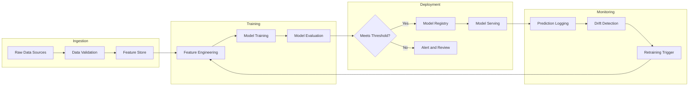
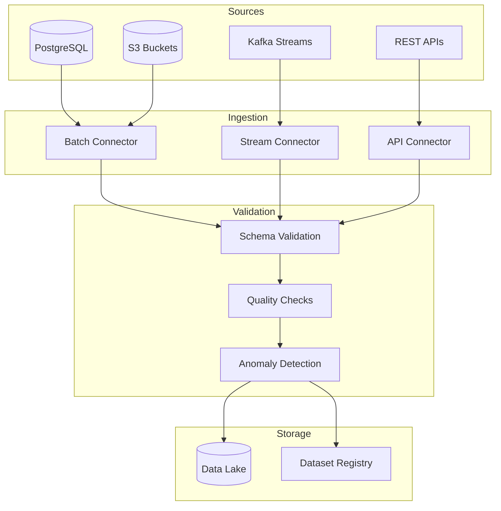
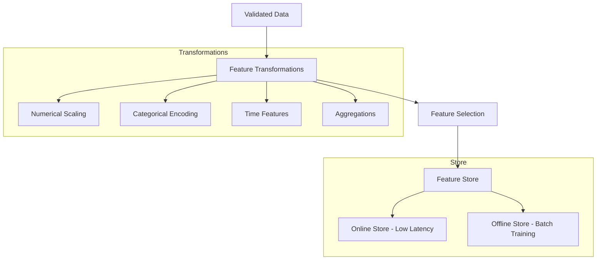
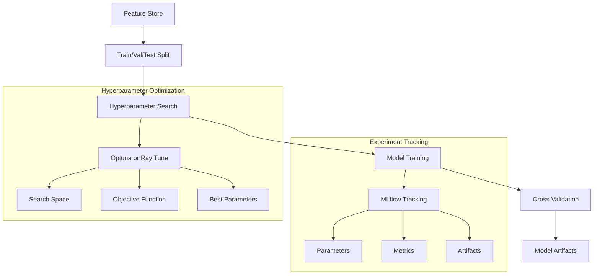
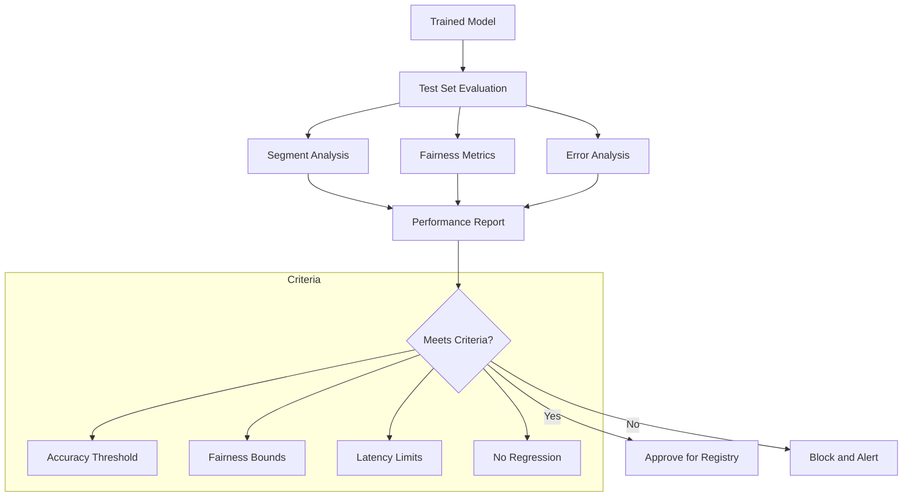
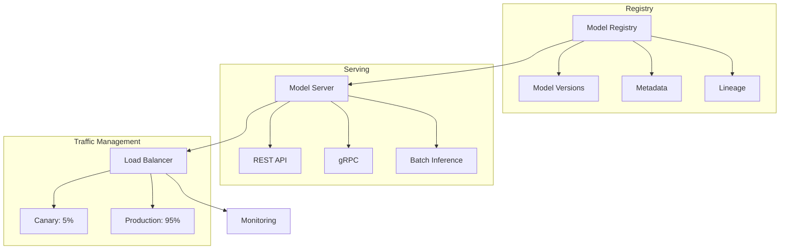
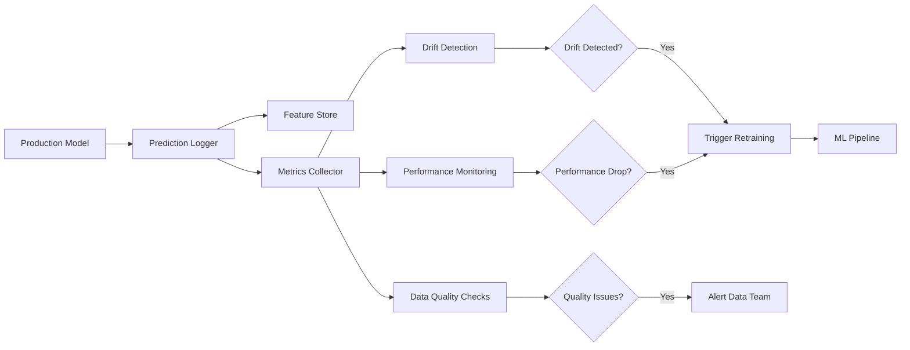

# How to Build ML Pipeline Architecture

Author: [nawazdhandala](https://github.com/nawazdhandala)

Tags: MLOps, Machine Learning, Pipeline, Architecture

Description: Learn how to design ML pipelines for reproducible model training and deployment.

---

Machine learning models in notebooks are experiments. Machine learning models in production are systems. The gap between these two worlds is where most ML projects fail. A well-designed ML pipeline architecture bridges this gap by automating the journey from raw data to deployed predictions, while maintaining the reproducibility and observability that production systems demand.

This guide walks through the architecture patterns, components, and implementation details you need to build ML pipelines that actually work in production.

---

## What Makes a Good ML Pipeline?

Before diving into components, let us establish what we are aiming for:

- **Reproducibility**: Any team member can recreate any model version from scratch
- **Traceability**: Every prediction can be traced back to its training data, code, and hyperparameters
- **Automation**: Manual steps are minimized; human intervention is for decisions, not execution
- **Modularity**: Components can be swapped, scaled, or debugged independently
- **Observability**: You know when things break and why

---

## High-Level Pipeline Architecture

Here is the bird's-eye view of a typical ML pipeline:



Each stage has distinct responsibilities and failure modes. Let us break them down.

---

## Stage 1: Data Ingestion

Data ingestion is where your pipeline begins. The goal is to collect raw data from various sources and prepare it for downstream processing.

### Key Considerations

- **Source diversity**: Databases, APIs, event streams, file drops
- **Data validation**: Schema checks, null handling, range validation
- **Versioning**: Track which data was used for which training run
- **Incremental vs. full loads**: Balance freshness against cost

### Data Ingestion Architecture



### Data Ingestion with Kubeflow

```python
# data_ingestion_component.py
# This component fetches data from a source and validates it
# before passing it to the feature engineering stage

from kfp import dsl
from kfp.dsl import Output, Dataset, Metrics
import pandas as pd
from typing import NamedTuple

@dsl.component(
    base_image="python:3.10",
    packages_to_install=["pandas", "sqlalchemy", "great-expectations"]
)
def ingest_data(
    db_connection_string: str,
    query: str,
    output_data: Output[Dataset],
    metrics: Output[Metrics]
) -> NamedTuple("Outputs", [("row_count", int), ("validation_passed", bool)]):
    """
    Ingest data from a database and perform basic validation.

    Args:
        db_connection_string: Database connection URI
        query: SQL query to execute
        output_data: Output artifact for the ingested data
        metrics: Output artifact for ingestion metrics

    Returns:
        row_count: Number of rows ingested
        validation_passed: Whether data passed validation checks
    """
    import pandas as pd
    from sqlalchemy import create_engine
    import great_expectations as gx
    from collections import namedtuple

    # Connect and fetch data
    engine = create_engine(db_connection_string)
    df = pd.read_sql(query, engine)

    # Log basic metrics
    row_count = len(df)
    metrics.log_metric("row_count", row_count)
    metrics.log_metric("column_count", len(df.columns))

    # Validate data using Great Expectations
    context = gx.get_context()

    # Define expectations for data quality
    expectations = [
        # Ensure no completely null ID columns
        {"expectation_type": "expect_column_values_to_not_be_null",
         "kwargs": {"column": "id", "mostly": 0.99}},
        # Timestamp should be recent
        {"expectation_type": "expect_column_values_to_be_between",
         "kwargs": {"column": "created_at", "min_value": "2024-01-01"}}
    ]

    # Run validation checks
    validation_passed = True
    for exp in expectations:
        result = df.expect(**exp)
        if not result.success:
            validation_passed = False
            metrics.log_metric(f"failed_{exp['expectation_type']}", 1)

    # Save validated data to parquet format
    df.to_parquet(output_data.path)

    Outputs = namedtuple("Outputs", ["row_count", "validation_passed"])
    return Outputs(row_count, validation_passed)
```

### Data Versioning with DVC

```yaml
# dvc.yaml
# Define your data pipeline stages for versioning

stages:
  fetch_raw_data:
    cmd: python scripts/fetch_data.py --output data/raw/
    deps:
      - scripts/fetch_data.py
    outs:
      - data/raw/transactions.parquet

  validate_data:
    cmd: python scripts/validate.py --input data/raw/ --output data/validated/
    deps:
      - scripts/validate.py
      - data/raw/transactions.parquet
    outs:
      - data/validated/transactions.parquet
    metrics:
      - data/validated/validation_report.json:
          cache: false
```

---

## Stage 2: Feature Engineering

Feature engineering transforms raw data into the inputs your model actually uses. This is often where the most value is created, and also where the most technical debt accumulates.

### Feature Engineering Pipeline



### Feature Engineering with Kubeflow

```python
# feature_engineering_component.py
# This component applies feature transformations and stores
# features in both online and offline feature stores

from kfp import dsl
from kfp.dsl import Input, Output, Dataset, Model

@dsl.component(
    base_image="python:3.10",
    packages_to_install=["pandas", "scikit-learn", "feast"]
)
def engineer_features(
    input_data: Input[Dataset],
    feature_config: dict,
    output_features: Output[Dataset],
    transformer: Output[Model]
):
    """
    Apply feature engineering transformations.

    This component:
    1. Loads validated data
    2. Applies configured transformations
    3. Saves the transformer for inference-time use
    4. Outputs the transformed features

    Args:
        input_data: Validated input dataset
        feature_config: Dictionary specifying transformations per column
        output_features: Transformed feature dataset
        transformer: Fitted transformer for inference
    """
    import pandas as pd
    import numpy as np
    from sklearn.preprocessing import StandardScaler, OneHotEncoder
    from sklearn.compose import ColumnTransformer
    from sklearn.pipeline import Pipeline
    import pickle

    # Load data from previous stage
    df = pd.read_parquet(input_data.path)

    # Define column types from config
    numeric_cols = feature_config.get("numeric_columns", [])
    categorical_cols = feature_config.get("categorical_columns", [])
    datetime_cols = feature_config.get("datetime_columns", [])

    # Create time-based features from datetime columns
    for col in datetime_cols:
        df[f"{col}_hour"] = pd.to_datetime(df[col]).dt.hour
        df[f"{col}_dayofweek"] = pd.to_datetime(df[col]).dt.dayofweek
        df[f"{col}_month"] = pd.to_datetime(df[col]).dt.month
        # Add these to numeric columns for scaling
        numeric_cols.extend([f"{col}_hour", f"{col}_dayofweek", f"{col}_month"])

    # Build preprocessing pipeline
    preprocessor = ColumnTransformer(
        transformers=[
            # Scale numeric features to zero mean, unit variance
            ("num", StandardScaler(), numeric_cols),
            # One-hot encode categorical features
            ("cat", OneHotEncoder(handle_unknown="ignore", sparse_output=False),
             categorical_cols)
        ],
        remainder="drop"  # Drop columns not specified
    )

    # Fit and transform the data
    features = preprocessor.fit_transform(df)

    # Get feature names for the transformed columns
    feature_names = (
        numeric_cols +
        list(preprocessor.named_transformers_["cat"].get_feature_names_out(categorical_cols))
    )

    # Create output dataframe with proper column names
    features_df = pd.DataFrame(features, columns=feature_names)

    # Preserve the target column if it exists
    if "target" in df.columns:
        features_df["target"] = df["target"].values

    # Save outputs
    features_df.to_parquet(output_features.path)

    # Save the fitted transformer for inference
    with open(transformer.path, "wb") as f:
        pickle.dump(preprocessor, f)
```

### Feature Store Integration with Feast

```python
# feature_store.py
# Define feature views for online and offline serving

from datetime import timedelta
from feast import Entity, Feature, FeatureView, FileSource, ValueType

# Define the entity (the thing we are making predictions about)
customer = Entity(
    name="customer_id",
    value_type=ValueType.INT64,
    description="Unique identifier for a customer"
)

# Define the data source for features
customer_transactions_source = FileSource(
    path="data/features/customer_transactions.parquet",
    timestamp_field="event_timestamp",
    created_timestamp_column="created_timestamp"
)

# Define the feature view with all customer transaction features
customer_transaction_features = FeatureView(
    name="customer_transaction_features",
    entities=["customer_id"],
    ttl=timedelta(days=90),  # Features older than 90 days are stale
    features=[
        Feature(name="transaction_count_30d", dtype=ValueType.INT64),
        Feature(name="avg_transaction_amount_30d", dtype=ValueType.DOUBLE),
        Feature(name="max_transaction_amount_30d", dtype=ValueType.DOUBLE),
        Feature(name="days_since_last_transaction", dtype=ValueType.INT64),
        Feature(name="unique_merchants_30d", dtype=ValueType.INT64),
    ],
    online=True,   # Enable online serving for real-time inference
    source=customer_transactions_source,
    tags={"team": "ml-platform", "status": "production"}
)
```

---

## Stage 3: Model Training

The training stage is where your features meet your algorithms. The key is making this process repeatable and trackable.

### Training Pipeline Architecture



### Training Component with MLflow Tracking

```python
# training_component.py
# This component trains a model with full experiment tracking

from kfp import dsl
from kfp.dsl import Input, Output, Dataset, Model, Metrics

@dsl.component(
    base_image="python:3.10",
    packages_to_install=[
        "pandas", "scikit-learn", "xgboost",
        "mlflow", "optuna"
    ]
)
def train_model(
    input_features: Input[Dataset],
    model_type: str,
    hyperparameter_search: bool,
    mlflow_tracking_uri: str,
    experiment_name: str,
    output_model: Output[Model],
    metrics: Output[Metrics]
):
    """
    Train a model with optional hyperparameter optimization.

    This component:
    1. Loads features from the feature engineering stage
    2. Splits data into train/validation/test sets
    3. Optionally runs hyperparameter search
    4. Trains the final model
    5. Logs everything to MLflow

    Args:
        input_features: Engineered features dataset
        model_type: Type of model to train (xgboost, random_forest, etc.)
        hyperparameter_search: Whether to run hyperparameter optimization
        mlflow_tracking_uri: URI for MLflow tracking server
        experiment_name: Name of the MLflow experiment
        output_model: Trained model artifact
        metrics: Training metrics output
    """
    import pandas as pd
    import numpy as np
    from sklearn.model_selection import train_test_split, cross_val_score
    from sklearn.metrics import (
        accuracy_score, precision_score, recall_score,
        f1_score, roc_auc_score
    )
    import xgboost as xgb
    from sklearn.ensemble import RandomForestClassifier
    import mlflow
    import optuna
    import pickle

    # Set up MLflow for experiment tracking
    mlflow.set_tracking_uri(mlflow_tracking_uri)
    mlflow.set_experiment(experiment_name)

    # Load features from previous stage
    df = pd.read_parquet(input_features.path)

    # Separate features and target
    X = df.drop(columns=["target"])
    y = df["target"]

    # Split data: 70% train, 15% validation, 15% test
    X_train, X_temp, y_train, y_temp = train_test_split(
        X, y, test_size=0.3, random_state=42, stratify=y
    )
    X_val, X_test, y_val, y_test = train_test_split(
        X_temp, y_temp, test_size=0.5, random_state=42, stratify=y_temp
    )

    # Define model configurations with hyperparameter search spaces
    model_configs = {
        "xgboost": {
            "class": xgb.XGBClassifier,
            "default_params": {
                "n_estimators": 100,
                "max_depth": 6,
                "learning_rate": 0.1,
                "random_state": 42,
                "use_label_encoder": False,
                "eval_metric": "logloss"
            },
            "search_space": {
                "n_estimators": ("int", 50, 300),
                "max_depth": ("int", 3, 10),
                "learning_rate": ("float", 0.01, 0.3),
                "subsample": ("float", 0.6, 1.0),
                "colsample_bytree": ("float", 0.6, 1.0)
            }
        },
        "random_forest": {
            "class": RandomForestClassifier,
            "default_params": {
                "n_estimators": 100,
                "max_depth": 10,
                "random_state": 42
            },
            "search_space": {
                "n_estimators": ("int", 50, 300),
                "max_depth": ("int", 5, 20),
                "min_samples_split": ("int", 2, 10),
                "min_samples_leaf": ("int", 1, 5)
            }
        }
    }

    config = model_configs[model_type]

    def objective(trial):
        """Optuna objective function for hyperparameter search."""
        params = {}
        for param_name, (param_type, low, high) in config["search_space"].items():
            if param_type == "int":
                params[param_name] = trial.suggest_int(param_name, low, high)
            elif param_type == "float":
                params[param_name] = trial.suggest_float(param_name, low, high)

        # Add fixed params
        params["random_state"] = 42
        if model_type == "xgboost":
            params["use_label_encoder"] = False
            params["eval_metric"] = "logloss"

        model = config["class"](**params)
        scores = cross_val_score(model, X_train, y_train, cv=5, scoring="roc_auc")
        return scores.mean()

    # Start MLflow run for tracking
    with mlflow.start_run():
        # Log dataset info
        mlflow.log_param("train_size", len(X_train))
        mlflow.log_param("val_size", len(X_val))
        mlflow.log_param("test_size", len(X_test))
        mlflow.log_param("n_features", X_train.shape[1])
        mlflow.log_param("model_type", model_type)

        if hyperparameter_search:
            # Run Optuna optimization to find best hyperparameters
            study = optuna.create_study(direction="maximize")
            study.optimize(objective, n_trials=50, show_progress_bar=True)

            best_params = study.best_params
            best_params["random_state"] = 42
            if model_type == "xgboost":
                best_params["use_label_encoder"] = False
                best_params["eval_metric"] = "logloss"

            mlflow.log_params({"best_" + k: v for k, v in best_params.items()})
            mlflow.log_metric("best_cv_score", study.best_value)
        else:
            best_params = config["default_params"]

        # Train final model with best parameters
        model = config["class"](**best_params)
        model.fit(X_train, y_train)

        # Evaluate on validation set
        y_val_pred = model.predict(X_val)
        y_val_proba = model.predict_proba(X_val)[:, 1]

        val_metrics = {
            "val_accuracy": accuracy_score(y_val, y_val_pred),
            "val_precision": precision_score(y_val, y_val_pred),
            "val_recall": recall_score(y_val, y_val_pred),
            "val_f1": f1_score(y_val, y_val_pred),
            "val_roc_auc": roc_auc_score(y_val, y_val_proba)
        }

        # Evaluate on test set (final holdout)
        y_test_pred = model.predict(X_test)
        y_test_proba = model.predict_proba(X_test)[:, 1]

        test_metrics = {
            "test_accuracy": accuracy_score(y_test, y_test_pred),
            "test_precision": precision_score(y_test, y_test_pred),
            "test_recall": recall_score(y_test, y_test_pred),
            "test_f1": f1_score(y_test, y_test_pred),
            "test_roc_auc": roc_auc_score(y_test, y_test_proba)
        }

        # Log all metrics to MLflow
        mlflow.log_metrics(val_metrics)
        mlflow.log_metrics(test_metrics)

        # Log to Kubeflow metrics as well
        for name, value in {**val_metrics, **test_metrics}.items():
            metrics.log_metric(name, value)

        # Log model to MLflow
        mlflow.sklearn.log_model(model, "model")

        # Save model artifact for Kubeflow
        with open(output_model.path, "wb") as f:
            pickle.dump(model, f)

        # Log feature importances if available
        if hasattr(model, "feature_importances_"):
            importance_df = pd.DataFrame({
                "feature": X_train.columns,
                "importance": model.feature_importances_
            }).sort_values("importance", ascending=False)

            mlflow.log_table(importance_df, "feature_importances.json")
```

---

## Stage 4: Model Evaluation

Evaluation goes beyond simple metrics. You need to understand how your model behaves across different segments, edge cases, and over time.

### Evaluation Pipeline



### Model Evaluation Component

```python
# evaluation_component.py
# This component performs comprehensive model evaluation

from kfp import dsl
from kfp.dsl import Input, Output, Model, Dataset, Metrics, HTML
from typing import NamedTuple

@dsl.component(
    base_image="python:3.10",
    packages_to_install=[
        "pandas", "scikit-learn", "matplotlib",
        "seaborn", "fairlearn"
    ]
)
def evaluate_model(
    model: Input[Model],
    test_data: Input[Dataset],
    evaluation_config: dict,
    metrics: Output[Metrics],
    report: Output[HTML]
) -> NamedTuple("Outputs", [("approved", bool), ("reason", str)]):
    """
    Comprehensive model evaluation with fairness and segment analysis.

    This component:
    1. Evaluates model on test set
    2. Analyzes performance across segments
    3. Checks fairness metrics
    4. Generates a visual report
    5. Makes approval decision based on thresholds

    Args:
        model: Trained model artifact
        test_data: Test dataset for evaluation
        evaluation_config: Thresholds and configuration
        metrics: Evaluation metrics output
        report: HTML report artifact

    Returns:
        approved: Whether model passes evaluation criteria
        reason: Explanation for the decision
    """
    import pandas as pd
    import numpy as np
    import pickle
    from sklearn.metrics import (
        classification_report, confusion_matrix,
        roc_curve, precision_recall_curve, roc_auc_score
    )
    from fairlearn.metrics import MetricFrame, selection_rate
    import matplotlib.pyplot as plt
    import seaborn as sns
    from collections import namedtuple
    import io
    import base64

    # Load model and data
    with open(model.path, "rb") as f:
        trained_model = pickle.load(f)

    test_df = pd.read_parquet(test_data.path)
    X_test = test_df.drop(columns=["target"])
    y_test = test_df["target"]

    # Get predictions
    y_pred = trained_model.predict(X_test)
    y_proba = trained_model.predict_proba(X_test)[:, 1]

    # Calculate core metrics
    roc_auc = roc_auc_score(y_test, y_proba)

    # Log metrics
    metrics.log_metric("roc_auc", roc_auc)

    # Check approval criteria
    thresholds = evaluation_config.get("thresholds", {})
    min_roc_auc = thresholds.get("min_roc_auc", 0.7)
    max_fairness_gap = thresholds.get("max_fairness_gap", 0.1)

    approval_checks = []

    # Check 1: ROC-AUC threshold
    if roc_auc >= min_roc_auc:
        approval_checks.append(("roc_auc", True, f"ROC-AUC {roc_auc:.3f} >= {min_roc_auc}"))
    else:
        approval_checks.append(("roc_auc", False, f"ROC-AUC {roc_auc:.3f} < {min_roc_auc}"))

    # Check 2: Fairness across sensitive attributes (if present)
    sensitive_columns = evaluation_config.get("sensitive_columns", [])
    for col in sensitive_columns:
        if col in test_df.columns:
            metric_frame = MetricFrame(
                metrics={"selection_rate": selection_rate},
                y_true=y_test,
                y_pred=y_pred,
                sensitive_features=test_df[col]
            )

            rates = metric_frame.by_group["selection_rate"]
            fairness_gap = rates.max() - rates.min()

            metrics.log_metric(f"fairness_gap_{col}", fairness_gap)

            if fairness_gap <= max_fairness_gap:
                approval_checks.append((
                    f"fairness_{col}", True,
                    f"Fairness gap {fairness_gap:.3f} <= {max_fairness_gap}"
                ))
            else:
                approval_checks.append((
                    f"fairness_{col}", False,
                    f"Fairness gap {fairness_gap:.3f} > {max_fairness_gap}"
                ))

    # Generate HTML report
    html_parts = ["<html><head><style>"]
    html_parts.append("body { font-family: Arial, sans-serif; margin: 20px; }")
    html_parts.append("table { border-collapse: collapse; margin: 10px 0; }")
    html_parts.append("th, td { border: 1px solid #ddd; padding: 8px; text-align: left; }")
    html_parts.append("th { background-color: #4CAF50; color: white; }")
    html_parts.append(".pass { color: green; } .fail { color: red; }")
    html_parts.append("</style></head><body>")

    html_parts.append("<h1>Model Evaluation Report</h1>")

    # Approval status table
    html_parts.append("<h2>Approval Checks</h2>")
    html_parts.append("<table><tr><th>Check</th><th>Status</th><th>Details</th></tr>")
    for check_name, passed, details in approval_checks:
        status_class = "pass" if passed else "fail"
        status_text = "PASS" if passed else "FAIL"
        html_parts.append(
            f"<tr><td>{check_name}</td>"
            f"<td class='{status_class}'>{status_text}</td>"
            f"<td>{details}</td></tr>"
        )
    html_parts.append("</table>")

    # Classification report
    html_parts.append("<h2>Classification Report</h2>")
    html_parts.append(f"<pre>{classification_report(y_test, y_pred)}</pre>")

    # Generate ROC curve visualization
    fpr, tpr, _ = roc_curve(y_test, y_proba)
    fig, ax = plt.subplots(figsize=(8, 6))
    ax.plot(fpr, tpr, label=f"ROC Curve (AUC = {roc_auc:.3f})")
    ax.plot([0, 1], [0, 1], "k--", label="Random")
    ax.set_xlabel("False Positive Rate")
    ax.set_ylabel("True Positive Rate")
    ax.set_title("ROC Curve")
    ax.legend()

    # Convert plot to base64 for HTML embedding
    buf = io.BytesIO()
    fig.savefig(buf, format="png", bbox_inches="tight")
    buf.seek(0)
    img_base64 = base64.b64encode(buf.read()).decode()
    plt.close(fig)

    html_parts.append("<h2>ROC Curve</h2>")
    html_parts.append(f'')

    html_parts.append("</body></html>")

    # Write report
    with open(report.path, "w") as f:
        f.write("".join(html_parts))

    # Determine final approval
    all_passed = all(check[1] for check in approval_checks)
    failed_checks = [check[2] for check in approval_checks if not check[1]]

    if all_passed:
        reason = "All evaluation criteria passed"
    else:
        reason = "Failed checks: " + "; ".join(failed_checks)

    Outputs = namedtuple("Outputs", ["approved", "reason"])
    return Outputs(all_passed, reason)
```

---

## Stage 5: Model Deployment

Deployment is where your model starts generating value. The architecture needs to support safe rollouts, easy rollbacks, and multiple serving patterns.

### Deployment Architecture



### MLflow Model Registry

```python
# model_registry.py
# Register and manage model versions in MLflow

import mlflow
from mlflow.tracking import MlflowClient

def register_model(
    run_id: str,
    model_name: str,
    description: str,
    tags: dict
) -> str:
    """
    Register a trained model in the MLflow Model Registry.

    Args:
        run_id: MLflow run ID containing the model
        model_name: Name for the registered model
        description: Human-readable description
        tags: Key-value tags for the model version

    Returns:
        version: The registered model version number
    """
    client = MlflowClient()

    # Create the registered model if it does not exist
    try:
        client.create_registered_model(
            name=model_name,
            description=description
        )
    except mlflow.exceptions.RestException:
        # Model already exists, continue
        pass

    # Register the model version from the run
    model_uri = f"runs:/{run_id}/model"
    model_version = mlflow.register_model(
        model_uri=model_uri,
        name=model_name
    )

    # Add tags for tracking
    for key, value in tags.items():
        client.set_model_version_tag(
            name=model_name,
            version=model_version.version,
            key=key,
            value=value
        )

    return model_version.version


def promote_model(
    model_name: str,
    version: str,
    stage: str
) -> None:
    """
    Promote a model version to a new stage.

    Stages: None -> Staging -> Production -> Archived

    Args:
        model_name: Name of the registered model
        version: Version number to promote
        stage: Target stage (Staging, Production, Archived)
    """
    client = MlflowClient()

    # Transition to new stage
    client.transition_model_version_stage(
        name=model_name,
        version=version,
        stage=stage,
        archive_existing_versions=(stage == "Production")
    )

    print(f"Model {model_name} version {version} promoted to {stage}")
```

### Kubernetes Deployment with Canary

```yaml
# kubernetes/model-deployment.yaml
# Deploy model with canary traffic splitting

apiVersion: serving.kubeflow.org/v1beta1
kind: InferenceService
metadata:
  name: fraud-detection-model
  namespace: ml-serving
  annotations:
    # Enable canary deployment
    serving.kubeflow.org/canaryTrafficPercent: "10"
spec:
  predictor:
    # Production model (90% traffic)
    model:
      modelFormat:
        name: mlflow
      storageUri: "s3://models/fraud-detection/production"
      resources:
        requests:
          cpu: "1"
          memory: "2Gi"
        limits:
          cpu: "2"
          memory: "4Gi"
    # Auto-scaling configuration
    minReplicas: 2
    maxReplicas: 10
    scaleTarget: 100  # Target concurrent requests per replica
    scaleMetric: concurrency

  canaryTrafficPercent: 10
  canary:
    # Canary model (10% traffic)
    predictor:
      model:
        modelFormat:
          name: mlflow
        storageUri: "s3://models/fraud-detection/canary"
        resources:
          requests:
            cpu: "1"
            memory: "2Gi"
          limits:
            cpu: "2"
            memory: "4Gi"
---
# Horizontal Pod Autoscaler for scaling
apiVersion: autoscaling/v2
kind: HorizontalPodAutoscaler
metadata:
  name: fraud-detection-hpa
  namespace: ml-serving
spec:
  scaleTargetRef:
    apiVersion: serving.kubeflow.org/v1beta1
    kind: InferenceService
    name: fraud-detection-model
  minReplicas: 2
  maxReplicas: 20
  metrics:
    - type: Resource
      resource:
        name: cpu
        target:
          type: Utilization
          averageUtilization: 70
    - type: Pods
      pods:
        metric:
          name: http_requests_per_second
        target:
          type: AverageValue
          averageValue: "100"
```

---

## Putting It All Together: Complete Kubeflow Pipeline

Here is how all the stages connect in a single Kubeflow pipeline:

```python
# ml_pipeline.py
# Complete ML pipeline definition

from kfp import dsl
from kfp import compiler
from typing import NamedTuple

# Import components (defined above)
from components.data_ingestion import ingest_data
from components.feature_engineering import engineer_features
from components.training import train_model
from components.evaluation import evaluate_model

@dsl.pipeline(
    name="fraud-detection-pipeline",
    description="End-to-end ML pipeline for fraud detection"
)
def fraud_detection_pipeline(
    db_connection_string: str,
    data_query: str,
    feature_config: dict,
    model_type: str = "xgboost",
    hyperparameter_search: bool = True,
    mlflow_tracking_uri: str = "http://mlflow:5000",
    experiment_name: str = "fraud-detection",
    evaluation_config: dict = {
        "thresholds": {"min_roc_auc": 0.85, "max_fairness_gap": 0.1},
        "sensitive_columns": ["gender", "age_group"]
    }
):
    """
    Complete ML pipeline from data ingestion to model evaluation.

    Pipeline stages:
    1. Data Ingestion: Fetch and validate data
    2. Feature Engineering: Transform raw data into features
    3. Model Training: Train model with experiment tracking
    4. Model Evaluation: Comprehensive evaluation and approval
    """

    # Stage 1: Data Ingestion
    ingest_task = ingest_data(
        db_connection_string=db_connection_string,
        query=data_query
    )

    # Gate: Only proceed if data validation passed
    with dsl.Condition(ingest_task.outputs["validation_passed"] == True):

        # Stage 2: Feature Engineering
        feature_task = engineer_features(
            input_data=ingest_task.outputs["output_data"],
            feature_config=feature_config
        )

        # Stage 3: Model Training
        train_task = train_model(
            input_features=feature_task.outputs["output_features"],
            model_type=model_type,
            hyperparameter_search=hyperparameter_search,
            mlflow_tracking_uri=mlflow_tracking_uri,
            experiment_name=experiment_name
        )

        # Stage 4: Model Evaluation
        eval_task = evaluate_model(
            model=train_task.outputs["output_model"],
            test_data=feature_task.outputs["output_features"],
            evaluation_config=evaluation_config
        )

        # Log approval decision
        with dsl.Condition(eval_task.outputs["approved"] == True):
            # Model approved: could trigger deployment here
            pass


# Compile the pipeline to YAML
if __name__ == "__main__":
    compiler.Compiler().compile(
        pipeline_func=fraud_detection_pipeline,
        package_path="fraud_detection_pipeline.yaml"
    )
```

### Pipeline Execution

```python
# run_pipeline.py
# Execute the pipeline on Kubeflow

from kfp.client import Client

def run_pipeline():
    """Submit the pipeline to Kubeflow."""

    # Connect to Kubeflow Pipelines
    client = Client(host="https://kubeflow.example.com")

    # Define pipeline parameters
    parameters = {
        "db_connection_string": "postgresql://user:pass@db:5432/transactions",
        "data_query": """
            SELECT * FROM transactions
            WHERE created_at >= NOW() - INTERVAL '90 days'
        """,
        "feature_config": {
            "numeric_columns": ["amount", "merchant_score", "distance_from_home"],
            "categorical_columns": ["merchant_category", "card_type"],
            "datetime_columns": ["transaction_time"]
        },
        "model_type": "xgboost",
        "hyperparameter_search": True
    }

    # Submit run
    run = client.create_run_from_pipeline_func(
        fraud_detection_pipeline,
        arguments=parameters,
        experiment_name="fraud-detection-experiments",
        run_name="fraud-detection-run-001"
    )

    print(f"Pipeline submitted: {run.run_id}")
    return run


if __name__ == "__main__":
    run_pipeline()
```

---

## Monitoring and Continuous Improvement

A deployed model is not a finished model. You need continuous monitoring to catch drift, degradation, and data quality issues.

### Monitoring Architecture



### Drift Detection Component

```python
# monitoring/drift_detection.py
# Monitor for data and concept drift

from dataclasses import dataclass
from typing import Optional
import numpy as np
from scipy import stats

@dataclass
class DriftResult:
    """Result of a drift detection check."""
    feature_name: str
    drift_detected: bool
    drift_score: float
    p_value: float
    threshold: float
    reference_stats: dict
    current_stats: dict


class DriftDetector:
    """
    Detect distribution drift between reference and current data.

    Uses Kolmogorov-Smirnov test for continuous features
    and Chi-squared test for categorical features.
    """

    def __init__(
        self,
        reference_data: np.ndarray,
        feature_names: list,
        categorical_features: Optional[list] = None,
        p_value_threshold: float = 0.05
    ):
        """
        Initialize detector with reference (training) data.

        Args:
            reference_data: Training data distribution
            feature_names: Names of features
            categorical_features: List of categorical feature names
            p_value_threshold: Threshold for drift detection
        """
        self.reference_data = reference_data
        self.feature_names = feature_names
        self.categorical_features = categorical_features or []
        self.p_value_threshold = p_value_threshold

        # Compute reference statistics
        self.reference_stats = self._compute_statistics(reference_data)

    def _compute_statistics(self, data: np.ndarray) -> dict:
        """Compute summary statistics for each feature."""
        stats_dict = {}

        for i, name in enumerate(self.feature_names):
            feature_data = data[:, i]

            if name in self.categorical_features:
                # For categorical: compute value counts
                unique, counts = np.unique(feature_data, return_counts=True)
                stats_dict[name] = {
                    "type": "categorical",
                    "unique_values": unique.tolist(),
                    "counts": counts.tolist(),
                    "proportions": (counts / counts.sum()).tolist()
                }
            else:
                # For numerical: compute distribution stats
                stats_dict[name] = {
                    "type": "numerical",
                    "mean": float(np.mean(feature_data)),
                    "std": float(np.std(feature_data)),
                    "median": float(np.median(feature_data)),
                    "min": float(np.min(feature_data)),
                    "max": float(np.max(feature_data)),
                    "percentiles": {
                        "25": float(np.percentile(feature_data, 25)),
                        "75": float(np.percentile(feature_data, 75)),
                        "95": float(np.percentile(feature_data, 95))
                    }
                }

        return stats_dict

    def detect_drift(self, current_data: np.ndarray) -> list[DriftResult]:
        """
        Detect drift between reference and current data.

        Args:
            current_data: Recent production data

        Returns:
            List of DriftResult for each feature
        """
        results = []
        current_stats = self._compute_statistics(current_data)

        for i, name in enumerate(self.feature_names):
            ref_feature = self.reference_data[:, i]
            curr_feature = current_data[:, i]

            if name in self.categorical_features:
                # Chi-squared test for categorical features
                # Build contingency table
                all_categories = set(ref_feature) | set(curr_feature)
                ref_counts = np.array([
                    np.sum(ref_feature == cat) for cat in all_categories
                ])
                curr_counts = np.array([
                    np.sum(curr_feature == cat) for cat in all_categories
                ])

                # Normalize to same scale
                ref_expected = ref_counts / ref_counts.sum() * curr_counts.sum()

                # Avoid division by zero
                ref_expected = np.maximum(ref_expected, 1e-10)

                chi2_stat, p_value = stats.chisquare(curr_counts, ref_expected)
                drift_score = chi2_stat

            else:
                # Kolmogorov-Smirnov test for numerical features
                ks_stat, p_value = stats.ks_2samp(ref_feature, curr_feature)
                drift_score = ks_stat

            drift_detected = p_value < self.p_value_threshold

            results.append(DriftResult(
                feature_name=name,
                drift_detected=drift_detected,
                drift_score=float(drift_score),
                p_value=float(p_value),
                threshold=self.p_value_threshold,
                reference_stats=self.reference_stats[name],
                current_stats=current_stats[name]
            ))

        return results

    def should_retrain(
        self,
        results: list[DriftResult],
        max_drifted_features: int = 3
    ) -> tuple[bool, str]:
        """
        Decide if model should be retrained based on drift results.

        Args:
            results: List of drift detection results
            max_drifted_features: Threshold for triggering retraining

        Returns:
            should_retrain: Whether to trigger retraining
            reason: Explanation for the decision
        """
        drifted_features = [r for r in results if r.drift_detected]

        if len(drifted_features) >= max_drifted_features:
            feature_names = [r.feature_name for r in drifted_features]
            return True, f"Drift detected in {len(drifted_features)} features: {feature_names}"

        return False, f"Only {len(drifted_features)} features drifted (threshold: {max_drifted_features})"
```

---

## Best Practices Summary

### Data Ingestion
- Validate data at ingestion time, not after processing
- Version your data alongside your code
- Use incremental loads when possible to reduce costs

### Feature Engineering
- Use a feature store for consistency between training and serving
- Version your feature transformations
- Document feature semantics and business logic

### Model Training
- Track every experiment with MLflow or similar
- Use cross-validation, not just a single train/test split
- Automate hyperparameter search

### Evaluation
- Go beyond accuracy: check fairness, calibration, and segment performance
- Define clear promotion criteria before training
- Keep a holdout set that is never used during development

### Deployment
- Use canary deployments to catch issues early
- Implement shadow mode for new models
- Have a one-click rollback mechanism

### Monitoring
- Monitor input data distribution, not just model outputs
- Set up alerts for drift, performance degradation, and data quality
- Automate retraining triggers but require human approval

---

## Conclusion

Building a production ML pipeline is not about using the fanciest tools. It is about creating a system that is reproducible, traceable, and maintainable. Start simple: version your data, track your experiments, validate your models before deployment, and monitor after deployment.

The tools in this guide, including Kubeflow, MLflow, and Feast, are mature and battle-tested. But remember: the tools are less important than the principles. A well-designed pipeline with simpler tools will outperform a poorly designed pipeline with cutting-edge technology.

Start with one model, one pipeline, one deployment. Get the fundamentals right. Then scale.

---

**Related Reading:**
- [The Five Stages of SRE Maturity](https://oneuptime.com/blog/post/2025-09-01-the-five-stages-of-sre-maturity/view)
- [Monitoring vs Observability for SRE](https://oneuptime.com/blog/post/2025-11-28-monitoring-vs-observability-sre/view)
- [Kubernetes GitOps with ArgoCD](https://oneuptime.com/blog/post/2026-01-06-kubernetes-gitops-argocd/view)
