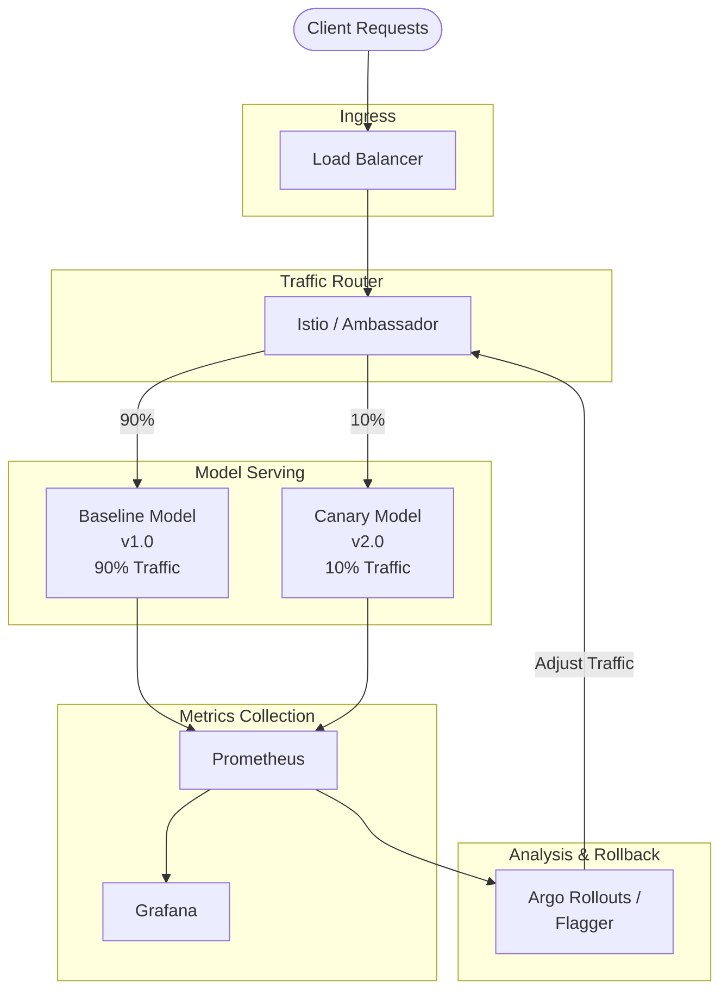
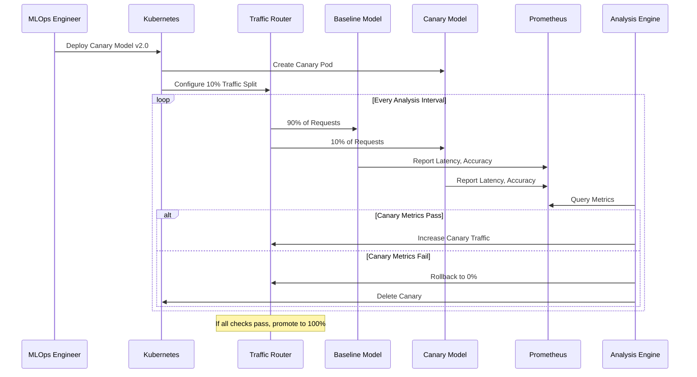

# How to Implement Canary Model Deployment

Author: [nawazdhandala](https://github.com/nawazdhandala)

Tags: MLOps, Canary Deployment, Model Serving, Progressive Rollout

Description: Learn to implement canary model deployment for gradual rollout of new ML models with traffic splitting.

---

# Overview

Canary deployment is a progressive rollout strategy that allows you to safely deploy new machine learning models by gradually shifting traffic from the existing (baseline) model to the new (canary) model. This approach minimizes risk by exposing only a small percentage of users to the new model initially, then increasing traffic based on performance metrics.

In this guide, we will explore how to implement canary deployments for ML models using Seldon Core and KServe, two popular model serving frameworks for Kubernetes.

## Why Canary Deployments for ML Models?

Machine learning models present unique deployment challenges compared to traditional software:

- **Silent failures**: A model can return predictions without errors but still perform poorly
- **Data drift**: Production data may differ from training data in unexpected ways
- **Performance regression**: A new model might have worse accuracy than the current production model
- **Resource consumption**: New models may have different latency or memory characteristics

Canary deployments address these challenges by allowing you to:

1. Compare real-time performance between models
2. Automatically rollback if metrics degrade
3. Gradually increase confidence before full rollout
4. Minimize blast radius of problematic deployments

## Canary Deployment Architecture

The following diagram illustrates the high-level architecture of a canary model deployment:



## Traffic Splitting Flow

The canary deployment process follows a structured progression:



## Implementation with Seldon Core

Seldon Core is a powerful open-source platform for deploying ML models on Kubernetes. It provides native support for canary deployments through its SeldonDeployment custom resource.

### Prerequisites

Before implementing canary deployments with Seldon Core, ensure you have:

```bash
# Install Seldon Core using Helm
# The seldon-system namespace will contain all Seldon Core components
helm install seldon-core seldon-core-operator \
    --repo https://storage.googleapis.com/seldon-charts \
    --namespace seldon-system \
    --create-namespace \
    --set usageMetrics.enabled=true \
    --set istio.enabled=true
```

### Baseline Model Deployment

First, deploy your baseline model that will receive most of the traffic:

```yaml
# baseline-model.yaml
# This SeldonDeployment creates the initial production model
# that will serve as the comparison baseline for canary releases
apiVersion: machinelearning.seldon.io/v1
kind: SeldonDeployment
metadata:
  name: fraud-detection-model
  namespace: ml-production
spec:
  # Name identifies this deployment in metrics and logs
  name: fraud-detector

  # Predictors define the model serving configurations
  # Each predictor can have different traffic weights
  predictors:
    - name: baseline
      # Traffic weight: 100% goes to baseline initially
      traffic: 100

      # Graph defines the inference pipeline
      # Can include transformers, routers, and combiners
      graph:
        name: classifier
        # SKLEARN_SERVER is optimized for scikit-learn models
        implementation: SKLEARN_SERVER
        # Model URI points to your model artifact storage
        modelUri: gs://ml-models/fraud-detection/v1.0

        # Environment variables for model configuration
        envSecretRefName: model-secrets

      # Component specifications define resource limits
      componentSpecs:
        - spec:
            containers:
              - name: classifier
                resources:
                  requests:
                    memory: "2Gi"
                    cpu: "1"
                  limits:
                    memory: "4Gi"
                    cpu: "2"

      # Replicas for high availability
      replicas: 3

      # Annotations for Prometheus scraping
      annotations:
        seldon.io/engine-prometheus-path: "/prometheus"
```

### Adding a Canary Model

To add a canary model, update the SeldonDeployment with a second predictor:

```yaml
# canary-deployment.yaml
# This configuration adds a canary predictor alongside the baseline
# Traffic is split between both models based on the 'traffic' field
apiVersion: machinelearning.seldon.io/v1
kind: SeldonDeployment
metadata:
  name: fraud-detection-model
  namespace: ml-production
spec:
  name: fraud-detector
  predictors:
    # Baseline predictor - receives 90% of traffic
    - name: baseline
      traffic: 90
      graph:
        name: classifier
        implementation: SKLEARN_SERVER
        modelUri: gs://ml-models/fraud-detection/v1.0
      componentSpecs:
        - spec:
            containers:
              - name: classifier
                resources:
                  requests:
                    memory: "2Gi"
                    cpu: "1"
                  limits:
                    memory: "4Gi"
                    cpu: "2"
      replicas: 3

    # Canary predictor - receives 10% of traffic for testing
    - name: canary
      traffic: 10

      # Labels help identify canary metrics in Prometheus
      labels:
        version: v2.0
        deployment-type: canary

      graph:
        name: classifier
        implementation: SKLEARN_SERVER
        # New model version for canary testing
        modelUri: gs://ml-models/fraud-detection/v2.0

        # Optional: Add custom parameters for the new model
        parameters:
          - name: threshold
            type: FLOAT
            value: "0.7"

      componentSpecs:
        - spec:
            containers:
              - name: classifier
                resources:
                  requests:
                    memory: "2Gi"
                    cpu: "1"
                  limits:
                    memory: "4Gi"
                    cpu: "2"
      # Fewer replicas for canary - scale up after promotion
      replicas: 1
```

### Progressive Traffic Shifting Script

Use this Python script to progressively shift traffic based on metrics:

```python
#!/usr/bin/env python3
"""
Canary Traffic Controller for Seldon Core

This script implements progressive traffic shifting for ML model canary deployments.
It queries Prometheus for model performance metrics and automatically adjusts
traffic distribution between baseline and canary models.

Usage:
    python canary_controller.py --namespace ml-production --deployment fraud-detection-model
"""

import time
import argparse
from typing import Dict, Optional, Tuple
from kubernetes import client, config
from prometheus_api_client import PrometheusConnect

# Traffic progression stages (percentage to canary)
# Each stage represents a milestone in the canary rollout
TRAFFIC_STAGES = [10, 25, 50, 75, 100]

# Metrics thresholds for canary promotion
# Canary must meet these criteria to proceed to next stage
LATENCY_THRESHOLD_MS = 200  # Maximum p99 latency in milliseconds
ERROR_RATE_THRESHOLD = 0.01  # Maximum 1% error rate
ACCURACY_THRESHOLD = 0.95  # Minimum 95% accuracy


class CanaryController:
    """
    Controls the progressive rollout of canary ML model deployments.

    This controller monitors model performance metrics and automatically
    adjusts traffic distribution between baseline and canary models.
    """

    def __init__(
        self,
        namespace: str,
        deployment_name: str,
        prometheus_url: str = "http://prometheus:9090"
    ):
        """
        Initialize the canary controller.

        Args:
            namespace: Kubernetes namespace containing the SeldonDeployment
            deployment_name: Name of the SeldonDeployment to manage
            prometheus_url: URL of the Prometheus server for metrics queries
        """
        # Load Kubernetes configuration (in-cluster or from kubeconfig)
        try:
            config.load_incluster_config()
        except config.ConfigException:
            config.load_kube_config()

        self.namespace = namespace
        self.deployment_name = deployment_name
        self.custom_api = client.CustomObjectsApi()
        self.prom = PrometheusConnect(url=prometheus_url, disable_ssl=True)

    def get_current_traffic(self) -> Tuple[int, int]:
        """
        Retrieve current traffic split between baseline and canary.

        Returns:
            Tuple of (baseline_traffic, canary_traffic) percentages
        """
        # Fetch the current SeldonDeployment configuration
        deployment = self.custom_api.get_namespaced_custom_object(
            group="machinelearning.seldon.io",
            version="v1",
            namespace=self.namespace,
            plural="seldondeployments",
            name=self.deployment_name
        )

        baseline_traffic = 100
        canary_traffic = 0

        # Extract traffic weights from each predictor
        for predictor in deployment["spec"]["predictors"]:
            if predictor["name"] == "baseline":
                baseline_traffic = predictor.get("traffic", 100)
            elif predictor["name"] == "canary":
                canary_traffic = predictor.get("traffic", 0)

        return baseline_traffic, canary_traffic

    def get_model_metrics(self, predictor_name: str) -> Dict[str, float]:
        """
        Query Prometheus for model performance metrics.

        Args:
            predictor_name: Name of the predictor (baseline or canary)

        Returns:
            Dictionary containing latency_p99, error_rate, and accuracy metrics
        """
        # Query p99 latency over the last 5 minutes
        # This captures the tail latency which affects user experience
        latency_query = f'''
            histogram_quantile(0.99,
                sum(rate(seldon_api_executor_client_requests_seconds_bucket{{
                    deployment_name="{self.deployment_name}",
                    predictor_name="{predictor_name}"
                }}[5m])) by (le)
            )
        '''

        # Query error rate as percentage of failed requests
        error_query = f'''
            sum(rate(seldon_api_executor_client_requests_seconds_count{{
                deployment_name="{self.deployment_name}",
                predictor_name="{predictor_name}",
                code!="200"
            }}[5m]))
            /
            sum(rate(seldon_api_executor_client_requests_seconds_count{{
                deployment_name="{self.deployment_name}",
                predictor_name="{predictor_name}"
            }}[5m]))
        '''

        # Query custom accuracy metric (must be exposed by your model)
        # This assumes your model reports an accuracy gauge metric
        accuracy_query = f'''
            avg(model_accuracy{{
                deployment_name="{self.deployment_name}",
                predictor_name="{predictor_name}"
            }})
        '''

        # Execute queries and extract values
        latency_result = self.prom.custom_query(latency_query)
        error_result = self.prom.custom_query(error_query)
        accuracy_result = self.prom.custom_query(accuracy_query)

        return {
            "latency_p99": float(latency_result[0]["value"][1]) * 1000 if latency_result else 0,
            "error_rate": float(error_result[0]["value"][1]) if error_result else 0,
            "accuracy": float(accuracy_result[0]["value"][1]) if accuracy_result else 1.0
        }

    def evaluate_canary(self) -> Tuple[bool, str]:
        """
        Evaluate if the canary model meets promotion criteria.

        Compares canary metrics against baseline and absolute thresholds.

        Returns:
            Tuple of (should_promote, reason_message)
        """
        baseline_metrics = self.get_model_metrics("baseline")
        canary_metrics = self.get_model_metrics("canary")

        print(f"Baseline metrics: {baseline_metrics}")
        print(f"Canary metrics: {canary_metrics}")

        # Check absolute latency threshold
        if canary_metrics["latency_p99"] > LATENCY_THRESHOLD_MS:
            return False, f"Canary latency {canary_metrics['latency_p99']:.2f}ms exceeds threshold {LATENCY_THRESHOLD_MS}ms"

        # Check that canary latency is not significantly worse than baseline
        # Allow up to 20% degradation compared to baseline
        if canary_metrics["latency_p99"] > baseline_metrics["latency_p99"] * 1.2:
            return False, f"Canary latency significantly worse than baseline"

        # Check error rate threshold
        if canary_metrics["error_rate"] > ERROR_RATE_THRESHOLD:
            return False, f"Canary error rate {canary_metrics['error_rate']:.4f} exceeds threshold {ERROR_RATE_THRESHOLD}"

        # Check accuracy threshold
        if canary_metrics["accuracy"] < ACCURACY_THRESHOLD:
            return False, f"Canary accuracy {canary_metrics['accuracy']:.4f} below threshold {ACCURACY_THRESHOLD}"

        # Check that canary accuracy is not worse than baseline
        if canary_metrics["accuracy"] < baseline_metrics["accuracy"] * 0.99:
            return False, f"Canary accuracy worse than baseline"

        return True, "All metrics within acceptable thresholds"

    def update_traffic(self, baseline_traffic: int, canary_traffic: int) -> None:
        """
        Update the traffic split in the SeldonDeployment.

        Args:
            baseline_traffic: Percentage of traffic for baseline (0-100)
            canary_traffic: Percentage of traffic for canary (0-100)
        """
        # Fetch current deployment
        deployment = self.custom_api.get_namespaced_custom_object(
            group="machinelearning.seldon.io",
            version="v1",
            namespace=self.namespace,
            plural="seldondeployments",
            name=self.deployment_name
        )

        # Update traffic weights for each predictor
        for predictor in deployment["spec"]["predictors"]:
            if predictor["name"] == "baseline":
                predictor["traffic"] = baseline_traffic
            elif predictor["name"] == "canary":
                predictor["traffic"] = canary_traffic

        # Apply the updated configuration
        self.custom_api.patch_namespaced_custom_object(
            group="machinelearning.seldon.io",
            version="v1",
            namespace=self.namespace,
            plural="seldondeployments",
            name=self.deployment_name,
            body=deployment
        )

        print(f"Updated traffic: baseline={baseline_traffic}%, canary={canary_traffic}%")

    def rollback(self) -> None:
        """
        Rollback canary deployment by setting canary traffic to 0%.

        This is called when canary metrics fail evaluation thresholds.
        """
        print("Rolling back canary deployment...")
        self.update_traffic(baseline_traffic=100, canary_traffic=0)

    def promote(self) -> None:
        """
        Promote canary to production by setting canary traffic to 100%.

        After promotion, the baseline should be updated to use the canary model.
        """
        print("Promoting canary to production...")
        self.update_traffic(baseline_traffic=0, canary_traffic=100)

    def run_progressive_rollout(
        self,
        analysis_interval: int = 300,
        min_analysis_runs: int = 3
    ) -> bool:
        """
        Execute the progressive canary rollout process.

        This method implements the core canary deployment logic:
        1. Start at initial traffic percentage
        2. Wait for analysis interval
        3. Evaluate canary metrics
        4. If passing, increase traffic; if failing, rollback
        5. Repeat until promotion or rollback

        Args:
            analysis_interval: Seconds between metric evaluations
            min_analysis_runs: Minimum evaluations before traffic increase

        Returns:
            True if canary was promoted, False if rolled back
        """
        current_stage = 0
        consecutive_passes = 0

        print(f"Starting progressive rollout for {self.deployment_name}")
        print(f"Traffic stages: {TRAFFIC_STAGES}")

        while current_stage < len(TRAFFIC_STAGES):
            canary_traffic = TRAFFIC_STAGES[current_stage]
            baseline_traffic = 100 - canary_traffic

            # Update traffic to current stage
            self.update_traffic(baseline_traffic, canary_traffic)

            # Wait for traffic to stabilize and metrics to accumulate
            print(f"Waiting {analysis_interval}s for metrics collection...")
            time.sleep(analysis_interval)

            # Evaluate canary performance
            passed, reason = self.evaluate_canary()

            if passed:
                consecutive_passes += 1
                print(f"Canary passed evaluation ({consecutive_passes}/{min_analysis_runs}): {reason}")

                # Progress to next stage after minimum successful evaluations
                if consecutive_passes >= min_analysis_runs:
                    current_stage += 1
                    consecutive_passes = 0

                    if current_stage >= len(TRAFFIC_STAGES):
                        self.promote()
                        print("Canary successfully promoted to production!")
                        return True
                    else:
                        print(f"Progressing to stage {current_stage + 1}: {TRAFFIC_STAGES[current_stage]}% traffic")
            else:
                print(f"Canary failed evaluation: {reason}")
                self.rollback()
                print("Canary deployment rolled back due to failed metrics")
                return False

        return True


def main():
    """Main entry point for the canary controller."""
    parser = argparse.ArgumentParser(description="Canary deployment controller for Seldon Core")
    parser.add_argument("--namespace", required=True, help="Kubernetes namespace")
    parser.add_argument("--deployment", required=True, help="SeldonDeployment name")
    parser.add_argument("--prometheus-url", default="http://prometheus:9090", help="Prometheus URL")
    parser.add_argument("--interval", type=int, default=300, help="Analysis interval in seconds")

    args = parser.parse_args()

    controller = CanaryController(
        namespace=args.namespace,
        deployment_name=args.deployment,
        prometheus_url=args.prometheus_url
    )

    success = controller.run_progressive_rollout(analysis_interval=args.interval)
    exit(0 if success else 1)


if __name__ == "__main__":
    main()
```

## Implementation with KServe

KServe (formerly KFServing) is another popular model serving framework that provides native canary deployment support through InferenceService custom resources.

### KServe Canary Deployment Configuration

```yaml
# kserve-canary.yaml
# KServe InferenceService with canary rollout configuration
# This uses the canaryTrafficPercent field for traffic splitting
apiVersion: serving.kserve.io/v1beta1
kind: InferenceService
metadata:
  name: sentiment-classifier
  namespace: ml-production
  annotations:
    # Enable Prometheus metrics scraping
    prometheus.io/scrape: "true"
    prometheus.io/port: "8080"
spec:
  # Predictor defines the model serving configuration
  predictor:
    # Minimum replicas for the stable version
    minReplicas: 3
    maxReplicas: 10

    # Scale to zero after 5 minutes of inactivity (optional)
    scaleTarget: 10
    scaleMetric: concurrency

    # TensorFlow Serving container for the model
    tensorflow:
      # Storage URI points to the model artifacts
      storageUri: "gs://ml-models/sentiment/v1.0"

      # Runtime version of TensorFlow Serving
      runtimeVersion: "2.8.0"

      # Resource requirements
      resources:
        requests:
          cpu: "1"
          memory: "2Gi"
        limits:
          cpu: "2"
          memory: "4Gi"

  # Canary specification for the new model version
  # This creates a separate deployment for A/B testing
  canary:
    # Traffic percentage routed to canary (0-100)
    canaryTrafficPercent: 10

    predictor:
      minReplicas: 1
      maxReplicas: 5

      tensorflow:
        # New model version for canary testing
        storageUri: "gs://ml-models/sentiment/v2.0"
        runtimeVersion: "2.8.0"

        resources:
          requests:
            cpu: "1"
            memory: "2Gi"
          limits:
            cpu: "2"
            memory: "4Gi"
```

### KServe with Argo Rollouts Integration

For more advanced canary deployments with automated analysis, integrate KServe with Argo Rollouts:

```yaml
# argo-rollout-kserve.yaml
# This Argo Rollout manages the KServe InferenceService
# and provides automated canary analysis and promotion
apiVersion: argoproj.io/v1alpha1
kind: Rollout
metadata:
  name: sentiment-classifier-rollout
  namespace: ml-production
spec:
  # Number of desired replicas
  replicas: 5

  # Revision history limit for rollbacks
  revisionHistoryLimit: 3

  # Selector must match the pod template labels
  selector:
    matchLabels:
      app: sentiment-classifier

  # Pod template specification
  template:
    metadata:
      labels:
        app: sentiment-classifier
    spec:
      containers:
        - name: model-server
          image: tensorflow/serving:2.8.0
          ports:
            - containerPort: 8501
          resources:
            requests:
              memory: "2Gi"
              cpu: "1"
            limits:
              memory: "4Gi"
              cpu: "2"

  # Canary deployment strategy
  strategy:
    canary:
      # Initial canary traffic percentage
      # Traffic will start at 10% and increase according to steps
      canaryService: sentiment-classifier-canary
      stableService: sentiment-classifier-stable

      # Traffic routing configuration for Istio
      trafficRouting:
        istio:
          virtualServices:
            - name: sentiment-classifier-vsvc
              routes:
                - primary

      # Progressive traffic increase steps
      # Each step increases canary traffic and pauses for analysis
      steps:
        # Step 1: 10% traffic with metric analysis
        - setWeight: 10
        - pause: {duration: 5m}
        - analysis:
            templates:
              - templateName: canary-analysis
            args:
              - name: service-name
                value: sentiment-classifier-canary

        # Step 2: 25% traffic
        - setWeight: 25
        - pause: {duration: 5m}
        - analysis:
            templates:
              - templateName: canary-analysis
            args:
              - name: service-name
                value: sentiment-classifier-canary

        # Step 3: 50% traffic
        - setWeight: 50
        - pause: {duration: 5m}
        - analysis:
            templates:
              - templateName: canary-analysis
            args:
              - name: service-name
                value: sentiment-classifier-canary

        # Step 4: 75% traffic with extended analysis
        - setWeight: 75
        - pause: {duration: 10m}
        - analysis:
            templates:
              - templateName: canary-analysis
            args:
              - name: service-name
                value: sentiment-classifier-canary

        # Final step: 100% traffic (full promotion)
        - setWeight: 100

---
# AnalysisTemplate defines the metrics and thresholds for canary evaluation
# This template is referenced by the Rollout steps above
apiVersion: argoproj.io/v1alpha1
kind: AnalysisTemplate
metadata:
  name: canary-analysis
  namespace: ml-production
spec:
  # Arguments passed from the Rollout
  args:
    - name: service-name

  # Metrics to evaluate during analysis
  metrics:
    # Metric 1: Request success rate
    # Ensures the canary maintains high availability
    - name: success-rate
      # Run this metric check every 60 seconds
      interval: 60s
      # Number of consecutive failures before marking as failed
      failureLimit: 3
      # Number of successes required to pass
      successCondition: result[0] >= 0.99
      provider:
        prometheus:
          address: http://prometheus:9090
          query: |
            sum(rate(
              istio_requests_total{
                destination_service_name="{{args.service-name}}",
                response_code!~"5.*"
              }[5m]
            ))
            /
            sum(rate(
              istio_requests_total{
                destination_service_name="{{args.service-name}}"
              }[5m]
            ))

    # Metric 2: P99 latency
    # Ensures the canary responds within acceptable time
    - name: latency-p99
      interval: 60s
      failureLimit: 3
      # Latency must be under 200ms
      successCondition: result[0] <= 200
      provider:
        prometheus:
          address: http://prometheus:9090
          query: |
            histogram_quantile(0.99,
              sum(rate(
                istio_request_duration_milliseconds_bucket{
                  destination_service_name="{{args.service-name}}"
                }[5m]
              )) by (le)
            )

    # Metric 3: Model accuracy (custom metric)
    # Your model must expose this metric via Prometheus
    - name: model-accuracy
      interval: 60s
      failureLimit: 2
      # Accuracy must be at least 95%
      successCondition: result[0] >= 0.95
      provider:
        prometheus:
          address: http://prometheus:9090
          query: |
            avg(
              ml_model_accuracy{
                service="{{args.service-name}}"
              }
            )
```

## Monitoring and Metrics Comparison

Effective canary deployments require comprehensive monitoring. Here is a Prometheus recording rules configuration for ML model metrics:

```yaml
# prometheus-rules.yaml
# Recording rules for ML model canary deployment metrics
# These pre-compute expensive queries for dashboard efficiency
apiVersion: monitoring.coreos.com/v1
kind: PrometheusRule
metadata:
  name: ml-canary-metrics
  namespace: monitoring
spec:
  groups:
    - name: ml-canary-analysis
      interval: 30s
      rules:
        # Record success rate for each model version
        - record: ml:model:success_rate:5m
          expr: |
            sum by (deployment_name, predictor_name) (
              rate(seldon_api_executor_client_requests_seconds_count{code="200"}[5m])
            )
            /
            sum by (deployment_name, predictor_name) (
              rate(seldon_api_executor_client_requests_seconds_count[5m])
            )

        # Record P99 latency for each model version
        - record: ml:model:latency_p99:5m
          expr: |
            histogram_quantile(0.99,
              sum by (deployment_name, predictor_name, le) (
                rate(seldon_api_executor_client_requests_seconds_bucket[5m])
              )
            ) * 1000

        # Record throughput (requests per second)
        - record: ml:model:throughput:5m
          expr: |
            sum by (deployment_name, predictor_name) (
              rate(seldon_api_executor_client_requests_seconds_count[5m])
            )

        # Alert when canary latency exceeds baseline by 20%
        - alert: CanaryLatencyDegradation
          expr: |
            (
              ml:model:latency_p99:5m{predictor_name="canary"}
              /
              ml:model:latency_p99:5m{predictor_name="baseline"}
            ) > 1.2
          for: 5m
          labels:
            severity: warning
          annotations:
            summary: "Canary model latency degradation detected"
            description: "Canary latency is {{ $value | humanizePercentage }} higher than baseline"

        # Alert when canary error rate exceeds threshold
        - alert: CanaryErrorRateHigh
          expr: |
            (1 - ml:model:success_rate:5m{predictor_name="canary"}) > 0.01
          for: 5m
          labels:
            severity: critical
          annotations:
            summary: "Canary model error rate too high"
            description: "Canary error rate is {{ $value | humanizePercentage }}"
```

## Automatic Rollback Configuration

Implement automatic rollback using Kubernetes controller patterns or Flagger:

```yaml
# flagger-canary.yaml
# Flagger provides GitOps-friendly progressive delivery
# It automatically manages canary analysis.
apiVersion: flagger.app/v1beta1
kind: Canary
metadata:
  name: ml-model-canary
  namespace: ml-production
spec:
  # Target deployment to manage
  targetRef:
    apiVersion: apps/v1
    kind: Deployment
    name: ml-model-server

  # Ingress reference for traffic management
  ingressRef:
    apiVersion: networking.k8s.io/v1
    kind: Ingress
    name: ml-model-ingress

  # Autoscaler reference (optional)
  autoscalerRef:
    apiVersion: autoscaling/v2
    kind: HorizontalPodAutoscaler
    name: ml-model-hpa

  # Service configuration
  service:
    port: 80
    targetPort: 8080

  # Analysis configuration
  analysis:
    # Analysis interval between traffic increases
    interval: 2m

    # Number of successful checks before traffic increase
    threshold: 3

    # Maximum number of failed checks before rollback
    maxWeight: 50

    # Traffic increment per successful analysis
    stepWeight: 10

    # Prometheus metrics for analysis
    metrics:
      - name: request-success-rate
        # Minimum success rate threshold
        thresholdRange:
          min: 99
        interval: 1m

      - name: request-duration
        # Maximum P99 latency in milliseconds
        thresholdRange:
          max: 200
        interval: 1m

      # Custom metric for model-specific evaluation
      - name: model-accuracy
        templateRef:
          name: model-accuracy-metric
          namespace: ml-production
        thresholdRange:
          min: 95
        interval: 1m

    # Webhooks for custom analysis and notifications
    webhooks:
      # Pre-rollout webhook for smoke testing
      - name: smoke-test
        type: pre-rollout
        url: http://ml-test-runner.ml-production/smoke-test
        timeout: 5m

      # Post-rollout webhook for notification
      - name: notify-slack
        type: post-rollout
        url: http://slack-notifier.ml-production/notify

      # Rollback webhook for alerting
      - name: rollback-alert
        type: rollback
        url: http://pagerduty-webhook.ml-production/alert

---
# Custom metric template for model accuracy
apiVersion: flagger.app/v1beta1
kind: MetricTemplate
metadata:
  name: model-accuracy-metric
  namespace: ml-production
spec:
  provider:
    type: prometheus
    address: http://prometheus:9090
  query: |
    avg(
      ml_model_accuracy{
        namespace="{{ namespace }}",
        deployment="{{ target }}"
      }
    ) * 100
```

## Best Practices for ML Canary Deployments

### 1. Define Clear Success Metrics

Establish quantitative thresholds before deployment:

```python
# metrics_config.py
# Configuration for canary deployment success criteria
# These thresholds should be based on historical baseline performance

CANARY_METRICS_CONFIG = {
    # Latency thresholds in milliseconds
    "latency": {
        "p50_max": 50,      # 50th percentile must be under 50ms
        "p95_max": 150,     # 95th percentile must be under 150ms
        "p99_max": 200,     # 99th percentile must be under 200ms
        "baseline_degradation_max": 0.20,  # Max 20% slower than baseline
    },

    # Error rate thresholds (as decimals)
    "error_rate": {
        "max": 0.01,        # Maximum 1% error rate
        "baseline_degradation_max": 0.005,  # Max 0.5% higher than baseline
    },

    # Model-specific metrics
    "accuracy": {
        "min": 0.95,        # Minimum 95% accuracy
        "baseline_degradation_max": 0.01,  # Max 1% lower than baseline
    },

    # Business metrics (if applicable)
    "business": {
        "conversion_rate_min": 0.02,  # Minimum conversion rate
        "revenue_per_request_min": 0.10,  # Minimum revenue impact
    },

    # Analysis configuration
    "analysis": {
        "min_samples": 1000,      # Minimum requests before evaluation
        "min_duration_seconds": 300,  # Minimum observation window
        "confidence_level": 0.95,    # Statistical confidence required
    }
}
```

### 2. Implement Shadow Mode Testing

Before canary deployment, test new models in shadow mode:

```yaml
# shadow-deployment.yaml
# Shadow mode deployment mirrors traffic to new model without affecting users
# Predictions are logged but not returned to clients
apiVersion: machinelearning.seldon.io/v1
kind: SeldonDeployment
metadata:
  name: fraud-detection-shadow
  namespace: ml-production
spec:
  name: fraud-detector-shadow
  predictors:
    - name: production
      traffic: 100
      graph:
        name: classifier
        implementation: SKLEARN_SERVER
        modelUri: gs://ml-models/fraud-detection/v1.0
        # Shadow configuration mirrors requests to canary
        children:
          - name: shadow-classifier
            implementation: SKLEARN_SERVER
            modelUri: gs://ml-models/fraud-detection/v2.0
            # Shadow mode: log predictions but do not return to client
            logger:
              mode: all
              url: http://shadow-logger.ml-production/log
```

### 3. Gradual Traffic Ramp-Up Schedule

```mermaid
gantt
    title Canary Deployment Timeline
    dateFormat  HH:mm
    axisFormat %H:%M

    section Traffic Split
    10% Canary (Initial)       :a1, 00:00, 30m
    25% Canary                  :a2, after a1, 30m
    50% Canary                  :a3, after a2, 60m
    75% Canary                  :a4, after a3, 60m
    100% Canary (Promotion)     :a5, after a4, 30m

    section Analysis
    Metrics Collection          :b1, 00:00, 210m
    Automated Checks            :b2, 00:00, 210m

    section Checkpoints
    First Evaluation            :milestone, m1, after a1, 0m
    Second Evaluation           :milestone, m2, after a2, 0m
    Third Evaluation            :milestone, m3, after a3, 0m
    Final Evaluation            :milestone, m4, after a4, 0m
```



## Conclusion

Canary deployments are essential for safely rolling out new ML models in production environments. By implementing progressive traffic shifting with automated metric analysis, you can:

- Minimize the risk of deploying underperforming models
- Gain confidence in new model versions through real-world validation
- Automatically rollback when issues are detected
- Maintain high availability and reliability for your ML services

The key components of a successful canary deployment strategy include:

1. **Infrastructure**: Kubernetes with Seldon Core or KServe for model serving
2. **Traffic Management**: Istio or similar service mesh for fine-grained traffic control
3. **Metrics Collection**: Prometheus for comprehensive metric gathering
4. **Automated Analysis**: Argo Rollouts or Flagger for progressive delivery
5. **Clear Thresholds**: Well-defined success criteria based on historical performance

By combining these components with the code examples provided in this guide, you can implement robust canary deployments that protect your production systems while enabling continuous model improvement.

**Related Reading:**

- [Monitoring LLM Applications with OpenLIT and OneUptime](https://oneuptime.com/blog/post/2024-09-13-monitoring-llm-with-openlit-and-oneuptime/view)
- [Kubernetes Service Mesh Comparison](https://oneuptime.com/blog/post/2025-01-27-kubernetes-service-mesh-comparison/view)
- [OpenTelemetry for ML Model Observability](https://oneuptime.com/blog/post/2025-01-06-instrument-python-opentelemetry/view)
