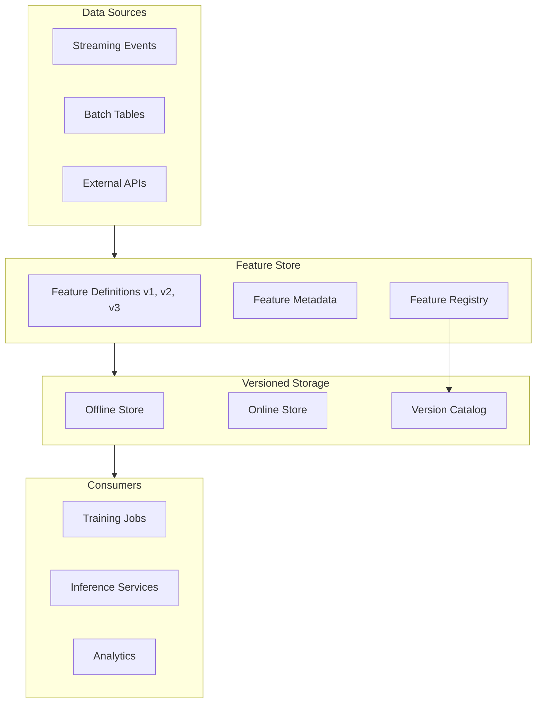
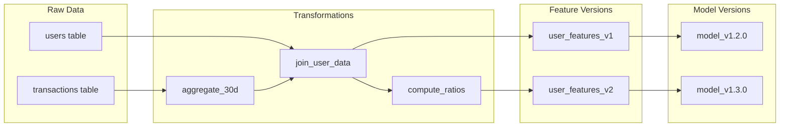
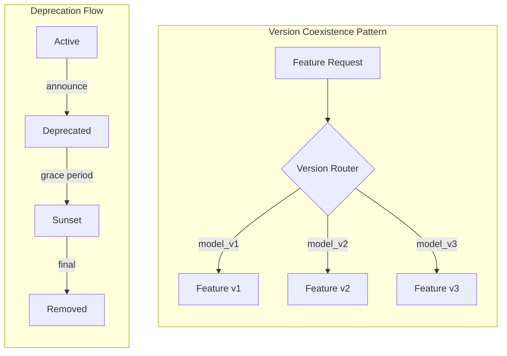
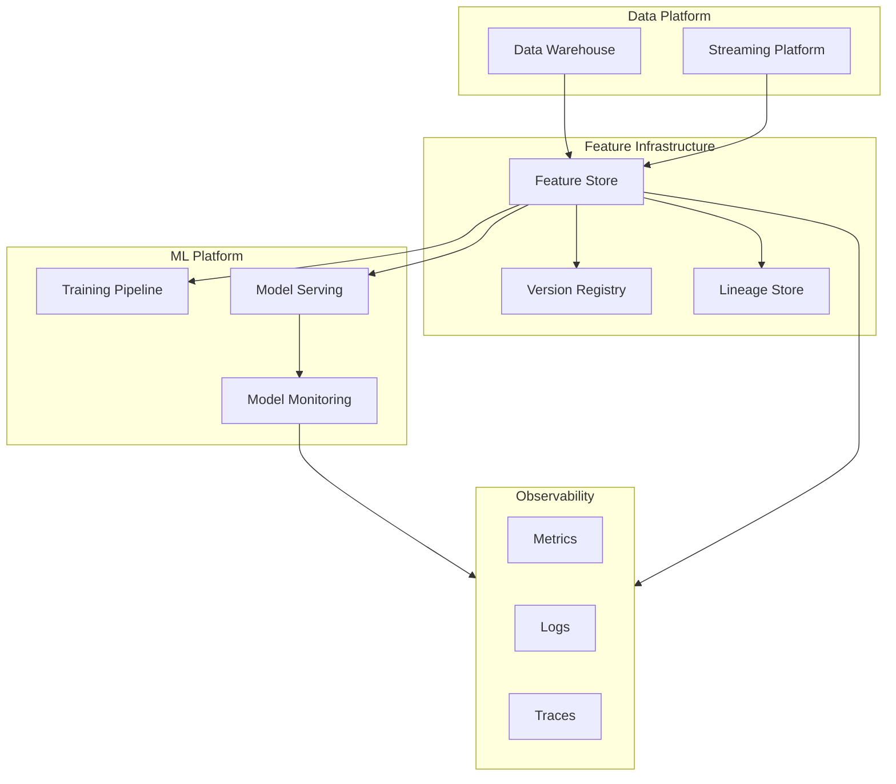

# How to Build Feature Versioning

Author: [nawazdhandala](https://github.com/nawazdhandala)

Tags: MLOps, Feature Store, Versioning, Machine Learning

Description: Learn to build feature versioning for tracking and managing feature changes in ML pipelines.

---

## Why Feature Versioning Matters

Feature versioning is the practice of tracking changes to feature definitions, transformations, and schemas over time. In production ML systems, features evolve constantly. Without proper versioning, you face:

- **Training/serving skew**: Models trained on one feature definition but served with another
- **Debugging nightmares**: Inability to reproduce past model behavior
- **Compliance gaps**: No audit trail for regulated industries
- **Rollback failures**: No safe path to revert breaking changes

This guide covers practical strategies for building feature versioning from scratch, with examples using Feast and Tecton.

## Feature Versioning Architecture

Before diving into code, let's understand the components involved in a feature versioning system.



## Version Control Strategies

### Strategy 1: Schema-Based Versioning

Track version changes when the feature schema changes (data types, column additions, or removals).

```python
# feature_schema.py
# Schema-based versioning tracks structural changes to features.
# Each schema change increments the version number.

from dataclasses import dataclass, field
from typing import Dict, List, Optional
from datetime import datetime
import hashlib
import json


@dataclass
class FeatureSchema:
    """
    Represents a versioned feature schema.
    Version is auto-incremented when schema structure changes.
    """
    name: str
    version: int
    columns: Dict[str, str]  # column_name -> data_type
    created_at: datetime = field(default_factory=datetime.utcnow)
    parent_version: Optional[int] = None

    def compute_hash(self) -> str:
        """
        Generate a deterministic hash of the schema structure.
        Used to detect schema changes automatically.
        """
        schema_dict = {
            "name": self.name,
            "columns": dict(sorted(self.columns.items()))
        }
        schema_json = json.dumps(schema_dict, sort_keys=True)
        return hashlib.sha256(schema_json.encode()).hexdigest()[:12]

    def is_compatible_with(self, other: "FeatureSchema") -> bool:
        """
        Check if this schema is backward compatible with another.
        Backward compatible means all columns in 'other' exist in 'self'
        with the same types.
        """
        for col, dtype in other.columns.items():
            if col not in self.columns:
                return False
            if self.columns[col] != dtype:
                return False
        return True


class SchemaRegistry:
    """
    Central registry for feature schemas.
    Handles version management and compatibility checks.
    """

    def __init__(self):
        self._schemas: Dict[str, List[FeatureSchema]] = {}

    def register(self, schema: FeatureSchema) -> FeatureSchema:
        """
        Register a new schema version.
        Auto-increments version if schema hash differs from latest.
        """
        if schema.name not in self._schemas:
            self._schemas[schema.name] = []

        versions = self._schemas[schema.name]

        # Check if schema actually changed
        if versions:
            latest = versions[-1]
            if schema.compute_hash() == latest.compute_hash():
                # No change, return existing version
                return latest

            # Schema changed, create new version
            schema.version = latest.version + 1
            schema.parent_version = latest.version
        else:
            schema.version = 1

        versions.append(schema)
        return schema

    def get_version(self, name: str, version: int) -> Optional[FeatureSchema]:
        """Retrieve a specific schema version."""
        if name not in self._schemas:
            return None
        for schema in self._schemas[name]:
            if schema.version == version:
                return schema
        return None

    def get_latest(self, name: str) -> Optional[FeatureSchema]:
        """Retrieve the latest schema version."""
        if name not in self._schemas or not self._schemas[name]:
            return None
        return self._schemas[name][-1]


# Usage example
if __name__ == "__main__":
    registry = SchemaRegistry()

    # Register initial schema
    v1 = FeatureSchema(
        name="user_features",
        version=0,  # Will be set by registry
        columns={
            "user_id": "string",
            "total_purchases": "int64",
            "avg_order_value": "float64"
        }
    )
    registered_v1 = registry.register(v1)
    print(f"Registered: {registered_v1.name} v{registered_v1.version}")

    # Register updated schema with new column
    v2 = FeatureSchema(
        name="user_features",
        version=0,
        columns={
            "user_id": "string",
            "total_purchases": "int64",
            "avg_order_value": "float64",
            "days_since_last_purchase": "int64"  # New column
        }
    )
    registered_v2 = registry.register(v2)
    print(f"Registered: {registered_v2.name} v{registered_v2.version}")

    # Check backward compatibility
    print(f"v2 compatible with v1: {registered_v2.is_compatible_with(registered_v1)}")
```

### Strategy 2: Semantic Versioning

Apply semantic versioning (MAJOR.MINOR.PATCH) to feature definitions based on the nature of changes.

```python
# semantic_versioning.py
# Semantic versioning for ML features follows these rules:
# - MAJOR: Breaking changes (column removal, type change)
# - MINOR: Backward compatible additions (new columns)
# - PATCH: Bug fixes, documentation updates

from dataclasses import dataclass
from enum import Enum
from typing import Optional, Tuple
import re


class ChangeType(Enum):
    """Classification of feature changes."""
    BREAKING = "breaking"      # Requires MAJOR bump
    ADDITIVE = "additive"      # Requires MINOR bump
    FIX = "fix"                # Requires PATCH bump


@dataclass
class SemanticVersion:
    """
    Semantic version representation for features.
    Format: MAJOR.MINOR.PATCH
    """
    major: int
    minor: int
    patch: int

    def __str__(self) -> str:
        return f"{self.major}.{self.minor}.{self.patch}"

    @classmethod
    def parse(cls, version_str: str) -> "SemanticVersion":
        """Parse version string into SemanticVersion object."""
        match = re.match(r"^(\d+)\.(\d+)\.(\d+)$", version_str)
        if not match:
            raise ValueError(f"Invalid version format: {version_str}")
        return cls(
            major=int(match.group(1)),
            minor=int(match.group(2)),
            patch=int(match.group(3))
        )

    def bump(self, change_type: ChangeType) -> "SemanticVersion":
        """
        Create a new version based on the change type.
        Follows semantic versioning rules.
        """
        if change_type == ChangeType.BREAKING:
            return SemanticVersion(self.major + 1, 0, 0)
        elif change_type == ChangeType.ADDITIVE:
            return SemanticVersion(self.major, self.minor + 1, 0)
        else:  # FIX
            return SemanticVersion(self.major, self.minor, self.patch + 1)

    def is_compatible_with(self, other: "SemanticVersion") -> bool:
        """
        Check if this version is compatible with another.
        Same major version means backward compatible.
        """
        return self.major == other.major


def detect_change_type(
    old_columns: dict,
    new_columns: dict
) -> Tuple[ChangeType, str]:
    """
    Automatically detect the type of change between two schemas.
    Returns the change type and a description.
    """
    old_keys = set(old_columns.keys())
    new_keys = set(new_columns.keys())

    # Check for removed columns (BREAKING)
    removed = old_keys - new_keys
    if removed:
        return ChangeType.BREAKING, f"Removed columns: {removed}"

    # Check for type changes (BREAKING)
    for col in old_keys & new_keys:
        if old_columns[col] != new_columns[col]:
            return ChangeType.BREAKING, f"Type changed for {col}"

    # Check for added columns (ADDITIVE)
    added = new_keys - old_keys
    if added:
        return ChangeType.ADDITIVE, f"Added columns: {added}"

    # No structural changes (FIX)
    return ChangeType.FIX, "No structural changes"


# Usage example
if __name__ == "__main__":
    # Start with version 1.0.0
    current = SemanticVersion(1, 0, 0)
    print(f"Current version: {current}")

    # Simulate schema change detection
    old_schema = {"user_id": "string", "score": "float64"}
    new_schema = {"user_id": "string", "score": "float64", "tier": "string"}

    change_type, description = detect_change_type(old_schema, new_schema)
    print(f"Change detected: {change_type.value} - {description}")

    # Bump version accordingly
    new_version = current.bump(change_type)
    print(f"New version: {new_version}")

    # Check compatibility
    print(f"Compatible: {new_version.is_compatible_with(current)}")
```

## Implementing Feature Versioning with Feast

Feast is an open-source feature store that supports feature versioning through its registry and feature views.

```python
# feast_versioning.py
# Complete example of feature versioning with Feast.
# This setup supports multiple feature versions running simultaneously.

from datetime import timedelta
from feast import (
    Entity,
    FeatureView,
    Field,
    FileSource,
    FeatureStore,
)
from feast.types import Float64, Int64, String


# Define the entity (the join key for features)
user = Entity(
    name="user",
    join_keys=["user_id"],
    description="User entity for feature lookups"
)


# Version 1: Basic user features
# Initial feature set with core metrics
user_features_v1_source = FileSource(
    path="data/user_features_v1.parquet",
    timestamp_field="event_timestamp",
)

user_features_v1 = FeatureView(
    name="user_features_v1",
    entities=[user],
    ttl=timedelta(days=1),  # Features expire after 1 day
    schema=[
        Field(name="total_purchases", dtype=Int64),
        Field(name="avg_order_value", dtype=Float64),
    ],
    source=user_features_v1_source,
    tags={
        "version": "1.0.0",
        "status": "deprecated",
        "deprecation_date": "2026-03-01"
    }
)


# Version 2: Enhanced user features
# Added new columns for better model performance
user_features_v2_source = FileSource(
    path="data/user_features_v2.parquet",
    timestamp_field="event_timestamp",
)

user_features_v2 = FeatureView(
    name="user_features_v2",
    entities=[user],
    ttl=timedelta(days=1),
    schema=[
        Field(name="total_purchases", dtype=Int64),
        Field(name="avg_order_value", dtype=Float64),
        Field(name="days_since_last_purchase", dtype=Int64),  # New in v2
        Field(name="purchase_frequency", dtype=Float64),       # New in v2
    ],
    source=user_features_v2_source,
    tags={
        "version": "2.0.0",
        "status": "active",
        "parent_version": "1.0.0"
    }
)


# Feature retrieval with version selection
def get_features_for_training(
    store: FeatureStore,
    entity_df,
    feature_version: str = "v2"
):
    """
    Retrieve features for training with explicit version selection.
    This ensures reproducibility by pinning to a specific version.
    """
    # Map version to feature view name
    version_map = {
        "v1": "user_features_v1",
        "v2": "user_features_v2"
    }

    feature_view = version_map.get(feature_version)
    if not feature_view:
        raise ValueError(f"Unknown version: {feature_version}")

    # Get feature references for the selected version
    feature_refs = [
        f"{feature_view}:total_purchases",
        f"{feature_view}:avg_order_value",
    ]

    # Add v2-specific features if using v2
    if feature_version == "v2":
        feature_refs.extend([
            f"{feature_view}:days_since_last_purchase",
            f"{feature_view}:purchase_frequency",
        ])

    # Retrieve historical features for training
    training_df = store.get_historical_features(
        entity_df=entity_df,
        features=feature_refs,
    ).to_df()

    return training_df


def get_features_for_inference(
    store: FeatureStore,
    entity_rows: list,
    feature_version: str = "v2"
):
    """
    Retrieve features for online inference.
    Version must match the version used during training.
    """
    version_map = {
        "v1": "user_features_v1",
        "v2": "user_features_v2"
    }

    feature_view = version_map.get(feature_version)
    if not feature_view:
        raise ValueError(f"Unknown version: {feature_version}")

    feature_refs = [
        f"{feature_view}:total_purchases",
        f"{feature_view}:avg_order_value",
    ]

    if feature_version == "v2":
        feature_refs.extend([
            f"{feature_view}:days_since_last_purchase",
            f"{feature_view}:purchase_frequency",
        ])

    # Get online features for real-time inference
    feature_vector = store.get_online_features(
        features=feature_refs,
        entity_rows=entity_rows,
    ).to_dict()

    return feature_vector
```

## Implementing Feature Versioning with Tecton

Tecton provides built-in versioning through its feature definition workflow and immutable feature services.

```python
# tecton_versioning.py
# Tecton feature versioning with explicit version management.
# Tecton treats feature definitions as immutable artifacts.

from tecton import (
    Entity,
    BatchSource,
    FileConfig,
    batch_feature_view,
    Aggregation,
    FeatureService,
)
from tecton.types import Field, String, Int64, Float64, Timestamp
from datetime import datetime, timedelta


# Define the user entity
user_entity = Entity(
    name="user",
    join_keys=["user_id"],
    description="User entity for all user-level features"
)


# Define data source
transactions_source = BatchSource(
    name="transactions",
    batch_config=FileConfig(
        uri="s3://bucket/transactions/",
        file_format="parquet",
        timestamp_field="transaction_time",
    ),
)


# Version 1: Basic aggregations
# Simple counts and averages over 30 days
@batch_feature_view(
    name="user_transaction_features_v1",
    sources=[transactions_source],
    entities=[user_entity],
    mode="pandas",
    aggregation_interval=timedelta(days=1),
    aggregations=[
        Aggregation(
            column="amount",
            function="sum",
            time_window=timedelta(days=30),
            name="total_spend_30d"
        ),
        Aggregation(
            column="amount",
            function="count",
            time_window=timedelta(days=30),
            name="transaction_count_30d"
        ),
    ],
    schema=[
        Field("user_id", String),
        Field("amount", Float64),
        Field("transaction_time", Timestamp),
    ],
    tags={"version": "1.0.0", "status": "deprecated"},
    description="V1: Basic 30-day transaction aggregations"
)
def user_transaction_features_v1(transactions):
    return transactions


# Version 2: Enhanced aggregations with multiple windows
# Added 7-day window and average calculations for better signals
@batch_feature_view(
    name="user_transaction_features_v2",
    sources=[transactions_source],
    entities=[user_entity],
    mode="pandas",
    aggregation_interval=timedelta(days=1),
    aggregations=[
        # 30-day aggregations (from v1)
        Aggregation(
            column="amount",
            function="sum",
            time_window=timedelta(days=30),
            name="total_spend_30d"
        ),
        Aggregation(
            column="amount",
            function="count",
            time_window=timedelta(days=30),
            name="transaction_count_30d"
        ),
        # New in v2: 7-day aggregations
        Aggregation(
            column="amount",
            function="sum",
            time_window=timedelta(days=7),
            name="total_spend_7d"
        ),
        Aggregation(
            column="amount",
            function="count",
            time_window=timedelta(days=7),
            name="transaction_count_7d"
        ),
        # New in v2: Average transaction value
        Aggregation(
            column="amount",
            function="mean",
            time_window=timedelta(days=30),
            name="avg_transaction_value_30d"
        ),
    ],
    schema=[
        Field("user_id", String),
        Field("amount", Float64),
        Field("transaction_time", Timestamp),
    ],
    tags={"version": "2.0.0", "status": "active", "parent": "v1"},
    description="V2: Enhanced aggregations with 7-day windows and averages"
)
def user_transaction_features_v2(transactions):
    return transactions


# Feature Services pin specific versions for model consumption
# Each model should have its own feature service

# Feature service for model trained on v1 features
recommendation_model_v1_features = FeatureService(
    name="recommendation_model_v1_features",
    features=[user_transaction_features_v1],
    tags={
        "model": "recommendation_v1",
        "feature_version": "1.0.0"
    },
    description="Features for recommendation model v1"
)

# Feature service for model trained on v2 features
recommendation_model_v2_features = FeatureService(
    name="recommendation_model_v2_features",
    features=[user_transaction_features_v2],
    tags={
        "model": "recommendation_v2",
        "feature_version": "2.0.0"
    },
    description="Features for recommendation model v2"
)
```

## Feature Lineage Tracking

Feature lineage tracks the complete history of a feature from source data to model consumption. This is critical for debugging and compliance.



```python
# lineage_tracker.py
# Track feature lineage from source to model consumption.
# Enables debugging, auditing, and impact analysis.

from dataclasses import dataclass, field
from datetime import datetime
from typing import Dict, List, Optional, Set
from enum import Enum
import json
import uuid


class NodeType(Enum):
    """Types of nodes in the lineage graph."""
    SOURCE = "source"
    TRANSFORM = "transform"
    FEATURE = "feature"
    MODEL = "model"


@dataclass
class LineageNode:
    """
    Represents a node in the feature lineage graph.
    Each node has a unique ID and tracks its upstream dependencies.
    """
    id: str
    name: str
    node_type: NodeType
    version: str
    created_at: datetime
    metadata: Dict = field(default_factory=dict)
    upstream_ids: List[str] = field(default_factory=list)

    def to_dict(self) -> dict:
        """Serialize node to dictionary for storage."""
        return {
            "id": self.id,
            "name": self.name,
            "node_type": self.node_type.value,
            "version": self.version,
            "created_at": self.created_at.isoformat(),
            "metadata": self.metadata,
            "upstream_ids": self.upstream_ids
        }


class LineageGraph:
    """
    Directed acyclic graph for feature lineage.
    Supports querying upstream/downstream dependencies.
    """

    def __init__(self):
        self._nodes: Dict[str, LineageNode] = {}

    def add_node(self, node: LineageNode) -> None:
        """Add a node to the lineage graph."""
        self._nodes[node.id] = node

    def create_source(
        self,
        name: str,
        version: str,
        metadata: Optional[Dict] = None
    ) -> LineageNode:
        """Create and register a data source node."""
        node = LineageNode(
            id=str(uuid.uuid4()),
            name=name,
            node_type=NodeType.SOURCE,
            version=version,
            created_at=datetime.utcnow(),
            metadata=metadata or {}
        )
        self.add_node(node)
        return node

    def create_feature(
        self,
        name: str,
        version: str,
        upstream_nodes: List[LineageNode],
        metadata: Optional[Dict] = None
    ) -> LineageNode:
        """
        Create and register a feature node.
        Links to upstream sources or transforms.
        """
        node = LineageNode(
            id=str(uuid.uuid4()),
            name=name,
            node_type=NodeType.FEATURE,
            version=version,
            created_at=datetime.utcnow(),
            metadata=metadata or {},
            upstream_ids=[n.id for n in upstream_nodes]
        )
        self.add_node(node)
        return node

    def create_model(
        self,
        name: str,
        version: str,
        feature_nodes: List[LineageNode],
        metadata: Optional[Dict] = None
    ) -> LineageNode:
        """
        Create and register a model node.
        Links to consumed feature nodes.
        """
        node = LineageNode(
            id=str(uuid.uuid4()),
            name=name,
            node_type=NodeType.MODEL,
            version=version,
            created_at=datetime.utcnow(),
            metadata=metadata or {},
            upstream_ids=[n.id for n in feature_nodes]
        )
        self.add_node(node)
        return node

    def get_upstream(self, node_id: str, recursive: bool = True) -> Set[str]:
        """
        Get all upstream dependencies for a node.
        If recursive=True, traverses the entire upstream graph.
        """
        if node_id not in self._nodes:
            return set()

        node = self._nodes[node_id]
        upstream = set(node.upstream_ids)

        if recursive:
            for uid in node.upstream_ids:
                upstream |= self.get_upstream(uid, recursive=True)

        return upstream

    def get_downstream(self, node_id: str) -> Set[str]:
        """
        Get all nodes that depend on the given node.
        Useful for impact analysis when changing a source or feature.
        """
        downstream = set()
        for nid, node in self._nodes.items():
            if node_id in node.upstream_ids:
                downstream.add(nid)
                downstream |= self.get_downstream(nid)
        return downstream

    def get_feature_lineage(self, feature_name: str, version: str) -> dict:
        """
        Get complete lineage for a specific feature version.
        Returns sources, transforms, and consuming models.
        """
        # Find the feature node
        feature_node = None
        for node in self._nodes.values():
            if (node.node_type == NodeType.FEATURE and
                node.name == feature_name and
                node.version == version):
                feature_node = node
                break

        if not feature_node:
            return {"error": f"Feature {feature_name}:{version} not found"}

        # Get upstream and downstream
        upstream_ids = self.get_upstream(feature_node.id)
        downstream_ids = self.get_downstream(feature_node.id)

        # Categorize nodes
        sources = []
        transforms = []
        models = []

        for uid in upstream_ids:
            node = self._nodes[uid]
            if node.node_type == NodeType.SOURCE:
                sources.append(node.to_dict())
            elif node.node_type == NodeType.TRANSFORM:
                transforms.append(node.to_dict())

        for did in downstream_ids:
            node = self._nodes[did]
            if node.node_type == NodeType.MODEL:
                models.append(node.to_dict())

        return {
            "feature": feature_node.to_dict(),
            "sources": sources,
            "transforms": transforms,
            "consuming_models": models
        }


# Usage example
if __name__ == "__main__":
    graph = LineageGraph()

    # Create data sources
    transactions = graph.create_source(
        name="transactions_table",
        version="2026-01-30",
        metadata={"database": "warehouse", "table": "transactions"}
    )

    users = graph.create_source(
        name="users_table",
        version="2026-01-30",
        metadata={"database": "warehouse", "table": "users"}
    )

    # Create features that depend on sources
    user_features_v1 = graph.create_feature(
        name="user_features",
        version="1.0.0",
        upstream_nodes=[transactions, users],
        metadata={"aggregation_window": "30d"}
    )

    user_features_v2 = graph.create_feature(
        name="user_features",
        version="2.0.0",
        upstream_nodes=[transactions, users],
        metadata={"aggregation_window": "7d,30d"}
    )

    # Create models that consume features
    model_v1 = graph.create_model(
        name="recommendation_model",
        version="1.2.0",
        feature_nodes=[user_features_v1],
        metadata={"framework": "xgboost"}
    )

    model_v2 = graph.create_model(
        name="recommendation_model",
        version="1.3.0",
        feature_nodes=[user_features_v2],
        metadata={"framework": "xgboost"}
    )

    # Query lineage
    lineage = graph.get_feature_lineage("user_features", "2.0.0")
    print(json.dumps(lineage, indent=2, default=str))

    # Impact analysis: what models are affected if we change transactions?
    impacted = graph.get_downstream(transactions.id)
    print(f"\nNodes impacted by transactions change: {len(impacted)}")
```

## Backward Compatibility Strategies

Maintaining backward compatibility ensures existing models continue to work while new versions are rolled out.



```python
# backward_compatibility.py
# Strategies for maintaining backward compatibility during feature evolution.
# Supports gradual migration and safe rollbacks.

from dataclasses import dataclass
from datetime import datetime, timedelta
from enum import Enum
from typing import Any, Callable, Dict, List, Optional
import warnings


class FeatureStatus(Enum):
    """Lifecycle status of a feature version."""
    ACTIVE = "active"           # Recommended for new models
    DEPRECATED = "deprecated"   # Still works, migration recommended
    SUNSET = "sunset"           # Read-only, no new consumers
    REMOVED = "removed"         # No longer available


@dataclass
class FeatureVersionConfig:
    """Configuration for a specific feature version."""
    version: str
    status: FeatureStatus
    compute_fn: Callable
    schema: Dict[str, str]
    deprecation_date: Optional[datetime] = None
    sunset_date: Optional[datetime] = None
    migration_guide: Optional[str] = None


class VersionedFeatureService:
    """
    Service that manages multiple feature versions simultaneously.
    Handles routing, deprecation warnings, and graceful degradation.
    """

    def __init__(self, feature_name: str):
        self.feature_name = feature_name
        self._versions: Dict[str, FeatureVersionConfig] = {}
        self._default_version: Optional[str] = None

    def register_version(
        self,
        config: FeatureVersionConfig,
        set_default: bool = False
    ) -> None:
        """Register a feature version with its configuration."""
        self._versions[config.version] = config
        if set_default or self._default_version is None:
            self._default_version = config.version

    def get_features(
        self,
        entity_data: Dict[str, Any],
        version: Optional[str] = None
    ) -> Dict[str, Any]:
        """
        Compute features for the given entity.
        Handles version routing and deprecation warnings.
        """
        # Use default version if not specified
        requested_version = version or self._default_version

        if requested_version not in self._versions:
            raise ValueError(f"Unknown version: {requested_version}")

        config = self._versions[requested_version]

        # Check status and emit appropriate warnings
        self._check_status(config)

        # Compute and return features
        return config.compute_fn(entity_data)

    def _check_status(self, config: FeatureVersionConfig) -> None:
        """Check version status and emit warnings if needed."""
        now = datetime.utcnow()

        if config.status == FeatureStatus.DEPRECATED:
            msg = (
                f"Feature {self.feature_name}:{config.version} is deprecated. "
                f"Migration guide: {config.migration_guide}"
            )
            warnings.warn(msg, DeprecationWarning, stacklevel=3)

        elif config.status == FeatureStatus.SUNSET:
            if config.sunset_date and now > config.sunset_date:
                raise RuntimeError(
                    f"Feature {self.feature_name}:{config.version} "
                    f"was sunset on {config.sunset_date}"
                )
            msg = (
                f"Feature {self.feature_name}:{config.version} is in sunset. "
                f"Will be removed on {config.sunset_date}"
            )
            warnings.warn(msg, FutureWarning, stacklevel=3)

        elif config.status == FeatureStatus.REMOVED:
            raise RuntimeError(
                f"Feature {self.feature_name}:{config.version} has been removed"
            )

    def get_migration_path(
        self,
        from_version: str,
        to_version: str
    ) -> List[str]:
        """
        Get the recommended migration path between versions.
        Returns list of intermediate versions if direct migration not possible.
        """
        # Simple implementation: direct migration
        # In production, this could check schema compatibility
        if from_version not in self._versions:
            raise ValueError(f"Unknown source version: {from_version}")
        if to_version not in self._versions:
            raise ValueError(f"Unknown target version: {to_version}")

        return [from_version, to_version]


class FeatureAdapter:
    """
    Adapter that transforms feature schemas between versions.
    Enables consumers of old versions to use new feature data.
    """

    def __init__(self):
        self._adapters: Dict[str, Callable] = {}

    def register_adapter(
        self,
        from_version: str,
        to_version: str,
        transform_fn: Callable[[Dict], Dict]
    ) -> None:
        """Register a transformation function between versions."""
        key = f"{from_version}->{to_version}"
        self._adapters[key] = transform_fn

    def adapt(
        self,
        features: Dict[str, Any],
        from_version: str,
        to_version: str
    ) -> Dict[str, Any]:
        """Transform features from one version schema to another."""
        key = f"{from_version}->{to_version}"

        if key not in self._adapters:
            raise ValueError(f"No adapter registered for {key}")

        return self._adapters[key](features)


# Usage example
if __name__ == "__main__":
    # Define compute functions for each version
    def compute_v1(data: Dict) -> Dict:
        return {
            "total_purchases": data.get("purchase_count", 0),
            "avg_order_value": data.get("total_amount", 0) / max(data.get("purchase_count", 1), 1)
        }

    def compute_v2(data: Dict) -> Dict:
        v1_features = compute_v1(data)
        v1_features["days_since_last"] = data.get("days_since_last", 0)
        v1_features["purchase_frequency"] = data.get("purchase_count", 0) / 30.0
        return v1_features

    # Create versioned service
    service = VersionedFeatureService("user_features")

    # Register v1 as deprecated
    service.register_version(
        FeatureVersionConfig(
            version="1.0.0",
            status=FeatureStatus.DEPRECATED,
            compute_fn=compute_v1,
            schema={"total_purchases": "int64", "avg_order_value": "float64"},
            deprecation_date=datetime(2026, 1, 1),
            sunset_date=datetime(2026, 6, 1),
            migration_guide="https://docs.example.com/migrate-v1-to-v2"
        )
    )

    # Register v2 as active
    service.register_version(
        FeatureVersionConfig(
            version="2.0.0",
            status=FeatureStatus.ACTIVE,
            compute_fn=compute_v2,
            schema={
                "total_purchases": "int64",
                "avg_order_value": "float64",
                "days_since_last": "int64",
                "purchase_frequency": "float64"
            }
        ),
        set_default=True
    )

    # Test data
    entity = {
        "purchase_count": 10,
        "total_amount": 500.0,
        "days_since_last": 5
    }

    # Get features with default version (v2)
    print("V2 Features:", service.get_features(entity))

    # Get features with explicit v1 (will warn)
    print("V1 Features:", service.get_features(entity, version="1.0.0"))

    # Set up adapter for backward compatibility
    adapter = FeatureAdapter()
    adapter.register_adapter(
        "2.0.0", "1.0.0",
        lambda f: {
            "total_purchases": f["total_purchases"],
            "avg_order_value": f["avg_order_value"]
        }
    )

    # Adapt v2 features for v1 consumer
    v2_features = service.get_features(entity, version="2.0.0")
    v1_compatible = adapter.adapt(v2_features, "2.0.0", "1.0.0")
    print("V2 adapted to V1:", v1_compatible)
```

## Feature Store Integration Architecture

Here is how feature versioning integrates with the broader ML infrastructure.



## Testing Versioned Features

Comprehensive testing ensures feature versions behave correctly and remain compatible.

```python
# test_feature_versions.py
# Testing strategies for versioned features.
# Covers unit tests, integration tests, and compatibility checks.

import pytest
from datetime import datetime
from typing import Dict, Any


class FeatureTestFramework:
    """
    Framework for testing versioned features.
    Supports schema validation, value range checks, and compatibility testing.
    """

    @staticmethod
    def validate_schema(
        features: Dict[str, Any],
        expected_schema: Dict[str, str]
    ) -> bool:
        """
        Validate that features match the expected schema.
        Checks for missing keys and type mismatches.
        """
        for key, expected_type in expected_schema.items():
            if key not in features:
                raise AssertionError(f"Missing feature: {key}")

            actual_type = type(features[key]).__name__
            # Map Python types to schema types
            type_map = {
                "int": "int64",
                "float": "float64",
                "str": "string",
                "bool": "bool"
            }
            mapped_type = type_map.get(actual_type, actual_type)

            if mapped_type != expected_type:
                raise AssertionError(
                    f"Type mismatch for {key}: expected {expected_type}, got {mapped_type}"
                )

        return True

    @staticmethod
    def validate_ranges(
        features: Dict[str, Any],
        range_specs: Dict[str, tuple]
    ) -> bool:
        """
        Validate that feature values fall within expected ranges.
        range_specs format: {"feature_name": (min_value, max_value)}
        """
        for key, (min_val, max_val) in range_specs.items():
            if key not in features:
                continue

            value = features[key]
            if value < min_val or value > max_val:
                raise AssertionError(
                    f"Value out of range for {key}: {value} not in [{min_val}, {max_val}]"
                )

        return True

    @staticmethod
    def check_backward_compatibility(
        new_features: Dict[str, Any],
        old_schema: Dict[str, str]
    ) -> bool:
        """
        Check if new features are backward compatible with old schema.
        New version must include all fields from old version.
        """
        for key, dtype in old_schema.items():
            if key not in new_features:
                raise AssertionError(
                    f"Backward compatibility broken: missing {key}"
                )
        return True


# Pytest fixtures and tests
@pytest.fixture
def sample_entity_data():
    """Sample input data for feature computation."""
    return {
        "user_id": "user_123",
        "purchase_count": 15,
        "total_amount": 750.0,
        "days_since_last": 3
    }


@pytest.fixture
def feature_service():
    """Create a configured feature service for testing."""
    # Import from your implementation
    from backward_compatibility import (
        VersionedFeatureService,
        FeatureVersionConfig,
        FeatureStatus
    )

    def compute_v1(data):
        return {
            "total_purchases": data.get("purchase_count", 0),
            "avg_order_value": data.get("total_amount", 0) / max(data.get("purchase_count", 1), 1)
        }

    def compute_v2(data):
        result = compute_v1(data)
        result["days_since_last"] = data.get("days_since_last", 0)
        result["purchase_frequency"] = data.get("purchase_count", 0) / 30.0
        return result

    service = VersionedFeatureService("user_features")

    service.register_version(
        FeatureVersionConfig(
            version="1.0.0",
            status=FeatureStatus.ACTIVE,
            compute_fn=compute_v1,
            schema={"total_purchases": "int64", "avg_order_value": "float64"}
        )
    )

    service.register_version(
        FeatureVersionConfig(
            version="2.0.0",
            status=FeatureStatus.ACTIVE,
            compute_fn=compute_v2,
            schema={
                "total_purchases": "int64",
                "avg_order_value": "float64",
                "days_since_last": "int64",
                "purchase_frequency": "float64"
            }
        ),
        set_default=True
    )

    return service


class TestFeatureVersions:
    """Test suite for versioned features."""

    def test_v1_schema_validation(self, feature_service, sample_entity_data):
        """Verify v1 features match expected schema."""
        features = feature_service.get_features(sample_entity_data, version="1.0.0")

        expected_schema = {
            "total_purchases": "int64",
            "avg_order_value": "float64"
        }

        assert FeatureTestFramework.validate_schema(features, expected_schema)

    def test_v2_schema_validation(self, feature_service, sample_entity_data):
        """Verify v2 features match expected schema."""
        features = feature_service.get_features(sample_entity_data, version="2.0.0")

        expected_schema = {
            "total_purchases": "int64",
            "avg_order_value": "float64",
            "days_since_last": "int64",
            "purchase_frequency": "float64"
        }

        assert FeatureTestFramework.validate_schema(features, expected_schema)

    def test_v2_backward_compatible_with_v1(self, feature_service, sample_entity_data):
        """Verify v2 contains all v1 fields for backward compatibility."""
        v2_features = feature_service.get_features(sample_entity_data, version="2.0.0")

        v1_schema = {
            "total_purchases": "int64",
            "avg_order_value": "float64"
        }

        assert FeatureTestFramework.check_backward_compatibility(v2_features, v1_schema)

    def test_feature_value_ranges(self, feature_service, sample_entity_data):
        """Verify feature values fall within expected ranges."""
        features = feature_service.get_features(sample_entity_data, version="2.0.0")

        range_specs = {
            "total_purchases": (0, 1000000),
            "avg_order_value": (0.0, 100000.0),
            "days_since_last": (0, 3650),
            "purchase_frequency": (0.0, 100.0)
        }

        assert FeatureTestFramework.validate_ranges(features, range_specs)

    def test_deterministic_computation(self, feature_service, sample_entity_data):
        """Verify feature computation is deterministic."""
        features_1 = feature_service.get_features(sample_entity_data, version="2.0.0")
        features_2 = feature_service.get_features(sample_entity_data, version="2.0.0")

        assert features_1 == features_2

    def test_null_handling(self, feature_service):
        """Verify graceful handling of missing input data."""
        sparse_data = {"user_id": "user_456"}

        # Should not raise, should use defaults
        features = feature_service.get_features(sparse_data, version="1.0.0")

        assert "total_purchases" in features
        assert "avg_order_value" in features


# Run with: pytest test_feature_versions.py -v
```

## CI/CD Pipeline for Feature Versions

Automate feature version deployment with proper validation gates.

```yaml
# .github/workflows/feature-versioning.yml
# CI/CD pipeline for feature store changes.
# Validates schemas, runs tests, and deploys to environments.

name: Feature Version CI/CD

on:
  push:
    paths:
      - 'features/**'
      - 'tests/features/**'
  pull_request:
    paths:
      - 'features/**'

env:
  PYTHON_VERSION: '3.11'
  FEAST_VERSION: '0.37.0'

jobs:
  # Job 1: Validate feature definitions
  validate:
    runs-on: ubuntu-latest
    steps:
      - name: Checkout code
        uses: actions/checkout@v4

      - name: Set up Python
        uses: actions/setup-python@v5
        with:
          python-version: ${{ env.PYTHON_VERSION }}

      - name: Install dependencies
        run: |
          pip install feast==${{ env.FEAST_VERSION }}
          pip install pytest pytest-cov

      - name: Validate feature schemas
        run: |
          # Run schema validation
          python -m features.validate_schemas

      - name: Check backward compatibility
        run: |
          # Compare new schemas against production registry
          python -m features.check_compatibility \
            --registry-url ${{ secrets.FEAST_REGISTRY_URL }}

  # Job 2: Run feature tests
  test:
    needs: validate
    runs-on: ubuntu-latest
    steps:
      - name: Checkout code
        uses: actions/checkout@v4

      - name: Set up Python
        uses: actions/setup-python@v5
        with:
          python-version: ${{ env.PYTHON_VERSION }}

      - name: Install dependencies
        run: |
          pip install -r requirements-test.txt

      - name: Run unit tests
        run: |
          pytest tests/features/unit/ -v --cov=features

      - name: Run integration tests
        run: |
          pytest tests/features/integration/ -v

      - name: Upload coverage
        uses: codecov/codecov-action@v4
        with:
          files: ./coverage.xml

  # Job 3: Deploy to staging
  deploy-staging:
    needs: test
    if: github.ref == 'refs/heads/main'
    runs-on: ubuntu-latest
    environment: staging
    steps:
      - name: Checkout code
        uses: actions/checkout@v4

      - name: Set up Python
        uses: actions/setup-python@v5
        with:
          python-version: ${{ env.PYTHON_VERSION }}

      - name: Install Feast
        run: pip install feast==${{ env.FEAST_VERSION }}

      - name: Apply feature definitions to staging
        run: |
          cd features/
          feast apply --registry ${{ secrets.STAGING_REGISTRY_URL }}

      - name: Run smoke tests
        run: |
          python -m features.smoke_test \
            --env staging \
            --registry ${{ secrets.STAGING_REGISTRY_URL }}

  # Job 4: Deploy to production
  deploy-production:
    needs: deploy-staging
    if: github.ref == 'refs/heads/main'
    runs-on: ubuntu-latest
    environment: production
    steps:
      - name: Checkout code
        uses: actions/checkout@v4

      - name: Set up Python
        uses: actions/setup-python@v5
        with:
          python-version: ${{ env.PYTHON_VERSION }}

      - name: Install Feast
        run: pip install feast==${{ env.FEAST_VERSION }}

      - name: Apply feature definitions to production
        run: |
          cd features/
          feast apply --registry ${{ secrets.PROD_REGISTRY_URL }}

      - name: Verify deployment
        run: |
          python -m features.verify_deployment \
            --env production \
            --registry ${{ secrets.PROD_REGISTRY_URL }}

      - name: Notify on success
        uses: slackapi/slack-github-action@v1
        with:
          payload: |
            {
              "text": "Feature versions deployed to production successfully",
              "blocks": [
                {
                  "type": "section",
                  "text": {
                    "type": "mrkdwn",
                    "text": "Feature deployment complete for commit ${{ github.sha }}"
                  }
                }
              ]
            }
        env:
          SLACK_WEBHOOK_URL: ${{ secrets.SLACK_WEBHOOK }}
```

## Monitoring Feature Versions in Production

Track feature version usage and detect drift with observability.

```python
# feature_monitoring.py
# Monitor feature versions in production environments.
# Tracks usage, detects drift, and alerts on anomalies.

from dataclasses import dataclass
from datetime import datetime, timedelta
from typing import Dict, List, Optional
import statistics


@dataclass
class FeatureStats:
    """Statistics for a feature over a time window."""
    feature_name: str
    version: str
    timestamp: datetime
    count: int
    mean: float
    std_dev: float
    min_value: float
    max_value: float
    null_rate: float


class FeatureMonitor:
    """
    Monitor feature versions for drift and anomalies.
    Integrates with observability platforms for alerting.
    """

    def __init__(self, baseline_stats: Dict[str, FeatureStats]):
        """
        Initialize with baseline statistics from training data.
        Baseline is used to detect drift in production.
        """
        self.baseline = baseline_stats
        self.production_stats: List[FeatureStats] = []
        self.drift_threshold = 0.1  # 10% drift threshold

    def record_batch(
        self,
        feature_name: str,
        version: str,
        values: List[float]
    ) -> FeatureStats:
        """
        Record statistics for a batch of feature values.
        Call this periodically from your feature serving pipeline.
        """
        non_null = [v for v in values if v is not None]
        null_count = len(values) - len(non_null)

        stats = FeatureStats(
            feature_name=feature_name,
            version=version,
            timestamp=datetime.utcnow(),
            count=len(values),
            mean=statistics.mean(non_null) if non_null else 0.0,
            std_dev=statistics.stdev(non_null) if len(non_null) > 1 else 0.0,
            min_value=min(non_null) if non_null else 0.0,
            max_value=max(non_null) if non_null else 0.0,
            null_rate=null_count / len(values) if values else 0.0
        )

        self.production_stats.append(stats)
        return stats

    def detect_drift(
        self,
        feature_name: str,
        version: str
    ) -> Dict[str, any]:
        """
        Detect drift between baseline and recent production stats.
        Returns drift metrics and whether alerting threshold is exceeded.
        """
        baseline_key = f"{feature_name}:{version}"
        if baseline_key not in self.baseline:
            return {"error": f"No baseline for {baseline_key}"}

        baseline = self.baseline[baseline_key]

        # Get recent production stats (last hour)
        cutoff = datetime.utcnow() - timedelta(hours=1)
        recent = [
            s for s in self.production_stats
            if s.feature_name == feature_name
            and s.version == version
            and s.timestamp > cutoff
        ]

        if not recent:
            return {"error": "No recent production data"}

        # Calculate aggregate stats
        prod_mean = statistics.mean([s.mean for s in recent])
        prod_null_rate = statistics.mean([s.null_rate for s in recent])

        # Calculate drift metrics
        mean_drift = abs(prod_mean - baseline.mean) / (baseline.mean or 1)
        null_drift = abs(prod_null_rate - baseline.null_rate)

        # Determine if drift exceeds threshold
        has_drift = mean_drift > self.drift_threshold or null_drift > 0.05

        return {
            "feature": feature_name,
            "version": version,
            "baseline_mean": baseline.mean,
            "production_mean": prod_mean,
            "mean_drift_pct": mean_drift * 100,
            "baseline_null_rate": baseline.null_rate,
            "production_null_rate": prod_null_rate,
            "null_drift_pct": null_drift * 100,
            "drift_detected": has_drift,
            "sample_count": sum(s.count for s in recent)
        }

    def get_version_usage(self) -> Dict[str, int]:
        """
        Get usage counts per feature version.
        Useful for tracking migration progress.
        """
        usage = {}
        for stats in self.production_stats:
            key = f"{stats.feature_name}:{stats.version}"
            usage[key] = usage.get(key, 0) + stats.count
        return usage

    def export_metrics(self) -> List[Dict]:
        """
        Export metrics in a format suitable for observability platforms.
        Compatible with Prometheus, OpenTelemetry, and similar tools.
        """
        metrics = []

        for stats in self.production_stats:
            base_labels = {
                "feature_name": stats.feature_name,
                "version": stats.version
            }

            metrics.extend([
                {
                    "name": "feature_value_mean",
                    "value": stats.mean,
                    "labels": base_labels,
                    "timestamp": stats.timestamp.isoformat()
                },
                {
                    "name": "feature_value_stddev",
                    "value": stats.std_dev,
                    "labels": base_labels,
                    "timestamp": stats.timestamp.isoformat()
                },
                {
                    "name": "feature_null_rate",
                    "value": stats.null_rate,
                    "labels": base_labels,
                    "timestamp": stats.timestamp.isoformat()
                },
                {
                    "name": "feature_request_count",
                    "value": stats.count,
                    "labels": base_labels,
                    "timestamp": stats.timestamp.isoformat()
                }
            ])

        return metrics


# Usage example with OpenTelemetry integration
def setup_otel_metrics(monitor: FeatureMonitor):
    """
    Set up OpenTelemetry metrics for feature monitoring.
    Exports to your observability backend (e.g., OneUptime).
    """
    from opentelemetry import metrics
    from opentelemetry.sdk.metrics import MeterProvider
    from opentelemetry.exporter.otlp.proto.grpc.metric_exporter import OTLPMetricExporter
    from opentelemetry.sdk.metrics.export import PeriodicExportingMetricReader

    # Configure OTLP exporter
    exporter = OTLPMetricExporter(
        endpoint="https://otlp.oneuptime.com:4317",
        headers={"Authorization": "Bearer YOUR_API_KEY"}
    )

    reader = PeriodicExportingMetricReader(exporter, export_interval_millis=60000)
    provider = MeterProvider(metric_readers=[reader])
    metrics.set_meter_provider(provider)

    meter = metrics.get_meter("feature_store")

    # Create gauges for feature metrics
    feature_mean = meter.create_gauge(
        name="feature_value_mean",
        description="Mean value of feature",
        unit="1"
    )

    feature_drift = meter.create_gauge(
        name="feature_drift_pct",
        description="Feature drift percentage from baseline",
        unit="percent"
    )

    return meter, feature_mean, feature_drift
```

## Best Practices Summary

1. **Version Everything**: Treat feature definitions like code. Every change should create a new version.

2. **Use Immutable Versions**: Once a version is published, never modify it. Create a new version instead.

3. **Maintain Backward Compatibility**: New versions should include all fields from previous versions when possible.

4. **Track Lineage**: Know exactly which data sources and transformations produced each feature version.

5. **Automate Testing**: Run schema validation, compatibility checks, and value range tests in CI/CD.

6. **Monitor in Production**: Track drift, usage patterns, and null rates for each version.

7. **Plan Deprecation**: Give consumers clear timelines and migration guides before removing versions.

8. **Document Changes**: Maintain a changelog that explains why each version was created.

## Conclusion

Feature versioning is essential infrastructure for production ML systems. It enables reproducibility, safe rollouts, and compliance with audit requirements. Start with schema-based versioning for simplicity, then adopt semantic versioning as your feature store matures. Use tools like Feast or Tecton to manage versions, and integrate with your observability platform to monitor feature health in production.

The code examples in this guide provide a foundation you can adapt to your specific infrastructure. Focus on automation and testing to catch compatibility issues before they reach production.
