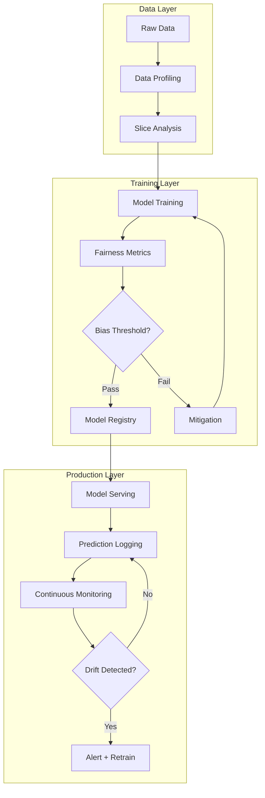
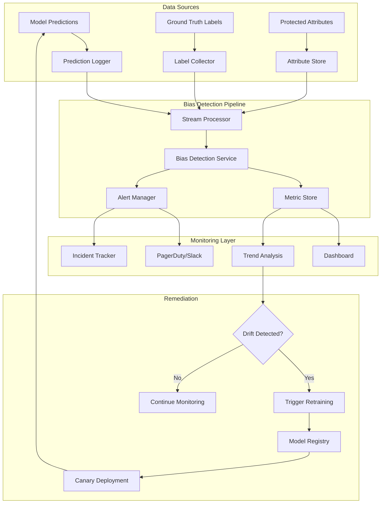
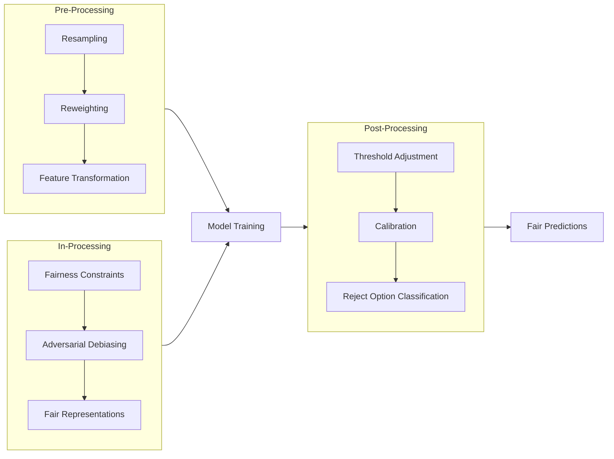

# How to Create Model Bias Detection

Author: [nawazdhandala](https://github.com/nawazdhandala)

Tags: MLOps, Bias Detection, Responsible AI, Machine Learning

Description: Learn to create model bias detection for identifying unfair treatment of protected groups.

---

Your model just went live. Accuracy looks great. Stakeholders are happy. Then someone notices: approval rates for one demographic group are half of another. Legal gets involved. The model gets pulled. What went wrong?

This is the reality of deploying ML models without bias detection. In production systems, fairness is not optional. It is a requirement for ethical AI, regulatory compliance, and user trust. This guide walks you through building a comprehensive model bias detection system for your MLOps pipeline.

## What is Model Bias?

Model bias occurs when an ML model produces systematically unfair outcomes for certain groups. These groups are typically defined by protected attributes such as race, gender, age, or disability status.

Bias can enter your pipeline at multiple stages:

- **Data Collection:** Historical data reflects past discrimination
- **Feature Engineering:** Proxy variables encode protected attributes indirectly
- **Model Training:** Optimization objectives favor majority groups
- **Deployment:** Feedback loops amplify existing biases

> Bias is not always intentional. A model can learn discriminatory patterns from data that appears neutral on the surface.

## The Bias Detection Pipeline

A production bias detection system requires continuous monitoring across the ML lifecycle:



## Core Fairness Metrics

Before detecting bias, you need to define what fairness means for your use case. Here are the primary metrics used in production systems:

### Demographic Parity (Statistical Parity)

The model should produce positive outcomes at equal rates across groups.

```python
# demographic_parity.py
# Measures whether positive prediction rates are equal across groups.
# A ratio of 1.0 indicates perfect parity.

import numpy as np
from typing import Dict, List, Tuple

def calculate_demographic_parity(
    predictions: np.ndarray,
    protected_attribute: np.ndarray,
    positive_label: int = 1
) -> Dict[str, float]:
    """
    Calculate demographic parity ratio across groups.

    Args:
        predictions: Model predictions (0 or 1)
        protected_attribute: Group membership for each sample
        positive_label: The label considered as positive outcome

    Returns:
        Dictionary with positive rates per group and parity ratio
    """
    # Get unique groups in the protected attribute
    groups = np.unique(protected_attribute)
    positive_rates = {}

    # Calculate positive prediction rate for each group
    for group in groups:
        # Create mask for samples belonging to this group
        group_mask = protected_attribute == group
        group_predictions = predictions[group_mask]

        # Calculate rate of positive predictions
        positive_rate = np.mean(group_predictions == positive_label)
        positive_rates[f"group_{group}"] = positive_rate

    # Calculate parity ratio (min rate / max rate)
    # Closer to 1.0 means better parity
    rates = list(positive_rates.values())
    parity_ratio = min(rates) / max(rates) if max(rates) > 0 else 0.0

    return {
        "positive_rates": positive_rates,
        "parity_ratio": parity_ratio,
        "passes_threshold": parity_ratio >= 0.8  # 80% rule threshold
    }


# Example usage demonstrating the metric
if __name__ == "__main__":
    # Simulated predictions and group memberships
    np.random.seed(42)

    # Create sample data with 1000 predictions
    predictions = np.random.choice([0, 1], size=1000, p=[0.6, 0.4])

    # Create protected attribute with bias
    # Group A gets more positive predictions than Group B
    protected_attr = np.random.choice(["A", "B"], size=1000)

    # Introduce bias: flip some Group B positives to negatives
    bias_mask = (protected_attr == "B") & (predictions == 1)
    flip_indices = np.where(bias_mask)[0][:50]  # Flip 50 predictions
    predictions[flip_indices] = 0

    # Calculate demographic parity
    result = calculate_demographic_parity(predictions, protected_attr)

    print("Demographic Parity Analysis")
    print("-" * 40)
    for group, rate in result["positive_rates"].items():
        print(f"{group}: {rate:.3f} positive rate")
    print(f"Parity Ratio: {result['parity_ratio']:.3f}")
    print(f"Passes 80% Rule: {result['passes_threshold']}")
```

### Equal Opportunity

Both groups should have equal true positive rates (recall).

```python
# equal_opportunity.py
# Ensures the model is equally good at identifying positive cases
# across all protected groups.

import numpy as np
from typing import Dict

def calculate_equal_opportunity(
    predictions: np.ndarray,
    labels: np.ndarray,
    protected_attribute: np.ndarray,
    positive_label: int = 1
) -> Dict[str, float]:
    """
    Calculate equal opportunity (true positive rate parity).

    This metric ensures that qualified individuals from all groups
    have an equal chance of receiving a positive prediction.

    Args:
        predictions: Model predictions
        labels: Ground truth labels
        protected_attribute: Group membership
        positive_label: The positive class label

    Returns:
        Dictionary with TPR per group and equality ratio
    """
    groups = np.unique(protected_attribute)
    true_positive_rates = {}

    for group in groups:
        # Filter to this group's samples
        group_mask = protected_attribute == group
        group_preds = predictions[group_mask]
        group_labels = labels[group_mask]

        # Filter to actual positives only
        positive_mask = group_labels == positive_label

        if np.sum(positive_mask) == 0:
            # No positive samples in this group
            true_positive_rates[f"group_{group}"] = np.nan
            continue

        # Calculate true positive rate (recall)
        # TPR = correctly predicted positives / all actual positives
        true_positives = np.sum(
            (group_preds == positive_label) & (group_labels == positive_label)
        )
        total_positives = np.sum(positive_mask)

        tpr = true_positives / total_positives
        true_positive_rates[f"group_{group}"] = tpr

    # Calculate equality ratio
    valid_rates = [r for r in true_positive_rates.values() if not np.isnan(r)]

    if len(valid_rates) < 2:
        equality_ratio = np.nan
    else:
        equality_ratio = min(valid_rates) / max(valid_rates)

    return {
        "true_positive_rates": true_positive_rates,
        "equality_ratio": equality_ratio,
        "metric_name": "equal_opportunity"
    }


def calculate_equalized_odds(
    predictions: np.ndarray,
    labels: np.ndarray,
    protected_attribute: np.ndarray,
    positive_label: int = 1
) -> Dict[str, float]:
    """
    Calculate equalized odds (TPR and FPR parity).

    Equalized odds requires both true positive rates AND false positive
    rates to be equal across groups. This is a stronger fairness criterion.

    Args:
        predictions: Model predictions
        labels: Ground truth labels
        protected_attribute: Group membership
        positive_label: The positive class label

    Returns:
        Dictionary with TPR, FPR per group and combined equality metric
    """
    groups = np.unique(protected_attribute)
    group_metrics = {}

    for group in groups:
        group_mask = protected_attribute == group
        group_preds = predictions[group_mask]
        group_labels = labels[group_mask]

        # True Positive Rate
        pos_mask = group_labels == positive_label
        if np.sum(pos_mask) > 0:
            tpr = np.sum(
                (group_preds == positive_label) & pos_mask
            ) / np.sum(pos_mask)
        else:
            tpr = np.nan

        # False Positive Rate
        neg_mask = group_labels != positive_label
        if np.sum(neg_mask) > 0:
            fpr = np.sum(
                (group_preds == positive_label) & neg_mask
            ) / np.sum(neg_mask)
        else:
            fpr = np.nan

        group_metrics[f"group_{group}"] = {
            "tpr": tpr,
            "fpr": fpr
        }

    # Calculate combined equality metric
    tprs = [m["tpr"] for m in group_metrics.values() if not np.isnan(m["tpr"])]
    fprs = [m["fpr"] for m in group_metrics.values() if not np.isnan(m["fpr"])]

    tpr_ratio = min(tprs) / max(tprs) if len(tprs) >= 2 and max(tprs) > 0 else np.nan
    fpr_ratio = min(fprs) / max(fprs) if len(fprs) >= 2 and max(fprs) > 0 else np.nan

    return {
        "group_metrics": group_metrics,
        "tpr_equality_ratio": tpr_ratio,
        "fpr_equality_ratio": fpr_ratio,
        "metric_name": "equalized_odds"
    }
```

### Predictive Parity

Positive predictions should have equal precision across groups.

```python
# predictive_parity.py
# Measures whether positive predictions are equally reliable across groups.

import numpy as np
from typing import Dict, Optional

def calculate_predictive_parity(
    predictions: np.ndarray,
    labels: np.ndarray,
    protected_attribute: np.ndarray,
    positive_label: int = 1
) -> Dict[str, float]:
    """
    Calculate predictive parity (precision equality).

    Predictive parity ensures that when the model predicts positive,
    it is equally likely to be correct across all groups.

    Args:
        predictions: Model predictions
        labels: Ground truth labels
        protected_attribute: Group membership
        positive_label: Positive class label

    Returns:
        Dictionary with precision per group and parity ratio
    """
    groups = np.unique(protected_attribute)
    precisions = {}

    for group in groups:
        group_mask = protected_attribute == group
        group_preds = predictions[group_mask]
        group_labels = labels[group_mask]

        # Get samples where model predicted positive
        pred_positive_mask = group_preds == positive_label

        if np.sum(pred_positive_mask) == 0:
            # No positive predictions for this group
            precisions[f"group_{group}"] = np.nan
            continue

        # Calculate precision
        # Precision = true positives / predicted positives
        true_positives = np.sum(
            (group_preds == positive_label) & (group_labels == positive_label)
        )
        predicted_positives = np.sum(pred_positive_mask)

        precision = true_positives / predicted_positives
        precisions[f"group_{group}"] = precision

    # Calculate parity ratio
    valid_precisions = [p for p in precisions.values() if not np.isnan(p)]

    if len(valid_precisions) < 2:
        parity_ratio = np.nan
    else:
        parity_ratio = min(valid_precisions) / max(valid_precisions)

    return {
        "precisions": precisions,
        "parity_ratio": parity_ratio,
        "metric_name": "predictive_parity"
    }
```

## Slice Analysis: Finding Hidden Bias

Aggregate metrics can mask bias in subgroups. Slice analysis examines model performance across multiple attribute combinations:

```python
# slice_analysis.py
# Performs granular analysis of model performance across data slices.
# Helps identify bias that aggregate metrics might miss.

import numpy as np
import pandas as pd
from typing import Dict, List, Tuple, Optional
from itertools import product
from dataclasses import dataclass


@dataclass
class SliceResult:
    """Container for slice analysis results."""
    slice_name: str
    sample_count: int
    positive_rate: float
    accuracy: float
    true_positive_rate: float
    false_positive_rate: float
    precision: float


class SliceAnalyzer:
    """
    Analyzes model performance across data slices.

    Slices are defined by combinations of attribute values.
    This helps identify subgroups where the model performs poorly
    or exhibits bias that is not visible in aggregate metrics.
    """

    def __init__(
        self,
        data: pd.DataFrame,
        predictions: np.ndarray,
        labels: np.ndarray,
        slice_columns: List[str],
        positive_label: int = 1
    ):
        """
        Initialize the slice analyzer.

        Args:
            data: DataFrame containing slice attributes
            predictions: Model predictions
            labels: Ground truth labels
            slice_columns: Columns to use for creating slices
            positive_label: The positive class label
        """
        self.data = data.copy()
        self.data["_prediction"] = predictions
        self.data["_label"] = labels
        self.slice_columns = slice_columns
        self.positive_label = positive_label
        self.results: List[SliceResult] = []

    def analyze_single_column(self, column: str) -> List[SliceResult]:
        """
        Analyze performance for each value of a single column.

        Args:
            column: Column name to slice by

        Returns:
            List of SliceResult objects
        """
        results = []
        unique_values = self.data[column].unique()

        for value in unique_values:
            # Create slice mask
            slice_mask = self.data[column] == value
            slice_data = self.data[slice_mask]

            if len(slice_data) < 10:
                # Skip slices with too few samples
                continue

            # Calculate metrics for this slice
            result = self._calculate_slice_metrics(
                slice_name=f"{column}={value}",
                slice_data=slice_data
            )
            results.append(result)

        return results

    def analyze_intersections(
        self,
        columns: List[str],
        min_samples: int = 50
    ) -> List[SliceResult]:
        """
        Analyze performance for intersections of multiple columns.

        This is critical for finding intersectional bias, where
        disadvantage compounds across multiple attributes.

        Args:
            columns: Columns to intersect
            min_samples: Minimum samples required for a slice

        Returns:
            List of SliceResult objects for valid intersections
        """
        results = []

        # Get unique values for each column
        column_values = {
            col: self.data[col].unique().tolist()
            for col in columns
        }

        # Generate all combinations
        combinations = list(product(*column_values.values()))

        for combo in combinations:
            # Build slice condition
            slice_mask = pd.Series([True] * len(self.data))
            slice_name_parts = []

            for col, val in zip(columns, combo):
                slice_mask &= (self.data[col] == val)
                slice_name_parts.append(f"{col}={val}")

            slice_data = self.data[slice_mask]

            if len(slice_data) < min_samples:
                continue

            slice_name = " AND ".join(slice_name_parts)
            result = self._calculate_slice_metrics(slice_name, slice_data)
            results.append(result)

        return results

    def _calculate_slice_metrics(
        self,
        slice_name: str,
        slice_data: pd.DataFrame
    ) -> SliceResult:
        """
        Calculate all metrics for a single slice.

        Args:
            slice_name: Human readable name for the slice
            slice_data: DataFrame containing only slice samples

        Returns:
            SliceResult with all calculated metrics
        """
        preds = slice_data["_prediction"].values
        labels = slice_data["_label"].values

        n = len(slice_data)
        positive_rate = np.mean(preds == self.positive_label)
        accuracy = np.mean(preds == labels)

        # True Positive Rate
        pos_mask = labels == self.positive_label
        if np.sum(pos_mask) > 0:
            tpr = np.sum((preds == self.positive_label) & pos_mask) / np.sum(pos_mask)
        else:
            tpr = np.nan

        # False Positive Rate
        neg_mask = labels != self.positive_label
        if np.sum(neg_mask) > 0:
            fpr = np.sum((preds == self.positive_label) & neg_mask) / np.sum(neg_mask)
        else:
            fpr = np.nan

        # Precision
        pred_pos_mask = preds == self.positive_label
        if np.sum(pred_pos_mask) > 0:
            precision = np.sum(
                (preds == self.positive_label) & (labels == self.positive_label)
            ) / np.sum(pred_pos_mask)
        else:
            precision = np.nan

        return SliceResult(
            slice_name=slice_name,
            sample_count=n,
            positive_rate=positive_rate,
            accuracy=accuracy,
            true_positive_rate=tpr,
            false_positive_rate=fpr,
            precision=precision
        )

    def find_problematic_slices(
        self,
        metric: str = "accuracy",
        threshold_ratio: float = 0.8,
        baseline: Optional[float] = None
    ) -> List[Tuple[SliceResult, float]]:
        """
        Find slices that perform significantly worse than baseline.

        Args:
            metric: Metric to compare (accuracy, tpr, precision)
            threshold_ratio: Ratio below which a slice is problematic
            baseline: Baseline value to compare against (if None, uses overall)

        Returns:
            List of (SliceResult, ratio) tuples for problematic slices
        """
        if baseline is None:
            # Calculate overall metric
            preds = self.data["_prediction"].values
            labels = self.data["_label"].values

            if metric == "accuracy":
                baseline = np.mean(preds == labels)
            elif metric == "tpr":
                pos_mask = labels == self.positive_label
                baseline = np.sum(
                    (preds == self.positive_label) & pos_mask
                ) / np.sum(pos_mask)
            elif metric == "precision":
                pred_pos = preds == self.positive_label
                baseline = np.sum(
                    pred_pos & (labels == self.positive_label)
                ) / np.sum(pred_pos)

        # Run analysis on all slice columns
        all_results = []
        for col in self.slice_columns:
            all_results.extend(self.analyze_single_column(col))

        # Also check intersections of pairs
        if len(self.slice_columns) >= 2:
            for i in range(len(self.slice_columns)):
                for j in range(i + 1, len(self.slice_columns)):
                    cols = [self.slice_columns[i], self.slice_columns[j]]
                    all_results.extend(self.analyze_intersections(cols))

        # Find problematic slices
        problematic = []
        for result in all_results:
            slice_metric = getattr(result, metric.replace("tpr", "true_positive_rate"))

            if np.isnan(slice_metric) or baseline == 0:
                continue

            ratio = slice_metric / baseline

            if ratio < threshold_ratio:
                problematic.append((result, ratio))

        # Sort by ratio (worst first)
        problematic.sort(key=lambda x: x[1])

        return problematic


# Example usage
if __name__ == "__main__":
    # Create sample dataset
    np.random.seed(42)
    n_samples = 5000

    # Generate features
    data = pd.DataFrame({
        "gender": np.random.choice(["M", "F"], n_samples),
        "age_group": np.random.choice(["18-30", "31-50", "51+"], n_samples),
        "region": np.random.choice(["urban", "rural"], n_samples)
    })

    # Generate labels with some bias
    labels = np.random.choice([0, 1], n_samples, p=[0.6, 0.4])

    # Generate predictions with intersectional bias
    # Model performs worse on older females in rural areas
    predictions = labels.copy()

    bias_mask = (
        (data["gender"] == "F") &
        (data["age_group"] == "51+") &
        (data["region"] == "rural")
    )

    # Introduce errors for biased group
    error_indices = np.where(bias_mask)[0]
    n_errors = int(len(error_indices) * 0.4)  # 40% error rate
    flip_indices = np.random.choice(error_indices, n_errors, replace=False)
    predictions[flip_indices] = 1 - predictions[flip_indices]

    # Run slice analysis
    analyzer = SliceAnalyzer(
        data=data,
        predictions=predictions,
        labels=labels,
        slice_columns=["gender", "age_group", "region"]
    )

    problematic = analyzer.find_problematic_slices(
        metric="accuracy",
        threshold_ratio=0.9
    )

    print("Problematic Slices Found:")
    print("-" * 60)
    for result, ratio in problematic[:5]:
        print(f"Slice: {result.slice_name}")
        print(f"  Samples: {result.sample_count}")
        print(f"  Accuracy: {result.accuracy:.3f}")
        print(f"  Ratio to baseline: {ratio:.3f}")
        print()
```

## Building a Bias Detection Service

For production MLOps, you need a service that continuously monitors deployed models:

```python
# bias_detection_service.py
# Production service for continuous bias monitoring in MLOps pipelines.

import numpy as np
import pandas as pd
from datetime import datetime, timedelta
from typing import Dict, List, Optional, Any
from dataclasses import dataclass, field
from enum import Enum
import json
import logging

# Configure logging
logging.basicConfig(level=logging.INFO)
logger = logging.getLogger(__name__)


class BiasAlertSeverity(Enum):
    """Severity levels for bias alerts."""
    LOW = "low"
    MEDIUM = "medium"
    HIGH = "high"
    CRITICAL = "critical"


@dataclass
class BiasAlert:
    """Represents a detected bias issue."""
    alert_id: str
    timestamp: datetime
    model_id: str
    metric_name: str
    affected_group: str
    metric_value: float
    threshold: float
    severity: BiasAlertSeverity
    details: Dict[str, Any] = field(default_factory=dict)


@dataclass
class BiasCheckResult:
    """Result of a bias check operation."""
    model_id: str
    check_timestamp: datetime
    overall_pass: bool
    metrics: Dict[str, float]
    alerts: List[BiasAlert]
    sample_count: int
    recommendation: str


class BiasDetectionService:
    """
    Production service for detecting and monitoring model bias.

    This service integrates with your MLOps pipeline to provide
    continuous fairness monitoring for deployed models.
    """

    # Default thresholds based on regulatory guidelines
    DEFAULT_THRESHOLDS = {
        "demographic_parity_ratio": 0.8,  # 80% rule
        "equal_opportunity_ratio": 0.8,
        "equalized_odds_tpr_ratio": 0.8,
        "equalized_odds_fpr_ratio": 0.8,
        "predictive_parity_ratio": 0.8
    }

    def __init__(
        self,
        model_id: str,
        protected_attributes: List[str],
        thresholds: Optional[Dict[str, float]] = None,
        alert_callback: Optional[callable] = None
    ):
        """
        Initialize the bias detection service.

        Args:
            model_id: Unique identifier for the model being monitored
            protected_attributes: List of column names for protected attributes
            thresholds: Custom thresholds for bias metrics
            alert_callback: Function to call when alerts are generated
        """
        self.model_id = model_id
        self.protected_attributes = protected_attributes
        self.thresholds = {**self.DEFAULT_THRESHOLDS, **(thresholds or {})}
        self.alert_callback = alert_callback

        # Storage for historical metrics
        self.metric_history: List[Dict[str, Any]] = []
        self.alert_history: List[BiasAlert] = []

    def check_bias(
        self,
        predictions: np.ndarray,
        labels: np.ndarray,
        protected_data: pd.DataFrame,
        positive_label: int = 1
    ) -> BiasCheckResult:
        """
        Run comprehensive bias check on model predictions.

        Args:
            predictions: Model predictions
            labels: Ground truth labels (can be delayed feedback)
            protected_data: DataFrame with protected attribute columns
            positive_label: The positive class label

        Returns:
            BiasCheckResult with all metrics and any alerts
        """
        timestamp = datetime.utcnow()
        alerts = []
        all_metrics = {}

        # Check each protected attribute
        for attr in self.protected_attributes:
            if attr not in protected_data.columns:
                logger.warning(f"Protected attribute {attr} not found in data")
                continue

            attr_values = protected_data[attr].values

            # Calculate demographic parity
            dp_result = self._check_demographic_parity(
                predictions, attr_values, positive_label
            )
            all_metrics[f"{attr}_demographic_parity"] = dp_result["parity_ratio"]

            if dp_result["parity_ratio"] < self.thresholds["demographic_parity_ratio"]:
                alert = self._create_alert(
                    metric_name="demographic_parity",
                    affected_group=attr,
                    metric_value=dp_result["parity_ratio"],
                    threshold=self.thresholds["demographic_parity_ratio"],
                    details=dp_result
                )
                alerts.append(alert)

            # Calculate equal opportunity
            eo_result = self._check_equal_opportunity(
                predictions, labels, attr_values, positive_label
            )
            all_metrics[f"{attr}_equal_opportunity"] = eo_result["equality_ratio"]

            if eo_result["equality_ratio"] < self.thresholds["equal_opportunity_ratio"]:
                alert = self._create_alert(
                    metric_name="equal_opportunity",
                    affected_group=attr,
                    metric_value=eo_result["equality_ratio"],
                    threshold=self.thresholds["equal_opportunity_ratio"],
                    details=eo_result
                )
                alerts.append(alert)

            # Calculate equalized odds
            eqo_result = self._check_equalized_odds(
                predictions, labels, attr_values, positive_label
            )
            all_metrics[f"{attr}_equalized_odds_tpr"] = eqo_result["tpr_equality_ratio"]
            all_metrics[f"{attr}_equalized_odds_fpr"] = eqo_result["fpr_equality_ratio"]

            if eqo_result["tpr_equality_ratio"] < self.thresholds["equalized_odds_tpr_ratio"]:
                alert = self._create_alert(
                    metric_name="equalized_odds_tpr",
                    affected_group=attr,
                    metric_value=eqo_result["tpr_equality_ratio"],
                    threshold=self.thresholds["equalized_odds_tpr_ratio"],
                    details=eqo_result
                )
                alerts.append(alert)

        # Store metrics in history
        self.metric_history.append({
            "timestamp": timestamp,
            "metrics": all_metrics,
            "sample_count": len(predictions)
        })

        # Process alerts
        for alert in alerts:
            self.alert_history.append(alert)
            if self.alert_callback:
                self.alert_callback(alert)

        # Generate recommendation
        recommendation = self._generate_recommendation(alerts, all_metrics)

        # Determine overall pass/fail
        overall_pass = len(alerts) == 0

        return BiasCheckResult(
            model_id=self.model_id,
            check_timestamp=timestamp,
            overall_pass=overall_pass,
            metrics=all_metrics,
            alerts=alerts,
            sample_count=len(predictions),
            recommendation=recommendation
        )

    def _check_demographic_parity(
        self,
        predictions: np.ndarray,
        protected_attribute: np.ndarray,
        positive_label: int
    ) -> Dict[str, float]:
        """Calculate demographic parity for a single attribute."""
        groups = np.unique(protected_attribute)
        positive_rates = {}

        for group in groups:
            mask = protected_attribute == group
            rate = np.mean(predictions[mask] == positive_label)
            positive_rates[str(group)] = rate

        rates = list(positive_rates.values())
        parity_ratio = min(rates) / max(rates) if max(rates) > 0 else 0.0

        return {
            "positive_rates": positive_rates,
            "parity_ratio": parity_ratio
        }

    def _check_equal_opportunity(
        self,
        predictions: np.ndarray,
        labels: np.ndarray,
        protected_attribute: np.ndarray,
        positive_label: int
    ) -> Dict[str, float]:
        """Calculate equal opportunity for a single attribute."""
        groups = np.unique(protected_attribute)
        tprs = {}

        for group in groups:
            mask = protected_attribute == group
            group_preds = predictions[mask]
            group_labels = labels[mask]

            pos_mask = group_labels == positive_label
            if np.sum(pos_mask) > 0:
                tpr = np.sum(
                    (group_preds == positive_label) & pos_mask
                ) / np.sum(pos_mask)
            else:
                tpr = np.nan

            tprs[str(group)] = tpr

        valid_tprs = [t for t in tprs.values() if not np.isnan(t)]
        equality_ratio = min(valid_tprs) / max(valid_tprs) if len(valid_tprs) >= 2 else np.nan

        return {
            "true_positive_rates": tprs,
            "equality_ratio": equality_ratio if not np.isnan(equality_ratio) else 0.0
        }

    def _check_equalized_odds(
        self,
        predictions: np.ndarray,
        labels: np.ndarray,
        protected_attribute: np.ndarray,
        positive_label: int
    ) -> Dict[str, float]:
        """Calculate equalized odds for a single attribute."""
        groups = np.unique(protected_attribute)
        tprs = {}
        fprs = {}

        for group in groups:
            mask = protected_attribute == group
            group_preds = predictions[mask]
            group_labels = labels[mask]

            # TPR
            pos_mask = group_labels == positive_label
            if np.sum(pos_mask) > 0:
                tpr = np.sum(
                    (group_preds == positive_label) & pos_mask
                ) / np.sum(pos_mask)
            else:
                tpr = np.nan
            tprs[str(group)] = tpr

            # FPR
            neg_mask = group_labels != positive_label
            if np.sum(neg_mask) > 0:
                fpr = np.sum(
                    (group_preds == positive_label) & neg_mask
                ) / np.sum(neg_mask)
            else:
                fpr = np.nan
            fprs[str(group)] = fpr

        valid_tprs = [t for t in tprs.values() if not np.isnan(t)]
        valid_fprs = [f for f in fprs.values() if not np.isnan(f)]

        tpr_ratio = min(valid_tprs) / max(valid_tprs) if len(valid_tprs) >= 2 and max(valid_tprs) > 0 else 0.0
        fpr_ratio = min(valid_fprs) / max(valid_fprs) if len(valid_fprs) >= 2 and max(valid_fprs) > 0 else 0.0

        return {
            "true_positive_rates": tprs,
            "false_positive_rates": fprs,
            "tpr_equality_ratio": tpr_ratio,
            "fpr_equality_ratio": fpr_ratio
        }

    def _create_alert(
        self,
        metric_name: str,
        affected_group: str,
        metric_value: float,
        threshold: float,
        details: Dict[str, Any]
    ) -> BiasAlert:
        """Create a bias alert with appropriate severity."""
        # Determine severity based on how far below threshold
        ratio_to_threshold = metric_value / threshold if threshold > 0 else 0

        if ratio_to_threshold >= 0.9:
            severity = BiasAlertSeverity.LOW
        elif ratio_to_threshold >= 0.75:
            severity = BiasAlertSeverity.MEDIUM
        elif ratio_to_threshold >= 0.5:
            severity = BiasAlertSeverity.HIGH
        else:
            severity = BiasAlertSeverity.CRITICAL

        return BiasAlert(
            alert_id=f"{self.model_id}_{metric_name}_{datetime.utcnow().timestamp()}",
            timestamp=datetime.utcnow(),
            model_id=self.model_id,
            metric_name=metric_name,
            affected_group=affected_group,
            metric_value=metric_value,
            threshold=threshold,
            severity=severity,
            details=details
        )

    def _generate_recommendation(
        self,
        alerts: List[BiasAlert],
        metrics: Dict[str, float]
    ) -> str:
        """Generate actionable recommendations based on bias check results."""
        if not alerts:
            return "No bias issues detected. Continue monitoring."

        critical_alerts = [a for a in alerts if a.severity == BiasAlertSeverity.CRITICAL]
        high_alerts = [a for a in alerts if a.severity == BiasAlertSeverity.HIGH]

        recommendations = []

        if critical_alerts:
            recommendations.append(
                "CRITICAL: Immediate action required. Consider pausing model serving "
                "for affected use cases until bias is mitigated."
            )

        if high_alerts:
            recommendations.append(
                "HIGH: Significant bias detected. Schedule urgent review of training data "
                "and model architecture."
            )

        # Add specific recommendations based on metric types
        dp_alerts = [a for a in alerts if "demographic_parity" in a.metric_name]
        eo_alerts = [a for a in alerts if "equal_opportunity" in a.metric_name]

        if dp_alerts:
            recommendations.append(
                "Consider resampling training data or applying demographic parity constraints "
                "during training to equalize positive prediction rates."
            )

        if eo_alerts:
            recommendations.append(
                "Review feature engineering for proxy variables. Consider threshold "
                "adjustment or post-processing calibration for affected groups."
            )

        return " ".join(recommendations)

    def get_metric_trend(
        self,
        metric_name: str,
        lookback_hours: int = 24
    ) -> List[Dict[str, Any]]:
        """
        Get trend data for a specific metric over time.

        Args:
            metric_name: Name of the metric to retrieve
            lookback_hours: Number of hours to look back

        Returns:
            List of timestamp/value pairs for the metric
        """
        cutoff = datetime.utcnow() - timedelta(hours=lookback_hours)

        trend = []
        for record in self.metric_history:
            if record["timestamp"] >= cutoff and metric_name in record["metrics"]:
                trend.append({
                    "timestamp": record["timestamp"].isoformat(),
                    "value": record["metrics"][metric_name]
                })

        return trend

    def export_report(self) -> Dict[str, Any]:
        """Export a comprehensive bias report for documentation."""
        return {
            "model_id": self.model_id,
            "report_timestamp": datetime.utcnow().isoformat(),
            "protected_attributes": self.protected_attributes,
            "thresholds": self.thresholds,
            "total_checks": len(self.metric_history),
            "total_alerts": len(self.alert_history),
            "alerts_by_severity": {
                severity.value: len([
                    a for a in self.alert_history
                    if a.severity == severity
                ])
                for severity in BiasAlertSeverity
            },
            "latest_metrics": self.metric_history[-1] if self.metric_history else None
        }
```

## Continuous Monitoring Architecture

Here is the recommended architecture for production bias monitoring:



## Integration with MLOps Pipelines

Here is how to integrate bias detection into your CI/CD pipeline:

```python
# mlops_integration.py
# Integration patterns for bias detection in MLOps pipelines.

import numpy as np
import pandas as pd
from typing import Dict, Optional, Tuple
from dataclasses import dataclass
import json
import logging

logger = logging.getLogger(__name__)


@dataclass
class ModelArtifact:
    """Represents a model artifact in the registry."""
    model_id: str
    version: str
    model_path: str
    metadata: Dict


@dataclass
class BiasGateResult:
    """Result of a bias quality gate check."""
    passed: bool
    model_artifact: ModelArtifact
    bias_metrics: Dict[str, float]
    failure_reasons: list
    gate_name: str


class BiasQualityGate:
    """
    Quality gate that blocks model deployment if bias thresholds are exceeded.

    This integrates into your CI/CD pipeline to ensure only fair models
    reach production.
    """

    def __init__(
        self,
        gate_name: str,
        thresholds: Dict[str, float],
        protected_attributes: list,
        require_all_pass: bool = True
    ):
        """
        Initialize the bias quality gate.

        Args:
            gate_name: Name of this quality gate
            thresholds: Dictionary of metric_name -> threshold
            protected_attributes: List of protected attribute column names
            require_all_pass: If True, all metrics must pass; otherwise majority
        """
        self.gate_name = gate_name
        self.thresholds = thresholds
        self.protected_attributes = protected_attributes
        self.require_all_pass = require_all_pass

    def evaluate(
        self,
        model_artifact: ModelArtifact,
        validation_predictions: np.ndarray,
        validation_labels: np.ndarray,
        validation_data: pd.DataFrame
    ) -> BiasGateResult:
        """
        Evaluate a model against bias thresholds.

        Args:
            model_artifact: The model being evaluated
            validation_predictions: Predictions on validation set
            validation_labels: True labels for validation set
            validation_data: DataFrame with protected attributes

        Returns:
            BiasGateResult indicating pass/fail and details
        """
        all_metrics = {}
        failure_reasons = []

        for attr in self.protected_attributes:
            if attr not in validation_data.columns:
                failure_reasons.append(f"Missing protected attribute: {attr}")
                continue

            attr_values = validation_data[attr].values

            # Calculate demographic parity
            dp = self._calculate_demographic_parity(
                validation_predictions, attr_values
            )
            metric_key = f"{attr}_demographic_parity"
            all_metrics[metric_key] = dp

            if metric_key in self.thresholds and dp < self.thresholds[metric_key]:
                failure_reasons.append(
                    f"{metric_key}: {dp:.3f} < threshold {self.thresholds[metric_key]}"
                )

            # Calculate equal opportunity
            eo = self._calculate_equal_opportunity(
                validation_predictions, validation_labels, attr_values
            )
            metric_key = f"{attr}_equal_opportunity"
            all_metrics[metric_key] = eo

            if metric_key in self.thresholds and eo < self.thresholds[metric_key]:
                failure_reasons.append(
                    f"{metric_key}: {eo:.3f} < threshold {self.thresholds[metric_key]}"
                )

        # Determine pass/fail
        if self.require_all_pass:
            passed = len(failure_reasons) == 0
        else:
            # Majority pass
            total_checks = len(self.thresholds)
            failures = len(failure_reasons)
            passed = failures < (total_checks / 2)

        return BiasGateResult(
            passed=passed,
            model_artifact=model_artifact,
            bias_metrics=all_metrics,
            failure_reasons=failure_reasons,
            gate_name=self.gate_name
        )

    def _calculate_demographic_parity(
        self,
        predictions: np.ndarray,
        protected_attribute: np.ndarray,
        positive_label: int = 1
    ) -> float:
        """Calculate demographic parity ratio."""
        groups = np.unique(protected_attribute)
        rates = []

        for group in groups:
            mask = protected_attribute == group
            rate = np.mean(predictions[mask] == positive_label)
            rates.append(rate)

        return min(rates) / max(rates) if max(rates) > 0 else 0.0

    def _calculate_equal_opportunity(
        self,
        predictions: np.ndarray,
        labels: np.ndarray,
        protected_attribute: np.ndarray,
        positive_label: int = 1
    ) -> float:
        """Calculate equal opportunity ratio."""
        groups = np.unique(protected_attribute)
        tprs = []

        for group in groups:
            mask = protected_attribute == group
            group_preds = predictions[mask]
            group_labels = labels[mask]

            pos_mask = group_labels == positive_label
            if np.sum(pos_mask) > 0:
                tpr = np.sum(
                    (group_preds == positive_label) & pos_mask
                ) / np.sum(pos_mask)
                tprs.append(tpr)

        return min(tprs) / max(tprs) if len(tprs) >= 2 and max(tprs) > 0 else 0.0


def create_bias_report_artifact(
    gate_result: BiasGateResult,
    output_path: str
) -> str:
    """
    Create a bias report artifact for CI/CD systems.

    Args:
        gate_result: Result from bias quality gate
        output_path: Path to write the report

    Returns:
        Path to the created report file
    """
    report = {
        "gate_name": gate_result.gate_name,
        "model_id": gate_result.model_artifact.model_id,
        "model_version": gate_result.model_artifact.version,
        "passed": gate_result.passed,
        "metrics": gate_result.bias_metrics,
        "failure_reasons": gate_result.failure_reasons
    }

    with open(output_path, "w") as f:
        json.dump(report, f, indent=2)

    logger.info(f"Bias report written to {output_path}")
    return output_path


# Example CI/CD integration function
def run_bias_gate_in_pipeline(
    model_path: str,
    model_id: str,
    model_version: str,
    validation_data_path: str,
    predictions_path: str,
    labels_path: str,
    protected_columns: list,
    thresholds: Dict[str, float]
) -> Tuple[bool, str]:
    """
    Run bias quality gate as part of CI/CD pipeline.

    This function is designed to be called from CI/CD tools like
    GitHub Actions, GitLab CI, or Jenkins.

    Args:
        model_path: Path to the model artifact
        model_id: Unique identifier for the model
        model_version: Version string for this model
        validation_data_path: Path to validation data CSV
        predictions_path: Path to predictions NPY file
        labels_path: Path to labels NPY file
        protected_columns: List of protected attribute columns
        thresholds: Bias metric thresholds

    Returns:
        Tuple of (passed: bool, report_path: str)
    """
    # Load data
    validation_data = pd.read_csv(validation_data_path)
    predictions = np.load(predictions_path)
    labels = np.load(labels_path)

    # Create model artifact
    artifact = ModelArtifact(
        model_id=model_id,
        version=model_version,
        model_path=model_path,
        metadata={}
    )

    # Create and run gate
    gate = BiasQualityGate(
        gate_name="pre_deployment_bias_check",
        thresholds=thresholds,
        protected_attributes=protected_columns,
        require_all_pass=True
    )

    result = gate.evaluate(
        model_artifact=artifact,
        validation_predictions=predictions,
        validation_labels=labels,
        validation_data=validation_data
    )

    # Generate report
    report_path = f"bias_report_{model_id}_{model_version}.json"
    create_bias_report_artifact(result, report_path)

    if not result.passed:
        logger.error(f"Bias gate FAILED: {result.failure_reasons}")
    else:
        logger.info("Bias gate PASSED")

    return result.passed, report_path
```

## GitHub Actions Integration

Add this to your CI/CD workflow:

```yaml
# .github/workflows/bias-check.yml
name: Model Bias Check

on:
  push:
    paths:
      - 'models/**'
      - 'training/**'
  pull_request:
    paths:
      - 'models/**'
      - 'training/**'

jobs:
  bias-check:
    runs-on: ubuntu-latest

    steps:
      - name: Checkout code
        uses: actions/checkout@v4

      - name: Set up Python
        uses: actions/setup-python@v5
        with:
          python-version: '3.11'

      - name: Install dependencies
        run: |
          pip install numpy pandas scikit-learn
          pip install -r requirements.txt

      - name: Run model training
        run: |
          python training/train_model.py \
            --output-model models/model.pkl \
            --output-predictions validation_predictions.npy \
            --output-labels validation_labels.npy

      - name: Run bias quality gate
        id: bias_gate
        run: |
          python -c "
          from mlops_integration import run_bias_gate_in_pipeline

          passed, report = run_bias_gate_in_pipeline(
              model_path='models/model.pkl',
              model_id='credit_scoring_model',
              model_version='${{ github.sha }}',
              validation_data_path='data/validation.csv',
              predictions_path='validation_predictions.npy',
              labels_path='validation_labels.npy',
              protected_columns=['gender', 'race', 'age_group'],
              thresholds={
                  'gender_demographic_parity': 0.8,
                  'gender_equal_opportunity': 0.8,
                  'race_demographic_parity': 0.8,
                  'race_equal_opportunity': 0.8,
                  'age_group_demographic_parity': 0.8,
                  'age_group_equal_opportunity': 0.8
              }
          )

          print(f'::set-output name=passed::{passed}')
          print(f'::set-output name=report::{report}')

          if not passed:
              exit(1)
          "

      - name: Upload bias report
        uses: actions/upload-artifact@v4
        with:
          name: bias-report
          path: bias_report_*.json

      - name: Comment on PR
        if: github.event_name == 'pull_request'
        uses: actions/github-script@v7
        with:
          script: |
            const fs = require('fs');
            const reports = fs.readdirSync('.').filter(f => f.startsWith('bias_report_'));

            for (const report of reports) {
              const content = JSON.parse(fs.readFileSync(report, 'utf8'));

              let body = '## Bias Check Results\n\n';
              body += content.passed ? '### Status: PASSED' : '### Status: FAILED';
              body += '\n\n#### Metrics:\n';

              for (const [metric, value] of Object.entries(content.metrics)) {
                body += `- ${metric}: ${value.toFixed(3)}\n`;
              }

              if (content.failure_reasons.length > 0) {
                body += '\n#### Failures:\n';
                for (const reason of content.failure_reasons) {
                  body += `- ${reason}\n`;
                }
              }

              github.rest.issues.createComment({
                issue_number: context.issue.number,
                owner: context.repo.owner,
                repo: context.repo.repo,
                body: body
              });
            }
```

## Bias Mitigation Strategies

When bias is detected, here are the primary mitigation approaches:



### Threshold Adjustment Example

```python
# threshold_adjustment.py
# Post-processing technique to equalize outcomes across groups.

import numpy as np
from scipy.optimize import minimize_scalar
from typing import Dict, Tuple, Optional


class ThresholdOptimizer:
    """
    Optimizes classification thresholds per group to achieve fairness.

    This is a post-processing technique that adjusts decision thresholds
    for different groups to equalize a specified fairness metric.
    """

    def __init__(
        self,
        target_metric: str = "demographic_parity",
        tolerance: float = 0.01
    ):
        """
        Initialize the threshold optimizer.

        Args:
            target_metric: Metric to equalize (demographic_parity, equal_opportunity)
            tolerance: Acceptable deviation from perfect parity
        """
        self.target_metric = target_metric
        self.tolerance = tolerance
        self.group_thresholds: Dict[str, float] = {}

    def fit(
        self,
        probabilities: np.ndarray,
        labels: np.ndarray,
        protected_attribute: np.ndarray
    ) -> Dict[str, float]:
        """
        Find optimal thresholds for each group.

        Args:
            probabilities: Model probability outputs
            labels: True labels
            protected_attribute: Group membership

        Returns:
            Dictionary mapping group to optimal threshold
        """
        groups = np.unique(protected_attribute)

        if self.target_metric == "demographic_parity":
            # Find thresholds that equalize positive prediction rates
            return self._fit_demographic_parity(
                probabilities, protected_attribute, groups
            )
        elif self.target_metric == "equal_opportunity":
            # Find thresholds that equalize true positive rates
            return self._fit_equal_opportunity(
                probabilities, labels, protected_attribute, groups
            )
        else:
            raise ValueError(f"Unknown target metric: {self.target_metric}")

    def _fit_demographic_parity(
        self,
        probabilities: np.ndarray,
        protected_attribute: np.ndarray,
        groups: np.ndarray
    ) -> Dict[str, float]:
        """Find thresholds for demographic parity."""
        # Calculate current positive rates at threshold 0.5
        base_rates = {}
        for group in groups:
            mask = protected_attribute == group
            base_rates[str(group)] = np.mean(probabilities[mask] >= 0.5)

        # Target rate is the average
        target_rate = np.mean(list(base_rates.values()))

        thresholds = {}
        for group in groups:
            mask = protected_attribute == group
            group_probs = probabilities[mask]

            # Find threshold that achieves target rate
            def objective(threshold):
                rate = np.mean(group_probs >= threshold)
                return (rate - target_rate) ** 2

            result = minimize_scalar(objective, bounds=(0.01, 0.99), method='bounded')
            thresholds[str(group)] = result.x

        self.group_thresholds = thresholds
        return thresholds

    def _fit_equal_opportunity(
        self,
        probabilities: np.ndarray,
        labels: np.ndarray,
        protected_attribute: np.ndarray,
        groups: np.ndarray
    ) -> Dict[str, float]:
        """Find thresholds for equal opportunity."""
        # Calculate TPR for each group at various thresholds
        target_tpr = 0.0
        count = 0

        for group in groups:
            mask = protected_attribute == group
            pos_mask = labels[mask] == 1
            if np.sum(pos_mask) > 0:
                group_probs = probabilities[mask][pos_mask]
                tpr = np.mean(group_probs >= 0.5)
                target_tpr += tpr
                count += 1

        target_tpr /= count if count > 0 else 1

        thresholds = {}
        for group in groups:
            mask = protected_attribute == group
            group_probs = probabilities[mask]
            group_labels = labels[mask]

            pos_mask = group_labels == 1
            if np.sum(pos_mask) == 0:
                thresholds[str(group)] = 0.5
                continue

            pos_probs = group_probs[pos_mask]

            def objective(threshold):
                tpr = np.mean(pos_probs >= threshold)
                return (tpr - target_tpr) ** 2

            result = minimize_scalar(objective, bounds=(0.01, 0.99), method='bounded')
            thresholds[str(group)] = result.x

        self.group_thresholds = thresholds
        return thresholds

    def predict(
        self,
        probabilities: np.ndarray,
        protected_attribute: np.ndarray
    ) -> np.ndarray:
        """
        Apply group-specific thresholds to generate fair predictions.

        Args:
            probabilities: Model probability outputs
            protected_attribute: Group membership

        Returns:
            Fair binary predictions
        """
        if not self.group_thresholds:
            raise ValueError("Must call fit() before predict()")

        predictions = np.zeros(len(probabilities), dtype=int)

        for group, threshold in self.group_thresholds.items():
            mask = protected_attribute == group
            predictions[mask] = (probabilities[mask] >= threshold).astype(int)

        return predictions


# Example usage
if __name__ == "__main__":
    np.random.seed(42)
    n = 2000

    # Generate sample data with bias
    protected = np.random.choice(["A", "B"], n)

    # Group A has higher base probabilities
    probabilities = np.where(
        protected == "A",
        np.random.beta(3, 2, n),  # Higher probabilities
        np.random.beta(2, 3, n)   # Lower probabilities
    )

    labels = (probabilities > 0.4).astype(int)
    labels += np.random.choice([0, 1], n, p=[0.9, 0.1])  # Add noise
    labels = np.clip(labels, 0, 1)

    # Before optimization
    preds_before = (probabilities >= 0.5).astype(int)
    rate_a_before = np.mean(preds_before[protected == "A"])
    rate_b_before = np.mean(preds_before[protected == "B"])

    print("Before Threshold Optimization:")
    print(f"  Group A positive rate: {rate_a_before:.3f}")
    print(f"  Group B positive rate: {rate_b_before:.3f}")
    print(f"  Parity ratio: {min(rate_a_before, rate_b_before) / max(rate_a_before, rate_b_before):.3f}")

    # Apply threshold optimization
    optimizer = ThresholdOptimizer(target_metric="demographic_parity")
    thresholds = optimizer.fit(probabilities, labels, protected)

    print(f"\nOptimized Thresholds: {thresholds}")

    preds_after = optimizer.predict(probabilities, protected)
    rate_a_after = np.mean(preds_after[protected == "A"])
    rate_b_after = np.mean(preds_after[protected == "B"])

    print("\nAfter Threshold Optimization:")
    print(f"  Group A positive rate: {rate_a_after:.3f}")
    print(f"  Group B positive rate: {rate_b_after:.3f}")
    print(f"  Parity ratio: {min(rate_a_after, rate_b_after) / max(rate_a_after, rate_b_after):.3f}")
```

## Monitoring Dashboard Metrics

Track these key metrics in your observability platform:

| Metric | Description | Alert Threshold |
|--------|-------------|-----------------|
| Demographic Parity Ratio | Ratio of positive rates between groups | < 0.8 |
| Equal Opportunity Ratio | Ratio of TPR between groups | < 0.8 |
| Equalized Odds Gap | Max difference in TPR/FPR between groups | > 0.1 |
| Prediction Volume by Group | Number of predictions per protected group | < 100/day |
| Bias Drift Score | Change in fairness metrics over time | > 0.05 |

## Common Pitfalls and Solutions

| Problem | Symptom | Solution |
|---------|---------|----------|
| Proxy discrimination | Bias returns through correlated features | Audit feature correlations with protected attributes |
| Label bias | Historical labels encode past discrimination | Use causal modeling or collect unbiased labels |
| Sample size imbalance | Small groups have unreliable metrics | Set minimum sample thresholds; use bootstrapping |
| Metric gaming | Optimizing one metric hurts another | Track multiple fairness metrics simultaneously |
| Feedback loops | Model decisions affect future training data | Monitor outcome distributions over time |

## Testing Your Bias Detection System

```python
# test_bias_detection.py
# Unit tests to verify bias detection implementation.

import numpy as np
import pandas as pd
import unittest


class TestBiasDetection(unittest.TestCase):
    """Test cases for bias detection functionality."""

    def setUp(self):
        """Create test data with known bias characteristics."""
        np.random.seed(42)
        self.n_samples = 1000

        # Create perfectly fair predictions
        self.fair_predictions = np.random.choice([0, 1], self.n_samples, p=[0.5, 0.5])
        self.fair_labels = self.fair_predictions.copy()
        self.protected = np.random.choice(["A", "B"], self.n_samples)

        # Create biased predictions (Group B gets fewer positives)
        self.biased_predictions = self.fair_predictions.copy()
        b_positive_indices = np.where(
            (self.protected == "B") & (self.biased_predictions == 1)
        )[0]
        flip_count = len(b_positive_indices) // 2
        self.biased_predictions[b_positive_indices[:flip_count]] = 0

    def test_demographic_parity_fair(self):
        """Fair predictions should have parity ratio near 1.0."""
        from demographic_parity import calculate_demographic_parity

        result = calculate_demographic_parity(
            self.fair_predictions,
            self.protected
        )

        # Fair predictions should have high parity ratio
        self.assertGreater(result["parity_ratio"], 0.9)

    def test_demographic_parity_biased(self):
        """Biased predictions should have low parity ratio."""
        from demographic_parity import calculate_demographic_parity

        result = calculate_demographic_parity(
            self.biased_predictions,
            self.protected
        )

        # Biased predictions should have low parity ratio
        self.assertLess(result["parity_ratio"], 0.8)

    def test_equal_opportunity_detection(self):
        """Equal opportunity should detect TPR disparities."""
        from equal_opportunity import calculate_equal_opportunity

        result = calculate_equal_opportunity(
            self.biased_predictions,
            self.fair_labels,
            self.protected
        )

        # Should detect the disparity
        self.assertLess(result["equality_ratio"], 0.9)

    def test_slice_analyzer_finds_bias(self):
        """Slice analyzer should identify problematic subgroups."""
        from slice_analysis import SliceAnalyzer

        data = pd.DataFrame({
            "group": self.protected,
            "region": np.random.choice(["urban", "rural"], self.n_samples)
        })

        # Introduce intersectional bias
        biased_preds = self.fair_predictions.copy()
        bias_mask = (data["group"] == "B") & (data["region"] == "rural")
        bias_indices = np.where(bias_mask)[0]
        biased_preds[bias_indices[:len(bias_indices)//2]] = 0

        analyzer = SliceAnalyzer(
            data=data,
            predictions=biased_preds,
            labels=self.fair_labels,
            slice_columns=["group", "region"]
        )

        problematic = analyzer.find_problematic_slices(
            metric="accuracy",
            threshold_ratio=0.9
        )

        # Should find the biased intersection
        self.assertGreater(len(problematic), 0)


if __name__ == "__main__":
    unittest.main()
```

## Conclusion

Building robust model bias detection is essential for responsible AI in production. The key components are:

1. **Define fairness metrics** appropriate for your use case and regulatory requirements
2. **Implement slice analysis** to catch intersectional bias that aggregate metrics miss
3. **Integrate with CI/CD** using quality gates that block biased models from deployment
4. **Monitor continuously** because bias can emerge from data drift over time
5. **Have mitigation strategies ready** including threshold adjustment and retraining pipelines

Bias detection is not a one-time activity. It requires ongoing vigilance, regular audits, and a commitment to fairness as a first-class requirement in your MLOps pipeline.

The code examples in this post provide a foundation you can adapt to your specific requirements. Start with demographic parity and equal opportunity metrics, then expand to more sophisticated measures as your fairness program matures.

---

**Related Reading:**

- [Three Pillars of Observability: Logs, Metrics, and Traces](https://oneuptime.com/blog/post/2025-08-20-three-pillars-of-observability-logs-metrics-traces/view)
- [SRE Best Practices](https://oneuptime.com/blog/post/2025-11-28-sre-best-practices/view)
- [Monitoring vs Observability](https://oneuptime.com/blog/post/2025-11-28-monitoring-vs-observability-sre/view)
