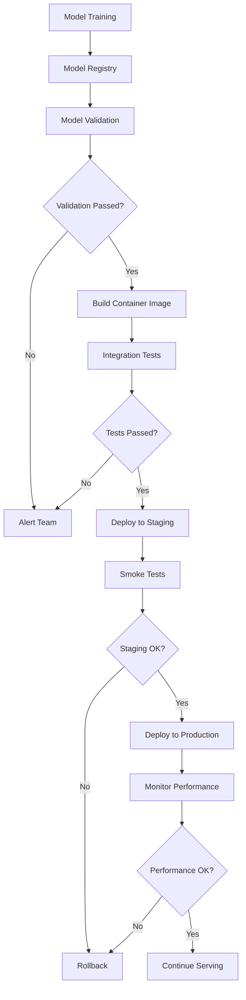
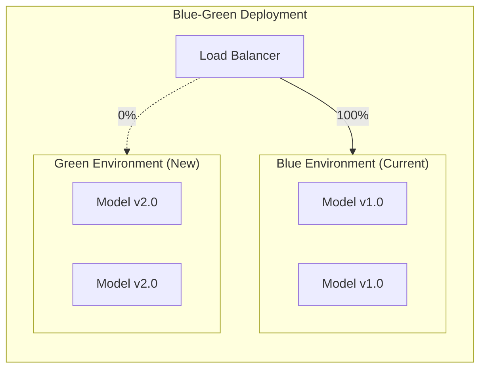
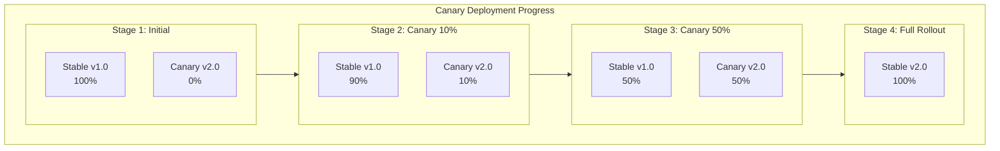
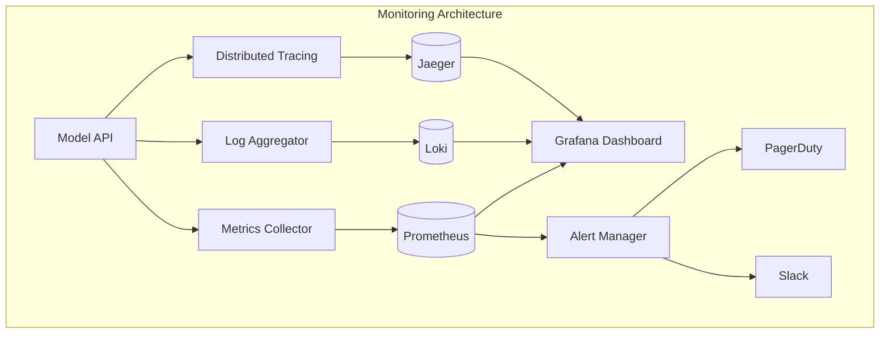

# How to Build Model Deployment Pipelines

Author: [nawazdhandala](https://github.com/nawazdhandala)

Tags: MLOps, Model Deployment, CI/CD, Machine Learning

Description: Learn to build model deployment pipelines for automated and reliable ML model releases.

---

Machine learning models are only valuable when they reach production. Building robust model deployment pipelines is essential for delivering ML capabilities to users reliably and efficiently. This guide walks you through creating production-grade deployment pipelines that automate the journey from trained models to live predictions.

## Understanding Model Deployment Pipelines

A model deployment pipeline automates the process of taking a trained machine learning model and making it available for inference in production. Unlike traditional software deployment, ML pipelines must handle model artifacts, validate model performance, and manage the unique challenges of serving predictions at scale.

### Pipeline Architecture Overview



## Setting Up the Model Registry

The model registry serves as the central repository for all model artifacts. It tracks model versions, metadata, and lineage information.

### MLflow Model Registry Implementation

```python
# model_registry.py
# This module handles model registration and versioning with MLflow

import mlflow
from mlflow.tracking import MlflowClient
from typing import Dict, Any, Optional
import logging

# Configure logging for visibility into registry operations
logging.basicConfig(level=logging.INFO)
logger = logging.getLogger(__name__)


class ModelRegistry:
    """
    Manages model lifecycle in MLflow Model Registry.
    Handles registration, versioning, and stage transitions.
    """

    def __init__(self, tracking_uri: str):
        # Set the MLflow tracking server URI
        mlflow.set_tracking_uri(tracking_uri)
        self.client = MlflowClient()
        logger.info(f"Connected to MLflow at {tracking_uri}")

    def register_model(
        self,
        model_name: str,
        model_path: str,
        metrics: Dict[str, float],
        parameters: Dict[str, Any],
        tags: Optional[Dict[str, str]] = None
    ) -> str:
        """
        Register a new model version with associated metadata.

        Args:
            model_name: Name for the registered model
            model_path: Path to the model artifact
            metrics: Performance metrics from training/validation
            parameters: Hyperparameters used during training
            tags: Optional tags for categorization

        Returns:
            The version number of the newly registered model
        """
        # Start an MLflow run to log the model
        with mlflow.start_run() as run:
            # Log all training metrics
            for metric_name, metric_value in metrics.items():
                mlflow.log_metric(metric_name, metric_value)

            # Log hyperparameters for reproducibility
            mlflow.log_params(parameters)

            # Log the model artifact to the registry
            model_info = mlflow.sklearn.log_model(
                sk_model=model_path,
                artifact_path="model",
                registered_model_name=model_name
            )

            # Apply custom tags if provided
            if tags:
                for tag_key, tag_value in tags.items():
                    mlflow.set_tag(tag_key, tag_value)

            logger.info(f"Registered model {model_name} from run {run.info.run_id}")

        # Get the latest version number
        latest_version = self._get_latest_version(model_name)
        return latest_version

    def _get_latest_version(self, model_name: str) -> str:
        """Retrieve the most recent version number for a model."""
        versions = self.client.search_model_versions(f"name='{model_name}'")
        if versions:
            # Sort by version number and return the highest
            latest = max(versions, key=lambda v: int(v.version))
            return latest.version
        return "1"

    def transition_model_stage(
        self,
        model_name: str,
        version: str,
        stage: str
    ) -> None:
        """
        Move a model version to a different stage.

        Stages: None, Staging, Production, Archived
        """
        valid_stages = ["None", "Staging", "Production", "Archived"]
        if stage not in valid_stages:
            raise ValueError(f"Stage must be one of {valid_stages}")

        self.client.transition_model_version_stage(
            name=model_name,
            version=version,
            stage=stage
        )
        logger.info(f"Transitioned {model_name} v{version} to {stage}")

    def get_production_model(self, model_name: str) -> Optional[str]:
        """Get the current production model version."""
        versions = self.client.search_model_versions(
            f"name='{model_name}' and current_stage='Production'"
        )
        if versions:
            return versions[0].version
        return None
```

## Model Validation Pipeline

Before deploying any model, validation ensures it meets quality standards and performs as expected.

### Validation Framework

```python
# model_validator.py
# Comprehensive model validation before deployment

import numpy as np
from sklearn.metrics import accuracy_score, precision_score, recall_score, f1_score
from typing import Dict, List, Any, Callable
import logging

logger = logging.getLogger(__name__)


class ModelValidator:
    """
    Validates ML models against defined criteria before deployment.
    Supports custom validation rules and performance thresholds.
    """

    def __init__(self, thresholds: Dict[str, float]):
        """
        Initialize validator with performance thresholds.

        Args:
            thresholds: Minimum acceptable values for each metric
                       Example: {"accuracy": 0.85, "precision": 0.80}
        """
        self.thresholds = thresholds
        self.validation_results: Dict[str, Any] = {}

    def validate_performance(
        self,
        model: Any,
        X_test: np.ndarray,
        y_test: np.ndarray
    ) -> bool:
        """
        Validate model performance against thresholds.

        Returns True if all metrics meet minimum thresholds.
        """
        # Generate predictions for evaluation
        y_pred = model.predict(X_test)

        # Calculate standard classification metrics
        metrics = {
            "accuracy": accuracy_score(y_test, y_pred),
            "precision": precision_score(y_test, y_pred, average="weighted"),
            "recall": recall_score(y_test, y_pred, average="weighted"),
            "f1_score": f1_score(y_test, y_pred, average="weighted")
        }

        # Store results for reporting
        self.validation_results["performance_metrics"] = metrics

        # Check each metric against its threshold
        all_passed = True
        for metric_name, threshold in self.thresholds.items():
            if metric_name in metrics:
                passed = metrics[metric_name] >= threshold
                if not passed:
                    logger.warning(
                        f"Metric {metric_name} ({metrics[metric_name]:.4f}) "
                        f"below threshold ({threshold})"
                    )
                    all_passed = False

        self.validation_results["performance_passed"] = all_passed
        return all_passed

    def validate_data_drift(
        self,
        reference_data: np.ndarray,
        current_data: np.ndarray,
        drift_threshold: float = 0.1
    ) -> bool:
        """
        Detect data drift between training and inference data.
        Uses Population Stability Index (PSI) for drift detection.
        """
        def calculate_psi(reference: np.ndarray, current: np.ndarray) -> float:
            # Bin the data into deciles
            bins = np.percentile(reference, np.arange(0, 110, 10))

            # Calculate proportions in each bin
            ref_counts = np.histogram(reference, bins=bins)[0] / len(reference)
            curr_counts = np.histogram(current, bins=bins)[0] / len(current)

            # Avoid division by zero
            ref_counts = np.clip(ref_counts, 0.0001, 1)
            curr_counts = np.clip(curr_counts, 0.0001, 1)

            # Calculate PSI
            psi = np.sum((curr_counts - ref_counts) * np.log(curr_counts / ref_counts))
            return psi

        # Calculate drift for each feature
        drift_scores = []
        for feature_idx in range(reference_data.shape[1]):
            psi = calculate_psi(
                reference_data[:, feature_idx],
                current_data[:, feature_idx]
            )
            drift_scores.append(psi)

        max_drift = max(drift_scores)
        drift_passed = max_drift < drift_threshold

        self.validation_results["drift_scores"] = drift_scores
        self.validation_results["max_drift"] = max_drift
        self.validation_results["drift_passed"] = drift_passed

        if not drift_passed:
            logger.warning(f"Data drift detected: PSI = {max_drift:.4f}")

        return drift_passed

    def validate_model_size(
        self,
        model_path: str,
        max_size_mb: float = 500
    ) -> bool:
        """
        Ensure model artifact size is within deployment limits.
        Large models may cause deployment timeouts or memory issues.
        """
        import os

        size_bytes = os.path.getsize(model_path)
        size_mb = size_bytes / (1024 * 1024)

        size_passed = size_mb <= max_size_mb
        self.validation_results["model_size_mb"] = size_mb
        self.validation_results["size_passed"] = size_passed

        if not size_passed:
            logger.warning(f"Model size ({size_mb:.2f}MB) exceeds limit ({max_size_mb}MB)")

        return size_passed

    def run_all_validations(
        self,
        model: Any,
        model_path: str,
        X_test: np.ndarray,
        y_test: np.ndarray,
        reference_data: np.ndarray,
        current_data: np.ndarray
    ) -> Dict[str, Any]:
        """
        Execute all validation checks and return comprehensive results.
        """
        results = {
            "performance": self.validate_performance(model, X_test, y_test),
            "drift": self.validate_data_drift(reference_data, current_data),
            "size": self.validate_model_size(model_path)
        }

        # Overall validation passes only if all checks pass
        results["all_passed"] = all(results.values())
        results["details"] = self.validation_results

        return results
```

## Building the Deployment Container

Containerization ensures consistent model serving across environments.

### Dockerfile for Model Serving

```dockerfile
# Dockerfile
# Multi-stage build for optimized model serving container

# Stage 1: Build dependencies
FROM python:3.10-slim as builder

WORKDIR /app

# Install build dependencies
RUN apt-get update && apt-get install -y \
    build-essential \
    && rm -rf /var/lib/apt/lists/*

# Copy and install Python dependencies
COPY requirements.txt .
RUN pip install --no-cache-dir --prefix=/install -r requirements.txt

# Stage 2: Production image
FROM python:3.10-slim as production

WORKDIR /app

# Copy installed dependencies from builder
COPY --from=builder /install /usr/local

# Create non-root user for security
RUN useradd --create-home --shell /bin/bash modelserver
USER modelserver

# Copy application code
COPY --chown=modelserver:modelserver . .

# Set environment variables
ENV MODEL_PATH=/app/models
ENV PORT=8080
ENV WORKERS=4

# Health check for container orchestration
HEALTHCHECK --interval=30s --timeout=10s --start-period=5s --retries=3 \
    CMD curl --fail http://localhost:${PORT}/health || exit 1

# Expose the serving port
EXPOSE ${PORT}

# Start the model server
CMD ["python", "-m", "uvicorn", "serving.app:app", "--host", "0.0.0.0", "--port", "8080"]
```

### Model Serving Application

```python
# serving/app.py
# FastAPI application for model inference

from fastapi import FastAPI, HTTPException, BackgroundTasks
from fastapi.middleware.cors import CORSMiddleware
from pydantic import BaseModel
from typing import List, Dict, Any, Optional
import numpy as np
import joblib
import logging
import time
import os

# Initialize logging
logging.basicConfig(level=logging.INFO)
logger = logging.getLogger(__name__)

# Create FastAPI application
app = FastAPI(
    title="ML Model Serving API",
    description="Production API for model inference",
    version="1.0.0"
)

# Configure CORS for cross-origin requests
app.add_middleware(
    CORSMiddleware,
    allow_origins=["*"],
    allow_credentials=True,
    allow_methods=["*"],
    allow_headers=["*"],
)


class PredictionRequest(BaseModel):
    """Schema for prediction requests."""
    features: List[List[float]]  # Batch of feature vectors
    model_version: Optional[str] = None  # Optional version specification


class PredictionResponse(BaseModel):
    """Schema for prediction responses."""
    predictions: List[Any]
    model_version: str
    latency_ms: float


class ModelManager:
    """
    Manages model loading, versioning, and inference.
    Supports hot-swapping models without downtime.
    """

    def __init__(self, model_path: str):
        self.model_path = model_path
        self.current_model = None
        self.current_version = None
        self.model_cache: Dict[str, Any] = {}
        self._load_default_model()

    def _load_default_model(self) -> None:
        """Load the default production model on startup."""
        default_path = os.path.join(self.model_path, "production", "model.joblib")
        if os.path.exists(default_path):
            self.current_model = joblib.load(default_path)
            self.current_version = self._read_version()
            logger.info(f"Loaded production model version {self.current_version}")

    def _read_version(self) -> str:
        """Read model version from metadata file."""
        version_file = os.path.join(self.model_path, "production", "version.txt")
        if os.path.exists(version_file):
            with open(version_file, "r") as f:
                return f.read().strip()
        return "unknown"

    def predict(
        self,
        features: np.ndarray,
        version: Optional[str] = None
    ) -> np.ndarray:
        """
        Generate predictions using the specified model version.
        Falls back to current production model if version not specified.
        """
        model = self.current_model

        if version and version != self.current_version:
            # Load specific version from cache or disk
            model = self._get_model_version(version)

        if model is None:
            raise ValueError("No model available for inference")

        return model.predict(features)

    def _get_model_version(self, version: str) -> Any:
        """Retrieve a specific model version, using cache when available."""
        if version in self.model_cache:
            return self.model_cache[version]

        version_path = os.path.join(self.model_path, version, "model.joblib")
        if os.path.exists(version_path):
            model = joblib.load(version_path)
            self.model_cache[version] = model
            return model

        raise ValueError(f"Model version {version} not found")

    def update_model(self, new_version: str) -> None:
        """Hot-swap to a new model version."""
        new_model = self._get_model_version(new_version)
        self.current_model = new_model
        self.current_version = new_version
        logger.info(f"Updated to model version {new_version}")


# Initialize model manager
MODEL_PATH = os.environ.get("MODEL_PATH", "/app/models")
model_manager = ModelManager(MODEL_PATH)


@app.get("/health")
async def health_check():
    """Health check endpoint for load balancers and orchestration."""
    return {
        "status": "healthy",
        "model_loaded": model_manager.current_model is not None,
        "model_version": model_manager.current_version
    }


@app.get("/ready")
async def readiness_check():
    """Readiness check to verify model is loaded and ready."""
    if model_manager.current_model is None:
        raise HTTPException(status_code=503, detail="Model not loaded")
    return {"status": "ready"}


@app.post("/predict", response_model=PredictionResponse)
async def predict(request: PredictionRequest):
    """
    Generate predictions for a batch of inputs.

    Accepts a list of feature vectors and returns predictions
    along with model version and latency information.
    """
    start_time = time.time()

    try:
        # Convert input to numpy array
        features = np.array(request.features)

        # Generate predictions
        predictions = model_manager.predict(
            features,
            version=request.model_version
        )

        # Calculate latency
        latency_ms = (time.time() - start_time) * 1000

        return PredictionResponse(
            predictions=predictions.tolist(),
            model_version=model_manager.current_version,
            latency_ms=round(latency_ms, 2)
        )

    except Exception as e:
        logger.error(f"Prediction failed: {str(e)}")
        raise HTTPException(status_code=500, detail=str(e))


@app.post("/models/reload")
async def reload_model(version: str, background_tasks: BackgroundTasks):
    """
    Trigger model hot-reload to a specific version.
    Runs in background to avoid blocking requests.
    """
    background_tasks.add_task(model_manager.update_model, version)
    return {"status": "reload_initiated", "target_version": version}
```

## CI/CD Pipeline Configuration

Automate the entire deployment process with GitHub Actions.

### GitHub Actions Workflow

```yaml
# .github/workflows/model-deployment.yml
# Automated model deployment pipeline

name: Model Deployment Pipeline

on:
  push:
    paths:
      - 'models/**'
      - 'serving/**'
    branches:
      - main
  workflow_dispatch:
    inputs:
      model_version:
        description: 'Model version to deploy'
        required: true
        type: string
      environment:
        description: 'Target environment'
        required: true
        default: 'staging'
        type: choice
        options:
          - staging
          - production

env:
  REGISTRY: ghcr.io
  IMAGE_NAME: ${{ github.repository }}/model-server
  MLFLOW_TRACKING_URI: ${{ secrets.MLFLOW_TRACKING_URI }}

jobs:
  # Job 1: Validate the model before deployment
  validate:
    name: Validate Model
    runs-on: ubuntu-latest
    outputs:
      validation_passed: ${{ steps.validate.outputs.passed }}

    steps:
      - name: Checkout repository
        uses: actions/checkout@v4

      - name: Set up Python
        uses: actions/setup-python@v5
        with:
          python-version: '3.10'
          cache: 'pip'

      - name: Install dependencies
        run: |
          pip install -r requirements.txt
          pip install pytest pytest-cov

      - name: Download model from registry
        run: |
          python scripts/download_model.py \
            --model-name ${{ github.event.inputs.model_version || 'latest' }} \
            --output-path ./models

      - name: Run model validation
        id: validate
        run: |
          python scripts/validate_model.py \
            --model-path ./models \
            --test-data ./data/validation \
            --output-file validation_results.json

          # Check validation results
          if [ $(jq '.all_passed' validation_results.json) == "true" ]; then
            echo "passed=true" >> $GITHUB_OUTPUT
          else
            echo "passed=false" >> $GITHUB_OUTPUT
            exit 1
          fi

      - name: Upload validation report
        uses: actions/upload-artifact@v4
        with:
          name: validation-report
          path: validation_results.json

  # Job 2: Build and push container image
  build:
    name: Build Container
    needs: validate
    if: needs.validate.outputs.validation_passed == 'true'
    runs-on: ubuntu-latest
    outputs:
      image_tag: ${{ steps.meta.outputs.tags }}

    steps:
      - name: Checkout repository
        uses: actions/checkout@v4

      - name: Set up Docker Buildx
        uses: docker/setup-buildx-action@v3

      - name: Log in to container registry
        uses: docker/login-action@v3
        with:
          registry: ${{ env.REGISTRY }}
          username: ${{ github.actor }}
          password: ${{ secrets.GITHUB_TOKEN }}

      - name: Extract metadata for Docker
        id: meta
        uses: docker/metadata-action@v5
        with:
          images: ${{ env.REGISTRY }}/${{ env.IMAGE_NAME }}
          tags: |
            type=sha,prefix=
            type=ref,event=branch
            type=semver,pattern={{version}}

      - name: Build and push Docker image
        uses: docker/build-push-action@v5
        with:
          context: .
          push: true
          tags: ${{ steps.meta.outputs.tags }}
          labels: ${{ steps.meta.outputs.labels }}
          cache-from: type=gha
          cache-to: type=gha,mode=max

  # Job 3: Run integration tests
  integration-tests:
    name: Integration Tests
    needs: build
    runs-on: ubuntu-latest

    services:
      model-server:
        image: ${{ needs.build.outputs.image_tag }}
        ports:
          - 8080:8080
        options: >-
          --health-cmd "curl -f http://localhost:8080/health || exit 1"
          --health-interval 10s
          --health-timeout 5s
          --health-retries 5

    steps:
      - name: Checkout repository
        uses: actions/checkout@v4

      - name: Wait for service
        run: |
          timeout 60 bash -c 'until curl -s http://localhost:8080/health; do sleep 2; done'

      - name: Run integration tests
        run: |
          python -m pytest tests/integration \
            --base-url http://localhost:8080 \
            -v --tb=short

  # Job 4: Deploy to staging
  deploy-staging:
    name: Deploy to Staging
    needs: [build, integration-tests]
    runs-on: ubuntu-latest
    environment: staging

    steps:
      - name: Checkout repository
        uses: actions/checkout@v4

      - name: Configure kubectl
        uses: azure/setup-kubectl@v3

      - name: Set Kubernetes context
        uses: azure/k8s-set-context@v3
        with:
          kubeconfig: ${{ secrets.KUBE_CONFIG_STAGING }}

      - name: Deploy to staging
        run: |
          # Update image tag in deployment manifest
          sed -i "s|IMAGE_TAG|${{ needs.build.outputs.image_tag }}|g" \
            k8s/staging/deployment.yaml

          # Apply Kubernetes manifests
          kubectl apply -f k8s/staging/

          # Wait for rollout to complete
          kubectl rollout status deployment/model-server \
            -n ml-staging --timeout=300s

      - name: Run smoke tests
        run: |
          STAGING_URL=$(kubectl get svc model-server -n ml-staging \
            -o jsonpath='{.status.loadBalancer.ingress[0].ip}')

          python scripts/smoke_tests.py --url http://$STAGING_URL:8080

  # Job 5: Deploy to production (manual approval required)
  deploy-production:
    name: Deploy to Production
    needs: [build, deploy-staging]
    runs-on: ubuntu-latest
    environment: production
    if: github.event.inputs.environment == 'production' || github.ref == 'refs/heads/main'

    steps:
      - name: Checkout repository
        uses: actions/checkout@v4

      - name: Configure kubectl
        uses: azure/setup-kubectl@v3

      - name: Set Kubernetes context
        uses: azure/k8s-set-context@v3
        with:
          kubeconfig: ${{ secrets.KUBE_CONFIG_PRODUCTION }}

      - name: Deploy with canary strategy
        run: |
          # Deploy canary (10% traffic)
          sed -i "s|IMAGE_TAG|${{ needs.build.outputs.image_tag }}|g" \
            k8s/production/canary-deployment.yaml

          kubectl apply -f k8s/production/canary-deployment.yaml
          kubectl rollout status deployment/model-server-canary \
            -n ml-production --timeout=300s

      - name: Monitor canary metrics
        run: |
          # Monitor for 10 minutes before full rollout
          python scripts/monitor_canary.py \
            --duration 600 \
            --error-threshold 0.01 \
            --latency-threshold 200

      - name: Full production rollout
        run: |
          sed -i "s|IMAGE_TAG|${{ needs.build.outputs.image_tag }}|g" \
            k8s/production/deployment.yaml

          kubectl apply -f k8s/production/deployment.yaml
          kubectl rollout status deployment/model-server \
            -n ml-production --timeout=300s

          # Remove canary deployment
          kubectl delete deployment model-server-canary -n ml-production
```

## Deployment Strategies

### Blue-Green Deployment



### Blue-Green Implementation

```python
# deployment/blue_green.py
# Blue-green deployment strategy implementation

from kubernetes import client, config
from typing import Dict, Optional
import logging
import time

logger = logging.getLogger(__name__)


class BlueGreenDeployer:
    """
    Implements blue-green deployment for zero-downtime model updates.
    Maintains two identical environments and switches traffic atomically.
    """

    def __init__(self, namespace: str = "ml-production"):
        # Load Kubernetes configuration
        config.load_incluster_config()
        self.apps_v1 = client.AppsV1Api()
        self.core_v1 = client.CoreV1Api()
        self.namespace = namespace

    def deploy(
        self,
        new_image: str,
        deployment_name: str,
        health_check_url: str
    ) -> bool:
        """
        Execute blue-green deployment.

        Steps:
        1. Identify current active environment (blue or green)
        2. Deploy new version to inactive environment
        3. Verify new deployment health
        4. Switch traffic to new environment
        5. Keep old environment for quick rollback

        Returns True if deployment succeeds.
        """
        # Step 1: Determine current active environment
        current_env = self._get_active_environment(deployment_name)
        new_env = "green" if current_env == "blue" else "blue"

        logger.info(f"Current: {current_env}, Deploying to: {new_env}")

        # Step 2: Deploy to inactive environment
        inactive_deployment = f"{deployment_name}-{new_env}"
        self._update_deployment_image(inactive_deployment, new_image)

        # Step 3: Wait for deployment and verify health
        if not self._wait_for_healthy(inactive_deployment, health_check_url):
            logger.error(f"Health check failed for {inactive_deployment}")
            return False

        # Step 4: Switch traffic to new environment
        self._switch_service_selector(deployment_name, new_env)

        logger.info(f"Successfully switched to {new_env} environment")
        return True

    def _get_active_environment(self, deployment_name: str) -> str:
        """Determine which environment is currently serving traffic."""
        service = self.core_v1.read_namespaced_service(
            name=deployment_name,
            namespace=self.namespace
        )
        return service.spec.selector.get("environment", "blue")

    def _update_deployment_image(self, deployment_name: str, image: str) -> None:
        """Update the container image for a deployment."""
        # Get current deployment
        deployment = self.apps_v1.read_namespaced_deployment(
            name=deployment_name,
            namespace=self.namespace
        )

        # Update image
        deployment.spec.template.spec.containers[0].image = image

        # Apply update
        self.apps_v1.patch_namespaced_deployment(
            name=deployment_name,
            namespace=self.namespace,
            body=deployment
        )

        logger.info(f"Updated {deployment_name} to image {image}")

    def _wait_for_healthy(
        self,
        deployment_name: str,
        health_url: str,
        timeout: int = 300
    ) -> bool:
        """Wait for deployment to become healthy."""
        import requests

        start_time = time.time()

        while time.time() - start_time < timeout:
            try:
                # Check Kubernetes deployment status
                deployment = self.apps_v1.read_namespaced_deployment(
                    name=deployment_name,
                    namespace=self.namespace
                )

                ready_replicas = deployment.status.ready_replicas or 0
                desired_replicas = deployment.spec.replicas

                if ready_replicas >= desired_replicas:
                    # Verify application health endpoint
                    response = requests.get(health_url, timeout=5)
                    if response.status_code == 200:
                        return True

            except Exception as e:
                logger.debug(f"Health check pending: {e}")

            time.sleep(10)

        return False

    def _switch_service_selector(self, service_name: str, environment: str) -> None:
        """Update service selector to route traffic to specified environment."""
        service = self.core_v1.read_namespaced_service(
            name=service_name,
            namespace=self.namespace
        )

        # Update selector to point to new environment
        service.spec.selector["environment"] = environment

        self.core_v1.patch_namespaced_service(
            name=service_name,
            namespace=self.namespace,
            body=service
        )

    def rollback(self, deployment_name: str) -> bool:
        """
        Rollback to previous environment.
        Simply switches traffic back to the old environment.
        """
        current_env = self._get_active_environment(deployment_name)
        previous_env = "green" if current_env == "blue" else "blue"

        self._switch_service_selector(deployment_name, previous_env)
        logger.info(f"Rolled back to {previous_env} environment")

        return True
```

### Canary Deployment



### Canary Deployment Implementation

```python
# deployment/canary.py
# Progressive canary deployment with automatic rollback

from dataclasses import dataclass
from typing import List, Callable
import time
import logging

logger = logging.getLogger(__name__)


@dataclass
class CanaryConfig:
    """Configuration for canary deployment stages."""
    traffic_percentage: int  # Percentage of traffic to canary
    duration_seconds: int    # How long to observe this stage
    metrics_threshold: dict  # Acceptable metric ranges


class CanaryDeployer:
    """
    Implements progressive canary deployment with automatic promotion or rollback.
    Gradually increases traffic to new version while monitoring for issues.
    """

    def __init__(
        self,
        metrics_collector: Callable,
        traffic_manager: Callable,
        alerter: Callable
    ):
        """
        Initialize canary deployer.

        Args:
            metrics_collector: Function to collect deployment metrics
            traffic_manager: Function to adjust traffic split
            alerter: Function to send alerts on issues
        """
        self.collect_metrics = metrics_collector
        self.set_traffic_split = traffic_manager
        self.send_alert = alerter

    def deploy(
        self,
        stages: List[CanaryConfig],
        deployment_name: str
    ) -> bool:
        """
        Execute progressive canary deployment through defined stages.

        Returns True if deployment succeeds, False if rolled back.
        """
        logger.info(f"Starting canary deployment for {deployment_name}")

        for stage_num, stage in enumerate(stages, 1):
            logger.info(
                f"Stage {stage_num}/{len(stages)}: "
                f"{stage.traffic_percentage}% traffic for {stage.duration_seconds}s"
            )

            # Update traffic split
            self.set_traffic_split(
                deployment_name,
                canary_percentage=stage.traffic_percentage
            )

            # Monitor metrics during this stage
            if not self._monitor_stage(stage, deployment_name):
                # Metrics exceeded thresholds, initiate rollback
                logger.error(f"Stage {stage_num} failed metrics check, rolling back")
                self._rollback(deployment_name)
                return False

            logger.info(f"Stage {stage_num} completed successfully")

        # All stages passed, complete the rollout
        self._complete_rollout(deployment_name)
        return True

    def _monitor_stage(self, stage: CanaryConfig, deployment_name: str) -> bool:
        """
        Monitor deployment metrics during a canary stage.
        Returns False if metrics exceed acceptable thresholds.
        """
        check_interval = 30  # Check every 30 seconds
        checks_count = stage.duration_seconds // check_interval
        failed_checks = 0
        max_failures = 3  # Allow some transient failures

        for check in range(checks_count):
            time.sleep(check_interval)

            # Collect current metrics
            metrics = self.collect_metrics(deployment_name)

            # Validate against thresholds
            if not self._validate_metrics(metrics, stage.metrics_threshold):
                failed_checks += 1
                logger.warning(
                    f"Metrics check {check + 1}/{checks_count} failed "
                    f"({failed_checks}/{max_failures} failures)"
                )

                if failed_checks >= max_failures:
                    return False
            else:
                # Reset failure counter on success
                failed_checks = 0

        return True

    def _validate_metrics(self, metrics: dict, thresholds: dict) -> bool:
        """Validate collected metrics against defined thresholds."""
        # Check error rate
        if metrics.get("error_rate", 0) > thresholds.get("max_error_rate", 0.01):
            logger.warning(
                f"Error rate {metrics['error_rate']:.4f} exceeds threshold "
                f"{thresholds['max_error_rate']}"
            )
            return False

        # Check latency
        if metrics.get("p99_latency_ms", 0) > thresholds.get("max_latency_ms", 500):
            logger.warning(
                f"P99 latency {metrics['p99_latency_ms']}ms exceeds threshold "
                f"{thresholds['max_latency_ms']}ms"
            )
            return False

        # Check prediction drift
        if metrics.get("prediction_drift", 0) > thresholds.get("max_drift", 0.1):
            logger.warning(
                f"Prediction drift {metrics['prediction_drift']:.4f} exceeds threshold"
            )
            return False

        return True

    def _rollback(self, deployment_name: str) -> None:
        """Rollback canary deployment by routing all traffic to stable version."""
        logger.info(f"Rolling back {deployment_name}")

        # Set traffic to 0% canary
        self.set_traffic_split(deployment_name, canary_percentage=0)

        # Send alert
        self.send_alert(
            severity="high",
            message=f"Canary deployment {deployment_name} rolled back due to metrics failure"
        )

    def _complete_rollout(self, deployment_name: str) -> None:
        """Complete the canary rollout by promoting canary to stable."""
        logger.info(f"Completing rollout for {deployment_name}")

        # Set traffic to 100% canary (which becomes the new stable)
        self.set_traffic_split(deployment_name, canary_percentage=100)

        self.send_alert(
            severity="info",
            message=f"Canary deployment {deployment_name} successfully completed"
        )
```

## Rollback Mechanisms

### Automated Rollback System

```python
# deployment/rollback.py
# Automated rollback system with multiple strategies

from enum import Enum
from typing import Dict, List, Optional, Callable
from dataclasses import dataclass
from datetime import datetime, timedelta
import logging

logger = logging.getLogger(__name__)


class RollbackTrigger(Enum):
    """Events that can trigger automatic rollback."""
    ERROR_RATE_HIGH = "error_rate_exceeded"
    LATENCY_HIGH = "latency_exceeded"
    MEMORY_EXHAUSTION = "memory_exhaustion"
    HEALTH_CHECK_FAILED = "health_check_failed"
    PREDICTION_DRIFT = "prediction_drift_detected"
    MANUAL = "manual_trigger"


@dataclass
class RollbackEvent:
    """Record of a rollback event."""
    timestamp: datetime
    trigger: RollbackTrigger
    from_version: str
    to_version: str
    reason: str
    success: bool


class RollbackManager:
    """
    Manages automated and manual rollback operations.
    Maintains rollback history and supports multiple rollback strategies.
    """

    def __init__(
        self,
        model_registry: 'ModelRegistry',
        deployment_client: 'DeploymentClient',
        metrics_client: 'MetricsClient'
    ):
        self.registry = model_registry
        self.deployer = deployment_client
        self.metrics = metrics_client
        self.rollback_history: List[RollbackEvent] = []
        self.thresholds = self._load_default_thresholds()

    def _load_default_thresholds(self) -> Dict:
        """Load default thresholds for automated rollback triggers."""
        return {
            "max_error_rate": 0.05,           # 5% error rate
            "max_latency_p99_ms": 500,        # 500ms P99 latency
            "max_memory_percent": 90,          # 90% memory usage
            "min_health_check_success": 0.95,  # 95% health checks passing
            "max_prediction_drift_psi": 0.2    # PSI drift threshold
        }

    def check_rollback_needed(self, deployment_name: str) -> Optional[RollbackTrigger]:
        """
        Evaluate current metrics to determine if rollback is needed.
        Returns the trigger type if rollback is needed, None otherwise.
        """
        current_metrics = self.metrics.get_current(deployment_name)

        # Check error rate
        if current_metrics["error_rate"] > self.thresholds["max_error_rate"]:
            logger.warning(
                f"Error rate {current_metrics['error_rate']:.4f} exceeds threshold"
            )
            return RollbackTrigger.ERROR_RATE_HIGH

        # Check latency
        if current_metrics["latency_p99_ms"] > self.thresholds["max_latency_p99_ms"]:
            logger.warning(
                f"P99 latency {current_metrics['latency_p99_ms']}ms exceeds threshold"
            )
            return RollbackTrigger.LATENCY_HIGH

        # Check memory usage
        if current_metrics["memory_percent"] > self.thresholds["max_memory_percent"]:
            logger.warning(
                f"Memory usage {current_metrics['memory_percent']}% exceeds threshold"
            )
            return RollbackTrigger.MEMORY_EXHAUSTION

        # Check health check success rate
        if current_metrics["health_check_success"] < self.thresholds["min_health_check_success"]:
            logger.warning(
                f"Health check success rate {current_metrics['health_check_success']:.4f} below threshold"
            )
            return RollbackTrigger.HEALTH_CHECK_FAILED

        return None

    def execute_rollback(
        self,
        deployment_name: str,
        trigger: RollbackTrigger,
        target_version: Optional[str] = None
    ) -> bool:
        """
        Execute rollback to specified version or previous stable version.

        Args:
            deployment_name: Name of the deployment to rollback
            trigger: What triggered the rollback
            target_version: Specific version to rollback to (optional)

        Returns:
            True if rollback succeeds, False otherwise
        """
        # Get current version
        current_version = self.deployer.get_current_version(deployment_name)

        # Determine target version
        if target_version is None:
            target_version = self._get_last_stable_version(deployment_name)

        if target_version is None:
            logger.error("No stable version available for rollback")
            return False

        logger.info(
            f"Initiating rollback: {current_version} -> {target_version} "
            f"(trigger: {trigger.value})"
        )

        # Execute the rollback
        try:
            # Update model registry stage
            self.registry.transition_model_stage(
                model_name=deployment_name,
                version=target_version,
                stage="Production"
            )

            # Trigger deployment update
            self.deployer.deploy_version(deployment_name, target_version)

            # Wait for deployment to complete
            self.deployer.wait_for_ready(deployment_name, timeout=300)

            # Record successful rollback
            self._record_rollback(
                trigger=trigger,
                from_version=current_version,
                to_version=target_version,
                reason=f"Automated rollback due to {trigger.value}",
                success=True
            )

            logger.info(f"Rollback to {target_version} completed successfully")
            return True

        except Exception as e:
            logger.error(f"Rollback failed: {str(e)}")
            self._record_rollback(
                trigger=trigger,
                from_version=current_version,
                to_version=target_version,
                reason=str(e),
                success=False
            )
            return False

    def _get_last_stable_version(self, deployment_name: str) -> Optional[str]:
        """Get the last known stable version for a deployment."""
        # Look through history for successful deployments
        for event in reversed(self.rollback_history):
            if event.success and event.to_version:
                return event.to_version

        # Fall back to registry's archived stable version
        return self.registry.get_latest_archived_version(deployment_name)

    def _record_rollback(
        self,
        trigger: RollbackTrigger,
        from_version: str,
        to_version: str,
        reason: str,
        success: bool
    ) -> None:
        """Record a rollback event for auditing and analysis."""
        event = RollbackEvent(
            timestamp=datetime.utcnow(),
            trigger=trigger,
            from_version=from_version,
            to_version=to_version,
            reason=reason,
            success=success
        )
        self.rollback_history.append(event)

        # Also persist to external storage for long-term retention
        self._persist_event(event)

    def _persist_event(self, event: RollbackEvent) -> None:
        """Persist rollback event to external storage."""
        # Implementation depends on your storage backend
        pass

    def get_rollback_report(self, days: int = 30) -> Dict:
        """Generate rollback statistics report."""
        cutoff = datetime.utcnow() - timedelta(days=days)
        recent_events = [
            e for e in self.rollback_history
            if e.timestamp > cutoff
        ]

        return {
            "total_rollbacks": len(recent_events),
            "successful_rollbacks": sum(1 for e in recent_events if e.success),
            "failed_rollbacks": sum(1 for e in recent_events if not e.success),
            "by_trigger": self._count_by_trigger(recent_events),
            "mean_time_to_rollback": self._calculate_mttr(recent_events)
        }

    def _count_by_trigger(self, events: List[RollbackEvent]) -> Dict[str, int]:
        """Count rollbacks by trigger type."""
        counts = {}
        for event in events:
            trigger_name = event.trigger.value
            counts[trigger_name] = counts.get(trigger_name, 0) + 1
        return counts

    def _calculate_mttr(self, events: List[RollbackEvent]) -> float:
        """Calculate mean time to rollback in seconds."""
        # This would require tracking when issues were first detected
        # Placeholder implementation
        return 0.0
```

## Monitoring and Observability

### Model Performance Dashboard



### Prometheus Metrics Configuration

```python
# monitoring/metrics.py
# Custom Prometheus metrics for model serving

from prometheus_client import Counter, Histogram, Gauge, CollectorRegistry
from functools import wraps
import time

# Create a custom registry for model metrics
MODEL_REGISTRY = CollectorRegistry()

# Request metrics
PREDICTION_REQUESTS = Counter(
    'model_prediction_requests_total',
    'Total number of prediction requests',
    ['model_name', 'model_version', 'status'],
    registry=MODEL_REGISTRY
)

PREDICTION_LATENCY = Histogram(
    'model_prediction_latency_seconds',
    'Prediction request latency in seconds',
    ['model_name', 'model_version'],
    buckets=[0.01, 0.025, 0.05, 0.1, 0.25, 0.5, 1.0, 2.5, 5.0],
    registry=MODEL_REGISTRY
)

# Model health metrics
MODEL_LOADED = Gauge(
    'model_loaded',
    'Whether the model is currently loaded',
    ['model_name', 'model_version'],
    registry=MODEL_REGISTRY
)

# Prediction distribution metrics
PREDICTION_VALUES = Histogram(
    'model_prediction_values',
    'Distribution of prediction values',
    ['model_name', 'prediction_class'],
    buckets=[0.1, 0.2, 0.3, 0.4, 0.5, 0.6, 0.7, 0.8, 0.9, 1.0],
    registry=MODEL_REGISTRY
)

# Feature drift metrics
FEATURE_DRIFT_PSI = Gauge(
    'model_feature_drift_psi',
    'Population Stability Index for feature drift',
    ['model_name', 'feature_name'],
    registry=MODEL_REGISTRY
)


def track_prediction(model_name: str, model_version: str):
    """
    Decorator to track prediction metrics.

    Usage:
        @track_prediction("my_model", "v1.0")
        def predict(features):
            return model.predict(features)
    """
    def decorator(func):
        @wraps(func)
        def wrapper(*args, **kwargs):
            start_time = time.time()

            try:
                result = func(*args, **kwargs)
                PREDICTION_REQUESTS.labels(
                    model_name=model_name,
                    model_version=model_version,
                    status='success'
                ).inc()
                return result

            except Exception as e:
                PREDICTION_REQUESTS.labels(
                    model_name=model_name,
                    model_version=model_version,
                    status='error'
                ).inc()
                raise

            finally:
                latency = time.time() - start_time
                PREDICTION_LATENCY.labels(
                    model_name=model_name,
                    model_version=model_version
                ).observe(latency)

        return wrapper
    return decorator


class ModelMetricsCollector:
    """Collects and reports model-specific metrics."""

    def __init__(self, model_name: str, model_version: str):
        self.model_name = model_name
        self.model_version = model_version

    def record_prediction(self, prediction: float, latency: float) -> None:
        """Record a single prediction event."""
        PREDICTION_REQUESTS.labels(
            model_name=self.model_name,
            model_version=self.model_version,
            status='success'
        ).inc()

        PREDICTION_LATENCY.labels(
            model_name=self.model_name,
            model_version=self.model_version
        ).observe(latency)

        # Track prediction distribution
        prediction_class = 'positive' if prediction > 0.5 else 'negative'
        PREDICTION_VALUES.labels(
            model_name=self.model_name,
            prediction_class=prediction_class
        ).observe(prediction)

    def update_drift_metrics(self, drift_scores: dict) -> None:
        """Update feature drift metrics."""
        for feature_name, psi_score in drift_scores.items():
            FEATURE_DRIFT_PSI.labels(
                model_name=self.model_name,
                feature_name=feature_name
            ).set(psi_score)

    def set_model_loaded(self, loaded: bool) -> None:
        """Update model loaded status."""
        MODEL_LOADED.labels(
            model_name=self.model_name,
            model_version=self.model_version
        ).set(1 if loaded else 0)
```

## Kubernetes Deployment Manifests

### Production Deployment Configuration

```yaml
# k8s/production/deployment.yaml
# Production model serving deployment

apiVersion: apps/v1
kind: Deployment
metadata:
  name: model-server
  namespace: ml-production
  labels:
    app: model-server
    environment: production
spec:
  replicas: 3
  strategy:
    type: RollingUpdate
    rollingUpdate:
      maxSurge: 1
      maxUnavailable: 0
  selector:
    matchLabels:
      app: model-server
  template:
    metadata:
      labels:
        app: model-server
        environment: production
      annotations:
        prometheus.io/scrape: "true"
        prometheus.io/port: "8080"
        prometheus.io/path: "/metrics"
    spec:
      # Ensure pods are spread across nodes
      topologySpreadConstraints:
        - maxSkew: 1
          topologyKey: kubernetes.io/hostname
          whenUnsatisfiable: DoNotSchedule
          labelSelector:
            matchLabels:
              app: model-server

      containers:
        - name: model-server
          image: IMAGE_TAG
          ports:
            - containerPort: 8080
              name: http

          # Resource limits and requests
          resources:
            requests:
              cpu: "500m"
              memory: "1Gi"
            limits:
              cpu: "2000m"
              memory: "4Gi"

          # Environment variables
          env:
            - name: MODEL_PATH
              value: "/models"
            - name: LOG_LEVEL
              value: "INFO"
            - name: WORKERS
              value: "4"

          # Volume mounts for model artifacts
          volumeMounts:
            - name: model-volume
              mountPath: /models
              readOnly: true

          # Liveness probe - is the container running?
          livenessProbe:
            httpGet:
              path: /health
              port: http
            initialDelaySeconds: 30
            periodSeconds: 10
            timeoutSeconds: 5
            failureThreshold: 3

          # Readiness probe - is the container ready to serve?
          readinessProbe:
            httpGet:
              path: /ready
              port: http
            initialDelaySeconds: 10
            periodSeconds: 5
            timeoutSeconds: 3
            failureThreshold: 3

          # Startup probe - for slow-starting containers
          startupProbe:
            httpGet:
              path: /health
              port: http
            initialDelaySeconds: 10
            periodSeconds: 10
            timeoutSeconds: 5
            failureThreshold: 30

      volumes:
        - name: model-volume
          persistentVolumeClaim:
            claimName: model-artifacts-pvc

---
# Horizontal Pod Autoscaler
apiVersion: autoscaling/v2
kind: HorizontalPodAutoscaler
metadata:
  name: model-server-hpa
  namespace: ml-production
spec:
  scaleTargetRef:
    apiVersion: apps/v1
    kind: Deployment
    name: model-server
  minReplicas: 3
  maxReplicas: 10
  metrics:
    - type: Resource
      resource:
        name: cpu
        target:
          type: Utilization
          averageUtilization: 70
    - type: Resource
      resource:
        name: memory
        target:
          type: Utilization
          averageUtilization: 80
  behavior:
    scaleUp:
      stabilizationWindowSeconds: 60
      policies:
        - type: Pods
          value: 2
          periodSeconds: 60
    scaleDown:
      stabilizationWindowSeconds: 300
      policies:
        - type: Percent
          value: 10
          periodSeconds: 60

---
# Service for load balancing
apiVersion: v1
kind: Service
metadata:
  name: model-server
  namespace: ml-production
spec:
  type: LoadBalancer
  selector:
    app: model-server
  ports:
    - port: 80
      targetPort: 8080
      protocol: TCP
```

## Putting It All Together

Here is a complete pipeline orchestration script that ties all components together:

```python
# pipeline/orchestrator.py
# Main orchestrator for end-to-end model deployment

import logging
from typing import Optional
from dataclasses import dataclass

from model_registry import ModelRegistry
from model_validator import ModelValidator
from deployment.blue_green import BlueGreenDeployer
from deployment.canary import CanaryDeployer, CanaryConfig
from deployment.rollback import RollbackManager, RollbackTrigger
from monitoring.metrics import ModelMetricsCollector

logging.basicConfig(level=logging.INFO)
logger = logging.getLogger(__name__)


@dataclass
class DeploymentConfig:
    """Configuration for a deployment pipeline run."""
    model_name: str
    model_version: str
    environment: str  # staging or production
    strategy: str     # blue_green or canary
    auto_rollback: bool = True
    validation_thresholds: dict = None


class DeploymentOrchestrator:
    """
    Orchestrates the complete model deployment pipeline.
    Coordinates validation, deployment, and monitoring components.
    """

    def __init__(self, config: DeploymentConfig):
        self.config = config

        # Initialize all pipeline components
        self.registry = ModelRegistry(tracking_uri="http://mlflow:5000")
        self.validator = ModelValidator(
            thresholds=config.validation_thresholds or {
                "accuracy": 0.85,
                "precision": 0.80,
                "recall": 0.80
            }
        )
        self.metrics = ModelMetricsCollector(
            model_name=config.model_name,
            model_version=config.model_version
        )

        # Select deployment strategy
        if config.strategy == "blue_green":
            self.deployer = BlueGreenDeployer(
                namespace=f"ml-{config.environment}"
            )
        else:
            self.deployer = CanaryDeployer(
                metrics_collector=self._collect_metrics,
                traffic_manager=self._set_traffic,
                alerter=self._send_alert
            )

        self.rollback_manager = RollbackManager(
            model_registry=self.registry,
            deployment_client=self.deployer,
            metrics_client=self.metrics
        )

    def run(self) -> bool:
        """
        Execute the complete deployment pipeline.

        Returns True if deployment succeeds, False otherwise.
        """
        logger.info(
            f"Starting deployment pipeline for {self.config.model_name} "
            f"v{self.config.model_version} to {self.config.environment}"
        )

        try:
            # Step 1: Validate the model
            logger.info("Step 1: Model Validation")
            if not self._validate_model():
                logger.error("Model validation failed, aborting deployment")
                return False

            # Step 2: Build and push container image
            logger.info("Step 2: Build Container")
            image_tag = self._build_container()
            if not image_tag:
                logger.error("Container build failed, aborting deployment")
                return False

            # Step 3: Deploy to target environment
            logger.info(f"Step 3: Deploy ({self.config.strategy})")
            if not self._deploy(image_tag):
                logger.error("Deployment failed")
                if self.config.auto_rollback:
                    self._handle_rollback()
                return False

            # Step 4: Post-deployment validation
            logger.info("Step 4: Post-deployment Validation")
            if not self._post_deployment_validation():
                logger.error("Post-deployment validation failed")
                if self.config.auto_rollback:
                    self._handle_rollback()
                return False

            # Step 5: Update model registry
            logger.info("Step 5: Update Registry")
            self._update_registry()

            logger.info("Deployment pipeline completed successfully")
            return True

        except Exception as e:
            logger.error(f"Pipeline failed with exception: {str(e)}")
            if self.config.auto_rollback:
                self._handle_rollback()
            return False

    def _validate_model(self) -> bool:
        """Run model validation suite."""
        # Load test data and model
        model = self.registry.load_model(
            self.config.model_name,
            self.config.model_version
        )

        # This would load your actual test data
        X_test, y_test = self._load_test_data()

        return self.validator.validate_performance(model, X_test, y_test)

    def _build_container(self) -> Optional[str]:
        """Build and push container image."""
        # Container building logic would go here
        # Returns the image tag on success
        return f"model-server:{self.config.model_version}"

    def _deploy(self, image_tag: str) -> bool:
        """Execute deployment based on selected strategy."""
        if self.config.strategy == "blue_green":
            return self.deployer.deploy(
                new_image=image_tag,
                deployment_name=self.config.model_name,
                health_check_url=self._get_health_url()
            )
        else:
            # Canary deployment with progressive rollout
            stages = [
                CanaryConfig(
                    traffic_percentage=10,
                    duration_seconds=300,
                    metrics_threshold={
                        "max_error_rate": 0.01,
                        "max_latency_ms": 200
                    }
                ),
                CanaryConfig(
                    traffic_percentage=50,
                    duration_seconds=600,
                    metrics_threshold={
                        "max_error_rate": 0.01,
                        "max_latency_ms": 200
                    }
                ),
            ]
            return self.deployer.deploy(stages, self.config.model_name)

    def _post_deployment_validation(self) -> bool:
        """Validate deployment after rollout."""
        # Run smoke tests against the deployed service
        return self._run_smoke_tests()

    def _handle_rollback(self) -> None:
        """Execute rollback on failure."""
        self.rollback_manager.execute_rollback(
            deployment_name=self.config.model_name,
            trigger=RollbackTrigger.HEALTH_CHECK_FAILED
        )

    def _update_registry(self) -> None:
        """Update model stage in registry."""
        stage = "Production" if self.config.environment == "production" else "Staging"
        self.registry.transition_model_stage(
            model_name=self.config.model_name,
            version=self.config.model_version,
            stage=stage
        )

    # Helper methods (implementations depend on your infrastructure)
    def _load_test_data(self):
        pass

    def _get_health_url(self) -> str:
        return f"http://model-server.ml-{self.config.environment}.svc/health"

    def _run_smoke_tests(self) -> bool:
        return True

    def _collect_metrics(self, deployment_name: str) -> dict:
        return {}

    def _set_traffic(self, deployment_name: str, canary_percentage: int) -> None:
        pass

    def _send_alert(self, severity: str, message: str) -> None:
        pass


# Entry point for pipeline execution
if __name__ == "__main__":
    config = DeploymentConfig(
        model_name="fraud-detection-model",
        model_version="2.1.0",
        environment="production",
        strategy="canary",
        auto_rollback=True
    )

    orchestrator = DeploymentOrchestrator(config)
    success = orchestrator.run()

    exit(0 if success else 1)
```

## Best Practices Summary

1. **Version Everything**: Models, code, data, and configurations should all be versioned and traceable.

2. **Automate Validation**: Never deploy a model without automated performance validation against established baselines.

3. **Use Progressive Rollouts**: Canary deployments catch issues before they impact all users.

4. **Enable Quick Rollbacks**: Always maintain the ability to rollback to a known good state within minutes.

5. **Monitor Continuously**: Track not just system metrics but also model-specific metrics like prediction distributions and feature drift.

6. **Document Everything**: Maintain runbooks for common failure scenarios and rollback procedures.

7. **Test in Production-Like Environments**: Staging should mirror production as closely as possible.

## Conclusion

Building robust model deployment pipelines requires careful attention to validation, deployment strategies, and rollback mechanisms. By implementing the patterns and practices outlined in this guide, you can achieve reliable, automated model deployments that minimize risk and maximize velocity.

The key is to treat ML deployments with the same rigor as traditional software deployments while accounting for the unique challenges of machine learning systems. Start with simple pipelines and gradually add sophistication as your MLOps practice matures.
