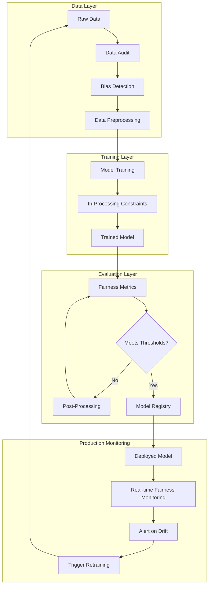
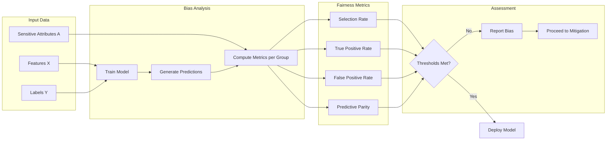
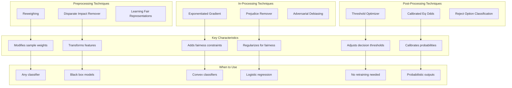
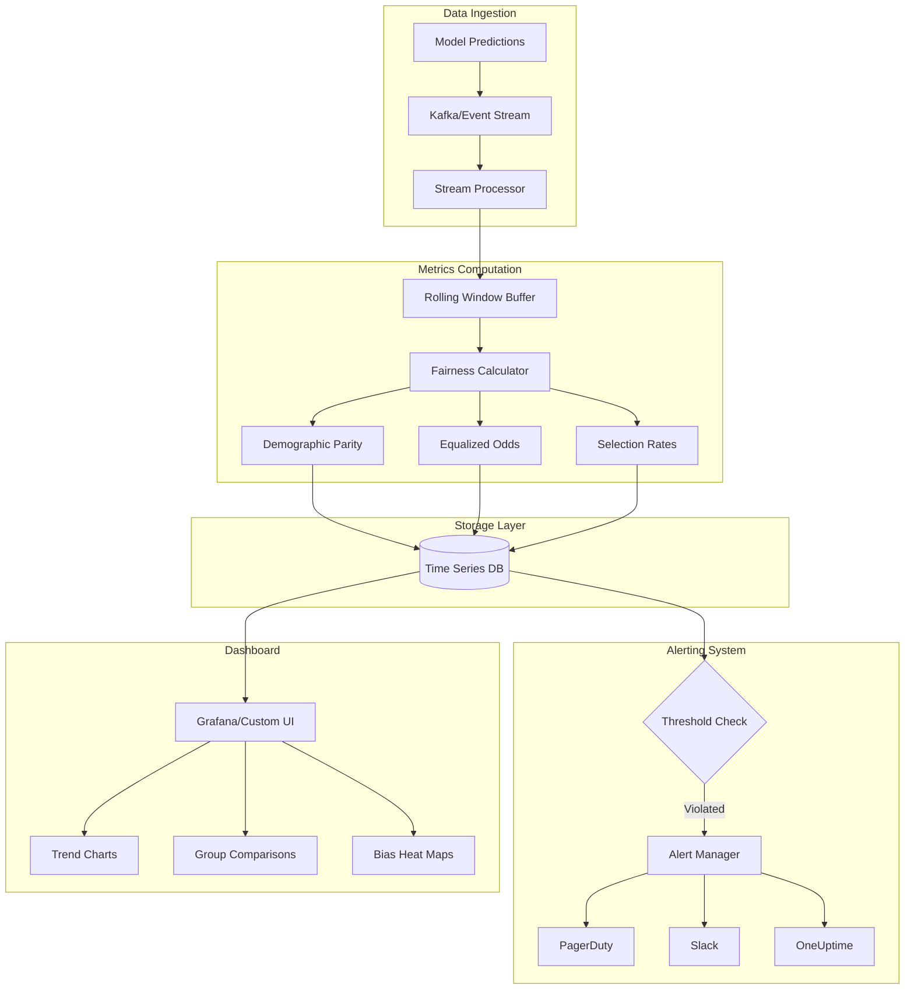
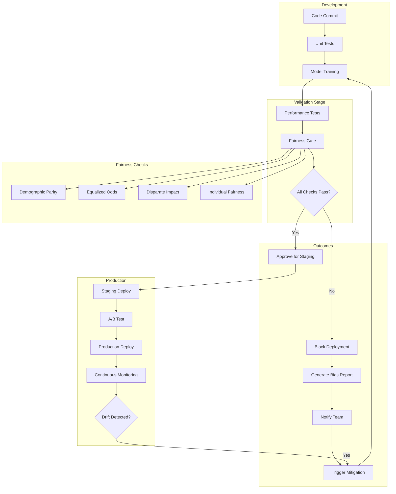

# How to Implement Model Fairness

Author: [nawazdhandala](https://github.com/nawazdhandala)

Tags: MLOps, Model Fairness, Responsible AI, Ethics

Description: Learn to implement model fairness for detecting and mitigating bias in ML models.

---

## Why Model Fairness Matters

Machine learning models increasingly influence critical decisions in hiring, lending, healthcare, and criminal justice. When these models inherit or amplify societal biases, the consequences can be severe: qualified candidates rejected due to demographic attributes, loan applications unfairly denied, or medical diagnoses skewed by historical data imbalances.

Model fairness is not just an ethical imperative but also a business necessity. Biased models expose organizations to legal liability, reputational damage, and loss of customer trust. The good news: practical tools and techniques exist to detect and mitigate bias throughout the ML lifecycle.

## Key Fairness Metrics

Before implementing fairness measures, you need to understand what fairness means in your context. Several mathematical definitions exist, and they often conflict with each other.

### Demographic Parity (Statistical Parity)

The model's positive prediction rate should be equal across all protected groups.

```
P(Y_hat = 1 | A = 0) = P(Y_hat = 1 | A = 1)
```

Where `A` represents the protected attribute (e.g., gender, race).

### Equalized Odds

The true positive rate and false positive rate should be equal across groups.

```
P(Y_hat = 1 | Y = 1, A = 0) = P(Y_hat = 1 | Y = 1, A = 1)  # Equal TPR
P(Y_hat = 1 | Y = 0, A = 0) = P(Y_hat = 1 | Y = 0, A = 1)  # Equal FPR
```

### Equal Opportunity

A relaxed version of equalized odds focusing only on true positive rate equality.

### Predictive Parity

The positive predictive value should be equal across groups.

```
P(Y = 1 | Y_hat = 1, A = 0) = P(Y = 1 | Y_hat = 1, A = 1)
```

## The Fairness Pipeline Architecture



## Setting Up Your Environment

Install the required libraries for fairness analysis:

```bash
# Install Fairlearn for fairness-aware ML
pip install fairlearn

# Install AIF360 (AI Fairness 360) from IBM
pip install aif360

# Additional dependencies
pip install pandas numpy scikit-learn matplotlib seaborn
```

## Detecting Bias with Fairlearn

Fairlearn provides tools for assessing and improving fairness. Let us start with a practical example using a credit scoring dataset.

```python
"""
Fairness Assessment with Fairlearn
This script demonstrates how to detect bias in a binary classification model
using demographic parity and equalized odds metrics.
"""

import pandas as pd
import numpy as np
from sklearn.model_selection import train_test_split
from sklearn.ensemble import GradientBoostingClassifier
from sklearn.preprocessing import StandardScaler
from fairlearn.metrics import (
    MetricFrame,
    demographic_parity_difference,
    demographic_parity_ratio,
    equalized_odds_difference,
    selection_rate,
    true_positive_rate,
    false_positive_rate
)

# Load and prepare your dataset
# In practice, replace this with your actual data loading code
def load_credit_data():
    """
    Load credit scoring dataset.
    Returns features (X), labels (y), and sensitive attribute (sensitive_features).
    """
    # Simulated credit data for demonstration
    np.random.seed(42)
    n_samples = 10000

    # Features: income, debt_ratio, credit_history_length, num_accounts
    X = pd.DataFrame({
        'income': np.random.lognormal(10, 1, n_samples),
        'debt_ratio': np.random.uniform(0, 1, n_samples),
        'credit_history_years': np.random.exponential(5, n_samples),
        'num_accounts': np.random.poisson(3, n_samples)
    })

    # Sensitive attribute: gender (0 = female, 1 = male)
    # Simulating historical bias where males had higher approval rates
    gender = np.random.binomial(1, 0.5, n_samples)

    # Generate labels with intentional historical bias
    # This simulates a dataset where past decisions were biased
    base_prob = 0.3 + 0.4 * (X['income'] / X['income'].max())
    bias_factor = 0.1 * gender  # Historical bias favoring males
    approval_prob = np.clip(base_prob + bias_factor, 0, 1)
    y = np.random.binomial(1, approval_prob)

    return X, y, gender

# Load the data
X, y, sensitive_features = load_credit_data()

# Split into train and test sets
X_train, X_test, y_train, y_test, sf_train, sf_test = train_test_split(
    X, y, sensitive_features,
    test_size=0.3,
    random_state=42,
    stratify=y  # Ensure balanced split
)

# Scale features for better model performance
scaler = StandardScaler()
X_train_scaled = scaler.fit_transform(X_train)
X_test_scaled = scaler.transform(X_test)

# Train a baseline model without fairness constraints
baseline_model = GradientBoostingClassifier(
    n_estimators=100,
    max_depth=5,
    random_state=42
)
baseline_model.fit(X_train_scaled, y_train)

# Generate predictions on test set
y_pred = baseline_model.predict(X_test_scaled)

# Create a MetricFrame to analyze fairness across groups
# MetricFrame computes metrics for each subgroup defined by sensitive_features
metric_frame = MetricFrame(
    metrics={
        'selection_rate': selection_rate,           # Rate of positive predictions
        'true_positive_rate': true_positive_rate,   # Recall for each group
        'false_positive_rate': false_positive_rate, # FPR for each group
        'accuracy': lambda y_true, y_pred: (y_true == y_pred).mean()
    },
    y_true=y_test,
    y_pred=y_pred,
    sensitive_features=sf_test
)

# Display per-group metrics
print("=" * 60)
print("FAIRNESS ASSESSMENT REPORT")
print("=" * 60)
print("\nMetrics by Group (0=Female, 1=Male):")
print(metric_frame.by_group.to_string())

# Calculate aggregate fairness metrics
print("\n" + "-" * 60)
print("Aggregate Fairness Metrics:")
print("-" * 60)

# Demographic Parity Difference: difference in selection rates
# A value of 0 indicates perfect demographic parity
dp_diff = demographic_parity_difference(
    y_test, y_pred,
    sensitive_features=sf_test
)
print(f"Demographic Parity Difference: {dp_diff:.4f}")
print("  (0 = perfect parity, larger values indicate more disparity)")

# Demographic Parity Ratio: ratio of selection rates
# A value of 1 indicates perfect demographic parity
dp_ratio = demographic_parity_ratio(
    y_test, y_pred,
    sensitive_features=sf_test
)
print(f"Demographic Parity Ratio: {dp_ratio:.4f}")
print("  (1 = perfect parity, values below 0.8 often indicate concern)")

# Equalized Odds Difference: max difference in TPR or FPR
eq_odds_diff = equalized_odds_difference(
    y_test, y_pred,
    sensitive_features=sf_test
)
print(f"Equalized Odds Difference: {eq_odds_diff:.4f}")
print("  (0 = perfect equalized odds)")

# Determine if bias exists based on common thresholds
print("\n" + "-" * 60)
print("Bias Assessment:")
print("-" * 60)

if abs(dp_diff) > 0.1:
    print("[WARNING] Significant demographic parity violation detected!")
    print("  The model's positive prediction rate differs by more than 10%")
    print("  across protected groups.")
else:
    print("[OK] Demographic parity within acceptable bounds.")

if dp_ratio < 0.8:
    print("[WARNING] Disparate impact detected!")
    print("  The 80% rule (Four-Fifths Rule) is violated.")
    print("  This may indicate illegal discrimination under some jurisdictions.")
else:
    print("[OK] Disparate impact ratio within legal guidelines.")
```

## Bias Detection Workflow



## Bias Mitigation with Fairlearn

Fairlearn offers several mitigation algorithms. The most commonly used are:

1. **Preprocessing**: Reweighting or resampling data
2. **In-processing**: Adding fairness constraints during training
3. **Post-processing**: Adjusting predictions after training

### Exponentiated Gradient Reduction

This in-processing technique trains the model subject to fairness constraints.

```python
"""
Bias Mitigation using Exponentiated Gradient Reduction
This algorithm finds a classifier that optimizes accuracy subject to
fairness constraints defined by demographic parity or equalized odds.
"""

from fairlearn.reductions import (
    ExponentiatedGradient,
    DemographicParity,
    EqualizedOdds,
    TruePositiveRateParity
)
from sklearn.linear_model import LogisticRegression

# Define the base estimator
# We use LogisticRegression as it works well with reduction algorithms
base_estimator = LogisticRegression(
    solver='lbfgs',
    max_iter=1000,
    random_state=42
)

# Define the fairness constraint
# DemographicParity: equal selection rates across groups
# EqualizedOdds: equal TPR and FPR across groups
# TruePositiveRateParity: equal opportunity (equal TPR only)

fairness_constraint = DemographicParity(difference_bound=0.01)

# Create the mitigated classifier using Exponentiated Gradient
# This algorithm iteratively adjusts sample weights to satisfy constraints
mitigated_model = ExponentiatedGradient(
    estimator=base_estimator,
    constraints=fairness_constraint,
    eps=0.01,  # Tolerance for constraint violation
    max_iter=50,  # Maximum number of iterations
    nu=1e-6  # Convergence threshold
)

# Train the mitigated model
# Note: sensitive_features must be passed during training
mitigated_model.fit(
    X_train_scaled,
    y_train,
    sensitive_features=sf_train
)

# Generate predictions from the mitigated model
y_pred_mitigated = mitigated_model.predict(X_test_scaled)

# Evaluate fairness improvement
print("=" * 60)
print("MITIGATION RESULTS")
print("=" * 60)

# Compare baseline vs mitigated model
print("\nBaseline Model Metrics:")
baseline_dp_diff = demographic_parity_difference(
    y_test, y_pred, sensitive_features=sf_test
)
baseline_accuracy = (y_pred == y_test).mean()
print(f"  Accuracy: {baseline_accuracy:.4f}")
print(f"  Demographic Parity Difference: {baseline_dp_diff:.4f}")

print("\nMitigated Model Metrics:")
mitigated_dp_diff = demographic_parity_difference(
    y_test, y_pred_mitigated, sensitive_features=sf_test
)
mitigated_accuracy = (y_pred_mitigated == y_test).mean()
print(f"  Accuracy: {mitigated_accuracy:.4f}")
print(f"  Demographic Parity Difference: {mitigated_dp_diff:.4f}")

# Calculate improvement
dp_improvement = abs(baseline_dp_diff) - abs(mitigated_dp_diff)
accuracy_change = mitigated_accuracy - baseline_accuracy

print("\n" + "-" * 60)
print("Improvement Summary:")
print("-" * 60)
print(f"  Fairness Improvement: {dp_improvement:.4f} (lower DP diff is better)")
print(f"  Accuracy Change: {accuracy_change:+.4f}")
print(f"  Fairness/Accuracy Trade-off: {dp_improvement / abs(accuracy_change + 1e-10):.2f}")
```

### Threshold Optimizer (Post-Processing)

When you cannot retrain the model, post-processing adjusts decision thresholds per group.

```python
"""
Post-Processing Bias Mitigation using Threshold Optimizer
This technique finds group-specific thresholds that optimize a fairness
metric while maintaining overall model quality.
"""

from fairlearn.postprocessing import ThresholdOptimizer

# Create the threshold optimizer
# It wraps an existing classifier and finds optimal thresholds per group
threshold_optimizer = ThresholdOptimizer(
    estimator=baseline_model,  # The trained model to adjust
    constraints="demographic_parity",  # or "equalized_odds"
    objective="accuracy_score",  # Optimize accuracy subject to constraints
    prefit=True,  # Model is already trained
    predict_method="predict_proba"  # Use probability predictions
)

# Fit the threshold optimizer on the test data
# This finds the optimal thresholds for each sensitive group
threshold_optimizer.fit(
    X_test_scaled,
    y_test,
    sensitive_features=sf_test
)

# Generate fair predictions using group-specific thresholds
y_pred_threshold = threshold_optimizer.predict(
    X_test_scaled,
    sensitive_features=sf_test
)

# Evaluate the post-processed predictions
print("\nPost-Processing (Threshold Optimizer) Results:")
threshold_dp_diff = demographic_parity_difference(
    y_test, y_pred_threshold, sensitive_features=sf_test
)
threshold_accuracy = (y_pred_threshold == y_test).mean()
print(f"  Accuracy: {threshold_accuracy:.4f}")
print(f"  Demographic Parity Difference: {threshold_dp_diff:.4f}")
```

## Using IBM AIF360 for Comprehensive Fairness Analysis

AIF360 provides a broader set of fairness metrics and mitigation algorithms.

```python
"""
Comprehensive Fairness Analysis with IBM AIF360
AIF360 offers additional metrics and algorithms not available in Fairlearn,
including individual fairness measures and causal-based approaches.
"""

from aif360.datasets import BinaryLabelDataset
from aif360.metrics import BinaryLabelDatasetMetric, ClassificationMetric
from aif360.algorithms.preprocessing import Reweighing, DisparateImpactRemover
from aif360.algorithms.inprocessing import PrejudiceRemover
from aif360.algorithms.postprocessing import CalibratedEqOddsPostprocessing
import pandas as pd
import numpy as np

def create_aif360_dataset(X, y, sensitive_attr,
                          favorable_label=1,
                          unfavorable_label=0,
                          privileged_group=1,
                          unprivileged_group=0):
    """
    Convert pandas DataFrames to AIF360 BinaryLabelDataset format.

    Args:
        X: Feature DataFrame
        y: Label array
        sensitive_attr: Array of sensitive attribute values
        favorable_label: The label indicating positive outcome
        unfavorable_label: The label indicating negative outcome
        privileged_group: Value of sensitive attribute for privileged group
        unprivileged_group: Value for unprivileged group

    Returns:
        BinaryLabelDataset object for use with AIF360
    """
    # Combine features, labels, and sensitive attributes into one DataFrame
    df = X.copy()
    df['label'] = y
    df['sensitive'] = sensitive_attr

    # Create the AIF360 dataset
    dataset = BinaryLabelDataset(
        df=df,
        label_names=['label'],
        protected_attribute_names=['sensitive'],
        favorable_label=favorable_label,
        unfavorable_label=unfavorable_label,
        privileged_protected_attributes=[[privileged_group]],
        unprivileged_protected_attributes=[[unprivileged_group]]
    )

    return dataset

# Create AIF360 datasets for training and testing
train_dataset = create_aif360_dataset(
    pd.DataFrame(X_train_scaled, columns=X.columns),
    y_train,
    sf_train
)

test_dataset = create_aif360_dataset(
    pd.DataFrame(X_test_scaled, columns=X.columns),
    y_test,
    sf_test
)

# Compute dataset-level bias metrics BEFORE training
dataset_metric = BinaryLabelDatasetMetric(
    train_dataset,
    privileged_groups=[{'sensitive': 1}],
    unprivileged_groups=[{'sensitive': 0}]
)

print("=" * 60)
print("AIF360 DATASET BIAS ANALYSIS")
print("=" * 60)
print("\nDataset-Level Metrics (Before Model Training):")
print(f"  Disparate Impact: {dataset_metric.disparate_impact():.4f}")
print(f"    (Ratio of positive outcomes between groups, 1.0 = parity)")
print(f"  Statistical Parity Difference: {dataset_metric.statistical_parity_difference():.4f}")
print(f"    (Difference in positive outcome rates, 0.0 = parity)")
print(f"  Consistency: {dataset_metric.consistency()[0]:.4f}")
print(f"    (Individual fairness measure, 1.0 = perfect consistency)")
```

### Reweighing: A Preprocessing Technique

```python
"""
Reweighing Algorithm for Preprocessing
This technique assigns weights to training examples to ensure fair
representation across protected groups.
"""

from aif360.algorithms.preprocessing import Reweighing

# Create the reweighing transformer
reweigher = Reweighing(
    privileged_groups=[{'sensitive': 1}],
    unprivileged_groups=[{'sensitive': 0}]
)

# Transform the training dataset to compute sample weights
reweighed_dataset = reweigher.fit_transform(train_dataset)

# Extract the computed weights
sample_weights = reweighed_dataset.instance_weights

print("\nReweighing Results:")
print(f"  Original dataset size: {len(train_dataset.instance_weights)}")
print(f"  Reweighted samples: {len(sample_weights)}")
print(f"  Weight range: [{sample_weights.min():.4f}, {sample_weights.max():.4f}]")
print(f"  Mean weight for privileged: {sample_weights[sf_train == 1].mean():.4f}")
print(f"  Mean weight for unprivileged: {sample_weights[sf_train == 0].mean():.4f}")

# Train a model using the computed weights
from sklearn.ensemble import GradientBoostingClassifier

weighted_model = GradientBoostingClassifier(
    n_estimators=100,
    max_depth=5,
    random_state=42
)

# Fit with sample weights to account for bias
weighted_model.fit(
    X_train_scaled,
    y_train,
    sample_weight=sample_weights
)

# Evaluate the reweighted model
y_pred_reweighted = weighted_model.predict(X_test_scaled)

print("\nReweighted Model Performance:")
reweighted_dp_diff = demographic_parity_difference(
    y_test, y_pred_reweighted, sensitive_features=sf_test
)
reweighted_accuracy = (y_pred_reweighted == y_test).mean()
print(f"  Accuracy: {reweighted_accuracy:.4f}")
print(f"  Demographic Parity Difference: {reweighted_dp_diff:.4f}")
```

## Mitigation Strategy Comparison



## Production Fairness Monitoring

Deploying a fair model is not enough. Fairness must be monitored continuously in production as data distributions shift.

```python
"""
Production Fairness Monitoring System
This module provides real-time fairness monitoring for deployed ML models.
"""

import json
import time
from datetime import datetime
from typing import Dict, List, Optional
from dataclasses import dataclass, asdict
import numpy as np

@dataclass
class FairnessMetricSnapshot:
    """
    Stores a snapshot of fairness metrics at a point in time.
    Used for time-series tracking and alerting.
    """
    timestamp: str
    model_id: str
    demographic_parity_diff: float
    equalized_odds_diff: float
    selection_rate_privileged: float
    selection_rate_unprivileged: float
    sample_count: int
    alert_triggered: bool

class FairnessMonitor:
    """
    Real-time fairness monitoring for production ML models.

    This class collects predictions, computes rolling fairness metrics,
    and triggers alerts when thresholds are violated.
    """

    def __init__(
        self,
        model_id: str,
        dp_threshold: float = 0.1,
        eq_odds_threshold: float = 0.1,
        window_size: int = 1000,
        alert_callback: Optional[callable] = None
    ):
        """
        Initialize the fairness monitor.

        Args:
            model_id: Unique identifier for the monitored model
            dp_threshold: Maximum allowed demographic parity difference
            eq_odds_threshold: Maximum allowed equalized odds difference
            window_size: Number of predictions to consider in rolling window
            alert_callback: Function to call when alert is triggered
        """
        self.model_id = model_id
        self.dp_threshold = dp_threshold
        self.eq_odds_threshold = eq_odds_threshold
        self.window_size = window_size
        self.alert_callback = alert_callback

        # Rolling buffers for predictions
        self.predictions: List[int] = []
        self.actuals: List[int] = []
        self.sensitive_attrs: List[int] = []

        # Historical metrics for trend analysis
        self.metric_history: List[FairnessMetricSnapshot] = []

    def log_prediction(
        self,
        prediction: int,
        actual: Optional[int],
        sensitive_attr: int
    ):
        """
        Log a single prediction for fairness tracking.

        Args:
            prediction: The model's predicted label (0 or 1)
            actual: The true label if available (for delayed feedback)
            sensitive_attr: The sensitive attribute value (0 or 1)
        """
        self.predictions.append(prediction)
        self.actuals.append(actual if actual is not None else -1)
        self.sensitive_attrs.append(sensitive_attr)

        # Maintain rolling window
        if len(self.predictions) > self.window_size:
            self.predictions.pop(0)
            self.actuals.pop(0)
            self.sensitive_attrs.pop(0)

    def compute_current_metrics(self) -> Dict[str, float]:
        """
        Compute fairness metrics for the current rolling window.

        Returns:
            Dictionary containing current fairness metrics
        """
        if len(self.predictions) < 100:
            # Not enough data for reliable metrics
            return {
                'demographic_parity_diff': None,
                'equalized_odds_diff': None,
                'sample_count': len(self.predictions)
            }

        preds = np.array(self.predictions)
        actuals = np.array(self.actuals)
        sensitive = np.array(self.sensitive_attrs)

        # Compute selection rates by group
        privileged_mask = sensitive == 1
        unprivileged_mask = sensitive == 0

        sr_privileged = preds[privileged_mask].mean()
        sr_unprivileged = preds[unprivileged_mask].mean()

        dp_diff = sr_privileged - sr_unprivileged

        # Compute equalized odds if actuals are available
        eq_odds_diff = None
        valid_actuals = actuals != -1

        if valid_actuals.sum() >= 100:
            # True positive rates by group
            pos_privileged = (actuals == 1) & privileged_mask & valid_actuals
            pos_unprivileged = (actuals == 1) & unprivileged_mask & valid_actuals

            if pos_privileged.sum() > 0 and pos_unprivileged.sum() > 0:
                tpr_privileged = preds[pos_privileged].mean()
                tpr_unprivileged = preds[pos_unprivileged].mean()

                # False positive rates by group
                neg_privileged = (actuals == 0) & privileged_mask & valid_actuals
                neg_unprivileged = (actuals == 0) & unprivileged_mask & valid_actuals

                fpr_privileged = preds[neg_privileged].mean() if neg_privileged.sum() > 0 else 0
                fpr_unprivileged = preds[neg_unprivileged].mean() if neg_unprivileged.sum() > 0 else 0

                eq_odds_diff = max(
                    abs(tpr_privileged - tpr_unprivileged),
                    abs(fpr_privileged - fpr_unprivileged)
                )

        return {
            'demographic_parity_diff': dp_diff,
            'equalized_odds_diff': eq_odds_diff,
            'selection_rate_privileged': sr_privileged,
            'selection_rate_unprivileged': sr_unprivileged,
            'sample_count': len(self.predictions)
        }

    def check_and_alert(self) -> FairnessMetricSnapshot:
        """
        Check current metrics against thresholds and trigger alerts if needed.

        Returns:
            FairnessMetricSnapshot with current state and alert status
        """
        metrics = self.compute_current_metrics()

        alert_triggered = False

        # Check demographic parity threshold
        if metrics['demographic_parity_diff'] is not None:
            if abs(metrics['demographic_parity_diff']) > self.dp_threshold:
                alert_triggered = True

        # Check equalized odds threshold
        if metrics['equalized_odds_diff'] is not None:
            if metrics['equalized_odds_diff'] > self.eq_odds_threshold:
                alert_triggered = True

        # Create snapshot
        snapshot = FairnessMetricSnapshot(
            timestamp=datetime.utcnow().isoformat(),
            model_id=self.model_id,
            demographic_parity_diff=metrics['demographic_parity_diff'] or 0.0,
            equalized_odds_diff=metrics['equalized_odds_diff'] or 0.0,
            selection_rate_privileged=metrics.get('selection_rate_privileged', 0.0),
            selection_rate_unprivileged=metrics.get('selection_rate_unprivileged', 0.0),
            sample_count=metrics['sample_count'],
            alert_triggered=alert_triggered
        )

        # Store in history
        self.metric_history.append(snapshot)

        # Trigger alert callback if needed
        if alert_triggered and self.alert_callback:
            self.alert_callback(snapshot)

        return snapshot

    def get_metrics_json(self) -> str:
        """
        Export current metrics as JSON for logging or dashboards.
        """
        metrics = self.compute_current_metrics()
        return json.dumps({
            'model_id': self.model_id,
            'timestamp': datetime.utcnow().isoformat(),
            'metrics': metrics,
            'thresholds': {
                'demographic_parity': self.dp_threshold,
                'equalized_odds': self.eq_odds_threshold
            }
        }, indent=2)


# Example usage of the monitoring system
def alert_handler(snapshot: FairnessMetricSnapshot):
    """
    Handler function called when fairness thresholds are violated.
    In production, this would integrate with alerting systems.
    """
    print(f"\n[ALERT] Fairness threshold violated at {snapshot.timestamp}")
    print(f"  Model: {snapshot.model_id}")
    print(f"  Demographic Parity Diff: {snapshot.demographic_parity_diff:.4f}")
    print(f"  Sample Count: {snapshot.sample_count}")
    # In production: send to PagerDuty, Slack, or OneUptime

# Initialize the monitor
monitor = FairnessMonitor(
    model_id="credit_scoring_v2",
    dp_threshold=0.10,
    eq_odds_threshold=0.10,
    window_size=1000,
    alert_callback=alert_handler
)

# Simulate production predictions
print("\nSimulating production predictions...")
for i in range(500):
    # Simulate incoming prediction requests
    sensitive = np.random.binomial(1, 0.5)
    # Simulate biased predictions (for demonstration)
    pred = np.random.binomial(1, 0.6 if sensitive == 1 else 0.45)
    actual = np.random.binomial(1, 0.5)  # Delayed feedback

    monitor.log_prediction(pred, actual, sensitive)

# Check metrics
snapshot = monitor.check_and_alert()
print("\nCurrent Fairness Metrics:")
print(monitor.get_metrics_json())
```

## Fairness Monitoring Dashboard Architecture



## Integrating Fairness into CI/CD Pipelines

Fairness checks should be part of your automated testing and deployment pipeline.

```python
"""
CI/CD Fairness Gate
This script runs as part of the ML pipeline to block deployments
that fail fairness requirements.
"""

import sys
import json
from typing import Dict, Tuple

class FairnessGate:
    """
    A CI/CD gate that evaluates model fairness before deployment.

    Usage in pipeline:
        python fairness_gate.py --model-path ./model --test-data ./test.csv
    """

    def __init__(
        self,
        dp_max: float = 0.10,
        eq_odds_max: float = 0.10,
        min_accuracy: float = 0.70,
        min_samples_per_group: int = 100
    ):
        """
        Initialize the fairness gate with acceptance criteria.

        Args:
            dp_max: Maximum allowed demographic parity difference
            eq_odds_max: Maximum allowed equalized odds difference
            min_accuracy: Minimum required model accuracy
            min_samples_per_group: Minimum test samples per protected group
        """
        self.dp_max = dp_max
        self.eq_odds_max = eq_odds_max
        self.min_accuracy = min_accuracy
        self.min_samples_per_group = min_samples_per_group

    def evaluate(
        self,
        y_true,
        y_pred,
        sensitive_features,
        model_metadata: Dict
    ) -> Tuple[bool, Dict]:
        """
        Evaluate a model against fairness criteria.

        Args:
            y_true: Ground truth labels
            y_pred: Model predictions
            sensitive_features: Protected attribute values
            model_metadata: Additional model information

        Returns:
            Tuple of (passed: bool, report: dict)
        """
        from fairlearn.metrics import (
            demographic_parity_difference,
            equalized_odds_difference
        )
        import numpy as np

        # Check sample sizes
        unique_groups = np.unique(sensitive_features)
        group_sizes = {
            g: (sensitive_features == g).sum()
            for g in unique_groups
        }

        min_group_size = min(group_sizes.values())
        if min_group_size < self.min_samples_per_group:
            return False, {
                'status': 'FAILED',
                'reason': f'Insufficient samples: {min_group_size} < {self.min_samples_per_group}',
                'group_sizes': group_sizes
            }

        # Compute metrics
        accuracy = (y_true == y_pred).mean()
        dp_diff = demographic_parity_difference(
            y_true, y_pred, sensitive_features=sensitive_features
        )
        eq_odds_diff = equalized_odds_difference(
            y_true, y_pred, sensitive_features=sensitive_features
        )

        # Build report
        report = {
            'model_id': model_metadata.get('model_id', 'unknown'),
            'model_version': model_metadata.get('version', 'unknown'),
            'metrics': {
                'accuracy': float(accuracy),
                'demographic_parity_difference': float(dp_diff),
                'equalized_odds_difference': float(eq_odds_diff)
            },
            'thresholds': {
                'min_accuracy': self.min_accuracy,
                'max_dp_difference': self.dp_max,
                'max_eq_odds_difference': self.eq_odds_max
            },
            'group_sizes': {str(k): int(v) for k, v in group_sizes.items()},
            'checks': []
        }

        # Run checks
        all_passed = True

        # Check 1: Accuracy
        if accuracy >= self.min_accuracy:
            report['checks'].append({
                'name': 'accuracy',
                'status': 'PASSED',
                'value': accuracy,
                'threshold': self.min_accuracy
            })
        else:
            report['checks'].append({
                'name': 'accuracy',
                'status': 'FAILED',
                'value': accuracy,
                'threshold': self.min_accuracy
            })
            all_passed = False

        # Check 2: Demographic Parity
        if abs(dp_diff) <= self.dp_max:
            report['checks'].append({
                'name': 'demographic_parity',
                'status': 'PASSED',
                'value': dp_diff,
                'threshold': self.dp_max
            })
        else:
            report['checks'].append({
                'name': 'demographic_parity',
                'status': 'FAILED',
                'value': dp_diff,
                'threshold': self.dp_max
            })
            all_passed = False

        # Check 3: Equalized Odds
        if eq_odds_diff <= self.eq_odds_max:
            report['checks'].append({
                'name': 'equalized_odds',
                'status': 'PASSED',
                'value': eq_odds_diff,
                'threshold': self.eq_odds_max
            })
        else:
            report['checks'].append({
                'name': 'equalized_odds',
                'status': 'FAILED',
                'value': eq_odds_diff,
                'threshold': self.eq_odds_max
            })
            all_passed = False

        report['status'] = 'PASSED' if all_passed else 'FAILED'

        return all_passed, report


def main():
    """
    Main entry point for CI/CD fairness evaluation.
    Returns exit code 0 if passed, 1 if failed.
    """
    # In practice, load model and test data from arguments
    # This is a demonstration with simulated data
    import numpy as np

    np.random.seed(42)
    n_test = 2000

    y_true = np.random.binomial(1, 0.5, n_test)
    sensitive = np.random.binomial(1, 0.5, n_test)

    # Simulate predictions with some bias
    y_pred = np.where(
        sensitive == 1,
        np.random.binomial(1, 0.65, n_test),
        np.random.binomial(1, 0.55, n_test)
    )

    # Run the fairness gate
    gate = FairnessGate(
        dp_max=0.10,
        eq_odds_max=0.10,
        min_accuracy=0.50
    )

    passed, report = gate.evaluate(
        y_true=y_true,
        y_pred=y_pred,
        sensitive_features=sensitive,
        model_metadata={
            'model_id': 'credit_model',
            'version': '2.1.0'
        }
    )

    # Output report
    print("=" * 60)
    print("FAIRNESS GATE EVALUATION REPORT")
    print("=" * 60)
    print(json.dumps(report, indent=2))

    if passed:
        print("\n[SUCCESS] Model passed all fairness checks. Proceeding with deployment.")
        return 0
    else:
        print("\n[FAILURE] Model failed fairness checks. Deployment blocked.")
        print("Please review and mitigate bias before resubmitting.")
        return 1


if __name__ == "__main__":
    sys.exit(main())
```

## CI/CD Pipeline with Fairness Gates



## Best Practices for Model Fairness

### 1. Start with Data Auditing

Before training, audit your data for historical biases:

- Check label distributions across protected groups
- Identify proxy variables that correlate with sensitive attributes
- Document data collection processes and potential sources of bias

### 2. Choose Appropriate Fairness Metrics

Different applications require different fairness definitions:

- **Lending/Credit**: Equalized odds or predictive parity
- **Hiring**: Demographic parity (equal selection rates)
- **Healthcare**: Equal opportunity (equal TPR for positive outcomes)
- **Criminal Justice**: Calibration (equal PPV across groups)

### 3. Document Fairness Trade-offs

No model can satisfy all fairness metrics simultaneously (impossibility theorems). Document which metrics you prioritize and why.

### 4. Implement Continuous Monitoring

Fairness can degrade over time due to data drift, concept drift, or feedback loops. Monitor fairness metrics in production alongside accuracy.

### 5. Establish Clear Ownership

Assign responsibility for fairness to specific team members or roles. Create runbooks for responding to fairness alerts.

## Summary

Implementing model fairness is an ongoing process that spans the entire ML lifecycle:

1. **Data Stage**: Audit datasets for historical bias
2. **Training Stage**: Apply mitigation techniques (reweighing, constraints)
3. **Evaluation Stage**: Measure multiple fairness metrics
4. **Deployment Stage**: Gate releases on fairness criteria
5. **Production Stage**: Monitor fairness continuously and alert on drift

The tools covered in this guide (Fairlearn, AIF360) provide practical implementations for each stage. Remember that fairness is not a checkbox but a continuous commitment to ethical AI development.

## Further Reading

- Fairlearn Documentation: https://fairlearn.org/
- AI Fairness 360 Documentation: https://aif360.mybluemix.net/
- "Fairness and Machine Learning" by Barocas, Hardt, and Narayanan
- Google's Responsible AI Practices: https://ai.google/responsibilities/responsible-ai-practices/
