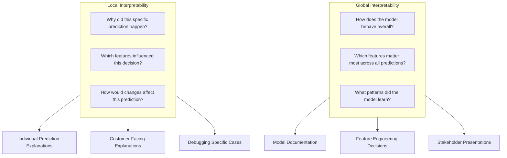
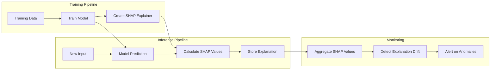
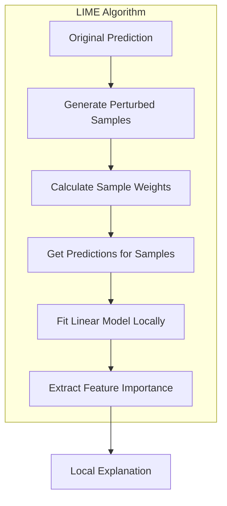
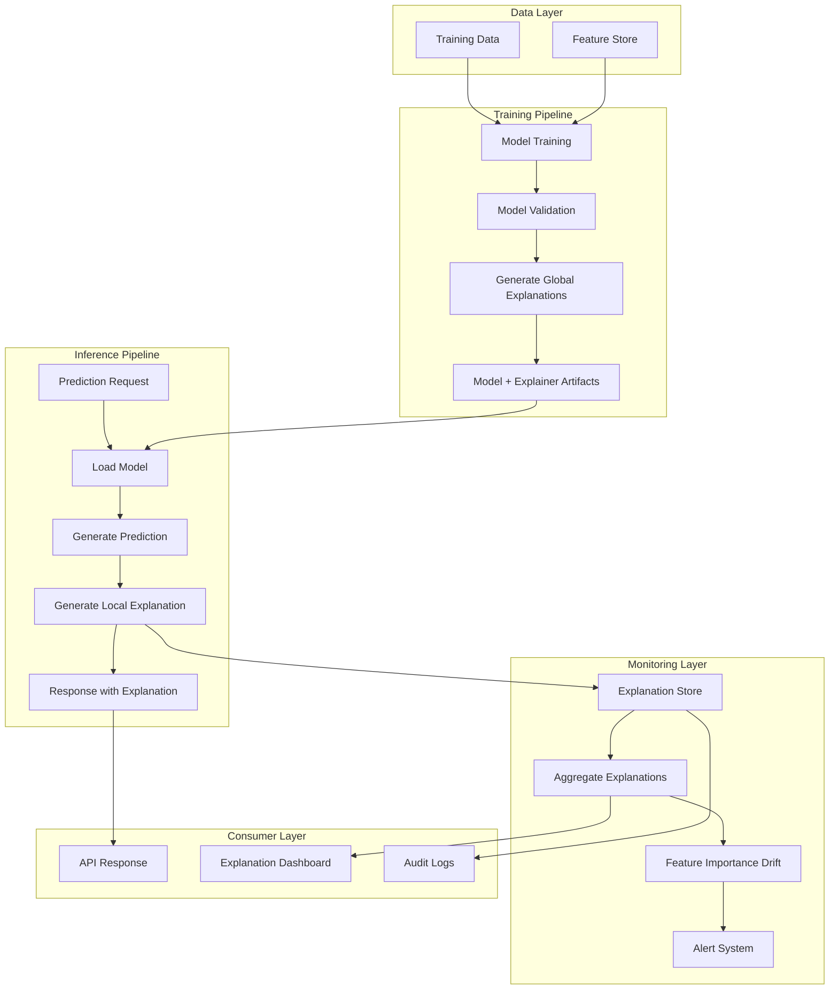

# How to Build Model Interpretability

Author: [nawazdhandala](https://github.com/nawazdhandala)

Tags: MLOps, Model Interpretability, XAI, Machine Learning

Description: Learn to build model interpretability for understanding how ML models make predictions.

---

> Machine learning models can achieve impressive accuracy, but without interpretability, they remain black boxes. **Model interpretability bridges the gap between predictions and understanding**, enabling teams to debug models, build trust with stakeholders, and meet regulatory requirements.

In production ML systems, interpretability is not a luxury. It is a requirement. When a model denies a loan application or flags a transaction as fraudulent, stakeholders need to understand *why*. This guide provides practical techniques, code examples, and architectural patterns for building interpretable ML systems in your MLOps pipeline.

---

## 1. Why Model Interpretability Matters in MLOps

Model interpretability serves multiple critical functions in production ML systems:

| Stakeholder | Need | Interpretability Solution |
|-------------|------|---------------------------|
| Data Scientists | Debug model behavior, identify feature issues | Feature importance, SHAP values |
| ML Engineers | Monitor model drift, validate predictions | Local explanations, prediction logging |
| Business Users | Understand decisions, build trust | Natural language explanations |
| Compliance Teams | Audit trail, regulatory requirements | Global explanations, documentation |
| End Users | Transparency, actionable feedback | Feature contributions per prediction |

**Key Benefits:**
- **Debugging**: Identify when models rely on spurious correlations
- **Trust**: Stakeholders can verify model reasoning aligns with domain knowledge
- **Compliance**: Meet GDPR "right to explanation" and similar regulations
- **Monitoring**: Detect drift by tracking explanation patterns over time

---

## 2. Local vs Global Interpretability

Understanding the difference between local and global interpretability is fundamental to choosing the right approach for your use case.



### Global Interpretability
Global interpretability answers: "How does the model behave across the entire dataset?" It provides insights into overall feature importance, learned patterns, and model behavior trends.

**Use Cases:**
- Understanding which features drive model predictions overall
- Validating that the model learned meaningful patterns
- Documenting model behavior for audits
- Comparing different model versions

### Local Interpretability
Local interpretability answers: "Why did the model make this specific prediction?" It explains individual predictions by showing feature contributions.

**Use Cases:**
- Explaining individual decisions to customers
- Debugging unexpected predictions
- Providing actionable feedback (e.g., "Increase income by $5,000 to improve approval odds")
- Real-time prediction explanations in production

---

## 3. Feature Importance Techniques

Feature importance quantifies how much each feature contributes to model predictions. Different techniques offer varying trade-offs between accuracy, speed, and model compatibility.

### 3.1 Permutation Importance

Permutation importance measures how much model performance degrades when a feature's values are randomly shuffled. It is model-agnostic and works with any estimator.

```python
# permutation_importance.py
# Demonstrates permutation importance for model-agnostic feature analysis

import numpy as np
import pandas as pd
from sklearn.ensemble import RandomForestClassifier
from sklearn.inspection import permutation_importance
from sklearn.model_selection import train_test_split
from sklearn.datasets import make_classification
import matplotlib.pyplot as plt

def calculate_permutation_importance(
    model,
    X_test: pd.DataFrame,
    y_test: np.ndarray,
    n_repeats: int = 10,
    random_state: int = 42
) -> pd.DataFrame:
    """
    Calculate permutation importance for a trained model.

    Args:
        model: Trained sklearn-compatible model
        X_test: Test features DataFrame
        y_test: Test labels
        n_repeats: Number of times to permute each feature
        random_state: Random seed for reproducibility

    Returns:
        DataFrame with feature importances sorted by mean importance
    """
    # Calculate permutation importance
    # This shuffles each feature and measures the drop in model performance
    result = permutation_importance(
        model,
        X_test,
        y_test,
        n_repeats=n_repeats,
        random_state=random_state,
        n_jobs=-1  # Use all available cores for faster computation
    )

    # Create a DataFrame with importance statistics
    importance_df = pd.DataFrame({
        'feature': X_test.columns,
        'importance_mean': result.importances_mean,
        'importance_std': result.importances_std
    })

    # Sort by mean importance descending
    importance_df = importance_df.sort_values(
        'importance_mean',
        ascending=False
    ).reset_index(drop=True)

    return importance_df


def plot_permutation_importance(
    importance_df: pd.DataFrame,
    top_n: int = 15,
    figsize: tuple = (10, 8)
) -> plt.Figure:
    """
    Create a horizontal bar plot of permutation importance.

    Args:
        importance_df: DataFrame from calculate_permutation_importance
        top_n: Number of top features to display
        figsize: Figure size tuple

    Returns:
        Matplotlib figure object
    """
    # Select top N features
    plot_df = importance_df.head(top_n)

    fig, ax = plt.subplots(figsize=figsize)

    # Create horizontal bar chart with error bars
    y_pos = np.arange(len(plot_df))
    ax.barh(
        y_pos,
        plot_df['importance_mean'],
        xerr=plot_df['importance_std'],
        align='center',
        color='steelblue',
        edgecolor='black',
        capsize=3
    )

    ax.set_yticks(y_pos)
    ax.set_yticklabels(plot_df['feature'])
    ax.invert_yaxis()  # Top feature at top of chart
    ax.set_xlabel('Mean Importance (Decrease in Accuracy)')
    ax.set_title('Permutation Feature Importance')
    ax.grid(axis='x', alpha=0.3)

    plt.tight_layout()
    return fig


# Example usage
if __name__ == "__main__":
    # Generate synthetic classification data
    X, y = make_classification(
        n_samples=1000,
        n_features=20,
        n_informative=10,
        n_redundant=5,
        random_state=42
    )

    # Create feature names
    feature_names = [f'feature_{i}' for i in range(20)]
    X = pd.DataFrame(X, columns=feature_names)

    # Split data
    X_train, X_test, y_train, y_test = train_test_split(
        X, y, test_size=0.2, random_state=42
    )

    # Train model
    model = RandomForestClassifier(n_estimators=100, random_state=42)
    model.fit(X_train, y_train)

    # Calculate importance
    importance_df = calculate_permutation_importance(model, X_test, y_test)
    print("Top 10 Features by Permutation Importance:")
    print(importance_df.head(10).to_string(index=False))

    # Plot results
    fig = plot_permutation_importance(importance_df)
    plt.savefig('permutation_importance.png', dpi=150, bbox_inches='tight')
```

### 3.2 Tree-Based Feature Importance

For tree-based models like Random Forest and Gradient Boosting, built-in feature importance based on impurity reduction provides fast insights.

```python
# tree_feature_importance.py
# Extract and compare feature importance from tree-based models

import numpy as np
import pandas as pd
from sklearn.ensemble import (
    RandomForestClassifier,
    GradientBoostingClassifier,
    ExtraTreesClassifier
)
from sklearn.model_selection import train_test_split
import matplotlib.pyplot as plt


def get_tree_feature_importance(
    model,
    feature_names: list
) -> pd.DataFrame:
    """
    Extract feature importance from a trained tree-based model.

    Tree-based models compute importance based on how much each feature
    decreases impurity (Gini or entropy) across all trees.

    Args:
        model: Trained tree-based sklearn model
        feature_names: List of feature names

    Returns:
        DataFrame with features sorted by importance
    """
    importance_df = pd.DataFrame({
        'feature': feature_names,
        'importance': model.feature_importances_
    })

    return importance_df.sort_values(
        'importance',
        ascending=False
    ).reset_index(drop=True)


def compare_model_importances(
    X_train: pd.DataFrame,
    y_train: np.ndarray,
    random_state: int = 42
) -> pd.DataFrame:
    """
    Compare feature importance across multiple tree-based models.

    Different tree algorithms may assign different importance to features.
    Comparing them helps identify robust, consistently important features.

    Args:
        X_train: Training features DataFrame
        y_train: Training labels
        random_state: Random seed

    Returns:
        DataFrame with importance from each model type
    """
    # Initialize models
    models = {
        'RandomForest': RandomForestClassifier(
            n_estimators=100,
            random_state=random_state
        ),
        'GradientBoosting': GradientBoostingClassifier(
            n_estimators=100,
            random_state=random_state
        ),
        'ExtraTrees': ExtraTreesClassifier(
            n_estimators=100,
            random_state=random_state
        )
    }

    # Train models and collect importances
    importance_data = {'feature': X_train.columns.tolist()}

    for name, model in models.items():
        print(f"Training {name}...")
        model.fit(X_train, y_train)
        importance_data[name] = model.feature_importances_

    # Create comparison DataFrame
    comparison_df = pd.DataFrame(importance_data)

    # Calculate average importance across models
    model_cols = list(models.keys())
    comparison_df['avg_importance'] = comparison_df[model_cols].mean(axis=1)
    comparison_df['importance_std'] = comparison_df[model_cols].std(axis=1)

    # Sort by average importance
    comparison_df = comparison_df.sort_values(
        'avg_importance',
        ascending=False
    ).reset_index(drop=True)

    return comparison_df


def plot_importance_comparison(
    comparison_df: pd.DataFrame,
    top_n: int = 10,
    figsize: tuple = (12, 8)
) -> plt.Figure:
    """
    Create a grouped bar chart comparing feature importance across models.

    Args:
        comparison_df: DataFrame from compare_model_importances
        top_n: Number of top features to display
        figsize: Figure size tuple

    Returns:
        Matplotlib figure object
    """
    plot_df = comparison_df.head(top_n)

    fig, ax = plt.subplots(figsize=figsize)

    x = np.arange(len(plot_df))
    width = 0.25

    # Plot bars for each model
    models = ['RandomForest', 'GradientBoosting', 'ExtraTrees']
    colors = ['steelblue', 'darkorange', 'forestgreen']

    for i, (model, color) in enumerate(zip(models, colors)):
        offset = (i - 1) * width
        ax.bar(
            x + offset,
            plot_df[model],
            width,
            label=model,
            color=color,
            edgecolor='black'
        )

    ax.set_xlabel('Feature')
    ax.set_ylabel('Importance')
    ax.set_title('Feature Importance Comparison Across Tree Models')
    ax.set_xticks(x)
    ax.set_xticklabels(plot_df['feature'], rotation=45, ha='right')
    ax.legend()
    ax.grid(axis='y', alpha=0.3)

    plt.tight_layout()
    return fig
```

---

## 4. SHAP (SHapley Additive exPlanations)

SHAP provides a unified approach to feature importance based on game theory. It offers both local explanations (per prediction) and global insights (across all predictions).

### SHAP Architecture in MLOps



### 4.1 SHAP Implementation

```python
# shap_interpretability.py
# Comprehensive SHAP analysis for model interpretability

import numpy as np
import pandas as pd
import shap
from sklearn.ensemble import RandomForestClassifier, GradientBoostingClassifier
from sklearn.model_selection import train_test_split
import matplotlib.pyplot as plt
from typing import Tuple, Optional, Dict, Any
import warnings
warnings.filterwarnings('ignore')


class SHAPExplainer:
    """
    A wrapper class for SHAP-based model interpretability.

    This class provides methods for both local (individual prediction)
    and global (overall model) explanations using SHAP values.
    """

    def __init__(
        self,
        model,
        X_background: pd.DataFrame,
        model_type: str = 'tree'
    ):
        """
        Initialize the SHAP explainer.

        Args:
            model: Trained sklearn-compatible model
            X_background: Background dataset for SHAP calculations
                          (typically a sample of training data)
            model_type: Type of model - 'tree', 'linear', or 'kernel'
        """
        self.model = model
        self.X_background = X_background
        self.model_type = model_type
        self.explainer = self._create_explainer()
        self.shap_values = None

    def _create_explainer(self) -> shap.Explainer:
        """
        Create the appropriate SHAP explainer based on model type.

        Different model types benefit from specialized explainers:
        - TreeExplainer: Fast, exact for tree-based models
        - LinearExplainer: Exact for linear models
        - KernelExplainer: Model-agnostic but slower
        """
        if self.model_type == 'tree':
            # TreeExplainer is optimized for tree-based models
            # It computes exact SHAP values efficiently
            return shap.TreeExplainer(self.model)
        elif self.model_type == 'linear':
            # LinearExplainer works with linear models
            return shap.LinearExplainer(
                self.model,
                self.X_background
            )
        else:
            # KernelExplainer works with any model
            # Use a sample of background data for efficiency
            background_sample = shap.sample(self.X_background, 100)
            return shap.KernelExplainer(
                self.model.predict_proba,
                background_sample
            )

    def calculate_shap_values(
        self,
        X: pd.DataFrame,
        check_additivity: bool = True
    ) -> np.ndarray:
        """
        Calculate SHAP values for a dataset.

        SHAP values represent the contribution of each feature
        to the difference between the actual prediction and
        the average prediction (base value).

        Args:
            X: Features DataFrame to explain
            check_additivity: Verify SHAP values sum correctly

        Returns:
            Array of SHAP values with shape (n_samples, n_features)
            For binary classification, returns values for positive class
        """
        self.shap_values = self.explainer.shap_values(X)

        # For binary classification, shap_values is a list [class_0, class_1]
        # We typically want class 1 (positive class) explanations
        if isinstance(self.shap_values, list):
            self.shap_values = self.shap_values[1]

        return self.shap_values

    def explain_prediction(
        self,
        X_instance: pd.DataFrame,
        top_n: int = 10
    ) -> Dict[str, Any]:
        """
        Generate a local explanation for a single prediction.

        This provides the feature contributions for one specific
        prediction, showing which features pushed the prediction
        higher or lower than the baseline.

        Args:
            X_instance: Single row DataFrame to explain
            top_n: Number of top contributing features to return

        Returns:
            Dictionary with prediction details and feature contributions
        """
        # Ensure we have a single instance
        if len(X_instance) != 1:
            raise ValueError("X_instance must contain exactly one row")

        # Get prediction and probability
        prediction = self.model.predict(X_instance)[0]

        # Handle models with and without predict_proba
        if hasattr(self.model, 'predict_proba'):
            probability = self.model.predict_proba(X_instance)[0]
        else:
            probability = None

        # Calculate SHAP values for this instance
        shap_values = self.explainer.shap_values(X_instance)

        # Extract values for positive class if binary classification
        if isinstance(shap_values, list):
            shap_values = shap_values[1]

        shap_values = shap_values.flatten()

        # Get base value (expected value)
        if isinstance(self.explainer.expected_value, np.ndarray):
            base_value = self.explainer.expected_value[1]
        else:
            base_value = self.explainer.expected_value

        # Create feature contribution DataFrame
        contributions = pd.DataFrame({
            'feature': X_instance.columns,
            'value': X_instance.values.flatten(),
            'shap_value': shap_values,
            'abs_shap': np.abs(shap_values)
        })

        # Sort by absolute SHAP value
        contributions = contributions.sort_values(
            'abs_shap',
            ascending=False
        ).head(top_n)

        return {
            'prediction': int(prediction),
            'probability': probability.tolist() if probability is not None else None,
            'base_value': float(base_value),
            'top_contributions': contributions.to_dict('records'),
            'shap_sum': float(np.sum(shap_values)),
            'explanation_text': self._generate_explanation_text(
                contributions,
                prediction
            )
        }

    def _generate_explanation_text(
        self,
        contributions: pd.DataFrame,
        prediction: int
    ) -> str:
        """
        Generate a human-readable explanation of the prediction.

        Args:
            contributions: DataFrame with feature contributions
            prediction: The model's prediction

        Returns:
            Natural language explanation string
        """
        # Get top positive and negative contributors
        positive = contributions[contributions['shap_value'] > 0].head(3)
        negative = contributions[contributions['shap_value'] < 0].head(3)

        explanation_parts = [f"Prediction: {prediction}"]

        if len(positive) > 0:
            pos_features = ", ".join([
                f"{row['feature']}={row['value']:.2f}"
                for _, row in positive.iterrows()
            ])
            explanation_parts.append(
                f"Features increasing prediction: {pos_features}"
            )

        if len(negative) > 0:
            neg_features = ", ".join([
                f"{row['feature']}={row['value']:.2f}"
                for _, row in negative.iterrows()
            ])
            explanation_parts.append(
                f"Features decreasing prediction: {neg_features}"
            )

        return ". ".join(explanation_parts)

    def global_feature_importance(self) -> pd.DataFrame:
        """
        Calculate global feature importance using mean absolute SHAP values.

        Global importance is computed by averaging the absolute SHAP values
        across all samples. Features with higher mean absolute SHAP values
        have more impact on predictions overall.

        Returns:
            DataFrame with features sorted by global importance
        """
        if self.shap_values is None:
            raise ValueError(
                "Call calculate_shap_values first to compute global importance"
            )

        # Mean absolute SHAP value per feature
        mean_abs_shap = np.mean(np.abs(self.shap_values), axis=0)

        importance_df = pd.DataFrame({
            'feature': self.X_background.columns,
            'mean_abs_shap': mean_abs_shap
        })

        return importance_df.sort_values(
            'mean_abs_shap',
            ascending=False
        ).reset_index(drop=True)

    def plot_summary(
        self,
        X: pd.DataFrame,
        max_display: int = 15,
        plot_type: str = 'dot'
    ) -> None:
        """
        Create a SHAP summary plot showing global feature importance
        and the distribution of feature effects.

        Args:
            X: Features DataFrame used to calculate SHAP values
            max_display: Maximum number of features to display
            plot_type: 'dot' for beeswarm, 'bar' for bar chart
        """
        if self.shap_values is None:
            self.calculate_shap_values(X)

        plt.figure(figsize=(10, 8))
        shap.summary_plot(
            self.shap_values,
            X,
            max_display=max_display,
            plot_type=plot_type,
            show=False
        )
        plt.tight_layout()

    def plot_force(
        self,
        X_instance: pd.DataFrame,
        matplotlib: bool = True
    ):
        """
        Create a force plot showing how features push the prediction.

        Force plots visualize how each feature contributes to pushing
        the prediction from the base value to the final output.

        Args:
            X_instance: Single row DataFrame to explain
            matplotlib: If True, return matplotlib figure; else HTML
        """
        shap_values = self.explainer.shap_values(X_instance)

        if isinstance(shap_values, list):
            shap_values = shap_values[1]

        if isinstance(self.explainer.expected_value, np.ndarray):
            base_value = self.explainer.expected_value[1]
        else:
            base_value = self.explainer.expected_value

        return shap.force_plot(
            base_value,
            shap_values,
            X_instance,
            matplotlib=matplotlib
        )

    def plot_waterfall(
        self,
        X_instance: pd.DataFrame,
        max_display: int = 10
    ) -> None:
        """
        Create a waterfall plot for a single prediction.

        Waterfall plots show how each feature incrementally
        contributes to the final prediction, starting from
        the base value.

        Args:
            X_instance: Single row DataFrame to explain
            max_display: Maximum number of features to show
        """
        shap_values = self.explainer(X_instance)

        # For classification, select the positive class
        if len(shap_values.shape) == 3:
            shap_values = shap_values[:, :, 1]

        plt.figure(figsize=(10, 8))
        shap.plots.waterfall(shap_values[0], max_display=max_display, show=False)
        plt.tight_layout()


def integrate_shap_with_mlops(
    model,
    X_train: pd.DataFrame,
    X_test: pd.DataFrame
) -> Dict[str, Any]:
    """
    Example function showing how to integrate SHAP into an MLOps pipeline.

    This demonstrates:
    1. Creating an explainer during model training
    2. Generating explanations for test predictions
    3. Calculating global feature importance
    4. Preparing explanation metadata for logging

    Args:
        model: Trained model
        X_train: Training features (for background data)
        X_test: Test features to explain

    Returns:
        Dictionary with explanation artifacts for MLOps logging
    """
    # Create explainer with training data sample as background
    background_sample = X_train.sample(
        min(100, len(X_train)),
        random_state=42
    )

    explainer = SHAPExplainer(
        model=model,
        X_background=background_sample,
        model_type='tree'
    )

    # Calculate SHAP values for test set
    shap_values = explainer.calculate_shap_values(X_test)

    # Get global feature importance
    global_importance = explainer.global_feature_importance()

    # Generate explanations for first few predictions
    sample_explanations = []
    for i in range(min(5, len(X_test))):
        explanation = explainer.explain_prediction(
            X_test.iloc[[i]]
        )
        sample_explanations.append(explanation)

    return {
        'global_importance': global_importance.to_dict('records'),
        'sample_explanations': sample_explanations,
        'shap_values_shape': shap_values.shape,
        'feature_names': X_test.columns.tolist()
    }


# Example usage
if __name__ == "__main__":
    from sklearn.datasets import make_classification

    # Generate sample data
    X, y = make_classification(
        n_samples=1000,
        n_features=15,
        n_informative=8,
        n_redundant=3,
        random_state=42
    )

    feature_names = [f'feature_{i}' for i in range(15)]
    X = pd.DataFrame(X, columns=feature_names)

    X_train, X_test, y_train, y_test = train_test_split(
        X, y, test_size=0.2, random_state=42
    )

    # Train model
    model = GradientBoostingClassifier(n_estimators=100, random_state=42)
    model.fit(X_train, y_train)

    # Create SHAP explainer
    explainer = SHAPExplainer(model, X_train, model_type='tree')

    # Calculate global SHAP values
    shap_values = explainer.calculate_shap_values(X_test)

    # Get global importance
    print("Global Feature Importance (SHAP):")
    print(explainer.global_feature_importance().head(10).to_string(index=False))

    # Explain a single prediction
    print("\nLocal Explanation for First Test Instance:")
    explanation = explainer.explain_prediction(X_test.iloc[[0]])
    print(f"Prediction: {explanation['prediction']}")
    print(f"Probability: {explanation['probability']}")
    print(f"Explanation: {explanation['explanation_text']}")

    # Create summary plot
    explainer.plot_summary(X_test)
    plt.savefig('shap_summary.png', dpi=150, bbox_inches='tight')
```

---

## 5. LIME (Local Interpretable Model-agnostic Explanations)

LIME explains individual predictions by fitting interpretable models locally around the prediction. It works with any black-box model.

### LIME Conceptual Flow



### 5.1 LIME Implementation

```python
# lime_interpretability.py
# Local explanations using LIME for any black-box model

import numpy as np
import pandas as pd
import lime
import lime.lime_tabular
from sklearn.ensemble import RandomForestClassifier
from sklearn.model_selection import train_test_split
import matplotlib.pyplot as plt
from typing import Dict, Any, List, Optional
import warnings
warnings.filterwarnings('ignore')


class LIMEExplainer:
    """
    LIME-based model interpretability for tabular data.

    LIME (Local Interpretable Model-agnostic Explanations) explains
    predictions by fitting a simple, interpretable model locally
    around the prediction of interest.
    """

    def __init__(
        self,
        model,
        X_train: pd.DataFrame,
        class_names: Optional[List[str]] = None,
        mode: str = 'classification'
    ):
        """
        Initialize the LIME explainer.

        Args:
            model: Trained sklearn-compatible model with predict_proba
            X_train: Training data for understanding feature distributions
            class_names: Names for each class (e.g., ['rejected', 'approved'])
            mode: 'classification' or 'regression'
        """
        self.model = model
        self.X_train = X_train
        self.feature_names = X_train.columns.tolist()
        self.class_names = class_names or ['Class 0', 'Class 1']
        self.mode = mode

        # Create LIME explainer
        # LIME needs to understand the feature distributions
        self.explainer = lime.lime_tabular.LimeTabularExplainer(
            training_data=X_train.values,
            feature_names=self.feature_names,
            class_names=self.class_names,
            mode=self.mode,
            discretize_continuous=True,  # Discretize continuous features
            random_state=42
        )

    def explain_prediction(
        self,
        instance: np.ndarray,
        num_features: int = 10,
        num_samples: int = 5000
    ) -> Dict[str, Any]:
        """
        Generate a LIME explanation for a single prediction.

        LIME works by:
        1. Creating perturbed samples around the instance
        2. Getting predictions for these samples from the black-box model
        3. Weighting samples by proximity to the original instance
        4. Fitting a simple linear model on the weighted samples
        5. Using the linear model coefficients as feature importances

        Args:
            instance: 1D numpy array of feature values
            num_features: Number of features to include in explanation
            num_samples: Number of perturbed samples to generate

        Returns:
            Dictionary with explanation details
        """
        # Get LIME explanation
        explanation = self.explainer.explain_instance(
            instance,
            self.model.predict_proba,
            num_features=num_features,
            num_samples=num_samples
        )

        # Get the predicted class
        prediction = self.model.predict(instance.reshape(1, -1))[0]
        probability = self.model.predict_proba(instance.reshape(1, -1))[0]

        # Extract feature contributions
        # explanation.as_list() returns tuples of (feature_rule, weight)
        contributions = []
        for feature_rule, weight in explanation.as_list():
            contributions.append({
                'feature_rule': feature_rule,
                'weight': weight,
                'direction': 'positive' if weight > 0 else 'negative'
            })

        # Get local model score (R-squared of the local linear model)
        local_score = explanation.score

        return {
            'prediction': int(prediction),
            'class_name': self.class_names[prediction],
            'probability': probability.tolist(),
            'contributions': contributions,
            'local_model_score': local_score,
            'intercept': explanation.intercept[prediction],
            'explanation_text': self._generate_text_explanation(
                contributions,
                prediction
            )
        }

    def _generate_text_explanation(
        self,
        contributions: List[Dict],
        prediction: int
    ) -> str:
        """
        Generate human-readable explanation text.

        Args:
            contributions: List of feature contribution dictionaries
            prediction: Predicted class

        Returns:
            Natural language explanation
        """
        positive = [c for c in contributions if c['weight'] > 0][:3]
        negative = [c for c in contributions if c['weight'] < 0][:3]

        parts = [f"Predicted: {self.class_names[prediction]}"]

        if positive:
            pos_text = "; ".join([
                f"{c['feature_rule']} (+{c['weight']:.3f})"
                for c in positive
            ])
            parts.append(f"Supporting factors: {pos_text}")

        if negative:
            neg_text = "; ".join([
                f"{c['feature_rule']} ({c['weight']:.3f})"
                for c in negative
            ])
            parts.append(f"Opposing factors: {neg_text}")

        return ". ".join(parts)

    def explain_multiple(
        self,
        X: pd.DataFrame,
        num_features: int = 10
    ) -> List[Dict[str, Any]]:
        """
        Generate LIME explanations for multiple instances.

        Args:
            X: DataFrame of instances to explain
            num_features: Number of features per explanation

        Returns:
            List of explanation dictionaries
        """
        explanations = []

        for i in range(len(X)):
            instance = X.iloc[i].values
            explanation = self.explain_prediction(
                instance,
                num_features=num_features
            )
            explanation['instance_index'] = i
            explanations.append(explanation)

        return explanations

    def plot_explanation(
        self,
        instance: np.ndarray,
        num_features: int = 10,
        figsize: tuple = (10, 6)
    ) -> plt.Figure:
        """
        Create a bar plot visualization of the LIME explanation.

        Args:
            instance: 1D numpy array of feature values
            num_features: Number of features to show
            figsize: Figure size tuple

        Returns:
            Matplotlib figure
        """
        explanation = self.explainer.explain_instance(
            instance,
            self.model.predict_proba,
            num_features=num_features
        )

        # Extract features and weights
        features_weights = explanation.as_list()
        features = [fw[0] for fw in features_weights]
        weights = [fw[1] for fw in features_weights]

        # Create bar plot
        fig, ax = plt.subplots(figsize=figsize)

        colors = ['green' if w > 0 else 'red' for w in weights]
        y_pos = np.arange(len(features))

        ax.barh(y_pos, weights, color=colors, edgecolor='black')
        ax.set_yticks(y_pos)
        ax.set_yticklabels(features)
        ax.set_xlabel('Feature Contribution')
        ax.set_title('LIME Explanation')
        ax.axvline(x=0, color='black', linestyle='-', linewidth=0.5)
        ax.grid(axis='x', alpha=0.3)

        plt.tight_layout()
        return fig

    def get_feature_stability(
        self,
        instance: np.ndarray,
        num_runs: int = 10,
        num_features: int = 10
    ) -> pd.DataFrame:
        """
        Assess stability of LIME explanations by running multiple times.

        LIME is stochastic due to random sampling. This function runs
        LIME multiple times and reports consistency of feature rankings.

        Args:
            instance: Instance to explain
            num_runs: Number of times to run LIME
            num_features: Number of features per run

        Returns:
            DataFrame with feature stability statistics
        """
        feature_appearances = {}
        feature_weights = {}

        for run in range(num_runs):
            explanation = self.explainer.explain_instance(
                instance,
                self.model.predict_proba,
                num_features=num_features
            )

            for rank, (feature, weight) in enumerate(explanation.as_list()):
                if feature not in feature_appearances:
                    feature_appearances[feature] = []
                    feature_weights[feature] = []

                feature_appearances[feature].append(rank + 1)
                feature_weights[feature].append(weight)

        # Calculate stability metrics
        stability_data = []
        for feature in feature_appearances:
            appearances = feature_appearances[feature]
            weights = feature_weights[feature]

            stability_data.append({
                'feature': feature,
                'appearance_rate': len(appearances) / num_runs,
                'mean_rank': np.mean(appearances),
                'rank_std': np.std(appearances),
                'mean_weight': np.mean(weights),
                'weight_std': np.std(weights)
            })

        stability_df = pd.DataFrame(stability_data)
        return stability_df.sort_values('appearance_rate', ascending=False)


def compare_lime_shap(
    model,
    X_train: pd.DataFrame,
    X_instance: pd.DataFrame,
    num_features: int = 10
) -> pd.DataFrame:
    """
    Compare LIME and SHAP explanations for the same prediction.

    This helps identify cases where the two methods agree (high confidence)
    or disagree (requires further investigation).

    Args:
        model: Trained model
        X_train: Training data
        X_instance: Single instance to explain
        num_features: Number of top features to compare

    Returns:
        DataFrame comparing LIME and SHAP rankings
    """
    import shap

    # LIME explanation
    lime_explainer = LIMEExplainer(model, X_train)
    lime_exp = lime_explainer.explain_prediction(
        X_instance.values.flatten(),
        num_features=num_features
    )

    # SHAP explanation
    shap_explainer = shap.TreeExplainer(model)
    shap_values = shap_explainer.shap_values(X_instance)

    if isinstance(shap_values, list):
        shap_values = shap_values[1]

    shap_values = shap_values.flatten()

    # Create comparison DataFrame
    comparison = []

    # Get LIME rankings
    for rank, contrib in enumerate(lime_exp['contributions'][:num_features]):
        # Extract feature name from rule (e.g., "feature_0 <= 0.5" -> "feature_0")
        feature = contrib['feature_rule'].split()[0]
        comparison.append({
            'feature': feature,
            'lime_rank': rank + 1,
            'lime_weight': contrib['weight']
        })

    # Convert to DataFrame and add SHAP values
    comparison_df = pd.DataFrame(comparison)

    # Add SHAP values for comparison
    shap_df = pd.DataFrame({
        'feature': X_train.columns,
        'shap_value': shap_values
    })
    shap_df['shap_rank'] = shap_df['shap_value'].abs().rank(ascending=False)

    # Merge
    comparison_df = comparison_df.merge(
        shap_df[['feature', 'shap_value', 'shap_rank']],
        on='feature',
        how='left'
    )

    return comparison_df


# Example usage
if __name__ == "__main__":
    from sklearn.datasets import make_classification

    # Generate sample data
    X, y = make_classification(
        n_samples=1000,
        n_features=10,
        n_informative=6,
        n_redundant=2,
        random_state=42
    )

    feature_names = [f'feature_{i}' for i in range(10)]
    X = pd.DataFrame(X, columns=feature_names)

    X_train, X_test, y_train, y_test = train_test_split(
        X, y, test_size=0.2, random_state=42
    )

    # Train model
    model = RandomForestClassifier(n_estimators=100, random_state=42)
    model.fit(X_train, y_train)

    # Create LIME explainer
    lime_exp = LIMEExplainer(
        model,
        X_train,
        class_names=['Rejected', 'Approved']
    )

    # Explain a prediction
    test_instance = X_test.iloc[0].values
    explanation = lime_exp.explain_prediction(test_instance)

    print("LIME Explanation:")
    print(f"Prediction: {explanation['class_name']}")
    print(f"Probability: {explanation['probability']}")
    print(f"\nTop Contributing Features:")
    for contrib in explanation['contributions'][:5]:
        print(f"  {contrib['feature_rule']}: {contrib['weight']:.4f}")

    print(f"\nText Explanation: {explanation['explanation_text']}")

    # Plot explanation
    fig = lime_exp.plot_explanation(test_instance)
    plt.savefig('lime_explanation.png', dpi=150, bbox_inches='tight')

    # Check explanation stability
    print("\nFeature Stability (10 runs):")
    stability = lime_exp.get_feature_stability(test_instance, num_runs=10)
    print(stability.head(10).to_string(index=False))
```

---

## 6. Interpretability Pipeline Architecture

Integrating interpretability into your MLOps pipeline requires careful architecture design. The following diagram shows how explanations flow through a production system.



### 6.1 Production Interpretability Service

```python
# interpretability_service.py
# Production-ready interpretability service for MLOps

import numpy as np
import pandas as pd
import shap
import lime.lime_tabular
from typing import Dict, Any, Optional, List
from dataclasses import dataclass
from datetime import datetime
import json
import logging

# Configure logging
logging.basicConfig(level=logging.INFO)
logger = logging.getLogger(__name__)


@dataclass
class ExplanationResult:
    """
    Structured result for model explanations.

    Contains both the prediction and its explanation,
    along with metadata for logging and monitoring.
    """
    request_id: str
    timestamp: datetime
    prediction: int
    probability: List[float]
    explanation_method: str
    feature_contributions: List[Dict[str, Any]]
    explanation_text: str
    model_version: str
    latency_ms: float

    def to_dict(self) -> Dict[str, Any]:
        """Convert to dictionary for JSON serialization."""
        return {
            'request_id': self.request_id,
            'timestamp': self.timestamp.isoformat(),
            'prediction': self.prediction,
            'probability': self.probability,
            'explanation_method': self.explanation_method,
            'feature_contributions': self.feature_contributions,
            'explanation_text': self.explanation_text,
            'model_version': self.model_version,
            'latency_ms': self.latency_ms
        }


class InterpretabilityService:
    """
    Production interpretability service supporting multiple explanation methods.

    This service provides:
    - SHAP-based explanations (fast for tree models)
    - LIME-based explanations (model-agnostic)
    - Explanation caching for repeated requests
    - Monitoring hooks for explanation drift detection
    """

    def __init__(
        self,
        model,
        X_background: pd.DataFrame,
        model_version: str,
        feature_names: List[str],
        class_names: Optional[List[str]] = None,
        enable_cache: bool = True,
        cache_size: int = 1000
    ):
        """
        Initialize the interpretability service.

        Args:
            model: Trained model with predict and predict_proba methods
            X_background: Background data for SHAP (sample of training data)
            model_version: Version identifier for the model
            feature_names: List of feature names
            class_names: Optional class names for classification
            enable_cache: Whether to cache explanations
            cache_size: Maximum cache entries
        """
        self.model = model
        self.model_version = model_version
        self.feature_names = feature_names
        self.class_names = class_names or ['Class 0', 'Class 1']
        self.enable_cache = enable_cache

        # Initialize explainers
        logger.info("Initializing SHAP explainer...")
        self.shap_explainer = shap.TreeExplainer(model)

        logger.info("Initializing LIME explainer...")
        self.lime_explainer = lime.lime_tabular.LimeTabularExplainer(
            training_data=X_background.values,
            feature_names=feature_names,
            class_names=self.class_names,
            mode='classification',
            random_state=42
        )

        # Simple LRU-style cache
        self._cache: Dict[str, ExplanationResult] = {}
        self._cache_order: List[str] = []
        self._cache_size = cache_size

        # Metrics for monitoring
        self._explanation_count = 0
        self._total_latency = 0.0

        logger.info(f"InterpretabilityService initialized for model {model_version}")

    def explain(
        self,
        features: Dict[str, float],
        request_id: str,
        method: str = 'shap',
        num_features: int = 10
    ) -> ExplanationResult:
        """
        Generate an explanation for a prediction.

        Args:
            features: Dictionary of feature name to value
            request_id: Unique identifier for this request
            method: 'shap' or 'lime'
            num_features: Number of top features in explanation

        Returns:
            ExplanationResult with prediction and explanation
        """
        start_time = datetime.now()

        # Check cache
        cache_key = self._get_cache_key(features, method)
        if self.enable_cache and cache_key in self._cache:
            logger.debug(f"Cache hit for request {request_id}")
            cached = self._cache[cache_key]
            # Update request-specific fields
            cached.request_id = request_id
            cached.timestamp = start_time
            return cached

        # Convert features to array
        feature_array = np.array([
            features.get(name, 0.0) for name in self.feature_names
        ]).reshape(1, -1)

        # Get prediction
        prediction = int(self.model.predict(feature_array)[0])
        probability = self.model.predict_proba(feature_array)[0].tolist()

        # Generate explanation based on method
        if method == 'shap':
            contributions, explanation_text = self._explain_shap(
                feature_array,
                features,
                prediction,
                num_features
            )
        elif method == 'lime':
            contributions, explanation_text = self._explain_lime(
                feature_array,
                prediction,
                num_features
            )
        else:
            raise ValueError(f"Unknown explanation method: {method}")

        # Calculate latency
        end_time = datetime.now()
        latency_ms = (end_time - start_time).total_seconds() * 1000

        # Create result
        result = ExplanationResult(
            request_id=request_id,
            timestamp=start_time,
            prediction=prediction,
            probability=probability,
            explanation_method=method,
            feature_contributions=contributions,
            explanation_text=explanation_text,
            model_version=self.model_version,
            latency_ms=latency_ms
        )

        # Update cache
        if self.enable_cache:
            self._update_cache(cache_key, result)

        # Update metrics
        self._explanation_count += 1
        self._total_latency += latency_ms

        logger.info(
            f"Generated {method} explanation for request {request_id} "
            f"in {latency_ms:.2f}ms"
        )

        return result

    def _explain_shap(
        self,
        feature_array: np.ndarray,
        features: Dict[str, float],
        prediction: int,
        num_features: int
    ) -> tuple:
        """Generate SHAP-based explanation."""
        # Calculate SHAP values
        shap_values = self.shap_explainer.shap_values(feature_array)

        # Handle binary classification (list of arrays)
        if isinstance(shap_values, list):
            shap_values = shap_values[prediction]

        shap_values = shap_values.flatten()

        # Create contributions list
        contributions = []
        indices = np.argsort(np.abs(shap_values))[::-1][:num_features]

        for idx in indices:
            feature_name = self.feature_names[idx]
            contributions.append({
                'feature': feature_name,
                'value': features.get(feature_name, 0.0),
                'shap_value': float(shap_values[idx]),
                'direction': 'positive' if shap_values[idx] > 0 else 'negative'
            })

        # Generate text explanation
        explanation_text = self._generate_text(contributions, prediction)

        return contributions, explanation_text

    def _explain_lime(
        self,
        feature_array: np.ndarray,
        prediction: int,
        num_features: int
    ) -> tuple:
        """Generate LIME-based explanation."""
        # Get LIME explanation
        explanation = self.lime_explainer.explain_instance(
            feature_array.flatten(),
            self.model.predict_proba,
            num_features=num_features,
            num_samples=1000  # Reduced for speed
        )

        # Extract contributions
        contributions = []
        for feature_rule, weight in explanation.as_list():
            # Parse feature name from rule
            feature_name = feature_rule.split()[0]
            contributions.append({
                'feature': feature_name,
                'rule': feature_rule,
                'weight': float(weight),
                'direction': 'positive' if weight > 0 else 'negative'
            })

        # Generate text explanation
        explanation_text = self._generate_text(contributions, prediction)

        return contributions, explanation_text

    def _generate_text(
        self,
        contributions: List[Dict],
        prediction: int
    ) -> str:
        """Generate human-readable explanation text."""
        class_name = self.class_names[prediction]

        positive = [c for c in contributions if c['direction'] == 'positive'][:3]
        negative = [c for c in contributions if c['direction'] == 'negative'][:3]

        parts = [f"Prediction: {class_name}"]

        if positive:
            features = ", ".join([c['feature'] for c in positive])
            parts.append(f"Key factors supporting this prediction: {features}")

        if negative:
            features = ", ".join([c['feature'] for c in negative])
            parts.append(f"Factors against this prediction: {features}")

        return ". ".join(parts)

    def _get_cache_key(
        self,
        features: Dict[str, float],
        method: str
    ) -> str:
        """Generate cache key from features and method."""
        feature_str = json.dumps(features, sort_keys=True)
        return f"{method}:{hash(feature_str)}"

    def _update_cache(self, key: str, result: ExplanationResult):
        """Update cache with LRU eviction."""
        if key in self._cache:
            self._cache_order.remove(key)
        elif len(self._cache) >= self._cache_size:
            oldest = self._cache_order.pop(0)
            del self._cache[oldest]

        self._cache[key] = result
        self._cache_order.append(key)

    def get_metrics(self) -> Dict[str, Any]:
        """Get service metrics for monitoring."""
        return {
            'total_explanations': self._explanation_count,
            'average_latency_ms': (
                self._total_latency / self._explanation_count
                if self._explanation_count > 0 else 0
            ),
            'cache_size': len(self._cache),
            'cache_hit_rate': self._calculate_cache_hit_rate()
        }

    def _calculate_cache_hit_rate(self) -> float:
        """Calculate approximate cache hit rate."""
        # Simplified calculation for demonstration
        return 0.0  # Would need proper tracking in production

    def batch_explain(
        self,
        features_list: List[Dict[str, float]],
        method: str = 'shap'
    ) -> List[ExplanationResult]:
        """
        Generate explanations for multiple predictions efficiently.

        For SHAP, this batches the computation for better performance.

        Args:
            features_list: List of feature dictionaries
            method: Explanation method to use

        Returns:
            List of ExplanationResult objects
        """
        results = []

        if method == 'shap':
            # Batch SHAP computation
            feature_array = np.array([
                [f.get(name, 0.0) for name in self.feature_names]
                for f in features_list
            ])

            shap_values = self.shap_explainer.shap_values(feature_array)
            predictions = self.model.predict(feature_array)
            probabilities = self.model.predict_proba(feature_array)

            for i, features in enumerate(features_list):
                sv = shap_values[predictions[i]][i] if isinstance(shap_values, list) else shap_values[i]

                contributions = []
                indices = np.argsort(np.abs(sv))[::-1][:10]
                for idx in indices:
                    contributions.append({
                        'feature': self.feature_names[idx],
                        'value': features.get(self.feature_names[idx], 0.0),
                        'shap_value': float(sv[idx]),
                        'direction': 'positive' if sv[idx] > 0 else 'negative'
                    })

                results.append(ExplanationResult(
                    request_id=f"batch_{i}",
                    timestamp=datetime.now(),
                    prediction=int(predictions[i]),
                    probability=probabilities[i].tolist(),
                    explanation_method=method,
                    feature_contributions=contributions,
                    explanation_text=self._generate_text(contributions, predictions[i]),
                    model_version=self.model_version,
                    latency_ms=0.0
                ))
        else:
            # Fall back to sequential for LIME
            for i, features in enumerate(features_list):
                results.append(self.explain(features, f"batch_{i}", method))

        return results


# Example usage and integration test
if __name__ == "__main__":
    from sklearn.datasets import make_classification
    from sklearn.ensemble import GradientBoostingClassifier
    from sklearn.model_selection import train_test_split
    import uuid

    # Generate sample data
    X, y = make_classification(
        n_samples=1000,
        n_features=10,
        n_informative=6,
        random_state=42
    )

    feature_names = [
        'income', 'age', 'credit_score', 'debt_ratio',
        'employment_years', 'num_accounts', 'payment_history',
        'loan_amount', 'assets', 'dependents'
    ]
    X = pd.DataFrame(X, columns=feature_names)

    X_train, X_test, y_train, y_test = train_test_split(
        X, y, test_size=0.2, random_state=42
    )

    # Train model
    model = GradientBoostingClassifier(n_estimators=100, random_state=42)
    model.fit(X_train, y_train)

    # Initialize service
    service = InterpretabilityService(
        model=model,
        X_background=X_train.sample(100, random_state=42),
        model_version="v1.0.0",
        feature_names=feature_names,
        class_names=['Rejected', 'Approved']
    )

    # Test single explanation
    test_features = X_test.iloc[0].to_dict()
    request_id = str(uuid.uuid4())

    print("SHAP Explanation:")
    shap_result = service.explain(test_features, request_id, method='shap')
    print(f"Prediction: {shap_result.prediction}")
    print(f"Explanation: {shap_result.explanation_text}")
    print(f"Latency: {shap_result.latency_ms:.2f}ms")

    print("\nLIME Explanation:")
    lime_result = service.explain(test_features, request_id, method='lime')
    print(f"Prediction: {lime_result.prediction}")
    print(f"Explanation: {lime_result.explanation_text}")
    print(f"Latency: {lime_result.latency_ms:.2f}ms")

    # Test batch explanation
    print("\nBatch Explanation (5 samples):")
    batch_features = [X_test.iloc[i].to_dict() for i in range(5)]
    batch_results = service.batch_explain(batch_features, method='shap')
    for result in batch_results:
        print(f"  {result.request_id}: {result.prediction}")

    # Print metrics
    print("\nService Metrics:")
    print(service.get_metrics())
```

---

## 7. Monitoring Explanation Drift

As models evolve and data distributions shift, explanation patterns can drift. Monitoring this drift is crucial for maintaining model reliability.

```python
# explanation_monitoring.py
# Monitor explanation patterns for drift detection

import numpy as np
import pandas as pd
from typing import Dict, List, Any, Optional
from datetime import datetime, timedelta
from collections import defaultdict
import logging

logger = logging.getLogger(__name__)


class ExplanationDriftMonitor:
    """
    Monitor explanation patterns for drift over time.

    Tracks:
    - Feature importance distributions
    - Changes in top contributing features
    - Explanation stability metrics
    """

    def __init__(
        self,
        feature_names: List[str],
        baseline_window_days: int = 7,
        alert_threshold: float = 0.3
    ):
        """
        Initialize the drift monitor.

        Args:
            feature_names: List of model features
            baseline_window_days: Days to use for baseline calculation
            alert_threshold: Threshold for triggering drift alerts
        """
        self.feature_names = feature_names
        self.baseline_window = timedelta(days=baseline_window_days)
        self.alert_threshold = alert_threshold

        # Storage for explanation history
        self.explanation_history: List[Dict[str, Any]] = []
        self.baseline_importance: Optional[Dict[str, float]] = None
        self.baseline_timestamp: Optional[datetime] = None

    def record_explanation(
        self,
        explanation: Dict[str, Any],
        timestamp: Optional[datetime] = None
    ):
        """
        Record an explanation for drift monitoring.

        Args:
            explanation: Explanation result dictionary
            timestamp: When the explanation was generated
        """
        timestamp = timestamp or datetime.now()

        # Extract feature importance from explanation
        importance = {}
        for contrib in explanation.get('feature_contributions', []):
            feature = contrib.get('feature')
            value = abs(contrib.get('shap_value', contrib.get('weight', 0)))
            importance[feature] = value

        self.explanation_history.append({
            'timestamp': timestamp,
            'prediction': explanation.get('prediction'),
            'importance': importance
        })

        # Cleanup old entries (keep last 30 days)
        cutoff = datetime.now() - timedelta(days=30)
        self.explanation_history = [
            e for e in self.explanation_history
            if e['timestamp'] > cutoff
        ]

    def calculate_baseline(self) -> Dict[str, float]:
        """
        Calculate baseline feature importance from recent history.

        Returns:
            Dictionary of feature names to mean importance values
        """
        cutoff = datetime.now() - self.baseline_window
        recent = [
            e for e in self.explanation_history
            if e['timestamp'] > cutoff
        ]

        if len(recent) < 100:
            logger.warning(
                f"Insufficient data for baseline: {len(recent)} samples"
            )
            return {}

        # Aggregate importance values
        importance_sums = defaultdict(list)
        for entry in recent:
            for feature, value in entry['importance'].items():
                importance_sums[feature].append(value)

        # Calculate mean importance
        baseline = {}
        for feature in self.feature_names:
            values = importance_sums.get(feature, [0])
            baseline[feature] = np.mean(values)

        self.baseline_importance = baseline
        self.baseline_timestamp = datetime.now()

        logger.info(f"Calculated baseline from {len(recent)} samples")
        return baseline

    def check_drift(
        self,
        window_hours: int = 24
    ) -> Dict[str, Any]:
        """
        Check for explanation drift compared to baseline.

        Args:
            window_hours: Hours of recent data to compare

        Returns:
            Drift analysis results
        """
        if self.baseline_importance is None:
            self.calculate_baseline()

        if self.baseline_importance is None:
            return {'status': 'insufficient_data', 'alerts': []}

        # Get recent explanations
        cutoff = datetime.now() - timedelta(hours=window_hours)
        recent = [
            e for e in self.explanation_history
            if e['timestamp'] > cutoff
        ]

        if len(recent) < 50:
            return {
                'status': 'insufficient_recent_data',
                'sample_count': len(recent),
                'alerts': []
            }

        # Calculate current importance
        current_importance = defaultdict(list)
        for entry in recent:
            for feature, value in entry['importance'].items():
                current_importance[feature].append(value)

        current_means = {
            feature: np.mean(values)
            for feature, values in current_importance.items()
        }

        # Calculate drift metrics
        alerts = []
        drift_scores = {}

        for feature in self.feature_names:
            baseline_val = self.baseline_importance.get(feature, 0)
            current_val = current_means.get(feature, 0)

            if baseline_val > 0:
                # Relative change in importance
                drift = abs(current_val - baseline_val) / baseline_val
            else:
                drift = current_val  # Any value is drift from zero

            drift_scores[feature] = drift

            if drift > self.alert_threshold:
                alerts.append({
                    'feature': feature,
                    'baseline_importance': baseline_val,
                    'current_importance': current_val,
                    'drift_score': drift,
                    'direction': 'increased' if current_val > baseline_val else 'decreased'
                })

        # Sort alerts by drift score
        alerts.sort(key=lambda x: x['drift_score'], reverse=True)

        return {
            'status': 'ok' if not alerts else 'drift_detected',
            'sample_count': len(recent),
            'baseline_timestamp': self.baseline_timestamp.isoformat() if self.baseline_timestamp else None,
            'drift_scores': drift_scores,
            'alerts': alerts,
            'top_drifted_features': [a['feature'] for a in alerts[:5]]
        }

    def get_feature_importance_trend(
        self,
        feature: str,
        granularity_hours: int = 6
    ) -> pd.DataFrame:
        """
        Get historical trend of a feature's importance.

        Args:
            feature: Feature name to analyze
            granularity_hours: Time bucket size

        Returns:
            DataFrame with time series of importance values
        """
        if not self.explanation_history:
            return pd.DataFrame()

        # Group by time bucket
        buckets = defaultdict(list)

        for entry in self.explanation_history:
            bucket = entry['timestamp'].replace(
                minute=0,
                second=0,
                microsecond=0
            )
            # Round to granularity
            bucket = bucket.replace(
                hour=(bucket.hour // granularity_hours) * granularity_hours
            )

            importance = entry['importance'].get(feature, 0)
            buckets[bucket].append(importance)

        # Create DataFrame
        data = []
        for bucket, values in sorted(buckets.items()):
            data.append({
                'timestamp': bucket,
                'mean_importance': np.mean(values),
                'std_importance': np.std(values),
                'sample_count': len(values)
            })

        return pd.DataFrame(data)

    def get_ranking_stability(
        self,
        top_n: int = 5,
        window_hours: int = 24
    ) -> Dict[str, Any]:
        """
        Analyze stability of top feature rankings.

        Args:
            top_n: Number of top features to track
            window_hours: Time window for analysis

        Returns:
            Ranking stability metrics
        """
        cutoff = datetime.now() - timedelta(hours=window_hours)
        recent = [
            e for e in self.explanation_history
            if e['timestamp'] > cutoff
        ]

        if len(recent) < 10:
            return {'status': 'insufficient_data'}

        # Track which features appear in top N
        top_feature_counts = defaultdict(int)

        for entry in recent:
            # Sort features by importance
            sorted_features = sorted(
                entry['importance'].items(),
                key=lambda x: abs(x[1]),
                reverse=True
            )

            for feature, _ in sorted_features[:top_n]:
                top_feature_counts[feature] += 1

        total_samples = len(recent)

        # Calculate appearance rates
        stability = []
        for feature, count in top_feature_counts.items():
            stability.append({
                'feature': feature,
                'appearance_count': count,
                'appearance_rate': count / total_samples
            })

        stability.sort(key=lambda x: x['appearance_rate'], reverse=True)

        # Identify consistently important features
        consistent_features = [
            s['feature'] for s in stability
            if s['appearance_rate'] > 0.5
        ]

        return {
            'status': 'ok',
            'sample_count': total_samples,
            'feature_stability': stability[:10],
            'consistent_top_features': consistent_features,
            'stability_score': len(consistent_features) / top_n
        }


# Example usage
if __name__ == "__main__":
    from datetime import datetime, timedelta
    import random

    feature_names = ['income', 'age', 'credit_score', 'debt_ratio', 'assets']
    monitor = ExplanationDriftMonitor(feature_names)

    # Simulate historical explanations
    base_time = datetime.now() - timedelta(days=14)

    for i in range(1000):
        # Simulate explanation
        timestamp = base_time + timedelta(hours=i * 0.5)

        # Introduce drift after day 10
        if i > 480:  # After ~10 days
            # Simulate importance shift
            importance = {
                'income': random.uniform(0.1, 0.3),
                'age': random.uniform(0.15, 0.35),  # Increased
                'credit_score': random.uniform(0.05, 0.15),  # Decreased
                'debt_ratio': random.uniform(0.1, 0.2),
                'assets': random.uniform(0.05, 0.15)
            }
        else:
            importance = {
                'income': random.uniform(0.2, 0.4),
                'age': random.uniform(0.05, 0.15),
                'credit_score': random.uniform(0.15, 0.35),
                'debt_ratio': random.uniform(0.1, 0.2),
                'assets': random.uniform(0.05, 0.15)
            }

        explanation = {
            'prediction': random.randint(0, 1),
            'feature_contributions': [
                {'feature': f, 'shap_value': v}
                for f, v in importance.items()
            ]
        }

        monitor.record_explanation(explanation, timestamp)

    # Check for drift
    print("Drift Analysis:")
    drift_results = monitor.check_drift(window_hours=48)
    print(f"Status: {drift_results['status']}")
    print(f"Sample count: {drift_results['sample_count']}")

    if drift_results['alerts']:
        print("\nDrift Alerts:")
        for alert in drift_results['alerts']:
            print(f"  {alert['feature']}: {alert['direction']} "
                  f"(drift score: {alert['drift_score']:.3f})")

    # Check ranking stability
    print("\nRanking Stability:")
    stability = monitor.get_ranking_stability()
    print(f"Stability score: {stability.get('stability_score', 0):.2f}")
    print(f"Consistent top features: {stability.get('consistent_top_features', [])}")
```

---

## 8. Best Practices for Model Interpretability

| Practice | Description | Implementation |
|----------|-------------|----------------|
| Choose the right method | SHAP for tree models, LIME for model-agnostic, both for validation | Implement both, compare results |
| Cache explanations | Explanations can be expensive to compute | Use Redis or in-memory LRU cache |
| Monitor explanation drift | Feature importance can shift over time | Track importance distributions |
| Log all explanations | Audit trail for compliance | Store in time-series database |
| Test explanation stability | LIME is stochastic, verify consistency | Run multiple times, check variance |
| Provide multiple granularities | Global for stakeholders, local for debugging | Implement dashboard with drill-down |
| Document limitations | Explanations are approximations | Include confidence scores |
| Validate against domain knowledge | Explanations should make sense | Review with domain experts |

---

## 9. Key Takeaways

Model interpretability transforms black-box ML models into understandable systems. Here are the essential points:

1. **Global vs Local**: Use global interpretability for model understanding and documentation; use local interpretability for individual prediction explanations.

2. **SHAP Advantages**: Mathematically grounded, consistent, provides both local and global views. Prefer TreeSHAP for tree-based models due to speed.

3. **LIME Advantages**: Model-agnostic, intuitive explanations based on simple rules. Good for complex models where SHAP is slow.

4. **Production Integration**: Build interpretability into your inference pipeline, not as an afterthought. Cache results and monitor for drift.

5. **Validation**: Always validate explanations against domain knowledge. Explanations that contradict expert understanding indicate model issues.

6. **Monitoring**: Track explanation patterns over time. Drift in feature importance can indicate data drift or model degradation.

---

## Related Resources

- [SHAP Documentation](https://shap.readthedocs.io/)
- [LIME Repository](https://github.com/marcotcr/lime)
- [Interpretable Machine Learning Book](https://christophm.github.io/interpretable-ml-book/)
- [Google's What-If Tool](https://pair-code.github.io/what-if-tool/)

---

*Building interpretable ML systems requires upfront investment but pays dividends in debugging efficiency, stakeholder trust, and regulatory compliance. Start with SHAP for your tree-based models, add LIME for model-agnostic explanations, and integrate both into your MLOps pipeline for production-grade interpretability.*
