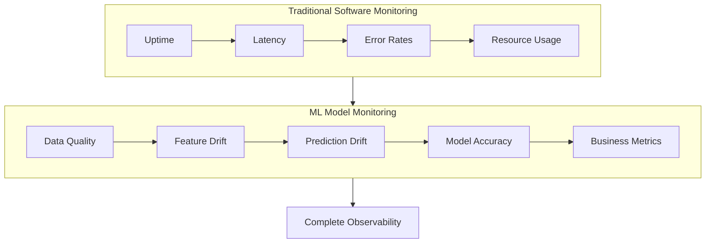
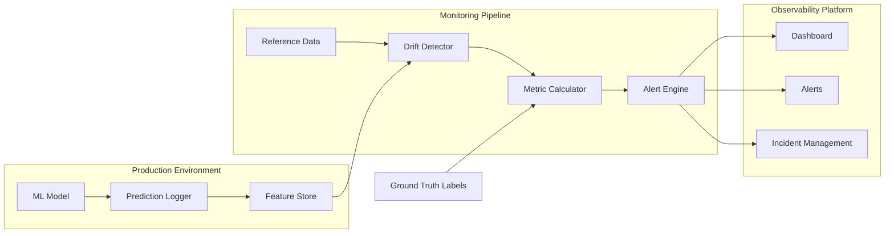
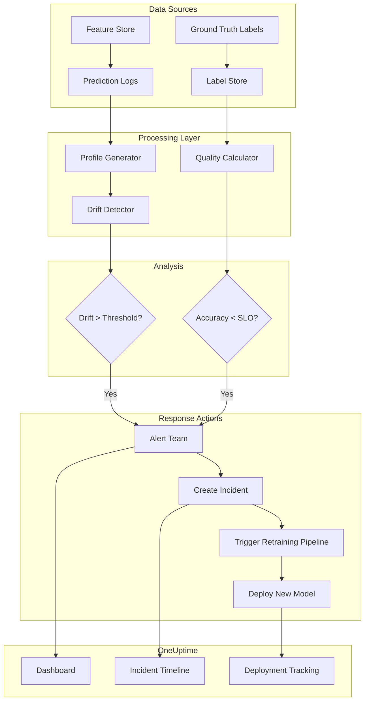
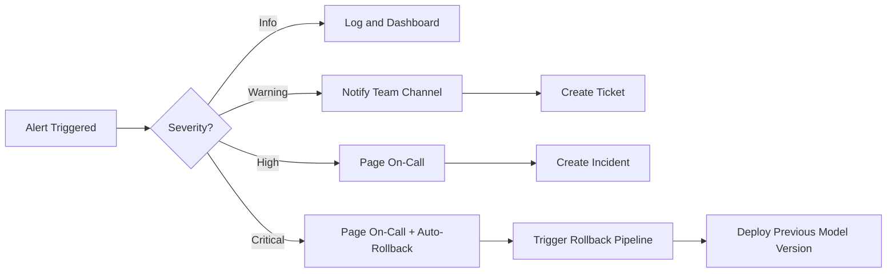

# How to Create Model Performance Monitoring

Author: [nawazdhandala](https://github.com/nawazdhandala)

Tags: MLOps, Model Monitoring, Performance, Machine Learning

Description: Learn to create model performance monitoring for tracking ML model accuracy and degradation in production.

---

You trained the model. You shipped it. Metrics looked great on your holdout set. Then three weeks later, support tickets pile up: recommendations feel off, fraud detection misses obvious cases, and your churn predictor is no better than a coin flip.

Welcome to model degradation in production.

Unlike traditional software, ML models fail silently. There is no stack trace when prediction quality declines. The model still returns a number. The API still responds with 200 OK. But the business value erodes invisibly until someone notices downstream.

This post walks you through building robust model performance monitoring, from core metrics to alerting pipelines, with practical code examples you can deploy today.

---

## Why Model Monitoring Matters

Traditional software monitoring asks: "Is the service up? Is it fast?"

ML monitoring adds a critical layer: "Is the model still accurate? Is the data still valid?"



Models degrade for several reasons:

1. **Data drift**: Input distribution shifts from training data
2. **Concept drift**: The relationship between features and target changes
3. **Feature quality issues**: Upstream data pipelines break or change
4. **Training/serving skew**: Differences between training and inference environments

---

## Key Metrics to Track

### Prediction Quality Metrics

Track these metrics continuously against ground truth when available:

| Metric | Use Case | Formula |
|--------|----------|---------|
| Accuracy | Classification | (TP + TN) / Total |
| Precision | When false positives are costly | TP / (TP + FP) |
| Recall | When false negatives are costly | TP / (TP + FN) |
| F1 Score | Balanced classification | 2 * (Precision * Recall) / (Precision + Recall) |
| RMSE | Regression | sqrt(mean((y_pred - y_actual)^2)) |
| MAE | Regression with outliers | mean(abs(y_pred - y_actual)) |
| AUC-ROC | Binary classification ranking | Area under ROC curve |

### Data Quality Metrics

| Metric | What It Detects |
|--------|-----------------|
| Missing value rate | Data pipeline failures |
| Feature mean/variance | Distribution shifts |
| Cardinality changes | Schema drift in categorical features |
| Range violations | Out-of-bounds values |
| Type mismatches | Schema corruption |

### Statistical Drift Metrics

| Method | Best For |
|--------|----------|
| Population Stability Index (PSI) | Comparing distributions over time |
| Kolmogorov-Smirnov test | Detecting distribution changes |
| Jensen-Shannon divergence | Measuring distribution similarity |
| Wasserstein distance | Earth mover's distance for distributions |

---

## Architecture Overview

A complete model monitoring system consists of these components:



---

## Implementation with Evidently

Evidently is an open-source library for ML monitoring. Here is a complete implementation:

### Installation and Setup

```python
# Install required packages
# pip install evidently pandas scikit-learn

import pandas as pd
import numpy as np
from datetime import datetime, timedelta
from sklearn.datasets import make_classification
from sklearn.model_selection import train_test_split
from sklearn.ensemble import RandomForestClassifier

# Evidently imports for monitoring
from evidently import ColumnMapping
from evidently.report import Report
from evidently.metric_preset import (
    DataDriftPreset,
    DataQualityPreset,
    ClassificationPreset
)
from evidently.metrics import (
    DataDriftTable,
    DatasetDriftMetric,
    ColumnDriftMetric,
    ClassificationQualityMetric,
    ClassificationClassBalance
)
```

### Creating Reference and Production Data

```python
def create_sample_data():
    """
    Generate synthetic classification data for demonstration.
    In production, this would be your actual training and inference data.
    """
    # Create a classification dataset with 5 informative features
    X, y = make_classification(
        n_samples=10000,
        n_features=10,
        n_informative=5,
        n_redundant=2,
        n_classes=2,
        random_state=42,
        flip_y=0.1  # Add 10% label noise for realism
    )

    # Convert to DataFrame with meaningful column names
    feature_names = [f'feature_{i}' for i in range(10)]
    df = pd.DataFrame(X, columns=feature_names)
    df['target'] = y

    return df

def simulate_data_drift(df, drift_magnitude=0.5):
    """
    Simulate data drift by shifting feature distributions.
    This mimics real-world scenarios where input data changes over time.

    Args:
        df: Original DataFrame
        drift_magnitude: How much to shift the distributions (0 to 1)

    Returns:
        DataFrame with drifted features
    """
    drifted_df = df.copy()

    # Shift numeric features by adding noise and changing mean
    for col in drifted_df.columns:
        if col != 'target' and drifted_df[col].dtype in ['float64', 'int64']:
            # Add Gaussian noise proportional to original std
            noise = np.random.normal(
                loc=drift_magnitude * drifted_df[col].std(),
                scale=drift_magnitude * drifted_df[col].std(),
                size=len(drifted_df)
            )
            drifted_df[col] = drifted_df[col] + noise

    return drifted_df
```

### Building the Monitoring Pipeline

```python
class ModelMonitor:
    """
    A comprehensive model monitoring class that tracks:
    - Data drift between reference and production data
    - Model prediction quality over time
    - Feature quality and distribution changes
    """

    def __init__(self, reference_data, column_mapping=None):
        """
        Initialize the monitor with reference (training) data.

        Args:
            reference_data: DataFrame used for training the model
            column_mapping: Evidently ColumnMapping object for feature specification
        """
        self.reference_data = reference_data
        self.column_mapping = column_mapping or ColumnMapping()
        self.drift_history = []
        self.quality_history = []

    def detect_data_drift(self, current_data, threshold=0.1):
        """
        Detect if production data has drifted from reference data.
        Uses statistical tests to compare distributions.

        Args:
            current_data: Recent production data to compare
            threshold: Drift share threshold to trigger alerts (0 to 1)

        Returns:
            dict with drift detection results and metrics
        """
        # Create drift report using Evidently
        drift_report = Report(metrics=[
            DatasetDriftMetric(),  # Overall dataset drift
            DataDriftTable(),       # Per-feature drift details
        ])

        # Run the analysis comparing reference to current data
        drift_report.run(
            reference_data=self.reference_data,
            current_data=current_data,
            column_mapping=self.column_mapping
        )

        # Extract drift metrics from the report
        report_dict = drift_report.as_dict()

        # Get the dataset drift result
        dataset_drift = report_dict['metrics'][0]['result']
        drift_detected = dataset_drift['dataset_drift']
        drift_share = dataset_drift['drift_share']

        # Store in history for trend analysis
        result = {
            'timestamp': datetime.now().isoformat(),
            'drift_detected': drift_detected,
            'drift_share': drift_share,
            'threshold': threshold,
            'alert': drift_share > threshold
        }
        self.drift_history.append(result)

        return result, drift_report

    def evaluate_model_quality(self, data_with_predictions, target_col='target',
                                prediction_col='prediction'):
        """
        Evaluate model prediction quality using classification metrics.

        Args:
            data_with_predictions: DataFrame with actual targets and predictions
            target_col: Name of the ground truth column
            prediction_col: Name of the prediction column

        Returns:
            dict with quality metrics
        """
        # Configure column mapping for classification
        column_mapping = ColumnMapping(
            target=target_col,
            prediction=prediction_col
        )

        # Create quality report
        quality_report = Report(metrics=[
            ClassificationQualityMetric(),
            ClassificationClassBalance()
        ])

        # Run quality analysis
        quality_report.run(
            reference_data=None,  # No reference needed for quality metrics
            current_data=data_with_predictions,
            column_mapping=column_mapping
        )

        # Extract metrics
        report_dict = quality_report.as_dict()
        quality_metrics = report_dict['metrics'][0]['result']['current']

        result = {
            'timestamp': datetime.now().isoformat(),
            'accuracy': quality_metrics.get('accuracy'),
            'precision': quality_metrics.get('precision'),
            'recall': quality_metrics.get('recall'),
            'f1_score': quality_metrics.get('f1')
        }
        self.quality_history.append(result)

        return result, quality_report

    def generate_comprehensive_report(self, current_data, data_with_predictions=None):
        """
        Generate a full monitoring report combining drift and quality analysis.

        Args:
            current_data: Recent production feature data
            data_with_predictions: Optional data with predictions for quality check

        Returns:
            Evidently Report object with all metrics
        """
        metrics = [
            DataDriftPreset(),
            DataQualityPreset()
        ]

        # Add classification metrics if predictions are available
        if data_with_predictions is not None:
            metrics.append(ClassificationPreset())

        report = Report(metrics=metrics)

        report.run(
            reference_data=self.reference_data,
            current_data=current_data,
            column_mapping=self.column_mapping
        )

        return report

    def check_alerts(self, drift_threshold=0.15, accuracy_threshold=0.85):
        """
        Check recent metrics against thresholds and return alerts.

        Args:
            drift_threshold: Maximum acceptable drift share
            accuracy_threshold: Minimum acceptable accuracy

        Returns:
            list of alert messages
        """
        alerts = []

        # Check latest drift metrics
        if self.drift_history:
            latest_drift = self.drift_history[-1]
            if latest_drift['drift_share'] > drift_threshold:
                alerts.append({
                    'type': 'DATA_DRIFT',
                    'severity': 'HIGH' if latest_drift['drift_share'] > 0.3 else 'MEDIUM',
                    'message': f"Data drift detected: {latest_drift['drift_share']:.2%} of features drifted",
                    'timestamp': latest_drift['timestamp']
                })

        # Check latest quality metrics
        if self.quality_history:
            latest_quality = self.quality_history[-1]
            if latest_quality['accuracy'] and latest_quality['accuracy'] < accuracy_threshold:
                alerts.append({
                    'type': 'MODEL_DEGRADATION',
                    'severity': 'CRITICAL' if latest_quality['accuracy'] < 0.7 else 'HIGH',
                    'message': f"Model accuracy dropped to {latest_quality['accuracy']:.2%}",
                    'timestamp': latest_quality['timestamp']
                })

        return alerts
```

### Running the Monitor

```python
def main():
    """
    Demonstrate the complete monitoring workflow.
    """
    # Step 1: Create reference data (simulating training data)
    print("Creating reference dataset...")
    reference_data = create_sample_data()

    # Step 2: Train a simple model
    print("Training model...")
    X = reference_data.drop('target', axis=1)
    y = reference_data['target']
    X_train, X_test, y_train, y_test = train_test_split(
        X, y, test_size=0.2, random_state=42
    )

    model = RandomForestClassifier(n_estimators=100, random_state=42)
    model.fit(X_train, y_train)

    # Step 3: Initialize the monitor with reference data
    print("Initializing model monitor...")
    monitor = ModelMonitor(reference_data=reference_data)

    # Step 4: Simulate production data with drift
    print("Simulating production data with drift...")
    production_data = simulate_data_drift(reference_data, drift_magnitude=0.3)

    # Add predictions to production data
    production_data['prediction'] = model.predict(
        production_data.drop(['target', 'prediction'] if 'prediction' in production_data.columns
                            else ['target'], axis=1, errors='ignore')
    )

    # Step 5: Run drift detection
    print("\nRunning drift detection...")
    drift_result, drift_report = monitor.detect_data_drift(production_data)
    print(f"Drift detected: {drift_result['drift_detected']}")
    print(f"Drift share: {drift_result['drift_share']:.2%}")

    # Step 6: Evaluate model quality
    print("\nEvaluating model quality...")
    quality_result, quality_report = monitor.evaluate_model_quality(
        production_data,
        target_col='target',
        prediction_col='prediction'
    )
    print(f"Accuracy: {quality_result['accuracy']:.2%}")
    print(f"Precision: {quality_result['precision']:.2%}")
    print(f"Recall: {quality_result['recall']:.2%}")

    # Step 7: Check for alerts
    print("\nChecking alerts...")
    alerts = monitor.check_alerts()
    for alert in alerts:
        print(f"[{alert['severity']}] {alert['type']}: {alert['message']}")

    # Step 8: Save HTML report
    print("\nGenerating comprehensive report...")
    full_report = monitor.generate_comprehensive_report(
        production_data,
        production_data
    )
    full_report.save_html("model_monitoring_report.html")
    print("Report saved to model_monitoring_report.html")

if __name__ == "__main__":
    main()
```

---

## Implementation with WhyLabs

WhyLabs provides a managed platform for ML monitoring. Here is how to integrate it:

### Setup and Configuration

```python
# Install whylogs
# pip install whylogs whylogs[whylabs]

import whylogs as why
from whylogs.core.constraints import Constraints, ConstraintsBuilder
from whylogs.core.constraints.factories import (
    greater_than_number,
    smaller_than_number,
    no_missing_values,
    mean_between_range
)
import pandas as pd
import os

# Configure WhyLabs credentials
# Set these as environment variables in production
os.environ["WHYLABS_API_KEY"] = "your-api-key"
os.environ["WHYLABS_DEFAULT_ORG_ID"] = "your-org-id"
os.environ["WHYLABS_DEFAULT_DATASET_ID"] = "your-model-id"
```

### Creating Data Profiles

```python
class WhyLabsMonitor:
    """
    Monitor ML models using WhyLabs for drift detection and data quality.
    WhyLabs uses statistical profiling to track data characteristics over time.
    """

    def __init__(self, model_id, api_key=None):
        """
        Initialize WhyLabs monitor.

        Args:
            model_id: Unique identifier for the model in WhyLabs
            api_key: WhyLabs API key (uses env var if not provided)
        """
        self.model_id = model_id
        if api_key:
            os.environ["WHYLABS_API_KEY"] = api_key

    def profile_data(self, data, dataset_timestamp=None):
        """
        Create a statistical profile of the data.
        Profiles capture distribution statistics without storing raw data.

        Args:
            data: DataFrame to profile
            dataset_timestamp: Timestamp for the profile (defaults to now)

        Returns:
            whylogs profile object
        """
        # Create profile with whylogs
        # This captures statistics like mean, std, quantiles, cardinality
        result = why.log(data)
        profile = result.profile()

        # View profile summary
        profile_view = profile.view()
        summary = profile_view.to_pandas()

        return profile, summary

    def create_constraints(self, reference_profile):
        """
        Create data quality constraints based on reference data.
        Constraints define acceptable ranges for features.

        Args:
            reference_profile: Profile from training/reference data

        Returns:
            Constraints object for validation
        """
        builder = ConstraintsBuilder(dataset_profile_view=reference_profile.view())

        # Add constraints for each numeric column
        # These will alert when violated in production

        # Example: No missing values in critical features
        builder.add_constraint(no_missing_values(column_name="feature_0"))
        builder.add_constraint(no_missing_values(column_name="feature_1"))

        # Example: Value range constraints
        builder.add_constraint(
            greater_than_number(column_name="feature_0", number=-10.0)
        )
        builder.add_constraint(
            smaller_than_number(column_name="feature_0", number=10.0)
        )

        # Example: Statistical constraints based on reference
        # Mean should stay within 2 standard deviations of reference mean
        ref_view = reference_profile.view()
        ref_summary = ref_view.to_pandas()

        for col in ['feature_0', 'feature_1', 'feature_2']:
            if col in ref_summary.index:
                mean = ref_summary.loc[col, 'distribution/mean']
                std = ref_summary.loc[col, 'distribution/stddev']
                builder.add_constraint(
                    mean_between_range(
                        column_name=col,
                        lower=mean - 2*std,
                        upper=mean + 2*std
                    )
                )

        return builder.build()

    def validate_data(self, data, constraints):
        """
        Validate production data against constraints.

        Args:
            data: DataFrame to validate
            constraints: Constraints object

        Returns:
            Validation report with pass/fail status
        """
        # Profile the new data
        result = why.log(data)
        profile = result.profile()

        # Check constraints
        validation_result = constraints.validate(profile.view())

        # Build detailed report
        report = {
            'passed': validation_result.passed,
            'failed_constraints': [],
            'summary': []
        }

        for constraint_name, constraint_result in validation_result.report:
            report['summary'].append({
                'constraint': constraint_name,
                'passed': constraint_result.passed,
                'metric_value': constraint_result.metric_value
            })
            if not constraint_result.passed:
                report['failed_constraints'].append(constraint_name)

        return report

    def upload_profile(self, profile, timestamp=None):
        """
        Upload profile to WhyLabs for visualization and alerting.

        Args:
            profile: whylogs profile to upload
            timestamp: Profile timestamp (defaults to now)
        """
        from whylogs.api.writer.whylabs import WhyLabsWriter

        writer = WhyLabsWriter()
        writer.write(profile)

        print(f"Profile uploaded to WhyLabs for model {self.model_id}")
```

### Continuous Monitoring Script

```python
def continuous_monitoring_job():
    """
    Example batch job for continuous model monitoring.
    Run this on a schedule (hourly, daily) to track model health.
    """
    from datetime import datetime
    import json

    # Initialize monitor
    monitor = WhyLabsMonitor(model_id="fraud-detection-v1")

    # Load reference profile (created during training)
    # In production, load this from artifact storage
    reference_data = pd.read_parquet("reference_data.parquet")
    ref_profile, _ = monitor.profile_data(reference_data)

    # Create constraints from reference
    constraints = monitor.create_constraints(ref_profile)

    # Load recent production data
    # In production, query from your feature store or data warehouse
    production_data = pd.read_parquet("production_data_latest.parquet")

    # Profile and validate
    prod_profile, prod_summary = monitor.profile_data(production_data)
    validation_report = monitor.validate_data(production_data, constraints)

    # Log results
    print(f"Validation passed: {validation_report['passed']}")

    if not validation_report['passed']:
        # Send alert
        alert_payload = {
            'model_id': 'fraud-detection-v1',
            'timestamp': datetime.now().isoformat(),
            'alert_type': 'DATA_QUALITY_VIOLATION',
            'failed_constraints': validation_report['failed_constraints'],
            'severity': 'HIGH'
        }

        # Send to alerting system (Slack, PagerDuty, OneUptime, etc.)
        print(f"ALERT: {json.dumps(alert_payload, indent=2)}")

    # Upload profile for dashboards
    monitor.upload_profile(prod_profile)
```

---

## Building Custom Drift Detection

For complete control, build your own drift detector:

```python
import numpy as np
from scipy import stats
from typing import Dict, List, Tuple

class CustomDriftDetector:
    """
    Custom drift detection using statistical tests.
    Provides fine-grained control over drift detection methodology.
    """

    def __init__(self, reference_data: pd.DataFrame,
                 significance_level: float = 0.05):
        """
        Initialize detector with reference distribution.

        Args:
            reference_data: Training/reference dataset
            significance_level: P-value threshold for drift detection
        """
        self.reference_data = reference_data
        self.significance_level = significance_level
        self.reference_stats = self._compute_statistics(reference_data)

    def _compute_statistics(self, data: pd.DataFrame) -> Dict:
        """
        Compute comprehensive statistics for each column.

        Args:
            data: DataFrame to analyze

        Returns:
            Dict with statistics per column
        """
        stats_dict = {}

        for col in data.select_dtypes(include=[np.number]).columns:
            col_data = data[col].dropna()
            stats_dict[col] = {
                'mean': col_data.mean(),
                'std': col_data.std(),
                'min': col_data.min(),
                'max': col_data.max(),
                'median': col_data.median(),
                'q25': col_data.quantile(0.25),
                'q75': col_data.quantile(0.75),
                'values': col_data.values  # Store for statistical tests
            }

        return stats_dict

    def kolmogorov_smirnov_test(self, current_data: pd.DataFrame,
                                column: str) -> Tuple[float, float, bool]:
        """
        Perform Kolmogorov-Smirnov test for distribution comparison.

        The KS test measures the maximum distance between two cumulative
        distribution functions. Good for detecting shifts in distribution shape.

        Args:
            current_data: Production data to test
            column: Column name to test

        Returns:
            Tuple of (statistic, p_value, drift_detected)
        """
        ref_values = self.reference_stats[column]['values']
        curr_values = current_data[column].dropna().values

        # Two-sample KS test
        statistic, p_value = stats.ks_2samp(ref_values, curr_values)
        drift_detected = p_value < self.significance_level

        return statistic, p_value, drift_detected

    def population_stability_index(self, current_data: pd.DataFrame,
                                   column: str, bins: int = 10) -> float:
        """
        Calculate Population Stability Index (PSI).

        PSI measures how much a distribution has shifted from a baseline.
        Common thresholds:
        - PSI < 0.1: No significant drift
        - 0.1 <= PSI < 0.2: Moderate drift, monitor closely
        - PSI >= 0.2: Significant drift, investigate

        Args:
            current_data: Production data
            column: Column to analyze
            bins: Number of bins for discretization

        Returns:
            PSI value
        """
        ref_values = self.reference_stats[column]['values']
        curr_values = current_data[column].dropna().values

        # Create bins based on reference distribution
        _, bin_edges = np.histogram(ref_values, bins=bins)

        # Calculate proportions in each bin
        ref_counts, _ = np.histogram(ref_values, bins=bin_edges)
        curr_counts, _ = np.histogram(curr_values, bins=bin_edges)

        # Convert to proportions with smoothing to avoid division by zero
        ref_props = (ref_counts + 0.001) / (len(ref_values) + 0.001 * bins)
        curr_props = (curr_counts + 0.001) / (len(curr_values) + 0.001 * bins)

        # Calculate PSI
        psi = np.sum((curr_props - ref_props) * np.log(curr_props / ref_props))

        return psi

    def jensen_shannon_divergence(self, current_data: pd.DataFrame,
                                  column: str, bins: int = 50) -> float:
        """
        Calculate Jensen-Shannon divergence between distributions.

        JS divergence is a symmetric measure of distribution similarity.
        Range is 0 (identical) to 1 (completely different).

        Args:
            current_data: Production data
            column: Column to analyze
            bins: Number of bins for histogram

        Returns:
            JS divergence value
        """
        ref_values = self.reference_stats[column]['values']
        curr_values = current_data[column].dropna().values

        # Create common bin edges
        all_values = np.concatenate([ref_values, curr_values])
        _, bin_edges = np.histogram(all_values, bins=bins)

        # Create probability distributions
        ref_hist, _ = np.histogram(ref_values, bins=bin_edges, density=True)
        curr_hist, _ = np.histogram(curr_values, bins=bin_edges, density=True)

        # Normalize to probabilities
        ref_prob = ref_hist / (ref_hist.sum() + 1e-10)
        curr_prob = curr_hist / (curr_hist.sum() + 1e-10)

        # Calculate JS divergence
        m = 0.5 * (ref_prob + curr_prob)
        js_div = 0.5 * (stats.entropy(ref_prob, m) + stats.entropy(curr_prob, m))

        return js_div

    def detect_all_drift(self, current_data: pd.DataFrame) -> Dict:
        """
        Run all drift detection methods on all numeric columns.

        Args:
            current_data: Production data to analyze

        Returns:
            Comprehensive drift report
        """
        report = {
            'timestamp': datetime.now().isoformat(),
            'columns': {},
            'overall_drift': False,
            'drifted_columns': []
        }

        numeric_cols = current_data.select_dtypes(include=[np.number]).columns

        for col in numeric_cols:
            if col not in self.reference_stats:
                continue

            # Run all tests
            ks_stat, ks_pval, ks_drift = self.kolmogorov_smirnov_test(
                current_data, col
            )
            psi = self.population_stability_index(current_data, col)
            js_div = self.jensen_shannon_divergence(current_data, col)

            # Determine drift (any method triggers)
            drift_detected = ks_drift or psi >= 0.2 or js_div >= 0.1

            report['columns'][col] = {
                'ks_statistic': ks_stat,
                'ks_pvalue': ks_pval,
                'ks_drift': ks_drift,
                'psi': psi,
                'js_divergence': js_div,
                'drift_detected': drift_detected
            }

            if drift_detected:
                report['drifted_columns'].append(col)
                report['overall_drift'] = True

        return report
```

---

## Alerting and Incident Management

Integrate monitoring with your alerting system:

```python
import json
import requests
from dataclasses import dataclass
from enum import Enum
from typing import Optional

class AlertSeverity(Enum):
    """Alert severity levels matching industry standards."""
    INFO = "info"
    WARNING = "warning"
    HIGH = "high"
    CRITICAL = "critical"

@dataclass
class ModelAlert:
    """Structure for model monitoring alerts."""
    model_id: str
    alert_type: str
    severity: AlertSeverity
    message: str
    metrics: dict
    timestamp: str
    runbook_url: Optional[str] = None

class AlertManager:
    """
    Manage alerts from model monitoring and route to appropriate channels.
    Integrates with common incident management platforms.
    """

    def __init__(self, config: dict):
        """
        Initialize alert manager with routing configuration.

        Args:
            config: Dictionary with webhook URLs and settings
        """
        self.config = config
        self.alert_history = []

    def evaluate_alert_severity(self, drift_share: float = None,
                                 accuracy_drop: float = None,
                                 latency_p99: float = None) -> AlertSeverity:
        """
        Determine alert severity based on metric thresholds.

        Args:
            drift_share: Proportion of features with drift
            accuracy_drop: Decrease in accuracy from baseline
            latency_p99: 99th percentile inference latency

        Returns:
            AlertSeverity level
        """
        # Critical: Major degradation requiring immediate action
        if accuracy_drop and accuracy_drop > 0.2:
            return AlertSeverity.CRITICAL
        if drift_share and drift_share > 0.5:
            return AlertSeverity.CRITICAL

        # High: Significant issues requiring prompt attention
        if accuracy_drop and accuracy_drop > 0.1:
            return AlertSeverity.HIGH
        if drift_share and drift_share > 0.3:
            return AlertSeverity.HIGH

        # Warning: Issues to investigate soon
        if accuracy_drop and accuracy_drop > 0.05:
            return AlertSeverity.WARNING
        if drift_share and drift_share > 0.15:
            return AlertSeverity.WARNING

        return AlertSeverity.INFO

    def send_slack_alert(self, alert: ModelAlert):
        """
        Send alert to Slack channel.

        Args:
            alert: ModelAlert object with alert details
        """
        webhook_url = self.config.get('slack_webhook_url')
        if not webhook_url:
            return

        # Color coding for severity
        color_map = {
            AlertSeverity.INFO: "#36a64f",
            AlertSeverity.WARNING: "#ffcc00",
            AlertSeverity.HIGH: "#ff9900",
            AlertSeverity.CRITICAL: "#ff0000"
        }

        payload = {
            "attachments": [{
                "color": color_map.get(alert.severity, "#808080"),
                "title": f"Model Alert: {alert.alert_type}",
                "text": alert.message,
                "fields": [
                    {"title": "Model", "value": alert.model_id, "short": True},
                    {"title": "Severity", "value": alert.severity.value, "short": True},
                    {"title": "Timestamp", "value": alert.timestamp, "short": True}
                ],
                "footer": "ML Model Monitoring"
            }]
        }

        if alert.runbook_url:
            payload["attachments"][0]["fields"].append({
                "title": "Runbook",
                "value": f"<{alert.runbook_url}|View Runbook>",
                "short": True
            })

        try:
            response = requests.post(webhook_url, json=payload, timeout=10)
            response.raise_for_status()
        except requests.exceptions.RequestException as e:
            print(f"Failed to send Slack alert: {e}")

    def send_pagerduty_alert(self, alert: ModelAlert):
        """
        Send alert to PagerDuty for on-call notification.

        Args:
            alert: ModelAlert object
        """
        integration_key = self.config.get('pagerduty_integration_key')
        if not integration_key:
            return

        # Map severity to PagerDuty severity
        pd_severity_map = {
            AlertSeverity.INFO: "info",
            AlertSeverity.WARNING: "warning",
            AlertSeverity.HIGH: "error",
            AlertSeverity.CRITICAL: "critical"
        }

        payload = {
            "routing_key": integration_key,
            "event_action": "trigger",
            "dedup_key": f"{alert.model_id}-{alert.alert_type}",
            "payload": {
                "summary": f"[{alert.model_id}] {alert.alert_type}: {alert.message}",
                "severity": pd_severity_map.get(alert.severity, "warning"),
                "source": "ml-monitoring",
                "custom_details": alert.metrics
            }
        }

        try:
            response = requests.post(
                "https://events.pagerduty.com/v2/enqueue",
                json=payload,
                timeout=10
            )
            response.raise_for_status()
        except requests.exceptions.RequestException as e:
            print(f"Failed to send PagerDuty alert: {e}")

    def send_oneuptime_alert(self, alert: ModelAlert):
        """
        Send alert to OneUptime for incident management.

        Args:
            alert: ModelAlert object
        """
        api_url = self.config.get('oneuptime_api_url')
        api_key = self.config.get('oneuptime_api_key')

        if not api_url or not api_key:
            return

        # Map to OneUptime incident severity
        severity_map = {
            AlertSeverity.INFO: "Low",
            AlertSeverity.WARNING: "Medium",
            AlertSeverity.HIGH: "High",
            AlertSeverity.CRITICAL: "Critical"
        }

        payload = {
            "title": f"[ML] {alert.alert_type} - {alert.model_id}",
            "description": alert.message,
            "severity": severity_map.get(alert.severity, "Medium"),
            "customFields": {
                "model_id": alert.model_id,
                "metrics": json.dumps(alert.metrics)
            }
        }

        headers = {
            "Authorization": f"Bearer {api_key}",
            "Content-Type": "application/json"
        }

        try:
            response = requests.post(
                f"{api_url}/incidents",
                json=payload,
                headers=headers,
                timeout=10
            )
            response.raise_for_status()
        except requests.exceptions.RequestException as e:
            print(f"Failed to send OneUptime alert: {e}")

    def process_monitoring_results(self, drift_report: dict,
                                    quality_report: dict,
                                    model_id: str):
        """
        Process monitoring results and send appropriate alerts.

        Args:
            drift_report: Results from drift detection
            quality_report: Results from quality evaluation
            model_id: Identifier for the model
        """
        alerts_to_send = []

        # Check for data drift
        if drift_report.get('overall_drift'):
            drift_share = len(drift_report.get('drifted_columns', [])) / \
                         max(len(drift_report.get('columns', {})), 1)

            alert = ModelAlert(
                model_id=model_id,
                alert_type="DATA_DRIFT",
                severity=self.evaluate_alert_severity(drift_share=drift_share),
                message=f"Data drift detected in {len(drift_report['drifted_columns'])} features: {', '.join(drift_report['drifted_columns'][:5])}",
                metrics={'drift_share': drift_share, 'drifted_features': drift_report['drifted_columns']},
                timestamp=drift_report.get('timestamp', datetime.now().isoformat()),
                runbook_url="https://docs.example.com/runbooks/ml-data-drift"
            )
            alerts_to_send.append(alert)

        # Check for accuracy degradation
        if quality_report.get('accuracy'):
            baseline_accuracy = 0.92  # Your baseline accuracy
            accuracy_drop = baseline_accuracy - quality_report['accuracy']

            if accuracy_drop > 0.05:
                alert = ModelAlert(
                    model_id=model_id,
                    alert_type="MODEL_DEGRADATION",
                    severity=self.evaluate_alert_severity(accuracy_drop=accuracy_drop),
                    message=f"Model accuracy dropped by {accuracy_drop:.1%} (current: {quality_report['accuracy']:.1%})",
                    metrics={'current_accuracy': quality_report['accuracy'], 'accuracy_drop': accuracy_drop},
                    timestamp=quality_report.get('timestamp', datetime.now().isoformat()),
                    runbook_url="https://docs.example.com/runbooks/ml-accuracy-drop"
                )
                alerts_to_send.append(alert)

        # Send all alerts
        for alert in alerts_to_send:
            self.alert_history.append(alert)
            self.send_slack_alert(alert)

            # Only page for high/critical
            if alert.severity in [AlertSeverity.HIGH, AlertSeverity.CRITICAL]:
                self.send_pagerduty_alert(alert)
                self.send_oneuptime_alert(alert)
```

---

## Monitoring Pipeline Architecture

Here is the complete monitoring flow:



---

## Best Practices

### 1. Set Meaningful Baselines

Do not alert on every statistical fluctuation. Establish baselines during a stable period:

```python
def calculate_baseline_thresholds(historical_metrics: List[dict],
                                   std_multiplier: float = 2.0) -> dict:
    """
    Calculate alert thresholds from historical data.
    Use this during initial deployment to avoid false positives.

    Args:
        historical_metrics: List of metric dictionaries over time
        std_multiplier: Number of standard deviations for threshold

    Returns:
        Dictionary of metric thresholds
    """
    import numpy as np

    thresholds = {}

    # Extract metric values
    accuracy_values = [m['accuracy'] for m in historical_metrics if m.get('accuracy')]
    drift_values = [m['drift_share'] for m in historical_metrics if m.get('drift_share')]

    if accuracy_values:
        mean_acc = np.mean(accuracy_values)
        std_acc = np.std(accuracy_values)
        # Alert when accuracy drops below mean minus N standard deviations
        thresholds['accuracy_min'] = mean_acc - (std_multiplier * std_acc)

    if drift_values:
        mean_drift = np.mean(drift_values)
        std_drift = np.std(drift_values)
        # Alert when drift exceeds mean plus N standard deviations
        thresholds['drift_max'] = mean_drift + (std_multiplier * std_drift)

    return thresholds
```

### 2. Monitor at Multiple Granularities

Track metrics at different levels:

```python
monitoring_dimensions = {
    'global': {
        # Overall model performance
        'metrics': ['accuracy', 'latency_p50', 'latency_p99', 'throughput']
    },
    'segment': {
        # Performance by user segment
        'dimensions': ['user_tier', 'region', 'device_type'],
        'metrics': ['accuracy', 'prediction_distribution']
    },
    'feature': {
        # Individual feature health
        'metrics': ['missing_rate', 'drift_score', 'cardinality']
    },
    'temporal': {
        # Time-based patterns
        'windows': ['hourly', 'daily', 'weekly'],
        'metrics': ['volume', 'accuracy_trend', 'drift_trend']
    }
}
```

### 3. Automate Response Actions

Define automated responses for common scenarios:



### 4. Track Business Metrics Alongside Technical Metrics

Model accuracy means nothing if business KPIs suffer:

```python
business_metrics = {
    'fraud_detection': {
        'technical': ['precision', 'recall', 'auc_roc'],
        'business': ['fraud_loss_rate', 'false_positive_cost', 'manual_review_rate']
    },
    'recommendation': {
        'technical': ['ndcg', 'mrr', 'coverage'],
        'business': ['click_through_rate', 'conversion_rate', 'revenue_per_user']
    },
    'churn_prediction': {
        'technical': ['accuracy', 'f1_score', 'calibration_error'],
        'business': ['retention_rate', 'intervention_success_rate', 'customer_ltv']
    }
}
```

---

## Sample Monitoring Dashboard Metrics

Track these metrics in your observability platform:

| Category | Metric | Alert Threshold | Check Frequency |
|----------|--------|-----------------|-----------------|
| Data Quality | Missing value rate | > 5% | Every batch |
| Data Quality | Schema violations | Any | Every batch |
| Data Drift | PSI per feature | > 0.2 | Hourly |
| Data Drift | Overall drift share | > 20% | Hourly |
| Model Performance | Accuracy | < baseline - 5% | Daily |
| Model Performance | Precision/Recall | < baseline - 10% | Daily |
| Operational | Prediction latency p99 | > 100ms | Real-time |
| Operational | Throughput | < expected - 20% | Real-time |
| Business | Conversion rate | < baseline - 15% | Daily |

---

## Conclusion

Model performance monitoring is not optional for production ML systems. Models degrade silently, and by the time users complain, significant business value has been lost.

Key takeaways:

1. **Monitor data and predictions**: Track both input data quality and output prediction quality
2. **Use multiple drift detection methods**: No single test catches all types of drift
3. **Set meaningful thresholds**: Base alerts on your specific baseline, not arbitrary values
4. **Automate responses**: Define playbooks for common failure modes
5. **Connect to business metrics**: Technical metrics should map to business outcomes

Start with basic drift detection using Evidently or WhyLabs. As your MLOps maturity grows, build custom detectors and integrate with your incident management workflow.

The goal is not to prevent all model degradation. The goal is to detect it fast enough to act before it matters.

---

**Related Reading:**

- [Three Pillars of Observability: Logs, Metrics, Traces](https://oneuptime.com/blog/post/2025-08-20-three-pillars-of-observability-logs-metrics-traces/view)
- [SRE Metrics to Track](https://oneuptime.com/blog/post/2025-11-28-sre-metrics-to-track/view)
- [What is Toil and How to Eliminate It](https://oneuptime.com/blog/post/2025-10-01-what-is-toil-and-how-to-eliminate-it/view)
