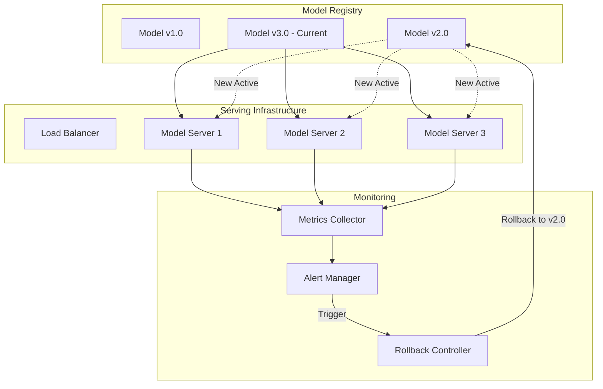
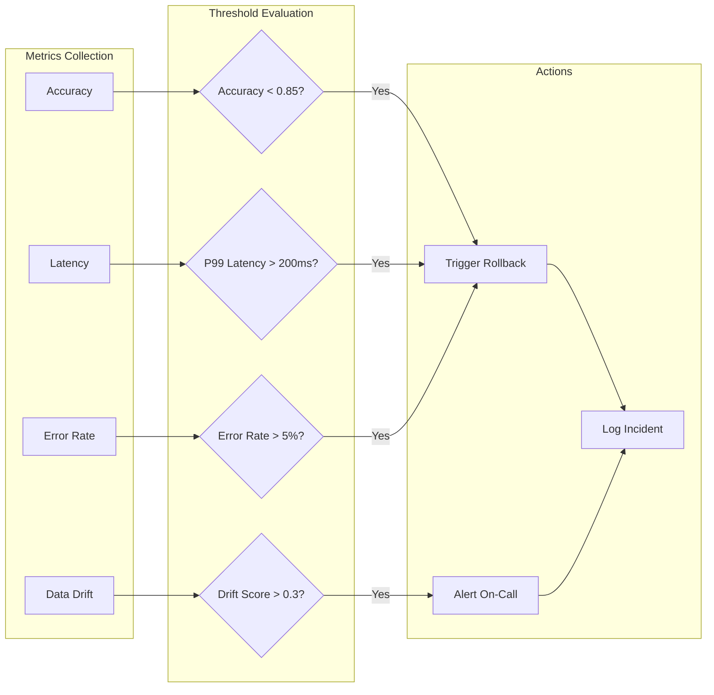
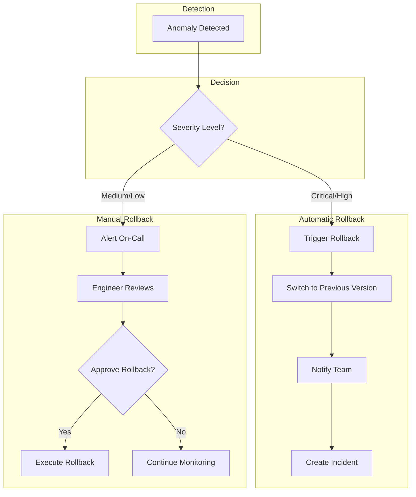
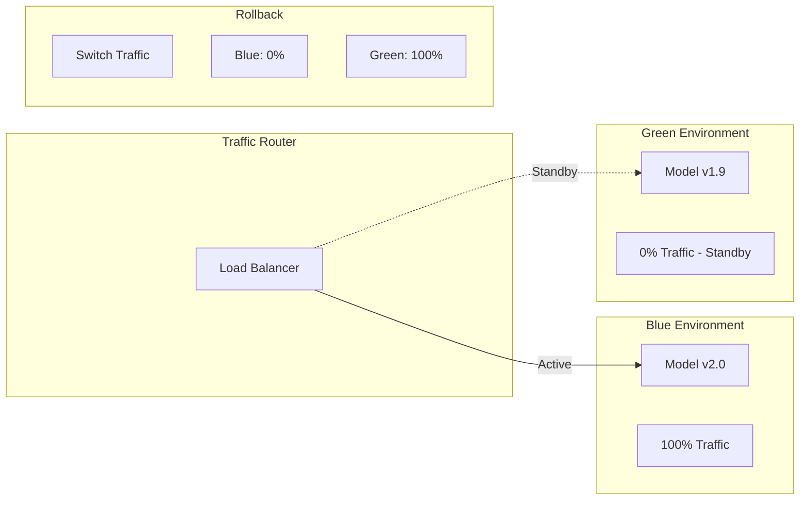
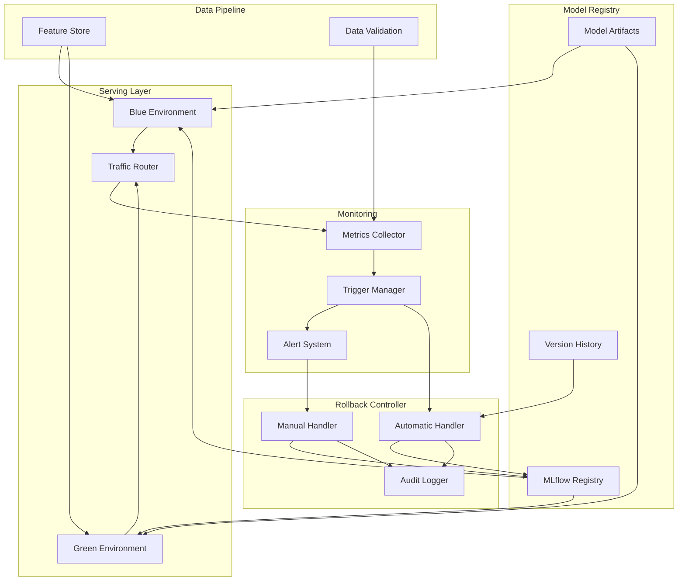

# How to Implement Model Rollback

Author: [nawazdhandala](https://github.com/nawazdhandala)

Tags: MLOps, Model Rollback, Reliability, Machine Learning

Description: Learn to implement model rollback for quickly reverting to previous model versions when issues occur.

---

Model rollback is the ability to quickly revert to a previous version of a machine learning model when the current version causes problems. This is critical for production ML systems where model failures can directly impact revenue, user experience, or safety.

## Why Model Rollback Matters

Unlike traditional software deployments, ML models can fail silently. A model might serve predictions with high confidence while being completely wrong. Rollback capability lets you respond within seconds instead of hours.

Common scenarios requiring rollback:
- Model accuracy drops after deployment
- Prediction latency increases beyond SLA thresholds
- Data drift causes unexpected behavior
- Feature pipeline changes break model inputs
- Memory or resource consumption spikes

## Model Rollback Architecture



## Setting Up a Model Registry

A model registry is the foundation of rollback capability. It stores versioned model artifacts with metadata.

### Using MLflow for Version Management

```python
# model_registry.py
# MLflow-based model registry with versioning and rollback support

import mlflow
from mlflow.tracking import MlflowClient
from datetime import datetime
from typing import Optional, Dict, Any, List
import json


class ModelRegistry:
    """
    Model registry wrapper that provides versioning,
    metadata tracking, and rollback capabilities.
    """

    def __init__(self, tracking_uri: str, registry_uri: str):
        # Initialize MLflow with tracking and registry URIs
        mlflow.set_tracking_uri(tracking_uri)
        mlflow.set_registry_uri(registry_uri)
        self.client = MlflowClient()

    def register_model(
        self,
        model_name: str,
        model_artifact_path: str,
        metrics: Dict[str, float],
        parameters: Dict[str, Any],
        tags: Optional[Dict[str, str]] = None
    ) -> str:
        """
        Register a new model version with metadata.
        Returns the version number of the registered model.
        """
        # Start a new MLflow run to log the model
        with mlflow.start_run() as run:
            # Log training metrics for comparison during rollback decisions
            mlflow.log_metrics(metrics)

            # Log parameters used to train this model version
            mlflow.log_params(parameters)

            # Log the model artifact to the registry
            model_uri = mlflow.sklearn.log_model(
                sk_model=model_artifact_path,
                artifact_path="model",
                registered_model_name=model_name
            )

            # Add custom tags for tracking deployment history
            if tags:
                for key, value in tags.items():
                    mlflow.set_tag(key, value)

            # Add timestamp tag for rollback ordering
            mlflow.set_tag("registered_at", datetime.utcnow().isoformat())

        # Get the latest version number
        latest_version = self._get_latest_version(model_name)
        return latest_version

    def _get_latest_version(self, model_name: str) -> str:
        """Get the most recent version number for a model."""
        versions = self.client.search_model_versions(
            f"name='{model_name}'"
        )
        if not versions:
            return "1"
        return str(max(int(v.version) for v in versions))

    def get_model_version(
        self,
        model_name: str,
        version: Optional[str] = None,
        stage: Optional[str] = None
    ):
        """
        Load a specific model version or the model at a given stage.
        Stage can be: None, Staging, Production, Archived
        """
        if version:
            # Load specific version
            model_uri = f"models:/{model_name}/{version}"
        elif stage:
            # Load model at specific stage (Production, Staging, etc.)
            model_uri = f"models:/{model_name}/{stage}"
        else:
            # Load latest version
            model_uri = f"models:/{model_name}/latest"

        return mlflow.sklearn.load_model(model_uri)

    def list_versions(
        self,
        model_name: str,
        limit: int = 10
    ) -> List[Dict[str, Any]]:
        """
        List recent versions of a model with their metadata.
        Useful for selecting a rollback target.
        """
        versions = self.client.search_model_versions(
            f"name='{model_name}'"
        )

        version_info = []
        for v in sorted(versions, key=lambda x: int(x.version), reverse=True)[:limit]:
            # Get the run associated with this version
            run = self.client.get_run(v.run_id)

            version_info.append({
                "version": v.version,
                "stage": v.current_stage,
                "created_at": v.creation_timestamp,
                "metrics": run.data.metrics,
                "parameters": run.data.params,
                "tags": run.data.tags,
                "status": v.status
            })

        return version_info

    def promote_to_production(
        self,
        model_name: str,
        version: str
    ) -> None:
        """
        Promote a model version to production stage.
        Archives the current production model.
        """
        # First, archive any existing production model
        prod_versions = self.client.get_latest_versions(
            model_name,
            stages=["Production"]
        )
        for pv in prod_versions:
            self.client.transition_model_version_stage(
                name=model_name,
                version=pv.version,
                stage="Archived"
            )

        # Promote the specified version to production
        self.client.transition_model_version_stage(
            name=model_name,
            version=version,
            stage="Production"
        )

        print(f"Model {model_name} version {version} promoted to Production")

    def rollback_to_version(
        self,
        model_name: str,
        target_version: str,
        reason: str
    ) -> Dict[str, Any]:
        """
        Rollback to a previous model version.
        Logs the rollback event for audit purposes.
        """
        # Get current production version for logging
        current_prod = self.client.get_latest_versions(
            model_name,
            stages=["Production"]
        )
        current_version = current_prod[0].version if current_prod else "None"

        # Perform the rollback
        self.promote_to_production(model_name, target_version)

        # Log rollback event
        rollback_event = {
            "timestamp": datetime.utcnow().isoformat(),
            "model_name": model_name,
            "from_version": current_version,
            "to_version": target_version,
            "reason": reason,
            "action": "rollback"
        }

        # Tag the rolled-back-to version with rollback info
        self.client.set_model_version_tag(
            name=model_name,
            version=target_version,
            key="rollback_from",
            value=current_version
        )
        self.client.set_model_version_tag(
            name=model_name,
            version=target_version,
            key="rollback_reason",
            value=reason
        )

        return rollback_event
```

## Rollback Triggers and Detection



### Implementing Rollback Triggers

```python
# rollback_triggers.py
# Automated rollback trigger system based on model performance metrics

from dataclasses import dataclass
from typing import Callable, Dict, List, Optional
from enum import Enum
import time
from collections import deque
import statistics


class TriggerSeverity(Enum):
    """Severity levels for rollback triggers."""
    LOW = "low"           # Log and monitor
    MEDIUM = "medium"     # Alert on-call team
    HIGH = "high"         # Automatic rollback
    CRITICAL = "critical" # Immediate rollback with incident


@dataclass
class RollbackTrigger:
    """
    Defines a condition that can trigger a model rollback.
    """
    name: str
    metric_name: str
    threshold: float
    comparison: str  # "greater_than", "less_than", "equals"
    severity: TriggerSeverity
    window_size: int = 100      # Number of samples to evaluate
    min_samples: int = 10       # Minimum samples before triggering
    cooldown_seconds: int = 300 # Prevent rapid repeated triggers


class RollbackTriggerManager:
    """
    Manages rollback triggers and evaluates metrics against thresholds.
    """

    def __init__(self):
        self.triggers: Dict[str, RollbackTrigger] = {}
        self.metric_windows: Dict[str, deque] = {}
        self.last_trigger_times: Dict[str, float] = {}
        self.callbacks: Dict[TriggerSeverity, List[Callable]] = {
            severity: [] for severity in TriggerSeverity
        }

    def register_trigger(self, trigger: RollbackTrigger) -> None:
        """Register a new rollback trigger."""
        self.triggers[trigger.name] = trigger

        # Initialize metric window for this trigger
        if trigger.metric_name not in self.metric_windows:
            self.metric_windows[trigger.metric_name] = deque(
                maxlen=trigger.window_size
            )

        print(f"Registered trigger: {trigger.name}")

    def register_callback(
        self,
        severity: TriggerSeverity,
        callback: Callable
    ) -> None:
        """
        Register a callback function for a severity level.
        Callbacks receive trigger info when conditions are met.
        """
        self.callbacks[severity].append(callback)

    def record_metric(self, metric_name: str, value: float) -> None:
        """
        Record a metric value and check all relevant triggers.
        """
        # Add value to the metric window
        if metric_name not in self.metric_windows:
            self.metric_windows[metric_name] = deque(maxlen=1000)

        self.metric_windows[metric_name].append(value)

        # Check all triggers for this metric
        for trigger in self.triggers.values():
            if trigger.metric_name == metric_name:
                self._evaluate_trigger(trigger)

    def _evaluate_trigger(self, trigger: RollbackTrigger) -> bool:
        """
        Evaluate a trigger against its metric window.
        Returns True if the trigger fired.
        """
        window = self.metric_windows.get(trigger.metric_name, deque())

        # Check if we have enough samples
        if len(window) < trigger.min_samples:
            return False

        # Check cooldown period
        last_trigger = self.last_trigger_times.get(trigger.name, 0)
        if time.time() - last_trigger < trigger.cooldown_seconds:
            return False

        # Calculate the metric value over the window
        metric_value = statistics.mean(window)

        # Evaluate the condition
        triggered = False
        if trigger.comparison == "greater_than":
            triggered = metric_value > trigger.threshold
        elif trigger.comparison == "less_than":
            triggered = metric_value < trigger.threshold
        elif trigger.comparison == "equals":
            triggered = abs(metric_value - trigger.threshold) < 0.001

        if triggered:
            self._fire_trigger(trigger, metric_value)
            return True

        return False

    def _fire_trigger(
        self,
        trigger: RollbackTrigger,
        metric_value: float
    ) -> None:
        """
        Execute the trigger by calling registered callbacks.
        """
        self.last_trigger_times[trigger.name] = time.time()

        trigger_info = {
            "trigger_name": trigger.name,
            "metric_name": trigger.metric_name,
            "threshold": trigger.threshold,
            "actual_value": metric_value,
            "severity": trigger.severity.value,
            "timestamp": time.time()
        }

        print(f"TRIGGER FIRED: {trigger.name}")
        print(f"  Metric: {trigger.metric_name} = {metric_value:.4f}")
        print(f"  Threshold: {trigger.comparison} {trigger.threshold}")
        print(f"  Severity: {trigger.severity.value}")

        # Call all callbacks for this severity level
        for callback in self.callbacks[trigger.severity]:
            callback(trigger_info)


def create_default_triggers() -> RollbackTriggerManager:
    """
    Create a trigger manager with common MLOps rollback triggers.
    """
    manager = RollbackTriggerManager()

    # Accuracy trigger - rollback if model accuracy drops
    manager.register_trigger(RollbackTrigger(
        name="accuracy_degradation",
        metric_name="accuracy",
        threshold=0.85,
        comparison="less_than",
        severity=TriggerSeverity.HIGH,
        window_size=100,
        min_samples=20
    ))

    # Latency trigger - rollback if predictions become too slow
    manager.register_trigger(RollbackTrigger(
        name="high_latency",
        metric_name="prediction_latency_p99",
        threshold=0.200,  # 200ms
        comparison="greater_than",
        severity=TriggerSeverity.HIGH,
        window_size=1000,
        min_samples=100
    ))

    # Error rate trigger - rollback if too many predictions fail
    manager.register_trigger(RollbackTrigger(
        name="high_error_rate",
        metric_name="error_rate",
        threshold=0.05,  # 5%
        comparison="greater_than",
        severity=TriggerSeverity.CRITICAL,
        window_size=500,
        min_samples=50
    ))

    # Data drift trigger - alert if input distribution changes
    manager.register_trigger(RollbackTrigger(
        name="data_drift_detected",
        metric_name="drift_score",
        threshold=0.3,
        comparison="greater_than",
        severity=TriggerSeverity.MEDIUM,
        window_size=1000,
        min_samples=100
    ))

    # Memory usage trigger - rollback if model uses too much memory
    manager.register_trigger(RollbackTrigger(
        name="memory_exceeded",
        metric_name="memory_usage_mb",
        threshold=4096,  # 4GB
        comparison="greater_than",
        severity=TriggerSeverity.HIGH,
        window_size=60,
        min_samples=10
    ))

    return manager
```

## Automatic vs Manual Rollback



### Rollback Controller Implementation

```python
# rollback_controller.py
# Orchestrates automatic and manual model rollbacks

import asyncio
from dataclasses import dataclass
from datetime import datetime
from typing import Optional, Dict, Any, List
from enum import Enum
import logging

# Configure logging for rollback events
logging.basicConfig(level=logging.INFO)
logger = logging.getLogger("rollback_controller")


class RollbackMode(Enum):
    """Rollback execution modes."""
    AUTOMATIC = "automatic"  # No human approval needed
    MANUAL = "manual"        # Requires human approval
    SEMI_AUTO = "semi_auto"  # Auto-rollback with notification


@dataclass
class RollbackConfig:
    """Configuration for rollback behavior."""
    mode: RollbackMode
    auto_rollback_severity: List[str]  # Severities that trigger auto-rollback
    approval_timeout_seconds: int = 300  # Time to wait for manual approval
    max_rollback_depth: int = 3          # How many versions back we can go
    require_healthy_target: bool = True  # Only rollback to healthy versions


class RollbackController:
    """
    Controls the rollback process for ML models.
    Supports automatic, manual, and semi-automatic rollback modes.
    """

    def __init__(
        self,
        model_registry,  # ModelRegistry instance
        config: RollbackConfig
    ):
        self.registry = model_registry
        self.config = config
        self.pending_approvals: Dict[str, Dict[str, Any]] = {}
        self.rollback_history: List[Dict[str, Any]] = []

    async def handle_trigger(
        self,
        trigger_info: Dict[str, Any],
        model_name: str
    ) -> Dict[str, Any]:
        """
        Handle a rollback trigger event.
        Decides whether to auto-rollback or request approval.
        """
        severity = trigger_info.get("severity", "low")

        logger.info(f"Handling rollback trigger for {model_name}")
        logger.info(f"Trigger: {trigger_info['trigger_name']}")
        logger.info(f"Severity: {severity}")

        # Determine rollback mode based on severity and config
        if self.config.mode == RollbackMode.AUTOMATIC:
            return await self._execute_automatic_rollback(
                model_name, trigger_info
            )

        elif self.config.mode == RollbackMode.MANUAL:
            return await self._request_manual_approval(
                model_name, trigger_info
            )

        elif self.config.mode == RollbackMode.SEMI_AUTO:
            # Auto-rollback for high severity, manual for others
            if severity in self.config.auto_rollback_severity:
                return await self._execute_automatic_rollback(
                    model_name, trigger_info
                )
            else:
                return await self._request_manual_approval(
                    model_name, trigger_info
                )

    async def _execute_automatic_rollback(
        self,
        model_name: str,
        trigger_info: Dict[str, Any]
    ) -> Dict[str, Any]:
        """
        Execute an automatic rollback without human approval.
        """
        logger.info(f"Executing automatic rollback for {model_name}")

        # Find the best target version for rollback
        target_version = await self._find_rollback_target(model_name)

        if not target_version:
            logger.error("No suitable rollback target found")
            return {
                "status": "failed",
                "reason": "no_suitable_target",
                "model_name": model_name
            }

        # Execute the rollback
        result = self.registry.rollback_to_version(
            model_name=model_name,
            target_version=target_version,
            reason=f"Auto-rollback due to {trigger_info['trigger_name']}"
        )

        # Record in history
        self._record_rollback(model_name, target_version, trigger_info, "automatic")

        # Send notifications
        await self._send_rollback_notification(model_name, result, trigger_info)

        return {
            "status": "completed",
            "mode": "automatic",
            "model_name": model_name,
            "target_version": target_version,
            "trigger": trigger_info
        }

    async def _request_manual_approval(
        self,
        model_name: str,
        trigger_info: Dict[str, Any]
    ) -> Dict[str, Any]:
        """
        Request manual approval for a rollback.
        Waits for approval or timeout.
        """
        approval_id = f"{model_name}_{int(datetime.utcnow().timestamp())}"

        logger.info(f"Requesting manual approval for rollback: {approval_id}")

        # Find potential rollback target
        target_version = await self._find_rollback_target(model_name)

        # Store pending approval request
        self.pending_approvals[approval_id] = {
            "model_name": model_name,
            "target_version": target_version,
            "trigger_info": trigger_info,
            "requested_at": datetime.utcnow().isoformat(),
            "status": "pending"
        }

        # Send approval request notification
        await self._send_approval_request(approval_id, model_name, trigger_info)

        # Wait for approval or timeout
        approved = await self._wait_for_approval(
            approval_id,
            self.config.approval_timeout_seconds
        )

        if approved:
            result = self.registry.rollback_to_version(
                model_name=model_name,
                target_version=target_version,
                reason=f"Manual rollback approved for {trigger_info['trigger_name']}"
            )
            self._record_rollback(model_name, target_version, trigger_info, "manual")
            return {
                "status": "completed",
                "mode": "manual",
                "model_name": model_name,
                "target_version": target_version
            }
        else:
            logger.warning(f"Rollback approval timed out for {approval_id}")
            return {
                "status": "timeout",
                "mode": "manual",
                "model_name": model_name,
                "approval_id": approval_id
            }

    async def _find_rollback_target(
        self,
        model_name: str
    ) -> Optional[str]:
        """
        Find the best version to rollback to.
        Considers version health, metrics, and rollback depth.
        """
        versions = self.registry.list_versions(
            model_name,
            limit=self.config.max_rollback_depth + 1
        )

        # Skip the current (first) version
        candidate_versions = versions[1:] if len(versions) > 1 else []

        for version_info in candidate_versions:
            version = version_info["version"]

            # Check if version is healthy (if required)
            if self.config.require_healthy_target:
                if not self._is_version_healthy(version_info):
                    logger.info(f"Skipping unhealthy version {version}")
                    continue

            # Check if version was previously rolled back from
            if version_info.get("tags", {}).get("rollback_from"):
                logger.info(f"Skipping previously problematic version {version}")
                continue

            logger.info(f"Selected rollback target: version {version}")
            return version

        return None

    def _is_version_healthy(self, version_info: Dict[str, Any]) -> bool:
        """
        Check if a model version is considered healthy.
        Based on historical metrics.
        """
        metrics = version_info.get("metrics", {})

        # Check accuracy threshold
        accuracy = metrics.get("accuracy", 0)
        if accuracy < 0.80:
            return False

        # Check if version was ever in production successfully
        if version_info.get("stage") == "Archived":
            # Archived versions that were in production are OK
            return True

        return True

    async def _wait_for_approval(
        self,
        approval_id: str,
        timeout_seconds: int
    ) -> bool:
        """
        Wait for manual approval with timeout.
        In production, this would integrate with Slack, PagerDuty, etc.
        """
        start_time = asyncio.get_event_loop().time()

        while asyncio.get_event_loop().time() - start_time < timeout_seconds:
            approval_status = self.pending_approvals.get(approval_id, {})

            if approval_status.get("status") == "approved":
                return True
            elif approval_status.get("status") == "rejected":
                return False

            # Check every 5 seconds
            await asyncio.sleep(5)

        return False

    def approve_rollback(self, approval_id: str) -> bool:
        """
        Manually approve a pending rollback.
        Called by operators via API or chat interface.
        """
        if approval_id in self.pending_approvals:
            self.pending_approvals[approval_id]["status"] = "approved"
            logger.info(f"Rollback {approval_id} approved")
            return True
        return False

    def reject_rollback(self, approval_id: str, reason: str) -> bool:
        """
        Reject a pending rollback request.
        """
        if approval_id in self.pending_approvals:
            self.pending_approvals[approval_id]["status"] = "rejected"
            self.pending_approvals[approval_id]["rejection_reason"] = reason
            logger.info(f"Rollback {approval_id} rejected: {reason}")
            return True
        return False

    def _record_rollback(
        self,
        model_name: str,
        target_version: str,
        trigger_info: Dict[str, Any],
        mode: str
    ) -> None:
        """Record rollback event in history for audit."""
        self.rollback_history.append({
            "timestamp": datetime.utcnow().isoformat(),
            "model_name": model_name,
            "target_version": target_version,
            "trigger": trigger_info,
            "mode": mode
        })

    async def _send_rollback_notification(
        self,
        model_name: str,
        result: Dict[str, Any],
        trigger_info: Dict[str, Any]
    ) -> None:
        """Send notification about completed rollback."""
        # In production, integrate with Slack, PagerDuty, email, etc.
        logger.info(f"ROLLBACK NOTIFICATION: {model_name}")
        logger.info(f"  From: {result.get('from_version')}")
        logger.info(f"  To: {result.get('to_version')}")
        logger.info(f"  Reason: {result.get('reason')}")

    async def _send_approval_request(
        self,
        approval_id: str,
        model_name: str,
        trigger_info: Dict[str, Any]
    ) -> None:
        """Send approval request notification."""
        # In production, integrate with Slack, PagerDuty, etc.
        logger.info(f"APPROVAL REQUEST: {approval_id}")
        logger.info(f"  Model: {model_name}")
        logger.info(f"  Trigger: {trigger_info['trigger_name']}")
        logger.info(f"  Approve with: controller.approve_rollback('{approval_id}')")
```

## Blue-Green Model Deployment

Blue-green deployment enables instant rollback by running two model versions simultaneously.



### Blue-Green Implementation

```python
# blue_green_deployment.py
# Blue-green deployment strategy for instant model rollback

from dataclasses import dataclass
from typing import Dict, Optional
from enum import Enum
import time
import threading


class Environment(Enum):
    """Deployment environments for blue-green."""
    BLUE = "blue"
    GREEN = "green"


@dataclass
class ModelDeployment:
    """Represents a deployed model in an environment."""
    model_name: str
    version: str
    environment: Environment
    health_status: str = "healthy"
    deployed_at: float = 0.0


class BlueGreenDeploymentManager:
    """
    Manages blue-green deployments for ML models.
    Enables instant rollback by switching traffic between environments.
    """

    def __init__(self):
        # Store deployments for each model
        self.deployments: Dict[str, Dict[Environment, ModelDeployment]] = {}

        # Track which environment is active for each model
        self.active_environment: Dict[str, Environment] = {}

        # Traffic weights (for gradual transitions)
        self.traffic_weights: Dict[str, Dict[Environment, float]] = {}

        # Lock for thread-safe operations
        self._lock = threading.Lock()

    def deploy_model(
        self,
        model_name: str,
        version: str,
        target_environment: Optional[Environment] = None
    ) -> ModelDeployment:
        """
        Deploy a model to an environment.
        Automatically selects the inactive environment if not specified.
        """
        with self._lock:
            # Initialize model tracking if needed
            if model_name not in self.deployments:
                self.deployments[model_name] = {}
                self.active_environment[model_name] = Environment.BLUE
                self.traffic_weights[model_name] = {
                    Environment.BLUE: 1.0,
                    Environment.GREEN: 0.0
                }

            # Select target environment
            if target_environment is None:
                # Deploy to inactive environment
                active = self.active_environment[model_name]
                target_environment = (
                    Environment.GREEN if active == Environment.BLUE
                    else Environment.BLUE
                )

            # Create deployment
            deployment = ModelDeployment(
                model_name=model_name,
                version=version,
                environment=target_environment,
                deployed_at=time.time()
            )

            self.deployments[model_name][target_environment] = deployment

            print(f"Deployed {model_name} v{version} to {target_environment.value}")

            return deployment

    def switch_traffic(
        self,
        model_name: str,
        instant: bool = True
    ) -> Dict[str, any]:
        """
        Switch traffic to the inactive environment.
        For instant rollback, set instant=True.
        """
        with self._lock:
            if model_name not in self.active_environment:
                raise ValueError(f"Model {model_name} not deployed")

            current_active = self.active_environment[model_name]
            new_active = (
                Environment.GREEN if current_active == Environment.BLUE
                else Environment.BLUE
            )

            if instant:
                # Instant switch - all traffic goes to new environment
                self.traffic_weights[model_name] = {
                    current_active: 0.0,
                    new_active: 1.0
                }
                self.active_environment[model_name] = new_active

            current_deployment = self.deployments[model_name].get(current_active)
            new_deployment = self.deployments[model_name].get(new_active)

            result = {
                "model_name": model_name,
                "previous_environment": current_active.value,
                "new_environment": new_active.value,
                "previous_version": current_deployment.version if current_deployment else None,
                "new_version": new_deployment.version if new_deployment else None,
                "traffic_weights": self.traffic_weights[model_name]
            }

            print(f"Traffic switched for {model_name}:")
            print(f"  {current_active.value} -> {new_active.value}")

            return result

    def rollback(self, model_name: str) -> Dict[str, any]:
        """
        Perform instant rollback by switching to the standby environment.
        """
        print(f"ROLLBACK: Switching {model_name} to standby environment")
        return self.switch_traffic(model_name, instant=True)

    def gradual_shift(
        self,
        model_name: str,
        target_environment: Environment,
        percentage: float
    ) -> None:
        """
        Gradually shift traffic to target environment.
        Useful for canary deployments before full rollover.
        """
        with self._lock:
            if model_name not in self.traffic_weights:
                raise ValueError(f"Model {model_name} not deployed")

            other_env = (
                Environment.GREEN if target_environment == Environment.BLUE
                else Environment.BLUE
            )

            # Ensure percentage is valid
            percentage = max(0.0, min(1.0, percentage))

            self.traffic_weights[model_name][target_environment] = percentage
            self.traffic_weights[model_name][other_env] = 1.0 - percentage

            print(f"Traffic shift for {model_name}:")
            print(f"  {target_environment.value}: {percentage * 100:.1f}%")
            print(f"  {other_env.value}: {(1.0 - percentage) * 100:.1f}%")

    def route_request(self, model_name: str) -> Optional[ModelDeployment]:
        """
        Route a prediction request to the appropriate model deployment.
        Uses traffic weights to determine routing.
        """
        import random

        with self._lock:
            if model_name not in self.traffic_weights:
                return None

            weights = self.traffic_weights[model_name]

            # Simple weighted random selection
            if random.random() < weights[Environment.BLUE]:
                target_env = Environment.BLUE
            else:
                target_env = Environment.GREEN

            return self.deployments[model_name].get(target_env)

    def get_status(self, model_name: str) -> Dict[str, any]:
        """Get current deployment status for a model."""
        with self._lock:
            if model_name not in self.deployments:
                return {"error": f"Model {model_name} not found"}

            blue_deployment = self.deployments[model_name].get(Environment.BLUE)
            green_deployment = self.deployments[model_name].get(Environment.GREEN)

            return {
                "model_name": model_name,
                "active_environment": self.active_environment[model_name].value,
                "blue": {
                    "version": blue_deployment.version if blue_deployment else None,
                    "traffic_weight": self.traffic_weights[model_name][Environment.BLUE],
                    "health": blue_deployment.health_status if blue_deployment else None
                },
                "green": {
                    "version": green_deployment.version if green_deployment else None,
                    "traffic_weight": self.traffic_weights[model_name][Environment.GREEN],
                    "health": green_deployment.health_status if green_deployment else None
                }
            }


# Example usage demonstrating blue-green rollback
def demonstrate_blue_green_rollback():
    """
    Demonstrate blue-green deployment and instant rollback.
    """
    manager = BlueGreenDeploymentManager()

    # Deploy v1.0 to blue (initial deployment)
    print("=== Initial Deployment ===")
    manager.deploy_model("fraud_detector", "1.0", Environment.BLUE)

    # Deploy v2.0 to green (new version)
    print("\n=== Deploy New Version ===")
    manager.deploy_model("fraud_detector", "2.0", Environment.GREEN)

    # Gradually shift traffic to test new version
    print("\n=== Canary: 10% Traffic to Green ===")
    manager.gradual_shift("fraud_detector", Environment.GREEN, 0.10)

    # Simulate detecting issues with v2.0
    print("\n=== Issue Detected - Instant Rollback ===")
    rollback_result = manager.rollback("fraud_detector")

    print("\n=== Current Status ===")
    status = manager.get_status("fraud_detector")
    print(f"Active: {status['active_environment']}")
    print(f"Blue (v{status['blue']['version']}): {status['blue']['traffic_weight']*100}%")
    print(f"Green (v{status['green']['version']}): {status['green']['traffic_weight']*100}%")


if __name__ == "__main__":
    demonstrate_blue_green_rollback()
```

## Kubernetes-Native Model Rollback

For models deployed on Kubernetes, you can leverage native rollback capabilities.

```yaml
# model-deployment.yaml
# Kubernetes deployment with rollback annotations

apiVersion: apps/v1
kind: Deployment
metadata:
  name: fraud-detection-model
  namespace: ml-serving
  annotations:
    # Track model version for rollback
    mlops.example.com/model-version: "2.0.1"
    mlops.example.com/model-registry: "mlflow://fraud-detector"
    # Revision history limit for rollbacks
    kubernetes.io/change-cause: "Deploy model v2.0.1 - improved accuracy"
spec:
  replicas: 3
  revisionHistoryLimit: 5  # Keep 5 versions for rollback
  selector:
    matchLabels:
      app: fraud-detection-model
  strategy:
    type: RollingUpdate
    rollingUpdate:
      maxSurge: 1
      maxUnavailable: 0
  template:
    metadata:
      labels:
        app: fraud-detection-model
        version: "2.0.1"
    spec:
      containers:
        - name: model-server
          image: ml-serving/fraud-detector:2.0.1
          ports:
            - containerPort: 8080
          resources:
            requests:
              memory: "2Gi"
              cpu: "1"
            limits:
              memory: "4Gi"
              cpu: "2"
          # Readiness probe - model must be loaded and healthy
          readinessProbe:
            httpGet:
              path: /health
              port: 8080
            initialDelaySeconds: 30
            periodSeconds: 10
            failureThreshold: 3
          # Liveness probe - restart if model becomes unresponsive
          livenessProbe:
            httpGet:
              path: /health
              port: 8080
            initialDelaySeconds: 60
            periodSeconds: 30
            failureThreshold: 3
          env:
            - name: MODEL_NAME
              value: "fraud-detector"
            - name: MODEL_VERSION
              value: "2.0.1"
            - name: MLFLOW_TRACKING_URI
              valueFrom:
                secretKeyRef:
                  name: mlflow-credentials
                  key: tracking-uri
```

### Kubernetes Rollback Commands

```bash
#!/bin/bash
# kubernetes_rollback.sh
# Commands for rolling back ML model deployments on Kubernetes

# View deployment rollout history
kubectl rollout history deployment/fraud-detection-model -n ml-serving

# View details of a specific revision
kubectl rollout history deployment/fraud-detection-model -n ml-serving --revision=2

# Rollback to the previous version (instant)
kubectl rollout undo deployment/fraud-detection-model -n ml-serving

# Rollback to a specific revision
kubectl rollout undo deployment/fraud-detection-model -n ml-serving --to-revision=3

# Check rollout status
kubectl rollout status deployment/fraud-detection-model -n ml-serving

# Pause a rollout (useful during investigation)
kubectl rollout pause deployment/fraud-detection-model -n ml-serving

# Resume a paused rollout
kubectl rollout resume deployment/fraud-detection-model -n ml-serving
```

## Complete Rollback System Integration



### Putting It All Together

```python
# complete_rollback_system.py
# Integration example combining all rollback components

import asyncio
from typing import Dict, Any


class MLOpsRollbackSystem:
    """
    Complete MLOps rollback system integrating:
    - Model registry with version management
    - Rollback triggers and detection
    - Automatic and manual rollback handlers
    - Blue-green deployment for instant switching
    """

    def __init__(
        self,
        mlflow_tracking_uri: str,
        mlflow_registry_uri: str
    ):
        # Initialize components
        from model_registry import ModelRegistry
        from rollback_triggers import (
            RollbackTriggerManager,
            create_default_triggers,
            TriggerSeverity
        )
        from rollback_controller import (
            RollbackController,
            RollbackConfig,
            RollbackMode
        )
        from blue_green_deployment import BlueGreenDeploymentManager

        # Model registry for version management
        self.registry = ModelRegistry(
            tracking_uri=mlflow_tracking_uri,
            registry_uri=mlflow_registry_uri
        )

        # Trigger manager for anomaly detection
        self.triggers = create_default_triggers()

        # Rollback controller for execution
        self.controller = RollbackController(
            model_registry=self.registry,
            config=RollbackConfig(
                mode=RollbackMode.SEMI_AUTO,
                auto_rollback_severity=["critical", "high"],
                approval_timeout_seconds=300,
                max_rollback_depth=3
            )
        )

        # Blue-green manager for instant switching
        self.blue_green = BlueGreenDeploymentManager()

        # Register trigger callbacks
        self._setup_trigger_callbacks()

    def _setup_trigger_callbacks(self):
        """Connect triggers to rollback handlers."""
        from rollback_triggers import TriggerSeverity

        # Critical triggers - immediate automatic rollback
        self.triggers.register_callback(
            TriggerSeverity.CRITICAL,
            self._handle_critical_trigger
        )

        # High severity - automatic rollback with notification
        self.triggers.register_callback(
            TriggerSeverity.HIGH,
            self._handle_high_trigger
        )

        # Medium severity - alert and request approval
        self.triggers.register_callback(
            TriggerSeverity.MEDIUM,
            self._handle_medium_trigger
        )

        # Low severity - log and monitor
        self.triggers.register_callback(
            TriggerSeverity.LOW,
            self._handle_low_trigger
        )

    def _handle_critical_trigger(self, trigger_info: Dict[str, Any]):
        """Handle critical triggers with immediate rollback."""
        model_name = trigger_info.get("model_name", "default_model")
        print(f"CRITICAL: Initiating immediate rollback for {model_name}")

        # Use blue-green for instant switch
        self.blue_green.rollback(model_name)

        # Also update registry
        asyncio.create_task(
            self.controller.handle_trigger(trigger_info, model_name)
        )

    def _handle_high_trigger(self, trigger_info: Dict[str, Any]):
        """Handle high severity triggers with automatic rollback."""
        model_name = trigger_info.get("model_name", "default_model")
        print(f"HIGH: Automatic rollback triggered for {model_name}")

        asyncio.create_task(
            self.controller.handle_trigger(trigger_info, model_name)
        )

    def _handle_medium_trigger(self, trigger_info: Dict[str, Any]):
        """Handle medium severity with manual approval."""
        model_name = trigger_info.get("model_name", "default_model")
        print(f"MEDIUM: Requesting approval for rollback of {model_name}")

        asyncio.create_task(
            self.controller.handle_trigger(trigger_info, model_name)
        )

    def _handle_low_trigger(self, trigger_info: Dict[str, Any]):
        """Handle low severity with logging only."""
        print(f"LOW: Logging trigger event - {trigger_info['trigger_name']}")

    def record_prediction_metrics(
        self,
        model_name: str,
        accuracy: float,
        latency_ms: float,
        error: bool = False
    ):
        """
        Record metrics from a prediction for trigger evaluation.
        Call this after each prediction to enable automatic rollback.
        """
        self.triggers.record_metric("accuracy", accuracy)
        self.triggers.record_metric("prediction_latency_p99", latency_ms / 1000)

        # Track error rate
        error_value = 1.0 if error else 0.0
        self.triggers.record_metric("error_rate", error_value)

    def deploy_new_version(
        self,
        model_name: str,
        version: str,
        model_artifact_path: str,
        metrics: Dict[str, float]
    ):
        """
        Deploy a new model version with rollback capability.
        """
        # Register in MLflow
        self.registry.register_model(
            model_name=model_name,
            model_artifact_path=model_artifact_path,
            metrics=metrics,
            parameters={"version": version}
        )

        # Deploy to inactive blue-green environment
        self.blue_green.deploy_model(model_name, version)

        print(f"Deployed {model_name} v{version}")
        print("Ready for traffic shift or instant rollback")

    def activate_new_version(self, model_name: str, gradual: bool = True):
        """
        Activate a newly deployed version.
        Use gradual=True for canary deployment.
        """
        if gradual:
            # Start with 10% traffic
            from blue_green_deployment import Environment
            active = self.blue_green.active_environment.get(model_name)
            new_env = (
                Environment.GREEN if active == Environment.BLUE
                else Environment.BLUE
            )
            self.blue_green.gradual_shift(model_name, new_env, 0.10)
        else:
            # Instant full switch
            self.blue_green.switch_traffic(model_name, instant=True)

    def manual_rollback(self, model_name: str, reason: str):
        """
        Perform a manual rollback initiated by an operator.
        """
        # Instant switch via blue-green
        result = self.blue_green.rollback(model_name)

        # Update registry
        target_version = result.get("new_version")
        if target_version:
            self.registry.rollback_to_version(
                model_name=model_name,
                target_version=target_version,
                reason=f"Manual rollback: {reason}"
            )

        return result


# Example usage
async def main():
    """Demonstrate the complete rollback system."""

    # Initialize the system
    system = MLOpsRollbackSystem(
        mlflow_tracking_uri="http://localhost:5000",
        mlflow_registry_uri="http://localhost:5000"
    )

    # Simulate deployment and rollback scenario
    print("=== Deploying Model v1.0 ===")
    system.deploy_new_version(
        model_name="fraud_detector",
        version="1.0",
        model_artifact_path="./models/fraud_v1",
        metrics={"accuracy": 0.92, "f1_score": 0.89}
    )
    system.activate_new_version("fraud_detector", gradual=False)

    print("\n=== Deploying Model v2.0 ===")
    system.deploy_new_version(
        model_name="fraud_detector",
        version="2.0",
        model_artifact_path="./models/fraud_v2",
        metrics={"accuracy": 0.94, "f1_score": 0.91}
    )
    system.activate_new_version("fraud_detector", gradual=True)

    print("\n=== Simulating Poor Performance ===")
    # Record poor metrics that trigger rollback
    for _ in range(50):
        system.record_prediction_metrics(
            model_name="fraud_detector",
            accuracy=0.75,  # Below threshold
            latency_ms=150
        )

    print("\n=== Manual Rollback ===")
    result = system.manual_rollback(
        "fraud_detector",
        "Accuracy dropped below acceptable threshold"
    )
    print(f"Rollback complete: {result}")


if __name__ == "__main__":
    asyncio.run(main())
```

## Best Practices for Model Rollback

### 1. Always Keep a Healthy Standby

Never delete the previous production model until the new version has proven stable for a defined period (e.g., 24 hours).

### 2. Define Clear Rollback Criteria

Document specific thresholds that trigger rollback:
- Accuracy below X%
- Latency above Y ms
- Error rate above Z%

### 3. Test Rollback Procedures

Regularly practice rollbacks in staging environments. A rollback mechanism that has never been tested will fail when you need it most.

### 4. Monitor the Standby Model

Keep the standby model warm and validated. Periodically send shadow traffic to ensure it still works correctly.

### 5. Automate Where Possible

Automatic rollback for critical issues reduces mean time to recovery (MTTR) from minutes to seconds.

### 6. Maintain Audit Logs

Every rollback should be logged with:
- Timestamp
- Trigger reason
- Who approved (if manual)
- From/to versions
- Duration of the problematic deployment

## Conclusion

Model rollback is not optional for production ML systems. The combination of a versioned model registry, automatic trigger detection, and blue-green deployment provides a robust safety net. Start with basic version tracking, then add automatic triggers as you understand your model's failure modes. The investment in rollback infrastructure pays for itself the first time you avoid a production incident.

**Related Reading:**

- [Monitoring LLM Application(s) with Openlit and OneUptime](https://oneuptime.com/blog/post/2024-09-13-monitoring-llm-with-openlit-and-oneuptime/view)
- [How to Implement GitOps with ArgoCD in Kubernetes](https://oneuptime.com/blog/post/2026-01-06-kubernetes-gitops-argocd/view)
- [SRE Best Practices](https://oneuptime.com/blog/post/2025-11-28-sre-best-practices/view)
