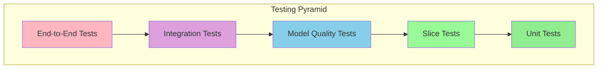
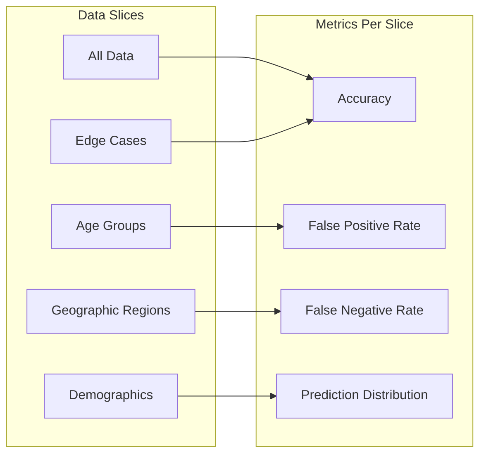
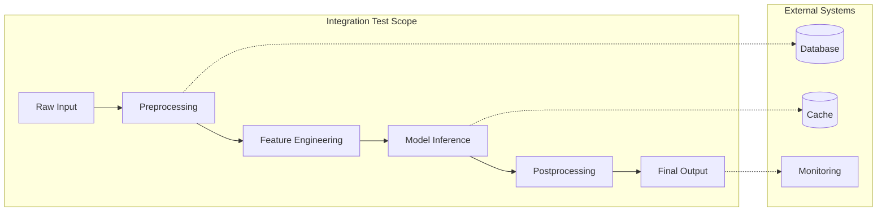
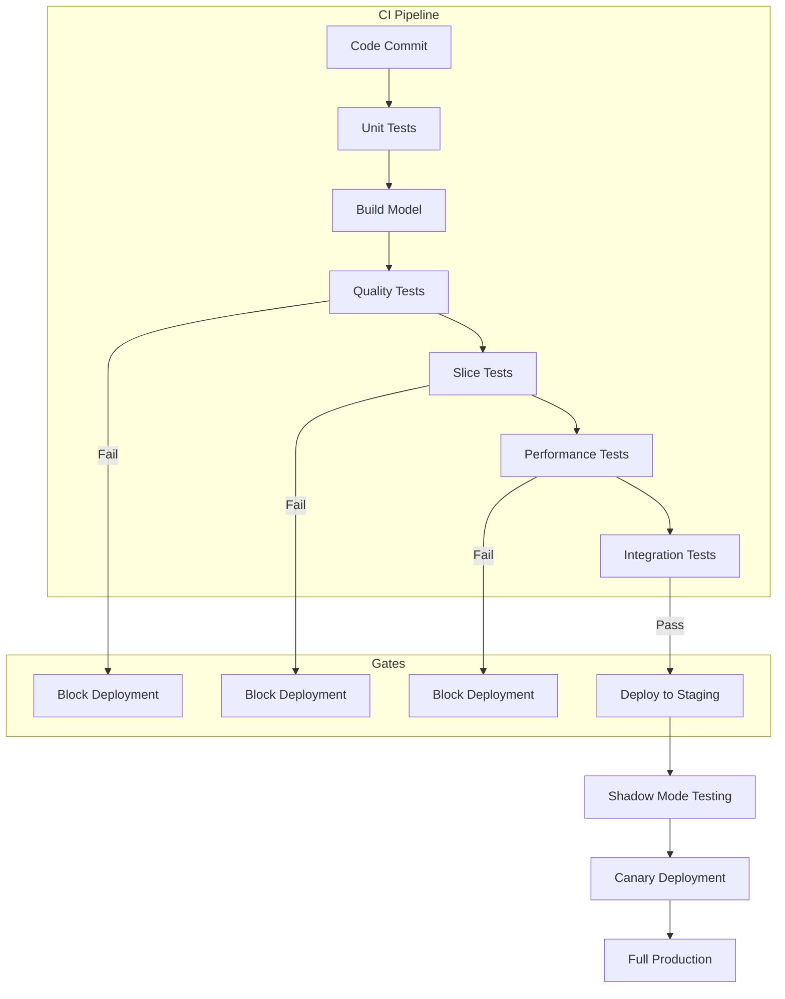

# How to Create Model Testing Strategies

Author: [nawazdhandala](https://github.com/nawazdhandala)

Tags: MLOps, Model Testing, ML Quality, Machine Learning

Description: Learn to create model testing strategies for validating ML model quality before production deployment.

---

Deploying a machine learning model without proper testing is like launching a rocket without pre-flight checks. Models can fail silently, producing plausible but wrong predictions that erode user trust and business value. A comprehensive testing strategy catches these issues before they reach production.

## The ML Testing Pyramid

Traditional software testing uses a pyramid with unit tests at the base, integration tests in the middle, and end-to-end tests at the top. ML testing extends this concept with model-specific layers.



Each layer serves a distinct purpose:

- **Unit Tests**: Verify individual functions and data transformations
- **Slice Tests**: Validate performance across data subgroups
- **Model Quality Tests**: Check accuracy, fairness, and robustness metrics
- **Integration Tests**: Ensure the model works within the larger system
- **End-to-End Tests**: Validate the complete prediction pipeline

## Unit Testing for ML Pipelines

Unit tests verify that individual components behave correctly. In ML, this includes data preprocessing, feature engineering, and model inference functions.

### Testing Data Preprocessing

```python
# tests/test_preprocessing.py
import pytest
import numpy as np
import pandas as pd
from preprocessing import (
    normalize_features,
    encode_categorical,
    handle_missing_values,
    validate_input_schema
)


class TestNormalizeFeatures:
    """Unit tests for the feature normalization function."""

    def test_normalizes_to_zero_mean(self):
        # Arrange: Create sample data with known mean
        data = np.array([[1.0, 2.0], [3.0, 4.0], [5.0, 6.0]])

        # Act: Normalize the features
        normalized, scaler = normalize_features(data)

        # Assert: Mean should be approximately zero
        assert np.allclose(normalized.mean(axis=0), 0, atol=1e-7)

    def test_normalizes_to_unit_variance(self):
        # Arrange: Create sample data
        data = np.array([[1.0, 2.0], [3.0, 4.0], [5.0, 6.0]])

        # Act: Normalize the features
        normalized, scaler = normalize_features(data)

        # Assert: Standard deviation should be approximately one
        assert np.allclose(normalized.std(axis=0), 1, atol=1e-7)

    def test_preserves_shape(self):
        # Arrange: Create data with specific shape
        data = np.array([[1.0, 2.0, 3.0], [4.0, 5.0, 6.0]])

        # Act: Normalize the features
        normalized, _ = normalize_features(data)

        # Assert: Shape should remain unchanged
        assert normalized.shape == data.shape

    def test_handles_single_value_column(self):
        # Arrange: Create data with constant column
        data = np.array([[1.0, 5.0], [1.0, 6.0], [1.0, 7.0]])

        # Act: Normalize the features
        normalized, _ = normalize_features(data)

        # Assert: Constant column should become zeros (not NaN)
        assert not np.isnan(normalized).any()


class TestEncodeCategorical:
    """Unit tests for categorical encoding."""

    def test_encodes_known_categories(self):
        # Arrange: Create categorical data
        data = pd.DataFrame({'color': ['red', 'blue', 'green', 'red']})
        known_categories = ['red', 'blue', 'green', 'yellow']

        # Act: Encode the categorical features
        encoded = encode_categorical(data, 'color', known_categories)

        # Assert: Should have correct number of columns
        assert encoded.shape[1] == len(known_categories)

    def test_handles_unknown_category_gracefully(self):
        # Arrange: Create data with unknown category
        data = pd.DataFrame({'color': ['red', 'purple']})  # purple is unknown
        known_categories = ['red', 'blue', 'green']

        # Act: Encode with unknown category handling
        encoded = encode_categorical(
            data, 'color', known_categories, handle_unknown='ignore'
        )

        # Assert: Unknown category should produce zero vector
        assert encoded.iloc[1].sum() == 0


class TestHandleMissingValues:
    """Unit tests for missing value handling."""

    def test_fills_numeric_with_median(self):
        # Arrange: Create data with missing values
        data = pd.DataFrame({'value': [1.0, 2.0, np.nan, 4.0, 5.0]})

        # Act: Handle missing values
        filled = handle_missing_values(data, strategy='median')

        # Assert: NaN should be replaced with median (3.0)
        assert filled['value'].iloc[2] == 3.0
        assert not filled['value'].isna().any()

    def test_raises_on_all_missing_column(self):
        # Arrange: Create column with all missing values
        data = pd.DataFrame({'value': [np.nan, np.nan, np.nan]})

        # Act & Assert: Should raise informative error
        with pytest.raises(ValueError, match="all values missing"):
            handle_missing_values(data, strategy='median')


class TestValidateInputSchema:
    """Unit tests for input schema validation."""

    def test_accepts_valid_schema(self):
        # Arrange: Create valid input data
        data = pd.DataFrame({
            'feature_a': [1.0, 2.0],
            'feature_b': [3.0, 4.0],
            'category': ['x', 'y']
        })
        expected_schema = {
            'feature_a': 'float64',
            'feature_b': 'float64',
            'category': 'object'
        }

        # Act & Assert: Should not raise
        validate_input_schema(data, expected_schema)  # No exception

    def test_rejects_missing_column(self):
        # Arrange: Create data missing required column
        data = pd.DataFrame({'feature_a': [1.0, 2.0]})
        expected_schema = {'feature_a': 'float64', 'feature_b': 'float64'}

        # Act & Assert: Should raise for missing column
        with pytest.raises(ValueError, match="missing column.*feature_b"):
            validate_input_schema(data, expected_schema)

    def test_rejects_wrong_dtype(self):
        # Arrange: Create data with wrong type
        data = pd.DataFrame({'feature_a': ['not', 'numeric']})
        expected_schema = {'feature_a': 'float64'}

        # Act & Assert: Should raise for wrong dtype
        with pytest.raises(TypeError, match="expected float64"):
            validate_input_schema(data, expected_schema)
```

### Testing Feature Engineering

```python
# tests/test_feature_engineering.py
import pytest
import pandas as pd
import numpy as np
from features import (
    create_time_features,
    create_interaction_features,
    apply_feature_pipeline
)


class TestTimeFeatures:
    """Unit tests for time-based feature extraction."""

    def test_extracts_hour_of_day(self):
        # Arrange: Create timestamp data
        data = pd.DataFrame({
            'timestamp': pd.to_datetime(['2024-01-15 14:30:00', '2024-01-15 23:45:00'])
        })

        # Act: Extract time features
        result = create_time_features(data, 'timestamp')

        # Assert: Hour should be extracted correctly
        assert result['hour'].tolist() == [14, 23]

    def test_extracts_day_of_week(self):
        # Arrange: Create data spanning multiple days
        data = pd.DataFrame({
            'timestamp': pd.to_datetime(['2024-01-15', '2024-01-21'])  # Mon, Sun
        })

        # Act: Extract time features
        result = create_time_features(data, 'timestamp')

        # Assert: Day of week should be correct (0=Monday, 6=Sunday)
        assert result['day_of_week'].tolist() == [0, 6]

    def test_creates_is_weekend_flag(self):
        # Arrange: Create weekday and weekend timestamps
        data = pd.DataFrame({
            'timestamp': pd.to_datetime(['2024-01-15', '2024-01-20'])  # Mon, Sat
        })

        # Act: Extract time features
        result = create_time_features(data, 'timestamp')

        # Assert: Weekend flag should be correct
        assert result['is_weekend'].tolist() == [False, True]


class TestInteractionFeatures:
    """Unit tests for feature interactions."""

    def test_creates_product_interaction(self):
        # Arrange: Create numeric features
        data = pd.DataFrame({'a': [2.0, 3.0], 'b': [4.0, 5.0]})

        # Act: Create interaction features
        result = create_interaction_features(data, [('a', 'b', 'multiply')])

        # Assert: Product should be computed correctly
        assert result['a_x_b'].tolist() == [8.0, 15.0]

    def test_creates_ratio_interaction(self):
        # Arrange: Create numeric features
        data = pd.DataFrame({'a': [10.0, 20.0], 'b': [2.0, 4.0]})

        # Act: Create ratio interaction
        result = create_interaction_features(data, [('a', 'b', 'divide')])

        # Assert: Ratio should be computed correctly
        assert result['a_div_b'].tolist() == [5.0, 5.0]

    def test_handles_division_by_zero(self):
        # Arrange: Create data with zero in denominator
        data = pd.DataFrame({'a': [10.0, 20.0], 'b': [0.0, 4.0]})

        # Act: Create ratio interaction with zero handling
        result = create_interaction_features(
            data, [('a', 'b', 'divide')], handle_zero='replace_nan'
        )

        # Assert: Division by zero should produce NaN, not infinity
        assert np.isnan(result['a_div_b'].iloc[0])
        assert result['a_div_b'].iloc[1] == 5.0


class TestFeaturePipeline:
    """Integration tests for the complete feature pipeline."""

    def test_pipeline_is_deterministic(self):
        # Arrange: Create sample data
        data = pd.DataFrame({
            'timestamp': pd.to_datetime(['2024-01-15 14:30:00']),
            'value_a': [10.0],
            'value_b': [2.0]
        })

        # Act: Run pipeline twice
        result1 = apply_feature_pipeline(data)
        result2 = apply_feature_pipeline(data)

        # Assert: Results should be identical
        pd.testing.assert_frame_equal(result1, result2)

    def test_pipeline_produces_expected_columns(self):
        # Arrange: Create sample data
        data = pd.DataFrame({
            'timestamp': pd.to_datetime(['2024-01-15 14:30:00']),
            'value_a': [10.0],
            'value_b': [2.0]
        })
        expected_columns = [
            'value_a', 'value_b', 'hour', 'day_of_week',
            'is_weekend', 'value_a_x_value_b'
        ]

        # Act: Run the pipeline
        result = apply_feature_pipeline(data)

        # Assert: All expected columns should be present
        for col in expected_columns:
            assert col in result.columns, f"Missing column: {col}"
```

## Slice Testing for Model Fairness

Slice tests evaluate model performance on specific subgroups of data. This helps detect hidden biases and ensures the model works well for all users.



### Implementing Slice Tests

```python
# tests/test_model_slices.py
import pytest
import pandas as pd
import numpy as np
from sklearn.metrics import accuracy_score, precision_score, recall_score
from typing import Dict, List, Callable


class SliceTestFramework:
    """Framework for running model tests on data slices."""

    def __init__(self, model, data: pd.DataFrame, target_col: str):
        """
        Initialize the slice testing framework.

        Args:
            model: Trained ML model with predict method
            data: Test dataset with features and target
            target_col: Name of the target column
        """
        self.model = model
        self.data = data
        self.target_col = target_col
        self.predictions = None
        self._generate_predictions()

    def _generate_predictions(self):
        """Generate predictions for all data once."""
        features = self.data.drop(columns=[self.target_col])
        self.predictions = self.model.predict(features)
        self.data = self.data.copy()
        self.data['_prediction'] = self.predictions

    def evaluate_slice(
        self,
        slice_condition: Callable[[pd.DataFrame], pd.Series],
        metrics: Dict[str, Callable]
    ) -> Dict[str, float]:
        """
        Evaluate metrics on a specific data slice.

        Args:
            slice_condition: Function that returns boolean mask for slice
            metrics: Dictionary of metric_name -> metric_function

        Returns:
            Dictionary of metric results for this slice
        """
        # Apply slice condition to get subset
        mask = slice_condition(self.data)
        slice_data = self.data[mask]

        if len(slice_data) == 0:
            return {name: np.nan for name in metrics}

        # Calculate each metric on the slice
        results = {}
        y_true = slice_data[self.target_col]
        y_pred = slice_data['_prediction']

        for name, metric_fn in metrics.items():
            try:
                results[name] = metric_fn(y_true, y_pred)
            except Exception as e:
                results[name] = np.nan

        return results

    def run_slice_tests(
        self,
        slices: Dict[str, Callable],
        metrics: Dict[str, Callable],
        thresholds: Dict[str, float]
    ) -> List[Dict]:
        """
        Run tests across all slices and check thresholds.

        Args:
            slices: Dictionary of slice_name -> slice_condition
            metrics: Dictionary of metric_name -> metric_function
            thresholds: Minimum acceptable value for each metric

        Returns:
            List of test results with pass/fail status
        """
        results = []

        for slice_name, slice_condition in slices.items():
            slice_metrics = self.evaluate_slice(slice_condition, metrics)

            for metric_name, value in slice_metrics.items():
                passed = value >= thresholds.get(metric_name, 0)
                results.append({
                    'slice': slice_name,
                    'metric': metric_name,
                    'value': value,
                    'threshold': thresholds.get(metric_name),
                    'passed': passed
                })

        return results


class TestModelSlices:
    """Slice tests for the trained model."""

    @pytest.fixture
    def slice_framework(self, trained_model, test_data):
        """Create slice testing framework with model and data."""
        return SliceTestFramework(
            model=trained_model,
            data=test_data,
            target_col='target'
        )

    @pytest.fixture
    def standard_metrics(self):
        """Define standard metrics for slice testing."""
        return {
            'accuracy': accuracy_score,
            'precision': lambda y, p: precision_score(y, p, zero_division=0),
            'recall': lambda y, p: recall_score(y, p, zero_division=0)
        }

    def test_performance_by_age_group(self, slice_framework, standard_metrics):
        """Test that model performs well across all age groups."""
        # Define age group slices
        age_slices = {
            'age_18_25': lambda df: (df['age'] >= 18) & (df['age'] < 25),
            'age_25_35': lambda df: (df['age'] >= 25) & (df['age'] < 35),
            'age_35_50': lambda df: (df['age'] >= 35) & (df['age'] < 50),
            'age_50_plus': lambda df: df['age'] >= 50
        }

        # Set minimum thresholds
        thresholds = {'accuracy': 0.80, 'precision': 0.75, 'recall': 0.75}

        # Run slice tests
        results = slice_framework.run_slice_tests(
            age_slices, standard_metrics, thresholds
        )

        # Assert all tests pass
        failures = [r for r in results if not r['passed']]
        assert len(failures) == 0, f"Failed slice tests: {failures}"

    def test_performance_by_region(self, slice_framework, standard_metrics):
        """Test that model performs consistently across geographic regions."""
        # Define regional slices
        region_slices = {
            'north_america': lambda df: df['region'] == 'NA',
            'europe': lambda df: df['region'] == 'EU',
            'asia_pacific': lambda df: df['region'] == 'APAC',
            'latin_america': lambda df: df['region'] == 'LATAM'
        }

        thresholds = {'accuracy': 0.78, 'precision': 0.70, 'recall': 0.70}

        results = slice_framework.run_slice_tests(
            region_slices, standard_metrics, thresholds
        )

        failures = [r for r in results if not r['passed']]
        assert len(failures) == 0, f"Regional performance gaps: {failures}"

    def test_performance_disparity_between_groups(self, slice_framework):
        """Test that performance disparity between groups is within limits."""
        # Define demographic slices
        group_a = lambda df: df['demographic_group'] == 'A'
        group_b = lambda df: df['demographic_group'] == 'B'

        # Calculate accuracy for each group
        metrics = {'accuracy': accuracy_score}

        results_a = slice_framework.evaluate_slice(group_a, metrics)
        results_b = slice_framework.evaluate_slice(group_b, metrics)

        # Calculate disparity
        disparity = abs(results_a['accuracy'] - results_b['accuracy'])

        # Assert disparity is within acceptable range (5%)
        assert disparity < 0.05, (
            f"Accuracy disparity between groups too high: {disparity:.2%}"
        )

    def test_edge_case_handling(self, slice_framework, standard_metrics):
        """Test model behavior on edge cases."""
        edge_slices = {
            'high_value_transactions': lambda df: df['amount'] > df['amount'].quantile(0.99),
            'zero_history_users': lambda df: df['history_length'] == 0,
            'missing_optional_fields': lambda df: df['optional_field'].isna(),
            'extreme_feature_values': lambda df: (
                (df['feature_x'] < df['feature_x'].quantile(0.01)) |
                (df['feature_x'] > df['feature_x'].quantile(0.99))
            )
        }

        # Edge cases may have lower thresholds but should still work
        thresholds = {'accuracy': 0.70, 'precision': 0.65, 'recall': 0.65}

        results = slice_framework.run_slice_tests(
            edge_slices, standard_metrics, thresholds
        )

        failures = [r for r in results if not r['passed']]
        assert len(failures) == 0, f"Edge case failures: {failures}"
```

## Model Quality Tests

Model quality tests verify that the model meets accuracy, calibration, and robustness requirements.

```python
# tests/test_model_quality.py
import pytest
import numpy as np
from sklearn.metrics import (
    accuracy_score,
    roc_auc_score,
    mean_squared_error,
    calibration_curve
)
from sklearn.calibration import calibration_curve
import scipy.stats as stats


class TestModelAccuracy:
    """Tests for model accuracy metrics."""

    def test_accuracy_exceeds_baseline(self, model, test_data, test_labels):
        """Model accuracy should exceed a simple baseline."""
        # Calculate model accuracy
        predictions = model.predict(test_data)
        model_accuracy = accuracy_score(test_labels, predictions)

        # Calculate baseline (most frequent class)
        baseline_accuracy = max(
            (test_labels == 0).mean(),
            (test_labels == 1).mean()
        )

        # Model should beat baseline by at least 10%
        assert model_accuracy > baseline_accuracy + 0.10, (
            f"Model accuracy {model_accuracy:.2%} does not sufficiently "
            f"exceed baseline {baseline_accuracy:.2%}"
        )

    def test_auc_score_acceptable(self, model, test_data, test_labels):
        """AUC-ROC should meet minimum threshold."""
        # Get probability predictions
        probabilities = model.predict_proba(test_data)[:, 1]
        auc = roc_auc_score(test_labels, probabilities)

        # AUC should be at least 0.80
        assert auc >= 0.80, f"AUC {auc:.3f} below threshold 0.80"

    def test_no_performance_regression(
        self, model, test_data, test_labels, previous_metrics
    ):
        """Model should not regress compared to previous version."""
        # Calculate current metrics
        predictions = model.predict(test_data)
        current_accuracy = accuracy_score(test_labels, predictions)

        # Allow 2% tolerance for random variation
        tolerance = 0.02
        min_acceptable = previous_metrics['accuracy'] - tolerance

        assert current_accuracy >= min_acceptable, (
            f"Performance regression detected: "
            f"current={current_accuracy:.2%}, "
            f"previous={previous_metrics['accuracy']:.2%}"
        )


class TestModelCalibration:
    """Tests for probability calibration."""

    def test_calibration_error(self, model, test_data, test_labels):
        """Predicted probabilities should be well-calibrated."""
        # Get probability predictions
        probabilities = model.predict_proba(test_data)[:, 1]

        # Calculate calibration curve
        prob_true, prob_pred = calibration_curve(
            test_labels, probabilities, n_bins=10, strategy='uniform'
        )

        # Calculate Expected Calibration Error (ECE)
        bin_counts = np.histogram(probabilities, bins=10, range=(0, 1))[0]
        ece = np.sum(
            np.abs(prob_true - prob_pred) * bin_counts / len(probabilities)
        )

        # ECE should be below 0.05 for well-calibrated model
        assert ece < 0.05, f"Calibration error {ece:.3f} exceeds threshold 0.05"

    def test_confidence_reliability(self, model, test_data, test_labels):
        """High-confidence predictions should be more accurate."""
        probabilities = model.predict_proba(test_data)
        max_probs = np.max(probabilities, axis=1)
        predictions = model.predict(test_data)

        # Split into confidence buckets
        high_conf_mask = max_probs >= 0.90
        medium_conf_mask = (max_probs >= 0.70) & (max_probs < 0.90)
        low_conf_mask = max_probs < 0.70

        # Calculate accuracy for each bucket
        high_acc = accuracy_score(
            test_labels[high_conf_mask], predictions[high_conf_mask]
        ) if high_conf_mask.sum() > 0 else 0

        medium_acc = accuracy_score(
            test_labels[medium_conf_mask], predictions[medium_conf_mask]
        ) if medium_conf_mask.sum() > 0 else 0

        low_acc = accuracy_score(
            test_labels[low_conf_mask], predictions[low_conf_mask]
        ) if low_conf_mask.sum() > 0 else 0

        # High confidence should have highest accuracy
        assert high_acc >= medium_acc >= low_acc, (
            f"Confidence not reliable: high={high_acc:.2%}, "
            f"medium={medium_acc:.2%}, low={low_acc:.2%}"
        )


class TestModelRobustness:
    """Tests for model robustness to perturbations."""

    def test_invariance_to_small_perturbations(self, model, test_data):
        """Small input changes should not drastically change predictions."""
        # Get original predictions
        original_probs = model.predict_proba(test_data)

        # Add small Gaussian noise to numeric features
        noise_scale = 0.01  # 1% of feature scale
        noisy_data = test_data.copy()
        numeric_cols = test_data.select_dtypes(include=[np.number]).columns

        for col in numeric_cols:
            std = test_data[col].std()
            noise = np.random.normal(0, noise_scale * std, len(test_data))
            noisy_data[col] = test_data[col] + noise

        # Get perturbed predictions
        perturbed_probs = model.predict_proba(noisy_data)

        # Calculate average probability change
        prob_change = np.abs(original_probs - perturbed_probs).mean()

        # Average change should be small
        assert prob_change < 0.05, (
            f"Model too sensitive to small perturbations: "
            f"avg probability change = {prob_change:.3f}"
        )

    def test_prediction_stability(self, model, test_data):
        """Multiple predictions on same input should be identical."""
        # Run prediction multiple times
        predictions = [model.predict(test_data) for _ in range(5)]

        # All predictions should be identical
        for i in range(1, len(predictions)):
            assert np.array_equal(predictions[0], predictions[i]), (
                "Model predictions are not deterministic"
            )

    def test_handles_out_of_distribution_gracefully(self, model, test_data):
        """Model should handle OOD inputs without crashing."""
        # Create out-of-distribution data
        ood_data = test_data.copy()
        numeric_cols = test_data.select_dtypes(include=[np.number]).columns

        for col in numeric_cols:
            # Set values far outside training distribution
            ood_data[col] = test_data[col].max() * 10

        # Should not raise exception
        try:
            predictions = model.predict(ood_data)
            probabilities = model.predict_proba(ood_data)

            # Predictions should still be valid
            assert not np.isnan(predictions).any(), "NaN in predictions"
            assert not np.isnan(probabilities).any(), "NaN in probabilities"
            assert (probabilities >= 0).all() and (probabilities <= 1).all(), (
                "Probabilities out of [0, 1] range"
            )
        except Exception as e:
            pytest.fail(f"Model crashed on OOD input: {e}")
```

## Integration Testing

Integration tests verify that the model works correctly within the larger system, including data pipelines and serving infrastructure.



### Integration Test Implementation

```python
# tests/test_integration.py
import pytest
import json
import time
from datetime import datetime
from prediction_service import PredictionService
from data_pipeline import DataPipeline
from model_registry import ModelRegistry


class TestEndToEndPipeline:
    """Integration tests for the complete prediction pipeline."""

    @pytest.fixture
    def prediction_service(self):
        """Initialize the prediction service with all components."""
        return PredictionService(
            model_path='models/production/model_v2.pkl',
            config_path='config/production.yaml'
        )

    def test_raw_input_to_prediction(self, prediction_service):
        """Test complete flow from raw input to final prediction."""
        # Arrange: Create realistic raw input
        raw_input = {
            'user_id': 'user_12345',
            'timestamp': '2024-01-15T14:30:00Z',
            'transaction_amount': 150.00,
            'merchant_category': 'retail',
            'device_type': 'mobile',
            'location': {'lat': 40.7128, 'lon': -74.0060}
        }

        # Act: Run full prediction pipeline
        result = prediction_service.predict(raw_input)

        # Assert: Result has expected structure
        assert 'prediction' in result
        assert 'probability' in result
        assert 'model_version' in result
        assert 'timestamp' in result

        # Prediction should be valid
        assert result['prediction'] in [0, 1, 'low_risk', 'high_risk']
        assert 0 <= result['probability'] <= 1

    def test_batch_prediction_consistency(self, prediction_service):
        """Batch predictions should match individual predictions."""
        # Arrange: Create batch of inputs
        inputs = [
            {'user_id': f'user_{i}', 'amount': 100 + i * 10}
            for i in range(10)
        ]

        # Act: Get batch and individual predictions
        batch_results = prediction_service.predict_batch(inputs)
        individual_results = [prediction_service.predict(inp) for inp in inputs]

        # Assert: Results should match
        for batch_res, ind_res in zip(batch_results, individual_results):
            assert batch_res['prediction'] == ind_res['prediction']
            assert abs(batch_res['probability'] - ind_res['probability']) < 1e-6

    def test_handles_missing_optional_fields(self, prediction_service):
        """Pipeline should handle missing optional fields gracefully."""
        # Arrange: Input with only required fields
        minimal_input = {
            'user_id': 'user_minimal',
            'transaction_amount': 100.00
        }

        # Act: Should not raise
        result = prediction_service.predict(minimal_input)

        # Assert: Valid prediction returned
        assert 'prediction' in result
        assert result['prediction'] is not None

    def test_rejects_invalid_input(self, prediction_service):
        """Pipeline should reject and report invalid inputs."""
        # Arrange: Invalid input (negative amount)
        invalid_input = {
            'user_id': 'user_invalid',
            'transaction_amount': -50.00  # Invalid: negative
        }

        # Act & Assert: Should raise validation error
        with pytest.raises(ValueError, match="transaction_amount"):
            prediction_service.predict(invalid_input)


class TestModelServing:
    """Integration tests for model serving infrastructure."""

    @pytest.fixture
    def model_server(self):
        """Start local model server for testing."""
        from model_server import start_test_server
        server = start_test_server(port=8080)
        yield server
        server.shutdown()

    def test_http_endpoint_responds(self, model_server):
        """Model server HTTP endpoint should respond correctly."""
        import requests

        # Arrange: Prepare request
        url = 'http://localhost:8080/predict'
        payload = {
            'user_id': 'test_user',
            'transaction_amount': 100.00
        }
        headers = {'Content-Type': 'application/json'}

        # Act: Make HTTP request
        response = requests.post(url, json=payload, headers=headers)

        # Assert: Response is successful
        assert response.status_code == 200
        result = response.json()
        assert 'prediction' in result

    def test_latency_under_threshold(self, model_server):
        """Prediction latency should be under SLA threshold."""
        import requests

        url = 'http://localhost:8080/predict'
        payload = {'user_id': 'test', 'transaction_amount': 100.00}

        latencies = []
        for _ in range(100):
            start = time.time()
            requests.post(url, json=payload)
            latencies.append(time.time() - start)

        # P95 latency should be under 100ms
        p95_latency = sorted(latencies)[95] * 1000  # Convert to ms
        assert p95_latency < 100, f"P95 latency {p95_latency:.1f}ms exceeds 100ms"

    def test_handles_concurrent_requests(self, model_server):
        """Server should handle concurrent requests without errors."""
        import requests
        from concurrent.futures import ThreadPoolExecutor, as_completed

        url = 'http://localhost:8080/predict'

        def make_request(i):
            payload = {'user_id': f'user_{i}', 'transaction_amount': 100.00}
            response = requests.post(url, json=payload)
            return response.status_code

        # Send 50 concurrent requests
        with ThreadPoolExecutor(max_workers=50) as executor:
            futures = [executor.submit(make_request, i) for i in range(50)]
            results = [f.result() for f in as_completed(futures)]

        # All requests should succeed
        assert all(status == 200 for status in results)


class TestDataPipelineIntegration:
    """Integration tests for data pipeline components."""

    @pytest.fixture
    def data_pipeline(self):
        """Initialize the data pipeline."""
        return DataPipeline(config_path='config/pipeline.yaml')

    def test_pipeline_output_matches_model_input_schema(self, data_pipeline):
        """Pipeline output should match expected model input schema."""
        # Arrange: Get sample raw data
        raw_data = data_pipeline.fetch_sample_data(n=100)

        # Act: Run through pipeline
        processed_data = data_pipeline.process(raw_data)

        # Assert: Schema matches model expectations
        expected_columns = [
            'feature_1', 'feature_2', 'feature_3',
            'category_encoded', 'time_hour', 'time_day_of_week'
        ]

        for col in expected_columns:
            assert col in processed_data.columns, f"Missing column: {col}"

        # Check dtypes
        assert processed_data['feature_1'].dtype == np.float64
        assert processed_data['category_encoded'].dtype == np.int64

    def test_pipeline_handles_data_drift_detection(self, data_pipeline):
        """Pipeline should detect and flag data drift."""
        # Arrange: Create data with drift
        normal_data = data_pipeline.fetch_sample_data(n=1000)
        drifted_data = normal_data.copy()
        drifted_data['feature_1'] = drifted_data['feature_1'] * 3 + 100  # Shift

        # Act: Run drift detection
        drift_report = data_pipeline.check_drift(
            reference_data=normal_data,
            current_data=drifted_data
        )

        # Assert: Drift should be detected
        assert drift_report['drift_detected'] is True
        assert 'feature_1' in drift_report['drifted_features']
```

## Performance Testing

Performance tests ensure the model meets latency, throughput, and resource requirements.

```python
# tests/test_performance.py
import pytest
import time
import psutil
import numpy as np
from concurrent.futures import ThreadPoolExecutor
import tracemalloc


class TestInferenceLatency:
    """Tests for model inference latency."""

    def test_single_prediction_latency(self, model, sample_input):
        """Single prediction should complete within latency budget."""
        latencies = []

        # Warm up
        for _ in range(10):
            model.predict([sample_input])

        # Measure latency
        for _ in range(1000):
            start = time.perf_counter()
            model.predict([sample_input])
            latencies.append(time.perf_counter() - start)

        # Calculate percentiles
        p50 = np.percentile(latencies, 50) * 1000  # ms
        p95 = np.percentile(latencies, 95) * 1000
        p99 = np.percentile(latencies, 99) * 1000

        # Assert latency requirements
        assert p50 < 10, f"P50 latency {p50:.2f}ms exceeds 10ms"
        assert p95 < 25, f"P95 latency {p95:.2f}ms exceeds 25ms"
        assert p99 < 50, f"P99 latency {p99:.2f}ms exceeds 50ms"

    def test_batch_prediction_latency(self, model, sample_batch):
        """Batch prediction should scale efficiently."""
        batch_sizes = [1, 10, 100, 1000]
        latencies = {}

        for size in batch_sizes:
            batch = sample_batch[:size]

            # Measure latency
            times = []
            for _ in range(100):
                start = time.perf_counter()
                model.predict(batch)
                times.append(time.perf_counter() - start)

            latencies[size] = np.median(times) * 1000  # ms

        # Latency should scale sub-linearly
        # 1000x batch should not take 1000x time
        scaling_factor = latencies[1000] / latencies[1]
        assert scaling_factor < 100, (
            f"Batch scaling factor {scaling_factor:.1f}x is too high"
        )


class TestThroughput:
    """Tests for model throughput under load."""

    def test_sustained_throughput(self, model, sample_batch):
        """Model should maintain throughput over sustained period."""
        batch_size = 100
        duration_seconds = 30
        batch = sample_batch[:batch_size]

        predictions_count = 0
        start_time = time.time()

        while time.time() - start_time < duration_seconds:
            model.predict(batch)
            predictions_count += batch_size

        elapsed = time.time() - start_time
        throughput = predictions_count / elapsed

        # Should sustain at least 1000 predictions/second
        assert throughput >= 1000, (
            f"Throughput {throughput:.0f}/s below minimum 1000/s"
        )

    def test_concurrent_request_handling(self, model, sample_input):
        """Model should handle concurrent requests efficiently."""
        num_workers = 10
        requests_per_worker = 100

        def make_predictions():
            for _ in range(requests_per_worker):
                model.predict([sample_input])
            return requests_per_worker

        start = time.time()
        with ThreadPoolExecutor(max_workers=num_workers) as executor:
            futures = [executor.submit(make_predictions) for _ in range(num_workers)]
            total_predictions = sum(f.result() for f in futures)
        elapsed = time.time() - start

        concurrent_throughput = total_predictions / elapsed

        # Concurrent throughput should be at least 50% of sequential
        # (accounting for GIL and threading overhead)
        assert concurrent_throughput >= 500, (
            f"Concurrent throughput {concurrent_throughput:.0f}/s too low"
        )


class TestMemoryUsage:
    """Tests for model memory consumption."""

    def test_model_memory_footprint(self, model):
        """Model should not exceed memory budget."""
        import sys

        # Get model size in memory
        model_size_mb = sys.getsizeof(model) / (1024 * 1024)

        # Model should be under 500MB
        assert model_size_mb < 500, (
            f"Model size {model_size_mb:.1f}MB exceeds 500MB limit"
        )

    def test_no_memory_leak_on_repeated_inference(self, model, sample_batch):
        """Repeated inference should not leak memory."""
        tracemalloc.start()

        # Run many predictions
        for _ in range(1000):
            model.predict(sample_batch)

        # Get memory stats
        current, peak = tracemalloc.get_traced_memory()
        tracemalloc.stop()

        current_mb = current / (1024 * 1024)
        peak_mb = peak / (1024 * 1024)

        # Memory growth should be minimal
        # Peak should not be more than 2x current (allowing for temporary allocations)
        assert peak_mb < current_mb * 2, (
            f"Memory leak detected: current={current_mb:.1f}MB, peak={peak_mb:.1f}MB"
        )

    def test_batch_memory_scaling(self, model, sample_batch):
        """Memory usage should scale linearly with batch size."""
        import tracemalloc

        memory_usage = {}

        for batch_size in [10, 100, 1000]:
            batch = sample_batch[:batch_size]

            tracemalloc.start()
            model.predict(batch)
            current, _ = tracemalloc.get_traced_memory()
            tracemalloc.stop()

            memory_usage[batch_size] = current / (1024 * 1024)  # MB

        # Memory should scale approximately linearly
        # 100x batch should use less than 100x memory (due to overhead)
        scaling_100x = memory_usage[1000] / memory_usage[10]
        assert scaling_100x < 50, (
            f"Memory scaling factor {scaling_100x:.1f}x for 100x batch is too high"
        )
```

## Validation Framework Setup

A complete validation framework integrates all test types into a CI/CD pipeline.



### Pytest Configuration

```python
# conftest.py
import pytest
import pandas as pd
import numpy as np
import joblib
import yaml


def pytest_addoption(parser):
    """Add custom command line options for model testing."""
    parser.addoption(
        "--model-path",
        action="store",
        default="models/latest/model.pkl",
        help="Path to the model file to test"
    )
    parser.addoption(
        "--test-data-path",
        action="store",
        default="data/test/test_data.parquet",
        help="Path to test dataset"
    )
    parser.addoption(
        "--baseline-metrics-path",
        action="store",
        default="metrics/baseline.yaml",
        help="Path to baseline metrics for regression testing"
    )


@pytest.fixture(scope="session")
def model(request):
    """Load the model under test."""
    model_path = request.config.getoption("--model-path")
    return joblib.load(model_path)


@pytest.fixture(scope="session")
def test_data(request):
    """Load the test dataset."""
    data_path = request.config.getoption("--test-data-path")
    return pd.read_parquet(data_path)


@pytest.fixture(scope="session")
def test_labels(test_data):
    """Extract labels from test data."""
    return test_data['target'].values


@pytest.fixture(scope="session")
def test_features(test_data):
    """Extract features from test data."""
    return test_data.drop(columns=['target'])


@pytest.fixture(scope="session")
def previous_metrics(request):
    """Load baseline metrics for regression testing."""
    metrics_path = request.config.getoption("--baseline-metrics-path")
    with open(metrics_path) as f:
        return yaml.safe_load(f)


@pytest.fixture(scope="session")
def sample_input(test_features):
    """Get a single sample input for latency testing."""
    return test_features.iloc[0:1]


@pytest.fixture(scope="session")
def sample_batch(test_features):
    """Get a batch of samples for throughput testing."""
    return test_features.iloc[:1000]


# Test markers for selective execution
def pytest_configure(config):
    """Register custom markers."""
    config.addinivalue_line("markers", "unit: Unit tests")
    config.addinivalue_line("markers", "integration: Integration tests")
    config.addinivalue_line("markers", "performance: Performance tests")
    config.addinivalue_line("markers", "slice: Slice/fairness tests")
    config.addinivalue_line("markers", "quality: Model quality tests")
    config.addinivalue_line("markers", "slow: Slow running tests")
```

### CI/CD Pipeline Configuration

```yaml
# .github/workflows/model-validation.yml
name: Model Validation Pipeline

on:
  push:
    paths:
      - 'models/**'
      - 'src/**'
      - 'tests/**'
  pull_request:
    branches: [main]

jobs:
  unit-tests:
    runs-on: ubuntu-latest
    steps:
      - uses: actions/checkout@v4

      - name: Set up Python
        uses: actions/setup-python@v5
        with:
          python-version: '3.11'

      - name: Install dependencies
        run: |
          pip install -r requirements.txt
          pip install pytest pytest-cov

      - name: Run unit tests
        run: |
          pytest tests/ -m unit -v --cov=src --cov-report=xml

      - name: Upload coverage
        uses: codecov/codecov-action@v4
        with:
          files: coverage.xml

  model-quality-tests:
    needs: unit-tests
    runs-on: ubuntu-latest
    steps:
      - uses: actions/checkout@v4

      - name: Download model artifact
        uses: actions/download-artifact@v4
        with:
          name: trained-model
          path: models/

      - name: Download test data
        run: |
          aws s3 cp s3://ml-data/test/test_data.parquet data/test/

      - name: Run quality tests
        run: |
          pytest tests/test_model_quality.py -v \
            --model-path=models/model.pkl \
            --test-data-path=data/test/test_data.parquet \
            --baseline-metrics-path=metrics/baseline.yaml

      - name: Check quality gates
        run: |
          python scripts/check_quality_gates.py \
            --metrics-output=metrics/current.yaml \
            --thresholds-config=config/quality_thresholds.yaml

  slice-tests:
    needs: model-quality-tests
    runs-on: ubuntu-latest
    steps:
      - uses: actions/checkout@v4

      - name: Run slice tests
        run: |
          pytest tests/test_model_slices.py -v \
            --model-path=models/model.pkl \
            --test-data-path=data/test/test_data.parquet

      - name: Generate fairness report
        run: |
          python scripts/generate_fairness_report.py \
            --output=reports/fairness_report.html

  performance-tests:
    needs: slice-tests
    runs-on: ubuntu-latest
    steps:
      - uses: actions/checkout@v4

      - name: Run performance tests
        run: |
          pytest tests/test_performance.py -v -m "not slow" \
            --model-path=models/model.pkl

      - name: Upload performance report
        uses: actions/upload-artifact@v4
        with:
          name: performance-report
          path: reports/performance/

  integration-tests:
    needs: performance-tests
    runs-on: ubuntu-latest
    services:
      redis:
        image: redis:7
        ports:
          - 6379:6379
    steps:
      - uses: actions/checkout@v4

      - name: Start model server
        run: |
          python -m model_server --port 8080 &
          sleep 10

      - name: Run integration tests
        run: |
          pytest tests/test_integration.py -v

      - name: Test API contract
        run: |
          python scripts/test_api_contract.py \
            --schema=api/openapi.yaml \
            --endpoint=http://localhost:8080

  deploy-staging:
    needs: integration-tests
    if: github.ref == 'refs/heads/main'
    runs-on: ubuntu-latest
    steps:
      - name: Deploy to staging
        run: |
          kubectl apply -f k8s/staging/

      - name: Run smoke tests
        run: |
          python scripts/smoke_tests.py --env=staging
```

## Testing Best Practices Summary

1. **Start with unit tests** for all data transformations and feature engineering functions. These run fast and catch bugs early.

2. **Implement slice tests** to detect performance disparities across user segments. Fairness issues often hide in aggregate metrics.

3. **Set quality gates** with specific thresholds for accuracy, calibration, and robustness. Block deployments that fail these gates.

4. **Performance test early** in development. Latency requirements influence model architecture choices.

5. **Test the full pipeline**, not just the model. Integration bugs between components are common failure modes.

6. **Automate everything** in CI/CD. Manual testing does not scale and introduces human error.

7. **Version your test data** alongside your model. Tests are only meaningful if the data is reproducible.

8. **Monitor tests in production** with shadow mode and canary deployments. Some issues only appear at scale.

---

A comprehensive testing strategy transforms ML deployment from a leap of faith into an engineering discipline. The investment in testing infrastructure pays dividends through faster iteration cycles, fewer production incidents, and higher confidence in model quality. Start with the basics, measure what matters, and build up your testing pyramid layer by layer.
