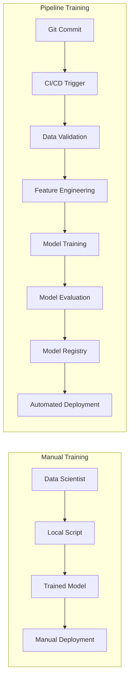
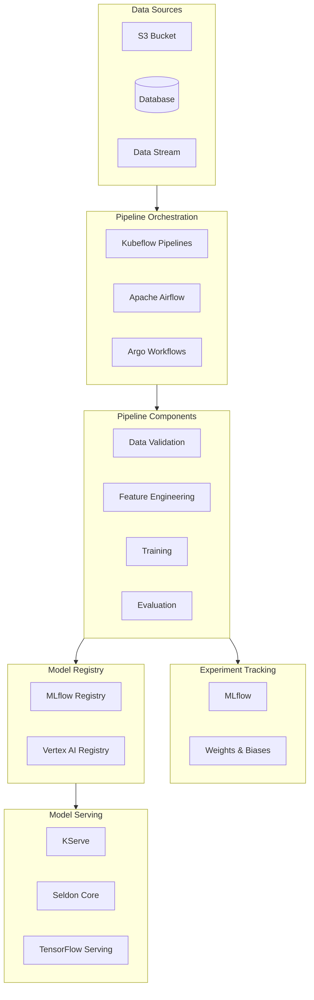
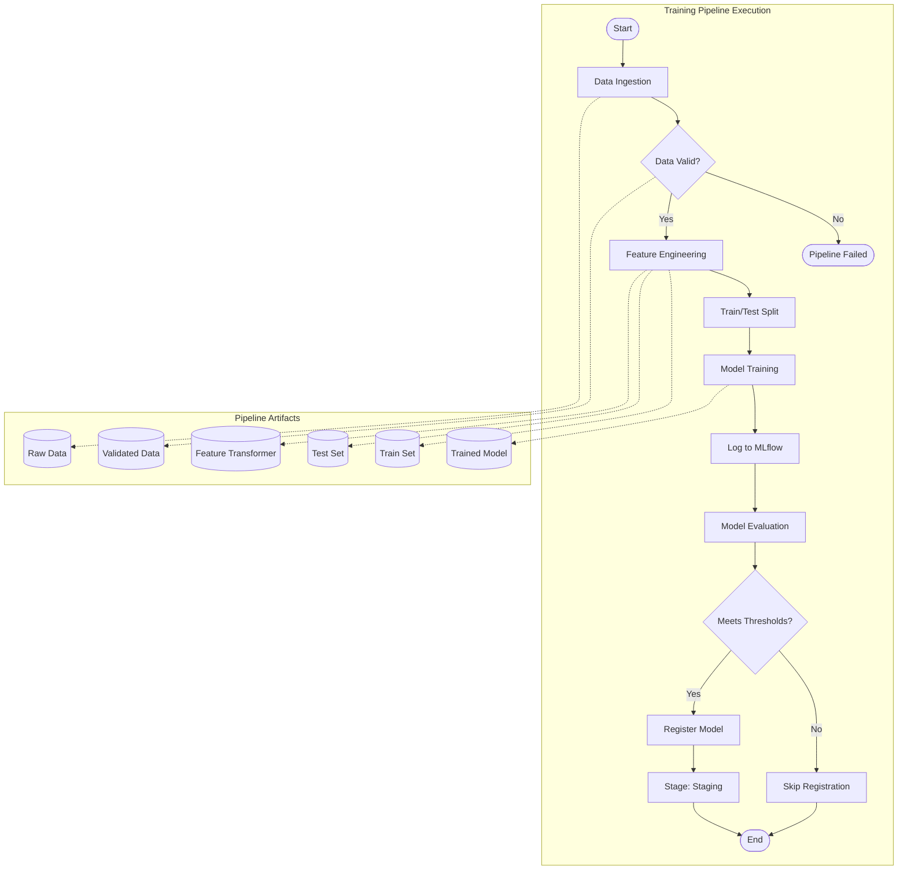
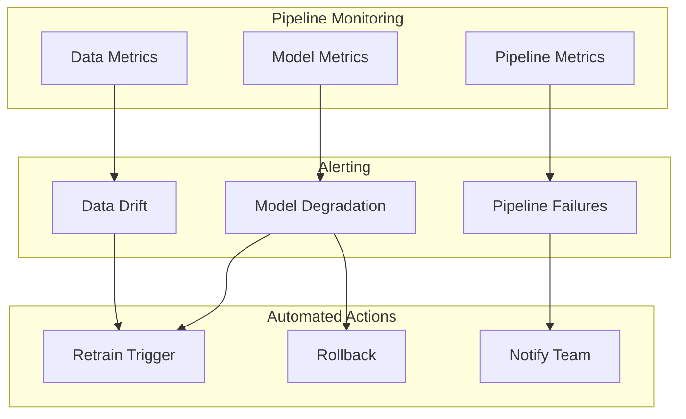

# How to Create Model Training Pipelines

Author: [nawazdhandala](https://github.com/nawazdhandala)

Tags: MLOps, Training Pipeline, Kubeflow, Machine Learning

Description: Learn to create model training pipelines for reproducible and scalable ML model development.

---

Training ML models manually does not scale. You run a script locally, tweak hyperparameters, forget what worked, and lose reproducibility. Model training pipelines solve this by turning ad-hoc experiments into automated, versioned, and auditable workflows.

This guide covers building production-grade training pipelines using Kubeflow Pipelines and MLflow, with practical code examples you can adapt to your ML projects.

## Why Training Pipelines Matter



Training pipelines provide:

1. **Reproducibility** - Same inputs always produce same outputs
2. **Scalability** - Train on large datasets without local constraints
3. **Versioning** - Track every experiment, dataset, and model
4. **Automation** - Trigger training on new data or code changes
5. **Auditability** - Full lineage from data to deployed model

## Pipeline Architecture Overview



## Setting Up Kubeflow Pipelines

Kubeflow Pipelines (KFP) is the most widely adopted framework for ML pipelines on Kubernetes. It provides a Python SDK to define pipelines as code.

### Installation

```bash
# Install Kubeflow Pipelines on an existing Kubernetes cluster
export PIPELINE_VERSION=2.0.5

kubectl apply -k "github.com/kubeflow/pipelines/manifests/kustomize/cluster-scoped-resources?ref=$PIPELINE_VERSION"
kubectl wait --for condition=established --timeout=60s crd/applications.app.k8s.io

kubectl apply -k "github.com/kubeflow/pipelines/manifests/kustomize/env/platform-agnostic?ref=$PIPELINE_VERSION"
```

### Install the Python SDK

```bash
# Install KFP SDK v2
pip install kfp==2.5.0

# Verify installation
python -c "import kfp; print(kfp.__version__)"
```

## Building Your First Training Pipeline

Let's build a complete training pipeline for a classification model. We will create modular components that can be reused across projects.

### Project Structure

```
ml-pipeline/
├── components/
│   ├── data_ingestion.py
│   ├── data_validation.py
│   ├── feature_engineering.py
│   ├── model_training.py
│   └── model_evaluation.py
├── pipelines/
│   └── training_pipeline.py
├── config/
│   └── pipeline_config.yaml
├── requirements.txt
└── Dockerfile
```

### Component 1: Data Ingestion

```python
# components/data_ingestion.py
"""
Data Ingestion Component
Fetches data from source and prepares it for the pipeline.
"""

from kfp import dsl
from kfp.dsl import Dataset, Output


@dsl.component(
    base_image="python:3.10-slim",
    packages_to_install=["pandas==2.1.0", "pyarrow==14.0.0", "boto3==1.34.0"]
)
def ingest_data(
    source_uri: str,
    output_dataset: Output[Dataset],
    sample_fraction: float = 1.0
) -> dict:
    """
    Ingest data from a source URI (S3, GCS, or local path).

    Args:
        source_uri: Path to the source data (s3://bucket/path or local path)
        output_dataset: Output artifact for the ingested dataset
        sample_fraction: Fraction of data to sample (useful for testing)

    Returns:
        Dictionary containing ingestion metadata
    """
    import pandas as pd
    import json
    from datetime import datetime

    print(f"Ingesting data from: {source_uri}")

    # Read data from source
    # Supports CSV, Parquet, and JSON formats
    if source_uri.endswith(".parquet"):
        df = pd.read_parquet(source_uri)
    elif source_uri.endswith(".json"):
        df = pd.read_json(source_uri)
    else:
        df = pd.read_csv(source_uri)

    # Apply sampling if specified
    if sample_fraction < 1.0:
        df = df.sample(frac=sample_fraction, random_state=42)
        print(f"Sampled {sample_fraction * 100}% of data")

    # Save to output path as Parquet for efficiency
    df.to_parquet(output_dataset.path, index=False)

    # Return metadata about the ingestion
    metadata = {
        "rows": len(df),
        "columns": len(df.columns),
        "column_names": list(df.columns),
        "ingestion_time": datetime.utcnow().isoformat(),
        "source": source_uri
    }

    print(f"Ingested {metadata['rows']} rows with {metadata['columns']} columns")

    return metadata
```

### Component 2: Data Validation

```python
# components/data_validation.py
"""
Data Validation Component
Validates data quality and schema before training.
"""

from kfp import dsl
from kfp.dsl import Dataset, Input, Output, Artifact


@dsl.component(
    base_image="python:3.10-slim",
    packages_to_install=[
        "pandas==2.1.0",
        "great_expectations==0.18.0",
        "pyarrow==14.0.0"
    ]
)
def validate_data(
    input_dataset: Input[Dataset],
    validation_report: Output[Artifact],
    expected_columns: list,
    min_rows: int = 100,
    max_null_fraction: float = 0.1
) -> dict:
    """
    Validate data quality using Great Expectations.

    Args:
        input_dataset: Input dataset artifact
        validation_report: Output artifact for validation report
        expected_columns: List of columns that must be present
        min_rows: Minimum number of rows required
        max_null_fraction: Maximum allowed fraction of null values

    Returns:
        Dictionary containing validation results

    Raises:
        ValueError: If validation fails critical checks
    """
    import pandas as pd
    import json
    import great_expectations as gx
    from great_expectations.core.batch import RuntimeBatchRequest

    print("Loading data for validation...")
    df = pd.read_parquet(input_dataset.path)

    validation_results = {
        "passed": True,
        "checks": [],
        "warnings": []
    }

    # Check 1: Minimum row count
    row_check = {
        "name": "minimum_rows",
        "expected": min_rows,
        "actual": len(df),
        "passed": len(df) >= min_rows
    }
    validation_results["checks"].append(row_check)

    if not row_check["passed"]:
        validation_results["passed"] = False
        print(f"FAILED: Expected at least {min_rows} rows, got {len(df)}")

    # Check 2: Required columns present
    missing_columns = set(expected_columns) - set(df.columns)
    column_check = {
        "name": "required_columns",
        "expected": expected_columns,
        "missing": list(missing_columns),
        "passed": len(missing_columns) == 0
    }
    validation_results["checks"].append(column_check)

    if not column_check["passed"]:
        validation_results["passed"] = False
        print(f"FAILED: Missing columns: {missing_columns}")

    # Check 3: Null value fraction
    null_fractions = df.isnull().mean()
    high_null_columns = null_fractions[null_fractions > max_null_fraction].to_dict()
    null_check = {
        "name": "null_fraction",
        "max_allowed": max_null_fraction,
        "violations": high_null_columns,
        "passed": len(high_null_columns) == 0
    }
    validation_results["checks"].append(null_check)

    if not null_check["passed"]:
        validation_results["warnings"].append(
            f"High null fraction in columns: {list(high_null_columns.keys())}"
        )
        print(f"WARNING: High null values detected")

    # Check 4: Data type consistency
    dtype_info = {col: str(dtype) for col, dtype in df.dtypes.items()}
    validation_results["data_types"] = dtype_info

    # Save validation report
    with open(validation_report.path, "w") as f:
        json.dump(validation_results, f, indent=2)

    # Raise error if critical validation fails
    if not validation_results["passed"]:
        raise ValueError(
            f"Data validation failed: {[c['name'] for c in validation_results['checks'] if not c['passed']]}"
        )

    print(f"Validation passed with {len(validation_results['warnings'])} warnings")

    return validation_results
```

### Component 3: Feature Engineering

```python
# components/feature_engineering.py
"""
Feature Engineering Component
Transforms raw data into features suitable for model training.
"""

from kfp import dsl
from kfp.dsl import Dataset, Input, Output


@dsl.component(
    base_image="python:3.10-slim",
    packages_to_install=[
        "pandas==2.1.0",
        "scikit-learn==1.3.0",
        "pyarrow==14.0.0",
        "joblib==1.3.0"
    ]
)
def engineer_features(
    input_dataset: Input[Dataset],
    train_dataset: Output[Dataset],
    test_dataset: Output[Dataset],
    feature_transformer: Output[dsl.Artifact],
    target_column: str,
    numerical_columns: list,
    categorical_columns: list,
    test_size: float = 0.2
) -> dict:
    """
    Apply feature engineering transformations.

    This component:
    1. Splits data into train and test sets
    2. Fits transformers on training data only
    3. Applies transformations to both sets
    4. Saves the transformer for inference

    Args:
        input_dataset: Validated input dataset
        train_dataset: Output training dataset
        test_dataset: Output test dataset
        feature_transformer: Fitted sklearn transformer artifact
        target_column: Name of the target variable
        numerical_columns: List of numerical feature columns
        categorical_columns: List of categorical feature columns
        test_size: Fraction of data for testing

    Returns:
        Dictionary containing feature engineering metadata
    """
    import pandas as pd
    import joblib
    from sklearn.model_selection import train_test_split
    from sklearn.preprocessing import StandardScaler, OneHotEncoder
    from sklearn.compose import ColumnTransformer
    from sklearn.pipeline import Pipeline
    from sklearn.impute import SimpleImputer

    print("Loading validated data...")
    df = pd.read_parquet(input_dataset.path)

    # Separate features and target
    X = df.drop(columns=[target_column])
    y = df[target_column]

    # Split data with stratification for classification
    X_train, X_test, y_train, y_test = train_test_split(
        X, y,
        test_size=test_size,
        random_state=42,
        stratify=y if y.dtype == "object" or y.nunique() < 20 else None
    )

    print(f"Train size: {len(X_train)}, Test size: {len(X_test)}")

    # Build preprocessing pipeline for numerical features
    numerical_transformer = Pipeline(steps=[
        ("imputer", SimpleImputer(strategy="median")),
        ("scaler", StandardScaler())
    ])

    # Build preprocessing pipeline for categorical features
    categorical_transformer = Pipeline(steps=[
        ("imputer", SimpleImputer(strategy="constant", fill_value="missing")),
        ("encoder", OneHotEncoder(handle_unknown="ignore", sparse_output=False))
    ])

    # Combine into a column transformer
    preprocessor = ColumnTransformer(
        transformers=[
            ("num", numerical_transformer, numerical_columns),
            ("cat", categorical_transformer, categorical_columns)
        ],
        remainder="drop"  # Drop columns not specified
    )

    # Fit on training data only
    print("Fitting feature transformer on training data...")
    X_train_transformed = preprocessor.fit_transform(X_train)
    X_test_transformed = preprocessor.transform(X_test)

    # Get feature names after transformation
    feature_names = (
        numerical_columns +
        list(preprocessor.named_transformers_["cat"]
             .named_steps["encoder"]
             .get_feature_names_out(categorical_columns))
    )

    # Create DataFrames with transformed features
    train_df = pd.DataFrame(X_train_transformed, columns=feature_names)
    train_df[target_column] = y_train.values

    test_df = pd.DataFrame(X_test_transformed, columns=feature_names)
    test_df[target_column] = y_test.values

    # Save datasets
    train_df.to_parquet(train_dataset.path, index=False)
    test_df.to_parquet(test_dataset.path, index=False)

    # Save the transformer for inference
    joblib.dump(preprocessor, feature_transformer.path)

    metadata = {
        "train_samples": len(train_df),
        "test_samples": len(test_df),
        "num_features": len(feature_names),
        "feature_names": feature_names,
        "numerical_columns": numerical_columns,
        "categorical_columns": categorical_columns
    }

    print(f"Feature engineering complete: {len(feature_names)} features created")

    return metadata
```

### Component 4: Model Training with MLflow

```python
# components/model_training.py
"""
Model Training Component
Trains the model and logs metrics to MLflow.
"""

from kfp import dsl
from kfp.dsl import Dataset, Input, Output, Model, Metrics


@dsl.component(
    base_image="python:3.10-slim",
    packages_to_install=[
        "pandas==2.1.0",
        "scikit-learn==1.3.0",
        "xgboost==2.0.0",
        "mlflow==2.9.0",
        "pyarrow==14.0.0",
        "joblib==1.3.0"
    ]
)
def train_model(
    train_dataset: Input[Dataset],
    trained_model: Output[Model],
    metrics: Output[Metrics],
    mlflow_tracking_uri: str,
    experiment_name: str,
    target_column: str,
    model_type: str = "xgboost",
    hyperparameters: dict = None
) -> dict:
    """
    Train a classification model with hyperparameter tracking.

    Args:
        train_dataset: Preprocessed training dataset
        trained_model: Output model artifact
        metrics: Output metrics artifact
        mlflow_tracking_uri: URI for MLflow tracking server
        experiment_name: Name of the MLflow experiment
        target_column: Name of the target variable
        model_type: Type of model to train (xgboost, random_forest, logistic)
        hyperparameters: Dictionary of hyperparameters

    Returns:
        Dictionary containing training metadata and run ID
    """
    import pandas as pd
    import joblib
    import mlflow
    from sklearn.ensemble import RandomForestClassifier
    from sklearn.linear_model import LogisticRegression
    from xgboost import XGBClassifier
    from sklearn.metrics import accuracy_score, f1_score, roc_auc_score

    # Default hyperparameters for each model type
    default_params = {
        "xgboost": {
            "n_estimators": 100,
            "max_depth": 6,
            "learning_rate": 0.1,
            "random_state": 42
        },
        "random_forest": {
            "n_estimators": 100,
            "max_depth": 10,
            "random_state": 42
        },
        "logistic": {
            "max_iter": 1000,
            "random_state": 42
        }
    }

    # Merge default and provided hyperparameters
    params = default_params.get(model_type, {})
    if hyperparameters:
        params.update(hyperparameters)

    # Load training data
    print("Loading training data...")
    train_df = pd.read_parquet(train_dataset.path)

    X_train = train_df.drop(columns=[target_column])
    y_train = train_df[target_column]

    # Set up MLflow tracking
    mlflow.set_tracking_uri(mlflow_tracking_uri)
    mlflow.set_experiment(experiment_name)

    # Start MLflow run
    with mlflow.start_run() as run:
        run_id = run.info.run_id
        print(f"MLflow Run ID: {run_id}")

        # Log parameters
        mlflow.log_params(params)
        mlflow.log_param("model_type", model_type)
        mlflow.log_param("training_samples", len(X_train))
        mlflow.log_param("num_features", X_train.shape[1])

        # Initialize model based on type
        if model_type == "xgboost":
            model = XGBClassifier(**params)
        elif model_type == "random_forest":
            model = RandomForestClassifier(**params)
        elif model_type == "logistic":
            model = LogisticRegression(**params)
        else:
            raise ValueError(f"Unknown model type: {model_type}")

        # Train the model
        print(f"Training {model_type} model...")
        model.fit(X_train, y_train)

        # Calculate training metrics
        y_pred = model.predict(X_train)
        y_proba = model.predict_proba(X_train)[:, 1] if hasattr(model, "predict_proba") else None

        train_accuracy = accuracy_score(y_train, y_pred)
        train_f1 = f1_score(y_train, y_pred, average="weighted")
        train_auc = roc_auc_score(y_train, y_proba) if y_proba is not None else 0.0

        # Log metrics to MLflow
        mlflow.log_metric("train_accuracy", train_accuracy)
        mlflow.log_metric("train_f1", train_f1)
        mlflow.log_metric("train_auc", train_auc)

        # Log metrics to KFP
        metrics.log_metric("train_accuracy", train_accuracy)
        metrics.log_metric("train_f1", train_f1)
        metrics.log_metric("train_auc", train_auc)

        # Log feature importance for tree-based models
        if hasattr(model, "feature_importances_"):
            importance_dict = dict(zip(X_train.columns, model.feature_importances_))
            mlflow.log_dict(importance_dict, "feature_importance.json")

        # Save model locally and to MLflow
        joblib.dump(model, trained_model.path)
        mlflow.sklearn.log_model(model, "model")

        print(f"Training complete - Accuracy: {train_accuracy:.4f}, F1: {train_f1:.4f}")

    return {
        "run_id": run_id,
        "model_type": model_type,
        "train_accuracy": train_accuracy,
        "train_f1": train_f1,
        "train_auc": train_auc,
        "hyperparameters": params
    }
```

### Component 5: Model Evaluation

```python
# components/model_evaluation.py
"""
Model Evaluation Component
Evaluates the trained model on test data and determines if it should be deployed.
"""

from kfp import dsl
from kfp.dsl import Dataset, Input, Model, Metrics, Output, Artifact


@dsl.component(
    base_image="python:3.10-slim",
    packages_to_install=[
        "pandas==2.1.0",
        "scikit-learn==1.3.0",
        "matplotlib==3.8.0",
        "mlflow==2.9.0",
        "pyarrow==14.0.0",
        "joblib==1.3.0"
    ]
)
def evaluate_model(
    test_dataset: Input[Dataset],
    trained_model: Input[Model],
    evaluation_report: Output[Artifact],
    confusion_matrix_plot: Output[Artifact],
    metrics: Output[Metrics],
    mlflow_tracking_uri: str,
    mlflow_run_id: str,
    target_column: str,
    accuracy_threshold: float = 0.8,
    f1_threshold: float = 0.75
) -> dict:
    """
    Evaluate model performance on held-out test data.

    Args:
        test_dataset: Preprocessed test dataset
        trained_model: Trained model artifact
        evaluation_report: Output JSON report artifact
        confusion_matrix_plot: Output confusion matrix image
        metrics: Output metrics artifact
        mlflow_tracking_uri: URI for MLflow tracking server
        mlflow_run_id: Run ID to log evaluation metrics
        target_column: Name of the target variable
        accuracy_threshold: Minimum accuracy for deployment approval
        f1_threshold: Minimum F1 score for deployment approval

    Returns:
        Dictionary containing evaluation results and deployment decision
    """
    import pandas as pd
    import joblib
    import json
    import mlflow
    import matplotlib.pyplot as plt
    from sklearn.metrics import (
        accuracy_score,
        f1_score,
        precision_score,
        recall_score,
        roc_auc_score,
        confusion_matrix,
        classification_report
    )

    # Load test data and model
    print("Loading test data and model...")
    test_df = pd.read_parquet(test_dataset.path)
    model = joblib.load(trained_model.path)

    X_test = test_df.drop(columns=[target_column])
    y_test = test_df[target_column]

    # Generate predictions
    y_pred = model.predict(X_test)
    y_proba = model.predict_proba(X_test)[:, 1] if hasattr(model, "predict_proba") else None

    # Calculate metrics
    test_accuracy = accuracy_score(y_test, y_pred)
    test_f1 = f1_score(y_test, y_pred, average="weighted")
    test_precision = precision_score(y_test, y_pred, average="weighted")
    test_recall = recall_score(y_test, y_pred, average="weighted")
    test_auc = roc_auc_score(y_test, y_proba) if y_proba is not None else 0.0

    print(f"Test Accuracy: {test_accuracy:.4f}")
    print(f"Test F1 Score: {test_f1:.4f}")
    print(f"Test AUC: {test_auc:.4f}")

    # Log metrics to KFP
    metrics.log_metric("test_accuracy", test_accuracy)
    metrics.log_metric("test_f1", test_f1)
    metrics.log_metric("test_precision", test_precision)
    metrics.log_metric("test_recall", test_recall)
    metrics.log_metric("test_auc", test_auc)

    # Log to MLflow
    mlflow.set_tracking_uri(mlflow_tracking_uri)
    with mlflow.start_run(run_id=mlflow_run_id):
        mlflow.log_metric("test_accuracy", test_accuracy)
        mlflow.log_metric("test_f1", test_f1)
        mlflow.log_metric("test_precision", test_precision)
        mlflow.log_metric("test_recall", test_recall)
        mlflow.log_metric("test_auc", test_auc)

    # Generate confusion matrix plot
    cm = confusion_matrix(y_test, y_pred)
    fig, ax = plt.subplots(figsize=(8, 6))
    im = ax.imshow(cm, interpolation="nearest", cmap=plt.cm.Blues)
    ax.figure.colorbar(im, ax=ax)
    ax.set(
        xlabel="Predicted label",
        ylabel="True label",
        title="Confusion Matrix"
    )
    plt.tight_layout()
    plt.savefig(confusion_matrix_plot.path)
    plt.close()

    # Determine if model meets deployment criteria
    deployment_approved = (
        test_accuracy >= accuracy_threshold and
        test_f1 >= f1_threshold
    )

    # Create evaluation report
    report = {
        "metrics": {
            "accuracy": test_accuracy,
            "f1_score": test_f1,
            "precision": test_precision,
            "recall": test_recall,
            "auc": test_auc
        },
        "thresholds": {
            "accuracy": accuracy_threshold,
            "f1": f1_threshold
        },
        "deployment_approved": deployment_approved,
        "classification_report": classification_report(y_test, y_pred, output_dict=True),
        "confusion_matrix": cm.tolist(),
        "test_samples": len(y_test)
    }

    with open(evaluation_report.path, "w") as f:
        json.dump(report, f, indent=2)

    if deployment_approved:
        print("Model APPROVED for deployment")
    else:
        print(f"Model REJECTED - did not meet thresholds")
        print(f"  Required: accuracy >= {accuracy_threshold}, f1 >= {f1_threshold}")
        print(f"  Actual: accuracy = {test_accuracy:.4f}, f1 = {test_f1:.4f}")

    return {
        "deployment_approved": deployment_approved,
        "test_accuracy": test_accuracy,
        "test_f1": test_f1,
        "test_auc": test_auc
    }
```

### Component 6: Model Registration

```python
# components/model_registration.py
"""
Model Registration Component
Registers approved models to the MLflow Model Registry.
"""

from kfp import dsl
from kfp.dsl import Model, Input, Artifact


@dsl.component(
    base_image="python:3.10-slim",
    packages_to_install=[
        "mlflow==2.9.0",
        "joblib==1.3.0"
    ]
)
def register_model(
    trained_model: Input[Model],
    feature_transformer: Input[Artifact],
    mlflow_tracking_uri: str,
    mlflow_run_id: str,
    model_name: str,
    deployment_approved: bool,
    model_description: str = ""
) -> dict:
    """
    Register an approved model to MLflow Model Registry.

    Args:
        trained_model: Trained model artifact
        feature_transformer: Feature transformer artifact
        mlflow_tracking_uri: URI for MLflow tracking server
        mlflow_run_id: Run ID of the training run
        model_name: Name for the registered model
        deployment_approved: Whether model passed evaluation
        model_description: Optional description for the model

    Returns:
        Dictionary containing registration details
    """
    import mlflow
    from mlflow.tracking import MlflowClient

    if not deployment_approved:
        print("Model not approved for deployment - skipping registration")
        return {
            "registered": False,
            "reason": "Model did not pass evaluation thresholds"
        }

    mlflow.set_tracking_uri(mlflow_tracking_uri)
    client = MlflowClient()

    # Register the model from the training run
    model_uri = f"runs:/{mlflow_run_id}/model"

    print(f"Registering model: {model_name}")
    print(f"Model URI: {model_uri}")

    # Register model
    model_version = mlflow.register_model(
        model_uri=model_uri,
        name=model_name
    )

    # Add description and tags
    client.update_model_version(
        name=model_name,
        version=model_version.version,
        description=model_description
    )

    # Tag the version
    client.set_model_version_tag(
        name=model_name,
        version=model_version.version,
        key="validation_status",
        value="approved"
    )

    # Transition to staging
    client.transition_model_version_stage(
        name=model_name,
        version=model_version.version,
        stage="Staging"
    )

    print(f"Model registered as version {model_version.version}")
    print(f"Model transitioned to Staging")

    return {
        "registered": True,
        "model_name": model_name,
        "version": model_version.version,
        "stage": "Staging",
        "run_id": mlflow_run_id
    }
```

## Assembling the Complete Pipeline

Now let's combine all components into a complete training pipeline.

```python
# pipelines/training_pipeline.py
"""
Complete Model Training Pipeline
Orchestrates the full ML training workflow from data ingestion to model registration.
"""

from kfp import dsl
from kfp import compiler

# Import components
from components.data_ingestion import ingest_data
from components.data_validation import validate_data
from components.feature_engineering import engineer_features
from components.model_training import train_model
from components.model_evaluation import evaluate_model
from components.model_registration import register_model


@dsl.pipeline(
    name="Model Training Pipeline",
    description="End-to-end ML training pipeline with data validation, feature engineering, training, evaluation, and model registration."
)
def training_pipeline(
    # Data parameters
    source_uri: str,
    target_column: str,
    numerical_columns: list,
    categorical_columns: list,

    # Validation parameters
    expected_columns: list,
    min_rows: int = 1000,

    # Training parameters
    model_type: str = "xgboost",
    hyperparameters: dict = None,

    # MLflow parameters
    mlflow_tracking_uri: str = "http://mlflow:5000",
    experiment_name: str = "training-pipeline",
    model_name: str = "classifier",

    # Evaluation thresholds
    accuracy_threshold: float = 0.8,
    f1_threshold: float = 0.75
):
    """
    Complete training pipeline that:
    1. Ingests data from a source URI
    2. Validates data quality and schema
    3. Engineers features with train/test split
    4. Trains a model with MLflow tracking
    5. Evaluates the model on test data
    6. Registers approved models to MLflow Model Registry
    """

    # Step 1: Ingest data from source
    ingest_task = ingest_data(
        source_uri=source_uri
    )

    # Step 2: Validate data quality
    validate_task = validate_data(
        input_dataset=ingest_task.outputs["output_dataset"],
        expected_columns=expected_columns,
        min_rows=min_rows
    )

    # Step 3: Engineer features
    feature_task = engineer_features(
        input_dataset=ingest_task.outputs["output_dataset"],
        target_column=target_column,
        numerical_columns=numerical_columns,
        categorical_columns=categorical_columns
    )
    # Ensure validation passes before feature engineering
    feature_task.after(validate_task)

    # Step 4: Train model
    train_task = train_model(
        train_dataset=feature_task.outputs["train_dataset"],
        mlflow_tracking_uri=mlflow_tracking_uri,
        experiment_name=experiment_name,
        target_column=target_column,
        model_type=model_type,
        hyperparameters=hyperparameters
    )

    # Step 5: Evaluate model
    eval_task = evaluate_model(
        test_dataset=feature_task.outputs["test_dataset"],
        trained_model=train_task.outputs["trained_model"],
        mlflow_tracking_uri=mlflow_tracking_uri,
        mlflow_run_id=train_task.outputs["Output"]["run_id"],
        target_column=target_column,
        accuracy_threshold=accuracy_threshold,
        f1_threshold=f1_threshold
    )

    # Step 6: Register model if approved
    register_task = register_model(
        trained_model=train_task.outputs["trained_model"],
        feature_transformer=feature_task.outputs["feature_transformer"],
        mlflow_tracking_uri=mlflow_tracking_uri,
        mlflow_run_id=train_task.outputs["Output"]["run_id"],
        model_name=model_name,
        deployment_approved=eval_task.outputs["Output"]["deployment_approved"]
    )


# Compile the pipeline
if __name__ == "__main__":
    compiler.Compiler().compile(
        pipeline_func=training_pipeline,
        package_path="training_pipeline.yaml"
    )
    print("Pipeline compiled to training_pipeline.yaml")
```

## Pipeline Execution Flow



## Running the Pipeline

### Option 1: Submit via KFP Client

```python
# submit_pipeline.py
"""
Script to submit the training pipeline to Kubeflow Pipelines.
"""

from kfp import Client

# Initialize the KFP client
client = Client(host="http://kubeflow-pipelines:8888")

# Define pipeline parameters
pipeline_params = {
    "source_uri": "s3://ml-data/customer_churn/data.parquet",
    "target_column": "churned",
    "numerical_columns": ["age", "tenure", "monthly_charges", "total_charges"],
    "categorical_columns": ["gender", "contract_type", "payment_method"],
    "expected_columns": [
        "age", "tenure", "monthly_charges", "total_charges",
        "gender", "contract_type", "payment_method", "churned"
    ],
    "min_rows": 5000,
    "model_type": "xgboost",
    "hyperparameters": {
        "n_estimators": 200,
        "max_depth": 8,
        "learning_rate": 0.05
    },
    "mlflow_tracking_uri": "http://mlflow:5000",
    "experiment_name": "customer-churn-prediction",
    "model_name": "churn-classifier",
    "accuracy_threshold": 0.85,
    "f1_threshold": 0.80
}

# Create a run from the compiled pipeline
run = client.create_run_from_pipeline_package(
    pipeline_file="training_pipeline.yaml",
    arguments=pipeline_params,
    run_name="churn-model-training-v1",
    experiment_name="churn-prediction"
)

print(f"Pipeline run created: {run.run_id}")
print(f"View at: http://kubeflow-pipelines:8888/#/runs/details/{run.run_id}")
```

### Option 2: Scheduled Recurring Runs

```python
# schedule_pipeline.py
"""
Schedule recurring pipeline runs for continuous training.
"""

from kfp import Client
from kfp.client import RecurringRunsApi

client = Client(host="http://kubeflow-pipelines:8888")

# Get the experiment
experiment = client.get_experiment(experiment_name="churn-prediction")

# Create a recurring run (daily at 2 AM)
recurring_run = client.create_recurring_run(
    experiment_id=experiment.experiment_id,
    job_name="daily-churn-training",
    pipeline_package_path="training_pipeline.yaml",
    cron_expression="0 2 * * *",  # Daily at 2 AM UTC
    max_concurrency=1,
    no_catchup=True,
    params={
        "source_uri": "s3://ml-data/customer_churn/latest.parquet",
        "target_column": "churned",
        # ... other parameters
    }
)

print(f"Recurring run created: {recurring_run.id}")
```

## MLflow Experiment Tracking Deep Dive

MLflow provides comprehensive experiment tracking capabilities. Here is how to maximize its value in your pipelines.

### Setting Up MLflow

```yaml
# kubernetes/mlflow-deployment.yaml
apiVersion: apps/v1
kind: Deployment
metadata:
  name: mlflow
  namespace: mlops
spec:
  replicas: 1
  selector:
    matchLabels:
      app: mlflow
  template:
    metadata:
      labels:
        app: mlflow
    spec:
      containers:
        - name: mlflow
          image: ghcr.io/mlflow/mlflow:v2.9.0
          ports:
            - containerPort: 5000
          env:
            # Use PostgreSQL for backend store
            - name: BACKEND_STORE_URI
              valueFrom:
                secretKeyRef:
                  name: mlflow-secrets
                  key: backend-store-uri
            # Use S3 for artifact store
            - name: DEFAULT_ARTIFACT_ROOT
              value: "s3://mlflow-artifacts"
            - name: AWS_ACCESS_KEY_ID
              valueFrom:
                secretKeyRef:
                  name: mlflow-secrets
                  key: aws-access-key
            - name: AWS_SECRET_ACCESS_KEY
              valueFrom:
                secretKeyRef:
                  name: mlflow-secrets
                  key: aws-secret-key
          command:
            - mlflow
            - server
            - --host=0.0.0.0
            - --port=5000
            - --backend-store-uri=$(BACKEND_STORE_URI)
            - --default-artifact-root=$(DEFAULT_ARTIFACT_ROOT)
---
apiVersion: v1
kind: Service
metadata:
  name: mlflow
  namespace: mlops
spec:
  selector:
    app: mlflow
  ports:
    - port: 5000
      targetPort: 5000
```

### Advanced MLflow Tracking

```python
# utils/mlflow_utils.py
"""
MLflow utility functions for enhanced experiment tracking.
"""

import mlflow
from mlflow.tracking import MlflowClient
import pandas as pd
import matplotlib.pyplot as plt
from typing import Dict, List, Any


def log_dataset_profile(
    df: pd.DataFrame,
    dataset_name: str,
    run_id: str = None
):
    """
    Log dataset statistics and profile to MLflow.

    Args:
        df: DataFrame to profile
        dataset_name: Name for the dataset artifact
        run_id: Optional run ID (uses active run if not provided)
    """
    profile = {
        "rows": len(df),
        "columns": len(df.columns),
        "memory_mb": df.memory_usage(deep=True).sum() / 1024 / 1024,
        "dtypes": df.dtypes.astype(str).to_dict(),
        "null_counts": df.isnull().sum().to_dict(),
        "numeric_stats": df.describe().to_dict()
    }

    if run_id:
        with mlflow.start_run(run_id=run_id):
            mlflow.log_dict(profile, f"{dataset_name}_profile.json")
    else:
        mlflow.log_dict(profile, f"{dataset_name}_profile.json")


def log_model_comparison(
    experiment_name: str,
    metric_name: str = "test_accuracy",
    top_n: int = 10
) -> pd.DataFrame:
    """
    Compare models across runs in an experiment.

    Args:
        experiment_name: Name of the MLflow experiment
        metric_name: Metric to compare
        top_n: Number of top runs to return

    Returns:
        DataFrame with run comparison
    """
    client = MlflowClient()
    experiment = client.get_experiment_by_name(experiment_name)

    runs = client.search_runs(
        experiment_ids=[experiment.experiment_id],
        order_by=[f"metrics.{metric_name} DESC"],
        max_results=top_n
    )

    comparison = []
    for run in runs:
        comparison.append({
            "run_id": run.info.run_id,
            "run_name": run.info.run_name,
            metric_name: run.data.metrics.get(metric_name),
            "model_type": run.data.params.get("model_type"),
            "duration_minutes": (
                run.info.end_time - run.info.start_time
            ) / 60000 if run.info.end_time else None
        })

    return pd.DataFrame(comparison)


def promote_model_to_production(
    model_name: str,
    version: int,
    archive_existing: bool = True
):
    """
    Promote a model version to production.

    Args:
        model_name: Name of the registered model
        version: Version number to promote
        archive_existing: Whether to archive current production model
    """
    client = MlflowClient()

    if archive_existing:
        # Archive existing production versions
        for mv in client.search_model_versions(f"name='{model_name}'"):
            if mv.current_stage == "Production":
                client.transition_model_version_stage(
                    name=model_name,
                    version=mv.version,
                    stage="Archived"
                )
                print(f"Archived version {mv.version}")

    # Promote new version
    client.transition_model_version_stage(
        name=model_name,
        version=version,
        stage="Production"
    )
    print(f"Promoted version {version} to Production")
```

## Data Validation with Great Expectations

For production pipelines, you need robust data validation. Here is an enhanced validation component using Great Expectations.

```python
# components/advanced_data_validation.py
"""
Advanced Data Validation Component using Great Expectations
"""

from kfp import dsl
from kfp.dsl import Dataset, Input, Output, Artifact


@dsl.component(
    base_image="python:3.10-slim",
    packages_to_install=[
        "pandas==2.1.0",
        "great_expectations==0.18.0",
        "pyarrow==14.0.0"
    ]
)
def advanced_validate_data(
    input_dataset: Input[Dataset],
    validation_report: Output[Artifact],
    expectation_suite_path: str,
    fail_on_warning: bool = False
) -> dict:
    """
    Validate data using a Great Expectations suite.

    Args:
        input_dataset: Input dataset artifact
        validation_report: Output validation report artifact
        expectation_suite_path: Path to GE expectation suite JSON
        fail_on_warning: Whether to fail pipeline on warnings

    Returns:
        Dictionary containing validation results
    """
    import pandas as pd
    import json
    import great_expectations as gx
    from great_expectations.core import ExpectationSuite
    from great_expectations.dataset import PandasDataset

    # Load data
    df = pd.read_parquet(input_dataset.path)

    # Load expectation suite
    with open(expectation_suite_path, "r") as f:
        suite_config = json.load(f)

    # Create Great Expectations dataset
    ge_df = gx.from_pandas(df)

    # Define expectations programmatically if no suite file
    # These are common expectations for ML datasets
    expectations = [
        # No duplicate rows
        ge_df.expect_table_row_count_to_be_between(min_value=100, max_value=10000000),

        # Check for ID column uniqueness
        ge_df.expect_column_values_to_be_unique(column="id") if "id" in df.columns else None,

        # Validate numerical columns are in expected ranges
        *[
            ge_df.expect_column_values_to_be_between(
                column=col,
                min_value=df[col].quantile(0.001),
                max_value=df[col].quantile(0.999),
                mostly=0.99
            )
            for col in df.select_dtypes(include=["number"]).columns
        ],

        # Check for reasonable null rates
        *[
            ge_df.expect_column_values_to_not_be_null(column=col, mostly=0.95)
            for col in df.columns
        ]
    ]

    # Filter None values
    expectations = [e for e in expectations if e is not None]

    # Aggregate results
    failures = [e for e in expectations if not e.success]
    warnings = [e for e in expectations if e.success and e.get("partial_unexpected_list")]

    result = {
        "success": len(failures) == 0,
        "total_expectations": len(expectations),
        "successful": len([e for e in expectations if e.success]),
        "failed": len(failures),
        "warnings": len(warnings),
        "failure_details": [
            {
                "expectation": str(e.expectation_config),
                "observed_value": e.result.get("observed_value")
            }
            for e in failures
        ]
    }

    # Save report
    with open(validation_report.path, "w") as f:
        json.dump(result, f, indent=2, default=str)

    # Determine pass/fail
    if not result["success"]:
        raise ValueError(f"Data validation failed: {len(failures)} expectations failed")

    if fail_on_warning and warnings:
        raise ValueError(f"Data validation warnings: {len(warnings)} warnings detected")

    print(f"Validation passed: {result['successful']}/{result['total_expectations']} expectations")

    return result
```

### Example Expectation Suite

```json
{
  "expectation_suite_name": "customer_churn_suite",
  "expectations": [
    {
      "expectation_type": "expect_table_row_count_to_be_between",
      "kwargs": {
        "min_value": 1000,
        "max_value": 10000000
      }
    },
    {
      "expectation_type": "expect_column_values_to_be_in_set",
      "kwargs": {
        "column": "gender",
        "value_set": ["Male", "Female", "Other", "Prefer not to say"]
      }
    },
    {
      "expectation_type": "expect_column_values_to_be_between",
      "kwargs": {
        "column": "age",
        "min_value": 18,
        "max_value": 120
      }
    },
    {
      "expectation_type": "expect_column_values_to_be_between",
      "kwargs": {
        "column": "tenure",
        "min_value": 0,
        "max_value": 100
      }
    },
    {
      "expectation_type": "expect_column_values_to_not_be_null",
      "kwargs": {
        "column": "churned"
      }
    }
  ]
}
```

## Hyperparameter Tuning Pipeline

Extend your training pipeline with automated hyperparameter tuning.

```python
# pipelines/hyperparameter_tuning_pipeline.py
"""
Hyperparameter Tuning Pipeline
Runs multiple training configurations and selects the best model.
"""

from kfp import dsl
from kfp import compiler
from typing import List


@dsl.component(
    base_image="python:3.10-slim",
    packages_to_install=["optuna==3.5.0", "pandas==2.1.0"]
)
def generate_hyperparameter_configs(
    model_type: str,
    n_trials: int = 10
) -> List[dict]:
    """
    Generate hyperparameter configurations for tuning.

    Args:
        model_type: Type of model (xgboost, random_forest)
        n_trials: Number of configurations to generate

    Returns:
        List of hyperparameter dictionaries
    """
    import optuna

    configs = []

    def objective(trial):
        if model_type == "xgboost":
            config = {
                "n_estimators": trial.suggest_int("n_estimators", 50, 500),
                "max_depth": trial.suggest_int("max_depth", 3, 12),
                "learning_rate": trial.suggest_float("learning_rate", 0.01, 0.3, log=True),
                "subsample": trial.suggest_float("subsample", 0.6, 1.0),
                "colsample_bytree": trial.suggest_float("colsample_bytree", 0.6, 1.0),
                "min_child_weight": trial.suggest_int("min_child_weight", 1, 10)
            }
        elif model_type == "random_forest":
            config = {
                "n_estimators": trial.suggest_int("n_estimators", 50, 500),
                "max_depth": trial.suggest_int("max_depth", 5, 30),
                "min_samples_split": trial.suggest_int("min_samples_split", 2, 20),
                "min_samples_leaf": trial.suggest_int("min_samples_leaf", 1, 10),
                "max_features": trial.suggest_categorical("max_features", ["sqrt", "log2", None])
            }
        else:
            raise ValueError(f"Unknown model type: {model_type}")

        configs.append(config)
        return 0  # Dummy objective

    # Create study just to sample configurations
    study = optuna.create_study()
    study.optimize(objective, n_trials=n_trials, show_progress_bar=False)

    return configs


@dsl.component(
    base_image="python:3.10-slim",
    packages_to_install=["pandas==2.1.0"]
)
def select_best_model(
    evaluation_results: List[dict],
    metric_name: str = "test_f1"
) -> dict:
    """
    Select the best model from hyperparameter tuning results.

    Args:
        evaluation_results: List of evaluation results from each trial
        metric_name: Metric to optimize

    Returns:
        Best model configuration and metrics
    """
    import pandas as pd

    # Convert to DataFrame for easy comparison
    results_df = pd.DataFrame(evaluation_results)

    # Find best result
    best_idx = results_df[metric_name].idxmax()
    best_result = results_df.iloc[best_idx].to_dict()

    print(f"Best model achieved {metric_name}: {best_result[metric_name]:.4f}")
    print(f"Best hyperparameters: {best_result.get('hyperparameters', {})}")

    return best_result


@dsl.pipeline(
    name="Hyperparameter Tuning Pipeline",
    description="Automated hyperparameter search with parallel training runs."
)
def hyperparameter_tuning_pipeline(
    source_uri: str,
    target_column: str,
    numerical_columns: list,
    categorical_columns: list,
    model_type: str = "xgboost",
    n_trials: int = 10,
    mlflow_tracking_uri: str = "http://mlflow:5000",
    experiment_name: str = "hyperparameter-tuning"
):
    """
    Pipeline that:
    1. Generates hyperparameter configurations
    2. Runs training in parallel for each configuration
    3. Evaluates all models
    4. Selects and registers the best model
    """

    # Generate hyperparameter configs
    configs_task = generate_hyperparameter_configs(
        model_type=model_type,
        n_trials=n_trials
    )

    # Run parallel training for each configuration
    with dsl.ParallelFor(
        items=configs_task.output,
        parallelism=5  # Limit concurrent runs
    ) as config:
        # Each iteration trains with different hyperparameters
        train_task = train_model(
            train_dataset=...,  # Connect to your data
            mlflow_tracking_uri=mlflow_tracking_uri,
            experiment_name=experiment_name,
            target_column=target_column,
            model_type=model_type,
            hyperparameters=config
        )


if __name__ == "__main__":
    compiler.Compiler().compile(
        pipeline_func=hyperparameter_tuning_pipeline,
        package_path="hyperparameter_tuning_pipeline.yaml"
    )
```

## CI/CD Integration

Integrate your training pipeline with GitHub Actions for automated retraining.

```yaml
# .github/workflows/ml-pipeline.yaml
name: ML Training Pipeline

on:
  push:
    branches:
      - main
    paths:
      - 'ml-pipeline/**'
      - 'data/**'
  schedule:
    # Run weekly retraining
    - cron: '0 0 * * 0'
  workflow_dispatch:
    inputs:
      model_type:
        description: 'Model type to train'
        required: true
        default: 'xgboost'
        type: choice
        options:
          - xgboost
          - random_forest
          - logistic

env:
  KFP_HOST: ${{ secrets.KFP_HOST }}
  MLFLOW_TRACKING_URI: ${{ secrets.MLFLOW_TRACKING_URI }}

jobs:
  compile-pipeline:
    runs-on: ubuntu-latest
    steps:
      - uses: actions/checkout@v4

      - name: Set up Python
        uses: actions/setup-python@v5
        with:
          python-version: '3.10'

      - name: Install dependencies
        run: |
          pip install kfp==2.5.0
          pip install -r ml-pipeline/requirements.txt

      - name: Compile pipeline
        run: |
          cd ml-pipeline
          python pipelines/training_pipeline.py

      - name: Upload compiled pipeline
        uses: actions/upload-artifact@v4
        with:
          name: compiled-pipeline
          path: ml-pipeline/training_pipeline.yaml

  submit-pipeline:
    needs: compile-pipeline
    runs-on: ubuntu-latest
    steps:
      - uses: actions/checkout@v4

      - name: Download compiled pipeline
        uses: actions/download-artifact@v4
        with:
          name: compiled-pipeline
          path: ml-pipeline/

      - name: Set up Python
        uses: actions/setup-python@v5
        with:
          python-version: '3.10'

      - name: Install KFP client
        run: pip install kfp==2.5.0

      - name: Submit pipeline run
        run: |
          python << 'EOF'
          from kfp import Client

          client = Client(host="${{ env.KFP_HOST }}")

          run = client.create_run_from_pipeline_package(
              pipeline_file="ml-pipeline/training_pipeline.yaml",
              arguments={
                  "source_uri": "s3://ml-data/latest/data.parquet",
                  "target_column": "target",
                  "numerical_columns": ["feature1", "feature2", "feature3"],
                  "categorical_columns": ["cat1", "cat2"],
                  "expected_columns": ["feature1", "feature2", "feature3", "cat1", "cat2", "target"],
                  "model_type": "${{ inputs.model_type || 'xgboost' }}",
                  "mlflow_tracking_uri": "${{ env.MLFLOW_TRACKING_URI }}",
                  "experiment_name": "ci-training-${{ github.run_id }}",
                  "model_name": "production-model"
              },
              run_name="ci-training-${{ github.sha }}"
          )

          print(f"Pipeline run submitted: {run.run_id}")
          EOF

      - name: Wait for pipeline completion
        run: |
          python << 'EOF'
          from kfp import Client
          import time

          client = Client(host="${{ env.KFP_HOST }}")

          # Get the latest run
          runs = client.list_runs(
              experiment_name="ci-training-${{ github.run_id }}",
              page_size=1
          ).runs

          if not runs:
              print("No runs found")
              exit(1)

          run_id = runs[0].id

          # Poll for completion
          while True:
              run = client.get_run(run_id)
              status = run.status

              if status in ["Succeeded"]:
                  print(f"Pipeline succeeded!")
                  break
              elif status in ["Failed", "Error"]:
                  print(f"Pipeline failed with status: {status}")
                  exit(1)

              print(f"Pipeline status: {status}")
              time.sleep(30)
          EOF
```

## Monitoring Training Pipelines

Track pipeline health and model performance over time.



### Pipeline Metrics to Track

```python
# monitoring/pipeline_metrics.py
"""
Metrics collection for training pipeline monitoring.
"""

from prometheus_client import Counter, Histogram, Gauge
import time


# Pipeline execution metrics
PIPELINE_RUNS_TOTAL = Counter(
    "ml_pipeline_runs_total",
    "Total number of pipeline runs",
    ["pipeline_name", "status"]
)

PIPELINE_DURATION_SECONDS = Histogram(
    "ml_pipeline_duration_seconds",
    "Pipeline execution duration",
    ["pipeline_name"],
    buckets=[60, 300, 600, 1800, 3600, 7200, 14400]
)

# Model quality metrics
MODEL_ACCURACY = Gauge(
    "ml_model_accuracy",
    "Model accuracy score",
    ["model_name", "stage"]
)

MODEL_F1_SCORE = Gauge(
    "ml_model_f1_score",
    "Model F1 score",
    ["model_name", "stage"]
)

# Data quality metrics
DATA_ROW_COUNT = Gauge(
    "ml_data_row_count",
    "Number of rows in training data",
    ["dataset_name"]
)

DATA_NULL_RATE = Gauge(
    "ml_data_null_rate",
    "Null value rate in training data",
    ["dataset_name", "column"]
)


def record_pipeline_metrics(
    pipeline_name: str,
    status: str,
    duration_seconds: float,
    model_metrics: dict
):
    """
    Record pipeline execution metrics.

    Args:
        pipeline_name: Name of the pipeline
        status: Execution status (succeeded, failed)
        duration_seconds: Total execution time
        model_metrics: Dictionary of model evaluation metrics
    """
    PIPELINE_RUNS_TOTAL.labels(
        pipeline_name=pipeline_name,
        status=status
    ).inc()

    PIPELINE_DURATION_SECONDS.labels(
        pipeline_name=pipeline_name
    ).observe(duration_seconds)

    if model_metrics:
        MODEL_ACCURACY.labels(
            model_name=pipeline_name,
            stage="validation"
        ).set(model_metrics.get("accuracy", 0))

        MODEL_F1_SCORE.labels(
            model_name=pipeline_name,
            stage="validation"
        ).set(model_metrics.get("f1_score", 0))
```

## Best Practices Summary

### 1. Version Everything

```python
# Always tag runs with versions
mlflow.set_tags({
    "code_version": git_commit_hash,
    "data_version": data_snapshot_id,
    "pipeline_version": pipeline_version
})
```

### 2. Use Caching Wisely

```python
# Enable caching for expensive components
@dsl.component(
    base_image="python:3.10-slim",
    packages_to_install=["pandas"],
    # Cache based on inputs
    caching=True
)
def expensive_preprocessing(...):
    ...
```

### 3. Handle Failures Gracefully

```python
# Add retry logic to components
@dsl.component(
    base_image="python:3.10-slim",
    packages_to_install=["tenacity"]
)
def robust_data_fetch(uri: str) -> str:
    from tenacity import retry, stop_after_attempt, wait_exponential

    @retry(
        stop=stop_after_attempt(3),
        wait=wait_exponential(multiplier=1, min=4, max=60)
    )
    def fetch_with_retry():
        # Fetch logic here
        pass

    return fetch_with_retry()
```

### 4. Parameterize Everything

```yaml
# config/pipeline_config.yaml
data:
  source_uri: s3://ml-data/training/
  target_column: label
  test_size: 0.2

model:
  type: xgboost
  hyperparameters:
    n_estimators: 100
    max_depth: 6
    learning_rate: 0.1

evaluation:
  accuracy_threshold: 0.85
  f1_threshold: 0.80

mlflow:
  tracking_uri: http://mlflow:5000
  experiment_name: production-training
```

### 5. Document Your Pipelines

```python
@dsl.pipeline(
    name="Customer Churn Prediction Pipeline",
    description="""
    Production pipeline for training customer churn prediction models.

    This pipeline:
    1. Ingests daily customer data from S3
    2. Validates data quality using Great Expectations
    3. Engineers features including RFM metrics
    4. Trains an XGBoost classifier
    5. Evaluates on held-out test data
    6. Registers approved models to MLflow

    Triggers: Daily at 2 AM UTC or on data changes
    Owner: ml-team@company.com
    SLA: 4 hours
    """
)
def customer_churn_pipeline(...):
    ...
```

---

Training pipelines transform ML development from artisanal craft to industrial process. Start with a simple pipeline covering data validation and training, then add components as your needs grow. The investment in pipeline infrastructure pays dividends in reproducibility, reliability, and velocity. Every model you train becomes an auditable, repeatable experiment rather than a one-off script execution.
