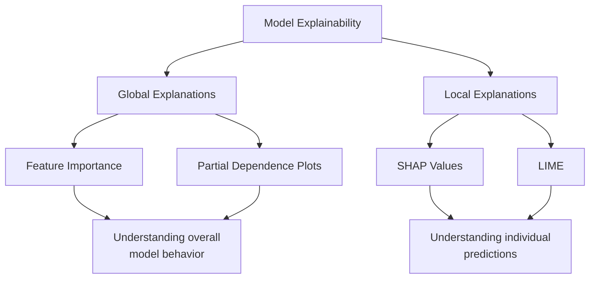
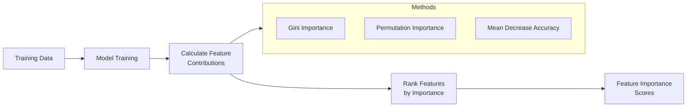
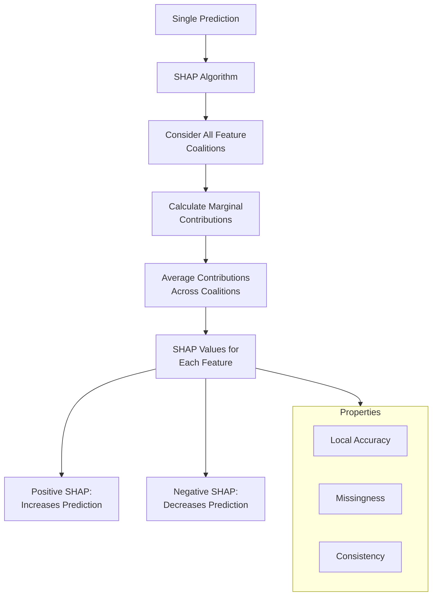
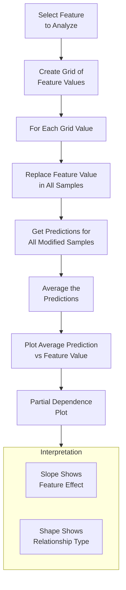
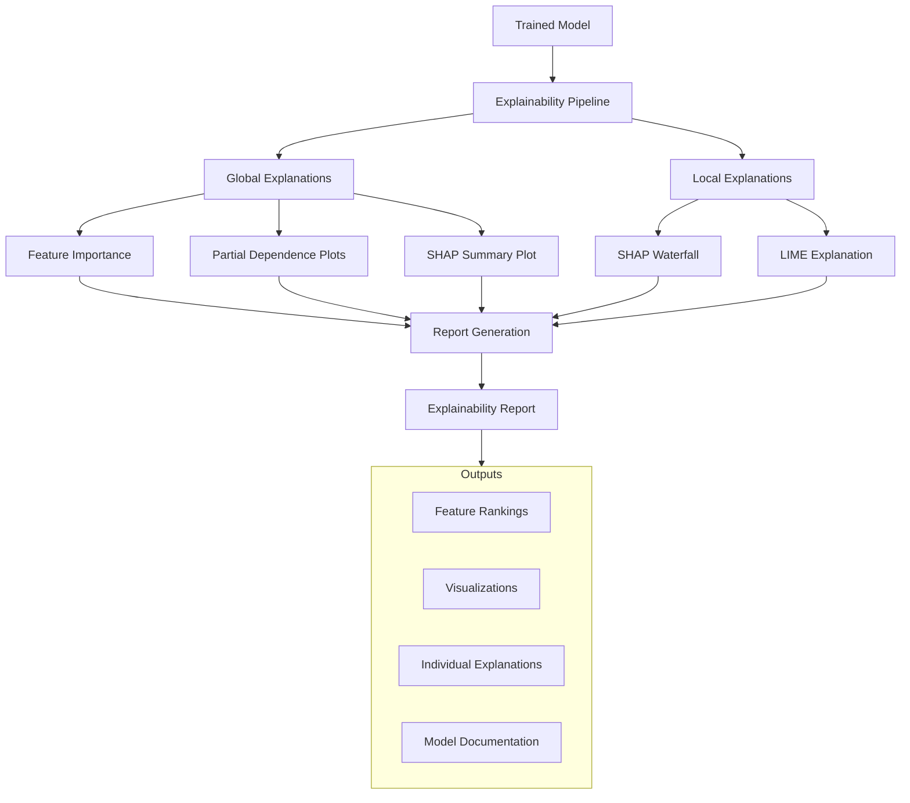
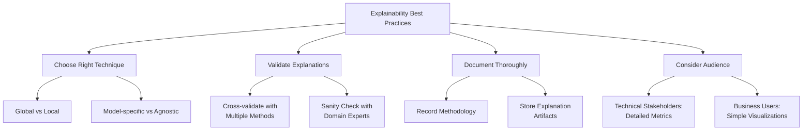

# How to Create Model Explainability

Author: [nawazdhandala](https://github.com/nawazdhandala)

Tags: MLOps, Machine Learning, Explainability, Interpretability

Description: Learn how to make ML models explainable with SHAP, LIME, and feature importance.

---

## Introduction

Machine learning models are powerful tools for making predictions, but their complexity often makes them difficult to understand. Model explainability addresses this challenge by providing insights into how models make decisions. This transparency is essential for building trust, debugging models, ensuring regulatory compliance, and identifying potential biases.

In this post, we will explore four key techniques for model explainability: SHAP (SHapley Additive exPlanations), LIME (Local Interpretable Model-agnostic Explanations), Feature Importance, and Partial Dependence Plots.

## Why Model Explainability Matters

Before diving into the techniques, let us understand why explainability is crucial:

- **Trust**: Stakeholders need to understand why a model makes certain predictions
- **Debugging**: Identifying and fixing model errors becomes easier with explanations
- **Compliance**: Many industries require explainable decisions (healthcare, finance, legal)
- **Fairness**: Detecting and mitigating bias in model predictions
- **Knowledge Discovery**: Understanding underlying patterns in your data

## The Explainability Landscape



## Setting Up the Environment

First, let us install the necessary libraries and prepare our data:

```python
# Install required libraries
# pip install shap lime scikit-learn pandas numpy matplotlib

import numpy as np
import pandas as pd
from sklearn.model_selection import train_test_split
from sklearn.ensemble import RandomForestClassifier, GradientBoostingClassifier
from sklearn.datasets import load_breast_cancer
import matplotlib.pyplot as plt

# Load a sample dataset for demonstration
# We will use the breast cancer dataset which is well suited for classification
data = load_breast_cancer()
X = pd.DataFrame(data.data, columns=data.feature_names)
y = data.target

# Split the data into training and testing sets
# Using 80% for training and 20% for testing
X_train, X_test, y_train, y_test = train_test_split(
    X, y,
    test_size=0.2,
    random_state=42  # Set seed for reproducibility
)

# Train a Random Forest model
# We use 100 trees for good performance without overfitting
model = RandomForestClassifier(
    n_estimators=100,
    max_depth=10,  # Limit depth to prevent overfitting
    random_state=42
)
model.fit(X_train, y_train)

print(f"Model accuracy: {model.score(X_test, y_test):.4f}")
```

## 1. Feature Importance

Feature importance measures how much each feature contributes to the model's predictions. This is a global explanation technique that helps understand the overall model behavior.

### How Feature Importance Works



### Implementation

```python
import numpy as np
import pandas as pd
import matplotlib.pyplot as plt
from sklearn.inspection import permutation_importance

def calculate_feature_importance(model, X_train, y_train, feature_names):
    """
    Calculate and visualize feature importance using multiple methods.

    Parameters:
    -----------
    model : trained sklearn model
        The model to explain
    X_train : array-like
        Training features
    y_train : array-like
        Training labels
    feature_names : list
        Names of the features

    Returns:
    --------
    dict : Dictionary containing importance scores from different methods
    """

    # Method 1: Built-in feature importance (Gini importance for tree models)
    # This measures how much each feature decreases impurity across all trees
    builtin_importance = model.feature_importances_

    # Method 2: Permutation importance
    # This measures the decrease in model performance when a feature is shuffled
    # More reliable than Gini importance as it accounts for feature interactions
    perm_importance = permutation_importance(
        model,
        X_train,
        y_train,
        n_repeats=10,  # Number of times to permute each feature
        random_state=42,
        n_jobs=-1  # Use all available CPU cores
    )

    # Create a DataFrame for easy visualization
    importance_df = pd.DataFrame({
        'feature': feature_names,
        'gini_importance': builtin_importance,
        'permutation_importance': perm_importance.importances_mean,
        'permutation_std': perm_importance.importances_std
    })

    # Sort by permutation importance (more reliable metric)
    importance_df = importance_df.sort_values(
        'permutation_importance',
        ascending=False
    )

    return importance_df

# Calculate feature importance
importance_results = calculate_feature_importance(
    model,
    X_train,
    y_train,
    X.columns.tolist()
)

# Display top 10 most important features
print("Top 10 Most Important Features:")
print(importance_results.head(10))

def plot_feature_importance(importance_df, top_n=15):
    """
    Create a horizontal bar chart showing feature importance.

    Parameters:
    -----------
    importance_df : DataFrame
        DataFrame with feature importance scores
    top_n : int
        Number of top features to display
    """
    # Select top N features
    top_features = importance_df.head(top_n)

    # Create figure with two subplots for comparison
    fig, axes = plt.subplots(1, 2, figsize=(14, 6))

    # Plot Gini importance
    axes[0].barh(
        top_features['feature'],
        top_features['gini_importance'],
        color='steelblue'
    )
    axes[0].set_xlabel('Gini Importance')
    axes[0].set_title('Built-in Feature Importance')
    axes[0].invert_yaxis()  # Highest importance at top

    # Plot Permutation importance with error bars
    axes[1].barh(
        top_features['feature'],
        top_features['permutation_importance'],
        xerr=top_features['permutation_std'],  # Add standard deviation
        color='coral'
    )
    axes[1].set_xlabel('Mean Accuracy Decrease')
    axes[1].set_title('Permutation Importance')
    axes[1].invert_yaxis()

    plt.tight_layout()
    plt.savefig('feature_importance.png', dpi=150, bbox_inches='tight')
    plt.show()

# Visualize the results
plot_feature_importance(importance_results)
```

## 2. SHAP (SHapley Additive exPlanations)

SHAP values are based on game theory and provide both local and global explanations. They measure the contribution of each feature to the prediction, accounting for feature interactions.

### How SHAP Works



### Implementation

```python
import shap

def explain_with_shap(model, X_train, X_test, feature_names):
    """
    Generate SHAP explanations for model predictions.

    Parameters:
    -----------
    model : trained model
        The model to explain
    X_train : DataFrame
        Training data used to create the explainer
    X_test : DataFrame
        Test data to explain
    feature_names : list
        Names of features

    Returns:
    --------
    shap.Explanation : SHAP values for test data
    """

    # Create a SHAP explainer
    # TreeExplainer is optimized for tree-based models
    # It computes exact SHAP values efficiently
    explainer = shap.TreeExplainer(model)

    # Calculate SHAP values for test data
    # This tells us how each feature contributed to each prediction
    shap_values = explainer.shap_values(X_test)

    return explainer, shap_values

# Generate SHAP explanations
explainer, shap_values = explain_with_shap(model, X_train, X_test, X.columns)

# For binary classification, shap_values is a list with values for each class
# We typically focus on the positive class (index 1)
print(f"SHAP values shape: {shap_values[1].shape}")
print(f"Number of samples: {X_test.shape[0]}")
print(f"Number of features: {X_test.shape[1]}")
```

### SHAP Visualization Types

```python
def visualize_shap_explanations(shap_values, X_test, feature_names):
    """
    Create multiple SHAP visualizations for comprehensive understanding.

    Parameters:
    -----------
    shap_values : array
        SHAP values for predictions
    X_test : DataFrame
        Test features
    feature_names : list
        Names of features
    """

    # 1. Summary Plot (Global Explanation)
    # Shows feature importance and impact direction
    # Each dot is a sample; color indicates feature value
    plt.figure(figsize=(10, 8))
    shap.summary_plot(
        shap_values[1],  # Use positive class for binary classification
        X_test,
        feature_names=feature_names,
        show=False
    )
    plt.title('SHAP Summary Plot: Feature Impact on Predictions')
    plt.tight_layout()
    plt.savefig('shap_summary.png', dpi=150, bbox_inches='tight')
    plt.show()

    # 2. Bar Plot (Feature Importance)
    # Shows mean absolute SHAP value for each feature
    plt.figure(figsize=(10, 6))
    shap.summary_plot(
        shap_values[1],
        X_test,
        feature_names=feature_names,
        plot_type="bar",
        show=False
    )
    plt.title('SHAP Feature Importance')
    plt.tight_layout()
    plt.savefig('shap_importance.png', dpi=150, bbox_inches='tight')
    plt.show()

# Generate visualizations
visualize_shap_explanations(shap_values, X_test, X.columns.tolist())
```

### Local Explanation with SHAP

```python
def explain_single_prediction(explainer, shap_values, X_test, sample_idx, feature_names):
    """
    Explain a single prediction using SHAP waterfall plot.

    Parameters:
    -----------
    explainer : shap.Explainer
        SHAP explainer object
    shap_values : array
        SHAP values
    X_test : DataFrame
        Test features
    sample_idx : int
        Index of the sample to explain
    feature_names : list
        Names of features
    """

    # Create a SHAP Explanation object for the specific sample
    # This enables the waterfall visualization
    explanation = shap.Explanation(
        values=shap_values[1][sample_idx],  # SHAP values for this sample
        base_values=explainer.expected_value[1],  # Expected model output
        data=X_test.iloc[sample_idx].values,  # Feature values
        feature_names=feature_names
    )

    # Waterfall plot shows how each feature pushed the prediction
    # from the base value to the final prediction
    plt.figure(figsize=(12, 8))
    shap.waterfall_plot(explanation, show=False)
    plt.title(f'SHAP Waterfall Plot for Sample {sample_idx}')
    plt.tight_layout()
    plt.savefig(f'shap_waterfall_sample_{sample_idx}.png', dpi=150, bbox_inches='tight')
    plt.show()

    # Print the feature contributions
    print(f"\nExplanation for Sample {sample_idx}:")
    print(f"Base value (expected prediction): {explainer.expected_value[1]:.4f}")
    print(f"Final prediction probability: {explainer.expected_value[1] + sum(shap_values[1][sample_idx]):.4f}")

    # Show top contributing features
    feature_contributions = pd.DataFrame({
        'feature': feature_names,
        'value': X_test.iloc[sample_idx].values,
        'shap_value': shap_values[1][sample_idx]
    }).sort_values('shap_value', key=abs, ascending=False)

    print("\nTop 5 Contributing Features:")
    print(feature_contributions.head())

# Explain a specific prediction
explain_single_prediction(explainer, shap_values, X_test, sample_idx=0, feature_names=X.columns.tolist())
```

## 3. LIME (Local Interpretable Model-agnostic Explanations)

LIME explains individual predictions by approximating the complex model locally with a simple, interpretable model. It works with any black-box model.

### How LIME Works

```mermaid
flowchart TD
    A[Original Prediction<br/>to Explain] --> B[Generate Perturbed<br/>Samples Around Instance]
    B --> C[Get Predictions for<br/>Perturbed Samples]
    C --> D[Weight Samples by<br/>Proximity to Original]
    D --> E[Fit Interpretable Model<br/>on Weighted Samples]
    E --> F[Extract Feature<br/>Weights as Explanation]

    subgraph Interpretable Models
        G[Linear Regression]
        H[Decision Tree]
    end

    E --> Interpretable Models

    F --> I[Local Explanation<br/>for This Instance]
```

### Implementation

```python
import lime
import lime.lime_tabular

def create_lime_explainer(X_train, feature_names, class_names):
    """
    Create a LIME explainer for tabular data.

    Parameters:
    -----------
    X_train : DataFrame
        Training data to learn feature distributions
    feature_names : list
        Names of features
    class_names : list
        Names of target classes

    Returns:
    --------
    LimeTabularExplainer : Configured LIME explainer
    """

    # Create the LIME explainer
    # It needs training data to understand feature distributions
    lime_explainer = lime.lime_tabular.LimeTabularExplainer(
        training_data=X_train.values,  # Training data as numpy array
        feature_names=feature_names,
        class_names=class_names,
        mode='classification',  # Use 'regression' for regression tasks
        discretize_continuous=True,  # Bin continuous features
        random_state=42
    )

    return lime_explainer

# Create LIME explainer
lime_explainer = create_lime_explainer(
    X_train,
    X.columns.tolist(),
    ['malignant', 'benign']  # Class names for breast cancer dataset
)

def explain_prediction_with_lime(lime_explainer, model, instance, num_features=10):
    """
    Generate LIME explanation for a single prediction.

    Parameters:
    -----------
    lime_explainer : LimeTabularExplainer
        Configured LIME explainer
    model : trained model
        Model to explain
    instance : array
        Single instance to explain
    num_features : int
        Number of features to include in explanation

    Returns:
    --------
    Explanation : LIME explanation object
    """

    # Generate explanation
    # LIME perturbs the instance and fits a local linear model
    explanation = lime_explainer.explain_instance(
        data_row=instance,
        predict_fn=model.predict_proba,  # Need probability predictions
        num_features=num_features,
        num_samples=5000  # More samples = more stable explanation
    )

    return explanation

# Explain a specific instance
sample_to_explain = X_test.iloc[0].values
lime_explanation = explain_prediction_with_lime(
    lime_explainer,
    model,
    sample_to_explain
)

# Visualize the LIME explanation
print("LIME Explanation for Sample 0:")
print(f"Prediction probabilities: {model.predict_proba([sample_to_explain])[0]}")

# Show the explanation as a list
print("\nFeature contributions:")
for feature, weight in lime_explanation.as_list():
    direction = "increases" if weight > 0 else "decreases"
    print(f"  {feature}: {weight:.4f} ({direction} prediction)")

# Save visualization
fig = lime_explanation.as_pyplot_figure()
fig.set_size_inches(10, 6)
plt.title('LIME Explanation for Sample Prediction')
plt.tight_layout()
plt.savefig('lime_explanation.png', dpi=150, bbox_inches='tight')
plt.show()
```

### Comparing Multiple LIME Explanations

```python
def compare_lime_explanations(lime_explainer, model, X_test, sample_indices):
    """
    Compare LIME explanations across multiple samples.

    Parameters:
    -----------
    lime_explainer : LimeTabularExplainer
        LIME explainer
    model : trained model
        Model to explain
    X_test : DataFrame
        Test data
    sample_indices : list
        Indices of samples to compare
    """

    explanations = []

    for idx in sample_indices:
        instance = X_test.iloc[idx].values
        exp = explain_prediction_with_lime(lime_explainer, model, instance)
        explanations.append({
            'sample_idx': idx,
            'prediction': model.predict([instance])[0],
            'probability': model.predict_proba([instance])[0],
            'explanation': exp.as_list()
        })

    # Display comparison
    for exp_data in explanations:
        print(f"\n{'='*60}")
        print(f"Sample {exp_data['sample_idx']}:")
        print(f"Predicted class: {exp_data['prediction']}")
        print(f"Probabilities: {exp_data['probability']}")
        print("Top features:")
        for feature, weight in exp_data['explanation'][:5]:
            print(f"  {feature}: {weight:.4f}")

    return explanations

# Compare explanations for different samples
comparison = compare_lime_explanations(
    lime_explainer,
    model,
    X_test,
    [0, 10, 20]
)
```

## 4. Partial Dependence Plots (PDP)

Partial Dependence Plots show the marginal effect of one or two features on the predicted outcome. They help understand how the model responds to changes in specific features.

### How PDP Works



### Implementation

```python
from sklearn.inspection import PartialDependenceDisplay, partial_dependence

def create_partial_dependence_plots(model, X_train, feature_names, features_to_plot):
    """
    Create partial dependence plots for specified features.

    Parameters:
    -----------
    model : trained model
        Model to analyze
    X_train : DataFrame
        Training data
    feature_names : list
        Names of all features
    features_to_plot : list
        Features to create PDPs for (can be indices or names)
    """

    # Create figure for multiple PDPs
    fig, axes = plt.subplots(2, 2, figsize=(12, 10))
    axes = axes.flatten()

    # Generate PDPs for each feature
    for idx, feature in enumerate(features_to_plot[:4]):
        # Calculate partial dependence
        pd_results = partial_dependence(
            model,
            X_train,
            features=[feature],
            kind='average',  # Can also use 'individual' or 'both'
            grid_resolution=50  # Number of points to evaluate
        )

        # Extract values
        feature_values = pd_results['values'][0]
        avg_predictions = pd_results['average'][0]

        # Plot
        axes[idx].plot(feature_values, avg_predictions, 'b-', linewidth=2)
        axes[idx].fill_between(
            feature_values,
            avg_predictions,
            alpha=0.2
        )
        axes[idx].set_xlabel(feature)
        axes[idx].set_ylabel('Partial Dependence')
        axes[idx].set_title(f'PDP for {feature}')
        axes[idx].grid(True, alpha=0.3)

    plt.suptitle('Partial Dependence Plots', fontsize=14)
    plt.tight_layout()
    plt.savefig('partial_dependence_plots.png', dpi=150, bbox_inches='tight')
    plt.show()

# Create PDPs for top features
# Select features based on importance
top_features = importance_results.head(4)['feature'].tolist()
create_partial_dependence_plots(model, X_train, X.columns.tolist(), top_features)
```

### 2D Partial Dependence Plots

```python
def create_2d_partial_dependence(model, X_train, feature_pair):
    """
    Create a 2D partial dependence plot to show feature interactions.

    Parameters:
    -----------
    model : trained model
        Model to analyze
    X_train : DataFrame
        Training data
    feature_pair : tuple
        Pair of feature names to analyze together
    """

    # Use sklearn's built-in display
    fig, ax = plt.subplots(figsize=(10, 8))

    display = PartialDependenceDisplay.from_estimator(
        model,
        X_train,
        features=[feature_pair],  # Pass as list of tuples for 2D
        kind='average',
        ax=ax,
        grid_resolution=30
    )

    plt.title(f'2D Partial Dependence: {feature_pair[0]} vs {feature_pair[1]}')
    plt.tight_layout()
    plt.savefig('partial_dependence_2d.png', dpi=150, bbox_inches='tight')
    plt.show()

# Create 2D PDP for top 2 features
top_2_features = tuple(importance_results.head(2)['feature'].tolist())
create_2d_partial_dependence(model, X_train, top_2_features)
```

## Putting It All Together: Complete Explainability Pipeline



### Complete Example

```python
class ModelExplainer:
    """
    A comprehensive class for model explainability.
    Combines multiple explanation techniques into a unified interface.
    """

    def __init__(self, model, X_train, y_train, feature_names, class_names=None):
        """
        Initialize the explainer with model and training data.

        Parameters:
        -----------
        model : trained model
            The model to explain
        X_train : DataFrame
            Training features
        y_train : array
            Training labels
        feature_names : list
            Names of features
        class_names : list, optional
            Names of target classes
        """
        self.model = model
        self.X_train = X_train
        self.y_train = y_train
        self.feature_names = feature_names
        self.class_names = class_names or ['Class 0', 'Class 1']

        # Initialize explainers
        self._init_shap_explainer()
        self._init_lime_explainer()

    def _init_shap_explainer(self):
        """Initialize SHAP explainer based on model type."""
        try:
            # Try TreeExplainer first (faster for tree models)
            self.shap_explainer = shap.TreeExplainer(self.model)
        except Exception:
            # Fall back to KernelExplainer for any model
            self.shap_explainer = shap.KernelExplainer(
                self.model.predict_proba,
                shap.sample(self.X_train, 100)
            )

    def _init_lime_explainer(self):
        """Initialize LIME explainer."""
        self.lime_explainer = lime.lime_tabular.LimeTabularExplainer(
            training_data=self.X_train.values,
            feature_names=self.feature_names,
            class_names=self.class_names,
            mode='classification',
            discretize_continuous=True,
            random_state=42
        )

    def get_feature_importance(self):
        """Calculate feature importance using multiple methods."""
        # Built-in importance
        if hasattr(self.model, 'feature_importances_'):
            builtin = self.model.feature_importances_
        else:
            builtin = np.zeros(len(self.feature_names))

        # Permutation importance
        perm = permutation_importance(
            self.model, self.X_train, self.y_train,
            n_repeats=10, random_state=42, n_jobs=-1
        )

        return pd.DataFrame({
            'feature': self.feature_names,
            'builtin_importance': builtin,
            'permutation_importance': perm.importances_mean,
            'permutation_std': perm.importances_std
        }).sort_values('permutation_importance', ascending=False)

    def explain_instance_shap(self, instance):
        """Get SHAP explanation for a single instance."""
        shap_values = self.shap_explainer.shap_values(instance.reshape(1, -1))
        return {
            'shap_values': shap_values[1][0] if isinstance(shap_values, list) else shap_values[0],
            'base_value': self.shap_explainer.expected_value[1] if isinstance(
                self.shap_explainer.expected_value, np.ndarray
            ) else self.shap_explainer.expected_value,
            'feature_names': self.feature_names,
            'feature_values': instance
        }

    def explain_instance_lime(self, instance, num_features=10):
        """Get LIME explanation for a single instance."""
        explanation = self.lime_explainer.explain_instance(
            instance,
            self.model.predict_proba,
            num_features=num_features,
            num_samples=5000
        )
        return {
            'explanation_list': explanation.as_list(),
            'prediction_proba': self.model.predict_proba([instance])[0],
            'lime_obj': explanation
        }

    def generate_report(self, X_test, sample_indices=None):
        """
        Generate a comprehensive explainability report.

        Parameters:
        -----------
        X_test : DataFrame
            Test data
        sample_indices : list, optional
            Specific samples to explain
        """
        report = {
            'feature_importance': self.get_feature_importance(),
            'sample_explanations': []
        }

        if sample_indices is None:
            sample_indices = [0, 1, 2]  # Default to first 3 samples

        for idx in sample_indices:
            instance = X_test.iloc[idx].values
            report['sample_explanations'].append({
                'sample_idx': idx,
                'prediction': self.model.predict([instance])[0],
                'shap': self.explain_instance_shap(instance),
                'lime': self.explain_instance_lime(instance)
            })

        return report

# Usage example
explainer = ModelExplainer(
    model=model,
    X_train=X_train,
    y_train=y_train,
    feature_names=X.columns.tolist(),
    class_names=['malignant', 'benign']
)

# Generate comprehensive report
report = explainer.generate_report(X_test, sample_indices=[0, 5, 10])

# Print summary
print("=" * 60)
print("MODEL EXPLAINABILITY REPORT")
print("=" * 60)

print("\n1. GLOBAL FEATURE IMPORTANCE")
print("-" * 40)
print(report['feature_importance'].head(10).to_string(index=False))

for sample_exp in report['sample_explanations']:
    print(f"\n2. SAMPLE {sample_exp['sample_idx']} EXPLANATION")
    print("-" * 40)
    print(f"Predicted class: {sample_exp['prediction']}")
    print(f"Prediction probabilities: {sample_exp['lime']['prediction_proba']}")
    print("\nTop LIME contributions:")
    for feature, weight in sample_exp['lime']['explanation_list'][:5]:
        print(f"  {feature}: {weight:.4f}")
```

## Best Practices for Model Explainability



### Guidelines for Choosing Explanation Methods

| Scenario | Recommended Method | Reason |
|----------|-------------------|--------|
| Quick feature ranking | Feature Importance | Fast and simple |
| Understanding feature effects | Partial Dependence | Shows relationships clearly |
| Explaining single predictions | SHAP or LIME | Detailed local explanations |
| Regulatory compliance | SHAP | Mathematically grounded |
| Model-agnostic needs | LIME | Works with any model |
| Deep learning models | SHAP DeepExplainer | Optimized for neural networks |

## Common Pitfalls and Solutions

1. **Correlated Features**: Both SHAP and LIME can give misleading results with highly correlated features. Consider feature selection or grouping correlated features.

2. **Unstable LIME Explanations**: Increase the number of samples in LIME to get more stable explanations.

3. **Computational Cost**: For large datasets, use sampling or approximate methods (e.g., SHAP's sampling approach).

4. **Overinterpreting Explanations**: Remember that explanations are approximations. Always validate with domain knowledge.

## Conclusion

Model explainability is essential for building trustworthy machine learning systems. By combining multiple techniques like SHAP, LIME, feature importance, and partial dependence plots, you can gain a comprehensive understanding of your model's behavior.

Key takeaways:

- **Feature Importance** provides a quick global view of what features matter most
- **SHAP** offers mathematically grounded explanations with both global and local views
- **LIME** provides intuitive local explanations that work with any model
- **Partial Dependence Plots** show how features affect predictions across their range

Start with simpler methods like feature importance and PDPs for global understanding, then use SHAP or LIME for detailed local explanations when needed. Always validate your explanations with domain experts and use multiple methods to cross-check your findings.

## Additional Resources

- [SHAP Documentation](https://shap.readthedocs.io/)
- [LIME GitHub Repository](https://github.com/marcotcr/lime)
- [Interpretable Machine Learning Book](https://christophm.github.io/interpretable-ml-book/)
- [scikit-learn Inspection Module](https://scikit-learn.org/stable/inspection.html)

By incorporating these explainability techniques into your ML workflow, you will build models that are not only accurate but also transparent and trustworthy.
