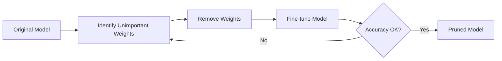
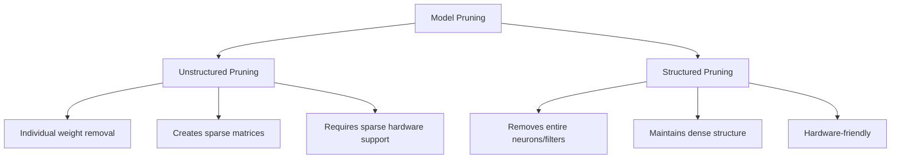
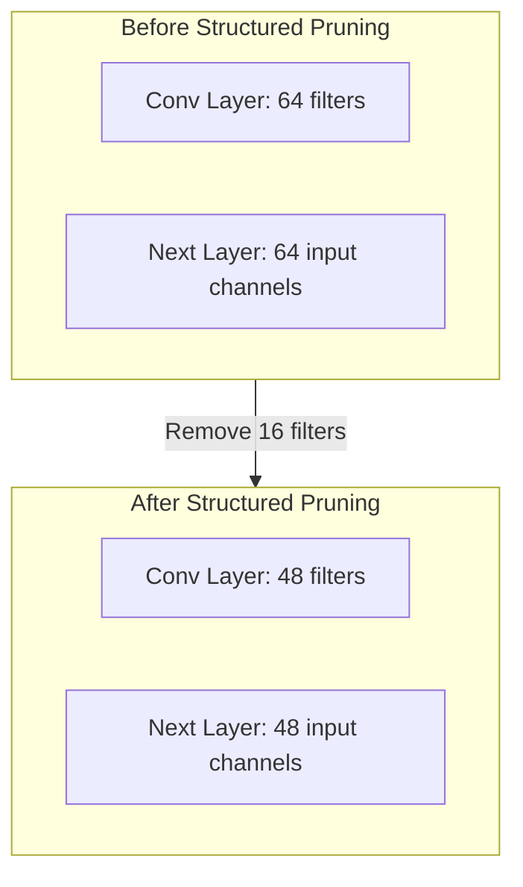
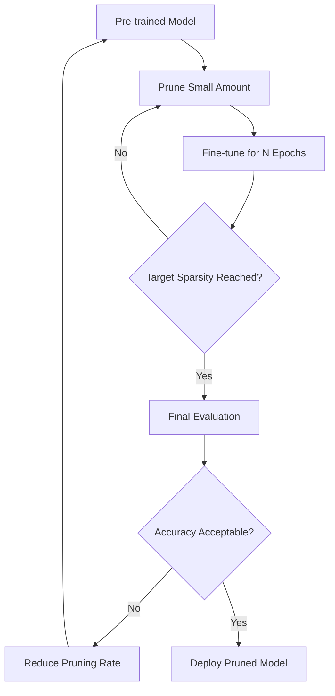
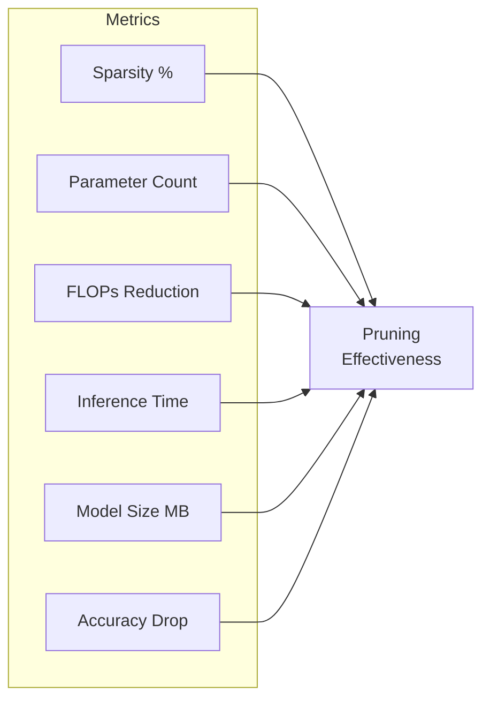

# How to Implement Model Pruning

Author: [nawazdhandala](https://github.com/nawazdhandala)

Tags: Machine Learning, Model Optimization, Pruning, Edge AI

Description: Learn to implement model pruning with structured and unstructured approaches, magnitude-based selection, and iterative fine-tuning for efficient models.

---

Model pruning is a powerful technique for reducing the size and computational requirements of neural networks while maintaining acceptable accuracy. This guide walks you through practical implementations of various pruning strategies, from basic magnitude-based approaches to advanced structured pruning methods.

## What is Model Pruning?

Model pruning removes unnecessary weights or entire neurons from a neural network. The core insight is that many trained networks contain redundant parameters that contribute little to the final output. By identifying and removing these parameters, we can create smaller, faster models suitable for deployment on edge devices and resource-constrained environments.



## Types of Pruning

Before diving into implementation, let us understand the two main categories of pruning:



### Unstructured Pruning

Unstructured pruning removes individual weights regardless of their position in the network. This approach can achieve high compression ratios but results in sparse matrices that may not translate to actual speedups without specialized hardware.

### Structured Pruning

Structured pruning removes entire neurons, channels, or filters. While it typically achieves lower compression ratios than unstructured pruning, the resulting models maintain dense tensor operations and run efficiently on standard hardware.

## Implementing Magnitude-Based Pruning

Magnitude-based pruning is the simplest and most widely used approach. The assumption is that weights with small absolute values contribute less to the network output.

### Basic Implementation in PyTorch

```python
import torch
import torch.nn as nn
import torch.nn.utils.prune as prune

class SimplePruner:
    def __init__(self, model, pruning_rate=0.3):
        self.model = model
        self.pruning_rate = pruning_rate

    def apply_magnitude_pruning(self):
        """Apply L1 unstructured pruning to all linear and conv layers."""
        for name, module in self.model.named_modules():
            if isinstance(module, (nn.Linear, nn.Conv2d)):
                prune.l1_unstructured(
                    module,
                    name='weight',
                    amount=self.pruning_rate
                )
                print(f"Pruned {name}: {self.get_sparsity(module):.2%} sparse")

    def get_sparsity(self, module):
        """Calculate the sparsity of a module's weights."""
        weight = module.weight
        total = weight.nelement()
        zeros = (weight == 0).sum().item()
        return zeros / total

    def remove_pruning_reparametrization(self):
        """Make pruning permanent by removing the forward hooks."""
        for name, module in self.model.named_modules():
            if isinstance(module, (nn.Linear, nn.Conv2d)):
                try:
                    prune.remove(module, 'weight')
                except ValueError:
                    pass  # Module was not pruned

# Example usage
model = torch.hub.load('pytorch/vision:v0.10.0', 'resnet18', pretrained=True)
pruner = SimplePruner(model, pruning_rate=0.5)
pruner.apply_magnitude_pruning()
```

### Custom Threshold-Based Pruning

For more control over the pruning process, you can implement custom threshold-based pruning:

```python
import torch
import torch.nn as nn
import numpy as np

class ThresholdPruner:
    def __init__(self, model):
        self.model = model
        self.masks = {}

    def compute_threshold(self, weights, percentile):
        """Compute the threshold value for a given percentile."""
        flat_weights = torch.abs(weights.flatten())
        threshold = torch.quantile(flat_weights, percentile / 100.0)
        return threshold.item()

    def create_mask(self, weights, threshold):
        """Create a binary mask based on weight magnitudes."""
        return (torch.abs(weights) >= threshold).float()

    def apply_global_pruning(self, target_sparsity):
        """Apply global magnitude pruning across all layers."""
        # Collect all weights
        all_weights = []
        for name, module in self.model.named_modules():
            if isinstance(module, (nn.Linear, nn.Conv2d)):
                all_weights.append(module.weight.data.flatten())

        # Compute global threshold
        all_weights = torch.cat(all_weights)
        threshold = self.compute_threshold(all_weights, target_sparsity * 100)

        # Apply masks
        for name, module in self.model.named_modules():
            if isinstance(module, (nn.Linear, nn.Conv2d)):
                mask = self.create_mask(module.weight.data, threshold)
                self.masks[name] = mask
                module.weight.data *= mask

        return threshold

    def apply_masks_during_training(self):
        """Re-apply masks after gradient updates to maintain sparsity."""
        for name, module in self.model.named_modules():
            if name in self.masks:
                module.weight.data *= self.masks[name]

# Example: Prune 70% of weights globally
model = torch.hub.load('pytorch/vision:v0.10.0', 'resnet18', pretrained=True)
pruner = ThresholdPruner(model)
threshold = pruner.apply_global_pruning(target_sparsity=0.7)
print(f"Global pruning threshold: {threshold:.6f}")
```

## Structured Pruning Implementation

Structured pruning removes entire filters or channels, resulting in a smaller but dense model.



### Filter Pruning for Convolutional Networks

```python
import torch
import torch.nn as nn

class StructuredPruner:
    def __init__(self, model):
        self.model = model

    def compute_filter_importance(self, conv_layer):
        """Compute importance scores for each filter using L1 norm."""
        weights = conv_layer.weight.data
        # Sum absolute values across spatial dimensions and input channels
        importance = torch.sum(torch.abs(weights), dim=(1, 2, 3))
        return importance

    def prune_conv_layer(self, conv_layer, bn_layer, prune_ratio):
        """Prune filters from a convolutional layer."""
        importance = self.compute_filter_importance(conv_layer)
        num_filters = conv_layer.out_channels
        num_to_prune = int(num_filters * prune_ratio)
        num_to_keep = num_filters - num_to_prune

        # Get indices of filters to keep (highest importance)
        _, keep_indices = torch.topk(importance, num_to_keep)
        keep_indices = keep_indices.sort()[0]

        # Create new smaller conv layer
        new_conv = nn.Conv2d(
            in_channels=conv_layer.in_channels,
            out_channels=num_to_keep,
            kernel_size=conv_layer.kernel_size,
            stride=conv_layer.stride,
            padding=conv_layer.padding,
            bias=conv_layer.bias is not None
        )

        # Copy selected filters
        new_conv.weight.data = conv_layer.weight.data[keep_indices]
        if conv_layer.bias is not None:
            new_conv.bias.data = conv_layer.bias.data[keep_indices]

        # Create new batch norm if present
        new_bn = None
        if bn_layer is not None:
            new_bn = nn.BatchNorm2d(num_to_keep)
            new_bn.weight.data = bn_layer.weight.data[keep_indices]
            new_bn.bias.data = bn_layer.bias.data[keep_indices]
            new_bn.running_mean = bn_layer.running_mean[keep_indices]
            new_bn.running_var = bn_layer.running_var[keep_indices]

        return new_conv, new_bn, keep_indices

    def adjust_next_layer(self, next_conv, keep_indices):
        """Adjust the input channels of the next layer."""
        new_conv = nn.Conv2d(
            in_channels=len(keep_indices),
            out_channels=next_conv.out_channels,
            kernel_size=next_conv.kernel_size,
            stride=next_conv.stride,
            padding=next_conv.padding,
            bias=next_conv.bias is not None
        )

        new_conv.weight.data = next_conv.weight.data[:, keep_indices]
        if next_conv.bias is not None:
            new_conv.bias.data = next_conv.bias.data

        return new_conv

# Example usage for a simple sequential model
def prune_simple_cnn(model, prune_ratio=0.3):
    """Prune a simple sequential CNN model."""
    pruner = StructuredPruner(model)

    layers = list(model.children())
    pruned_layers = []
    keep_indices = None

    i = 0
    while i < len(layers):
        layer = layers[i]

        if isinstance(layer, nn.Conv2d):
            # Check for batch norm following conv
            bn_layer = None
            if i + 1 < len(layers) and isinstance(layers[i + 1], nn.BatchNorm2d):
                bn_layer = layers[i + 1]

            # Adjust input channels if previous layer was pruned
            if keep_indices is not None:
                layer = pruner.adjust_next_layer(layer, keep_indices)

            # Prune current layer
            new_conv, new_bn, keep_indices = pruner.prune_conv_layer(
                layer, bn_layer, prune_ratio
            )
            pruned_layers.append(new_conv)

            if new_bn is not None:
                pruned_layers.append(new_bn)
                i += 1  # Skip the original batch norm
        else:
            pruned_layers.append(layer)

        i += 1

    return nn.Sequential(*pruned_layers)
```

## Iterative Pruning with Fine-Tuning

The most effective pruning approach involves iteratively pruning and fine-tuning the model. This allows the network to recover accuracy after each pruning step.



### Implementation

```python
import torch
import torch.nn as nn
import torch.optim as optim
from torch.utils.data import DataLoader

class IterativePruner:
    def __init__(self, model, train_loader, val_loader, device='cuda'):
        self.model = model
        self.train_loader = train_loader
        self.val_loader = val_loader
        self.device = device
        self.model.to(device)

    def evaluate(self):
        """Evaluate model accuracy on validation set."""
        self.model.eval()
        correct = 0
        total = 0

        with torch.no_grad():
            for inputs, targets in self.val_loader:
                inputs, targets = inputs.to(self.device), targets.to(self.device)
                outputs = self.model(inputs)
                _, predicted = outputs.max(1)
                total += targets.size(0)
                correct += predicted.eq(targets).sum().item()

        return correct / total

    def fine_tune(self, epochs, learning_rate=0.001):
        """Fine-tune the model after pruning."""
        self.model.train()
        optimizer = optim.SGD(
            self.model.parameters(),
            lr=learning_rate,
            momentum=0.9,
            weight_decay=1e-4
        )
        criterion = nn.CrossEntropyLoss()
        scheduler = optim.lr_scheduler.CosineAnnealingLR(optimizer, epochs)

        for epoch in range(epochs):
            running_loss = 0.0
            for inputs, targets in self.train_loader:
                inputs, targets = inputs.to(self.device), targets.to(self.device)

                optimizer.zero_grad()
                outputs = self.model(inputs)
                loss = criterion(outputs, targets)
                loss.backward()
                optimizer.step()

                running_loss += loss.item()

            scheduler.step()

            if (epoch + 1) % 5 == 0:
                acc = self.evaluate()
                print(f"Epoch {epoch + 1}: Loss = {running_loss:.4f}, Acc = {acc:.4%}")

    def iterative_prune(self, target_sparsity, num_iterations, fine_tune_epochs):
        """Perform iterative pruning with fine-tuning."""
        # Calculate per-iteration pruning rate
        per_iter_rate = 1 - (1 - target_sparsity) ** (1 / num_iterations)

        print(f"Initial accuracy: {self.evaluate():.4%}")

        for iteration in range(num_iterations):
            print(f"\n--- Iteration {iteration + 1}/{num_iterations} ---")

            # Apply pruning
            self._apply_magnitude_pruning(per_iter_rate)

            # Calculate current sparsity
            sparsity = self._calculate_sparsity()
            print(f"Current sparsity: {sparsity:.2%}")

            # Evaluate after pruning
            acc_after_prune = self.evaluate()
            print(f"Accuracy after pruning: {acc_after_prune:.4%}")

            # Fine-tune
            print("Fine-tuning...")
            self.fine_tune(fine_tune_epochs)

            # Evaluate after fine-tuning
            acc_after_ft = self.evaluate()
            print(f"Accuracy after fine-tuning: {acc_after_ft:.4%}")

        # Make pruning permanent
        self._remove_pruning_masks()

        return self.model

    def _apply_magnitude_pruning(self, amount):
        """Apply magnitude-based pruning."""
        import torch.nn.utils.prune as prune

        for module in self.model.modules():
            if isinstance(module, (nn.Linear, nn.Conv2d)):
                prune.l1_unstructured(module, name='weight', amount=amount)

    def _calculate_sparsity(self):
        """Calculate overall model sparsity."""
        total_params = 0
        zero_params = 0

        for module in self.model.modules():
            if isinstance(module, (nn.Linear, nn.Conv2d)):
                total_params += module.weight.nelement()
                zero_params += (module.weight == 0).sum().item()

        return zero_params / total_params

    def _remove_pruning_masks(self):
        """Remove pruning masks to make pruning permanent."""
        import torch.nn.utils.prune as prune

        for module in self.model.modules():
            if isinstance(module, (nn.Linear, nn.Conv2d)):
                try:
                    prune.remove(module, 'weight')
                except ValueError:
                    pass

# Example usage
"""
# Assuming you have your data loaders ready
train_loader = DataLoader(train_dataset, batch_size=128, shuffle=True)
val_loader = DataLoader(val_dataset, batch_size=256)

model = torchvision.models.resnet18(pretrained=True)
pruner = IterativePruner(model, train_loader, val_loader)

# Prune to 80% sparsity over 10 iterations with 5 epochs of fine-tuning each
pruned_model = pruner.iterative_prune(
    target_sparsity=0.8,
    num_iterations=10,
    fine_tune_epochs=5
)
"""
```

## Accuracy Recovery Techniques

When pruning aggressively, accuracy recovery becomes crucial. Here are several techniques to maximize final model accuracy:

### 1. Knowledge Distillation During Fine-Tuning

```python
import torch
import torch.nn as nn
import torch.nn.functional as F

class DistillationFineTuner:
    def __init__(self, student_model, teacher_model, temperature=4.0, alpha=0.5):
        self.student = student_model
        self.teacher = teacher_model
        self.temperature = temperature
        self.alpha = alpha
        self.teacher.eval()

    def distillation_loss(self, student_logits, teacher_logits, targets):
        """Compute combined distillation and classification loss."""
        # Soft targets from teacher
        soft_targets = F.softmax(teacher_logits / self.temperature, dim=1)
        soft_student = F.log_softmax(student_logits / self.temperature, dim=1)

        # Distillation loss (KL divergence)
        distill_loss = F.kl_div(
            soft_student,
            soft_targets,
            reduction='batchmean'
        ) * (self.temperature ** 2)

        # Standard classification loss
        ce_loss = F.cross_entropy(student_logits, targets)

        # Combined loss
        return self.alpha * distill_loss + (1 - self.alpha) * ce_loss

    def train_step(self, inputs, targets, optimizer):
        """Single training step with distillation."""
        self.student.train()

        # Get teacher predictions
        with torch.no_grad():
            teacher_logits = self.teacher(inputs)

        # Get student predictions
        student_logits = self.student(inputs)

        # Compute loss and update
        loss = self.distillation_loss(student_logits, teacher_logits, targets)

        optimizer.zero_grad()
        loss.backward()
        optimizer.step()

        return loss.item()
```

### 2. Learning Rate Rewinding

```python
class LRRewindPruner:
    """Implements learning rate rewinding for better accuracy recovery."""

    def __init__(self, model, initial_lr=0.1, rewind_epoch=10):
        self.model = model
        self.initial_lr = initial_lr
        self.rewind_epoch = rewind_epoch
        self.saved_state = None

    def save_rewind_point(self, optimizer):
        """Save the optimizer state at the rewind epoch."""
        self.saved_state = {
            'optimizer': optimizer.state_dict(),
            'lr': self.initial_lr * (0.1 ** (self.rewind_epoch // 30))
        }

    def rewind_learning_rate(self, optimizer):
        """Reset learning rate to the saved rewind point."""
        if self.saved_state is not None:
            for param_group in optimizer.param_groups:
                param_group['lr'] = self.saved_state['lr']
            print(f"Learning rate rewound to {self.saved_state['lr']}")
```

### 3. Gradual Magnitude Pruning

```python
import torch.nn.utils.prune as prune
import numpy as np

class GradualPruner:
    """Implements gradual magnitude pruning during training."""

    def __init__(self, model, initial_sparsity=0.0, final_sparsity=0.9,
                 begin_step=0, end_step=10000, frequency=100):
        self.model = model
        self.initial_sparsity = initial_sparsity
        self.final_sparsity = final_sparsity
        self.begin_step = begin_step
        self.end_step = end_step
        self.frequency = frequency

    def compute_sparsity(self, step):
        """Compute target sparsity for current step using cubic schedule."""
        if step < self.begin_step:
            return self.initial_sparsity
        if step >= self.end_step:
            return self.final_sparsity

        # Cubic sparsity schedule
        progress = (step - self.begin_step) / (self.end_step - self.begin_step)
        sparsity = self.final_sparsity + (self.initial_sparsity - self.final_sparsity) * (1 - progress) ** 3

        return sparsity

    def step(self, current_step):
        """Update pruning masks if at a pruning step."""
        if current_step < self.begin_step:
            return
        if (current_step - self.begin_step) % self.frequency != 0:
            return

        target_sparsity = self.compute_sparsity(current_step)

        # Remove existing pruning and apply new masks
        for module in self.model.modules():
            if isinstance(module, (nn.Linear, nn.Conv2d)):
                try:
                    prune.remove(module, 'weight')
                except ValueError:
                    pass
                prune.l1_unstructured(module, name='weight', amount=target_sparsity)

        print(f"Step {current_step}: Target sparsity = {target_sparsity:.2%}")
```

## Complete Pruning Pipeline

Here is a complete example that brings together all the concepts:

```python
import torch
import torch.nn as nn
import torch.optim as optim
import torchvision
import torchvision.transforms as transforms
from torch.utils.data import DataLoader

def create_pruning_pipeline():
    """Complete pruning pipeline example."""

    # Setup device
    device = torch.device('cuda' if torch.cuda.is_available() else 'cpu')

    # Load pre-trained model
    model = torchvision.models.resnet18(pretrained=True)
    teacher_model = torchvision.models.resnet18(pretrained=True)
    teacher_model.eval()

    model.to(device)
    teacher_model.to(device)

    # Data preparation (example with CIFAR-10)
    transform_train = transforms.Compose([
        transforms.RandomCrop(32, padding=4),
        transforms.RandomHorizontalFlip(),
        transforms.Resize(224),
        transforms.ToTensor(),
        transforms.Normalize((0.485, 0.456, 0.406), (0.229, 0.224, 0.225))
    ])

    transform_test = transforms.Compose([
        transforms.Resize(224),
        transforms.ToTensor(),
        transforms.Normalize((0.485, 0.456, 0.406), (0.229, 0.224, 0.225))
    ])

    # Initialize pruner
    gradual_pruner = GradualPruner(
        model,
        initial_sparsity=0.0,
        final_sparsity=0.9,
        begin_step=1000,
        end_step=20000,
        frequency=500
    )

    # Initialize distillation
    distiller = DistillationFineTuner(
        student_model=model,
        teacher_model=teacher_model,
        temperature=4.0,
        alpha=0.7
    )

    # Training setup
    optimizer = optim.SGD(
        model.parameters(),
        lr=0.01,
        momentum=0.9,
        weight_decay=1e-4
    )
    scheduler = optim.lr_scheduler.CosineAnnealingLR(optimizer, T_max=100)

    # Training loop
    global_step = 0
    for epoch in range(100):
        model.train()

        # Simulated training loop
        for batch_idx in range(100):  # Replace with actual data loader
            # Simulated batch
            inputs = torch.randn(32, 3, 224, 224).to(device)
            targets = torch.randint(0, 1000, (32,)).to(device)

            # Training step with distillation
            loss = distiller.train_step(inputs, targets, optimizer)

            # Apply gradual pruning
            gradual_pruner.step(global_step)

            global_step += 1

        scheduler.step()

        if (epoch + 1) % 10 == 0:
            print(f"Epoch {epoch + 1} completed")

    return model

# Run the pipeline
# pruned_model = create_pruning_pipeline()
```

## Measuring Pruning Effectiveness



### Utility Functions for Analysis

```python
def analyze_pruned_model(model, input_size=(1, 3, 224, 224)):
    """Analyze the effectiveness of pruning."""

    # Count parameters
    total_params = 0
    zero_params = 0

    for name, param in model.named_parameters():
        total_params += param.nelement()
        zero_params += (param == 0).sum().item()

    sparsity = zero_params / total_params

    # Estimate model size
    model_size_mb = total_params * 4 / (1024 * 1024)  # Assuming float32
    sparse_size_mb = (total_params - zero_params) * 4 / (1024 * 1024)

    print(f"Total parameters: {total_params:,}")
    print(f"Non-zero parameters: {total_params - zero_params:,}")
    print(f"Sparsity: {sparsity:.2%}")
    print(f"Dense model size: {model_size_mb:.2f} MB")
    print(f"Effective sparse size: {sparse_size_mb:.2f} MB")
    print(f"Compression ratio: {model_size_mb / sparse_size_mb:.2f}x")

    return {
        'total_params': total_params,
        'non_zero_params': total_params - zero_params,
        'sparsity': sparsity,
        'compression_ratio': total_params / (total_params - zero_params)
    }
```

## Best Practices and Tips

1. **Start with a well-trained model**: Pruning works best when starting from a fully converged model with good accuracy.

2. **Prune gradually**: Removing too many weights at once leads to significant accuracy loss. Iterative pruning with fine-tuning yields better results.

3. **Use global pruning thresholds**: Global pruning across all layers often works better than per-layer pruning with the same ratio.

4. **Monitor layer-wise sparsity**: Some layers are more sensitive to pruning than others. First and last layers typically should be pruned less aggressively.

5. **Consider structured pruning for deployment**: If you need actual speedups without specialized hardware, structured pruning is more practical.

6. **Combine with other techniques**: Pruning works well with quantization and knowledge distillation for maximum compression.

7. **Validate on diverse data**: Ensure the pruned model maintains accuracy across different input distributions.

## Conclusion

Model pruning is an essential technique for deploying neural networks in resource-constrained environments. By carefully selecting which weights to remove and iteratively fine-tuning the model, you can achieve significant compression with minimal accuracy loss.

Key takeaways:

- Magnitude-based pruning is simple and effective for most use cases
- Structured pruning provides real speedups on standard hardware
- Iterative pruning with fine-tuning maximizes accuracy retention
- Knowledge distillation can help recover accuracy lost during aggressive pruning
- Always measure multiple metrics to understand true pruning effectiveness

Start with the simple approaches outlined here, then gradually incorporate more advanced techniques as needed for your specific use case.
