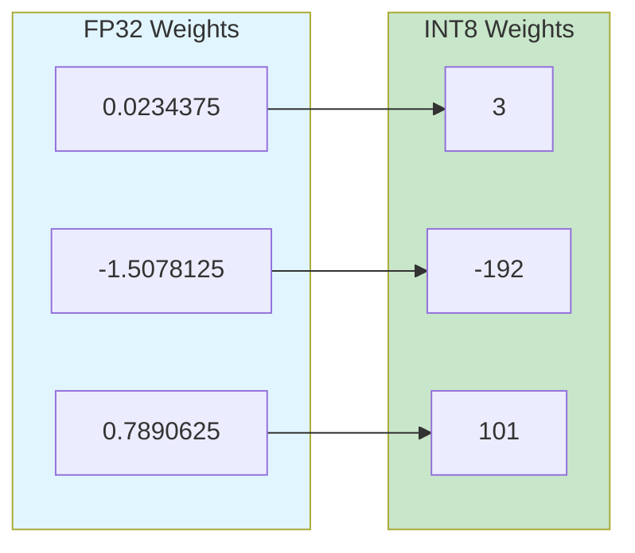
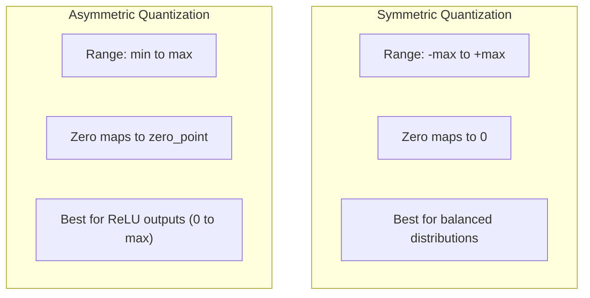
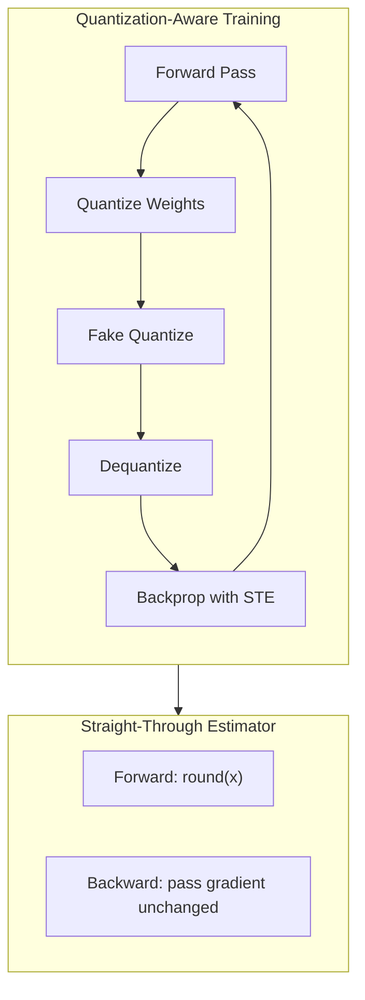

# How to Build Model Quantization

Author: [nawazdhandala](https://github.com/nawazdhandala)

Tags: MLOps, Edge Computing, AI, Model Optimization

Description: A practical guide to implementing model quantization from scratch, covering the math, code, and real-world deployment strategies to shrink your AI models by 4x while preserving accuracy.

---

Running a 7B parameter model on your laptop shouldn't require selling a kidney for GPU memory. Model quantization lets you compress neural networks from 32-bit floating point to 8-bit (or even 4-bit) integers, slashing memory requirements and inference latency. This guide walks through building quantization from first principles.

## What Is Model Quantization?

Quantization maps continuous floating-point values to a discrete set of integers. Instead of storing weights as 32-bit floats (4 bytes each), you store them as 8-bit integers (1 byte each). That is a 4x memory reduction right there.



### The Trade-off

| Precision | Memory per Weight | Typical Accuracy Drop | Use Case |
|-----------|-------------------|----------------------|----------|
| FP32 | 4 bytes | Baseline | Training |
| FP16 | 2 bytes | ~0% | Training + Inference |
| INT8 | 1 byte | 0.1-1% | Production Inference |
| INT4 | 0.5 bytes | 1-5% | Edge Devices |

## The Math Behind Quantization

At its core, quantization is a linear mapping between floating-point range and integer range.

### Symmetric Quantization

The simplest approach assumes weights are symmetric around zero.

```python
# The scale factor maps the max absolute value to the max integer value
# For INT8, we have 127 as the max positive integer
scale = max(abs(weights)) / 127

# Quantize: convert float to int
quantized_weights = round(weights / scale)

# Dequantize: convert back to float (used during inference)
dequantized_weights = quantized_weights * scale
```

### Asymmetric Quantization

Real weight distributions are rarely symmetric. Asymmetric quantization handles this by introducing a zero-point offset.



The formulas for asymmetric quantization:

```python
# Calculate scale and zero-point
# Scale determines the step size between quantized values
scale = (max_val - min_val) / 255  # For uint8

# Zero-point shifts the range so min_val maps to 0
zero_point = round(-min_val / scale)

# Quantize
quantized = round(weights / scale) + zero_point

# Dequantize
dequantized = (quantized - zero_point) * scale
```

## Building a Quantizer from Scratch

Let's build a complete quantization module in Python.

### Step 1: Basic Quantizer Class

This class implements the core quantization logic with support for both symmetric and asymmetric modes.

```python
import numpy as np
from typing import Tuple, Optional

class Quantizer:
    """
    A simple quantizer that converts floating-point tensors to integers.
    Supports both symmetric and asymmetric quantization schemes.
    """

    def __init__(self, bits: int = 8, symmetric: bool = True):
        self.bits = bits
        self.symmetric = symmetric

        # Calculate the integer range based on bit width
        if symmetric:
            # Symmetric: use signed integers (-127 to 127 for 8-bit)
            self.qmin = -(2 ** (bits - 1)) + 1
            self.qmax = 2 ** (bits - 1) - 1
        else:
            # Asymmetric: use unsigned integers (0 to 255 for 8-bit)
            self.qmin = 0
            self.qmax = 2 ** bits - 1

        self.scale: Optional[float] = None
        self.zero_point: Optional[int] = None

    def calibrate(self, tensor: np.ndarray) -> Tuple[float, int]:
        """
        Calculate scale and zero-point from the tensor's value range.
        This should be called with representative data before quantization.
        """
        min_val = tensor.min()
        max_val = tensor.max()

        if self.symmetric:
            # Symmetric: scale based on max absolute value
            max_abs = max(abs(min_val), abs(max_val))
            self.scale = max_abs / self.qmax
            self.zero_point = 0
        else:
            # Asymmetric: map full range to integer range
            self.scale = (max_val - min_val) / (self.qmax - self.qmin)
            self.zero_point = int(round(self.qmin - min_val / self.scale))

        # Prevent division by zero for constant tensors
        if self.scale == 0:
            self.scale = 1.0

        return self.scale, self.zero_point

    def quantize(self, tensor: np.ndarray) -> np.ndarray:
        """Convert floating-point tensor to quantized integers."""
        if self.scale is None:
            self.calibrate(tensor)

        # Apply quantization formula and clip to valid range
        quantized = np.round(tensor / self.scale) + self.zero_point
        quantized = np.clip(quantized, self.qmin, self.qmax)

        return quantized.astype(np.int8 if self.symmetric else np.uint8)

    def dequantize(self, quantized: np.ndarray) -> np.ndarray:
        """Convert quantized integers back to floating-point."""
        return (quantized.astype(np.float32) - self.zero_point) * self.scale
```

### Step 2: Per-Channel Quantization

Quantizing each output channel separately preserves more precision because different channels can have vastly different value ranges.

```python
class PerChannelQuantizer:
    """
    Quantizes each channel of a weight tensor independently.
    This is crucial for convolutional and linear layers where
    different output channels may have very different weight distributions.
    """

    def __init__(self, bits: int = 8, axis: int = 0):
        self.bits = bits
        self.axis = axis
        self.scales: Optional[np.ndarray] = None
        self.zero_points: Optional[np.ndarray] = None

        # INT8 symmetric range
        self.qmin = -127
        self.qmax = 127

    def calibrate(self, weights: np.ndarray) -> Tuple[np.ndarray, np.ndarray]:
        """
        Calculate per-channel scales by finding max absolute value
        along each channel independently.
        """
        # Move the quantization axis to position 0
        weights_transposed = np.moveaxis(weights, self.axis, 0)
        num_channels = weights_transposed.shape[0]

        # Flatten each channel and find its max absolute value
        weights_flat = weights_transposed.reshape(num_channels, -1)
        max_abs = np.max(np.abs(weights_flat), axis=1)

        # Prevent division by zero
        max_abs = np.maximum(max_abs, 1e-8)

        self.scales = max_abs / self.qmax
        self.zero_points = np.zeros(num_channels, dtype=np.int32)

        return self.scales, self.zero_points

    def quantize(self, weights: np.ndarray) -> np.ndarray:
        """Quantize weights with per-channel scaling."""
        if self.scales is None:
            self.calibrate(weights)

        # Reshape scales for broadcasting
        shape = [1] * weights.ndim
        shape[self.axis] = -1
        scales_reshaped = self.scales.reshape(shape)

        quantized = np.round(weights / scales_reshaped)
        quantized = np.clip(quantized, self.qmin, self.qmax)

        return quantized.astype(np.int8)
```

### Step 3: Dynamic Quantization for Activations

Weights are static and can be quantized once. Activations change with each input, so we quantize them on the fly.

```python
class DynamicQuantizedLinear:
    """
    A linear layer with quantized weights and dynamic activation quantization.
    Weights are quantized once at initialization.
    Activations are quantized on each forward pass.
    """

    def __init__(self, weight: np.ndarray, bias: Optional[np.ndarray] = None):
        # Quantize weights at initialization
        self.weight_quantizer = PerChannelQuantizer(bits=8, axis=0)
        self.quantized_weight = self.weight_quantizer.quantize(weight)
        self.weight_scales = self.weight_quantizer.scales

        # Keep bias in FP32 (it is small compared to weights)
        self.bias = bias

        # Activation quantizer will be calibrated per forward pass
        self.activation_quantizer = Quantizer(bits=8, symmetric=False)

    def forward(self, x: np.ndarray) -> np.ndarray:
        """
        Forward pass with quantized computation.
        1. Quantize input activations dynamically
        2. Perform integer matrix multiplication
        3. Rescale result back to floating point
        """
        # Step 1: Quantize activations
        act_scale, act_zp = self.activation_quantizer.calibrate(x)
        x_quant = self.activation_quantizer.quantize(x)

        # Step 2: Integer matmul (in practice, use optimized int8 kernels)
        # We compute in int32 to avoid overflow
        x_int32 = x_quant.astype(np.int32) - act_zp
        w_int32 = self.quantized_weight.astype(np.int32)

        # Matrix multiplication in integer domain
        output_int32 = np.dot(x_int32, w_int32.T)

        # Step 3: Rescale to floating point
        # Combined scale = activation_scale * weight_scales
        combined_scales = act_scale * self.weight_scales
        output = output_int32 * combined_scales

        if self.bias is not None:
            output += self.bias

        return output
```

## Quantization-Aware Training (QAT)

Post-training quantization works well, but quantization-aware training can recover most accuracy loss by simulating quantization during training.



### Implementing Fake Quantization

The trick is to quantize and immediately dequantize during training. This lets the model learn to be robust to quantization errors while keeping gradients flowing.

```python
import torch
import torch.nn as nn

class FakeQuantize(torch.autograd.Function):
    """
    Fake quantization operation for quantization-aware training.
    Forward: quantize then dequantize (simulates quantization error)
    Backward: straight-through estimator (gradient passes unchanged)
    """

    @staticmethod
    def forward(ctx, x, scale, zero_point, qmin, qmax):
        # Quantize
        x_quant = torch.round(x / scale) + zero_point
        x_quant = torch.clamp(x_quant, qmin, qmax)

        # Immediately dequantize
        x_dequant = (x_quant - zero_point) * scale

        return x_dequant

    @staticmethod
    def backward(ctx, grad_output):
        # Straight-through estimator: pass gradient unchanged
        return grad_output, None, None, None, None


class QuantizedLinear(nn.Module):
    """
    Linear layer with fake quantization for QAT.
    During training, simulates quantization effects.
    After training, can export truly quantized weights.
    """

    def __init__(self, in_features: int, out_features: int):
        super().__init__()
        self.linear = nn.Linear(in_features, out_features)

        # Learnable quantization parameters
        self.register_buffer('weight_scale', torch.tensor(1.0))
        self.register_buffer('weight_zero_point', torch.tensor(0))
        self.register_buffer('activation_scale', torch.tensor(1.0))
        self.register_buffer('activation_zero_point', torch.tensor(0))

        # Running statistics for activation quantization
        self.register_buffer('running_min', torch.tensor(float('inf')))
        self.register_buffer('running_max', torch.tensor(float('-inf')))

    def update_weight_quantization_params(self):
        """Recalculate weight quantization parameters."""
        weight = self.linear.weight.data
        max_abs = weight.abs().max()
        self.weight_scale = max_abs / 127.0

    def update_activation_quantization_params(self, x: torch.Tensor):
        """Update running statistics for activation quantization."""
        # Exponential moving average of min/max
        momentum = 0.1
        self.running_min = (1 - momentum) * self.running_min + momentum * x.min()
        self.running_max = (1 - momentum) * self.running_max + momentum * x.max()

        self.activation_scale = (self.running_max - self.running_min) / 255.0
        self.activation_zero_point = torch.round(-self.running_min / self.activation_scale)

    def forward(self, x: torch.Tensor) -> torch.Tensor:
        if self.training:
            self.update_weight_quantization_params()
            self.update_activation_quantization_params(x)

        # Fake quantize weights
        weight_q = FakeQuantize.apply(
            self.linear.weight,
            self.weight_scale,
            self.weight_zero_point,
            -127, 127
        )

        # Fake quantize activations
        x_q = FakeQuantize.apply(
            x,
            self.activation_scale,
            self.activation_zero_point,
            0, 255
        )

        return nn.functional.linear(x_q, weight_q, self.linear.bias)
```

## Real-World Quantization: LLM Example

Let's quantize a small transformer block, the building block of modern language models.

### Quantizing Attention Weights

This example shows how to quantize the attention mechanism while maintaining numerical stability.

```python
import torch
import torch.nn as nn
from typing import Dict

def quantize_attention_block(
    attention: nn.MultiheadAttention,
    calibration_data: torch.Tensor
) -> Dict[str, torch.Tensor]:
    """
    Quantize a multi-head attention block.
    Returns quantized weights and their scales.
    """
    quantized_params = {}

    # Extract weight matrices
    # in_proj_weight contains Q, K, V projections concatenated
    in_proj = attention.in_proj_weight.data
    out_proj = attention.out_proj.weight.data

    # Split into Q, K, V
    embed_dim = attention.embed_dim
    q_proj = in_proj[:embed_dim]
    k_proj = in_proj[embed_dim:2*embed_dim]
    v_proj = in_proj[2*embed_dim:]

    # Quantize each projection with per-channel scaling
    for name, weight in [('q', q_proj), ('k', k_proj), ('v', v_proj), ('out', out_proj)]:
        # Per-output-channel quantization
        max_per_channel = weight.abs().max(dim=1).values
        scales = max_per_channel / 127.0
        scales = torch.clamp(scales, min=1e-8)

        # Quantize
        weight_scaled = weight / scales.unsqueeze(1)
        weight_int8 = torch.round(weight_scaled).clamp(-127, 127).to(torch.int8)

        quantized_params[f'{name}_weight'] = weight_int8
        quantized_params[f'{name}_scale'] = scales

    return quantized_params


class QuantizedTransformerBlock(nn.Module):
    """
    A transformer block with quantized attention and feed-forward layers.
    Uses INT8 for weights and dynamic INT8 for activations.
    """

    def __init__(self, original_block, calibration_data: torch.Tensor):
        super().__init__()

        # Store original structure for shape reference
        self.embed_dim = original_block.self_attn.embed_dim
        self.num_heads = original_block.self_attn.num_heads

        # Quantize attention
        self.attn_params = quantize_attention_block(
            original_block.self_attn,
            calibration_data
        )

        # Quantize feed-forward layers
        self.ff1_weight, self.ff1_scale = self._quantize_linear(
            original_block.linear1.weight
        )
        self.ff2_weight, self.ff2_scale = self._quantize_linear(
            original_block.linear2.weight
        )

        # Keep biases and layer norms in FP32
        self.attn_bias = original_block.self_attn.in_proj_bias
        self.out_proj_bias = original_block.self_attn.out_proj.bias
        self.ff1_bias = original_block.linear1.bias
        self.ff2_bias = original_block.linear2.bias
        self.norm1 = original_block.norm1
        self.norm2 = original_block.norm2

    def _quantize_linear(self, weight: torch.Tensor):
        """Quantize a weight matrix with per-channel scaling."""
        max_per_channel = weight.abs().max(dim=1).values
        scales = max_per_channel / 127.0
        scales = torch.clamp(scales, min=1e-8)

        weight_scaled = weight / scales.unsqueeze(1)
        weight_int8 = torch.round(weight_scaled).clamp(-127, 127).to(torch.int8)

        return weight_int8, scales
```

## Deploying Quantized Models

### Export to ONNX with Quantization

ONNX Runtime provides optimized INT8 inference on CPUs.

```python
import torch
import onnx
from onnxruntime.quantization import quantize_dynamic, QuantType

def export_and_quantize_onnx(
    model: nn.Module,
    sample_input: torch.Tensor,
    output_path: str
) -> str:
    """
    Export a PyTorch model to ONNX and apply dynamic quantization.
    Returns path to quantized model.
    """
    # First export to FP32 ONNX
    fp32_path = output_path.replace('.onnx', '_fp32.onnx')

    torch.onnx.export(
        model,
        sample_input,
        fp32_path,
        input_names=['input'],
        output_names=['output'],
        dynamic_axes={
            'input': {0: 'batch_size'},
            'output': {0: 'batch_size'}
        },
        opset_version=14
    )

    # Apply dynamic INT8 quantization
    quantize_dynamic(
        fp32_path,
        output_path,
        weight_type=QuantType.QInt8
    )

    return output_path


def benchmark_onnx_inference(
    model_path: str,
    sample_input: np.ndarray,
    num_iterations: int = 100
) -> dict:
    """
    Benchmark ONNX model inference speed and memory.
    """
    import onnxruntime as ort
    import time
    import psutil
    import os

    # Create inference session
    session = ort.InferenceSession(model_path)
    input_name = session.get_inputs()[0].name

    # Warmup
    for _ in range(10):
        session.run(None, {input_name: sample_input})

    # Benchmark
    process = psutil.Process(os.getpid())
    mem_before = process.memory_info().rss / 1024 / 1024  # MB

    start_time = time.perf_counter()
    for _ in range(num_iterations):
        session.run(None, {input_name: sample_input})
    end_time = time.perf_counter()

    mem_after = process.memory_info().rss / 1024 / 1024

    return {
        'avg_latency_ms': (end_time - start_time) / num_iterations * 1000,
        'throughput_samples_per_sec': num_iterations / (end_time - start_time),
        'memory_mb': mem_after,
        'model_size_mb': os.path.getsize(model_path) / 1024 / 1024
    }
```

### TensorRT INT8 Deployment

For NVIDIA GPUs, TensorRT provides the fastest INT8 inference.

```python
import tensorrt as trt
import numpy as np

class TensorRTQuantizer:
    """
    Quantize and deploy models using TensorRT for GPU inference.
    Requires calibration data to determine optimal quantization ranges.
    """

    def __init__(self, onnx_path: str, calibration_data: np.ndarray):
        self.onnx_path = onnx_path
        self.calibration_data = calibration_data
        self.logger = trt.Logger(trt.Logger.WARNING)

    def build_int8_engine(self, output_path: str):
        """
        Build a TensorRT INT8 engine from ONNX model.
        Uses calibration data to determine quantization scales.
        """
        builder = trt.Builder(self.logger)
        network = builder.create_network(
            1 << int(trt.NetworkDefinitionCreationFlag.EXPLICIT_BATCH)
        )
        parser = trt.OnnxParser(network, self.logger)

        # Parse ONNX model
        with open(self.onnx_path, 'rb') as f:
            if not parser.parse(f.read()):
                for i in range(parser.num_errors):
                    print(parser.get_error(i))
                raise RuntimeError("Failed to parse ONNX")

        # Configure INT8 quantization
        config = builder.create_builder_config()
        config.set_flag(trt.BuilderFlag.INT8)

        # Set up calibrator
        config.int8_calibrator = EntropyCalibrator(
            self.calibration_data,
            cache_file='calibration.cache'
        )

        # Build engine
        engine = builder.build_serialized_network(network, config)

        with open(output_path, 'wb') as f:
            f.write(engine)

        return output_path


class EntropyCalibrator(trt.IInt8EntropyCalibrator2):
    """
    Calibrator that uses entropy minimization to find optimal
    quantization thresholds. This typically gives better accuracy
    than simple min/max calibration.
    """

    def __init__(self, calibration_data: np.ndarray, cache_file: str):
        super().__init__()
        self.calibration_data = calibration_data
        self.cache_file = cache_file
        self.batch_idx = 0
        self.batch_size = 32

        # Allocate GPU memory for calibration
        self.device_input = cuda.mem_alloc(
            calibration_data[0:1].nbytes * self.batch_size
        )

    def get_batch_size(self):
        return self.batch_size

    def get_batch(self, names):
        if self.batch_idx >= len(self.calibration_data):
            return None

        batch = self.calibration_data[
            self.batch_idx:self.batch_idx + self.batch_size
        ]
        cuda.memcpy_htod(self.device_input, batch)
        self.batch_idx += self.batch_size

        return [int(self.device_input)]
```

## Measuring Quantization Quality

Don't just look at accuracy. Check these metrics too.

### Distribution Analysis

```python
def analyze_quantization_error(
    original_weights: np.ndarray,
    quantized_weights: np.ndarray,
    scales: np.ndarray
) -> dict:
    """
    Analyze the error introduced by quantization.
    Returns statistics useful for debugging accuracy issues.
    """
    # Dequantize
    dequantized = quantized_weights.astype(np.float32) * scales.reshape(-1, 1)

    # Calculate errors
    absolute_error = np.abs(original_weights - dequantized)
    relative_error = absolute_error / (np.abs(original_weights) + 1e-8)

    return {
        'mean_absolute_error': float(np.mean(absolute_error)),
        'max_absolute_error': float(np.max(absolute_error)),
        'mean_relative_error': float(np.mean(relative_error)),
        'max_relative_error': float(np.max(relative_error)),
        'signal_to_noise_ratio': float(
            10 * np.log10(
                np.sum(original_weights ** 2) /
                (np.sum(absolute_error ** 2) + 1e-8)
            )
        ),
        # Check for outliers that might be clipped
        'clipped_values_percent': float(
            100 * np.sum(np.abs(quantized_weights) == 127) /
            quantized_weights.size
        )
    }
```

### Per-Layer Sensitivity Analysis

Some layers are more sensitive to quantization than others. Find them before they hurt accuracy.

```python
def layer_sensitivity_analysis(
    model: nn.Module,
    validation_loader,
    metric_fn
) -> dict:
    """
    Identify which layers are most sensitive to quantization.
    Quantize one layer at a time and measure accuracy impact.
    """
    baseline_metric = evaluate_model(model, validation_loader, metric_fn)
    sensitivity = {}

    for name, module in model.named_modules():
        if isinstance(module, (nn.Linear, nn.Conv2d)):
            # Store original weights
            original_weight = module.weight.data.clone()

            # Quantize this layer only
            scale = original_weight.abs().max() / 127.0
            quantized = torch.round(original_weight / scale).clamp(-127, 127)
            dequantized = quantized * scale

            module.weight.data = dequantized

            # Measure accuracy
            quantized_metric = evaluate_model(model, validation_loader, metric_fn)
            sensitivity[name] = baseline_metric - quantized_metric

            # Restore original weights
            module.weight.data = original_weight

    # Sort by sensitivity (highest first)
    return dict(sorted(sensitivity.items(), key=lambda x: x[1], reverse=True))
```

## Common Pitfalls and Solutions

| Problem | Symptom | Solution |
|---------|---------|----------|
| Outlier weights | High clipping rate, accuracy drop | Use per-channel quantization or mixed precision |
| Activation range drift | Works on calibration data, fails on real data | Use larger/more diverse calibration set |
| Layer norm sensitivity | NaN or exploding values | Keep layer norms in FP32 |
| Attention score overflow | Garbled output | Scale attention scores before softmax |
| Embedding table corruption | Wrong token predictions | Keep embedding tables in FP16 minimum |

## Best Practices Checklist

Before deploying a quantized model:

- [ ] Test on held-out data, not just validation set
- [ ] Compare output distributions, not just top-1 accuracy
- [ ] Profile memory and latency on target hardware
- [ ] Run sensitivity analysis to identify problem layers
- [ ] Keep first and last layers in higher precision if needed
- [ ] Use QAT if post-training quantization loses more than 1% accuracy
- [ ] Verify numerical stability with edge case inputs

---

Model quantization is one of the most effective ways to deploy large models on resource-constrained hardware. Start with post-training dynamic quantization (easiest), move to static quantization with calibration (better performance), and use QAT only when you need to recover accuracy. The 4x memory reduction and 2-4x speedup make it worth the effort.

**Related Reading:**
- [Basics of Profiling](https://oneuptime.com/blog/post/2025-09-09-basics-of-profiling/view)
- [What is OpenTelemetry Collector and Why Use One](https://oneuptime.com/blog/post/2025-09-18-what-is-opentelemetry-collector-and-why-use-one/view)

---

*Need to monitor your ML inference pipelines? OneUptime provides observability for your entire stack, from model serving to downstream services. Send your OpenTelemetry data and get visibility into latency, errors, and resource usage across your ML infrastructure.*
