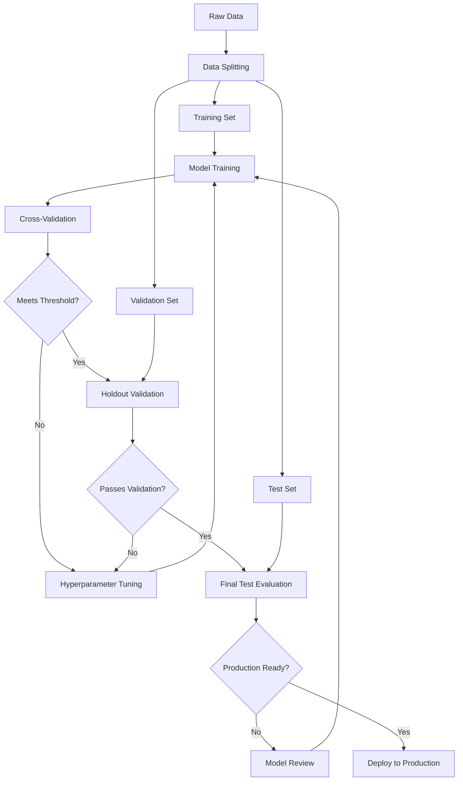
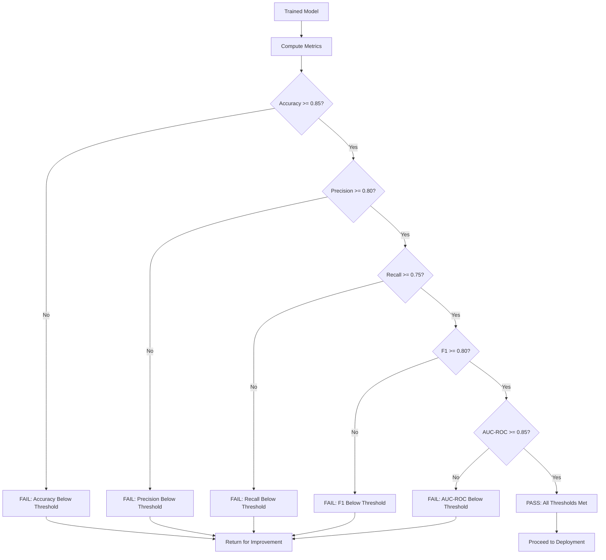
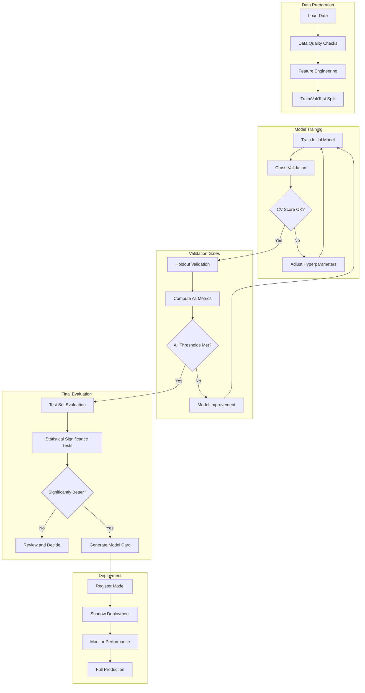

# How to Implement Model Validation

Author: [nawazdhandala](https://github.com/nawazdhandala)

Tags: MLOps, Machine Learning, Validation, Testing

Description: Learn how to implement model validation for ensuring model quality before deployment.

---

Model validation is a critical step in the machine learning lifecycle. Without proper validation, you risk deploying models that perform poorly in production, leading to degraded user experiences and potential business losses. This guide covers essential validation techniques including cross-validation, holdout validation, metrics thresholds, and building comprehensive validation pipelines.

## Why Model Validation Matters

Before deploying any machine learning model, you need confidence that it will perform well on unseen data. Model validation helps you:

- Detect overfitting before it becomes a production problem
- Compare different model architectures objectively
- Establish performance baselines and thresholds
- Build automated quality gates in your ML pipelines

## Validation Strategy Overview

The following diagram illustrates a comprehensive model validation workflow:



## Data Splitting Strategies

### Basic Train-Test Split

The simplest validation approach splits your data into training and testing sets:

```python
import numpy as np
from sklearn.model_selection import train_test_split

def split_data_for_validation(X, y, test_size=0.2, val_size=0.1, random_state=42):
    """
    Split data into training, validation, and test sets.

    Parameters:
    -----------
    X : array-like
        Feature matrix
    y : array-like
        Target variable
    test_size : float
        Proportion of data for final testing (default: 20%)
    val_size : float
        Proportion of data for validation (default: 10%)
    random_state : int
        Random seed for reproducibility

    Returns:
    --------
    tuple: X_train, X_val, X_test, y_train, y_val, y_test
    """
    # First split: separate test set
    X_temp, X_test, y_temp, y_test = train_test_split(
        X, y,
        test_size=test_size,
        random_state=random_state,
        stratify=y  # Maintain class distribution
    )

    # Second split: separate validation set from training
    # Adjust validation size relative to remaining data
    adjusted_val_size = val_size / (1 - test_size)

    X_train, X_val, y_train, y_val = train_test_split(
        X_temp, y_temp,
        test_size=adjusted_val_size,
        random_state=random_state,
        stratify=y_temp
    )

    print(f"Training set size: {len(X_train)}")
    print(f"Validation set size: {len(X_val)}")
    print(f"Test set size: {len(X_test)}")

    return X_train, X_val, X_test, y_train, y_val, y_test
```

### Time-Based Splitting for Sequential Data

When working with time-series or sequential data, random splitting can cause data leakage:

```python
import pandas as pd
from datetime import datetime

def temporal_split(df, date_column, train_end, val_end):
    """
    Split data based on time to prevent future data leakage.

    Parameters:
    -----------
    df : pandas.DataFrame
        Input dataframe with a date column
    date_column : str
        Name of the datetime column
    train_end : str
        End date for training data (format: 'YYYY-MM-DD')
    val_end : str
        End date for validation data (format: 'YYYY-MM-DD')

    Returns:
    --------
    tuple: train_df, val_df, test_df
    """
    # Ensure date column is datetime type
    df[date_column] = pd.to_datetime(df[date_column])

    # Parse boundary dates
    train_boundary = pd.to_datetime(train_end)
    val_boundary = pd.to_datetime(val_end)

    # Split based on time boundaries
    train_df = df[df[date_column] <= train_boundary].copy()
    val_df = df[
        (df[date_column] > train_boundary) &
        (df[date_column] <= val_boundary)
    ].copy()
    test_df = df[df[date_column] > val_boundary].copy()

    print(f"Training: {train_df[date_column].min()} to {train_df[date_column].max()}")
    print(f"Validation: {val_df[date_column].min()} to {val_df[date_column].max()}")
    print(f"Test: {test_df[date_column].min()} to {test_df[date_column].max()}")

    return train_df, val_df, test_df
```

## Cross-Validation Techniques

Cross-validation provides more robust performance estimates by using multiple train-test splits:

```mermaid
flowchart LR
    subgraph "K-Fold Cross-Validation (K=5)"
        direction TB
        F1[Fold 1: Test | Train | Train | Train | Train]
        F2[Fold 2: Train | Test | Train | Train | Train]
        F3[Fold 3: Train | Train | Test | Train | Train]
        F4[Fold 4: Train | Train | Train | Test | Train]
        F5[Fold 5: Train | Train | Train | Train | Test]
    end

    F1 --> R[Average Results]
    F2 --> R
    F3 --> R
    F4 --> R
    F5 --> R
```

### K-Fold Cross-Validation Implementation

```python
from sklearn.model_selection import cross_val_score, StratifiedKFold
from sklearn.metrics import make_scorer, f1_score, precision_score, recall_score
import numpy as np

def perform_cross_validation(model, X, y, n_folds=5, scoring_metrics=None):
    """
    Perform stratified k-fold cross-validation with multiple metrics.

    Parameters:
    -----------
    model : estimator
        Scikit-learn compatible model
    X : array-like
        Feature matrix
    y : array-like
        Target variable
    n_folds : int
        Number of cross-validation folds
    scoring_metrics : dict or None
        Dictionary of metric names and scorer functions

    Returns:
    --------
    dict: Cross-validation results for each metric
    """
    # Default scoring metrics for classification
    if scoring_metrics is None:
        scoring_metrics = {
            'accuracy': 'accuracy',
            'precision': make_scorer(precision_score, average='weighted'),
            'recall': make_scorer(recall_score, average='weighted'),
            'f1': make_scorer(f1_score, average='weighted')
        }

    # Use stratified k-fold to maintain class distribution
    cv_strategy = StratifiedKFold(
        n_splits=n_folds,
        shuffle=True,
        random_state=42
    )

    results = {}

    for metric_name, scorer in scoring_metrics.items():
        # Perform cross-validation for this metric
        scores = cross_val_score(
            model, X, y,
            cv=cv_strategy,
            scoring=scorer,
            n_jobs=-1  # Use all available cores
        )

        results[metric_name] = {
            'scores': scores,
            'mean': np.mean(scores),
            'std': np.std(scores),
            'min': np.min(scores),
            'max': np.max(scores)
        }

        print(f"{metric_name}: {results[metric_name]['mean']:.4f} (+/- {results[metric_name]['std']:.4f})")

    return results
```

### Nested Cross-Validation for Hyperparameter Tuning

When combining hyperparameter tuning with cross-validation, use nested cross-validation to avoid optimistic bias:

```python
from sklearn.model_selection import GridSearchCV, cross_val_score
from sklearn.ensemble import RandomForestClassifier

def nested_cross_validation(X, y, model_class, param_grid, inner_cv=3, outer_cv=5):
    """
    Perform nested cross-validation for unbiased performance estimation.

    The inner loop handles hyperparameter tuning.
    The outer loop provides unbiased performance estimates.

    Parameters:
    -----------
    X : array-like
        Feature matrix
    y : array-like
        Target variable
    model_class : class
        Model class to instantiate
    param_grid : dict
        Hyperparameter grid for tuning
    inner_cv : int
        Number of folds for inner loop (tuning)
    outer_cv : int
        Number of folds for outer loop (evaluation)

    Returns:
    --------
    tuple: outer scores, best parameters from each fold
    """
    # Create the inner cross-validation for hyperparameter tuning
    inner_cv_strategy = StratifiedKFold(
        n_splits=inner_cv,
        shuffle=True,
        random_state=42
    )

    # Grid search with inner cross-validation
    grid_search = GridSearchCV(
        estimator=model_class(),
        param_grid=param_grid,
        cv=inner_cv_strategy,
        scoring='f1_weighted',
        n_jobs=-1,
        refit=True
    )

    # Outer cross-validation for performance estimation
    outer_cv_strategy = StratifiedKFold(
        n_splits=outer_cv,
        shuffle=True,
        random_state=42
    )

    # Store results from each outer fold
    outer_scores = []
    best_params_per_fold = []

    for fold_idx, (train_idx, test_idx) in enumerate(outer_cv_strategy.split(X, y)):
        X_train, X_test = X[train_idx], X[test_idx]
        y_train, y_test = y[train_idx], y[test_idx]

        # Fit grid search on training data (inner CV happens here)
        grid_search.fit(X_train, y_train)

        # Evaluate on held-out test fold
        score = grid_search.score(X_test, y_test)
        outer_scores.append(score)
        best_params_per_fold.append(grid_search.best_params_)

        print(f"Fold {fold_idx + 1}: Score = {score:.4f}, Best params = {grid_search.best_params_}")

    print(f"\nNested CV Score: {np.mean(outer_scores):.4f} (+/- {np.std(outer_scores):.4f})")

    return outer_scores, best_params_per_fold
```

## Metrics Thresholds and Quality Gates

Establishing metrics thresholds creates automated quality gates for your ML pipeline:



### Threshold Validator Implementation

```python
from dataclasses import dataclass
from typing import Dict, List, Optional, Callable
from sklearn.metrics import (
    accuracy_score, precision_score, recall_score,
    f1_score, roc_auc_score, mean_squared_error, mean_absolute_error
)
import numpy as np

@dataclass
class MetricThreshold:
    """Define a metric threshold with comparison direction."""
    name: str
    threshold: float
    metric_fn: Callable
    greater_is_better: bool = True

    def evaluate(self, y_true, y_pred, y_prob=None):
        """Evaluate the metric and check against threshold."""
        # Some metrics need probability scores
        if self.name in ['roc_auc'] and y_prob is not None:
            value = self.metric_fn(y_true, y_prob)
        else:
            value = self.metric_fn(y_true, y_pred)

        # Determine if threshold is met
        if self.greater_is_better:
            passed = value >= self.threshold
        else:
            passed = value <= self.threshold

        return {
            'name': self.name,
            'value': value,
            'threshold': self.threshold,
            'passed': passed,
            'greater_is_better': self.greater_is_better
        }


class ModelValidator:
    """Validate model performance against defined thresholds."""

    def __init__(self, thresholds: List[MetricThreshold]):
        """
        Initialize validator with metric thresholds.

        Parameters:
        -----------
        thresholds : list of MetricThreshold
            List of metrics and their thresholds to validate against
        """
        self.thresholds = thresholds
        self.results = []

    def validate(self, y_true, y_pred, y_prob=None):
        """
        Validate predictions against all thresholds.

        Parameters:
        -----------
        y_true : array-like
            Ground truth labels
        y_pred : array-like
            Model predictions
        y_prob : array-like, optional
            Probability scores for ROC-AUC calculation

        Returns:
        --------
        dict: Validation results with pass/fail status
        """
        self.results = []
        all_passed = True

        for threshold in self.thresholds:
            result = threshold.evaluate(y_true, y_pred, y_prob)
            self.results.append(result)

            status = "PASS" if result['passed'] else "FAIL"
            direction = ">=" if result['greater_is_better'] else "<="

            print(f"[{status}] {result['name']}: {result['value']:.4f} "
                  f"(threshold {direction} {result['threshold']})")

            if not result['passed']:
                all_passed = False

        return {
            'all_passed': all_passed,
            'results': self.results,
            'summary': self._generate_summary()
        }

    def _generate_summary(self):
        """Generate a summary of validation results."""
        passed_count = sum(1 for r in self.results if r['passed'])
        total_count = len(self.results)

        return {
            'passed': passed_count,
            'failed': total_count - passed_count,
            'total': total_count,
            'pass_rate': passed_count / total_count if total_count > 0 else 0
        }


# Example usage: Creating a classifier validator
def create_classification_validator(
    accuracy_threshold=0.85,
    precision_threshold=0.80,
    recall_threshold=0.75,
    f1_threshold=0.80,
    auc_threshold=0.85
):
    """
    Create a validator with standard classification thresholds.

    Parameters:
    -----------
    accuracy_threshold : float
        Minimum acceptable accuracy
    precision_threshold : float
        Minimum acceptable precision
    recall_threshold : float
        Minimum acceptable recall
    f1_threshold : float
        Minimum acceptable F1 score
    auc_threshold : float
        Minimum acceptable AUC-ROC score

    Returns:
    --------
    ModelValidator: Configured validator instance
    """
    thresholds = [
        MetricThreshold(
            name='accuracy',
            threshold=accuracy_threshold,
            metric_fn=accuracy_score
        ),
        MetricThreshold(
            name='precision',
            threshold=precision_threshold,
            metric_fn=lambda y_true, y_pred: precision_score(y_true, y_pred, average='weighted')
        ),
        MetricThreshold(
            name='recall',
            threshold=recall_threshold,
            metric_fn=lambda y_true, y_pred: recall_score(y_true, y_pred, average='weighted')
        ),
        MetricThreshold(
            name='f1',
            threshold=f1_threshold,
            metric_fn=lambda y_true, y_pred: f1_score(y_true, y_pred, average='weighted')
        ),
        MetricThreshold(
            name='roc_auc',
            threshold=auc_threshold,
            metric_fn=roc_auc_score
        )
    ]

    return ModelValidator(thresholds)
```

## Building a Complete Validation Pipeline

Here is a comprehensive validation pipeline that ties together all the concepts:



### Complete Pipeline Implementation

```python
import json
from datetime import datetime
from typing import Dict, Any, Optional, Tuple
import numpy as np
from sklearn.base import clone
from sklearn.model_selection import train_test_split, cross_val_score, StratifiedKFold
from sklearn.metrics import classification_report, confusion_matrix
import warnings

class ValidationPipeline:
    """
    Complete model validation pipeline with configurable stages.

    This pipeline handles data splitting, cross-validation, holdout validation,
    threshold checking, and generates comprehensive validation reports.
    """

    def __init__(
        self,
        model,
        validator: ModelValidator,
        cv_folds: int = 5,
        test_size: float = 0.2,
        val_size: float = 0.1,
        random_state: int = 42
    ):
        """
        Initialize the validation pipeline.

        Parameters:
        -----------
        model : estimator
            Scikit-learn compatible model
        validator : ModelValidator
            Configured validator with thresholds
        cv_folds : int
            Number of cross-validation folds
        test_size : float
            Proportion of data for final testing
        val_size : float
            Proportion of data for validation
        random_state : int
            Random seed for reproducibility
        """
        self.model = model
        self.validator = validator
        self.cv_folds = cv_folds
        self.test_size = test_size
        self.val_size = val_size
        self.random_state = random_state

        # Storage for pipeline artifacts
        self.splits = {}
        self.cv_results = {}
        self.validation_results = {}
        self.test_results = {}
        self.trained_model = None

    def run(self, X, y, feature_names=None) -> Dict[str, Any]:
        """
        Execute the complete validation pipeline.

        Parameters:
        -----------
        X : array-like
            Feature matrix
        y : array-like
            Target variable
        feature_names : list, optional
            Names of features for reporting

        Returns:
        --------
        dict: Complete pipeline results and validation report
        """
        print("=" * 60)
        print("STARTING MODEL VALIDATION PIPELINE")
        print("=" * 60)

        # Stage 1: Data Splitting
        print("\n[Stage 1/5] Splitting Data...")
        self._split_data(X, y)

        # Stage 2: Cross-Validation
        print("\n[Stage 2/5] Running Cross-Validation...")
        cv_passed = self._run_cross_validation()

        if not cv_passed:
            print("\nWARNING: Cross-validation scores are below expected range.")
            print("Consider reviewing model architecture or data quality.")

        # Stage 3: Train Final Model
        print("\n[Stage 3/5] Training Final Model...")
        self._train_final_model()

        # Stage 4: Holdout Validation
        print("\n[Stage 4/5] Running Holdout Validation...")
        validation_passed = self._run_holdout_validation()

        # Stage 5: Test Set Evaluation (only if validation passed)
        if validation_passed:
            print("\n[Stage 5/5] Running Test Set Evaluation...")
            self._run_test_evaluation()
        else:
            print("\n[Stage 5/5] SKIPPED - Validation thresholds not met")
            self.test_results = {'skipped': True, 'reason': 'Validation failed'}

        # Generate final report
        report = self._generate_report(feature_names)

        print("\n" + "=" * 60)
        print("VALIDATION PIPELINE COMPLETE")
        print("=" * 60)

        return report

    def _split_data(self, X, y):
        """Split data into train, validation, and test sets."""
        # First split off the test set
        X_temp, X_test, y_temp, y_test = train_test_split(
            X, y,
            test_size=self.test_size,
            random_state=self.random_state,
            stratify=y
        )

        # Then split validation from training
        adjusted_val_size = self.val_size / (1 - self.test_size)
        X_train, X_val, y_train, y_val = train_test_split(
            X_temp, y_temp,
            test_size=adjusted_val_size,
            random_state=self.random_state,
            stratify=y_temp
        )

        self.splits = {
            'X_train': X_train, 'y_train': y_train,
            'X_val': X_val, 'y_val': y_val,
            'X_test': X_test, 'y_test': y_test
        }

        print(f"  Training samples: {len(X_train)}")
        print(f"  Validation samples: {len(X_val)}")
        print(f"  Test samples: {len(X_test)}")

    def _run_cross_validation(self) -> bool:
        """Run cross-validation and check if scores are acceptable."""
        cv_strategy = StratifiedKFold(
            n_splits=self.cv_folds,
            shuffle=True,
            random_state=self.random_state
        )

        # Clone the model to avoid fitting the original
        model_clone = clone(self.model)

        scores = cross_val_score(
            model_clone,
            self.splits['X_train'],
            self.splits['y_train'],
            cv=cv_strategy,
            scoring='f1_weighted',
            n_jobs=-1
        )

        self.cv_results = {
            'scores': scores.tolist(),
            'mean': float(np.mean(scores)),
            'std': float(np.std(scores)),
            'min': float(np.min(scores)),
            'max': float(np.max(scores))
        }

        print(f"  CV F1 Score: {self.cv_results['mean']:.4f} (+/- {self.cv_results['std']:.4f})")
        print(f"  Score Range: [{self.cv_results['min']:.4f}, {self.cv_results['max']:.4f}]")

        # Check if CV variance is acceptable (not too high)
        return self.cv_results['std'] < 0.1

    def _train_final_model(self):
        """Train the final model on training data."""
        self.trained_model = clone(self.model)
        self.trained_model.fit(
            self.splits['X_train'],
            self.splits['y_train']
        )
        print("  Model training complete.")

    def _run_holdout_validation(self) -> bool:
        """Validate model on holdout validation set."""
        X_val = self.splits['X_val']
        y_val = self.splits['y_val']

        # Generate predictions
        y_pred = self.trained_model.predict(X_val)

        # Get probability scores if available
        y_prob = None
        if hasattr(self.trained_model, 'predict_proba'):
            y_prob_all = self.trained_model.predict_proba(X_val)
            # Handle binary and multiclass cases
            if y_prob_all.shape[1] == 2:
                y_prob = y_prob_all[:, 1]
            else:
                y_prob = y_prob_all

        # Run validation
        self.validation_results = self.validator.validate(y_val, y_pred, y_prob)

        return self.validation_results['all_passed']

    def _run_test_evaluation(self):
        """Evaluate model on held-out test set."""
        X_test = self.splits['X_test']
        y_test = self.splits['y_test']

        y_pred = self.trained_model.predict(X_test)

        # Get probability scores if available
        y_prob = None
        if hasattr(self.trained_model, 'predict_proba'):
            y_prob_all = self.trained_model.predict_proba(X_test)
            if y_prob_all.shape[1] == 2:
                y_prob = y_prob_all[:, 1]

        # Compute comprehensive metrics
        self.test_results = {
            'classification_report': classification_report(y_test, y_pred, output_dict=True),
            'confusion_matrix': confusion_matrix(y_test, y_pred).tolist(),
            'predictions': {
                'y_true': y_test.tolist() if hasattr(y_test, 'tolist') else list(y_test),
                'y_pred': y_pred.tolist() if hasattr(y_pred, 'tolist') else list(y_pred)
            }
        }

        # Print summary
        print("\n  Test Set Classification Report:")
        print(classification_report(y_test, y_pred))

    def _generate_report(self, feature_names=None) -> Dict[str, Any]:
        """Generate comprehensive validation report."""
        report = {
            'timestamp': datetime.now().isoformat(),
            'model_type': type(self.model).__name__,
            'pipeline_config': {
                'cv_folds': self.cv_folds,
                'test_size': self.test_size,
                'val_size': self.val_size,
                'random_state': self.random_state
            },
            'data_splits': {
                'train_size': len(self.splits['X_train']),
                'val_size': len(self.splits['X_val']),
                'test_size': len(self.splits['X_test'])
            },
            'cross_validation': self.cv_results,
            'validation': self.validation_results,
            'test_evaluation': self.test_results,
            'overall_status': 'PASSED' if self.validation_results.get('all_passed', False) else 'FAILED'
        }

        if feature_names is not None:
            report['feature_names'] = feature_names

        return report


def run_validation_example():
    """
    Example demonstrating the complete validation pipeline.
    """
    from sklearn.datasets import make_classification
    from sklearn.ensemble import RandomForestClassifier

    # Generate sample data
    X, y = make_classification(
        n_samples=1000,
        n_features=20,
        n_informative=15,
        n_redundant=5,
        n_classes=2,
        random_state=42
    )

    # Create model
    model = RandomForestClassifier(
        n_estimators=100,
        max_depth=10,
        random_state=42
    )

    # Create validator with thresholds
    validator = create_classification_validator(
        accuracy_threshold=0.80,
        precision_threshold=0.75,
        recall_threshold=0.75,
        f1_threshold=0.75,
        auc_threshold=0.80
    )

    # Create and run pipeline
    pipeline = ValidationPipeline(
        model=model,
        validator=validator,
        cv_folds=5,
        test_size=0.2,
        val_size=0.1
    )

    # Execute validation
    report = pipeline.run(X, y)

    # Save report to file
    with open('validation_report.json', 'w') as f:
        json.dump(report, f, indent=2, default=str)

    print(f"\nOverall Status: {report['overall_status']}")

    return report


# Run the example
if __name__ == "__main__":
    report = run_validation_example()
```

## Regression Model Validation

For regression tasks, use different metrics and thresholds:

```python
from sklearn.metrics import mean_squared_error, mean_absolute_error, r2_score

def create_regression_validator(
    mse_threshold=0.1,
    mae_threshold=0.1,
    r2_threshold=0.80
):
    """
    Create a validator with regression thresholds.

    Parameters:
    -----------
    mse_threshold : float
        Maximum acceptable MSE (lower is better)
    mae_threshold : float
        Maximum acceptable MAE (lower is better)
    r2_threshold : float
        Minimum acceptable R-squared score

    Returns:
    --------
    ModelValidator: Configured validator for regression
    """
    thresholds = [
        MetricThreshold(
            name='mse',
            threshold=mse_threshold,
            metric_fn=mean_squared_error,
            greater_is_better=False  # Lower MSE is better
        ),
        MetricThreshold(
            name='mae',
            threshold=mae_threshold,
            metric_fn=mean_absolute_error,
            greater_is_better=False  # Lower MAE is better
        ),
        MetricThreshold(
            name='r2',
            threshold=r2_threshold,
            metric_fn=r2_score,
            greater_is_better=True  # Higher R2 is better
        )
    ]

    return ModelValidator(thresholds)
```

## Statistical Significance Testing

When comparing models, ensure differences are statistically significant:

```python
from scipy import stats
import numpy as np

def compare_models_statistical(
    scores_model_a: np.ndarray,
    scores_model_b: np.ndarray,
    alpha: float = 0.05
) -> Dict[str, Any]:
    """
    Compare two models using paired t-test.

    Parameters:
    -----------
    scores_model_a : array-like
        Cross-validation scores for model A
    scores_model_b : array-like
        Cross-validation scores for model B
    alpha : float
        Significance level (default: 0.05)

    Returns:
    --------
    dict: Statistical comparison results
    """
    # Perform paired t-test
    t_statistic, p_value = stats.ttest_rel(scores_model_a, scores_model_b)

    # Calculate effect size (Cohen's d)
    diff = scores_model_a - scores_model_b
    effect_size = np.mean(diff) / np.std(diff)

    # Determine significance
    is_significant = p_value < alpha

    # Determine which model is better
    mean_a = np.mean(scores_model_a)
    mean_b = np.mean(scores_model_b)

    if is_significant:
        better_model = 'A' if mean_a > mean_b else 'B'
    else:
        better_model = 'No significant difference'

    results = {
        'model_a_mean': float(mean_a),
        'model_a_std': float(np.std(scores_model_a)),
        'model_b_mean': float(mean_b),
        'model_b_std': float(np.std(scores_model_b)),
        't_statistic': float(t_statistic),
        'p_value': float(p_value),
        'effect_size': float(effect_size),
        'is_significant': is_significant,
        'alpha': alpha,
        'better_model': better_model
    }

    print(f"Model A: {mean_a:.4f} (+/- {np.std(scores_model_a):.4f})")
    print(f"Model B: {mean_b:.4f} (+/- {np.std(scores_model_b):.4f})")
    print(f"p-value: {p_value:.4f}")
    print(f"Significant at alpha={alpha}: {is_significant}")
    print(f"Better model: {better_model}")

    return results
```

## Best Practices for Model Validation

### 1. Always Use Stratified Splits
Maintain class distribution across all splits to ensure representative evaluation:

```python
# Good: Stratified splitting
X_train, X_test, y_train, y_test = train_test_split(
    X, y,
    test_size=0.2,
    stratify=y,  # Maintains class proportions
    random_state=42
)
```

### 2. Set Appropriate Thresholds
Base thresholds on business requirements and baseline performance:

```python
# Consider baseline performance when setting thresholds
# If random guessing gives 50% accuracy, set threshold meaningfully higher
thresholds = {
    'accuracy': 0.85,  # Well above 50% random baseline
    'precision': 0.80,  # Important for false positive costs
    'recall': 0.90,     # High recall if false negatives are costly
}
```

### 3. Document Your Validation Strategy
Always document the validation approach for reproducibility:

```python
validation_config = {
    'strategy': 'stratified_k_fold',
    'n_folds': 5,
    'test_size': 0.2,
    'validation_size': 0.1,
    'random_state': 42,
    'metrics': ['accuracy', 'precision', 'recall', 'f1', 'roc_auc'],
    'thresholds': {
        'accuracy': 0.85,
        'precision': 0.80,
        'recall': 0.75,
        'f1': 0.80,
        'roc_auc': 0.85
    },
    'notes': 'Using weighted metrics for multiclass classification'
}
```

### 4. Monitor for Data Drift
Implement ongoing validation in production:

```python
def check_data_drift(reference_stats, current_stats, threshold=0.1):
    """
    Check if current data has drifted from reference distribution.

    Parameters:
    -----------
    reference_stats : dict
        Statistics from training data
    current_stats : dict
        Statistics from current production data
    threshold : float
        Maximum acceptable drift

    Returns:
    --------
    bool: True if drift detected
    """
    drift_detected = False

    for feature in reference_stats:
        ref_mean = reference_stats[feature]['mean']
        cur_mean = current_stats[feature]['mean']

        # Calculate relative drift
        if ref_mean != 0:
            drift = abs(cur_mean - ref_mean) / abs(ref_mean)
        else:
            drift = abs(cur_mean - ref_mean)

        if drift > threshold:
            print(f"DRIFT DETECTED in {feature}: {drift:.2%}")
            drift_detected = True

    return drift_detected
```

## Conclusion

Effective model validation is essential for building reliable ML systems. By implementing the techniques covered in this guide, you can:

- Obtain robust performance estimates through cross-validation
- Create automated quality gates with metrics thresholds
- Build reproducible validation pipelines
- Make statistically sound model comparisons
- Catch issues before they reach production

Remember that validation is not a one-time activity. Continuously monitor your models in production and re-validate when data distributions change or business requirements evolve.

## References

- Scikit-learn Documentation: [Cross-validation](https://scikit-learn.org/stable/modules/cross_validation.html)
- MLflow Model Validation: [Model Validation Guide](https://mlflow.org/docs/latest/models.html)
- Google ML Best Practices: [Testing and Debugging in Machine Learning](https://developers.google.com/machine-learning/testing-debugging)
