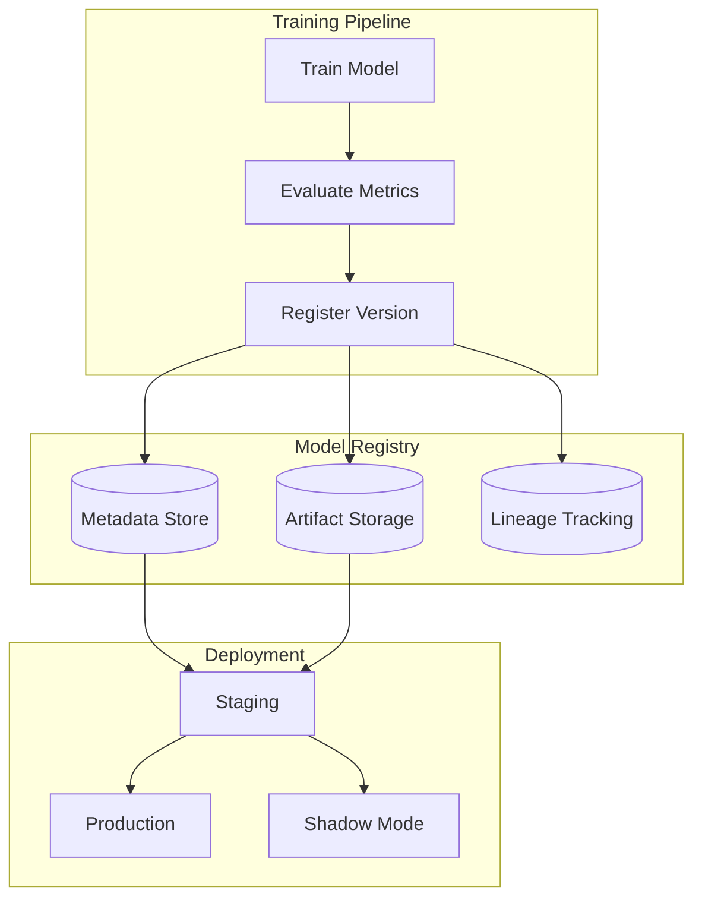
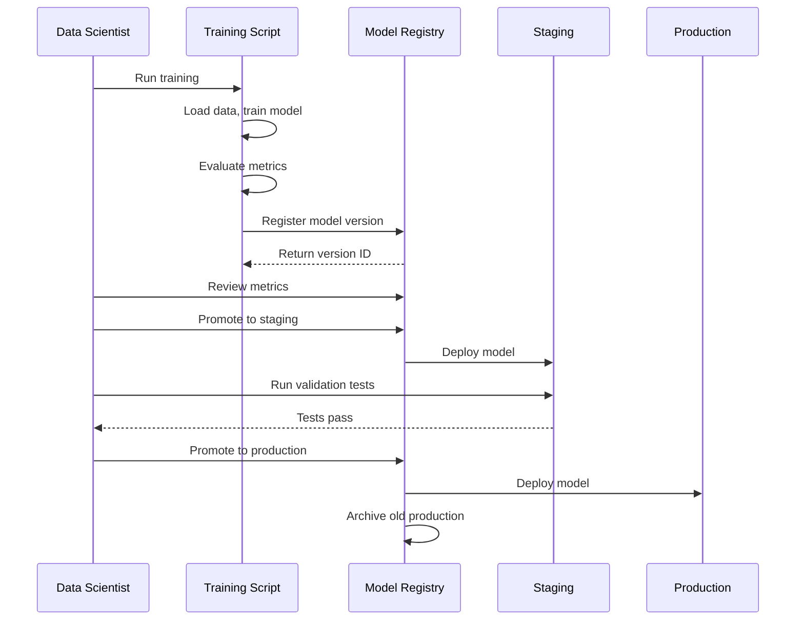

# How to Build Model Versioning

Author: [nawazdhandala](https://github.com/nawazdhandala)

Tags: MLOps, Machine Learning, Versioning, AI

Description: A practical guide to implementing model versioning systems that track, store, and manage machine learning models across their lifecycle from experimentation to production.

---

Training a machine learning model once is easy. Managing dozens of model versions across multiple environments, tracking which version performed best, and rolling back when something breaks in production is where things get complicated.

Model versioning solves this by treating ML models like source code: every change is tracked, every version is reproducible, and you can switch between versions at will. This guide covers how to build a model versioning system from scratch and integrate it with your existing ML pipeline.

## Why Model Versioning Matters

| Scenario | Without Versioning | With Versioning |
|----------|-------------------|-----------------|
| Production model degrades | Panic, retrain from scratch | Roll back to previous version in minutes |
| Need to compare models | Manual tracking in spreadsheets | Side-by-side metrics comparison |
| Audit request | "Which model was running last Tuesday?" | Instant lookup with full lineage |
| Reproduce results | Hunt for old notebooks and data | One command to restore exact environment |
| A/B testing | Manual deployment juggling | Deploy multiple versions simultaneously |

Model versioning is not optional for production ML. It is the foundation that makes everything else possible: reproducibility, auditability, rollbacks, and continuous improvement.

---

## Core Components of Model Versioning

A complete model versioning system has four essential components that work together to track, store, and manage models throughout their lifecycle.



### 1. Metadata Store

The metadata store holds everything about a model except the model itself: metrics, parameters, training data references, and version tags.

### 2. Artifact Storage

Artifact storage holds the actual model files. These can be large (gigabytes for deep learning models), so you need efficient storage with deduplication and compression.

### 3. Lineage Tracking

Lineage connects each model version to the data, code, and parameters that created it. This enables reproducibility and audit trails.

### 4. Version Control

Version control manages the lifecycle of models: which versions exist, which are in production, and how versions relate to each other.

---

## Building a Model Registry from Scratch

Let us build a simple but functional model registry in Python. This implementation stores models locally but the same patterns apply when using cloud storage.

### Project Structure

Organize your model registry code in a clear structure that separates concerns: core registry logic, storage backends, and CLI interface.

```
model_registry/
    __init__.py
    registry.py      # Core registry logic
    storage.py       # Storage backends
    metadata.py      # Metadata handling
    cli.py           # Command-line interface
```

### The Model Version Class

This class represents a single model version with all its associated metadata. Every registered model gets a unique version ID, and we track everything needed to reproduce and evaluate the model.

```python
# registry.py
import hashlib
import json
from dataclasses import dataclass, field
from datetime import datetime
from pathlib import Path
from typing import Any, Optional
import uuid

@dataclass
class ModelVersion:
    """
    Represents a single version of a model with all associated metadata.

    Attributes:
        model_name: Identifier for the model (e.g., 'fraud-detector')
        version: Semantic version or auto-generated version number
        metrics: Performance metrics from evaluation (accuracy, F1, etc.)
        parameters: Hyperparameters used during training
        tags: Key-value pairs for organizing and filtering models
        artifact_path: Location of the serialized model file
        created_at: Timestamp when this version was registered
        model_hash: SHA256 hash of model file for integrity verification
    """
    model_name: str
    version: str
    metrics: dict[str, float] = field(default_factory=dict)
    parameters: dict[str, Any] = field(default_factory=dict)
    tags: dict[str, str] = field(default_factory=dict)
    artifact_path: Optional[str] = None
    created_at: datetime = field(default_factory=datetime.utcnow)
    model_hash: Optional[str] = None

    def to_dict(self) -> dict:
        """Serialize to dictionary for JSON storage."""
        return {
            "model_name": self.model_name,
            "version": self.version,
            "metrics": self.metrics,
            "parameters": self.parameters,
            "tags": self.tags,
            "artifact_path": self.artifact_path,
            "created_at": self.created_at.isoformat(),
            "model_hash": self.model_hash,
        }

    @classmethod
    def from_dict(cls, data: dict) -> "ModelVersion":
        """Deserialize from dictionary."""
        data["created_at"] = datetime.fromisoformat(data["created_at"])
        return cls(**data)
```

### The Model Registry

The registry is the main interface for storing and retrieving model versions. It handles versioning logic, storage operations, and metadata queries.

```python
# registry.py (continued)

class ModelRegistry:
    """
    Central registry for managing model versions.

    The registry provides:
    - Automatic version numbering (1, 2, 3...) or custom versions
    - Metadata storage and querying
    - Model artifact storage with integrity checks
    - Stage management (staging, production, archived)
    """

    def __init__(self, storage_path: str = "./model_registry"):
        """
        Initialize the registry with a storage directory.

        Args:
            storage_path: Base directory for all registry data
        """
        self.storage_path = Path(storage_path)
        self.metadata_path = self.storage_path / "metadata"
        self.artifacts_path = self.storage_path / "artifacts"

        # Create directory structure on first use
        self.metadata_path.mkdir(parents=True, exist_ok=True)
        self.artifacts_path.mkdir(parents=True, exist_ok=True)

    def register(
        self,
        model_name: str,
        model_path: str,
        metrics: dict[str, float] = None,
        parameters: dict[str, Any] = None,
        tags: dict[str, str] = None,
        version: str = None,
    ) -> ModelVersion:
        """
        Register a new model version in the registry.

        Args:
            model_name: Identifier for this model (e.g., 'fraud-detector-v2')
            model_path: Path to the serialized model file
            metrics: Evaluation metrics (e.g., {'accuracy': 0.95, 'f1': 0.92})
            parameters: Training hyperparameters for reproducibility
            tags: Arbitrary key-value pairs for organization
            version: Custom version string; auto-increments if not provided

        Returns:
            ModelVersion object representing the registered model
        """
        # Auto-generate version number if not provided
        if version is None:
            version = self._get_next_version(model_name)

        # Calculate hash for integrity verification
        model_hash = self._calculate_hash(model_path)

        # Copy model artifact to registry storage
        artifact_dest = self._store_artifact(model_name, version, model_path)

        # Create version record
        model_version = ModelVersion(
            model_name=model_name,
            version=version,
            metrics=metrics or {},
            parameters=parameters or {},
            tags=tags or {},
            artifact_path=str(artifact_dest),
            model_hash=model_hash,
        )

        # Persist metadata
        self._save_metadata(model_version)

        return model_version

    def _get_next_version(self, model_name: str) -> str:
        """
        Generate the next version number for a model.

        Uses simple integer versioning: 1, 2, 3, etc.
        For production, consider semantic versioning (1.0.0, 1.0.1, etc.)
        """
        versions = self.list_versions(model_name)
        if not versions:
            return "1"

        # Find highest numeric version and increment
        numeric_versions = []
        for v in versions:
            try:
                numeric_versions.append(int(v.version))
            except ValueError:
                continue

        return str(max(numeric_versions, default=0) + 1)

    def _calculate_hash(self, file_path: str) -> str:
        """
        Calculate SHA256 hash of a file for integrity verification.

        This ensures we can detect if a model file was corrupted or tampered with.
        """
        sha256_hash = hashlib.sha256()
        with open(file_path, "rb") as f:
            # Read in chunks to handle large model files efficiently
            for byte_block in iter(lambda: f.read(4096), b""):
                sha256_hash.update(byte_block)
        return sha256_hash.hexdigest()

    def _store_artifact(
        self, model_name: str, version: str, source_path: str
    ) -> Path:
        """
        Copy model artifact to registry storage.

        Organizes artifacts by model name and version for easy navigation.
        """
        import shutil

        # Create model-specific directory
        model_dir = self.artifacts_path / model_name / version
        model_dir.mkdir(parents=True, exist_ok=True)

        # Preserve original filename
        source = Path(source_path)
        dest = model_dir / source.name
        shutil.copy2(source, dest)

        return dest

    def _save_metadata(self, model_version: ModelVersion) -> None:
        """Persist model version metadata to JSON file."""
        model_dir = self.metadata_path / model_version.model_name
        model_dir.mkdir(parents=True, exist_ok=True)

        metadata_file = model_dir / f"{model_version.version}.json"
        with open(metadata_file, "w") as f:
            json.dump(model_version.to_dict(), f, indent=2)

    def get_version(
        self, model_name: str, version: str
    ) -> Optional[ModelVersion]:
        """
        Retrieve a specific model version.

        Args:
            model_name: The model identifier
            version: The version to retrieve

        Returns:
            ModelVersion if found, None otherwise
        """
        metadata_file = self.metadata_path / model_name / f"{version}.json"
        if not metadata_file.exists():
            return None

        with open(metadata_file) as f:
            return ModelVersion.from_dict(json.load(f))

    def list_versions(self, model_name: str) -> list[ModelVersion]:
        """
        List all versions of a model, sorted by creation time.

        Returns:
            List of ModelVersion objects, newest first
        """
        model_dir = self.metadata_path / model_name
        if not model_dir.exists():
            return []

        versions = []
        for metadata_file in model_dir.glob("*.json"):
            with open(metadata_file) as f:
                versions.append(ModelVersion.from_dict(json.load(f)))

        # Sort by creation time, newest first
        return sorted(versions, key=lambda v: v.created_at, reverse=True)

    def get_latest(self, model_name: str) -> Optional[ModelVersion]:
        """Get the most recently registered version of a model."""
        versions = self.list_versions(model_name)
        return versions[0] if versions else None
```

### Adding Stage Management

Models move through stages: development, staging, production, and eventually archived. Stage management lets you track which version is deployed where.

```python
# registry.py (continued)

class ModelStage:
    """Valid stages for model deployment."""
    DEVELOPMENT = "development"
    STAGING = "staging"
    PRODUCTION = "production"
    ARCHIVED = "archived"

class ModelRegistry:
    # ... previous methods ...

    def set_stage(
        self, model_name: str, version: str, stage: str
    ) -> ModelVersion:
        """
        Transition a model version to a new stage.

        This is how you promote models through your deployment pipeline:
        development -> staging -> production

        Args:
            model_name: The model identifier
            version: The version to transition
            stage: Target stage (use ModelStage constants)

        Returns:
            Updated ModelVersion
        """
        model_version = self.get_version(model_name, version)
        if model_version is None:
            raise ValueError(f"Model {model_name} version {version} not found")

        # Update the stage tag
        model_version.tags["stage"] = stage
        model_version.tags["stage_updated_at"] = datetime.utcnow().isoformat()

        # Persist the change
        self._save_metadata(model_version)

        return model_version

    def get_production_model(self, model_name: str) -> Optional[ModelVersion]:
        """
        Get the current production version of a model.

        Returns:
            The ModelVersion currently in production, or None
        """
        versions = self.list_versions(model_name)
        for version in versions:
            if version.tags.get("stage") == ModelStage.PRODUCTION:
                return version
        return None

    def promote_to_production(
        self, model_name: str, version: str
    ) -> ModelVersion:
        """
        Promote a model version to production.

        Automatically demotes the current production model to archived.
        This ensures only one version is in production at a time.
        """
        # Demote current production model
        current_prod = self.get_production_model(model_name)
        if current_prod:
            self.set_stage(model_name, current_prod.version, ModelStage.ARCHIVED)

        # Promote new version
        return self.set_stage(model_name, version, ModelStage.PRODUCTION)
```

---

## Tracking Model Lineage

Lineage tracking connects models to their origins: what data trained them, what code produced them, and what environment they ran in. This is essential for reproducibility and debugging.

```python
# lineage.py
from dataclasses import dataclass, field
from datetime import datetime
from typing import Any, Optional
import json

@dataclass
class DatasetReference:
    """
    Reference to a dataset used for training or evaluation.

    We store references (paths, hashes) rather than copying data.
    This keeps the registry lightweight while maintaining traceability.
    """
    name: str
    version: str
    path: str
    hash: str
    row_count: Optional[int] = None
    created_at: Optional[str] = None

@dataclass
class CodeReference:
    """
    Reference to the code that produced a model.

    Linking to git commits ensures you can always recreate
    the exact training environment.
    """
    repository: str
    commit_hash: str
    branch: str
    entry_point: str  # e.g., "train.py" or "notebooks/training.ipynb"

@dataclass
class EnvironmentInfo:
    """
    Capture the runtime environment for reproducibility.

    Different package versions can produce different results
    even with identical code and data.
    """
    python_version: str
    packages: dict[str, str]  # package_name -> version
    hardware: Optional[dict[str, Any]] = None  # GPU info, etc.

@dataclass
class ModelLineage:
    """
    Complete lineage record for a model version.

    This answers: "What exactly produced this model?"
    """
    model_name: str
    version: str
    training_data: DatasetReference
    validation_data: Optional[DatasetReference] = None
    code: Optional[CodeReference] = None
    environment: Optional[EnvironmentInfo] = None
    parent_model: Optional[str] = None  # For fine-tuned models
    created_at: datetime = field(default_factory=datetime.utcnow)

    def to_dict(self) -> dict:
        """Serialize for storage."""
        return {
            "model_name": self.model_name,
            "version": self.version,
            "training_data": self.training_data.__dict__,
            "validation_data": (
                self.validation_data.__dict__
                if self.validation_data else None
            ),
            "code": self.code.__dict__ if self.code else None,
            "environment": (
                self.environment.__dict__
                if self.environment else None
            ),
            "parent_model": self.parent_model,
            "created_at": self.created_at.isoformat(),
        }
```

### Capturing Lineage Automatically

The best lineage tracking happens automatically during training. Here is a decorator that captures everything for you.

```python
# lineage.py (continued)
import subprocess
import sys
import pkg_resources

def get_git_info() -> Optional[CodeReference]:
    """
    Extract git information from the current repository.

    Returns None if not in a git repository.
    """
    try:
        # Get current commit hash
        commit = subprocess.check_output(
            ["git", "rev-parse", "HEAD"],
            stderr=subprocess.DEVNULL
        ).decode().strip()

        # Get current branch
        branch = subprocess.check_output(
            ["git", "rev-parse", "--abbrev-ref", "HEAD"],
            stderr=subprocess.DEVNULL
        ).decode().strip()

        # Get repository URL
        repo = subprocess.check_output(
            ["git", "remote", "get-url", "origin"],
            stderr=subprocess.DEVNULL
        ).decode().strip()

        return CodeReference(
            repository=repo,
            commit_hash=commit,
            branch=branch,
            entry_point=sys.argv[0],
        )
    except (subprocess.CalledProcessError, FileNotFoundError):
        return None

def get_environment_info() -> EnvironmentInfo:
    """
    Capture current Python environment.

    Records all installed packages and their versions.
    """
    packages = {
        pkg.key: pkg.version
        for pkg in pkg_resources.working_set
    }

    return EnvironmentInfo(
        python_version=sys.version,
        packages=packages,
    )

def track_lineage(
    model_name: str,
    training_data_path: str,
    training_data_hash: str,
    training_data_rows: int,
):
    """
    Decorator to automatically track model lineage.

    Wraps a training function and captures all lineage information
    before the function runs.

    Usage:
        @track_lineage("fraud-detector", "data/train.csv", "abc123", 10000)
        def train_model():
            # Your training code here
            return model
    """
    def decorator(train_func):
        def wrapper(*args, **kwargs):
            # Capture lineage before training
            lineage = ModelLineage(
                model_name=model_name,
                version="pending",  # Updated after registration
                training_data=DatasetReference(
                    name="training_data",
                    version="1",
                    path=training_data_path,
                    hash=training_data_hash,
                    row_count=training_data_rows,
                ),
                code=get_git_info(),
                environment=get_environment_info(),
            )

            # Run training
            result = train_func(*args, **kwargs)

            # Attach lineage to result for later use
            if hasattr(result, "__dict__"):
                result._lineage = lineage

            return result
        return wrapper
    return decorator
```

---

## Model Versioning Workflow

Here is how all the pieces fit together in a real training pipeline. The workflow moves from training through evaluation to registration and deployment.



### Complete Training Script Example

This script demonstrates the full workflow: training, evaluation, registration, and promotion.

```python
# train.py
import pickle
from sklearn.ensemble import RandomForestClassifier
from sklearn.datasets import make_classification
from sklearn.model_selection import train_test_split
from sklearn.metrics import accuracy_score, f1_score, precision_score, recall_score

from model_registry import ModelRegistry, ModelStage

def train_and_register():
    """
    Complete training pipeline with model versioning.

    This example uses scikit-learn, but the same pattern works
    with PyTorch, TensorFlow, or any other framework.
    """
    # Initialize the registry
    registry = ModelRegistry("./my_model_registry")

    # Generate sample data (replace with your actual data loading)
    X, y = make_classification(
        n_samples=10000,
        n_features=20,
        n_informative=15,
        n_redundant=5,
        random_state=42,
    )

    # Split into train/validation/test
    X_train, X_temp, y_train, y_temp = train_test_split(
        X, y, test_size=0.3, random_state=42
    )
    X_val, X_test, y_val, y_test = train_test_split(
        X_temp, y_temp, test_size=0.5, random_state=42
    )

    # Define hyperparameters (track these for reproducibility)
    params = {
        "n_estimators": 100,
        "max_depth": 10,
        "min_samples_split": 5,
        "random_state": 42,
    }

    # Train the model
    print("Training model...")
    model = RandomForestClassifier(**params)
    model.fit(X_train, y_train)

    # Evaluate on validation set
    val_predictions = model.predict(X_val)
    metrics = {
        "accuracy": accuracy_score(y_val, val_predictions),
        "f1": f1_score(y_val, val_predictions),
        "precision": precision_score(y_val, val_predictions),
        "recall": recall_score(y_val, val_predictions),
    }

    print(f"Validation metrics: {metrics}")

    # Save model to file
    model_path = "model.pkl"
    with open(model_path, "wb") as f:
        pickle.dump(model, f)

    # Register the model version
    model_version = registry.register(
        model_name="fraud-detector",
        model_path=model_path,
        metrics=metrics,
        parameters=params,
        tags={
            "framework": "sklearn",
            "algorithm": "random_forest",
            "dataset": "fraud_transactions_2024",
        },
    )

    print(f"Registered model version: {model_version.version}")
    print(f"Artifact stored at: {model_version.artifact_path}")

    # If metrics meet threshold, promote to staging
    if metrics["f1"] >= 0.85:
        print("Metrics meet threshold, promoting to staging...")
        registry.set_stage(
            "fraud-detector",
            model_version.version,
            ModelStage.STAGING,
        )

    return model_version

if __name__ == "__main__":
    train_and_register()
```

---

## Loading and Using Versioned Models

Once models are registered, you need to load them for inference. Here is a model loader that integrates with the registry.

```python
# model_loader.py
import pickle
from pathlib import Path
from typing import Any, Optional

from model_registry import ModelRegistry, ModelStage

class ModelLoader:
    """
    Load models from the registry for inference.

    Supports loading by version number, stage, or "latest".
    Caches loaded models to avoid repeated disk reads.
    """

    def __init__(self, registry: ModelRegistry):
        self.registry = registry
        self._cache: dict[str, Any] = {}

    def load(
        self,
        model_name: str,
        version: Optional[str] = None,
        stage: Optional[str] = None,
    ) -> Any:
        """
        Load a model from the registry.

        Args:
            model_name: The model to load
            version: Specific version (e.g., "5")
            stage: Load model at this stage (e.g., "production")

        If neither version nor stage is provided, loads the latest version.

        Returns:
            The deserialized model object
        """
        # Determine which version to load
        if version:
            model_version = self.registry.get_version(model_name, version)
        elif stage:
            # Find model at specified stage
            versions = self.registry.list_versions(model_name)
            model_version = next(
                (v for v in versions if v.tags.get("stage") == stage),
                None
            )
        else:
            model_version = self.registry.get_latest(model_name)

        if model_version is None:
            raise ValueError(
                f"No model found for {model_name} "
                f"(version={version}, stage={stage})"
            )

        # Check cache
        cache_key = f"{model_name}:{model_version.version}"
        if cache_key in self._cache:
            return self._cache[cache_key]

        # Load from disk
        model = self._load_artifact(model_version.artifact_path)

        # Verify integrity
        actual_hash = self.registry._calculate_hash(model_version.artifact_path)
        if actual_hash != model_version.model_hash:
            raise ValueError(
                f"Model file integrity check failed for {model_name} "
                f"version {model_version.version}"
            )

        # Cache and return
        self._cache[cache_key] = model
        return model

    def _load_artifact(self, artifact_path: str) -> Any:
        """
        Deserialize a model from its artifact file.

        Supports pickle format. Extend for other formats (ONNX, SavedModel).
        """
        path = Path(artifact_path)

        if path.suffix == ".pkl":
            with open(path, "rb") as f:
                return pickle.load(f)
        else:
            raise ValueError(f"Unsupported model format: {path.suffix}")

    def load_production(self, model_name: str) -> Any:
        """Convenience method to load the production model."""
        return self.load(model_name, stage=ModelStage.PRODUCTION)

    def clear_cache(self):
        """Clear the model cache to free memory."""
        self._cache.clear()


# Usage in an inference service
def create_inference_service():
    """
    Example inference service that uses versioned models.
    """
    registry = ModelRegistry("./my_model_registry")
    loader = ModelLoader(registry)

    # Load the production model
    model = loader.load_production("fraud-detector")

    def predict(features):
        """Run inference using the production model."""
        return model.predict([features])[0]

    return predict
```

---

## Comparing Model Versions

When you have multiple versions, you need tools to compare them. Here is a comparison utility that helps you understand how models differ.

```python
# comparison.py
from typing import Optional
from model_registry import ModelRegistry, ModelVersion

def compare_versions(
    registry: ModelRegistry,
    model_name: str,
    version_a: str,
    version_b: str,
) -> dict:
    """
    Compare two model versions side by side.

    Returns a detailed comparison including metrics differences,
    parameter changes, and metadata.
    """
    model_a = registry.get_version(model_name, version_a)
    model_b = registry.get_version(model_name, version_b)

    if not model_a or not model_b:
        raise ValueError("One or both versions not found")

    # Compare metrics
    metric_diff = {}
    all_metrics = set(model_a.metrics.keys()) | set(model_b.metrics.keys())

    for metric in all_metrics:
        val_a = model_a.metrics.get(metric)
        val_b = model_b.metrics.get(metric)

        if val_a is not None and val_b is not None:
            change = val_b - val_a
            pct_change = (change / val_a * 100) if val_a != 0 else 0
            metric_diff[metric] = {
                "version_a": val_a,
                "version_b": val_b,
                "change": change,
                "percent_change": round(pct_change, 2),
            }
        else:
            metric_diff[metric] = {
                "version_a": val_a,
                "version_b": val_b,
                "change": None,
            }

    # Compare parameters
    param_diff = {}
    all_params = set(model_a.parameters.keys()) | set(model_b.parameters.keys())

    for param in all_params:
        val_a = model_a.parameters.get(param)
        val_b = model_b.parameters.get(param)

        if val_a != val_b:
            param_diff[param] = {
                "version_a": val_a,
                "version_b": val_b,
            }

    return {
        "model_name": model_name,
        "version_a": version_a,
        "version_b": version_b,
        "metrics": metric_diff,
        "parameter_changes": param_diff,
        "time_difference": str(model_b.created_at - model_a.created_at),
    }

def print_comparison(comparison: dict) -> None:
    """Pretty print a model comparison."""
    print(f"\n{'='*60}")
    print(f"Model Comparison: {comparison['model_name']}")
    print(f"Version {comparison['version_a']} vs {comparison['version_b']}")
    print(f"{'='*60}\n")

    print("METRICS:")
    print("-" * 40)
    for metric, values in comparison["metrics"].items():
        if values["change"] is not None:
            indicator = "+" if values["change"] > 0 else ""
            print(
                f"  {metric}: {values['version_a']:.4f} -> "
                f"{values['version_b']:.4f} ({indicator}{values['change']:.4f}, "
                f"{indicator}{values['percent_change']}%)"
            )
        else:
            print(f"  {metric}: {values['version_a']} -> {values['version_b']}")

    if comparison["parameter_changes"]:
        print("\nPARAMETER CHANGES:")
        print("-" * 40)
        for param, values in comparison["parameter_changes"].items():
            print(f"  {param}: {values['version_a']} -> {values['version_b']}")

    print(f"\nTime between versions: {comparison['time_difference']}")
```

---

## Integration with MLflow

If you prefer using an established tool, MLflow provides robust model versioning. Here is how to integrate it.

```python
# mlflow_integration.py
import mlflow
from mlflow.tracking import MlflowClient

def setup_mlflow_tracking(tracking_uri: str = "sqlite:///mlflow.db"):
    """
    Configure MLflow for model tracking.

    MLflow provides:
    - Experiment tracking
    - Model registry with stages
    - Artifact storage
    - UI for visualization
    """
    mlflow.set_tracking_uri(tracking_uri)
    return MlflowClient()

def train_with_mlflow():
    """
    Training script using MLflow for versioning.

    MLflow automatically tracks parameters, metrics, and artifacts
    when you use its context manager.
    """
    from sklearn.ensemble import RandomForestClassifier
    from sklearn.datasets import make_classification
    from sklearn.model_selection import train_test_split
    from sklearn.metrics import accuracy_score, f1_score

    # Set up tracking
    mlflow.set_experiment("fraud-detection")

    # Start a new run
    with mlflow.start_run():
        # Log parameters (automatically versioned)
        params = {
            "n_estimators": 100,
            "max_depth": 10,
            "min_samples_split": 5,
        }
        mlflow.log_params(params)

        # Prepare data
        X, y = make_classification(n_samples=10000, n_features=20)
        X_train, X_test, y_train, y_test = train_test_split(X, y)

        # Train model
        model = RandomForestClassifier(**params)
        model.fit(X_train, y_train)

        # Evaluate and log metrics
        predictions = model.predict(X_test)
        metrics = {
            "accuracy": accuracy_score(y_test, predictions),
            "f1": f1_score(y_test, predictions),
        }
        mlflow.log_metrics(metrics)

        # Log the model to the registry
        mlflow.sklearn.log_model(
            model,
            artifact_path="model",
            registered_model_name="fraud-detector",
        )

        print(f"Run ID: {mlflow.active_run().info.run_id}")

def promote_model_mlflow(model_name: str, version: int, stage: str):
    """
    Promote a model version to a new stage in MLflow.

    Stages: None -> Staging -> Production -> Archived
    """
    client = MlflowClient()

    # Transition the model version
    client.transition_model_version_stage(
        name=model_name,
        version=version,
        stage=stage,
    )

    print(f"Transitioned {model_name} v{version} to {stage}")

def load_production_model_mlflow(model_name: str):
    """
    Load the production model from MLflow registry.

    MLflow handles artifact location and deserialization automatically.
    """
    model_uri = f"models:/{model_name}/Production"
    model = mlflow.sklearn.load_model(model_uri)
    return model
```

---

## Best Practices for Model Versioning

### 1. Version Everything

Do not just version the model file. Version the complete context required for reproducibility.

| What to Version | Why It Matters |
|-----------------|----------------|
| Model weights | The actual trained model |
| Hyperparameters | Required to retrain the model |
| Training code | The logic that produced the model |
| Data references | What data was used (paths, hashes, versions) |
| Environment | Package versions affect reproducibility |
| Evaluation metrics | Compare performance across versions |
| Preprocessing code | Data transformations must match |

### 2. Use Semantic Versioning for Production Models

For production models, consider semantic versioning to communicate the nature of changes.

```python
# versioning_scheme.py

def get_semantic_version(
    current_version: str,
    change_type: str,  # "major", "minor", "patch"
) -> str:
    """
    Generate next semantic version based on change type.

    - Major (1.0.0 -> 2.0.0): Breaking changes, different model architecture
    - Minor (1.0.0 -> 1.1.0): New features, retraining with new data
    - Patch (1.0.0 -> 1.0.1): Bug fixes, minor improvements
    """
    parts = current_version.split(".")
    major, minor, patch = int(parts[0]), int(parts[1]), int(parts[2])

    if change_type == "major":
        return f"{major + 1}.0.0"
    elif change_type == "minor":
        return f"{major}.{minor + 1}.0"
    else:
        return f"{major}.{minor}.{patch + 1}"
```

### 3. Automate Validation Before Promotion

Never promote models without automated validation. This prevents bad models from reaching production.

```python
# validation.py

def validate_model_for_promotion(
    registry: ModelRegistry,
    model_name: str,
    version: str,
    min_metrics: dict[str, float],
) -> tuple[bool, list[str]]:
    """
    Validate a model meets minimum requirements for promotion.

    Returns (is_valid, list_of_failures)
    """
    model_version = registry.get_version(model_name, version)
    failures = []

    # Check each metric meets minimum threshold
    for metric, min_value in min_metrics.items():
        actual = model_version.metrics.get(metric)
        if actual is None:
            failures.append(f"Missing required metric: {metric}")
        elif actual < min_value:
            failures.append(
                f"{metric} ({actual:.4f}) below minimum ({min_value:.4f})"
            )

    # Check required metadata exists
    if not model_version.parameters:
        failures.append("Missing training parameters")

    if not model_version.model_hash:
        failures.append("Missing model hash for integrity verification")

    return len(failures) == 0, failures
```

### 4. Implement Rollback Procedures

When production models fail, you need fast rollbacks. Build this into your deployment process.

```python
# rollback.py

def rollback_to_previous(
    registry: ModelRegistry,
    model_name: str,
) -> Optional[ModelVersion]:
    """
    Rollback to the previous production model.

    Archives the current production model and promotes the most recent
    archived version back to production.
    """
    # Find current production
    current_prod = registry.get_production_model(model_name)
    if not current_prod:
        print("No production model to rollback from")
        return None

    # Find the most recent archived model
    versions = registry.list_versions(model_name)
    archived = [
        v for v in versions
        if v.tags.get("stage") == ModelStage.ARCHIVED
    ]

    if not archived:
        print("No archived versions available for rollback")
        return None

    # Sort by when they were archived (most recent first)
    previous = archived[0]

    # Perform rollback
    registry.set_stage(model_name, current_prod.version, ModelStage.ARCHIVED)
    registry.set_stage(model_name, previous.version, ModelStage.PRODUCTION)

    print(
        f"Rolled back from version {current_prod.version} "
        f"to version {previous.version}"
    )

    return previous
```

---

## Summary

Model versioning transforms ML development from "it works on my laptop" to production-ready engineering. The key components are:

| Component | Purpose |
|-----------|---------|
| **Model Registry** | Central storage for model versions and metadata |
| **Lineage Tracking** | Connect models to data, code, and environment |
| **Stage Management** | Control model promotion through environments |
| **Artifact Storage** | Efficiently store and retrieve model files |
| **Comparison Tools** | Understand differences between versions |

Start simple with a file-based registry. As your needs grow, consider tools like MLflow, DVC, or Weights & Biases for additional features like experiment tracking, distributed storage, and team collaboration.

The investment in model versioning pays off the first time you need to answer "what changed?" or "can we rollback?" Building these practices early prevents painful debugging sessions later.

---

**Related Reading:**

- [Basics of Profiling](https://oneuptime.com/blog/post/2025-09-09-basics-of-profiling/view)
- [How to Use Worker Threads in Node.js](https://oneuptime.com/blog/post/2026-01-06-nodejs-worker-threads-cpu-intensive/view)
- [Python Structured Logging with OpenTelemetry](https://oneuptime.com/blog/post/2025-01-06-python-structured-logging-opentelemetry/view)

---

*Building ML systems that need monitoring? OneUptime provides comprehensive observability for your machine learning pipelines, from training jobs to inference endpoints. Track model performance, detect drift, and alert on anomalies with a unified platform.*
