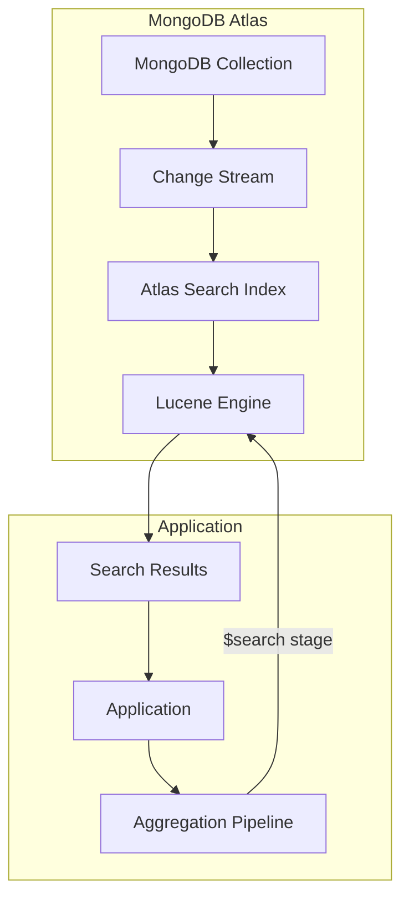
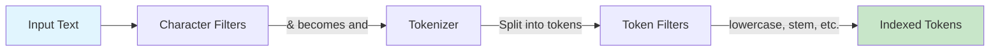
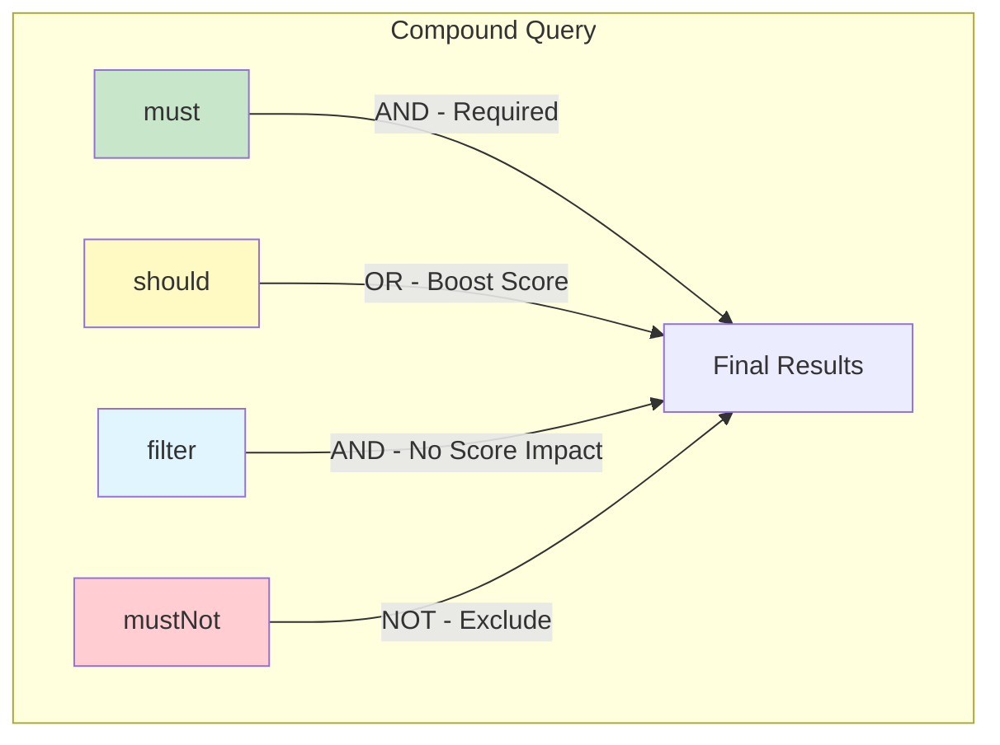
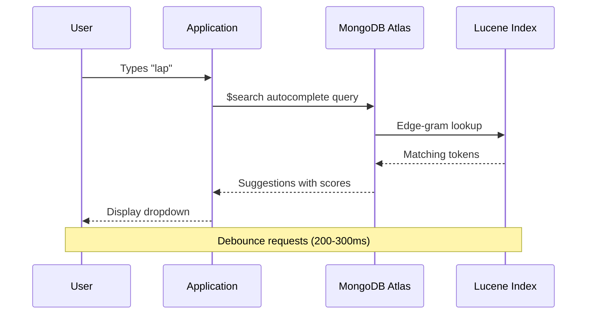
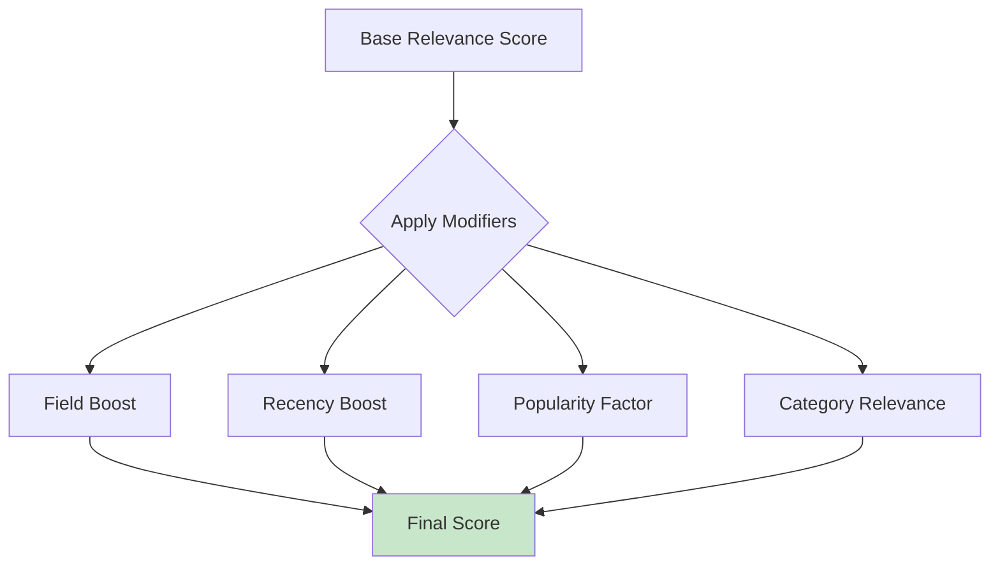

# How to Build MongoDB Atlas Search Advanced

Author: [nawazdhandala](https://github.com/nawazdhandala)

Tags: MongoDB, Atlas Search, Full-Text Search, Lucene

Description: Learn to implement advanced Atlas Search with custom analyzers, faceted search, and autocomplete for powerful full-text search capabilities.

---

MongoDB Atlas Search brings the power of Apache Lucene directly into your MongoDB database, enabling sophisticated full-text search without managing separate search infrastructure. In this guide, we will explore advanced Atlas Search features including custom analyzers, complex search operators, faceted navigation, and autocomplete functionality.

## Architecture Overview

Before diving into implementation, let us understand how Atlas Search integrates with MongoDB:



Atlas Search continuously syncs your collection data through change streams, maintaining a Lucene-based index that powers all search operations.

## Setting Up Your First Search Index

### Basic Index Definition

Create a search index through the Atlas UI or using the MongoDB shell. Here is a comprehensive index definition for a products collection:

```json
{
  "name": "products_search_index",
  "definition": {
    "mappings": {
      "dynamic": false,
      "fields": {
        "name": {
          "type": "string",
          "analyzer": "lucene.standard"
        },
        "description": {
          "type": "string",
          "analyzer": "lucene.english"
        },
        "category": {
          "type": "stringFacet"
        },
        "price": {
          "type": "number"
        },
        "tags": {
          "type": "string",
          "multi": {
            "keywordAnalyzer": {
              "type": "string",
              "analyzer": "lucene.keyword"
            }
          }
        },
        "createdAt": {
          "type": "date"
        }
      }
    }
  }
}
```

### Understanding Field Types

The index definition above uses several field types:

| Field Type | Use Case | Example |
|------------|----------|---------|
| `string` | Full-text searchable content | Product names, descriptions |
| `stringFacet` | Categorical filtering and counting | Categories, brands |
| `number` | Numeric range queries | Prices, quantities |
| `date` | Date range filtering | Creation dates, timestamps |
| `boolean` | True/false filtering | Active status, featured flags |

## Custom Analyzers

Custom analyzers give you fine-grained control over text processing. Let us build an analyzer optimized for e-commerce product search:

```json
{
  "name": "products_advanced_index",
  "definition": {
    "analyzers": [
      {
        "name": "productAnalyzer",
        "charFilters": [
          {
            "type": "mapping",
            "mappings": {
              "&": " and ",
              "+": " plus "
            }
          }
        ],
        "tokenizer": {
          "type": "standard"
        },
        "tokenFilters": [
          {
            "type": "lowercase"
          },
          {
            "type": "snowballStemming",
            "stemmerName": "english"
          },
          {
            "type": "stopword",
            "tokens": ["the", "a", "an", "is", "are", "was", "were"]
          },
          {
            "type": "shingle",
            "minShingleSize": 2,
            "maxShingleSize": 3
          }
        ]
      },
      {
        "name": "autocompleteAnalyzer",
        "tokenizer": {
          "type": "standard"
        },
        "tokenFilters": [
          {
            "type": "lowercase"
          },
          {
            "type": "edgeGram",
            "minGram": 2,
            "maxGram": 15
          }
        ]
      }
    ],
    "mappings": {
      "dynamic": false,
      "fields": {
        "name": {
          "type": "string",
          "analyzer": "productAnalyzer",
          "searchAnalyzer": "lucene.standard"
        },
        "nameAutocomplete": {
          "type": "autocomplete",
          "analyzer": "autocompleteAnalyzer",
          "tokenization": "edgeGram",
          "minGrams": 2,
          "maxGrams": 15
        }
      }
    }
  }
}
```

### Analyzer Pipeline Flow



## Advanced Search Operators

### Compound Queries

The `compound` operator lets you combine multiple search clauses with boolean logic:

```javascript
db.products.aggregate([
  {
    $search: {
      index: "products_search_index",
      compound: {
        must: [
          {
            text: {
              query: "wireless headphones",
              path: "name",
              fuzzy: {
                maxEdits: 1,
                prefixLength: 3
              }
            }
          }
        ],
        should: [
          {
            text: {
              query: "bluetooth noise cancelling",
              path: "description",
              score: { boost: { value: 2 } }
            }
          }
        ],
        filter: [
          {
            range: {
              path: "price",
              gte: 50,
              lte: 300
            }
          }
        ],
        mustNot: [
          {
            text: {
              query: "refurbished used",
              path: "description"
            }
          }
        ]
      }
    }
  },
  {
    $limit: 20
  },
  {
    $project: {
      name: 1,
      price: 1,
      score: { $meta: "searchScore" }
    }
  }
])
```

### Compound Operator Logic



### Phrase and Near Queries

Search for exact phrases or words near each other:

```javascript
// Exact phrase search
db.articles.aggregate([
  {
    $search: {
      index: "articles_index",
      phrase: {
        query: "machine learning",
        path: "content",
        slop: 2  // Allow up to 2 words between terms
      }
    }
  }
])

// Near query - terms within proximity
db.articles.aggregate([
  {
    $search: {
      index: "articles_index",
      near: {
        path: "publishedDate",
        origin: ISODate("2026-01-01"),
        pivot: 7776000000  // 90 days in milliseconds
      }
    }
  }
])
```

### Wildcard and Regex Searches

```javascript
// Wildcard search
db.products.aggregate([
  {
    $search: {
      index: "products_search_index",
      wildcard: {
        query: "head*",  // Matches headphones, headset, etc.
        path: "name",
        allowAnalyzedField: true
      }
    }
  }
])

// Regex search
db.products.aggregate([
  {
    $search: {
      index: "products_search_index",
      regex: {
        query: "model-[A-Z]{2}[0-9]{3}",
        path: "sku",
        allowAnalyzedField: true
      }
    }
  }
])
```

## Implementing Faceted Search

Faceted search enables users to filter results by categories while seeing counts for each facet value.

### Index Configuration for Facets

```json
{
  "name": "products_facet_index",
  "definition": {
    "mappings": {
      "dynamic": false,
      "fields": {
        "name": {
          "type": "string"
        },
        "category": {
          "type": "stringFacet"
        },
        "brand": {
          "type": "stringFacet"
        },
        "price": {
          "type": "numberFacet"
        },
        "rating": {
          "type": "numberFacet"
        }
      }
    }
  }
}
```

### Facet Query Implementation

```javascript
db.products.aggregate([
  {
    $searchMeta: {
      index: "products_facet_index",
      facet: {
        operator: {
          text: {
            query: "laptop",
            path: "name"
          }
        },
        facets: {
          categoryFacet: {
            type: "string",
            path: "category",
            numBuckets: 10
          },
          brandFacet: {
            type: "string",
            path: "brand",
            numBuckets: 20
          },
          priceFacet: {
            type: "number",
            path: "price",
            boundaries: [0, 500, 1000, 1500, 2000, 3000],
            default: "3000+"
          },
          ratingFacet: {
            type: "number",
            path: "rating",
            boundaries: [1, 2, 3, 4, 5]
          }
        }
      }
    }
  }
])
```

### Facet Response Structure

The query returns facet counts alongside your search results:

```javascript
{
  "count": { "lowerBound": 1523 },
  "facet": {
    "categoryFacet": {
      "buckets": [
        { "_id": "Electronics", "count": 542 },
        { "_id": "Computers", "count": 423 },
        { "_id": "Gaming", "count": 218 }
      ]
    },
    "priceFacet": {
      "buckets": [
        { "_id": 0, "count": 89 },
        { "_id": 500, "count": 312 },
        { "_id": 1000, "count": 567 },
        { "_id": 1500, "count": 342 },
        { "_id": 2000, "count": 156 },
        { "_id": "3000+", "count": 57 }
      ]
    }
  }
}
```

### Combining Facets with Search Results

```javascript
// Get both facet counts and actual results
const facetResults = await db.products.aggregate([
  {
    $searchMeta: {
      index: "products_facet_index",
      facet: {
        operator: { text: { query: "laptop", path: "name" } },
        facets: {
          categoryFacet: { type: "string", path: "category" }
        }
      }
    }
  }
]).toArray();

const searchResults = await db.products.aggregate([
  {
    $search: {
      index: "products_facet_index",
      text: { query: "laptop", path: "name" }
    }
  },
  { $limit: 20 },
  { $project: { name: 1, price: 1, category: 1 } }
]).toArray();

// Combine for API response
const response = {
  facets: facetResults[0].facet,
  totalCount: facetResults[0].count,
  results: searchResults
};
```

## Building Autocomplete

Autocomplete provides instant search suggestions as users type.

### Autocomplete Index Setup

```json
{
  "name": "autocomplete_index",
  "definition": {
    "mappings": {
      "dynamic": false,
      "fields": {
        "name": [
          {
            "type": "autocomplete",
            "tokenization": "edgeGram",
            "minGrams": 2,
            "maxGrams": 20,
            "foldDiacritics": true
          },
          {
            "type": "string"
          }
        ],
        "brand": {
          "type": "autocomplete",
          "tokenization": "edgeGram",
          "minGrams": 2,
          "maxGrams": 15
        }
      }
    }
  }
}
```

### Autocomplete Query

```javascript
db.products.aggregate([
  {
    $search: {
      index: "autocomplete_index",
      autocomplete: {
        query: "lap",
        path: "name",
        tokenOrder: "sequential",
        fuzzy: {
          maxEdits: 1,
          prefixLength: 2
        }
      }
    }
  },
  { $limit: 10 },
  {
    $project: {
      _id: 0,
      name: 1,
      score: { $meta: "searchScore" }
    }
  }
])
```

### Multi-field Autocomplete with Highlighting

```javascript
db.products.aggregate([
  {
    $search: {
      index: "autocomplete_index",
      compound: {
        should: [
          {
            autocomplete: {
              query: "sam",
              path: "name",
              score: { boost: { value: 3 } }
            }
          },
          {
            autocomplete: {
              query: "sam",
              path: "brand",
              score: { boost: { value: 2 } }
            }
          }
        ]
      },
      highlight: {
        path: ["name", "brand"]
      }
    }
  },
  { $limit: 10 },
  {
    $project: {
      name: 1,
      brand: 1,
      score: { $meta: "searchScore" },
      highlights: { $meta: "searchHighlights" }
    }
  }
])
```

### Autocomplete Flow



## Scoring and Relevance Tuning

### Custom Scoring Functions

```javascript
db.products.aggregate([
  {
    $search: {
      index: "products_search_index",
      compound: {
        must: [
          {
            text: {
              query: "gaming laptop",
              path: "name",
              score: {
                function: {
                  multiply: [
                    { score: "relevance" },
                    {
                      path: {
                        value: "popularityScore",
                        undefined: 1
                      }
                    }
                  ]
                }
              }
            }
          }
        ],
        should: [
          {
            near: {
              path: "createdAt",
              origin: new Date(),
              pivot: 2592000000,  // 30 days
              score: { boost: { value: 1.5 } }
            }
          }
        ]
      }
    }
  }
])
```

### Score Boosting Strategies



### Explaining Scores

Debug scoring with the explain option:

```javascript
db.products.aggregate([
  {
    $search: {
      index: "products_search_index",
      text: {
        query: "wireless mouse",
        path: "name"
      },
      scoreDetails: true
    }
  },
  { $limit: 5 },
  {
    $project: {
      name: 1,
      score: { $meta: "searchScore" },
      scoreDetails: { $meta: "searchScoreDetails" }
    }
  }
])
```

## Production Best Practices

### Index Management

```javascript
// Create index programmatically
const indexDefinition = {
  name: "production_index",
  definition: {
    mappings: {
      dynamic: false,
      fields: {
        // ... field definitions
      }
    }
  }
};

// Using the Atlas Admin API
await atlasAdminApi.createSearchIndex(
  clusterId,
  databaseName,
  collectionName,
  indexDefinition
);
```

### Performance Optimization

1. **Use Specific Field Mappings**: Avoid `dynamic: true` in production
2. **Limit Returned Fields**: Project only necessary fields
3. **Implement Pagination**: Use `$skip` and `$limit` appropriately
4. **Cache Facet Results**: Cache facet counts that change infrequently
5. **Monitor Index Size**: Track index storage and sync latency

```javascript
// Efficient pagination pattern
async function searchWithPagination(query, page, pageSize) {
  const skip = (page - 1) * pageSize;

  return db.products.aggregate([
    {
      $search: {
        index: "products_search_index",
        text: { query, path: "name" }
      }
    },
    { $skip: skip },
    { $limit: pageSize },
    {
      $project: {
        name: 1,
        price: 1,
        score: { $meta: "searchScore" }
      }
    }
  ]).toArray();
}
```

### Error Handling

```javascript
async function safeSearch(query) {
  try {
    const results = await db.products.aggregate([
      {
        $search: {
          index: "products_search_index",
          text: {
            query: query,
            path: "name"
          }
        }
      },
      { $limit: 20 }
    ]).toArray();

    return { success: true, data: results };
  } catch (error) {
    if (error.codeName === 'AtlasSearchError') {
      // Index might be building or unavailable
      console.error('Search index error:', error.message);
      return { success: false, fallback: true };
    }
    throw error;
  }
}
```

## Complete Example: E-commerce Search Service

Here is a complete Node.js service implementing all features:

```javascript
const { MongoClient } = require('mongodb');

class ProductSearchService {
  constructor(mongoUri, dbName) {
    this.client = new MongoClient(mongoUri);
    this.dbName = dbName;
  }

  async connect() {
    await this.client.connect();
    this.db = this.client.db(this.dbName);
    this.products = this.db.collection('products');
  }

  async search({ query, filters, facets, page = 1, pageSize = 20 }) {
    const searchStage = this.buildSearchStage(query, filters);
    const skip = (page - 1) * pageSize;

    const pipeline = [
      { $search: searchStage },
      { $skip: skip },
      { $limit: pageSize },
      {
        $project: {
          name: 1,
          description: 1,
          price: 1,
          category: 1,
          score: { $meta: 'searchScore' },
          highlights: { $meta: 'searchHighlights' }
        }
      }
    ];

    const [results, facetResults] = await Promise.all([
      this.products.aggregate(pipeline).toArray(),
      facets ? this.getFacets(query, filters) : null
    ]);

    return {
      results,
      facets: facetResults,
      pagination: { page, pageSize }
    };
  }

  buildSearchStage(query, filters) {
    const compound = {
      must: [],
      filter: [],
      should: []
    };

    // Main text search
    if (query) {
      compound.must.push({
        text: {
          query,
          path: ['name', 'description'],
          fuzzy: { maxEdits: 1 }
        }
      });
    }

    // Category filter
    if (filters?.category) {
      compound.filter.push({
        text: {
          query: filters.category,
          path: 'category'
        }
      });
    }

    // Price range filter
    if (filters?.minPrice || filters?.maxPrice) {
      compound.filter.push({
        range: {
          path: 'price',
          gte: filters.minPrice || 0,
          lte: filters.maxPrice || Number.MAX_VALUE
        }
      });
    }

    // Boost recent products
    compound.should.push({
      near: {
        path: 'createdAt',
        origin: new Date(),
        pivot: 2592000000,
        score: { boost: { value: 1.2 } }
      }
    });

    return {
      index: 'products_search_index',
      compound,
      highlight: { path: ['name', 'description'] }
    };
  }

  async getFacets(query, filters) {
    const result = await this.products.aggregate([
      {
        $searchMeta: {
          index: 'products_search_index',
          facet: {
            operator: query ? { text: { query, path: 'name' } } : { exists: { path: 'name' } },
            facets: {
              categories: { type: 'string', path: 'category', numBuckets: 20 },
              priceRanges: {
                type: 'number',
                path: 'price',
                boundaries: [0, 100, 500, 1000, 5000]
              }
            }
          }
        }
      }
    ]).toArray();

    return result[0]?.facet || {};
  }

  async autocomplete(query, limit = 10) {
    return this.products.aggregate([
      {
        $search: {
          index: 'autocomplete_index',
          autocomplete: {
            query,
            path: 'name',
            fuzzy: { maxEdits: 1, prefixLength: 2 }
          }
        }
      },
      { $limit: limit },
      { $project: { _id: 0, name: 1 } }
    ]).toArray();
  }

  async close() {
    await this.client.close();
  }
}

module.exports = ProductSearchService;
```

## Conclusion

MongoDB Atlas Search provides a powerful, integrated solution for full-text search that eliminates the need for separate search infrastructure. By leveraging custom analyzers, compound queries, faceted search, and autocomplete, you can build sophisticated search experiences directly within your MongoDB ecosystem.

Key takeaways:

- Define explicit field mappings for production indexes
- Use custom analyzers to control text processing
- Combine compound operators for complex search logic
- Implement faceted search for filtering and navigation
- Add autocomplete for instant user feedback
- Tune relevance with custom scoring functions

The tight integration with MongoDB's aggregation pipeline means you can combine search with other database operations, making Atlas Search an excellent choice for applications requiring both powerful search and flexible data processing.
