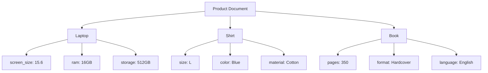
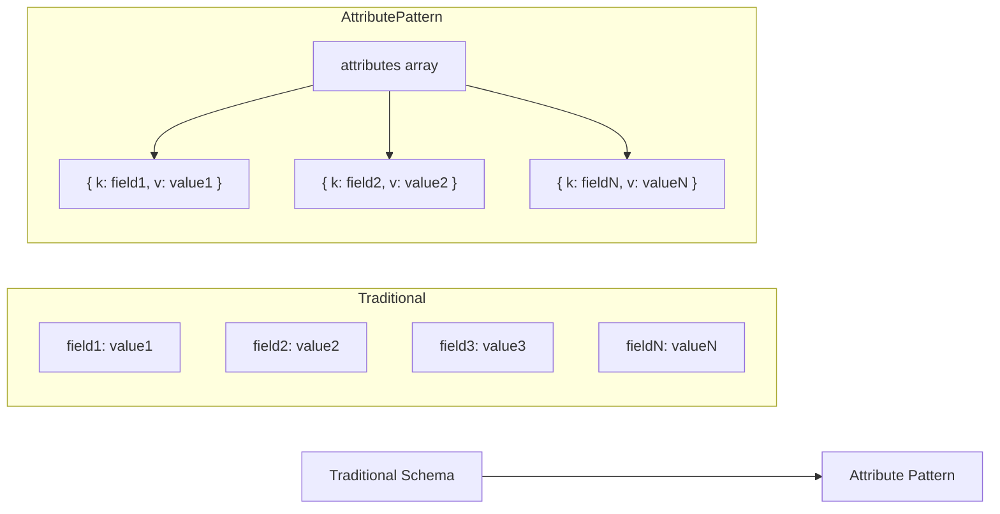
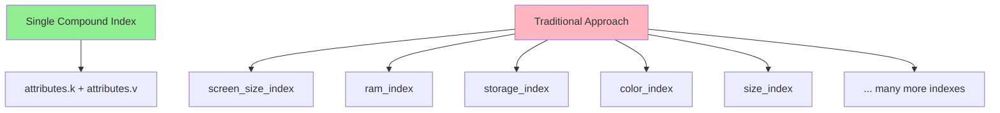
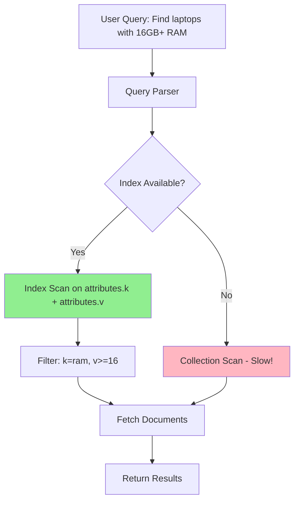
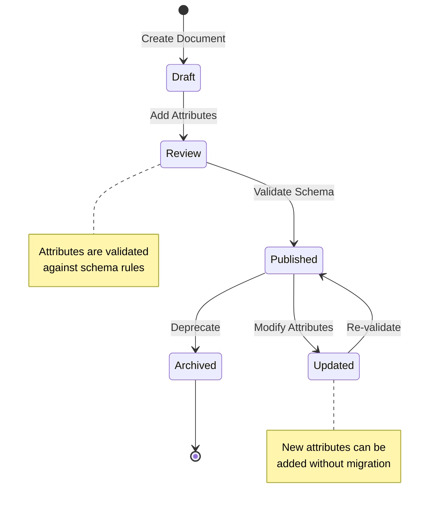
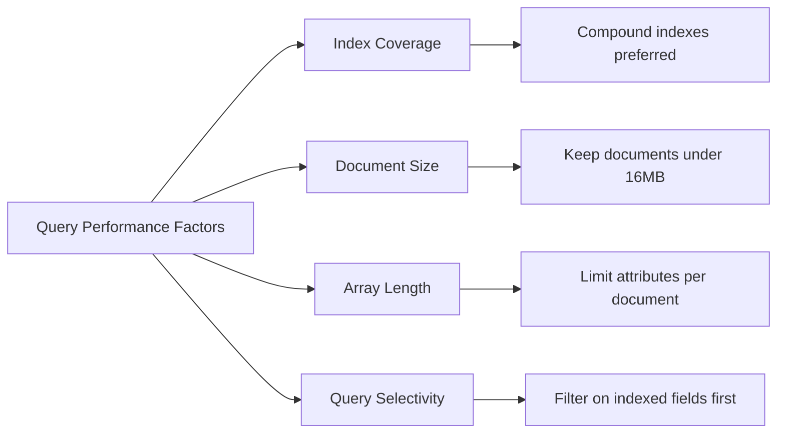

# How to Create MongoDB Attribute Patterns

Author: [nawazdhandala](https://github.com/nawazdhandala)

Tags: MongoDB, Attribute Pattern, Schema Design, Flexible Data

Description: Learn to implement attribute patterns for handling documents with many similar fields using key-value pairs for efficient querying and indexing.

---

## Introduction

When working with MongoDB, you may encounter scenarios where documents have many similar fields that share common characteristics but vary in their names. Traditional schema design would require creating a separate field for each attribute, leading to sparse documents and inefficient indexing. The **Attribute Pattern** solves this problem by restructuring data into an array of key-value pairs.

This pattern is particularly useful for:

- Product catalogs with varying specifications
- User profiles with custom fields
- Content management systems with dynamic metadata
- Any domain where attributes are unpredictable or highly variable

## Understanding the Problem

Consider an e-commerce product catalog. Different products have different specifications:



With a traditional approach, you would need fields for every possible attribute across all products. This creates several problems:

1. **Sparse documents** - Most fields are empty for any given product
2. **Index explosion** - You need separate indexes for each searchable field
3. **Schema rigidity** - Adding new attributes requires schema changes
4. **Query complexity** - Searching across multiple fields becomes cumbersome

## The Attribute Pattern Solution

The Attribute Pattern transforms these varied fields into a uniform array structure:



### Basic Structure

Here is how the pattern transforms a product document:

**Before (Traditional Schema):**

```javascript
{
  "_id": ObjectId("507f1f77bcf86cd799439011"),
  "name": "Gaming Laptop",
  "brand": "TechCorp",
  "price": 1299.99,
  "screen_size": 15.6,
  "screen_resolution": "1920x1080",
  "ram_size": 16,
  "ram_type": "DDR5",
  "storage_size": 512,
  "storage_type": "NVMe SSD",
  "gpu_model": "RTX 4060",
  "gpu_memory": 8,
  "battery_capacity": 86,
  "weight": 2.1
}
```

**After (Attribute Pattern):**

```javascript
{
  "_id": ObjectId("507f1f77bcf86cd799439011"),
  "name": "Gaming Laptop",
  "brand": "TechCorp",
  "price": 1299.99,
  "attributes": [
    { "k": "screen_size", "v": 15.6, "u": "inches" },
    { "k": "screen_resolution", "v": "1920x1080" },
    { "k": "ram_size", "v": 16, "u": "GB" },
    { "k": "ram_type", "v": "DDR5" },
    { "k": "storage_size", "v": 512, "u": "GB" },
    { "k": "storage_type", "v": "NVMe SSD" },
    { "k": "gpu_model", "v": "RTX 4060" },
    { "k": "gpu_memory", "v": 8, "u": "GB" },
    { "k": "battery_capacity", "v": 86, "u": "Wh" },
    { "k": "weight", "v": 2.1, "u": "kg" }
  ]
}
```

Notice the addition of the `u` field for units - this is a common enhancement that provides context for numeric values.

## Implementing the Pattern

### Step 1: Design Your Attribute Schema

First, decide on the structure of your attribute subdocuments:

```javascript
// Basic structure
{ "k": "attribute_name", "v": "attribute_value" }

// Extended structure with metadata
{
  "k": "attribute_name",    // Key - the attribute identifier
  "v": "attribute_value",   // Value - the actual data
  "u": "unit",              // Unit of measurement (optional)
  "t": "type",              // Data type hint (optional)
  "d": "display_name"       // Human-readable name (optional)
}
```

### Step 2: Create the Collection with Validation

Use JSON Schema validation to ensure data consistency:

```javascript
db.createCollection("products", {
  validator: {
    $jsonSchema: {
      bsonType: "object",
      required: ["name", "attributes"],
      properties: {
        name: {
          bsonType: "string",
          description: "Product name is required"
        },
        brand: {
          bsonType: "string"
        },
        price: {
          bsonType: "number",
          minimum: 0
        },
        attributes: {
          bsonType: "array",
          items: {
            bsonType: "object",
            required: ["k", "v"],
            properties: {
              k: {
                bsonType: "string",
                description: "Attribute key is required"
              },
              v: {
                description: "Attribute value - can be any type"
              },
              u: {
                bsonType: "string",
                description: "Unit of measurement"
              }
            }
          }
        }
      }
    }
  }
});
```

### Step 3: Insert Documents

```javascript
// Insert a laptop
db.products.insertOne({
  name: "ProBook 15",
  brand: "TechCorp",
  category: "Laptops",
  price: 999.99,
  attributes: [
    { k: "screen_size", v: 15.6, u: "inches" },
    { k: "ram", v: 8, u: "GB" },
    { k: "storage", v: 256, u: "GB" },
    { k: "processor", v: "Intel Core i5" },
    { k: "weight", v: 1.8, u: "kg" }
  ]
});

// Insert a shirt
db.products.insertOne({
  name: "Classic Oxford Shirt",
  brand: "StyleWear",
  category: "Clothing",
  price: 49.99,
  attributes: [
    { k: "size", v: "M" },
    { k: "color", v: "Blue" },
    { k: "material", v: "100% Cotton" },
    { k: "collar_type", v: "Button-down" },
    { k: "fit", v: "Regular" }
  ]
});
```

## Indexing Strategies

The real power of the Attribute Pattern comes from efficient indexing. A single compound index can cover queries across all attributes.

### Creating the Compound Index

```javascript
// Create a compound index on the attributes array
db.products.createIndex({ "attributes.k": 1, "attributes.v": 1 });
```

This single index replaces what would otherwise be many individual field indexes:



### Index Variations

Depending on your query patterns, consider these index variations:

```javascript
// Basic attribute index
db.products.createIndex({ "attributes.k": 1, "attributes.v": 1 });

// Include category for filtered searches
db.products.createIndex({
  "category": 1,
  "attributes.k": 1,
  "attributes.v": 1
});

// Text index for string attribute values
db.products.createIndex({ "attributes.v": "text" });

// Partial index for specific attribute types
db.products.createIndex(
  { "attributes.k": 1, "attributes.v": 1 },
  {
    partialFilterExpression: {
      "attributes.k": { $in: ["screen_size", "ram", "storage"] }
    }
  }
);
```

### Analyzing Index Usage

Always verify your indexes are being used:

```javascript
// Check query execution plan
db.products.find({
  attributes: {
    $elemMatch: { k: "screen_size", v: { $gte: 15 } }
  }
}).explain("executionStats");
```

Look for `IXSCAN` (Index Scan) rather than `COLLSCAN` (Collection Scan) in the output.

## Query Optimization

### Basic Queries

**Find products with a specific attribute value:**

```javascript
// Find all products with 16GB RAM
db.products.find({
  attributes: {
    $elemMatch: { k: "ram", v: 16 }
  }
});
```

**Find products with attribute in a range:**

```javascript
// Find laptops with screen size between 14 and 16 inches
db.products.find({
  category: "Laptops",
  attributes: {
    $elemMatch: {
      k: "screen_size",
      v: { $gte: 14, $lte: 16 }
    }
  }
});
```

### Combining Multiple Attribute Conditions

**Find products matching multiple attributes:**

```javascript
// Find laptops with at least 16GB RAM and 512GB storage
db.products.find({
  category: "Laptops",
  $and: [
    { attributes: { $elemMatch: { k: "ram", v: { $gte: 16 } } } },
    { attributes: { $elemMatch: { k: "storage", v: { $gte: 512 } } } }
  ]
});
```

### Aggregation Pipeline Queries

**Group products by attribute value:**

```javascript
// Count products by RAM size
db.products.aggregate([
  { $unwind: "$attributes" },
  { $match: { "attributes.k": "ram" } },
  {
    $group: {
      _id: "$attributes.v",
      count: { $sum: 1 },
      products: { $push: "$name" }
    }
  },
  { $sort: { _id: 1 } }
]);
```

**Find the range of values for an attribute:**

```javascript
// Get min and max screen sizes
db.products.aggregate([
  { $unwind: "$attributes" },
  { $match: { "attributes.k": "screen_size" } },
  {
    $group: {
      _id: null,
      minValue: { $min: "$attributes.v" },
      maxValue: { $max: "$attributes.v" },
      avgValue: { $avg: "$attributes.v" }
    }
  }
]);
```

**Build a faceted search response:**

```javascript
// Generate facets for filtering UI
db.products.aggregate([
  { $match: { category: "Laptops" } },
  {
    $facet: {
      "by_ram": [
        { $unwind: "$attributes" },
        { $match: { "attributes.k": "ram" } },
        { $group: { _id: "$attributes.v", count: { $sum: 1 } } },
        { $sort: { _id: 1 } }
      ],
      "by_storage": [
        { $unwind: "$attributes" },
        { $match: { "attributes.k": "storage" } },
        { $group: { _id: "$attributes.v", count: { $sum: 1 } } },
        { $sort: { _id: 1 } }
      ],
      "by_brand": [
        { $group: { _id: "$brand", count: { $sum: 1 } } },
        { $sort: { count: -1 } }
      ],
      "price_range": [
        {
          $group: {
            _id: null,
            min: { $min: "$price" },
            max: { $max: "$price" }
          }
        }
      ]
    }
  }
]);
```

## Query Flow Visualization



## Real-World Use Cases

### Use Case 1: Multi-Tenant SaaS Application

In a SaaS application, different customers may need different custom fields:

```javascript
// Customer A - Retail business
{
  _id: ObjectId("..."),
  tenantId: "customer_a",
  entityType: "contact",
  name: "John Smith",
  email: "john@example.com",
  attributes: [
    { k: "loyalty_tier", v: "Gold" },
    { k: "total_purchases", v: 15000, u: "USD" },
    { k: "preferred_store", v: "Downtown" }
  ]
}

// Customer B - Healthcare provider
{
  _id: ObjectId("..."),
  tenantId: "customer_b",
  entityType: "contact",
  name: "Jane Doe",
  email: "jane@example.com",
  attributes: [
    { k: "patient_id", v: "P-12345" },
    { k: "insurance_provider", v: "BlueCross" },
    { k: "primary_physician", v: "Dr. Wilson" }
  ]
}
```

### Use Case 2: IoT Device Telemetry

Different IoT devices report different metrics:

```javascript
// Temperature sensor
{
  deviceId: "sensor-001",
  deviceType: "temperature_sensor",
  timestamp: ISODate("2026-01-30T10:00:00Z"),
  attributes: [
    { k: "temperature", v: 23.5, u: "celsius" },
    { k: "humidity", v: 45, u: "percent" },
    { k: "battery", v: 87, u: "percent" }
  ]
}

// Smart meter
{
  deviceId: "meter-042",
  deviceType: "smart_meter",
  timestamp: ISODate("2026-01-30T10:00:00Z"),
  attributes: [
    { k: "power_consumption", v: 3.2, u: "kWh" },
    { k: "voltage", v: 120, u: "volts" },
    { k: "current", v: 26.7, u: "amps" },
    { k: "power_factor", v: 0.95 }
  ]
}
```

### Use Case 3: Content Management System

Articles with varying metadata:

```javascript
{
  _id: ObjectId("..."),
  title: "Introduction to MongoDB Patterns",
  content: "...",
  author: "nawazdhandala",
  publishedAt: ISODate("2026-01-30"),
  attributes: [
    { k: "reading_time", v: 8, u: "minutes" },
    { k: "difficulty", v: "intermediate" },
    { k: "series", v: "MongoDB Best Practices" },
    { k: "part", v: 3 },
    { k: "prerequisites", v: "Basic MongoDB knowledge" }
  ]
}
```

## Document Lifecycle



## Best Practices

### 1. Keep Common Fields at Root Level

Do not put everything in attributes. Frequently accessed fields should remain at the document root:

```javascript
// Good - common fields at root, variable fields in attributes
{
  name: "Product Name",      // Always needed
  price: 99.99,              // Always needed
  category: "Electronics",    // Frequently filtered
  attributes: [...]          // Variable specifications
}

// Avoid - everything in attributes
{
  attributes: [
    { k: "name", v: "Product Name" },
    { k: "price", v: 99.99 },
    // ... too many lookups needed
  ]
}
```

### 2. Standardize Attribute Keys

Create a controlled vocabulary for attribute keys:

```javascript
// Define allowed attribute keys per category
const attributeSchemas = {
  "Laptops": ["screen_size", "ram", "storage", "processor", "gpu", "weight"],
  "Clothing": ["size", "color", "material", "fit", "care_instructions"],
  "Books": ["pages", "format", "language", "isbn", "publisher"]
};

// Validate before insertion
function validateAttributes(category, attributes) {
  const allowedKeys = attributeSchemas[category] || [];
  return attributes.every(attr => allowedKeys.includes(attr.k));
}
```

### 3. Handle Data Types Consistently

Since MongoDB is schema-flexible, enforce type consistency at the application level:

```javascript
// Type definitions for attributes
const attributeTypes = {
  "screen_size": { type: "number", unit: "inches" },
  "ram": { type: "number", unit: "GB" },
  "color": { type: "string", enum: ["Red", "Blue", "Green", "Black", "White"] },
  "weight": { type: "number", unit: "kg" }
};

// Validation function
function validateAttributeValue(key, value) {
  const schema = attributeTypes[key];
  if (!schema) return true; // Unknown attributes pass through

  if (schema.type === "number" && typeof value !== "number") {
    throw new Error(`${key} must be a number`);
  }
  if (schema.enum && !schema.enum.includes(value)) {
    throw new Error(`${key} must be one of: ${schema.enum.join(", ")}`);
  }
  return true;
}
```

### 4. Use Appropriate Index Types

Match your index strategy to your query patterns:

```javascript
// For exact matches and ranges on numeric values
db.products.createIndex({ "attributes.k": 1, "attributes.v": 1 });

// For text search on string values
db.products.createIndex(
  { "attributes.v": "text" },
  {
    partialFilterExpression: {
      "attributes.v": { $type: "string" }
    }
  }
);

// For sorting by specific attributes
db.products.createIndex({
  "category": 1,
  "attributes.k": 1,
  "attributes.v": 1,
  "price": 1
});
```

## Performance Considerations

### Memory Usage

The attribute pattern can increase document size slightly due to repeated key names. Consider these mitigations:

```javascript
// Use short key names in storage, map to full names in application
const keyMap = {
  "ss": "screen_size",
  "rm": "ram",
  "st": "storage",
  "wt": "weight"
};

// Stored document
{ attributes: [{ k: "ss", v: 15.6, u: "in" }] }

// Application transforms for display
{ attributes: [{ k: "screen_size", v: 15.6, u: "inches" }] }
```

### Query Performance



### Monitoring

Set up monitoring for attribute pattern collections:

```javascript
// Check index usage statistics
db.products.aggregate([
  { $indexStats: {} }
]);

// Monitor slow queries
db.setProfilingLevel(1, { slowms: 100 });
db.system.profile.find({
  "ns": "mydb.products",
  "millis": { $gt: 100 }
}).sort({ ts: -1 }).limit(10);
```

## Conclusion

The MongoDB Attribute Pattern is a powerful technique for handling documents with many similar but varying fields. By restructuring data into key-value pairs within an array, you gain:

- **Flexibility** - Add new attributes without schema changes
- **Efficient indexing** - One compound index covers all attributes
- **Cleaner queries** - Uniform query syntax across all attributes
- **Reduced sparsity** - No empty fields cluttering documents

This pattern is particularly valuable for e-commerce catalogs, multi-tenant applications, IoT systems, and any domain where data attributes are unpredictable or highly variable.

Remember to balance the pattern with your specific needs - keep frequently accessed fields at the document root, standardize your attribute vocabulary, and monitor query performance to ensure your indexes are effective.

## Further Reading

- MongoDB Schema Design Patterns
- Indexing Strategies for MongoDB
- MongoDB Aggregation Pipeline Optimization
- Building Faceted Search with MongoDB
