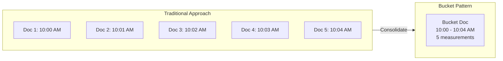
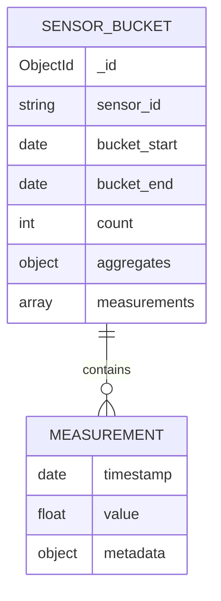
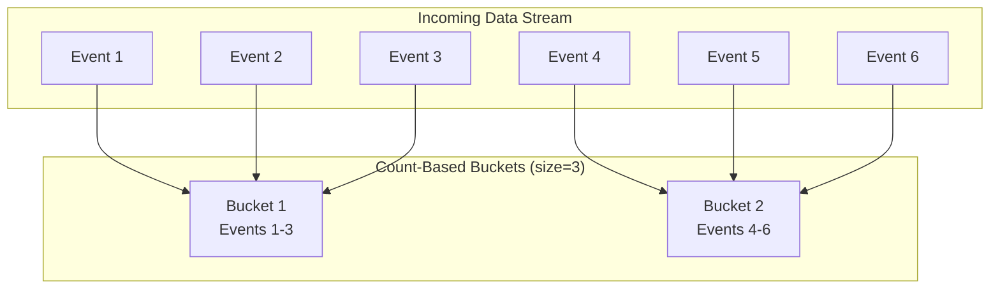
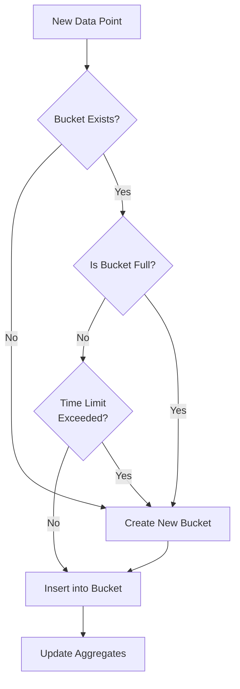
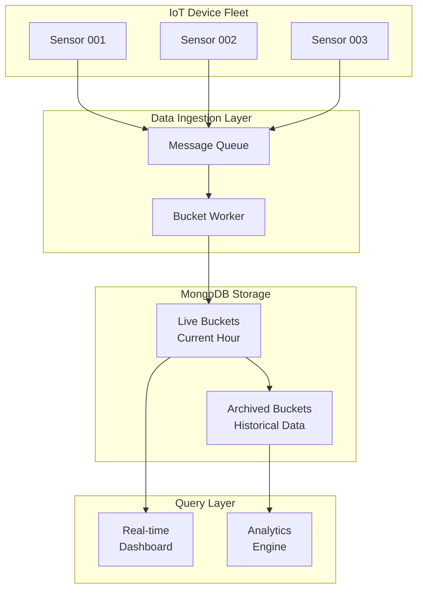

# How to Create MongoDB Bucket Patterns

Author: [nawazdhandala](https://github.com/nawazdhandala)

Tags: MongoDB, Schema Design, Time Series, Data Modeling

Description: Learn how to implement bucket patterns in MongoDB for efficient time series storage.

---

Time series data is everywhere. From IoT sensors reporting temperature readings to application metrics tracking request latencies, the volume of timestamped data continues to grow exponentially. MongoDB's bucket pattern offers an elegant solution to store and query this data efficiently.

In this guide, we will explore how to implement bucket patterns in MongoDB, covering both time-based and count-based approaches with practical examples.

## What is the Bucket Pattern?

The bucket pattern groups related documents into a single document, reducing the total number of documents in your collection. Instead of storing one document per data point, you store multiple data points within a single "bucket" document.



## Why Use the Bucket Pattern?

Before diving into implementation, let us understand the benefits:

1. **Reduced Index Size**: Fewer documents mean smaller indexes and faster queries
2. **Improved Write Performance**: Updating an existing document is often faster than inserting new ones
3. **Better Memory Utilization**: MongoDB can cache more data with fewer documents
4. **Simplified Aggregations**: Pre-aggregated data within buckets speeds up common queries

## Time-Based Bucket Pattern

Time-based bucketing groups data points by time intervals such as minutes, hours, or days. This approach works well when data arrives at predictable intervals.

### Schema Design



### Implementation Example: IoT Temperature Sensor

Here is a complete example for storing temperature readings from IoT sensors:

```javascript
// Schema for hourly temperature buckets
// Each bucket stores up to one hour of readings from a single sensor

const temperatureBucketSchema = {
  // Unique identifier for the sensor
  sensor_id: "sensor_001",

  // Time boundaries for this bucket
  bucket_start: ISODate("2026-01-30T10:00:00Z"),
  bucket_end: ISODate("2026-01-30T11:00:00Z"),

  // Number of readings in this bucket
  count: 60,

  // Pre-computed aggregates for fast queries
  aggregates: {
    min_temp: 18.5,
    max_temp: 24.2,
    avg_temp: 21.3,
    sum_temp: 1278.0
  },

  // Array of individual measurements
  measurements: [
    {
      timestamp: ISODate("2026-01-30T10:00:00Z"),
      value: 20.5,
      unit: "celsius"
    },
    {
      timestamp: ISODate("2026-01-30T10:01:00Z"),
      value: 20.7,
      unit: "celsius"
    }
    // ... more readings
  ]
};
```

### Inserting Data with Upserts

The key to the bucket pattern is using upserts to either create a new bucket or update an existing one:

```javascript
// Function to insert a temperature reading into the appropriate bucket
// Uses upsert to create bucket if it does not exist

async function insertTemperatureReading(db, sensorId, temperature, timestamp) {
  // Calculate the bucket boundaries (hourly buckets)
  const bucketStart = new Date(timestamp);
  bucketStart.setMinutes(0, 0, 0);

  const bucketEnd = new Date(bucketStart);
  bucketEnd.setHours(bucketEnd.getHours() + 1);

  // Create the measurement object
  const measurement = {
    timestamp: timestamp,
    value: temperature,
    unit: "celsius"
  };

  // Upsert the bucket document
  // If bucket exists: push measurement and update aggregates
  // If bucket does not exist: create new bucket with first measurement
  const result = await db.collection("temperature_buckets").updateOne(
    {
      // Filter: find bucket for this sensor and time range
      sensor_id: sensorId,
      bucket_start: bucketStart
    },
    {
      // Update operations
      $push: {
        // Add measurement to array
        measurements: measurement
      },
      $inc: {
        // Increment count
        count: 1,
        // Add to sum for average calculation
        "aggregates.sum_temp": temperature
      },
      $min: {
        // Update minimum if new value is lower
        "aggregates.min_temp": temperature
      },
      $max: {
        // Update maximum if new value is higher
        "aggregates.max_temp": temperature
      },
      $setOnInsert: {
        // Set these fields only when creating new bucket
        bucket_end: bucketEnd
      }
    },
    {
      // Create document if it does not exist
      upsert: true
    }
  );

  return result;
}
```

### Querying Time-Based Buckets

```javascript
// Find all readings for a sensor within a time range
// Leverages bucket boundaries for efficient filtering

async function getReadingsInRange(db, sensorId, startTime, endTime) {
  const pipeline = [
    {
      // Match buckets that overlap with our time range
      $match: {
        sensor_id: sensorId,
        bucket_start: { $lte: endTime },
        bucket_end: { $gte: startTime }
      }
    },
    {
      // Unwind the measurements array
      $unwind: "$measurements"
    },
    {
      // Filter individual measurements within the range
      $match: {
        "measurements.timestamp": {
          $gte: startTime,
          $lte: endTime
        }
      }
    },
    {
      // Project only the fields we need
      $project: {
        _id: 0,
        sensor_id: 1,
        timestamp: "$measurements.timestamp",
        value: "$measurements.value"
      }
    },
    {
      // Sort by timestamp
      $sort: { timestamp: 1 }
    }
  ];

  return await db.collection("temperature_buckets")
    .aggregate(pipeline)
    .toArray();
}
```

## Count-Based Bucket Pattern

Count-based bucketing groups a fixed number of data points regardless of time. This approach is ideal when data arrives at irregular intervals.



### Implementation Example: Application Metrics

Here is how to implement count-based buckets for storing application request metrics:

```javascript
// Schema for count-based request metrics buckets
// Each bucket holds exactly 100 requests

const requestMetricsBucketSchema = {
  // Service identifier
  service_name: "api-gateway",

  // Endpoint being tracked
  endpoint: "/api/v1/users",

  // Bucket sequence number for ordering
  bucket_number: 42,

  // Maximum entries per bucket
  bucket_size: 100,

  // Current count of entries
  count: 100,

  // Whether this bucket is full
  is_full: true,

  // Time range covered by this bucket
  first_timestamp: ISODate("2026-01-30T10:15:23Z"),
  last_timestamp: ISODate("2026-01-30T10:18:47Z"),

  // Pre-computed statistics
  stats: {
    total_duration_ms: 4523,
    min_duration_ms: 12,
    max_duration_ms: 234,
    error_count: 3,
    status_codes: {
      "200": 85,
      "400": 10,
      "500": 5
    }
  },

  // Array of request entries
  requests: [
    {
      timestamp: ISODate("2026-01-30T10:15:23Z"),
      duration_ms: 45,
      status_code: 200,
      request_id: "req_abc123"
    }
    // ... 99 more entries
  ]
};
```

### Insert Function for Count-Based Buckets

```javascript
// Configuration for bucket size
const BUCKET_SIZE = 100;

// Insert a request metric into a count-based bucket
// Creates new bucket when current one is full

async function insertRequestMetric(db, serviceName, endpoint, metric) {
  const collection = db.collection("request_metrics_buckets");

  // Try to add to an existing non-full bucket
  const updateResult = await collection.updateOne(
    {
      // Find a bucket that is not full
      service_name: serviceName,
      endpoint: endpoint,
      is_full: false
    },
    {
      // Add the metric to the bucket
      $push: {
        requests: {
          timestamp: metric.timestamp,
          duration_ms: metric.duration_ms,
          status_code: metric.status_code,
          request_id: metric.request_id
        }
      },
      $inc: {
        // Increment count
        count: 1,
        // Update statistics
        "stats.total_duration_ms": metric.duration_ms,
        [`stats.status_codes.${metric.status_code}`]: 1,
        "stats.error_count": metric.status_code >= 500 ? 1 : 0
      },
      $min: {
        // Update minimum duration
        "stats.min_duration_ms": metric.duration_ms,
        // Track first timestamp
        first_timestamp: metric.timestamp
      },
      $max: {
        // Update maximum duration
        "stats.max_duration_ms": metric.duration_ms,
        // Track last timestamp
        last_timestamp: metric.timestamp
      }
    }
  );

  // If no bucket was updated, create a new one
  if (updateResult.matchedCount === 0) {
    await createNewBucket(collection, serviceName, endpoint, metric);
  } else {
    // Check if bucket is now full and mark it
    await markBucketFullIfNeeded(collection, serviceName, endpoint);
  }
}

// Create a new bucket for incoming metrics
async function createNewBucket(collection, serviceName, endpoint, metric) {
  // Get the next bucket number
  const lastBucket = await collection.findOne(
    { service_name: serviceName, endpoint: endpoint },
    { sort: { bucket_number: -1 } }
  );

  const nextBucketNumber = lastBucket ? lastBucket.bucket_number + 1 : 1;

  // Insert new bucket
  await collection.insertOne({
    service_name: serviceName,
    endpoint: endpoint,
    bucket_number: nextBucketNumber,
    bucket_size: BUCKET_SIZE,
    count: 1,
    is_full: false,
    first_timestamp: metric.timestamp,
    last_timestamp: metric.timestamp,
    stats: {
      total_duration_ms: metric.duration_ms,
      min_duration_ms: metric.duration_ms,
      max_duration_ms: metric.duration_ms,
      error_count: metric.status_code >= 500 ? 1 : 0,
      status_codes: {
        [metric.status_code]: 1
      }
    },
    requests: [{
      timestamp: metric.timestamp,
      duration_ms: metric.duration_ms,
      status_code: metric.status_code,
      request_id: metric.request_id
    }]
  });
}

// Mark bucket as full when it reaches capacity
async function markBucketFullIfNeeded(collection, serviceName, endpoint) {
  await collection.updateOne(
    {
      service_name: serviceName,
      endpoint: endpoint,
      is_full: false,
      count: { $gte: BUCKET_SIZE }
    },
    {
      $set: { is_full: true }
    }
  );
}
```

## Hybrid Bucket Pattern

For some use cases, combining time-based and count-based approaches provides the best results. A bucket closes when either the time limit or count limit is reached.



### Hybrid Implementation

```javascript
// Configuration for hybrid buckets
const HYBRID_CONFIG = {
  MAX_COUNT: 200,           // Maximum entries per bucket
  MAX_DURATION_MS: 3600000  // Maximum bucket duration (1 hour)
};

// Insert data using hybrid bucket strategy
async function insertHybridBucket(db, deviceId, reading) {
  const collection = db.collection("hybrid_buckets");
  const now = new Date();

  // Calculate time threshold
  const timeThreshold = new Date(now.getTime() - HYBRID_CONFIG.MAX_DURATION_MS);

  // Try to update an existing bucket that is not full
  // and has not exceeded the time limit
  const result = await collection.updateOne(
    {
      device_id: deviceId,
      is_closed: false,
      count: { $lt: HYBRID_CONFIG.MAX_COUNT },
      bucket_start: { $gte: timeThreshold }
    },
    {
      $push: {
        readings: {
          timestamp: reading.timestamp,
          value: reading.value,
          type: reading.type
        }
      },
      $inc: { count: 1 },
      $max: { bucket_end: reading.timestamp },
      $min: { "stats.min_value": reading.value },
      $max: { "stats.max_value": reading.value }
    }
  );

  // Create new bucket if no suitable one exists
  if (result.matchedCount === 0) {
    // First close any open buckets for this device
    await collection.updateMany(
      { device_id: deviceId, is_closed: false },
      { $set: { is_closed: true } }
    );

    // Create new bucket
    await collection.insertOne({
      device_id: deviceId,
      bucket_start: reading.timestamp,
      bucket_end: reading.timestamp,
      count: 1,
      is_closed: false,
      stats: {
        min_value: reading.value,
        max_value: reading.value
      },
      readings: [{
        timestamp: reading.timestamp,
        value: reading.value,
        type: reading.type
      }]
    });
  }

  // Check if bucket should be closed
  await closeFullBuckets(collection, deviceId);
}

// Close buckets that have reached their limits
async function closeFullBuckets(collection, deviceId) {
  const timeThreshold = new Date(
    Date.now() - HYBRID_CONFIG.MAX_DURATION_MS
  );

  await collection.updateMany(
    {
      device_id: deviceId,
      is_closed: false,
      $or: [
        // Count limit reached
        { count: { $gte: HYBRID_CONFIG.MAX_COUNT } },
        // Time limit exceeded
        { bucket_start: { $lt: timeThreshold } }
      ]
    },
    {
      $set: { is_closed: true }
    }
  );
}
```

## Indexing Strategies

Proper indexing is crucial for bucket pattern performance:

```javascript
// Create indexes for time-based buckets
// Compound index on sensor_id and bucket_start enables efficient range queries

db.temperature_buckets.createIndex(
  { sensor_id: 1, bucket_start: 1 },
  { name: "sensor_time_idx" }
);

// Create indexes for count-based buckets
// Index on is_full helps find buckets that can accept new data

db.request_metrics_buckets.createIndex(
  { service_name: 1, endpoint: 1, is_full: 1 },
  { name: "service_endpoint_full_idx" }
);

// Index for bucket ordering
db.request_metrics_buckets.createIndex(
  { service_name: 1, endpoint: 1, bucket_number: -1 },
  { name: "service_endpoint_order_idx" }
);

// Index for hybrid buckets
db.hybrid_buckets.createIndex(
  { device_id: 1, is_closed: 1, bucket_start: 1 },
  { name: "device_closed_time_idx" }
);
```

## Real World Use Case: IoT Fleet Monitoring

Let us put everything together with a complete IoT fleet monitoring example:



### Complete IoT Bucket Implementation

```javascript
// IoT Fleet Monitoring with Bucket Pattern
// Handles multiple sensor types with configurable bucket sizes

class IoTBucketManager {
  constructor(db) {
    this.db = db;
    this.collection = db.collection("iot_buckets");

    // Configuration per sensor type
    this.config = {
      temperature: { bucketDurationMs: 3600000, maxReadings: 60 },
      humidity: { bucketDurationMs: 3600000, maxReadings: 60 },
      pressure: { bucketDurationMs: 1800000, maxReadings: 30 },
      vibration: { bucketDurationMs: 60000, maxReadings: 1000 }
    };
  }

  // Get bucket configuration for a sensor type
  getConfig(sensorType) {
    return this.config[sensorType] || {
      bucketDurationMs: 3600000,
      maxReadings: 100
    };
  }

  // Calculate bucket start time based on duration
  calculateBucketStart(timestamp, durationMs) {
    const ts = timestamp.getTime();
    const bucketStart = ts - (ts % durationMs);
    return new Date(bucketStart);
  }

  // Insert a sensor reading
  async insertReading(deviceId, sensorType, reading) {
    const config = this.getConfig(sensorType);
    const bucketStart = this.calculateBucketStart(
      reading.timestamp,
      config.bucketDurationMs
    );
    const bucketEnd = new Date(
      bucketStart.getTime() + config.bucketDurationMs
    );

    // Attempt to insert into existing bucket
    const result = await this.collection.updateOne(
      {
        device_id: deviceId,
        sensor_type: sensorType,
        bucket_start: bucketStart,
        count: { $lt: config.maxReadings }
      },
      {
        $push: {
          readings: {
            ts: reading.timestamp,
            v: reading.value,
            q: reading.quality || 1.0
          }
        },
        $inc: {
          count: 1,
          "stats.sum": reading.value
        },
        $min: { "stats.min": reading.value },
        $max: { "stats.max": reading.value },
        $setOnInsert: {
          bucket_end: bucketEnd,
          created_at: new Date()
        }
      },
      { upsert: true }
    );

    // Update average after insert
    if (result.upsertedCount === 0) {
      await this.updateAverage(deviceId, sensorType, bucketStart);
    }

    return result;
  }

  // Update the average value in bucket stats
  async updateAverage(deviceId, sensorType, bucketStart) {
    const bucket = await this.collection.findOne({
      device_id: deviceId,
      sensor_type: sensorType,
      bucket_start: bucketStart
    });

    if (bucket && bucket.count > 0) {
      const avg = bucket.stats.sum / bucket.count;
      await this.collection.updateOne(
        { _id: bucket._id },
        { $set: { "stats.avg": avg } }
      );
    }
  }

  // Query readings for a device within a time range
  async queryReadings(deviceId, sensorType, startTime, endTime) {
    return await this.collection.aggregate([
      {
        $match: {
          device_id: deviceId,
          sensor_type: sensorType,
          bucket_start: { $lte: endTime },
          bucket_end: { $gte: startTime }
        }
      },
      { $unwind: "$readings" },
      {
        $match: {
          "readings.ts": { $gte: startTime, $lte: endTime }
        }
      },
      {
        $project: {
          _id: 0,
          timestamp: "$readings.ts",
          value: "$readings.v",
          quality: "$readings.q"
        }
      },
      { $sort: { timestamp: 1 } }
    ]).toArray();
  }

  // Get aggregated statistics for a time range
  async getStats(deviceId, sensorType, startTime, endTime) {
    const result = await this.collection.aggregate([
      {
        $match: {
          device_id: deviceId,
          sensor_type: sensorType,
          bucket_start: { $lte: endTime },
          bucket_end: { $gte: startTime }
        }
      },
      {
        $group: {
          _id: null,
          total_readings: { $sum: "$count" },
          overall_min: { $min: "$stats.min" },
          overall_max: { $max: "$stats.max" },
          total_sum: { $sum: "$stats.sum" },
          bucket_count: { $sum: 1 }
        }
      },
      {
        $project: {
          _id: 0,
          total_readings: 1,
          min: "$overall_min",
          max: "$overall_max",
          avg: { $divide: ["$total_sum", "$total_readings"] },
          bucket_count: 1
        }
      }
    ]).toArray();

    return result[0] || null;
  }
}

// Usage example
async function main() {
  const client = new MongoClient("mongodb://localhost:27017");
  await client.connect();

  const db = client.db("iot_monitoring");
  const manager = new IoTBucketManager(db);

  // Insert temperature reading
  await manager.insertReading(
    "device_001",
    "temperature",
    {
      timestamp: new Date(),
      value: 23.5,
      quality: 1.0
    }
  );

  // Query last hour of readings
  const endTime = new Date();
  const startTime = new Date(endTime.getTime() - 3600000);

  const readings = await manager.queryReadings(
    "device_001",
    "temperature",
    startTime,
    endTime
  );

  console.log(`Found ${readings.length} readings`);

  // Get statistics
  const stats = await manager.getStats(
    "device_001",
    "temperature",
    startTime,
    endTime
  );

  console.log(`Stats: min=${stats.min}, max=${stats.max}, avg=${stats.avg}`);
}
```

## Best Practices and Recommendations

### Choosing Bucket Size

| Use Case | Recommended Approach | Bucket Size |
|----------|---------------------|-------------|
| High-frequency sensors | Time-based | 1 minute to 1 hour |
| Low-frequency sensors | Count-based | 50 to 200 entries |
| Variable frequency | Hybrid | Time + count limits |
| Real-time dashboards | Time-based | 1 to 5 minutes |
| Long-term analytics | Time-based | 1 hour to 1 day |

### Document Size Considerations

MongoDB has a 16MB document size limit. Calculate your expected bucket size:

```javascript
// Estimate document size
// Each reading: ~100 bytes (timestamp + value + metadata)
// Overhead: ~500 bytes (bucket metadata + indexes)

const READING_SIZE_BYTES = 100;
const OVERHEAD_BYTES = 500;
const MAX_DOC_SIZE = 16 * 1024 * 1024; // 16MB

// Calculate safe maximum readings per bucket
const safeMaxReadings = Math.floor(
  (MAX_DOC_SIZE - OVERHEAD_BYTES) / READING_SIZE_BYTES
);
// Result: ~167,000 readings (but aim for much smaller for performance)

// Recommended: Keep buckets under 1MB for optimal performance
const recommendedMaxReadings = Math.floor(
  (1024 * 1024 - OVERHEAD_BYTES) / READING_SIZE_BYTES
);
// Result: ~10,000 readings
```

### Data Retention with TTL Indexes

Automatically expire old buckets using TTL indexes:

```javascript
// Create TTL index to automatically delete buckets older than 30 days
db.iot_buckets.createIndex(
  { bucket_end: 1 },
  { expireAfterSeconds: 2592000 } // 30 days in seconds
);
```

## Conclusion

The MongoDB bucket pattern is a powerful technique for managing time series data. By grouping related data points into buckets, you can significantly improve query performance, reduce storage overhead, and simplify data management.

Key takeaways:

- **Time-based buckets** work best for data with regular intervals
- **Count-based buckets** excel with irregular data patterns
- **Hybrid approaches** provide flexibility for complex use cases
- **Pre-computed aggregates** within buckets speed up analytical queries
- **Proper indexing** is essential for maintaining performance at scale

Start with a simple implementation and adjust bucket sizes based on your specific workload characteristics. Monitor query performance and document sizes to fine-tune your bucket strategy over time.

## Further Reading

- [MongoDB Time Series Collections](https://www.mongodb.com/docs/manual/core/timeseries-collections/)
- [Data Modeling Patterns](https://www.mongodb.com/docs/manual/applications/data-models/)
- [MongoDB Aggregation Pipeline](https://www.mongodb.com/docs/manual/aggregation/)
