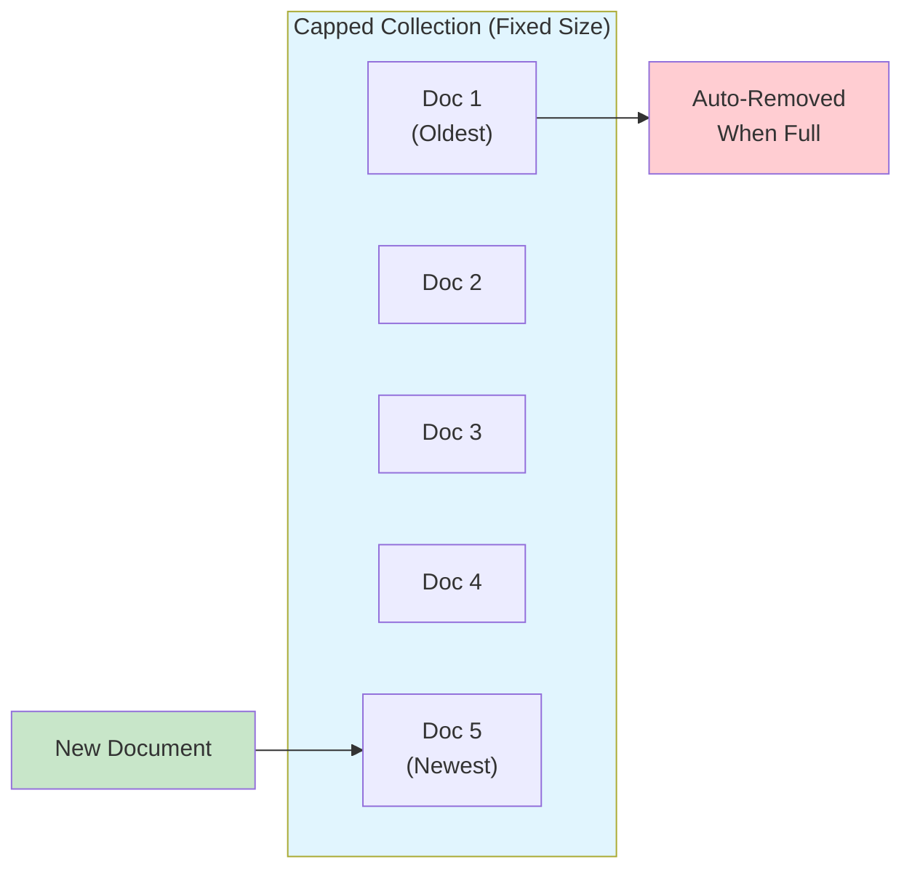
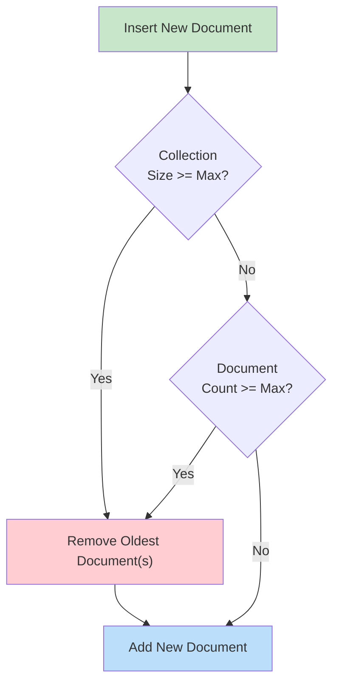
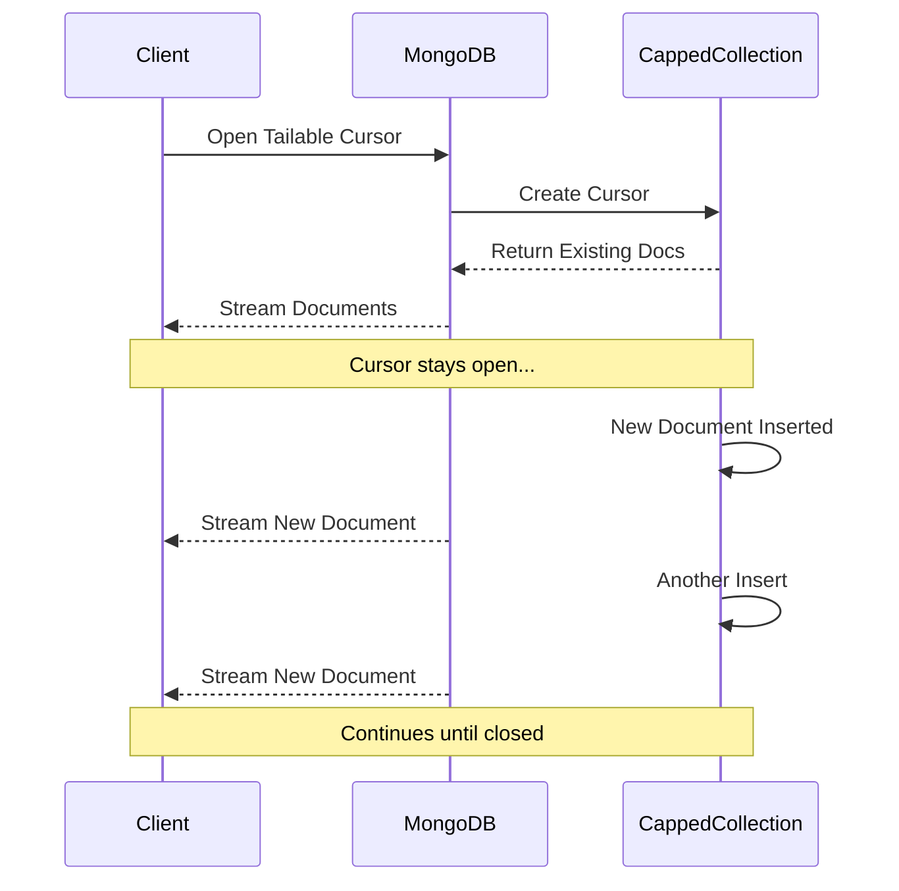
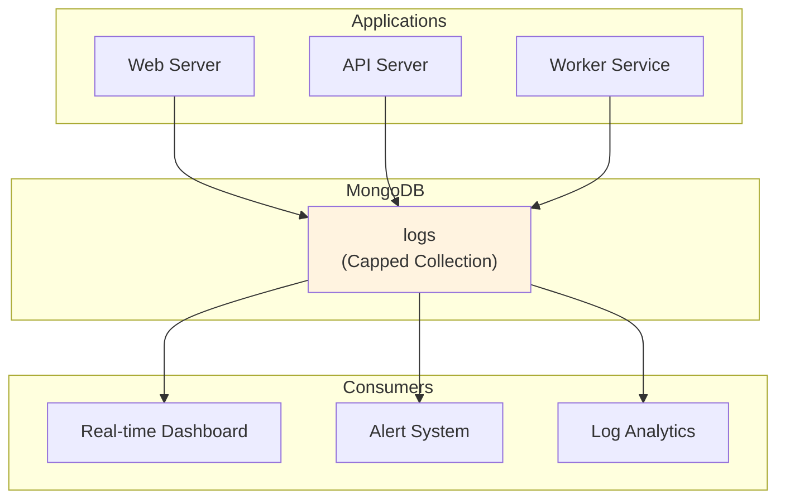

# How to Implement MongoDB Capped Collection Patterns

Author: [nawazdhandala](https://github.com/nawazdhandala)

Tags: MongoDB, Capped Collections, Logging, Circular Buffer

Description: Learn to implement capped collections for fixed-size storage with automatic rotation, tailable cursors, and logging patterns.

---

## Introduction

Capped collections are a special type of fixed-size collection in MongoDB that automatically overwrites the oldest documents when the size limit is reached. They work like circular buffers, maintaining insertion order and providing high-throughput operations. This makes them ideal for logging, caching, and real-time data streaming scenarios.



## Creating Capped Collections

### Basic Creation

To create a capped collection, you must specify the `capped` option and the maximum size in bytes.

```javascript
// Create a capped collection with 100MB size limit
db.createCollection("logs", {
    capped: true,
    size: 104857600  // 100MB in bytes
});
```

### With Document Count Limit

You can also limit the maximum number of documents in addition to the size limit.

```javascript
// Create a capped collection with both size and document limits
db.createCollection("recentEvents", {
    capped: true,
    size: 52428800,  // 50MB
    max: 10000       // Maximum 10,000 documents
});
```

**Important Notes:**
- The `size` parameter is required and must be specified in bytes
- The `max` parameter is optional and sets the maximum document count
- MongoDB removes the oldest documents first when either limit is reached
- Documents are stored in insertion order (natural order)

### Verifying Collection Properties

```javascript
// Check if a collection is capped
db.logs.isCapped();

// Get collection statistics
db.logs.stats();

// Output includes:
// {
//     "capped": true,
//     "max": 10000,
//     "maxSize": 52428800,
//     ...
// }
```

## Size Limits and Constraints

Understanding how MongoDB handles size limits is crucial for proper implementation.



### Size Calculation Guidelines

```javascript
// Calculate appropriate size for your use case
const avgDocumentSize = 500;        // bytes per document
const documentsPerDay = 100000;     // expected daily volume
const retentionDays = 7;            // how many days to retain

const totalDocuments = documentsPerDay * retentionDays;
const estimatedSize = avgDocumentSize * totalDocuments;
const bufferMultiplier = 1.2;       // 20% buffer for overhead

const collectionSize = Math.ceil(estimatedSize * bufferMultiplier);

db.createCollection("weeklyLogs", {
    capped: true,
    size: collectionSize,
    max: totalDocuments
});
```

### Constraints to Remember

1. **Cannot delete individual documents** - You cannot use `deleteOne()` or `deleteMany()` on capped collections
2. **Cannot update document size** - Updates that increase document size will fail
3. **Cannot shard** - Capped collections cannot be sharded
4. **Minimum size** - MongoDB rounds up small sizes to a minimum of 4096 bytes

```javascript
// This will FAIL on a capped collection
db.logs.deleteOne({ _id: ObjectId("...") });
// Error: cannot remove from a capped collection

// This will FAIL if it increases document size
db.logs.updateOne(
    { _id: ObjectId("...") },
    { $set: { message: "A much longer message that exceeds original size" }}
);
// Error: Cannot change the size of a document in a capped collection
```

## Tailable Cursors

Tailable cursors are one of the most powerful features of capped collections. They remain open after the client exhausts the results, allowing real-time streaming of new documents.



### Implementing Tailable Cursors in Node.js

```javascript
const { MongoClient } = require('mongodb');

async function tailableCursorExample() {
    const client = new MongoClient('mongodb://localhost:27017');
    await client.connect();

    const db = client.db('myapp');
    const collection = db.collection('logs');

    // Create a tailable cursor with awaitData option
    const cursor = collection.find({}, {
        tailable: true,
        awaitData: true,
        noCursorTimeout: true
    });

    console.log('Listening for new documents...');

    // Process documents as they arrive
    while (await cursor.hasNext()) {
        const doc = await cursor.next();
        console.log('Received:', doc);

        // Process the document
        processLogEntry(doc);
    }
}

function processLogEntry(doc) {
    // Handle the log entry
    console.log(`[${doc.level}] ${doc.timestamp}: ${doc.message}`);
}

tailableCursorExample().catch(console.error);
```

### Tailable Cursor with Filtering

```javascript
async function filteredTailableCursor() {
    const client = new MongoClient('mongodb://localhost:27017');
    await client.connect();

    const db = client.db('myapp');
    const collection = db.collection('logs');

    // Only tail ERROR level logs
    const cursor = collection.find(
        { level: 'ERROR' },
        {
            tailable: true,
            awaitData: true,
            maxAwaitTimeMS: 5000  // Wait up to 5 seconds for new data
        }
    );

    for await (const doc of cursor) {
        // Alert on errors in real-time
        sendAlert(doc);
    }
}
```

### Python Implementation

```python
from pymongo import MongoClient, CursorType
import time

def tail_collection():
    client = MongoClient('mongodb://localhost:27017')
    db = client['myapp']
    collection = db['logs']

    # Create tailable cursor
    cursor = collection.find(
        {},
        cursor_type=CursorType.TAILABLE_AWAIT
    )

    print("Tailing collection...")

    while cursor.alive:
        for doc in cursor:
            print(f"New document: {doc}")
            process_document(doc)

        # Brief sleep before checking for more documents
        time.sleep(0.1)

def process_document(doc):
    # Process logic here
    pass

if __name__ == "__main__":
    tail_collection()
```

## Common Use Cases and Patterns

### 1. Application Logging System



```javascript
// Create logging collection
db.createCollection("applicationLogs", {
    capped: true,
    size: 536870912,  // 512MB
    max: 1000000      // 1 million documents max
});

// Create index for efficient querying
db.applicationLogs.createIndex({ timestamp: 1 });
db.applicationLogs.createIndex({ level: 1, service: 1 });

// Log entry structure
const logEntry = {
    timestamp: new Date(),
    level: "INFO",       // DEBUG, INFO, WARN, ERROR, FATAL
    service: "api-server",
    host: "server-01",
    message: "Request processed successfully",
    metadata: {
        requestId: "req-12345",
        userId: "user-789",
        duration: 145
    }
};

// Insert log entry
db.applicationLogs.insertOne(logEntry);
```

### 2. Real-time Event Stream

```javascript
// Create event stream collection
db.createCollection("eventStream", {
    capped: true,
    size: 268435456,  // 256MB
    max: 500000
});

// Event producer
async function publishEvent(eventType, payload) {
    const event = {
        type: eventType,
        timestamp: new Date(),
        payload: payload,
        processed: false
    };

    await db.collection('eventStream').insertOne(event);
}

// Event consumer with tailable cursor
async function consumeEvents(eventTypes) {
    const cursor = db.collection('eventStream').find(
        {
            type: { $in: eventTypes },
            processed: false
        },
        { tailable: true, awaitData: true }
    );

    for await (const event of cursor) {
        await handleEvent(event);
    }
}
```

### 3. Session Activity Tracking

```javascript
// Create session activity collection
db.createCollection("sessionActivity", {
    capped: true,
    size: 104857600,  // 100MB
    max: 100000
});

// Track user activity
function trackActivity(sessionId, action, details) {
    return db.sessionActivity.insertOne({
        sessionId: sessionId,
        action: action,
        details: details,
        timestamp: new Date(),
        userAgent: details.userAgent,
        ip: details.ip
    });
}

// Get recent activity for a session
function getRecentActivity(sessionId, limit = 50) {
    return db.sessionActivity
        .find({ sessionId: sessionId })
        .sort({ timestamp: -1 })
        .limit(limit)
        .toArray();
}
```

### 4. Metrics and Time-Series Data

```javascript
// Create metrics collection
db.createCollection("serverMetrics", {
    capped: true,
    size: 1073741824,  // 1GB
    max: 2000000       // 2 million data points
});

// Insert metric data point
function recordMetric(serverId, metricName, value) {
    return db.serverMetrics.insertOne({
        serverId: serverId,
        metric: metricName,
        value: value,
        timestamp: new Date()
    });
}

// Aggregate recent metrics
async function getAverageMetric(serverId, metricName, minutes = 5) {
    const cutoff = new Date(Date.now() - minutes * 60 * 1000);

    const result = await db.serverMetrics.aggregate([
        {
            $match: {
                serverId: serverId,
                metric: metricName,
                timestamp: { $gte: cutoff }
            }
        },
        {
            $group: {
                _id: null,
                avgValue: { $avg: "$value" },
                minValue: { $min: "$value" },
                maxValue: { $max: "$value" },
                count: { $sum: 1 }
            }
        }
    ]).toArray();

    return result[0];
}
```

## Converting Existing Collections

If you have an existing collection that you want to convert to a capped collection, you can use the `convertToCapped` command.

```javascript
// Convert an existing collection to capped
db.runCommand({
    convertToCapped: "existingCollection",
    size: 104857600  // 100MB
});

// Verify the conversion
db.existingCollection.isCapped();  // Should return true
```

**Warning:** Converting to a capped collection will:
- Remove all indexes except the default `_id` index
- Potentially truncate data if the current size exceeds the specified cap

## Best Practices

### 1. Size Planning

```javascript
// Calculate size based on retention requirements
function calculateCappedSize(config) {
    const {
        avgDocSizeBytes,
        docsPerSecond,
        retentionHours,
        overheadPercent = 20
    } = config;

    const totalDocs = docsPerSecond * 3600 * retentionHours;
    const rawSize = avgDocSizeBytes * totalDocs;
    const finalSize = Math.ceil(rawSize * (1 + overheadPercent / 100));

    return {
        size: finalSize,
        max: totalDocs,
        humanReadable: `${(finalSize / 1024 / 1024).toFixed(2)} MB`
    };
}

// Example usage
const sizing = calculateCappedSize({
    avgDocSizeBytes: 512,
    docsPerSecond: 100,
    retentionHours: 24
});

console.log(sizing);
// { size: 5308416000, max: 8640000, humanReadable: "5062.50 MB" }
```

### 2. Error Handling for Tailable Cursors

```javascript
async function resilientTailableCursor() {
    const maxRetries = 5;
    let retryCount = 0;

    while (retryCount < maxRetries) {
        try {
            const client = new MongoClient('mongodb://localhost:27017');
            await client.connect();

            const collection = client.db('myapp').collection('logs');
            const cursor = collection.find({}, {
                tailable: true,
                awaitData: true
            });

            retryCount = 0;  // Reset on successful connection

            for await (const doc of cursor) {
                await processDocument(doc);
            }

        } catch (error) {
            console.error(`Cursor error: ${error.message}`);
            retryCount++;

            // Exponential backoff
            const delay = Math.min(1000 * Math.pow(2, retryCount), 30000);
            console.log(`Retrying in ${delay}ms...`);
            await new Promise(resolve => setTimeout(resolve, delay));
        }
    }

    throw new Error('Max retries exceeded for tailable cursor');
}
```

### 3. Monitoring Collection Health

```javascript
async function monitorCappedCollection(collectionName) {
    const stats = await db.collection(collectionName).stats();

    const metrics = {
        collectionName: collectionName,
        isCapped: stats.capped,
        currentSize: stats.size,
        maxSize: stats.maxSize,
        usagePercent: ((stats.size / stats.maxSize) * 100).toFixed(2),
        documentCount: stats.count,
        maxDocuments: stats.max,
        avgDocSize: stats.avgObjSize
    };

    console.log('Capped Collection Health:');
    console.log(`- Name: ${metrics.collectionName}`);
    console.log(`- Usage: ${metrics.usagePercent}%`);
    console.log(`- Documents: ${metrics.documentCount}/${metrics.maxDocuments || 'unlimited'}`);
    console.log(`- Avg Doc Size: ${metrics.avgDocSize} bytes`);

    // Alert if approaching capacity
    if (parseFloat(metrics.usagePercent) > 90) {
        console.warn('WARNING: Collection is over 90% capacity!');
    }

    return metrics;
}
```

## Summary

Capped collections provide an efficient solution for fixed-size storage scenarios in MongoDB. Key takeaways include:

- **Automatic rotation** - Old documents are automatically removed when limits are reached
- **Insertion order preservation** - Documents maintain their natural insertion order
- **High throughput** - Optimized for fast writes and sequential reads
- **Tailable cursors** - Enable real-time streaming of new documents
- **Fixed constraints** - Cannot delete individual documents or increase document size

Use capped collections when you need:
- Logging and audit trails with automatic cleanup
- Real-time event streaming
- Recent activity tracking
- Time-series data with automatic expiration

Remember to properly size your collections based on expected document size, insertion rate, and retention requirements to ensure optimal performance.

## Further Reading

- [MongoDB Official Documentation - Capped Collections](https://www.mongodb.com/docs/manual/core/capped-collections/)
- [MongoDB Change Streams](https://www.mongodb.com/docs/manual/changeStreams/) - An alternative for real-time notifications
- [Time Series Collections](https://www.mongodb.com/docs/manual/core/timeseries-collections/) - For time-series specific workloads
