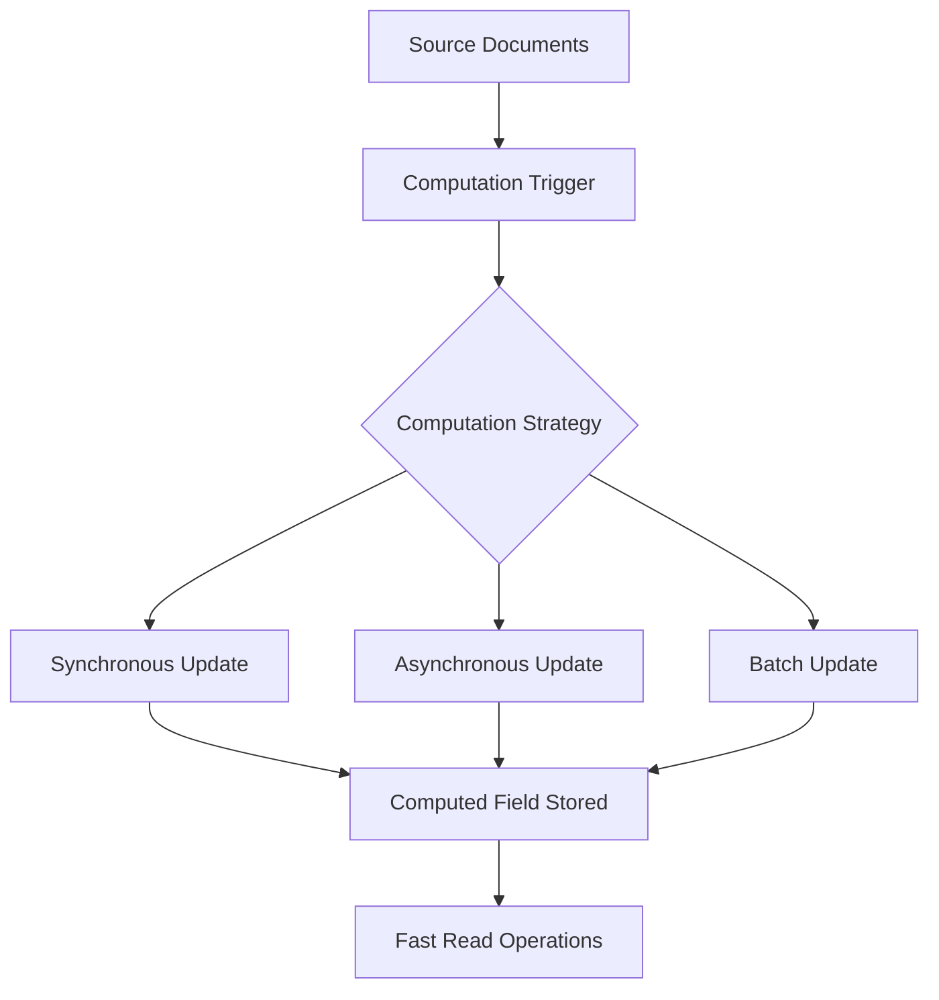
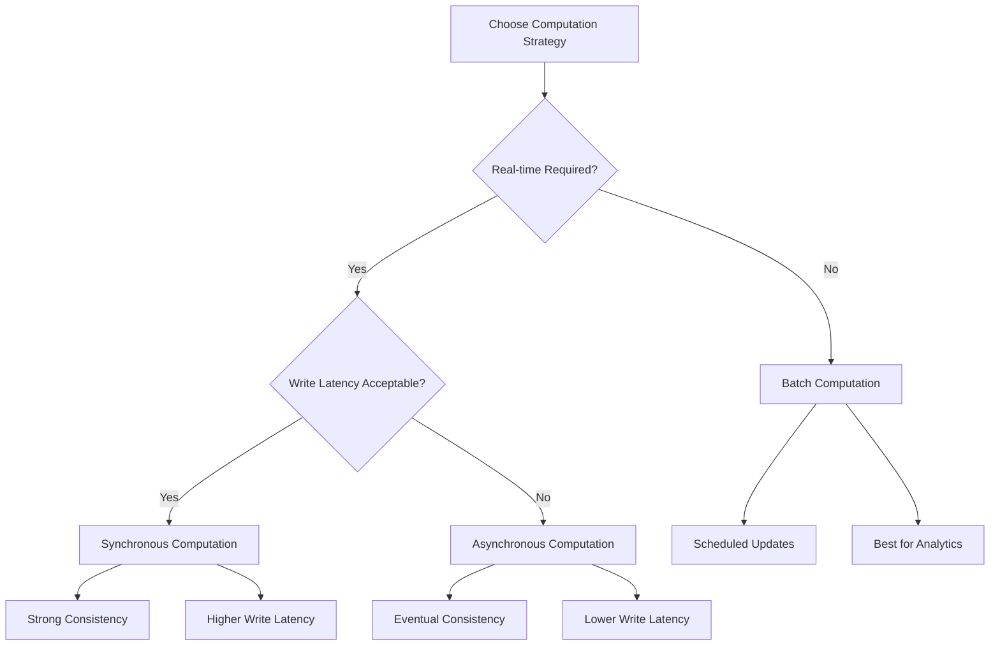
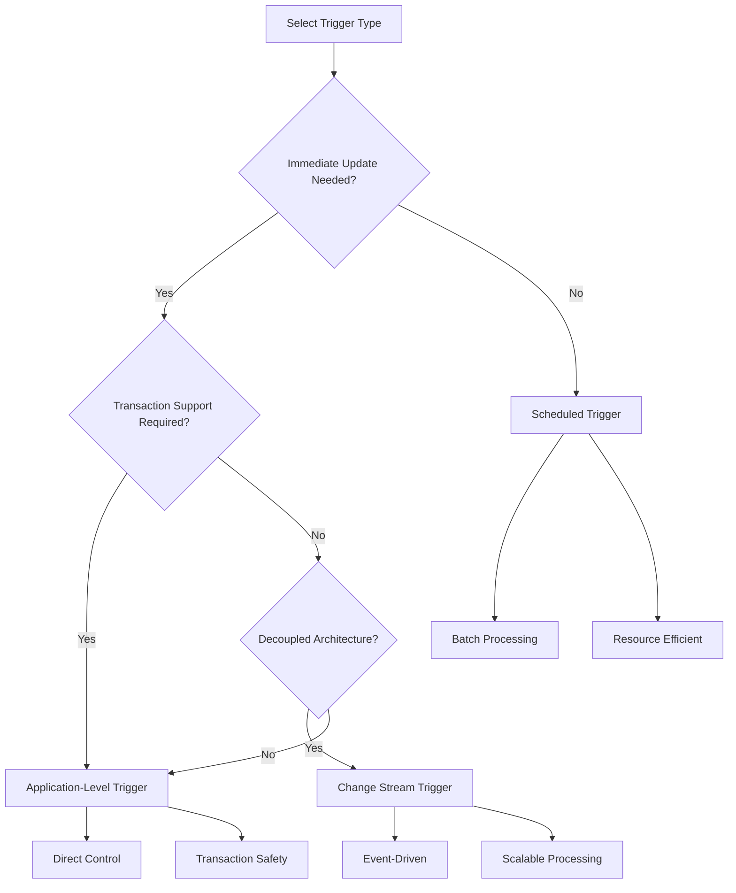
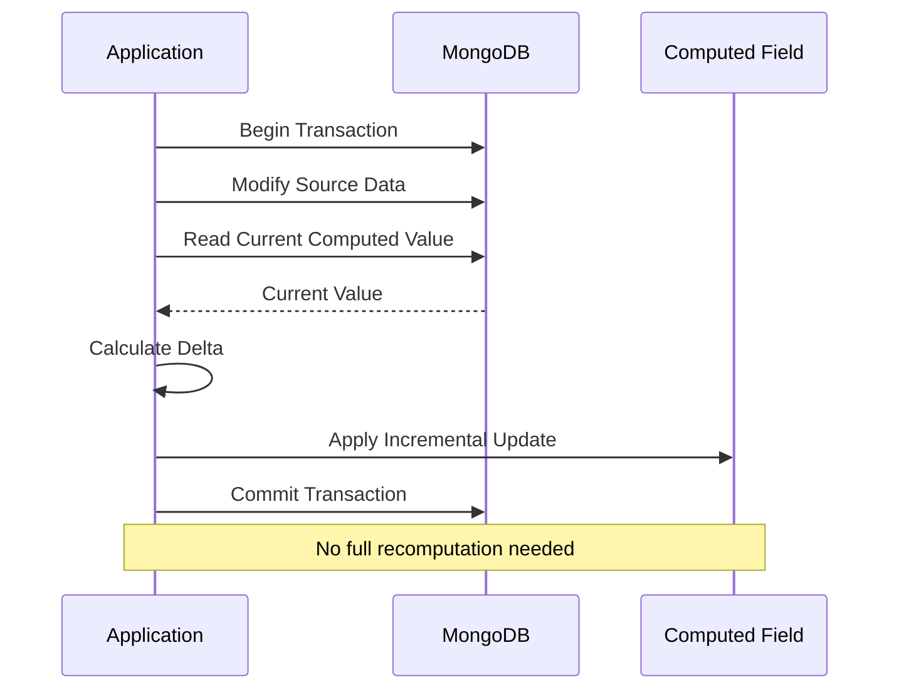
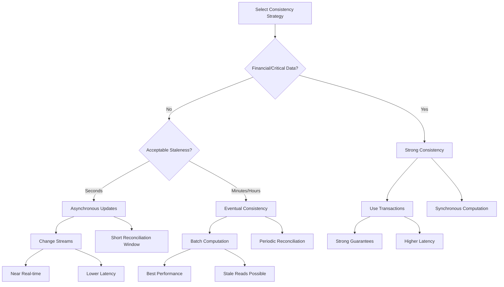

# How to Build MongoDB Computed Patterns

Author: [nawazdhandala](https://github.com/nawazdhandala)

Tags: MongoDB, Computed Pattern, Aggregation, Derived Data

Description: Learn to implement computed patterns for storing derived values with background updates and incremental computation for performance optimization.

---

## Introduction

The computed pattern is a powerful MongoDB design pattern that involves storing pre-calculated or derived values alongside your source data. Instead of computing values on every read operation, you calculate them once and store the result. This pattern is essential for building high-performance applications where read operations significantly outnumber writes.

In this guide, we will explore how to implement computed patterns effectively, covering computation strategies, update triggers, incremental updates, and consistency guarantees.

## Understanding the Computed Pattern

The computed pattern trades write complexity and storage space for dramatically improved read performance. By pre-computing derived values, you eliminate the need for expensive aggregations or calculations during read operations.

### When to Use Computed Patterns

- **Analytics dashboards**: Pre-compute totals, averages, and counts
- **E-commerce**: Calculate order totals, inventory counts, and product ratings
- **Social platforms**: Store follower counts, like counts, and engagement metrics
- **Financial systems**: Maintain running balances and transaction summaries
- **Reporting systems**: Store aggregated metrics that would be expensive to calculate on demand

### Architecture Overview



## Computation Strategies

There are several strategies for computing and storing derived values, each with different trade-offs.

### 1. Synchronous Computation

Compute and update derived values immediately when source data changes. This ensures strong consistency but adds latency to write operations.

```javascript
// Example: Order total calculated synchronously
const { MongoClient, ObjectId } = require('mongodb');

class OrderService {
  constructor(db) {
    this.orders = db.collection('orders');
    this.products = db.collection('products');
  }

  async addItemToOrder(orderId, productId, quantity) {
    // Fetch product price
    const product = await this.products.findOne({ _id: new ObjectId(productId) });

    if (!product) {
      throw new Error('Product not found');
    }

    const itemTotal = product.price * quantity;
    const item = {
      productId: new ObjectId(productId),
      name: product.name,
      price: product.price,
      quantity,
      itemTotal
    };

    // Add item and update computed total in a single operation
    const result = await this.orders.updateOne(
      { _id: new ObjectId(orderId) },
      {
        $push: { items: item },
        $inc: {
          totalAmount: itemTotal,
          itemCount: quantity
        },
        $set: { updatedAt: new Date() }
      }
    );

    return result;
  }

  async removeItemFromOrder(orderId, productId) {
    const order = await this.orders.findOne({ _id: new ObjectId(orderId) });
    const item = order.items.find(i => i.productId.equals(new ObjectId(productId)));

    if (!item) {
      throw new Error('Item not found in order');
    }

    // Remove item and update computed total
    await this.orders.updateOne(
      { _id: new ObjectId(orderId) },
      {
        $pull: { items: { productId: new ObjectId(productId) } },
        $inc: {
          totalAmount: -item.itemTotal,
          itemCount: -item.quantity
        },
        $set: { updatedAt: new Date() }
      }
    );
  }
}
```

### 2. Asynchronous Computation

Defer computation to a background process, providing better write performance at the cost of eventual consistency.

```javascript
// Example: Using change streams for asynchronous computation
class AsyncComputationService {
  constructor(db) {
    this.reviews = db.collection('reviews');
    this.products = db.collection('products');
  }

  // Start watching for review changes
  async startWatching() {
    const changeStream = this.reviews.watch([
      { $match: { operationType: { $in: ['insert', 'update', 'delete'] } } }
    ]);

    changeStream.on('change', async (change) => {
      try {
        await this.processChange(change);
      } catch (error) {
        console.error('Error processing change:', error);
        // Implement retry logic or dead letter queue
      }
    });

    console.log('Change stream started for reviews collection');
  }

  async processChange(change) {
    let productId;

    switch (change.operationType) {
      case 'insert':
        productId = change.fullDocument.productId;
        break;
      case 'update':
        // Fetch the document to get productId
        const review = await this.reviews.findOne({ _id: change.documentKey._id });
        productId = review?.productId;
        break;
      case 'delete':
        // For deletes, we need to store productId in the change stream pipeline
        // or use a pre-delete hook
        productId = change.fullDocumentBeforeChange?.productId;
        break;
    }

    if (productId) {
      await this.recomputeProductStats(productId);
    }
  }

  async recomputeProductStats(productId) {
    const stats = await this.reviews.aggregate([
      { $match: { productId: new ObjectId(productId) } },
      {
        $group: {
          _id: null,
          averageRating: { $avg: '$rating' },
          totalReviews: { $sum: 1 },
          ratingDistribution: {
            $push: '$rating'
          }
        }
      },
      {
        $project: {
          averageRating: { $round: ['$averageRating', 2] },
          totalReviews: 1,
          fiveStarCount: {
            $size: {
              $filter: {
                input: '$ratingDistribution',
                cond: { $eq: ['$$this', 5] }
              }
            }
          },
          fourStarCount: {
            $size: {
              $filter: {
                input: '$ratingDistribution',
                cond: { $eq: ['$$this', 4] }
              }
            }
          },
          threeStarCount: {
            $size: {
              $filter: {
                input: '$ratingDistribution',
                cond: { $eq: ['$$this', 3] }
              }
            }
          },
          twoStarCount: {
            $size: {
              $filter: {
                input: '$ratingDistribution',
                cond: { $eq: ['$$this', 2] }
              }
            }
          },
          oneStarCount: {
            $size: {
              $filter: {
                input: '$ratingDistribution',
                cond: { $eq: ['$$this', 1] }
              }
            }
          }
        }
      }
    ]).toArray();

    const computedStats = stats[0] || {
      averageRating: 0,
      totalReviews: 0,
      fiveStarCount: 0,
      fourStarCount: 0,
      threeStarCount: 0,
      twoStarCount: 0,
      oneStarCount: 0
    };

    await this.products.updateOne(
      { _id: new ObjectId(productId) },
      {
        $set: {
          'computed.ratings': computedStats,
          'computed.ratingsUpdatedAt': new Date()
        }
      }
    );
  }
}
```

### 3. Batch Computation

Compute values periodically in bulk, ideal for non-real-time requirements.

```javascript
// Example: Batch computation using scheduled jobs
class BatchComputationService {
  constructor(db) {
    this.orders = db.collection('orders');
    this.customers = db.collection('customers');
    this.dailyStats = db.collection('dailyStats');
  }

  // Run daily to compute customer lifetime value and statistics
  async computeCustomerStats() {
    const pipeline = [
      {
        $match: {
          status: 'completed'
        }
      },
      {
        $group: {
          _id: '$customerId',
          totalOrders: { $sum: 1 },
          totalSpent: { $sum: '$totalAmount' },
          averageOrderValue: { $avg: '$totalAmount' },
          firstOrderDate: { $min: '$createdAt' },
          lastOrderDate: { $max: '$createdAt' },
          productsPurchased: { $addToSet: '$items.productId' }
        }
      },
      {
        $project: {
          customerId: '$_id',
          totalOrders: 1,
          totalSpent: { $round: ['$totalSpent', 2] },
          averageOrderValue: { $round: ['$averageOrderValue', 2] },
          firstOrderDate: 1,
          lastOrderDate: 1,
          uniqueProductCount: { $size: '$productsPurchased' },
          daysSinceFirstOrder: {
            $dateDiff: {
              startDate: '$firstOrderDate',
              endDate: new Date(),
              unit: 'day'
            }
          }
        }
      }
    ];

    const cursor = this.orders.aggregate(pipeline);

    // Process in batches to avoid memory issues
    const bulkOps = [];
    const BATCH_SIZE = 1000;

    for await (const stats of cursor) {
      bulkOps.push({
        updateOne: {
          filter: { _id: stats.customerId },
          update: {
            $set: {
              'computed.lifetime': {
                totalOrders: stats.totalOrders,
                totalSpent: stats.totalSpent,
                averageOrderValue: stats.averageOrderValue,
                firstOrderDate: stats.firstOrderDate,
                lastOrderDate: stats.lastOrderDate,
                uniqueProductCount: stats.uniqueProductCount,
                daysSinceFirstOrder: stats.daysSinceFirstOrder
              },
              'computed.lifetimeUpdatedAt': new Date()
            }
          }
        }
      });

      if (bulkOps.length >= BATCH_SIZE) {
        await this.customers.bulkWrite(bulkOps);
        bulkOps.length = 0;
      }
    }

    // Process remaining operations
    if (bulkOps.length > 0) {
      await this.customers.bulkWrite(bulkOps);
    }

    console.log('Customer stats computation completed');
  }

  // Compute daily sales statistics
  async computeDailyStats(date) {
    const startOfDay = new Date(date);
    startOfDay.setHours(0, 0, 0, 0);

    const endOfDay = new Date(date);
    endOfDay.setHours(23, 59, 59, 999);

    const stats = await this.orders.aggregate([
      {
        $match: {
          createdAt: { $gte: startOfDay, $lte: endOfDay },
          status: 'completed'
        }
      },
      {
        $facet: {
          summary: [
            {
              $group: {
                _id: null,
                totalRevenue: { $sum: '$totalAmount' },
                orderCount: { $sum: 1 },
                itemCount: { $sum: '$itemCount' },
                averageOrderValue: { $avg: '$totalAmount' }
              }
            }
          ],
          hourlyBreakdown: [
            {
              $group: {
                _id: { $hour: '$createdAt' },
                revenue: { $sum: '$totalAmount' },
                orders: { $sum: 1 }
              }
            },
            { $sort: { _id: 1 } }
          ],
          topProducts: [
            { $unwind: '$items' },
            {
              $group: {
                _id: '$items.productId',
                productName: { $first: '$items.name' },
                quantitySold: { $sum: '$items.quantity' },
                revenue: { $sum: '$items.itemTotal' }
              }
            },
            { $sort: { revenue: -1 } },
            { $limit: 10 }
          ]
        }
      }
    ]).toArray();

    const result = stats[0];

    await this.dailyStats.updateOne(
      { date: startOfDay },
      {
        $set: {
          date: startOfDay,
          summary: result.summary[0] || {
            totalRevenue: 0,
            orderCount: 0,
            itemCount: 0,
            averageOrderValue: 0
          },
          hourlyBreakdown: result.hourlyBreakdown,
          topProducts: result.topProducts,
          computedAt: new Date()
        }
      },
      { upsert: true }
    );

    return result;
  }
}
```

### Strategy Comparison



## Update Triggers

Choosing the right trigger mechanism is crucial for maintaining computed values accurately and efficiently.

### 1. Application-Level Triggers

Handle computation in your application code when data changes.

```javascript
// Example: Application-level trigger pattern
class InventoryService {
  constructor(db) {
    this.inventory = db.collection('inventory');
    this.products = db.collection('products');
    this.warehouses = db.collection('warehouses');
  }

  async updateStock(productId, warehouseId, quantityChange, reason) {
    const session = this.inventory.client.startSession();

    try {
      await session.withTransaction(async () => {
        // Update inventory record
        await this.inventory.updateOne(
          {
            productId: new ObjectId(productId),
            warehouseId: new ObjectId(warehouseId)
          },
          {
            $inc: { quantity: quantityChange },
            $push: {
              history: {
                change: quantityChange,
                reason,
                timestamp: new Date()
              }
            }
          },
          { session, upsert: true }
        );

        // Update computed total stock for product
        const totalStock = await this.inventory.aggregate([
          { $match: { productId: new ObjectId(productId) } },
          { $group: { _id: null, total: { $sum: '$quantity' } } }
        ], { session }).toArray();

        await this.products.updateOne(
          { _id: new ObjectId(productId) },
          {
            $set: {
              'computed.totalStock': totalStock[0]?.total || 0,
              'computed.stockUpdatedAt': new Date()
            }
          },
          { session }
        );

        // Update computed stock for warehouse
        const warehouseStock = await this.inventory.aggregate([
          { $match: { warehouseId: new ObjectId(warehouseId) } },
          {
            $group: {
              _id: null,
              totalItems: { $sum: '$quantity' },
              uniqueProducts: { $sum: 1 }
            }
          }
        ], { session }).toArray();

        await this.warehouses.updateOne(
          { _id: new ObjectId(warehouseId) },
          {
            $set: {
              'computed.totalItems': warehouseStock[0]?.totalItems || 0,
              'computed.uniqueProducts': warehouseStock[0]?.uniqueProducts || 0,
              'computed.stockUpdatedAt': new Date()
            }
          },
          { session }
        );
      });
    } finally {
      await session.endSession();
    }
  }
}
```

### 2. Change Stream Triggers

Use MongoDB change streams to react to data changes.

```javascript
// Example: Change stream trigger for computing aggregates
class ChangeStreamTrigger {
  constructor(db) {
    this.db = db;
    this.posts = db.collection('posts');
    this.users = db.collection('users');
    this.comments = db.collection('comments');
  }

  async setupTriggers() {
    // Watch posts collection for new posts
    const postsStream = this.posts.watch([
      {
        $match: {
          $or: [
            { operationType: 'insert' },
            { operationType: 'delete' }
          ]
        }
      }
    ]);

    postsStream.on('change', async (change) => {
      const authorId = change.operationType === 'insert'
        ? change.fullDocument.authorId
        : change.fullDocumentBeforeChange?.authorId;

      if (authorId) {
        await this.updateUserPostCount(authorId);
      }
    });

    // Watch comments collection
    const commentsStream = this.comments.watch([
      {
        $match: {
          operationType: { $in: ['insert', 'delete'] }
        }
      }
    ]);

    commentsStream.on('change', async (change) => {
      const postId = change.operationType === 'insert'
        ? change.fullDocument.postId
        : change.fullDocumentBeforeChange?.postId;

      if (postId) {
        await this.updatePostCommentCount(postId);
      }
    });

    console.log('Change stream triggers initialized');
  }

  async updateUserPostCount(userId) {
    const count = await this.posts.countDocuments({
      authorId: new ObjectId(userId)
    });

    await this.users.updateOne(
      { _id: new ObjectId(userId) },
      {
        $set: {
          'computed.postCount': count,
          'computed.postCountUpdatedAt': new Date()
        }
      }
    );
  }

  async updatePostCommentCount(postId) {
    const stats = await this.comments.aggregate([
      { $match: { postId: new ObjectId(postId) } },
      {
        $group: {
          _id: null,
          count: { $sum: 1 },
          uniqueCommenters: { $addToSet: '$authorId' }
        }
      }
    ]).toArray();

    const result = stats[0] || { count: 0, uniqueCommenters: [] };

    await this.posts.updateOne(
      { _id: new ObjectId(postId) },
      {
        $set: {
          'computed.commentCount': result.count,
          'computed.uniqueCommenters': result.uniqueCommenters.length,
          'computed.commentsUpdatedAt': new Date()
        }
      }
    );
  }
}
```

### 3. Scheduled Triggers

Use cron jobs or scheduled tasks for periodic recomputation.

```javascript
// Example: Scheduled trigger using node-cron
const cron = require('node-cron');

class ScheduledTriggers {
  constructor(db) {
    this.db = db;
    this.analytics = db.collection('analytics');
    this.users = db.collection('users');
  }

  setupScheduledJobs() {
    // Run every hour - update hourly active users
    cron.schedule('0 * * * *', async () => {
      await this.computeHourlyActiveUsers();
    });

    // Run every day at midnight - compute daily aggregates
    cron.schedule('0 0 * * *', async () => {
      await this.computeDailyAggregates();
    });

    // Run every Sunday at 1 AM - compute weekly summaries
    cron.schedule('0 1 * * 0', async () => {
      await this.computeWeeklySummaries();
    });

    console.log('Scheduled triggers initialized');
  }

  async computeHourlyActiveUsers() {
    const oneHourAgo = new Date(Date.now() - 60 * 60 * 1000);

    const result = await this.users.aggregate([
      { $match: { lastActiveAt: { $gte: oneHourAgo } } },
      { $count: 'activeUsers' }
    ]).toArray();

    await this.analytics.updateOne(
      { type: 'hourlyActiveUsers', hour: new Date().getHours() },
      {
        $set: {
          count: result[0]?.activeUsers || 0,
          computedAt: new Date()
        }
      },
      { upsert: true }
    );
  }

  async computeDailyAggregates() {
    const yesterday = new Date();
    yesterday.setDate(yesterday.getDate() - 1);
    yesterday.setHours(0, 0, 0, 0);

    const today = new Date(yesterday);
    today.setDate(today.getDate() + 1);

    // Compute various daily metrics
    const metrics = await this.users.aggregate([
      {
        $facet: {
          newUsers: [
            { $match: { createdAt: { $gte: yesterday, $lt: today } } },
            { $count: 'count' }
          ],
          activeUsers: [
            { $match: { lastActiveAt: { $gte: yesterday, $lt: today } } },
            { $count: 'count' }
          ],
          totalUsers: [
            { $count: 'count' }
          ]
        }
      }
    ]).toArray();

    await this.analytics.updateOne(
      { type: 'dailyMetrics', date: yesterday },
      {
        $set: {
          newUsers: metrics[0].newUsers[0]?.count || 0,
          activeUsers: metrics[0].activeUsers[0]?.count || 0,
          totalUsers: metrics[0].totalUsers[0]?.count || 0,
          computedAt: new Date()
        }
      },
      { upsert: true }
    );
  }

  async computeWeeklySummaries() {
    // Implementation for weekly computation
    console.log('Computing weekly summaries...');
  }
}
```

### Trigger Selection Flow



## Incremental Updates

Incremental updates modify computed values based on the change rather than recomputing from scratch. This approach is more efficient for large datasets.

### 1. Counter-Based Increments

```javascript
// Example: Efficient counter increments
class IncrementalCounterService {
  constructor(db) {
    this.posts = db.collection('posts');
    this.users = db.collection('users');
    this.likes = db.collection('likes');
  }

  async likePost(postId, userId) {
    const session = this.posts.client.startSession();

    try {
      await session.withTransaction(async () => {
        // Check if already liked
        const existingLike = await this.likes.findOne({
          postId: new ObjectId(postId),
          userId: new ObjectId(userId)
        }, { session });

        if (existingLike) {
          throw new Error('Post already liked');
        }

        // Create like record
        await this.likes.insertOne({
          postId: new ObjectId(postId),
          userId: new ObjectId(userId),
          createdAt: new Date()
        }, { session });

        // Increment computed like count - no full recount needed
        await this.posts.updateOne(
          { _id: new ObjectId(postId) },
          {
            $inc: { 'computed.likeCount': 1 },
            $set: { 'computed.likesUpdatedAt': new Date() }
          },
          { session }
        );
      });
    } finally {
      await session.endSession();
    }
  }

  async unlikePost(postId, userId) {
    const session = this.posts.client.startSession();

    try {
      await session.withTransaction(async () => {
        // Remove like record
        const result = await this.likes.deleteOne({
          postId: new ObjectId(postId),
          userId: new ObjectId(userId)
        }, { session });

        if (result.deletedCount === 0) {
          throw new Error('Like not found');
        }

        // Decrement computed like count
        await this.posts.updateOne(
          { _id: new ObjectId(postId) },
          {
            $inc: { 'computed.likeCount': -1 },
            $set: { 'computed.likesUpdatedAt': new Date() }
          },
          { session }
        );
      });
    } finally {
      await session.endSession();
    }
  }
}
```

### 2. Running Aggregates

```javascript
// Example: Maintaining running averages incrementally
class IncrementalAverageService {
  constructor(db) {
    this.products = db.collection('products');
    this.reviews = db.collection('reviews');
  }

  async addReview(productId, rating, comment, userId) {
    const session = this.products.client.startSession();

    try {
      await session.withTransaction(async () => {
        // Insert the review
        await this.reviews.insertOne({
          productId: new ObjectId(productId),
          userId: new ObjectId(userId),
          rating,
          comment,
          createdAt: new Date()
        }, { session });

        // Get current computed values
        const product = await this.products.findOne(
          { _id: new ObjectId(productId) },
          { session }
        );

        const currentCount = product?.computed?.reviewCount || 0;
        const currentAverage = product?.computed?.averageRating || 0;

        // Calculate new average incrementally
        // New average = (old_average * old_count + new_value) / new_count
        const newCount = currentCount + 1;
        const newAverage = ((currentAverage * currentCount) + rating) / newCount;

        // Update rating distribution
        const ratingKey = `computed.ratingDistribution.star${rating}`;

        await this.products.updateOne(
          { _id: new ObjectId(productId) },
          {
            $set: {
              'computed.reviewCount': newCount,
              'computed.averageRating': Math.round(newAverage * 100) / 100,
              'computed.reviewsUpdatedAt': new Date()
            },
            $inc: {
              [ratingKey]: 1
            }
          },
          { session }
        );
      });
    } finally {
      await session.endSession();
    }
  }

  async updateReview(reviewId, newRating) {
    const session = this.products.client.startSession();

    try {
      await session.withTransaction(async () => {
        // Get the old review
        const oldReview = await this.reviews.findOne(
          { _id: new ObjectId(reviewId) },
          { session }
        );

        if (!oldReview) {
          throw new Error('Review not found');
        }

        const oldRating = oldReview.rating;
        const productId = oldReview.productId;

        // Update the review
        await this.reviews.updateOne(
          { _id: new ObjectId(reviewId) },
          {
            $set: {
              rating: newRating,
              updatedAt: new Date()
            }
          },
          { session }
        );

        // Get current product computed values
        const product = await this.products.findOne(
          { _id: productId },
          { session }
        );

        const count = product.computed.reviewCount;
        const currentAverage = product.computed.averageRating;

        // Calculate new average: remove old contribution, add new
        // new_avg = (old_avg * count - old_rating + new_rating) / count
        const newAverage = ((currentAverage * count) - oldRating + newRating) / count;

        const oldRatingKey = `computed.ratingDistribution.star${oldRating}`;
        const newRatingKey = `computed.ratingDistribution.star${newRating}`;

        await this.products.updateOne(
          { _id: productId },
          {
            $set: {
              'computed.averageRating': Math.round(newAverage * 100) / 100,
              'computed.reviewsUpdatedAt': new Date()
            },
            $inc: {
              [oldRatingKey]: -1,
              [newRatingKey]: 1
            }
          },
          { session }
        );
      });
    } finally {
      await session.endSession();
    }
  }

  async deleteReview(reviewId) {
    const session = this.products.client.startSession();

    try {
      await session.withTransaction(async () => {
        // Get the review before deletion
        const review = await this.reviews.findOne(
          { _id: new ObjectId(reviewId) },
          { session }
        );

        if (!review) {
          throw new Error('Review not found');
        }

        const productId = review.productId;
        const rating = review.rating;

        // Delete the review
        await this.reviews.deleteOne(
          { _id: new ObjectId(reviewId) },
          { session }
        );

        // Get current computed values
        const product = await this.products.findOne(
          { _id: productId },
          { session }
        );

        const currentCount = product.computed.reviewCount;
        const currentAverage = product.computed.averageRating;
        const newCount = currentCount - 1;

        // Calculate new average
        // Handle edge case of last review being deleted
        const newAverage = newCount > 0
          ? ((currentAverage * currentCount) - rating) / newCount
          : 0;

        const ratingKey = `computed.ratingDistribution.star${rating}`;

        await this.products.updateOne(
          { _id: productId },
          {
            $set: {
              'computed.reviewCount': newCount,
              'computed.averageRating': Math.round(newAverage * 100) / 100,
              'computed.reviewsUpdatedAt': new Date()
            },
            $inc: {
              [ratingKey]: -1
            }
          },
          { session }
        );
      });
    } finally {
      await session.endSession();
    }
  }
}
```

### 3. Time-Window Aggregates

```javascript
// Example: Maintaining time-windowed metrics incrementally
class TimeWindowAggregateService {
  constructor(db) {
    this.events = db.collection('events');
    this.metrics = db.collection('metrics');
  }

  async recordEvent(eventType, metadata) {
    const now = new Date();
    const hourKey = new Date(now.getFullYear(), now.getMonth(), now.getDate(), now.getHours());
    const dayKey = new Date(now.getFullYear(), now.getMonth(), now.getDate());

    // Insert event
    await this.events.insertOne({
      type: eventType,
      metadata,
      timestamp: now
    });

    // Update hourly metrics incrementally
    await this.metrics.updateOne(
      {
        type: 'hourly',
        eventType,
        window: hourKey
      },
      {
        $inc: { count: 1 },
        $set: { lastUpdated: now },
        $setOnInsert: { windowStart: hourKey }
      },
      { upsert: true }
    );

    // Update daily metrics incrementally
    await this.metrics.updateOne(
      {
        type: 'daily',
        eventType,
        window: dayKey
      },
      {
        $inc: { count: 1 },
        $set: { lastUpdated: now },
        $setOnInsert: { windowStart: dayKey }
      },
      { upsert: true }
    );
  }

  // Periodic cleanup of old event data while keeping aggregates
  async cleanupOldEvents(daysToKeep = 7) {
    const cutoffDate = new Date();
    cutoffDate.setDate(cutoffDate.getDate() - daysToKeep);

    await this.events.deleteMany({
      timestamp: { $lt: cutoffDate }
    });
  }

  // Get metrics without needing to scan events
  async getHourlyMetrics(eventType, startDate, endDate) {
    return this.metrics.find({
      type: 'hourly',
      eventType,
      window: { $gte: startDate, $lte: endDate }
    }).sort({ window: 1 }).toArray();
  }
}
```

### Incremental Update Flow



## Consistency Guarantees

Maintaining consistency between source data and computed values is critical. Here are strategies for different consistency requirements.

### 1. Strong Consistency with Transactions

```javascript
// Example: Ensuring strong consistency with multi-document transactions
class StrongConsistencyService {
  constructor(db) {
    this.accounts = db.collection('accounts');
    this.transactions = db.collection('transactions');
  }

  async transfer(fromAccountId, toAccountId, amount) {
    const session = this.accounts.client.startSession();

    try {
      const result = await session.withTransaction(async () => {
        // Verify source account has sufficient balance
        const fromAccount = await this.accounts.findOne(
          { _id: new ObjectId(fromAccountId) },
          { session }
        );

        if (!fromAccount || fromAccount.computed.balance < amount) {
          throw new Error('Insufficient balance');
        }

        // Create transaction record
        const transaction = {
          fromAccountId: new ObjectId(fromAccountId),
          toAccountId: new ObjectId(toAccountId),
          amount,
          timestamp: new Date(),
          status: 'completed'
        };

        await this.transactions.insertOne(transaction, { session });

        // Update both account balances atomically
        await this.accounts.updateOne(
          { _id: new ObjectId(fromAccountId) },
          {
            $inc: { 'computed.balance': -amount },
            $set: { 'computed.balanceUpdatedAt': new Date() }
          },
          { session }
        );

        await this.accounts.updateOne(
          { _id: new ObjectId(toAccountId) },
          {
            $inc: { 'computed.balance': amount },
            $set: { 'computed.balanceUpdatedAt': new Date() }
          },
          { session }
        );

        return transaction;
      }, {
        readConcern: { level: 'snapshot' },
        writeConcern: { w: 'majority' }
      });

      return result;
    } finally {
      await session.endSession();
    }
  }
}
```

### 2. Eventual Consistency with Reconciliation

```javascript
// Example: Eventual consistency with periodic reconciliation
class EventualConsistencyService {
  constructor(db) {
    this.posts = db.collection('posts');
    this.likes = db.collection('likes');
    this.reconciliationLog = db.collection('reconciliationLog');
  }

  // Fast path - increment counter without full count
  async likePostFast(postId, userId) {
    await this.likes.insertOne({
      postId: new ObjectId(postId),
      userId: new ObjectId(userId),
      createdAt: new Date()
    });

    // Fire and forget - may temporarily be inconsistent
    this.posts.updateOne(
      { _id: new ObjectId(postId) },
      {
        $inc: { 'computed.likeCount': 1 },
        $set: { 'computed.needsReconciliation': true }
      }
    );
  }

  // Reconciliation job - run periodically
  async reconcileLikeCounts() {
    const postsToReconcile = await this.posts.find({
      'computed.needsReconciliation': true
    }).toArray();

    for (const post of postsToReconcile) {
      const actualCount = await this.likes.countDocuments({
        postId: post._id
      });

      const computedCount = post.computed?.likeCount || 0;
      const drift = Math.abs(actualCount - computedCount);

      if (drift > 0) {
        // Log the reconciliation
        await this.reconciliationLog.insertOne({
          postId: post._id,
          computedCount,
          actualCount,
          drift,
          reconciledAt: new Date()
        });

        // Fix the count
        await this.posts.updateOne(
          { _id: post._id },
          {
            $set: {
              'computed.likeCount': actualCount,
              'computed.needsReconciliation': false,
              'computed.lastReconciledAt': new Date()
            }
          }
        );
      } else {
        // No drift, just clear the flag
        await this.posts.updateOne(
          { _id: post._id },
          {
            $set: { 'computed.needsReconciliation': false }
          }
        );
      }
    }
  }

  // Health check - detect posts with significant drift
  async detectDrift(threshold = 5) {
    const sample = await this.posts.aggregate([
      { $sample: { size: 100 } },
      {
        $lookup: {
          from: 'likes',
          localField: '_id',
          foreignField: 'postId',
          as: 'actualLikes'
        }
      },
      {
        $project: {
          computedCount: '$computed.likeCount',
          actualCount: { $size: '$actualLikes' },
          drift: {
            $abs: {
              $subtract: [
                { $ifNull: ['$computed.likeCount', 0] },
                { $size: '$actualLikes' }
              ]
            }
          }
        }
      },
      {
        $match: { drift: { $gt: threshold } }
      }
    ]).toArray();

    return sample;
  }
}
```

### 3. Versioned Computations

```javascript
// Example: Using versions to detect stale computations
class VersionedComputationService {
  constructor(db) {
    this.orders = db.collection('orders');
  }

  async addItem(orderId, item) {
    // Optimistic concurrency with version checking
    const maxRetries = 3;
    let retries = 0;

    while (retries < maxRetries) {
      const order = await this.orders.findOne({ _id: new ObjectId(orderId) });

      if (!order) {
        throw new Error('Order not found');
      }

      const currentVersion = order.version || 0;
      const newTotal = (order.computed?.total || 0) + item.price * item.quantity;
      const newItemCount = (order.computed?.itemCount || 0) + item.quantity;

      const result = await this.orders.updateOne(
        {
          _id: new ObjectId(orderId),
          version: currentVersion  // Only update if version matches
        },
        {
          $push: { items: item },
          $set: {
            'computed.total': newTotal,
            'computed.itemCount': newItemCount,
            'computed.updatedAt': new Date()
          },
          $inc: { version: 1 }
        }
      );

      if (result.modifiedCount === 1) {
        return { success: true, newTotal, newItemCount };
      }

      // Version mismatch - retry
      retries++;
      await new Promise(resolve => setTimeout(resolve, 100 * retries));
    }

    throw new Error('Failed to update order after max retries');
  }
}
```

### Consistency Strategy Selection



## Document Schema Design

Here is an example of a well-designed schema for computed patterns:

```javascript
// Example: E-commerce product with computed fields
{
  _id: ObjectId("..."),

  // Core product data
  name: "Wireless Bluetooth Headphones",
  description: "Premium noise-canceling headphones...",
  sku: "WBH-001",
  price: 149.99,
  category: "electronics",

  // Inventory (source data)
  warehouses: [
    { warehouseId: ObjectId("..."), quantity: 50 },
    { warehouseId: ObjectId("..."), quantity: 30 }
  ],

  // Computed fields - clearly namespaced
  computed: {
    // Inventory aggregates
    totalStock: 80,
    stockStatus: "in_stock",  // Derived from totalStock
    stockUpdatedAt: ISODate("2026-01-30T10:30:00Z"),

    // Review aggregates
    averageRating: 4.5,
    reviewCount: 127,
    ratingDistribution: {
      star5: 72,
      star4: 35,
      star3: 12,
      star2: 5,
      star1: 3
    },
    reviewsUpdatedAt: ISODate("2026-01-30T09:15:00Z"),

    // Sales aggregates
    totalSold: 1543,
    last30DaysSold: 89,
    salesUpdatedAt: ISODate("2026-01-30T00:00:00Z"),

    // Pricing aggregates
    lowestHistoricalPrice: 129.99,
    highestHistoricalPrice: 179.99,
    priceUpdatedAt: ISODate("2026-01-15T00:00:00Z"),

    // Metadata
    version: 42,
    needsReconciliation: false,
    lastReconciledAt: ISODate("2026-01-29T00:00:00Z")
  },

  // Timestamps
  createdAt: ISODate("2025-01-15T00:00:00Z"),
  updatedAt: ISODate("2026-01-30T10:30:00Z")
}
```

## Indexing for Computed Fields

```javascript
// Create indexes optimized for computed field queries

// Index for querying by computed rating
db.products.createIndex({
  'computed.averageRating': -1,
  'computed.reviewCount': -1
});

// Index for inventory queries
db.products.createIndex({
  category: 1,
  'computed.stockStatus': 1,
  'computed.totalStock': -1
});

// Index for finding items needing reconciliation
db.products.createIndex(
  { 'computed.needsReconciliation': 1 },
  { partialFilterExpression: { 'computed.needsReconciliation': true } }
);

// Index for finding stale computations
db.products.createIndex({
  'computed.reviewsUpdatedAt': 1
});
```

## Best Practices Summary

### 1. Namespace Computed Fields

Always store computed values in a dedicated `computed` subdocument to clearly separate them from source data.

### 2. Track Computation Timestamps

Store `updatedAt` timestamps for each computed value to help with debugging and reconciliation.

### 3. Implement Reconciliation

Even with careful incremental updates, always have a reconciliation mechanism to detect and fix drift.

### 4. Use Transactions for Critical Data

When computed values must be consistent with source data, use multi-document transactions.

### 5. Version Your Documents

Use version numbers for optimistic concurrency control when multiple processes may update the same computed values.

### 6. Monitor Computation Lag

Track how stale your computed values are and alert when they exceed acceptable thresholds.

```javascript
// Example: Monitoring computation lag
async function checkComputationHealth(db) {
  const staleThreshold = 5 * 60 * 1000; // 5 minutes
  const now = new Date();

  const staleProducts = await db.collection('products').countDocuments({
    'computed.reviewsUpdatedAt': {
      $lt: new Date(now - staleThreshold)
    }
  });

  if (staleProducts > 100) {
    console.warn(`Alert: ${staleProducts} products have stale review computations`);
  }

  return { staleProducts, threshold: staleThreshold };
}
```

## Conclusion

The computed pattern is essential for building high-performance MongoDB applications. By pre-computing derived values, you can dramatically improve read performance while maintaining data accuracy through careful update strategies.

Key takeaways:

1. **Choose the right computation strategy** based on your consistency and latency requirements
2. **Use incremental updates** when possible to avoid expensive full recomputations
3. **Implement reconciliation** to detect and fix drift between source data and computed values
4. **Leverage transactions** for financial or critical data that requires strong consistency
5. **Namespace computed fields** clearly to separate them from source data
6. **Monitor computation health** to ensure computed values stay fresh

The computed pattern trades storage space and write complexity for dramatically improved read performance - a worthwhile trade-off for most read-heavy applications.

## Further Reading

- MongoDB Documentation: Aggregation Pipeline
- MongoDB Documentation: Change Streams
- MongoDB Documentation: Transactions
- Building with Patterns: The Computed Pattern
