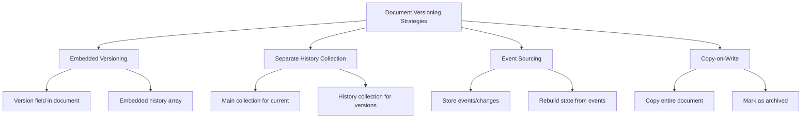
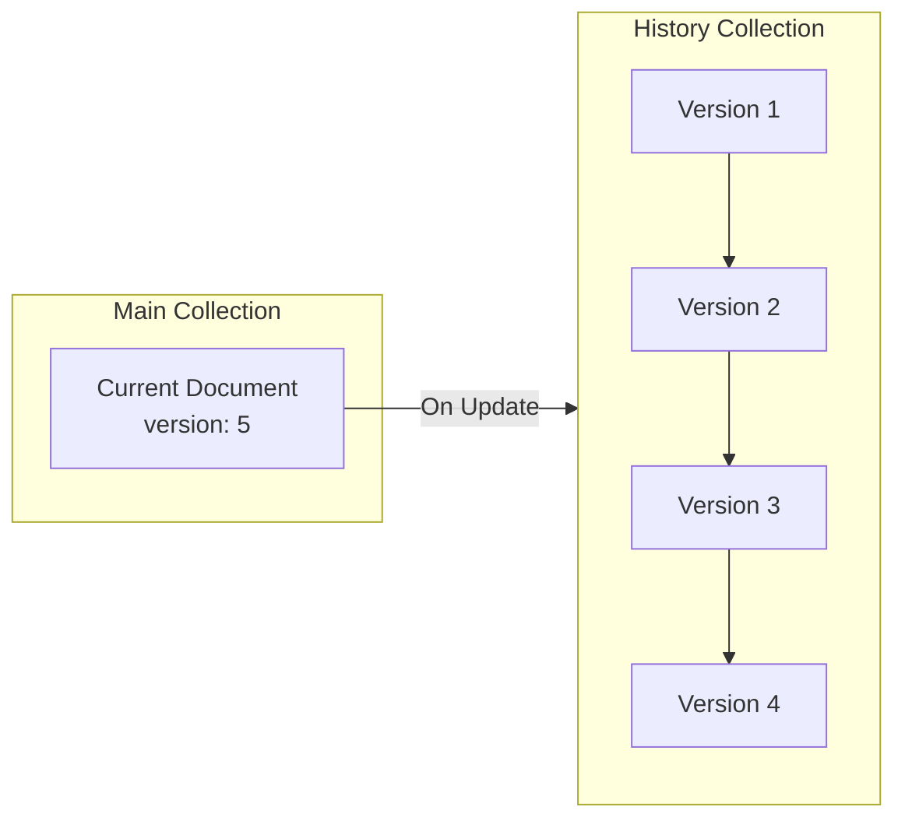
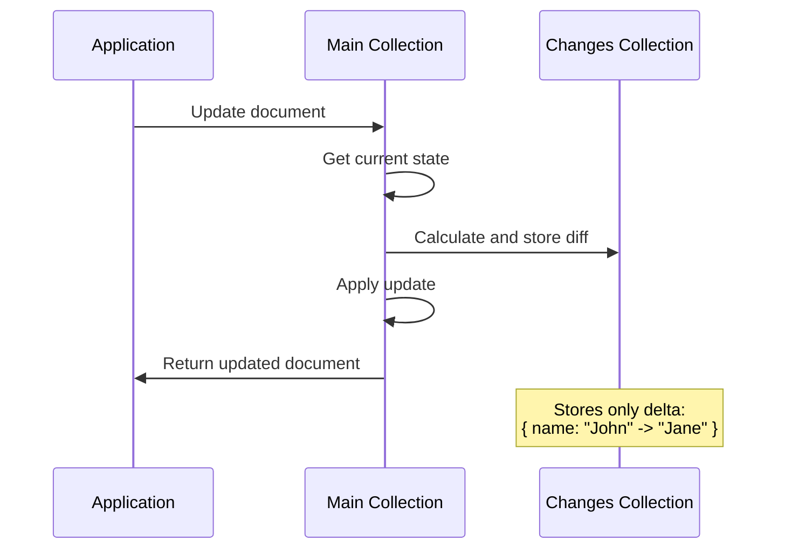
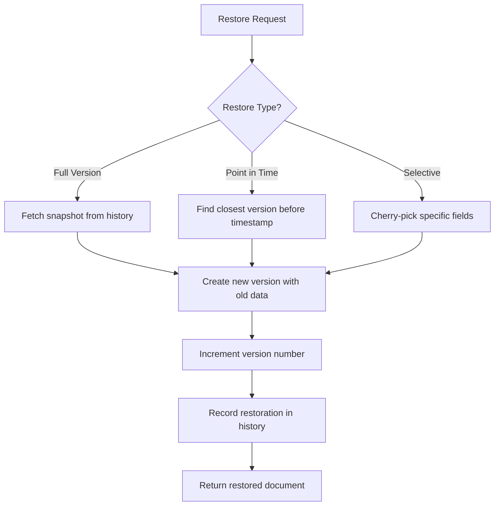
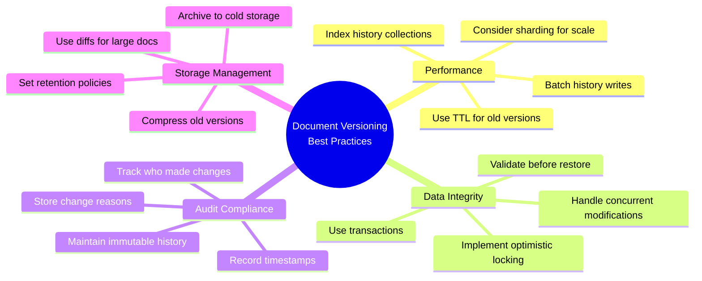

# How to Implement MongoDB Document Versioning

Author: [nawazdhandala](https://github.com/nawazdhandala)

Tags: MongoDB, Document Versioning, Audit Trail, History

Description: Learn to implement document versioning for maintaining history with version numbers, change tracking, and point-in-time queries.

---

Document versioning is essential for applications that require audit trails, compliance, or the ability to restore previous states. In this guide, we will explore different strategies for implementing document versioning in MongoDB, complete with practical code examples and best practices.

## Why Document Versioning Matters

Before diving into implementation, let us understand why document versioning is crucial:

- **Audit Compliance**: Many industries require a complete history of data changes for regulatory compliance
- **Data Recovery**: Ability to restore documents to any previous state
- **Change Tracking**: Understanding who changed what and when
- **Debugging**: Tracing issues back to specific changes in your data

## Versioning Strategies Overview

There are several approaches to implementing document versioning in MongoDB. Let us examine each one.



## Strategy 1: Embedded Version Field

The simplest approach is adding a version field directly to your documents.

### Schema Design

```javascript
// User document with embedded versioning
{
  _id: ObjectId("507f1f77bcf86cd799439011"),
  email: "john@example.com",
  name: "John Doe",
  role: "admin",
  __v: 3,  // Version number
  __lastModified: ISODate("2026-01-30T10:30:00Z"),
  __modifiedBy: ObjectId("507f1f77bcf86cd799439012")
}
```

### Implementation

```javascript
// MongoDB Node.js driver implementation
const { MongoClient, ObjectId } = require('mongodb');

class VersionedDocument {
  constructor(collection) {
    this.collection = collection;
  }

  async create(document, userId) {
    const versionedDoc = {
      ...document,
      __v: 1,
      __createdAt: new Date(),
      __createdBy: userId,
      __lastModified: new Date(),
      __modifiedBy: userId
    };

    const result = await this.collection.insertOne(versionedDoc);
    return result;
  }

  async update(id, updates, userId) {
    // Use optimistic locking with version check
    const currentDoc = await this.collection.findOne({ _id: new ObjectId(id) });

    if (!currentDoc) {
      throw new Error('Document not found');
    }

    const result = await this.collection.findOneAndUpdate(
      {
        _id: new ObjectId(id),
        __v: currentDoc.__v  // Ensure version matches
      },
      {
        $set: {
          ...updates,
          __lastModified: new Date(),
          __modifiedBy: userId
        },
        $inc: { __v: 1 }
      },
      { returnDocument: 'after' }
    );

    if (!result) {
      throw new Error('Concurrent modification detected - please retry');
    }

    return result;
  }
}

// Usage example
const client = new MongoClient('mongodb://localhost:27017');
await client.connect();

const db = client.db('myapp');
const users = new VersionedDocument(db.collection('users'));

// Create a new user
await users.create({
  email: 'john@example.com',
  name: 'John Doe',
  role: 'user'
}, userId);

// Update with version control
await users.update(userId, { role: 'admin' }, adminUserId);
```

## Strategy 2: Separate History Collection

This approach maintains current documents in one collection and historical versions in another.



### Schema Design

```javascript
// Main collection - users
{
  _id: ObjectId("507f1f77bcf86cd799439011"),
  email: "john@example.com",
  name: "John Smith",  // Updated name
  role: "admin",
  __v: 3,
  __lastModified: ISODate("2026-01-30T10:30:00Z")
}

// History collection - users_history
{
  _id: ObjectId("..."),
  __docId: ObjectId("507f1f77bcf86cd799439011"),  // Reference to main doc
  __v: 2,
  __timestamp: ISODate("2026-01-29T15:00:00Z"),
  __modifiedBy: ObjectId("..."),
  __operation: "update",

  // Snapshot of the document at this version
  snapshot: {
    email: "john@example.com",
    name: "John Doe",  // Previous name
    role: "admin"
  }
}
```

### Complete Implementation

```javascript
class HistoryTrackedCollection {
  constructor(db, collectionName) {
    this.mainCollection = db.collection(collectionName);
    this.historyCollection = db.collection(`${collectionName}_history`);
  }

  async create(document, userId) {
    const session = this.mainCollection.client.startSession();

    try {
      await session.withTransaction(async () => {
        const now = new Date();
        const versionedDoc = {
          ...document,
          __v: 1,
          __createdAt: now,
          __createdBy: userId,
          __lastModified: now,
          __modifiedBy: userId
        };

        const result = await this.mainCollection.insertOne(versionedDoc, { session });

        // Record creation in history
        await this.historyCollection.insertOne({
          __docId: result.insertedId,
          __v: 1,
          __timestamp: now,
          __modifiedBy: userId,
          __operation: 'create',
          snapshot: document
        }, { session });

        return result;
      });
    } finally {
      await session.endSession();
    }
  }

  async update(id, updates, userId) {
    const session = this.mainCollection.client.startSession();

    try {
      let result;
      await session.withTransaction(async () => {
        const currentDoc = await this.mainCollection.findOne(
          { _id: new ObjectId(id) },
          { session }
        );

        if (!currentDoc) {
          throw new Error('Document not found');
        }

        // Save current state to history before updating
        const { _id, __v, __createdAt, __createdBy, __lastModified, __modifiedBy, ...snapshot } = currentDoc;

        await this.historyCollection.insertOne({
          __docId: currentDoc._id,
          __v: currentDoc.__v,
          __timestamp: currentDoc.__lastModified,
          __modifiedBy: currentDoc.__modifiedBy,
          __operation: 'update',
          snapshot
        }, { session });

        // Update the main document
        const now = new Date();
        result = await this.mainCollection.findOneAndUpdate(
          { _id: new ObjectId(id) },
          {
            $set: {
              ...updates,
              __lastModified: now,
              __modifiedBy: userId
            },
            $inc: { __v: 1 }
          },
          { returnDocument: 'after', session }
        );
      });

      return result;
    } finally {
      await session.endSession();
    }
  }

  async delete(id, userId) {
    const session = this.mainCollection.client.startSession();

    try {
      await session.withTransaction(async () => {
        const currentDoc = await this.mainCollection.findOne(
          { _id: new ObjectId(id) },
          { session }
        );

        if (!currentDoc) {
          throw new Error('Document not found');
        }

        // Save final state to history
        const { _id, __v, __createdAt, __createdBy, __lastModified, __modifiedBy, ...snapshot } = currentDoc;

        await this.historyCollection.insertOne({
          __docId: currentDoc._id,
          __v: currentDoc.__v + 1,
          __timestamp: new Date(),
          __modifiedBy: userId,
          __operation: 'delete',
          snapshot
        }, { session });

        await this.mainCollection.deleteOne({ _id: new ObjectId(id) }, { session });
      });
    } finally {
      await session.endSession();
    }
  }

  // Get complete history for a document
  async getHistory(id) {
    return await this.historyCollection
      .find({ __docId: new ObjectId(id) })
      .sort({ __v: 1 })
      .toArray();
  }

  // Get document at a specific version
  async getVersion(id, version) {
    return await this.historyCollection.findOne({
      __docId: new ObjectId(id),
      __v: version
    });
  }

  // Get document at a specific point in time
  async getAtTime(id, timestamp) {
    return await this.historyCollection.findOne(
      {
        __docId: new ObjectId(id),
        __timestamp: { $lte: timestamp }
      },
      { sort: { __timestamp: -1 } }
    );
  }
}
```

## Strategy 3: Change Tracking with Diffs

Instead of storing complete snapshots, store only the changes between versions.



### Implementation with Deep Diff

```javascript
const deepDiff = require('deep-diff');

class ChangeTrackingCollection {
  constructor(db, collectionName) {
    this.mainCollection = db.collection(collectionName);
    this.changesCollection = db.collection(`${collectionName}_changes`);
  }

  async update(id, updates, userId, reason = null) {
    const session = this.mainCollection.client.startSession();

    try {
      let result;
      await session.withTransaction(async () => {
        const currentDoc = await this.mainCollection.findOne(
          { _id: new ObjectId(id) },
          { session }
        );

        if (!currentDoc) {
          throw new Error('Document not found');
        }

        // Calculate the diff
        const { _id, __v, __createdAt, __createdBy, __lastModified, __modifiedBy, ...currentData } = currentDoc;
        const mergedData = { ...currentData, ...updates };
        const differences = deepDiff(currentData, mergedData);

        if (!differences || differences.length === 0) {
          return currentDoc; // No changes
        }

        // Store the changes
        await this.changesCollection.insertOne({
          __docId: currentDoc._id,
          __v: currentDoc.__v,
          __timestamp: new Date(),
          __modifiedBy: userId,
          __reason: reason,
          changes: differences.map(diff => ({
            kind: diff.kind,  // N: new, D: deleted, E: edited, A: array
            path: diff.path,
            oldValue: diff.lhs,
            newValue: diff.rhs
          }))
        }, { session });

        // Apply the update
        const now = new Date();
        result = await this.mainCollection.findOneAndUpdate(
          { _id: new ObjectId(id) },
          {
            $set: {
              ...updates,
              __lastModified: now,
              __modifiedBy: userId
            },
            $inc: { __v: 1 }
          },
          { returnDocument: 'after', session }
        );
      });

      return result;
    } finally {
      await session.endSession();
    }
  }

  // Get human-readable change log
  async getChangeLog(id) {
    const changes = await this.changesCollection
      .find({ __docId: new ObjectId(id) })
      .sort({ __timestamp: -1 })
      .toArray();

    return changes.map(change => ({
      version: change.__v,
      timestamp: change.__timestamp,
      modifiedBy: change.__modifiedBy,
      reason: change.__reason,
      changes: change.changes.map(c => {
        const path = c.path.join('.');
        switch (c.kind) {
          case 'E':
            return `Changed ${path} from "${c.oldValue}" to "${c.newValue}"`;
          case 'N':
            return `Added ${path}: "${c.newValue}"`;
          case 'D':
            return `Removed ${path} (was "${c.oldValue}")`;
          case 'A':
            return `Modified array at ${path}`;
          default:
            return `Unknown change at ${path}`;
        }
      })
    }));
  }
}

// Usage
const users = new ChangeTrackingCollection(db, 'users');

await users.update(
  userId,
  { role: 'admin', permissions: ['read', 'write', 'delete'] },
  adminId,
  'Promoted to admin per ticket #12345'
);

const log = await users.getChangeLog(userId);
console.log(log);
// Output:
// [
//   {
//     version: 2,
//     timestamp: 2026-01-30T10:30:00Z,
//     modifiedBy: ObjectId("..."),
//     reason: "Promoted to admin per ticket #12345",
//     changes: [
//       'Changed role from "user" to "admin"',
//       'Added permissions: "read,write,delete"'
//     ]
//   }
// ]
```

## Restoring Previous Versions

A critical feature of any versioning system is the ability to restore documents to a previous state.



### Restoration Implementation

```javascript
class RestorableCollection extends HistoryTrackedCollection {

  // Restore to a specific version
  async restoreToVersion(id, targetVersion, userId, reason = null) {
    const session = this.mainCollection.client.startSession();

    try {
      let result;
      await session.withTransaction(async () => {
        // Get the target version from history
        const targetState = await this.historyCollection.findOne({
          __docId: new ObjectId(id),
          __v: targetVersion
        }, { session });

        if (!targetState) {
          throw new Error(`Version ${targetVersion} not found`);
        }

        // Get current document
        const currentDoc = await this.mainCollection.findOne(
          { _id: new ObjectId(id) },
          { session }
        );

        if (!currentDoc) {
          throw new Error('Document not found or has been deleted');
        }

        // Save current state to history
        const { _id, __v, __createdAt, __createdBy, __lastModified, __modifiedBy, ...snapshot } = currentDoc;

        await this.historyCollection.insertOne({
          __docId: currentDoc._id,
          __v: currentDoc.__v,
          __timestamp: currentDoc.__lastModified,
          __modifiedBy: currentDoc.__modifiedBy,
          __operation: 'update',
          __restorationNote: `Before restoration to version ${targetVersion}`,
          snapshot
        }, { session });

        // Restore the document
        const now = new Date();
        result = await this.mainCollection.findOneAndUpdate(
          { _id: new ObjectId(id) },
          {
            $set: {
              ...targetState.snapshot,
              __lastModified: now,
              __modifiedBy: userId,
              __restoredFrom: targetVersion,
              __restorationReason: reason
            },
            $inc: { __v: 1 }
          },
          { returnDocument: 'after', session }
        );

        // Record restoration in history
        await this.historyCollection.insertOne({
          __docId: new ObjectId(id),
          __v: result.__v,
          __timestamp: now,
          __modifiedBy: userId,
          __operation: 'restore',
          __restoredFrom: targetVersion,
          __reason: reason,
          snapshot: targetState.snapshot
        }, { session });
      });

      return result;
    } finally {
      await session.endSession();
    }
  }

  // Restore to a specific point in time
  async restoreToPointInTime(id, timestamp, userId, reason = null) {
    const targetState = await this.getAtTime(id, timestamp);

    if (!targetState) {
      throw new Error(`No version found before ${timestamp}`);
    }

    return this.restoreToVersion(id, targetState.__v, userId,
      reason || `Restored to state at ${timestamp.toISOString()}`);
  }

  // Selective field restoration
  async restoreFields(id, targetVersion, fields, userId, reason = null) {
    const session = this.mainCollection.client.startSession();

    try {
      let result;
      await session.withTransaction(async () => {
        const targetState = await this.historyCollection.findOne({
          __docId: new ObjectId(id),
          __v: targetVersion
        }, { session });

        if (!targetState) {
          throw new Error(`Version ${targetVersion} not found`);
        }

        // Extract only specified fields from target version
        const fieldsToRestore = {};
        fields.forEach(field => {
          if (targetState.snapshot.hasOwnProperty(field)) {
            fieldsToRestore[field] = targetState.snapshot[field];
          }
        });

        // Update using standard update method which handles history
        result = await this.update(id, fieldsToRestore, userId);
      });

      return result;
    } finally {
      await session.endSession();
    }
  }
}

// Usage examples
const users = new RestorableCollection(db, 'users');

// Restore to version 3
await users.restoreToVersion(
  userId,
  3,
  adminId,
  'Rolling back accidental permission change'
);

// Restore to yesterday at noon
await users.restoreToPointInTime(
  userId,
  new Date('2026-01-29T12:00:00Z'),
  adminId
);

// Restore only specific fields
await users.restoreFields(
  userId,
  2,
  ['email', 'name'],  // Only restore these fields
  adminId,
  'Restoring contact information from backup'
);
```

## Indexing for Performance

Proper indexing is crucial for versioned collections to maintain query performance.

```javascript
async function createVersioningIndexes(db, collectionName) {
  const historyCollection = db.collection(`${collectionName}_history`);
  const changesCollection = db.collection(`${collectionName}_changes`);

  // History collection indexes
  await historyCollection.createIndexes([
    // Primary lookup - document history
    { key: { __docId: 1, __v: -1 }, name: 'docId_version' },

    // Point-in-time queries
    { key: { __docId: 1, __timestamp: -1 }, name: 'docId_timestamp' },

    // Audit queries by user
    { key: { __modifiedBy: 1, __timestamp: -1 }, name: 'modifiedBy_timestamp' },

    // Operation type queries
    { key: { __operation: 1, __timestamp: -1 }, name: 'operation_timestamp' },

    // TTL index for automatic cleanup (optional - 2 years retention)
    {
      key: { __timestamp: 1 },
      name: 'timestamp_ttl',
      expireAfterSeconds: 63072000  // 2 years
    }
  ]);

  // Changes collection indexes (if using diff-based tracking)
  await changesCollection.createIndexes([
    { key: { __docId: 1, __timestamp: -1 }, name: 'docId_timestamp' },
    { key: { __modifiedBy: 1, __timestamp: -1 }, name: 'modifiedBy_timestamp' },
    { key: { 'changes.path': 1, __timestamp: -1 }, name: 'changePath_timestamp' }
  ]);

  console.log('Versioning indexes created successfully');
}
```

## Query Patterns for Audit Trails

Here are common query patterns for audit trail functionality.

```javascript
class AuditQueries {
  constructor(historyCollection, changesCollection) {
    this.history = historyCollection;
    this.changes = changesCollection;
  }

  // Get all changes made by a specific user
  async getChangesByUser(userId, startDate, endDate) {
    return await this.history.find({
      __modifiedBy: new ObjectId(userId),
      __timestamp: {
        $gte: startDate,
        $lte: endDate
      }
    }).sort({ __timestamp: -1 }).toArray();
  }

  // Get all documents modified in a time range
  async getModifiedDocuments(startDate, endDate) {
    return await this.history.aggregate([
      {
        $match: {
          __timestamp: { $gte: startDate, $lte: endDate }
        }
      },
      {
        $group: {
          _id: '$__docId',
          changeCount: { $sum: 1 },
          firstChange: { $min: '$__timestamp' },
          lastChange: { $max: '$__timestamp' },
          users: { $addToSet: '$__modifiedBy' }
        }
      },
      {
        $sort: { changeCount: -1 }
      }
    ]).toArray();
  }

  // Find when a specific field was changed
  async findFieldChanges(docId, fieldPath) {
    return await this.changes.find({
      __docId: new ObjectId(docId),
      'changes.path': fieldPath
    }).sort({ __timestamp: -1 }).toArray();
  }

  // Compare two versions
  async compareVersions(docId, versionA, versionB) {
    const [docA, docB] = await Promise.all([
      this.history.findOne({ __docId: new ObjectId(docId), __v: versionA }),
      this.history.findOne({ __docId: new ObjectId(docId), __v: versionB })
    ]);

    if (!docA || !docB) {
      throw new Error('One or both versions not found');
    }

    const deepDiff = require('deep-diff');
    const differences = deepDiff(docA.snapshot, docB.snapshot);

    return {
      versionA: { version: versionA, timestamp: docA.__timestamp },
      versionB: { version: versionB, timestamp: docB.__timestamp },
      differences: differences || []
    };
  }

  // Generate audit report
  async generateAuditReport(docId) {
    const history = await this.history
      .find({ __docId: new ObjectId(docId) })
      .sort({ __v: 1 })
      .toArray();

    return {
      documentId: docId,
      totalVersions: history.length,
      created: history[0] ? {
        timestamp: history[0].__timestamp,
        by: history[0].__modifiedBy
      } : null,
      lastModified: history[history.length - 1] ? {
        timestamp: history[history.length - 1].__timestamp,
        by: history[history.length - 1].__modifiedBy
      } : null,
      timeline: history.map(h => ({
        version: h.__v,
        operation: h.__operation,
        timestamp: h.__timestamp,
        modifiedBy: h.__modifiedBy,
        reason: h.__reason || null
      }))
    };
  }
}
```

## Mongoose Integration

If you are using Mongoose, here is how to implement versioning as a plugin.

```javascript
const mongoose = require('mongoose');

function versioningPlugin(schema, options = {}) {
  const historyCollectionName = options.historyCollection ||
    `${options.collection || 'documents'}_history`;

  // Add versioning fields to schema
  schema.add({
    __v: { type: Number, default: 1 },
    __lastModified: { type: Date, default: Date.now },
    __modifiedBy: { type: mongoose.Schema.Types.ObjectId, ref: 'User' }
  });

  // Pre-save middleware
  schema.pre('save', async function(next) {
    if (this.isNew) {
      this.__v = 1;
      this.__lastModified = new Date();
      next();
      return;
    }

    // Get the original document
    const original = await this.constructor.findById(this._id).lean();

    if (original) {
      // Save to history
      const History = mongoose.connection.collection(historyCollectionName);
      const { _id, __v, __lastModified, __modifiedBy, ...snapshot } = original;

      await History.insertOne({
        __docId: this._id,
        __v: original.__v,
        __timestamp: original.__lastModified,
        __modifiedBy: original.__modifiedBy,
        __operation: 'update',
        snapshot
      });

      // Increment version
      this.__v = (original.__v || 0) + 1;
      this.__lastModified = new Date();
    }

    next();
  });

  // Pre-remove middleware
  schema.pre('remove', async function(next) {
    const History = mongoose.connection.collection(historyCollectionName);
    const { _id, __v, __lastModified, __modifiedBy, ...snapshot } = this.toObject();

    await History.insertOne({
      __docId: this._id,
      __v: this.__v + 1,
      __timestamp: new Date(),
      __modifiedBy: this.__modifiedBy,
      __operation: 'delete',
      snapshot
    });

    next();
  });

  // Instance method to get history
  schema.methods.getHistory = async function() {
    const History = mongoose.connection.collection(historyCollectionName);
    return await History
      .find({ __docId: this._id })
      .sort({ __v: 1 })
      .toArray();
  };

  // Instance method to restore version
  schema.methods.restoreToVersion = async function(version, userId) {
    const History = mongoose.connection.collection(historyCollectionName);
    const targetVersion = await History.findOne({
      __docId: this._id,
      __v: version
    });

    if (!targetVersion) {
      throw new Error(`Version ${version} not found`);
    }

    Object.assign(this, targetVersion.snapshot);
    this.__modifiedBy = userId;

    return await this.save();
  };
}

// Usage with Mongoose
const userSchema = new mongoose.Schema({
  email: String,
  name: String,
  role: String
});

userSchema.plugin(versioningPlugin, {
  collection: 'users',
  historyCollection: 'users_history'
});

const User = mongoose.model('User', userSchema);

// Now all User operations are automatically versioned
const user = await User.findById(userId);
user.role = 'admin';
user.__modifiedBy = adminUserId;
await user.save();  // Automatically creates history entry

const history = await user.getHistory();
await user.restoreToVersion(2, adminUserId);
```

## Best Practices Summary



### Key Takeaways

1. **Choose the right strategy**: Embedded versioning for simple cases, separate collections for full audit trails, and diffs for large documents with frequent changes.

2. **Always use transactions**: When updating both main and history collections, wrap operations in transactions to ensure consistency.

3. **Index appropriately**: Create indexes on document ID, version, timestamp, and user fields in your history collections.

4. **Plan for scale**: Consider TTL indexes, archival strategies, and sharding for high-volume applications.

5. **Track context**: Store not just what changed, but who made the change, when, and ideally why.

6. **Test restoration**: Regularly verify that your restoration logic works correctly - it is critical during actual recovery scenarios.

## Conclusion

Document versioning in MongoDB provides a robust foundation for audit trails, compliance requirements, and data recovery capabilities. By implementing one of the strategies outlined in this guide, you can ensure complete traceability of your data changes while maintaining the flexibility that MongoDB offers.

The choice between strategies depends on your specific requirements - whether you prioritize storage efficiency, query performance, or implementation simplicity. Regardless of the approach, proper indexing and transaction management are essential for a production-ready implementation.

Start with the strategy that best fits your needs, and remember that you can always evolve your versioning approach as your application grows and requirements change.
