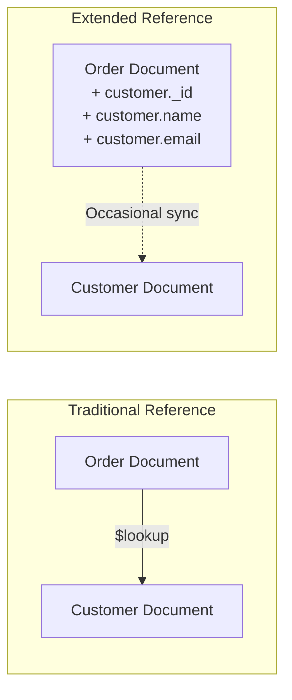
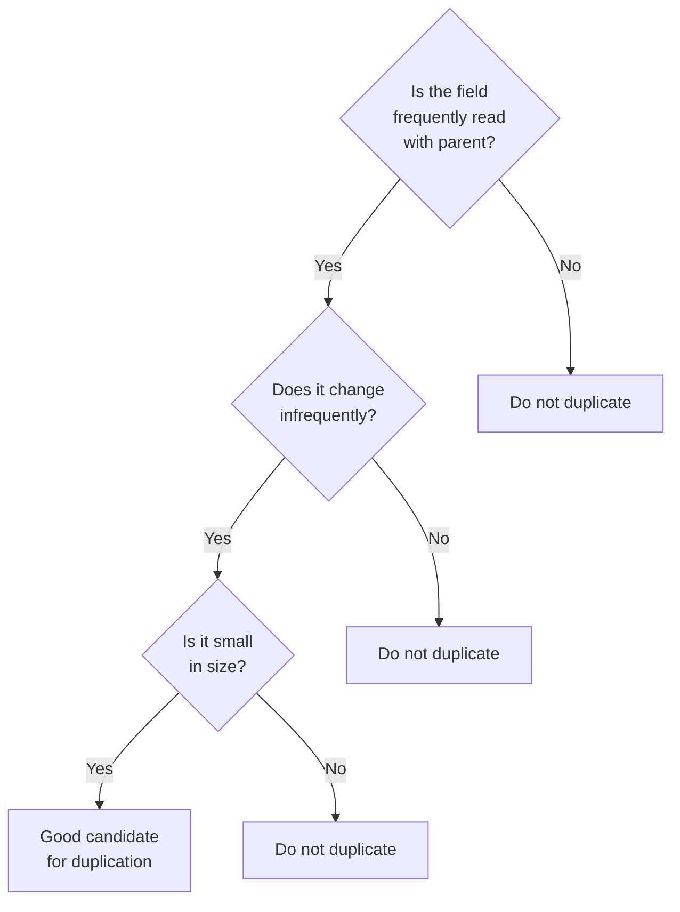
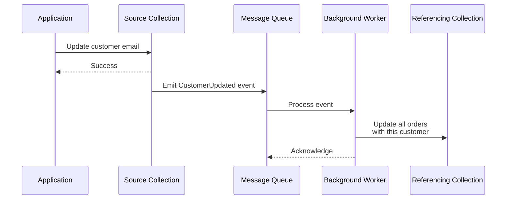
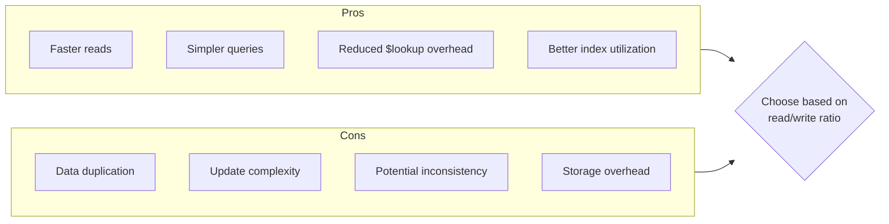

# How to Implement MongoDB Extended Reference Patterns

Author: [nawazdhandala](https://github.com/nawazdhandala)

Tags: MongoDB, Extended Reference, Denormalization, Schema Design

Description: Learn to implement extended reference patterns for duplicating frequently accessed fields to reduce joins while managing data consistency.

---

When building applications with MongoDB, you will often face the classic trade-off between normalized data (requiring joins via `$lookup`) and fully embedded documents (risking data duplication and bloat). The **Extended Reference Pattern** offers a middle ground - you copy only the most frequently accessed fields from a referenced document into the parent document, reducing the need for joins while keeping duplication manageable.

## What is the Extended Reference Pattern?

The Extended Reference Pattern is a denormalization strategy where you store a subset of fields from a related document directly within the referencing document. Instead of embedding the entire related document or only storing its `_id`, you include just enough data to satisfy most read queries without performing a join.



## When to Use Extended References

Consider using this pattern when:

- You frequently read data from related documents together
- Only a small subset of the related document fields are needed
- The duplicated fields change infrequently
- Read performance is more critical than write performance
- You want to avoid the overhead of `$lookup` aggregations

## Selecting the Right Fields

Choosing which fields to duplicate is crucial. Follow these guidelines:

### Good Candidates for Duplication

- **Display fields**: Names, titles, labels - data shown in UI lists
- **Stable identifiers**: Slugs, codes, SKUs that rarely change
- **Computed summaries**: Counts, totals that change predictably
- **Timestamps**: Creation dates, version numbers

### Poor Candidates for Duplication

- **Frequently changing data**: Inventory counts, real-time metrics
- **Large text fields**: Descriptions, content bodies
- **Sensitive data**: Passwords, tokens, PII that requires strict access control
- **Nested arrays**: Complex structures that are hard to keep in sync



## Implementation Example

Let us walk through a practical example of an e-commerce system with orders referencing customers and products.

### Step 1: Define Your Source Documents

First, define your canonical source documents:

```javascript
// customers collection - the source of truth for customer data
{
  _id: ObjectId("customer123"),
  email: "john.doe@example.com",
  firstName: "John",
  lastName: "Doe",
  phone: "+1-555-0123",
  addresses: [
    {
      type: "shipping",
      street: "123 Main St",
      city: "Boston",
      state: "MA",
      zip: "02101"
    }
  ],
  preferences: {
    newsletter: true,
    smsAlerts: false
  },
  createdAt: ISODate("2024-01-15T10:30:00Z"),
  updatedAt: ISODate("2025-06-20T14:45:00Z")
}

// products collection - the source of truth for product data
{
  _id: ObjectId("product456"),
  sku: "LAPTOP-PRO-15",
  name: "ProBook Laptop 15 inch",
  description: "High-performance laptop with...", // Long description
  price: 1299.99,
  category: "Electronics",
  inventory: 45,  // Changes frequently
  images: ["img1.jpg", "img2.jpg", "img3.jpg"],
  specifications: {
    cpu: "Intel i7",
    ram: "16GB",
    storage: "512GB SSD"
  },
  createdAt: ISODate("2024-03-01T08:00:00Z"),
  updatedAt: ISODate("2025-12-01T16:20:00Z")
}
```

### Step 2: Design the Extended Reference

Now create an order document with extended references:

```javascript
// orders collection - uses extended references
{
  _id: ObjectId("order789"),
  orderNumber: "ORD-2025-001234",
  status: "shipped",

  // Extended reference to customer - only essential display fields
  customer: {
    _id: ObjectId("customer123"),  // Always keep the reference ID
    email: "john.doe@example.com",
    name: "John Doe"  // Combined for display convenience
  },

  // Extended reference to products in line items
  items: [
    {
      product: {
        _id: ObjectId("product456"),  // Always keep the reference ID
        sku: "LAPTOP-PRO-15",
        name: "ProBook Laptop 15 inch",
        priceAtPurchase: 1299.99  // Snapshot of price when ordered
      },
      quantity: 1
    }
  ],

  // Shipping address copied at order time - intentionally denormalized
  shippingAddress: {
    street: "123 Main St",
    city: "Boston",
    state: "MA",
    zip: "02101"
  },

  totals: {
    subtotal: 1299.99,
    tax: 84.50,
    shipping: 0,
    total: 1384.49
  },

  createdAt: ISODate("2025-12-15T11:30:00Z"),
  updatedAt: ISODate("2025-12-16T09:15:00Z")
}
```

### Step 3: Create Helper Functions

Build utility functions to manage extended references:

```javascript
// Helper to extract extended reference from a full document
function createCustomerReference(customer) {
  return {
    _id: customer._id,
    email: customer.email,
    name: `${customer.firstName} ${customer.lastName}`
  };
}

function createProductReference(product, priceOverride = null) {
  return {
    _id: product._id,
    sku: product.sku,
    name: product.name,
    priceAtPurchase: priceOverride || product.price
  };
}

// Usage when creating an order
async function createOrder(customerId, cartItems) {
  const db = client.db("ecommerce");

  // Fetch the full customer document
  const customer = await db.collection("customers").findOne({
    _id: new ObjectId(customerId)
  });

  // Fetch all products in the cart
  const productIds = cartItems.map(item => new ObjectId(item.productId));
  const products = await db.collection("products").find({
    _id: { $in: productIds }
  }).toArray();

  // Build product lookup map
  const productMap = new Map(products.map(p => [p._id.toString(), p]));

  // Create order with extended references
  const order = {
    orderNumber: generateOrderNumber(),
    status: "pending",
    customer: createCustomerReference(customer),
    items: cartItems.map(item => {
      const product = productMap.get(item.productId);
      return {
        product: createProductReference(product),
        quantity: item.quantity
      };
    }),
    shippingAddress: customer.addresses.find(a => a.type === "shipping"),
    createdAt: new Date(),
    updatedAt: new Date()
  };

  const result = await db.collection("orders").insertOne(order);
  return result;
}
```

## Update Strategies

Managing updates to duplicated data is the most challenging aspect of extended references. Here are three common strategies:

### Strategy 1: Eventual Consistency with Background Jobs

Use background jobs to propagate changes asynchronously:



```javascript
// Event handler for customer updates
async function handleCustomerUpdated(event) {
  const { customerId, changes } = event;

  // Only propagate if extended reference fields changed
  const relevantFields = ['email', 'firstName', 'lastName'];
  const hasRelevantChanges = relevantFields.some(
    field => changes.hasOwnProperty(field)
  );

  if (!hasRelevantChanges) {
    return; // No need to update references
  }

  const db = client.db("ecommerce");

  // Fetch updated customer
  const customer = await db.collection("customers").findOne({
    _id: new ObjectId(customerId)
  });

  // Update all orders with this customer
  const updateResult = await db.collection("orders").updateMany(
    { "customer._id": new ObjectId(customerId) },
    {
      $set: {
        "customer.email": customer.email,
        "customer.name": `${customer.firstName} ${customer.lastName}`,
        updatedAt: new Date()
      }
    }
  );

  console.log(`Updated ${updateResult.modifiedCount} orders`);
}
```

### Strategy 2: Synchronous Updates with Transactions

For strong consistency requirements, use transactions:

```javascript
async function updateCustomerEmail(customerId, newEmail) {
  const session = client.startSession();

  try {
    await session.withTransaction(async () => {
      const db = client.db("ecommerce");

      // Update the source document
      await db.collection("customers").updateOne(
        { _id: new ObjectId(customerId) },
        {
          $set: {
            email: newEmail,
            updatedAt: new Date()
          }
        },
        { session }
      );

      // Update all extended references
      await db.collection("orders").updateMany(
        { "customer._id": new ObjectId(customerId) },
        {
          $set: {
            "customer.email": newEmail,
            updatedAt: new Date()
          }
        },
        { session }
      );
    });

    console.log("Customer and all references updated atomically");
  } finally {
    await session.endSession();
  }
}
```

### Strategy 3: Change Streams for Real-time Propagation

Use MongoDB Change Streams to react to changes in real-time:

```javascript
async function startCustomerChangeStream() {
  const db = client.db("ecommerce");
  const customersCollection = db.collection("customers");

  // Watch for updates to customer documents
  const changeStream = customersCollection.watch([
    {
      $match: {
        operationType: "update",
        // Only react to changes in fields we care about
        $or: [
          { "updateDescription.updatedFields.email": { $exists: true } },
          { "updateDescription.updatedFields.firstName": { $exists: true } },
          { "updateDescription.updatedFields.lastName": { $exists: true } }
        ]
      }
    }
  ]);

  changeStream.on("change", async (change) => {
    const customerId = change.documentKey._id;
    const updatedFields = change.updateDescription.updatedFields;

    // Build the update object for extended references
    const refUpdate = {};

    if (updatedFields.email) {
      refUpdate["customer.email"] = updatedFields.email;
    }

    if (updatedFields.firstName || updatedFields.lastName) {
      // Need to fetch the full name since we store combined
      const customer = await customersCollection.findOne({ _id: customerId });
      refUpdate["customer.name"] = `${customer.firstName} ${customer.lastName}`;
    }

    if (Object.keys(refUpdate).length > 0) {
      refUpdate.updatedAt = new Date();

      await db.collection("orders").updateMany(
        { "customer._id": customerId },
        { $set: refUpdate }
      );
    }
  });

  console.log("Customer change stream started");
}
```

## Consistency Management

### Versioning Extended References

Add version numbers to detect stale data:

```javascript
// Source document with version
{
  _id: ObjectId("customer123"),
  email: "john.doe@example.com",
  firstName: "John",
  lastName: "Doe",
  _version: 5,  // Increment on each update
  updatedAt: ISODate("2025-06-20T14:45:00Z")
}

// Extended reference includes version
{
  _id: ObjectId("order789"),
  customer: {
    _id: ObjectId("customer123"),
    email: "john.doe@example.com",
    name: "John Doe",
    _version: 5  // Version when reference was last synced
  }
}
```

```javascript
// Check if reference is stale
async function isCustomerReferenceStale(order) {
  const db = client.db("ecommerce");

  const customer = await db.collection("customers").findOne(
    { _id: order.customer._id },
    { projection: { _version: 1 } }
  );

  return customer._version > order.customer._version;
}

// Refresh stale reference on read if needed
async function getOrderWithFreshCustomer(orderId) {
  const db = client.db("ecommerce");

  const order = await db.collection("orders").findOne({
    _id: new ObjectId(orderId)
  });

  if (await isCustomerReferenceStale(order)) {
    // Fetch fresh customer data
    const customer = await db.collection("customers").findOne({
      _id: order.customer._id
    });

    // Update the reference
    const freshRef = createCustomerReference(customer);
    freshRef._version = customer._version;

    await db.collection("orders").updateOne(
      { _id: order._id },
      { $set: { customer: freshRef, updatedAt: new Date() } }
    );

    order.customer = freshRef;
  }

  return order;
}
```

### Audit Trail for Debugging

Track when references were last synchronized:

```javascript
{
  _id: ObjectId("order789"),
  customer: {
    _id: ObjectId("customer123"),
    email: "john.doe@example.com",
    name: "John Doe",
    _syncedAt: ISODate("2025-12-16T09:15:00Z"),
    _syncedFrom: "change-stream-worker"
  }
}
```

## Querying Extended References

One of the main benefits is simplified queries:

```javascript
// Without extended references - requires $lookup
const ordersWithLookup = await db.collection("orders").aggregate([
  { $match: { status: "shipped" } },
  {
    $lookup: {
      from: "customers",
      localField: "customerId",
      foreignField: "_id",
      as: "customer"
    }
  },
  { $unwind: "$customer" },
  {
    $project: {
      orderNumber: 1,
      "customer.email": 1,
      "customer.firstName": 1,
      "customer.lastName": 1
    }
  }
]).toArray();

// With extended references - simple find
const ordersWithExtRef = await db.collection("orders").find(
  { status: "shipped" },
  {
    projection: {
      orderNumber: 1,
      "customer.email": 1,
      "customer.name": 1
    }
  }
).toArray();
```

You can also create indexes on extended reference fields:

```javascript
// Index for finding orders by customer email
db.collection("orders").createIndex({ "customer.email": 1 });

// Compound index for customer orders by status
db.collection("orders").createIndex({
  "customer._id": 1,
  status: 1,
  createdAt: -1
});
```

## Trade-offs and Considerations



### When Extended References Excel

| Scenario | Benefit |
|----------|---------|
| High read-to-write ratio | Amortize update cost across many reads |
| Real-time dashboards | Avoid expensive joins on every request |
| List views and summaries | Display essential info without full document fetch |
| Reporting queries | Pre-joined data simplifies aggregations |

### When to Avoid Extended References

| Scenario | Reason |
|----------|--------|
| Frequently changing source data | Update propagation becomes expensive |
| Strong consistency requirements | Eventual consistency may not be acceptable |
| Large duplicated fields | Storage costs outweigh read benefits |
| Infrequent reads of related data | Join overhead is acceptable |

### Performance Comparison

```javascript
// Benchmark helper
async function benchmark(name, fn, iterations = 1000) {
  const start = Date.now();
  for (let i = 0; i < iterations; i++) {
    await fn();
  }
  const duration = Date.now() - start;
  console.log(`${name}: ${duration}ms for ${iterations} iterations`);
  console.log(`Average: ${duration / iterations}ms per operation`);
}

// Compare approaches
await benchmark("With $lookup", async () => {
  await db.collection("orders").aggregate([
    { $match: { status: "shipped" } },
    { $limit: 10 },
    { $lookup: { from: "customers", localField: "customerId", foreignField: "_id", as: "customer" } },
    { $unwind: "$customer" }
  ]).toArray();
});

await benchmark("With Extended Reference", async () => {
  await db.collection("orders").find(
    { status: "shipped" },
    { limit: 10 }
  ).toArray();
});
```

## Best Practices Summary

1. **Start conservative**: Begin with minimal duplication and add fields as needed based on actual query patterns.

2. **Always keep the reference ID**: Even with extended references, store the `_id` of the source document for full lookups when needed.

3. **Document your duplicated fields**: Maintain clear documentation of which fields are duplicated and how they are synchronized.

4. **Monitor consistency**: Implement monitoring to detect and alert on stale references.

5. **Plan for schema evolution**: Design your update propagation to handle adding or removing fields from extended references.

6. **Test your update strategies**: Verify that your chosen update strategy handles edge cases like concurrent updates and failures.

7. **Consider hybrid approaches**: Some fields may use eventual consistency while others require synchronous updates.

## Conclusion

The Extended Reference Pattern is a powerful tool for optimizing read performance in MongoDB applications. By carefully selecting which fields to duplicate and implementing robust update strategies, you can significantly reduce query complexity and latency while maintaining acceptable data consistency.

Remember that this pattern introduces complexity in exchange for performance. Always measure the actual impact on your specific workload before and after implementing extended references to ensure the trade-off is worthwhile for your use case.

The key to success is finding the right balance - duplicate just enough to satisfy your most common queries, but not so much that update propagation becomes a burden. Start small, measure results, and iterate based on real-world performance data.
